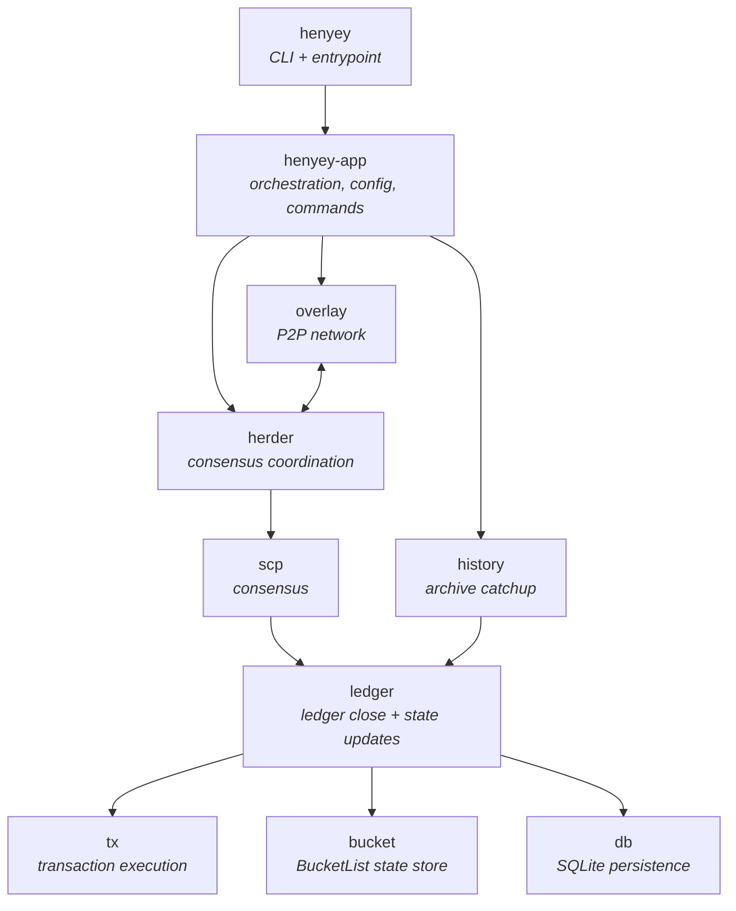

# henyey

A Rust reimplementation of [Stellar Core](https://github.com/stellar/stellar-core) focused on protocol v25 behavior and testnet sync. This is an educational experiment and **not** production-grade software.

## What is Stellar Core?

Stellar Core is the backbone of the [Stellar network](https://stellar.org)—a decentralized payment network. It:

- Validates and processes transactions
- Participates in consensus via the [Stellar Consensus Protocol (SCP)](https://stellar.org/papers/stellar-consensus-protocol)
- Maintains the ledger state (accounts, balances, trustlines, offers, contracts)
- Synchronizes with history archives for catchup and verification

This Rust implementation aims to mirror stellar-core v25.x behavior for educational purposes and to provide an alternative implementation for testing and validation.

## Architecture



Supporting crates: `crypto`, `common`, `work`, `historywork`

## Status

**Work in progress.** Core functionality is implemented:

- Testnet catchup and sync (observer mode)
- SCP consensus participation (validator mode)
- Transaction execution (classic + Soroban)
- History archive replay and verification
- BucketList state management

## Requirements

- **Rust**: 1.76+ (2021 edition)
- **SQLite**: System library (usually pre-installed)
- **Platform**: Linux, macOS (Windows untested)

## Build

```bash
cargo build --release
```

The binary is at `./target/release/henyey`.

## Test

```bash
# Run all tests
cargo test --all

# Run tests for a specific crate
cargo test -p henyey-scp

# Run with output
cargo test --all -- --nocapture
```

## Run

### Observer Mode (Testnet)

An observer syncs the ledger without participating in consensus:

```bash
# Catch up to current ledger
./target/release/henyey --config configs/testnet.toml catchup current

# Run and follow the network
./target/release/henyey --config configs/testnet.toml run
```

### Validator Mode (Testnet)

A validator participates in consensus. Requires a secret key and quorum configuration:

```bash
# Use the validator config
./target/release/henyey --config configs/validator-testnet.toml catchup current
./target/release/henyey --config configs/validator-testnet.toml run
```

### Mainnet

```bash
./target/release/henyey --config configs/mainnet.toml catchup current
./target/release/henyey --config configs/mainnet.toml run
```

## Configuration

Generate a sample config to customize:

```bash
./target/release/henyey sample-config > my-config.toml
```

### Key Configuration Options

```toml
[network]
network_passphrase = "Test SDF Network ; September 2015"

[database]
path = "stellar.db"

[overlay]
listen_port = 11625
max_inbound_peers = 64
max_outbound_peers = 8

[history]
# Archive URLs for catchup
archives = [
    "https://history.stellar.org/prd/core-testnet/core_testnet_001",
    "https://history.stellar.org/prd/core-testnet/core_testnet_002",
]

[validator]
# Required for validator mode
node_seed = "S..."  # Your secret key
node_is_validator = true

[events]
# Classic event emission (off by default)
emit_classic_events = true
backfill_stellar_asset_events = false
```

## Repository Layout

```
henyey/
├── crates/
│   ├── henyey/          # CLI binary
│   ├── henyey-app/         # App orchestration
│   ├── henyey-overlay/     # P2P networking
│   ├── henyey-scp/         # Consensus protocol
│   ├── henyey-herder/      # Consensus coordination
│   ├── henyey-ledger/      # Ledger close pipeline
│   ├── henyey-tx/          # Transaction execution
│   ├── henyey-bucket/      # BucketList state
│   ├── henyey-history/     # History archives
│   ├── henyey-historywork/ # History work scheduling
│   ├── henyey-db/          # SQLite persistence
│   ├── henyey-crypto/      # Cryptographic primitives
│   ├── henyey-common/      # Shared types
│   └── henyey-work/        # Work scheduler
└── configs/                      # Example configurations
```

## Crate Overview

### Core Infrastructure

| Crate | Purpose | Parity |
|-------|---------|--------|
| [`henyey`](crates/henyey/README.md) | CLI entrypoint, argument parsing, command dispatch | [43%](crates/henyey/PARITY_STATUS.md) |
| [`henyey-app`](crates/henyey-app/README.md) | Application wiring, lifecycle management, run/catchup orchestration | [62%](crates/henyey-app/PARITY_STATUS.md) |
| [`henyey-common`](crates/henyey-common/README.md) | Shared types, config helpers, time utilities | [98%](crates/henyey-common/PARITY_STATUS.md) |
| [`henyey-crypto`](crates/henyey-crypto/README.md) | Ed25519 signing, SHA-256 hashing, strkey encoding | [79%](crates/henyey-crypto/PARITY_STATUS.md) |
| [`henyey-db`](crates/henyey-db/README.md) | SQLite schema, migrations, query layer | [94%](crates/henyey-db/PARITY_STATUS.md) |

### Consensus Layer

| Crate | Purpose | Parity |
|-------|---------|--------|
| [`henyey-scp`](crates/henyey-scp/README.md) | Stellar Consensus Protocol: nomination, balloting, quorum logic | [100%](crates/henyey-scp/PARITY_STATUS.md) |
| [`henyey-herder`](crates/henyey-herder/README.md) | Consensus coordination, transaction queue, ledger close triggers | [77%](crates/henyey-herder/PARITY_STATUS.md) |
| [`henyey-overlay`](crates/henyey-overlay/README.md) | P2P overlay network, peer management, message flooding | [100%](crates/henyey-overlay/PARITY_STATUS.md) |

### Execution Layer

| Crate | Purpose | Parity |
|-------|---------|--------|
| [`henyey-ledger`](crates/henyey-ledger/README.md) | Ledger close pipeline, per-operation savepoints, state snapshots, delta tracking | [66%](crates/henyey-ledger/PARITY_STATUS.md) |
| [`henyey-tx`](crates/henyey-tx/README.md) | Transaction validation and execution (classic + Soroban), savepoint-based rollback | [97%](crates/henyey-tx/PARITY_STATUS.md) |
| [`henyey-bucket`](crates/henyey-bucket/README.md) | BucketList implementation, merges, on-disk state | [93%](crates/henyey-bucket/PARITY_STATUS.md) |

### History & Sync

| Crate | Purpose | Parity |
|-------|---------|--------|
| [`henyey-history`](crates/henyey-history/README.md) | History archive I/O, catchup, replay, verification | [76%](crates/henyey-history/PARITY_STATUS.md) |
| [`henyey-historywork`](crates/henyey-historywork/README.md) | History work scheduling, publish/catchup task management | [56%](crates/henyey-historywork/PARITY_STATUS.md) |

### Utilities

| Crate | Purpose | Parity |
|-------|---------|--------|
| [`henyey-work`](crates/henyey-work/README.md) | Generic DAG-based work scheduler | [39%](crates/henyey-work/PARITY_STATUS.md) |

## Design Constraints

This implementation intentionally limits scope:

| Constraint | Rationale |
|------------|-----------|
| **Protocol 24+ only** | Focus on current protocol behavior |
| **SQLite-only** | Simplicity over PostgreSQL support |
| **Deterministic** | Observable behavior must match stellar-core |

## Development

### Running Integration Tests

```bash
# History replay tests (requires network)
cargo test -p henyey-history --test replay_integration

# Catchup integration tests
cargo test -p henyey-history --test catchup_integration
```

### Debugging

```bash
# Enable trace logging
RUST_LOG=trace ./target/release/henyey --config configs/testnet.toml run

# Log specific modules
RUST_LOG=henyey_scp=debug,henyey_herder=debug ./target/release/henyey ...
```

### Adding a New Crate

1. Create `crates/<name>/` (with package name `henyey-<name>` in its `Cargo.toml`)
2. Add to workspace in root `Cargo.toml`
3. Add README.md documenting purpose and usage
4. Update this file's crate overview

## Related Resources

- [stellar-core](https://github.com/stellar/stellar-core) — Upstream implementation
- [Stellar Docs](https://developers.stellar.org/) — Protocol documentation
- [SCP Whitepaper](https://stellar.org/papers/stellar-consensus-protocol) — Consensus protocol specification
- [stellar-xdr](https://github.com/stellar/stellar-xdr-next) — XDR type definitions

## Contributing

- Keep behavior deterministic and aligned with stellar-core v25.x
- Add or update tests when behavior changes
- Update crate READMEs when modifying subsystem behavior
- Run `cargo fmt` and `cargo clippy` before committing

## License

Copyright 2026 Stellar Development Foundation (This is not an official project of the Stellar Development Foundation)

Licensed under the Apache License, Version 2.0 (the "License");
you may not use this file except in compliance with the License.
You may obtain a copy of the License at

http://www.apache.org/licenses/LICENSE-2.0

Unless required by applicable law or agreed to in writing, software
distributed under the License is distributed on an "AS IS" BASIS,
WITHOUT WARRANTIES OR CONDITIONS OF ANY KIND, either express or implied.
See the License for the specific language governing permissions and
limitations under the License.

