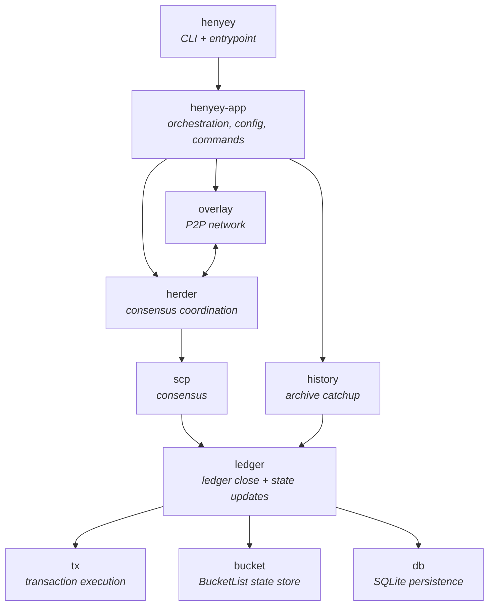

# henyey

A Rust reimplementation of [Stellar Core](https://github.com/stellar/stellar-core) targeting protocol v25 parity. Supports testnet, mainnet, and local standalone networks. Can serve as a drop-in replacement for stellar-core inside the [stellar/quickstart](https://github.com/stellar/docker-stellar-core-horizon) Docker image. This is an educational experiment and **not** production-grade software.

## What is Stellar Core?

Stellar Core is the backbone of the [Stellar network](https://stellar.org)—a decentralized payment network. It:

- Validates and processes transactions
- Participates in consensus via the [Stellar Consensus Protocol (SCP)](https://stellar.org/papers/stellar-consensus-protocol)
- Maintains the ledger state (accounts, balances, trustlines, offers, contracts)
- Synchronizes with history archives for catchup and verification

This Rust implementation aims to mirror stellar-core v25.x behavior for educational purposes and to provide an alternative implementation for testing and validation.

## Architecture


```mermaid
graph TD
    henyey["henyey<br/><i>CLI + entrypoint</i>"]
    app["henyey-app<br/><i>orchestration, config, commands</i>"]
    overlay["overlay<br/><i>P2P network</i>"]
    herder["herder<br/><i>consensus coordination</i>"]
    history["history<br/><i>archive catchup</i>"]
    scp["scp<br/><i>consensus</i>"]
    ledger["ledger<br/><i>ledger close + state updates</i>"]
    tx["tx<br/><i>transaction execution</i>"]
    bucket["bucket<br/><i>BucketList state store</i>"]
    db["db<br/><i>SQLite persistence</i>"]

    henyey --> app
    app --> overlay
    app --> herder
    app --> history
    overlay <--> herder
    herder --> scp
    scp --> ledger
    history --> ledger
    ledger --> tx
    ledger --> bucket
    ledger --> db
```

Supporting crates: `crypto`, `common`, `work`, `historywork`

## Status

**Work in progress.** Core functionality is implemented and verified against testnet, mainnet, and local standalone networks.

### Consensus & Networking
- SCP consensus participation (validator and observer modes)
- P2P overlay with pull-mode transaction flooding and flow control
- Quorum intersection checking

### Transaction Execution
- Classic and Soroban transaction execution
- Classic event emission (SAC events for classic operations)

### State Management
- BucketList state store (live + hot archive)
- History archive catchup, replay, and verification
- History archive publishing (checkpoints with XDR record marking)
- Offline verify-execution against CDP metadata

### stellar-core Compatibility
- Drop-in replacement for stellar-core in [stellar-rpc](https://github.com/stellar/stellar-rpc) (captive core mode)
- Drop-in replacement inside the [stellar/quickstart](https://github.com/stellar/docker-stellar-core-horizon) Docker image (testnet and local modes)
- HTTP API compatible with stellar-core (info, tx submission, ledger queries, upgrades, surveys)
- LedgerCloseMeta streaming for Horizon and stellar-rpc ingestion
- CLI compatible with stellar-core subcommands (`new-db`, `run`, `catchup`, `force-scp`, `offline-info`, `version`)

## Requirements

- **Rust**: 1.76+ (2021 edition)
- **SQLite**: System library (usually pre-installed)
- **Platform**: Linux, macOS (Windows untested)

## Build

```bash
cargo build --release
```

The binary is at `./target/release/henyey`.

## Test

```bash
# Run all tests
cargo test --all

# Run tests for a specific crate
cargo test -p henyey-scp

# Run with output
cargo test --all -- --nocapture
```

## Run

### Observer Mode (Testnet)

An observer syncs the ledger without participating in consensus:

```bash
# Catch up to current ledger
./target/release/henyey --config configs/testnet.toml catchup current

# Run and follow the network
./target/release/henyey --config configs/testnet.toml run
```

### Validator Mode (Testnet)

A validator participates in consensus. Requires a secret key and quorum configuration:

```bash
# Use the validator config
./target/release/henyey --config configs/validator-testnet.toml catchup current
./target/release/henyey --config configs/validator-testnet.toml run
```

### Mainnet

```bash
./target/release/henyey --config configs/mainnet.toml catchup current
./target/release/henyey --config configs/mainnet.toml run
```

## Running with stellar-rpc

Henyey can serve as a drop-in replacement for stellar-core when used as the backend for [stellar-rpc](https://github.com/stellar/stellar-rpc). No changes to stellar-rpc are required -- henyey automatically detects stellar-core format configuration and translates it internally.

### Prerequisites

- A built `henyey` binary (see [Build](#build) above)
- A built `stellar-rpc` binary ([build instructions](https://github.com/stellar/stellar-rpc#building))

### Quick Start (Testnet)

```bash
stellar-rpc \
  --network-passphrase "Test SDF Network ; September 2015" \
  --stellar-core-binary-path ./target/release/henyey \
  --captive-core-config-path configs/captive-core-testnet.cfg \
  --captive-core-storage-path /tmp/henyey-captive-core \
  --db-path /tmp/soroban-rpc.sqlite \
  --endpoint 127.0.0.1:8000 \
  --history-archive-urls https://history.stellar.org/prd/core-testnet/core_testnet_001
```

Once running, verify it's healthy:

```bash
curl -s -X POST http://127.0.0.1:8000 \
  -H 'Content-Type: application/json' \
  -d '{"jsonrpc":"2.0","id":1,"method":"getHealth"}' | python3 -m json.tool
```

Expected output:

```json
{
    "jsonrpc": "2.0",
    "id": 1,
    "result": {
        "status": "healthy",
        "latestLedger": 1329304,
        "oldestLedger": 1329279,
        "ledgerRetentionWindow": 120960
    }
}
```

### How It Works

stellar-rpc launches henyey as a subprocess (in place of stellar-core) and communicates via three interfaces:

1. **Meta pipe** (`fd:3`) -- henyey streams `LedgerCloseMeta` XDR frames to stellar-rpc for ingestion
2. **HTTP commands** (port 11626) -- stellar-rpc polls `/info` for sync status and submits transactions via `/tx`
3. **HTTP queries** (port 11628) -- stellar-rpc queries ledger entries via `/getledgerentry` for transaction preflight

Henyey detects the stellar-core format config file (TOML with `[[VALIDATORS]]` sections), translates it to its native format, and starts the compatibility HTTP servers automatically. The CLI flags `--conf`, `--console`, `--metadata-output-stream fd:N`, and subcommands `new-db`, `catchup`, `run`, `offline-info`, and `version` are all supported with stellar-core compatible behavior.

### Captive Core Config

The config file passed to `--captive-core-config-path` uses stellar-core's format. See [`configs/captive-core-testnet.cfg`](configs/captive-core-testnet.cfg) for testnet. A minimal config only needs validator definitions:

```toml
[[VALIDATORS]]
NAME = "sdf_testnet_1"
HOME_DOMAIN = "testnet.stellar.org"
PUBLIC_KEY = "GDKXE2OZMJIPOSLNA6N6F2BVCI3O777I2OOC4BV7VOYUEHYX7RTRYA7Y"
ADDRESS = "core-testnet1.stellar.org"
HISTORY = "curl -sf http://history.stellar.org/prd/core-testnet/core_testnet_001/{0} -o {1}"
```

stellar-rpc injects additional keys (`DATABASE`, `HTTP_PORT`, `NETWORK_PASSPHRASE`, etc.) into the config before passing it to henyey. Henyey handles all of these transparently.

## Running with Docker Quickstart

The [stellar/quickstart](https://github.com/stellar/docker-stellar-core-horizon) Docker image bundles stellar-core, Horizon, and stellar-rpc into a single container. Henyey can replace stellar-core inside this container with no changes to quickstart itself.

The container runs up to three stellar-core instances simultaneously (testnet mode uses all three; local mode uses the node + RPC captive core):

| Instance | HTTP Port | Peer Port | Purpose |
|----------|-----------|-----------|---------|
| Node (validator/watcher) | 11626 | 11625 | Consensus participant or full watcher |
| Horizon captive core | 11726 | 11725 | Ingestion for Horizon |
| RPC captive core | 11826 | 11825 | Ingestion for stellar-rpc |

### Build the Image

1. Build a release binary (requires a Linux x86_64 target):

```bash
cargo build --release
```

2. Create a `Dockerfile`:

```dockerfile
FROM stellar/quickstart:testing

COPY henyey /usr/bin/henyey
RUN chmod +x /usr/bin/henyey
RUN mv /usr/bin/stellar-core /usr/bin/stellar-core.orig && \
    ln -s /usr/bin/henyey /usr/bin/stellar-core
```

3. Build the image (from the directory containing the Dockerfile):

```bash
cp ./target/release/henyey .
docker build -t henyey-quickstart .
```

### Run the Container

```bash
docker run -d --name henyey-quickstart \
  -p 8000:8000 \
  -p 8003:8003 \
  henyey-quickstart --testnet
```

Port 8000 exposes Horizon and port 8003 exposes stellar-rpc.

### Verify Health

Wait a few minutes for catchup to complete, then check the services:

```bash
# Check stellar-rpc health
curl -s -X POST http://localhost:8003/soroban/rpc \
  -H 'Content-Type: application/json' \
  -d '{"jsonrpc":"2.0","id":1,"method":"getHealth"}' | python3 -m json.tool

# Check Horizon root
curl -s http://localhost:8000/ | python3 -m json.tool
```

stellar-rpc should report `"status": "healthy"` and Horizon should return the network root with the current ledger sequence.

### Local Network Mode

Run a standalone single-node network from genesis — no external peers, no catchup. This is the fastest way to develop and test against a Stellar network:

```bash
docker run -d --name henyey-local \
  -p 8000:8000 \
  henyey-quickstart --local --limits default
```

The container creates a standalone network with:

- 1-second ledger closes
- Protocol v25 from genesis
- Friendbot for funding test accounts
- Horizon (port 8000) and stellar-rpc (port 8000/soroban/rpc)

Wait ~15 seconds for startup, then verify:

```bash
# RPC health
curl -s -X POST http://localhost:8000/soroban/rpc \
  -H 'Content-Type: application/json' \
  -d '{"jsonrpc":"2.0","id":1,"method":"getHealth"}' | python3 -m json.tool

# Fund a test account via friendbot
curl -s "http://localhost:8000/friendbot?addr=GBRPYHIL2CI3FNQ4BXLFMNDLFJUNPU2HY3ZMFSHONUCEOASW7QC7OX2H"

# Check account on Horizon
curl -s "http://localhost:8000/accounts/GBRPYHIL2CI3FNQ4BXLFMNDLFJUNPU2HY3ZMFSHONUCEOASW7QC7OX2H" | python3 -m json.tool
```

The local network passphrase is `Standalone Network ; February 2017`.

## Configuration

Generate a sample config to customize:

```bash
./target/release/henyey sample-config > my-config.toml
```

### Key Configuration Options

```toml
[network]
network_passphrase = "Test SDF Network ; September 2015"

[database]
path = "stellar.db"

[overlay]
listen_port = 11625
max_inbound_peers = 64
max_outbound_peers = 8

[history]
# Archive URLs for catchup
archives = [
    "https://history.stellar.org/prd/core-testnet/core_testnet_001",
    "https://history.stellar.org/prd/core-testnet/core_testnet_002",
]

[validator]
# Required for validator mode
node_seed = "S..."  # Your secret key
node_is_validator = true

[events]
# Classic event emission (off by default)
emit_classic_events = true
backfill_stellar_asset_events = false
```

## Repository Layout

```
henyey/
├── crates/
│   ├── app/            # App orchestration
│   ├── bucket/         # BucketList state
│   ├── clock/          # Clock abstractions
│   ├── common/         # Shared types
│   ├── crypto/         # Cryptographic primitives
│   ├── db/             # SQLite persistence
│   ├── henyey/         # CLI binary
│   ├── herder/         # Consensus coordination
│   ├── history/        # History archives
│   ├── historywork/    # History work scheduling
│   ├── ledger/         # Ledger close pipeline
│   ├── overlay/        # P2P networking
│   ├── scp/            # Consensus protocol
│   ├── simulation/     # Multi-node simulation harness
│   ├── tx/             # Transaction execution
│   └── work/           # Work scheduler
└── configs/            # Example configurations
```

## Crate Overview

### Core Infrastructure

| Crate | Purpose | Parity |
|-------|---------|--------|
| [`henyey`](crates/henyey/README.md) | CLI entrypoint, argument parsing, command dispatch | [51%](crates/henyey/PARITY_STATUS.md) |
| [`henyey-app`](crates/henyey-app/README.md) | Application wiring, lifecycle, HTTP APIs, meta streaming, history publishing | [65%](crates/henyey-app/PARITY_STATUS.md) |
| [`henyey-common`](crates/henyey-common/README.md) | Shared types, config helpers, time utilities | [99%](crates/henyey-common/PARITY_STATUS.md) |
| [`henyey-clock`](crates/clock/README.md) | Injectable clock abstractions for deterministic simulation and runtime timing | [100%](crates/clock/PARITY_STATUS.md) |
| [`henyey-crypto`](crates/henyey-crypto/README.md) | Ed25519 signing, SHA-256 hashing, strkey encoding | [78%](crates/henyey-crypto/PARITY_STATUS.md) |
| [`henyey-db`](crates/henyey-db/README.md) | SQLite schema, migrations, query layer | [94%](crates/henyey-db/PARITY_STATUS.md) |

### Consensus Layer

| Crate | Purpose | Parity |
|-------|---------|--------|
| [`henyey-scp`](crates/henyey-scp/README.md) | Stellar Consensus Protocol: nomination, balloting, quorum logic | [100%](crates/henyey-scp/PARITY_STATUS.md) |
| [`henyey-herder`](crates/henyey-herder/README.md) | Consensus coordination, transaction queue, ledger close triggers | [77%](crates/henyey-herder/PARITY_STATUS.md) |
| [`henyey-overlay`](crates/henyey-overlay/README.md) | P2P overlay network, peer management, message flooding | [92%](crates/henyey-overlay/PARITY_STATUS.md) |

### Execution Layer

| Crate | Purpose | Parity |
|-------|---------|--------|
| [`henyey-ledger`](crates/henyey-ledger/README.md) | Ledger close pipeline, per-operation savepoints, state snapshots, delta tracking | [65%](crates/henyey-ledger/PARITY_STATUS.md) |
| [`henyey-tx`](crates/henyey-tx/README.md) | Transaction validation and execution (classic + Soroban), savepoint-based rollback | [97%](crates/henyey-tx/PARITY_STATUS.md) |
| [`henyey-bucket`](crates/henyey-bucket/README.md) | BucketList implementation, merges, on-disk state | [93%](crates/henyey-bucket/PARITY_STATUS.md) |

### History & Sync

| Crate | Purpose | Parity |
|-------|---------|--------|
| [`henyey-history`](crates/henyey-history/README.md) | History archive I/O, catchup, replay, verification, publishing | [82%](crates/henyey-history/PARITY_STATUS.md) |
| [`henyey-historywork`](crates/henyey-historywork/README.md) | History work scheduling, publish/catchup task management | [56%](crates/henyey-historywork/PARITY_STATUS.md) |

### RPC

| Crate | Purpose | Parity |
|-------|---------|--------|
| [`henyey-rpc`](crates/rpc/README.md) | Stellar JSON-RPC 2.0 server (SEP-35), transaction simulation | [85%](crates/rpc/PARITY_STATUS.md) |

### Utilities

| Crate | Purpose | Parity |
|-------|---------|--------|
| [`henyey-work`](crates/henyey-work/README.md) | Generic DAG-based work scheduler | [39%](crates/henyey-work/PARITY_STATUS.md) |
| [`henyey-simulation`](crates/simulation/README.md) | Deterministic multi-node simulation harness and topology/fault scenarios | [92%](crates/simulation/PARITY_STATUS.md) |

## Design Constraints

This implementation intentionally limits scope:

| Constraint | Rationale |
|------------|-----------|
| **Protocol 24+ only** | Focus on current protocol behavior |
| **SQLite-only** | Simplicity over PostgreSQL support |
| **Deterministic** | Observable behavior must match stellar-core |

## Development

### Running Integration Tests

```bash
# History replay tests (requires network)
cargo test -p henyey-history --test replay_integration

# Catchup integration tests
cargo test -p henyey-history --test catchup_integration
```

### Debugging

```bash
# Enable trace logging
RUST_LOG=trace ./target/release/henyey --config configs/testnet.toml run

# Log specific modules
RUST_LOG=henyey_scp=debug,henyey_herder=debug ./target/release/henyey ...
```

### Adding a New Crate

1. Create `crates/<name>/` (with package name `henyey-<name>` in its `Cargo.toml`)
2. Add to workspace in root `Cargo.toml`
3. Add README.md documenting purpose and usage
4. Update this file's crate overview

## Related Resources

- [stellar-core](https://github.com/stellar/stellar-core) — Upstream implementation
- [Stellar Docs](https://developers.stellar.org/) — Protocol documentation
- [SCP Whitepaper](https://stellar.org/papers/stellar-consensus-protocol) — Consensus protocol specification
- [stellar-xdr](https://github.com/stellar/stellar-xdr-next) — XDR type definitions

## Contributing

- Keep behavior deterministic and aligned with stellar-core v25.x
- Add or update tests when behavior changes
- Update crate READMEs when modifying subsystem behavior
- Run `cargo fmt` and `cargo clippy` before committing

## License

Copyright 2026 Stellar Development Foundation (This is not an official project of the Stellar Development Foundation)

Licensed under the Apache License, Version 2.0 (the "License");
you may not use this file except in compliance with the License.
You may obtain a copy of the License at

http://www.apache.org/licenses/LICENSE-2.0

Unless required by applicable law or agreed to in writing, software
distributed under the License is distributed on an "AS IS" BASIS,
WITHOUT WARRANTIES OR CONDITIONS OF ANY KIND, either express or implied.
See the License for the specific language governing permissions and
limitations under the License.
