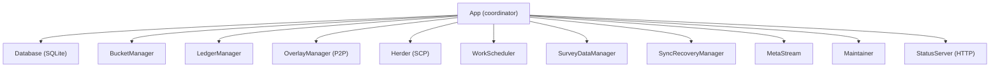
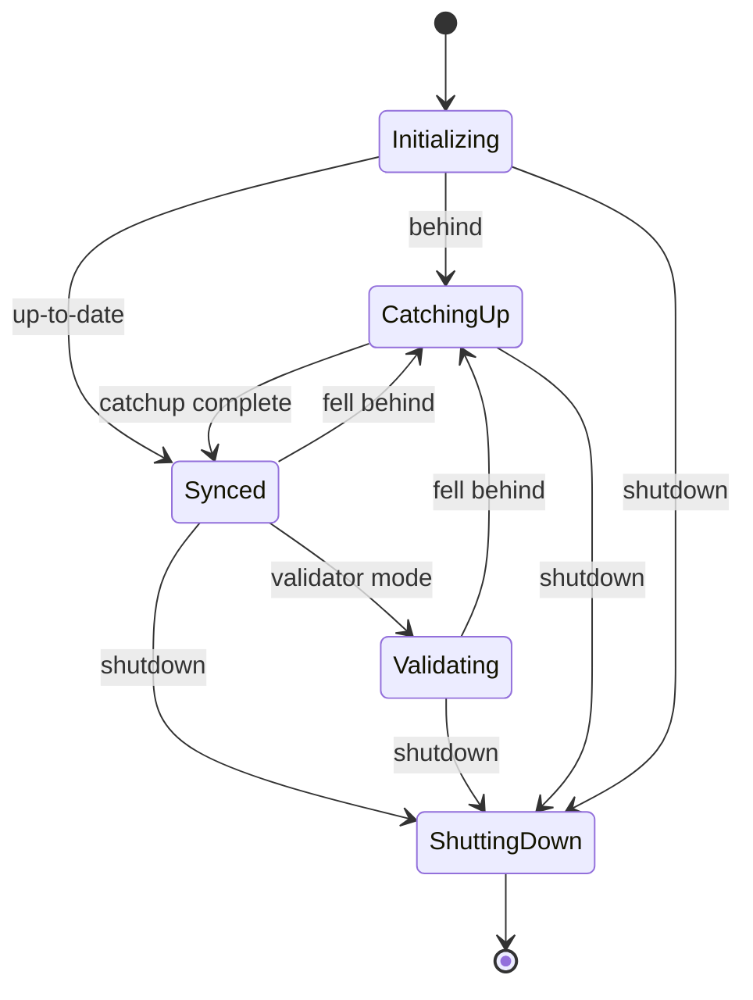

# henyey-app

Application orchestration layer for henyey (rs-stellar-core).

## Overview

This crate provides the top-level application layer that wires together all subsystems of a Stellar Core node. It is the main entry point for running a node and handles configuration management, lifecycle control, HTTP API serving, logging, database maintenance, metadata streaming, and network surveys. It corresponds to the `src/main/` directory in upstream stellar-core, primarily `ApplicationImpl.cpp`, `Config.cpp`, `CommandHandler.cpp`, and `Maintainer.cpp`.

## Architecture



## Key Types

| Type | Description |
|------|-------------|
| `App` | Central application struct coordinating all subsystems |
| `AppConfig` | Configuration loaded from TOML with defaults for testnet/mainnet |
| `AppState` | Lifecycle state enum: Initializing, CatchingUp, Synced, Validating, ShuttingDown |
| `RunMode` | Node running mode: Full, Validator, Watcher |
| `RunOptions` | Options for the run command (mode, force catchup, sync behavior) |
| `CatchupMode` | History download mode: Minimal, Complete, Recent |
| `CatchupOptions` | Options for the catchup command (target ledger, mode, parallelism) |
| `CatchupTarget` | Catchup destination: Current, specific Ledger, or Checkpoint |
| `CatchupResult` | Result of a catchup operation (final ledger, buckets applied) |
| `SurveyReport` | Collected network topology survey data |
| `NodeStatsSnapshot` | Baseline node statistics captured at survey collection start |
| `Maintainer` | Background scheduler for database cleanup |
| `MaintenanceConfig` | Configuration for maintenance intervals and batch sizes |
| `StatusServer` | HTTP server for monitoring and control endpoints |
| `ConfigBuilder` | Builder API for programmatic configuration construction |
| `LogLevelHandle` | Handle for dynamic runtime log level changes |
| `ProgressTracker` | Progress reporter for long-running operations |

## Usage

### Running a Node

```rust
use henyey_app::{App, AppConfig, run_node, RunOptions};

#[tokio::main]
async fn main() -> anyhow::Result<()> {
    let config = AppConfig::from_file("config.toml")?;
    run_node(config, RunOptions::default()).await
}
```

### Catching Up from History

```rust
use henyey_app::{run_catchup, CatchupOptions, CatchupMode, AppConfig};

#[tokio::main]
async fn main() -> anyhow::Result<()> {
    let config = AppConfig::testnet();
    let options = CatchupOptions::to_ledger(1000000)
        .with_mode(CatchupMode::Recent(1000))
        .with_parallelism(16);
    run_catchup(config, options).await?;
    Ok(())
}
```

### Programmatic Configuration

```rust
use henyey_app::config::ConfigBuilder;

let config = ConfigBuilder::new()
    .node_name("my-node")
    .database_path("/var/lib/stellar/stellar.db")
    .peer_port(11625)
    .log_level("info")
    .build();
```

## Module Layout

| Module | Description |
|--------|-------------|
| `lib.rs` | Crate root with module declarations and public re-exports |
| `app/mod.rs` | Core `App` struct definition, field declarations, subsystem initialization (`App::new`), builder, helper functions, and types (`AppState`, `CatchupTarget`, `CatchupResult`, `SurveyReport`) |
| `app/lifecycle.rs` | Main event loop (`App::run`), signal handling, heartbeat watchdog, rapid-close cycle, and graceful shutdown |
| `app/ledger_close.rs` | Ledger close pipeline: `persist_ledger_close`, transaction application, bucket list hashing, SCP history persistence, and meta stream emission |
| `app/catchup_impl.rs` | Catchup orchestration: `App::catchup`, buffered catchup triggering, history archive download coordination, bucket application, and ledger replay |
| `app/consensus.rs` | SCP integration: out-of-sync recovery, consensus stuck detection, recovery escalation to catchup |
| `app/tx_flooding.rs` | Transaction set demand/fetch protocol: tx-set request scheduling, peer rotation, DontHave tracking, and exhaustion detection |
| `app/peers.rs` | Peer management helpers: snapshot queries, connect/disconnect, ban/unban, preferred peer configuration |
| `app/survey_impl.rs` | Survey message handling: processing survey requests/responses, building topology data, peer data collection |
| `config.rs` | Configuration types (`AppConfig`, `NodeConfig`, `NetworkConfig`, etc.), TOML loading, environment variable overrides, and `ConfigBuilder` |
| `run_cmd.rs` | `run_node` entry point, `NodeRunner` lifecycle, `StatusServer` HTTP API with axum handlers for all REST endpoints |
| `catchup_cmd.rs` | `run_catchup` entry point, `CatchupOptions` parsing, progress callbacks |
| `logging.rs` | Logging initialization, `ProgressTracker` for catchup/apply progress, dynamic `LogLevelHandle` |
| `maintainer.rs` | `Maintainer` background scheduler for SCP history and ledger header cleanup |
| `meta_stream.rs` | `MetaStreamManager` for emitting `LedgerCloseMeta` XDR frames to external consumers (main and debug streams) |
| `survey.rs` | `SurveyDataManager` for time-sliced overlay network surveys, `SurveyMessageLimiter` for rate limiting |

## Design Notes

### Application State Machine

The application transitions through well-defined lifecycle states:



### Consensus Stuck Recovery

When consensus stalls (no ledger close for 35+ seconds with buffered ledgers), the node broadcasts its SCP state to peers, requests SCP state from peers, retries recovery every 10 seconds, and falls back to catchup if recovery fails.

### Transaction Flooding

Transactions are propagated using an advert/demand protocol. Nodes advertise transaction hashes they have, peers demand transactions they need, and rate limiting prevents bandwidth abuse.

### Determinism

All ledger-close and state-transition logic must be deterministic and match stellar-core behavior exactly. The `App` coordinates the close pipeline through `persist_ledger_close` which applies transactions, computes bucket list hashes, and emits metadata in the same order as upstream.

## stellar-core Mapping

| Rust | stellar-core |
|------|--------------|
| `app/mod.rs` | `src/main/ApplicationImpl.cpp`, `src/main/ApplicationImpl.h` |
| `app/lifecycle.rs` | `src/main/ApplicationImpl.cpp` (run loop, shutdown) |
| `app/ledger_close.rs` | `src/ledger/LedgerManagerImpl.cpp` (closeLedger pipeline) |
| `app/catchup_impl.rs` | `src/catchup/CatchupManagerImpl.cpp` |
| `app/consensus.rs` | `src/herder/HerderImpl.cpp` (out-of-sync recovery) |
| `app/tx_flooding.rs` | `src/overlay/ItemFetcher.cpp` (tx set fetching) |
| `app/peers.rs` | `src/overlay/OverlayManagerImpl.cpp` (peer queries) |
| `app/survey_impl.rs` | `src/overlay/SurveyManager.cpp` (message handling) |
| `config.rs` | `src/main/Config.cpp`, `src/main/Config.h` |
| `run_cmd.rs` | `src/main/CommandHandler.cpp`, `src/main/CommandLine.cpp` |
| `catchup_cmd.rs` | `src/main/CommandLine.cpp` (catchup command) |
| `logging.rs` | `src/util/Logging.cpp` |
| `maintainer.rs` | `src/main/Maintainer.cpp`, `src/main/Maintainer.h` |
| `meta_stream.rs` | `src/ledger/LedgerManagerImpl.cpp` (meta stream output) |
| `survey.rs` | `src/overlay/SurveyManager.cpp`, `src/overlay/SurveyManager.h` |

## Parity Status

See [PARITY_STATUS.md](PARITY_STATUS.md) for detailed stellar-core parity analysis.
