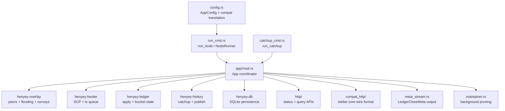

# henyey-app

Application orchestration crate for running a henyey Stellar node.

## Overview

`henyey-app` is the top-level coordinator that turns the lower-level henyey crates into a running node. It owns configuration loading, process lifecycle, history catchup, HTTP surfaces, maintenance loops, metadata streaming, survey collection, and the glue between overlay, SCP, ledger close, and history publishing. For stellar-core parity work it mostly maps to `src/main/`, with additional touch points in `src/ledger/`, `src/catchup/`, `src/overlay/`, and `src/history/` where the Rust crate centralizes behavior that stellar-core spreads across multiple components.

## Architecture


```mermaid
flowchart TD
    Config[config.rs\nAppConfig + compat translation] --> Run[run_cmd.rs\nrun_node / NodeRunner]
    Run --> App[app/mod.rs\nApp coordinator]
    Catchup[catchup_cmd.rs\nrun_catchup] --> App
    App --> Overlay[henyey-overlay\npeers + flooding + surveys]
    App --> Herder[henyey-herder\nSCP + tx queue]
    App --> Ledger[henyey-ledger\napply + bucket state]
    App --> History[henyey-history\ncatchup + publish]
    App --> DB[henyey-db\nSQLite persistence]
    App --> Http[http/\nstatus + query APIs]
    App --> Compat[compat_http/\nstellar-core wire format]
    App --> Meta[meta_stream.rs\nLedgerCloseMeta output]
    App --> Maint[maintainer.rs\nbackground pruning]
```

## Key Types

| Type | Description |
|------|-------------|
| `App` | Central runtime object that owns subsystem handles and coordinates catchup, consensus, ledger close, and shutdown. |
| `AppConfig` | Full node configuration, including network, database, bucket, history, overlay, HTTP, metadata, maintenance, diagnostics, and testing knobs. |
| `ConfigBuilder` | Fluent builder for constructing `AppConfig` programmatically. |
| `AppState` | Node lifecycle state: `Initializing`, `CatchingUp`, `Synced`, `Validating`, or `ShuttingDown`. |
| `RunMode` | Run behavior for `run_node`: full node, validator, or watcher. |
| `RunOptions` | Startup options controlling catchup forcing, sync wait behavior, and extra server spawning. |
| `CatchupOptions` | CLI-style catchup target and replay mode selection for `run_catchup`. |
| `CatchupMode` | History replay depth: minimal, recent, or complete. |
| `NodeRunner` | Convenience wrapper around `App` for embedding the run loop in tests or binaries. |
| `Maintainer` | Background database cleanup scheduler for SCP history, headers, RPC retention tables, and events. |
| `MetaStreamManager` | Writer for fatal main metadata output and non-fatal rotating debug metadata segments. |
| `SurveyDataManager` | Time-sliced survey collector and reporting store for overlay topology data. |
| `LogLevelHandle` | Runtime handle for changing global or partition-specific log levels. |
| `QueryServer` | Separate HTTP server for `/getledgerentryraw` and `/getledgerentry`. |
| `StatusServer` | Native Axum status/control server for node info, admin commands, peers, SCP, surveys, and tx submission. |

## Usage

```rust
use henyey_app::{run_node, AppConfig, RunOptions};

# async fn example() -> anyhow::Result<()> {
let config = AppConfig::from_file("config.toml")?;
run_node(config, RunOptions::default()).await
# }
```

```rust
use henyey_app::{run_catchup, AppConfig, CatchupMode, CatchupOptions};

# async fn example() -> anyhow::Result<()> {
let config = AppConfig::testnet();
let options = CatchupOptions::to_ledger(1_000_000)
    .with_mode(CatchupMode::Recent(1024))
    .with_parallelism(16);
let result = run_catchup(config, options).await?;
assert!(result.ledger_seq >= 1_000_000);
# Ok(())
# }
```

```rust
use henyey_app::compat_config::{is_stellar_core_format, translate_stellar_core_config};

# fn example(raw: toml::Value) -> anyhow::Result<()> {
let config = if is_stellar_core_format(&raw) {
    translate_stellar_core_config(&raw)?
} else {
    raw.try_into()?
};
assert!(!config.network.passphrase.is_empty());
# Ok(())
# }
```

## Module Layout

| Module | Description |
|--------|-------------|
| `lib.rs` | Crate root, module declarations, and public re-exports for the main app-facing API. |
| `app/archive_cache.rs` | Catchup-time archive state cache for checkpoint and bucket metadata. |
| `app/bootstrap.rs` | Genesis/bootstrap helpers for local and fresh database startup. |
| `app/catchup_impl.rs` | Catchup orchestration, history archive checkpoint discovery, replay-mode selection, catchup-time message caching, and post-catchup cleanup. |
| `app/close.rs` | Ledger-close entry points and close-result plumbing. |
| `app/close_pipeline.rs` | Buffered close pipeline that interleaves ledger application with the event loop. |
| `app/consensus.rs` | Consensus triggering, out-of-sync recovery, SCP state exchange, quorum-set handling, and timeout management. |
| `app/ledger_close.rs` | Ledger-close persistence, restart recovery from persisted HAS, buffered close sequencing, and contract event extraction. |
| `app/lifecycle.rs` | Main event loop, overlay startup, timer scheduling, message dispatch, heartbeat logging, and graceful shutdown. |
| `app/log_throttle.rs` | Rate-limited logging helpers for repetitive runtime messages. |
| `app/mod.rs` | `App` construction, subsystem wiring, database locking, key setup, bucket/ledger initialization, and shared runtime state. |
| `app/peers.rs` | Peer inspection, connect/disconnect/ban helpers, discovery persistence, refresh logic, and ping-based latency measurement. |
| `app/persist.rs` | Persistent app-state helpers used during restart and ledger close. |
| `app/phase.rs` | Runtime phase bookkeeping for startup, catchup, and live tracking. |
| `app/publish.rs` | Validator-side checkpoint publishing, checkpoint artifact assembly, SCP history export, and command-based archive upload support. |
| `app/survey_impl.rs` | Survey HTTP command implementation, request/response encryption, report aggregation, and automatic survey scheduling logic. |
| `app/tracked_lock.rs` | Lock tracking helpers for runtime diagnostics. |
| `app/tx_flooding.rs` | Transaction advert/demand queues, tx-set request rotation, DontHave tracking, and network flood control. |
| `app/types.rs` | Public app-facing types plus internal support types for buffering, survey scheduling, latency tracking, and recovery bookkeeping. |
| `app/upgrades.rs` | Ledger-upgrade proposal and settings helpers exposed through app/runtime APIs. |
| `catchup_cmd.rs` | Public catchup command entry point, target parsing, CLI-oriented progress callbacks, and result formatting. |
| `compat_config.rs` | Translator from stellar-core flat SCREAMING_CASE config files into `AppConfig`. |
| `compat_http/mod.rs` | stellar-core-compatible HTTP server and panic-safe router wrapper. |
| `compat_http/handlers/mod.rs` | Compatibility handler module declarations and shared routing helpers. |
| `compat_http/handlers/info.rs` | stellar-core-shaped `/info` compatibility response. |
| `compat_http/handlers/metrics.rs` | Plaintext metrics compatibility output. |
| `compat_http/handlers/peers.rs` | Compatibility peer inspection and peer-admin endpoints. |
| `compat_http/handlers/plaintext.rs` | Text response helpers for legacy command endpoints. |
| `compat_http/handlers/testacc.rs` | Deterministic test-account compatibility endpoint. |
| `compat_http/handlers/tx.rs` | Compatibility transaction submission endpoint. |
| `config.rs` | Hierarchical TOML config types, defaults for testnet/mainnet, validation rules, env overrides, and builder APIs. |
| `http/mod.rs` | Native Axum servers: status/control router and separate query-server router. |
| `http/helpers.rs` | Shared HTTP parsing helpers for peer IDs, connect params, and ledger upgrade formatting. |
| `http/handlers/mod.rs` | Native handler module declarations. |
| `http/handlers/admin.rs` | Native admin endpoints for maintenance, manual close, peer mutation, and self-checks. |
| `http/handlers/generateload.rs` | Optional load-generation request handling. |
| `http/handlers/info.rs` | Native node information endpoint. |
| `http/handlers/metrics.rs` | Metrics export endpoint. |
| `http/handlers/peers.rs` | Native peer listing and peer-control endpoints. |
| `http/handlers/query.rs` | Query-server ledger-entry lookup endpoints. |
| `http/handlers/scp.rs` | SCP and quorum diagnostics endpoints. |
| `http/handlers/soroban.rs` | Soroban resource and ledger settings endpoints. |
| `http/handlers/survey.rs` | Survey collection/reporting endpoints. |
| `http/handlers/tx.rs` | Native transaction submission endpoint. |
| `http/types/mod.rs` | Native HTTP request/response type module declarations. |
| `http/types/admin.rs` | Admin endpoint request and response structs. |
| `http/types/generateload.rs` | Load-generation request and response structs. |
| `http/types/info.rs` | Node information response structs. |
| `http/types/peers.rs` | Peer API request and response structs. |
| `http/types/query.rs` | Query-server request and response structs. |
| `http/types/scp.rs` | SCP/quorum diagnostic response structs. |
| `http/types/soroban.rs` | Soroban endpoint response structs. |
| `http/types/survey.rs` | Survey endpoint request and response structs. |
| `http/types/tx.rs` | Transaction submission response structs. |
| `logging.rs` | Tracing initialization, dynamic partition log-level control, and generic/catchup progress trackers. |
| `maintainer.rs` | Automatic pruning for ledger headers, SCP history, RPC retention tables, and event rows. |
| `meta_stream.rs` | Main metadata stream output plus rotating debug stream management and gzip segment cleanup. |
| `meta_writer.rs` | Metadata output writer abstraction and gzip support. |
| `metrics.rs` | App-level metric registration and snapshots. |
| `run_cmd.rs` | Public node run entry point, mode selection, server spawning, sync waiting, and shutdown signal handling. |
| `survey.rs` | Core survey data structures: phase tracking, message limiting, latency histograms, and topology data assembly. |

## Design Notes

`henyey-app` persists the current `HistoryArchiveState` in SQLite and uses it as restart/catchup input. That lets the node rebuild bucket lists from the same checkpoint view it last closed, including pending merge state, instead of forcing archive downloads on every restart.

Buffered ledger application is intentionally interleaved with the main event loop rather than drained in one long synchronous pass. This keeps SCP and tx-set traffic flowing while the node catches up to live consensus and avoids the catchup/drain/fall-behind loop that occurs if peer caches are allowed to age out mid-drain.

Metadata streaming has asymmetric failure semantics: writes to the configured main output stream are fatal and abort the node, while rotating debug stream failures are logged and ignored. This mirrors the requirement that primary ingestion output must never be silently dropped.

## stellar-core Mapping

| Rust | stellar-core |
|------|--------------|
| `app/mod.rs` | `src/main/ApplicationImpl.cpp`, `src/main/ApplicationImpl.h` |
| `app/lifecycle.rs` | `src/main/ApplicationImpl.cpp` |
| `app/ledger_close.rs` | `src/ledger/LedgerManagerImpl.cpp` |
| `app/catchup_impl.rs` | `src/catchup/CatchupManagerImpl.cpp`, `src/catchup/ApplyBufferedLedgersWork.cpp` |
| `app/consensus.rs` | `src/herder/HerderImpl.cpp`, `src/main/ApplicationImpl.cpp` |
| `app/peers.rs` | `src/overlay/OverlayManagerImpl.cpp`, `src/overlay/Peer.cpp` |
| `app/publish.rs` | `src/history/HistoryManagerImpl.cpp` |
| `app/survey_impl.rs` | `src/main/CommandHandler.cpp`, `src/overlay/SurveyManager.cpp` |
| `app/tx_flooding.rs` | `src/overlay/FlowControl.cpp`, `src/overlay/Peer.cpp`, `src/herder/HerderImpl.cpp` |
| `catchup_cmd.rs` | `src/main/CommandLine.cpp`, `src/main/ApplicationUtils.cpp` |
| `config.rs` | `src/main/Config.cpp`, `src/main/Config.h` |
| `compat_config.rs` | `src/main/Config.cpp` |
| `run_cmd.rs` | `src/main/CommandHandler.cpp`, `src/main/CommandLine.cpp` |
| `logging.rs` | `src/util/Logging.cpp` |
| `maintainer.rs` | `src/main/Maintainer.cpp`, `src/main/Maintainer.h` |
| `meta_stream.rs` | `src/ledger/LedgerManagerImpl.cpp` |
| `survey.rs` | `src/overlay/SurveyManager.cpp`, `src/overlay/SurveyManager.h` |
| `http/handlers/query.rs` | `src/main/QueryServer.cpp` |
| `compat_http/` | `src/main/CommandHandler.cpp` |

## Parity Status

See [PARITY_STATUS.md](PARITY_STATUS.md) for detailed stellar-core parity analysis.
