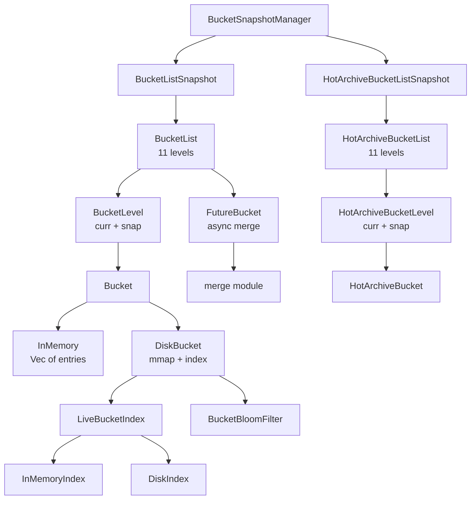

# henyey-bucket

BucketList implementation for storing and managing Stellar ledger state.

## Overview

The BucketList is Stellar's canonical on-disk data structure for storing ledger state. It organizes all ledger entries into a hierarchical structure of immutable "bucket" files, enabling efficient incremental updates, integrity verification, and state archival. This crate provides a complete Rust implementation compatible with stellar-core's bucket format and semantics, corresponding to the `src/bucket/` directory in stellar-core.

The bucket list consists of 11 levels (0-10), where each level contains two buckets (`curr` and `snap`). Lower levels update more frequently and contain recent data; higher levels contain older, more stable data. This log-structured merge tree (LSM) design optimizes for append-heavy workloads while maintaining efficient lookups.

## Architecture



## Key Types

| Type | Description |
|------|-------------|
| `BucketEntry` | Entry stored in a bucket: Live, Dead, Init (CAP-0020), or Metadata |
| `Bucket` | Immutable container of sorted entries, identified by SHA-256 hash. In-memory or disk-backed storage |
| `BucketList` | Complete 11-level bucket list for live ledger state |
| `BucketLevel` | Single level with `curr`, `snap`, and optional pending merge result |
| `HotArchiveBucketList` | Separate 11-level bucket list for archived persistent Soroban entries |
| `HotArchiveBucket` | Bucket storing HotArchiveBucketEntry variants (Archived, Live, Metaentry) |
| `BucketManager` | Manages bucket files on disk: creation, loading, caching, merging, GC |
| `DiskBucket` | Memory-efficient disk-backed bucket using mmap with compact index |
| `LiveBucketIndex` | Facade selecting InMemoryIndex (small) or DiskIndex (large) by bucket size |
| `BucketBloomFilter` | Binary fuse filter (BinaryFuse16) for fast negative lookups |
| `FutureBucket` | Async merge state machine: Clear, HashOutput, HashInputs, LiveOutput, LiveInputs |
| `BucketSnapshotManager` | Thread-safe snapshot manager with RwLock for concurrent reads |
| `SearchableBucketListSnapshot` | Query wrapper for key lookup, batched queries, inflation winners, type scanning |
| `BucketApplicator` | Chunked entry application during catchup with deduplication and progress tracking |
| `EvictionIterator` | Tracks incremental scan position for Soroban state archival |
| `StateArchivalSettings` | Configuration for eviction scans (scan size, starting level, max entries) |
| `MergeIterator` | Lazy streaming merge of two sorted bucket iterators |
| `LiveEntriesIterator` | Memory-efficient streaming over all live entries with HashSet deduplication |
| `BucketMergeMap` | Merge deduplication: tracks input-to-output relationships for reattachment |
| `RandomEvictionCache` | LRU-style cache for frequently-accessed account entries |
| `MergeCounters` | Thread-safe merge operation statistics via atomics |
| `BucketListMetrics` | Aggregate entry counts by type and durability |

## Usage

### Creating and Using a BucketList

```rust
use henyey_bucket::{BucketList, BucketEntry, BucketManager};
use stellar_xdr::curr::BucketListType;

let manager = BucketManager::new("/path/to/buckets".into())?;
let mut bucket_list = BucketList::new();

// Add entries from a closed ledger
bucket_list.add_batch(
    ledger_seq,
    protocol_version,
    BucketListType::Live,
    init_entries,   // newly created
    live_entries,   // updated
    dead_entries,   // deleted
)?;

// Look up an entry
if let Some(entry) = bucket_list.get(&key)? {
    // Process the entry
}
```

### Merging Buckets

```rust
use henyey_bucket::{merge_buckets, merge_buckets_with_options};

// Basic merge (normalizes Init -> Live)
let merged = merge_buckets(&old_bucket, &new_bucket, keep_dead, max_protocol)?;

// Merge with explicit normalization control
let merged = merge_buckets_with_options(
    &old_bucket,
    &new_bucket,
    keep_dead_entries,
    max_protocol_version,
    normalize_init_entries,  // false for same-level merges
)?;
```

### Eviction Scanning (Soroban)

```rust
use henyey_bucket::{EvictionIterator, StateArchivalSettings};

let mut iter = EvictionIterator::default();
let settings = StateArchivalSettings {
    eviction_scan_size: 100_000,
    starting_eviction_scan_level: 6,
    max_entries_to_archive: 1000,
};

let result = bucket_list.scan_for_eviction_incremental(
    iter, current_ledger, &settings, &ttl_lookup_fn,
)?;

// Process: result.archived_entries, result.evicted_keys
iter = result.end_iterator;
```

## Module Layout

| Module | Description |
|--------|-------------|
| `lib.rs` | Crate root: re-exports all public types and protocol version constants |
| `entry.rs` | `BucketEntry` enum, key comparison (`compare_keys`), eviction helpers |
| `bucket.rs` | `Bucket` struct with in-memory and disk-backed storage modes |
| `bucket_list.rs` | `BucketList`, `BucketLevel`, spill mechanics, hash computation, async merge orchestration |
| `merge.rs` | Bucket merging with CAP-0020 INITENTRY semantics, two-pointer merge algorithm |
| `hot_archive.rs` | `HotArchiveBucketList` and `HotArchiveBucket` for Soroban state archival |
| `manager.rs` | `BucketManager`: disk lifecycle, caching, GC, state operations |
| `snapshot.rs` | Thread-safe snapshots: `BucketSnapshotManager`, `SearchableBucketListSnapshot` |
| `index.rs` | `InMemoryIndex`, `DiskIndex`, `LiveBucketIndex`, type ranges, asset-pool mapping |
| `index_persistence.rs` | Serialization of `DiskIndex` to `.index` files for fast startup |
| `disk_bucket.rs` | `DiskBucket`: mmap-based bucket with on-demand entry loading |
| `bloom_filter.rs` | `BucketBloomFilter` using BinaryFuse16 with SipHash-2-4 |
| `future_bucket.rs` | `FutureBucket` state machine for async merge operations |
| `iterator.rs` | `BucketInputIterator`, `BucketOutputIterator` for streaming file I/O |
| `live_iterator.rs` | `LiveEntriesIterator`: memory-efficient streaming over live entries |
| `eviction.rs` | Eviction scan logic, `EvictionIterator`, level math utilities |
| `cache.rs` | `RandomEvictionCache` for account and trustline entries |
| `applicator.rs` | `BucketApplicator` for chunked catchup entry application |
| `merge_map.rs` | `BucketMergeMap` for merge deduplication and reattachment |
| `metrics.rs` | `MergeCounters`, `EvictionCounters`, `BucketListMetrics` |
| `error.rs` | `BucketError` enum |

## Design Notes

- **Merge semantics (CAP-0020)**: `Init + Dead` annihilates both entries; `Dead + Init` produces `Live`. This prevents tombstone accumulation when entries are created and deleted within the same merge window. The `normalize_init_entries` flag controls whether `Init` entries are converted to `Live` during inter-level merges.

- **Level 0 optimization**: Level 0 merges are synchronous and in-memory (via `merge_in_memory`) because they happen every 2 ledgers and must complete within ledger close time. Levels 1+ use background tokio tasks (`FutureBucket`) since they are less frequent and can tolerate latency.

- **Disk-backed storage**: For mainnet catchup where buckets contain millions of entries, `DiskBucket` uses memory-mapped I/O with a compact index. Small buckets (< 10K entries) use `InMemoryIndex` with per-key offsets; large buckets use `DiskIndex` with page-based ranges and a bloom filter for fast negative lookups.

- **XDR file format**: The canonical on-disk format is uncompressed XDR with RFC 5531 record marking (`<hash>.bucket.xdr`). The legacy gzip format (`<hash>.bucket.gz`) is supported for backward compatibility. Uncompressed files enable random-access seeks for disk-backed indexing.

- **Spill schedule**: Levels spill based on ledger sequence boundaries. `level_size(N) = 4^(N+1)` and `level_half(N) = level_size(N) / 2`. A level spills when the ledger sequence is at a half or full size boundary. Level 10 never spills.

## stellar-core Mapping

| Rust | stellar-core |
|------|--------------|
| `bucket.rs` | `src/bucket/Bucket.cpp`, `src/bucket/LiveBucket.cpp` |
| `bucket_list.rs` | `src/bucket/BucketList.cpp`, `src/bucket/LiveBucketList.cpp` |
| `manager.rs` | `src/bucket/BucketManager.cpp` |
| `entry.rs` | `src/bucket/BucketUtils.h` (key comparison) |
| `merge.rs` | `src/bucket/Bucket.cpp` (merge logic), `src/bucket/LiveBucket.cpp` |
| `hot_archive.rs` | `src/bucket/HotArchiveBucket.cpp`, `src/bucket/HotArchiveBucketList.cpp` |
| `snapshot.rs` | `src/bucket/BucketSnapshotManager.cpp`, `src/bucket/SearchableBucketListSnapshot.cpp` |
| `index.rs` | `src/bucket/LiveBucketIndex.cpp`, `src/bucket/DiskIndex.cpp`, `src/bucket/InMemoryIndex.cpp` |
| `index_persistence.rs` | `src/bucket/BucketIndexUtils.cpp` |
| `disk_bucket.rs` | `src/bucket/BucketIndex.cpp` (file access) |
| `bloom_filter.rs` | `src/bucket/BinaryFuseFilter.h` |
| `future_bucket.rs` | `src/bucket/FutureBucket.cpp` |
| `iterator.rs` | `src/bucket/BucketInputIterator.cpp`, `src/bucket/BucketOutputIterator.cpp` |
| `eviction.rs` | `src/bucket/BucketListBase.cpp` (eviction scan) |
| `cache.rs` | `src/bucket/RandomEvictionCache.h` |
| `applicator.rs` | `src/bucket/BucketApplicator.cpp` |
| `merge_map.rs` | `src/bucket/BucketMergeMap.cpp` |
| `metrics.rs` | `src/bucket/MergeCounters.h`, `src/bucket/BucketListBase.h` (metrics) |
| `live_iterator.rs` | `src/bucket/BucketApplicator.cpp` (iteration pattern) |

## Parity Status

See [PARITY_STATUS.md](PARITY_STATUS.md) for detailed stellar-core parity analysis.
