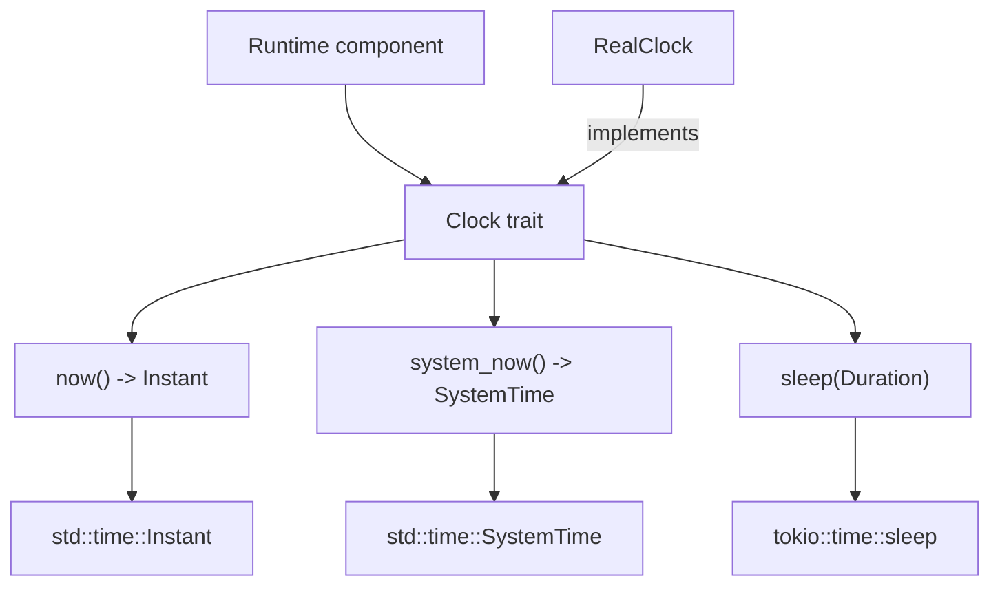

# henyey-clock

Clock abstractions for monotonic time, wall-clock reads, and async sleep.

## Overview

`henyey-clock` is a tiny utility crate that lets higher-level components depend
on a clock interface instead of calling `Instant::now()`, `SystemTime::now()`,
or `tokio::time::sleep()` directly. It is used by runtime crates that need an
injectable timing facade. The crate has no direct stellar-core source
equivalent; it intentionally models only henyey's scoped clock needs, not
stellar-core's combined clock/event-loop/timer queue.

## Architecture



## Key Types

| Type | Description |
|------|-------------|
| `Clock` | Object-safe trait for monotonic time, system time, and sleeps. |
| `RealClock` | Zero-sized production clock backed by standard time and tokio timers. |

## Usage

```rust
use henyey_clock::{Clock, RealClock};

let clock = RealClock;
let started = clock.now();
let wall_time = clock.system_now();

assert!(clock.now() >= started);
let _ = wall_time;
```

```rust
use henyey_clock::{Clock, RealClock};
use std::time::Duration;

# async fn example() {
let clock = RealClock;

clock.sleep(Duration::from_millis(10)).await;
# }
```

```rust
use henyey_clock::{Clock, RealClock};
use std::sync::Arc;
use std::time::{Duration, Instant};

fn elapsed_since<C: Clock>(clock: &C, start: Instant) -> Duration {
    clock.now().saturating_duration_since(start)
}

let clock = RealClock;
let start = clock.now();
let _elapsed = elapsed_since(&clock, start);

let _shared: Arc<dyn Clock> = Arc::new(clock);
```

## Module Layout

| Module | Description |
|--------|-------------|
| `src/lib.rs` | Defines the `Clock` trait, implements `RealClock`, and contains unit tests for the exposed API. |

## Design Notes

- `sleep` lives as a default trait method, so new clock implementations only
  need to supply `now()` unless they need custom async timing behavior.
- `system_now()` also has a default implementation. Consensus-critical callers
  are expected to fail loudly if wall-clock conversion assumptions are violated.
- The crate deliberately does not provide a manually stepped clock. Simulation
  code advances deterministic state directly instead of mutating a shared clock.

## stellar-core Mapping

This crate has no direct stellar-core source equivalent. It is an internal
henyey clock facade rather than a port of `VirtualClock`, `VirtualTimer`, or
stellar-core's event-loop machinery.

## Parity Status

See [PARITY_STATUS.md](PARITY_STATUS.md) for detailed stellar-core parity analysis.
