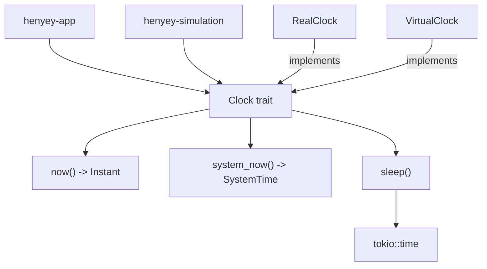

# henyey-clock

Clock abstractions for monotonic time, wall-clock reads, and async timer primitives.

## Overview

`henyey-clock` is a tiny utility crate that lets higher-level components depend on a
clock interface instead of calling `Instant::now()` or `tokio::time` directly. It is
used by crates such as `henyey-app` for runtime injection and by `henyey-simulation`
when wiring simulated nodes. The crate is the closest Rust equivalent to
stellar-core's `VirtualClock` API in `src/util/Timer.h`, but it intentionally only
models timing operations, not the upstream event-loop and scheduler machinery.

## Architecture



## Key Types

| Type | Description |
|------|-------------|
| `Clock` | Object-safe trait for monotonic time, system time, and sleeps |
| `RealClock` | Zero-sized production clock that reads `Instant::now()` directly |
| `VirtualClock` | Clock that anchors `now()` to a stored base `Instant` while still advancing with elapsed real time |

## Usage

```rust
use henyey_clock::{Clock, RealClock};

let clock = RealClock;
let started = clock.now();
let wall_time = clock.system_now();

assert!(clock.now() >= started);
let _ = wall_time;
```

```rust
use futures::StreamExt;
use henyey_clock::{Clock, RealClock};
use std::time::Duration;

# async fn example() {
let clock = RealClock;

clock.sleep(Duration::from_millis(10)).await;
# }
```

```rust
use henyey_clock::{Clock, VirtualClock};
use std::sync::Arc;
use std::time::{Duration, Instant};

fn elapsed_since<C: Clock>(clock: &C, start: Instant) -> Duration {
    clock.now().saturating_duration_since(start)
}

let clock = VirtualClock::new();
let start = clock.now();
let _elapsed = elapsed_since(&clock, start);

let _shared: Arc<dyn Clock> = Arc::new(clock);
```

## Module Layout

| Module | Description |
|--------|-------------|
| `src/lib.rs` | Defines the `Clock` trait, implements `RealClock` and `VirtualClock`, and contains unit tests for the exposed API |

## Design Notes

- `sleep` lives as a default trait method, so new clock implementations only need to supply `now()` unless they need custom async timing behavior.
- `VirtualClock` is not a manually stepped simulator clock; `now()` is derived from its stored base instant plus elapsed time, so it continues to advance after construction.
- Real-time and virtual-time modes are split into separate Rust types instead of a single runtime mode enum, which keeps injection simple for `Arc<dyn Clock>` consumers.

## stellar-core Mapping

| Rust | stellar-core |
|------|--------------|
| `src/lib.rs` | `src/util/Timer.h`, `src/util/Timer.cpp` |

## Parity Status

See [PARITY_STATUS.md](PARITY_STATUS.md) for detailed stellar-core parity analysis.
