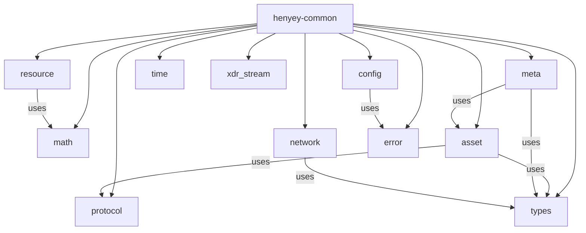

# henyey-common

Common types and utilities shared across all henyey crates.

## Overview

This crate provides the foundational types, traits, and utility functions used throughout the henyey workspace. It corresponds to the shared utilities found in stellar-core's `src/util/` directory and `src/main/` headers. The crate is deliberately dependency-light and contains mostly pure functions and data types with no I/O or side effects (except for configuration file loading), making it safe to depend on from every other crate in the workspace.

## Architecture



## Key Types

| Type | Description |
|------|-------------|
| `Hash256` | 32-byte SHA-256 hash used for ledger hashes, transaction hashes, and network IDs |
| `NetworkId` | Network identifier derived from a passphrase via SHA-256; prevents cross-network replay |
| `Config` | Top-level configuration struct for node setup (network, database, quorum, history, logging) |
| `Error` | Unified error enum covering XDR, I/O, config, validation, and operation failures |
| `Result<T>` | Type alias for `std::result::Result<T, Error>` |
| `ProtocolVersion` | Enum of all known protocol versions (V0-V25) for type-safe version gating |
| `Resource` | Multi-dimensional resource usage vector for surge pricing (1, 2, or 7 dimensions) |
| `ResourceType` | Enum indexing the seven Soroban resource dimensions (ops, instructions, bytes, etc.) |
| `Rounding` | Rounding mode for 128-bit division operations (Down or Up) |
| `MathError` | Error type for overflow, division-by-zero, and negative-input math failures |
| `XdrOutputStream` | Size-prefixed XDR frame writer compatible with stellar-core wire format |
| `XdrInputStream` | Size-prefixed XDR frame reader compatible with stellar-core wire format |
| `BucketListDbConfig` | Configuration for BucketListDB indexing and caching behavior |
| `NoIssuerError` | Error returned when requesting the issuer of a native asset |

## Usage

### Hashing and network identity

```rust
use henyey_common::{Hash256, NetworkId};

// Hash arbitrary data
let hash = Hash256::hash(b"hello world");
assert!(!hash.is_zero());

// Hash XDR-encoded values
// let tx_hash = Hash256::hash_xdr(&transaction_envelope)?;

// Network identity prevents cross-network replay
let testnet = NetworkId::testnet();
let mainnet = NetworkId::mainnet();
assert_ne!(testnet.as_bytes(), mainnet.as_bytes());
```

### Protocol version gating

```rust
use henyey_common::protocol::{
    protocol_version_starts_from, soroban_supported, ProtocolVersion,
};

let ledger_version = 25;

if soroban_supported(ledger_version) {
    // Soroban smart contracts available (V20+)
}

if protocol_version_starts_from(ledger_version, ProtocolVersion::V23) {
    // Parallel Soroban execution, auto-restore
}
```

### Resource accounting

```rust
use henyey_common::resource::{Resource, ResourceType};

let mut r = Resource::make_empty_soroban();
r.set_val(ResourceType::Operations, 1);
r.set_val(ResourceType::Instructions, 1_000_000);

// Resources support arithmetic and partial ordering
let limit = Resource::new(vec![10, 2_000_000, 1024, 4096, 4096, 100, 100]);
assert!(r.leq(&limit));
```

## Module Layout

| Module | Description |
|--------|-------------|
| `lib.rs` | Crate root with re-exports of key types and the `stellar_xdr` crate |
| `types.rs` | `Hash256` type: SHA-256 hashing, hex conversion, XDR interop |
| `math.rs` | 128-bit arithmetic (`big_divide`, `big_square_root`), saturating ops, rounding modes |
| `protocol.rs` | `ProtocolVersion` enum, version comparison functions, feature gate constants |
| `asset.rs` | Asset validation, code conversion, issuer utilities, balance math, price comparison, hash XOR, ledger key extraction, and numeric helpers |
| `resource.rs` | `Resource` vector type with arithmetic, comparison, scaling, and division operations |
| `meta.rs` | Ledger metadata normalization (sorting changes by key, type, hash) for deterministic hashing |
| `config.rs` | `Config` and sub-structs for TOML-based node configuration |
| `network.rs` | `NetworkId` derived from network passphrase via SHA-256 |
| `error.rs` | `Error` enum and `Result` type alias |
| `time.rs` | Unix/Stellar epoch conversions, current timestamp helpers |
| `xdr_stream.rs` | `XdrOutputStream` / `XdrInputStream` for reading and writing size-prefixed XDR frames (RFC 4506 record marking) |

## Design Notes

- **`asset.rs` is intentionally broad**: It aggregates many small stellar-core utility functions (ASCII checks, price comparison, balance math, ledger key extraction, hash XOR) into a single module to mirror the upstream file organization rather than splitting into many tiny modules.
- **`Resource` uses `Vec<i64>` rather than a fixed array**: The number of dimensions varies by transaction type (1 for classic, 2 for classic+bytes, 7 for Soroban), so a dynamic vector is used. The constructor validates that the length is 1, 2, or 7.
- **Metadata normalization is critical for consensus**: The `meta` module sorts ledger entry changes by (XDR-encoded key, change type, full change hash) to produce deterministic metadata hashes regardless of execution order across validators.

## stellar-core Mapping

| Rust | stellar-core |
|------|--------------|
| `types.rs` | `src/util/types.h`, `src/util/HashOfHash.h` |
| `math.rs` | `src/util/numeric.h/.cpp` |
| `protocol.rs` | `src/util/ProtocolVersion.h` |
| `asset.rs` | `src/util/types.h/.cpp`, `src/transactions/TransactionUtils.h/.cpp` |
| `resource.rs` | `src/herder/TxResource.h/.cpp` |
| `meta.rs` | `src/util/MetaUtils.h/.cpp` |
| `network.rs` | `src/main/Config.h` (network passphrase hashing) |
| `config.rs` | `src/main/Config.h/.cpp` (Rust-native TOML implementation) |
| `error.rs` | Rust-native (no direct upstream equivalent) |
| `time.rs` | `src/util/Timer.h/.cpp` (subset) |
| `xdr_stream.rs` | `src/util/XDRStream.h` (output full, basic input) |

## Parity Status

See [PARITY_STATUS.md](PARITY_STATUS.md) for detailed stellar-core parity analysis.
