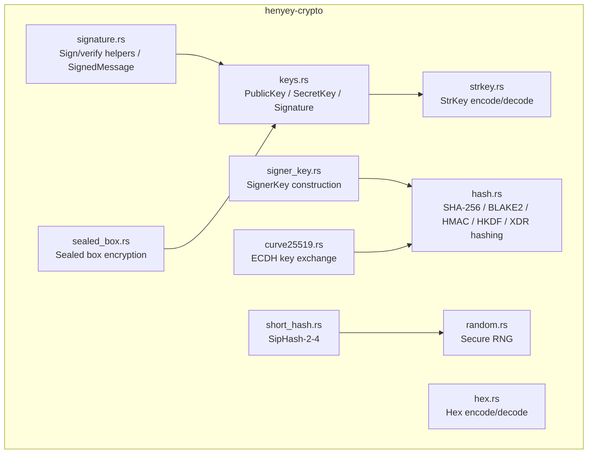

# henyey-crypto

Pure Rust cryptographic primitives for henyey (Stellar Core).

## Overview

This crate provides all cryptographic operations needed by a Stellar Core
implementation, entirely in Rust with no C/C++ dependencies (no libsodium).
It corresponds to the `src/crypto/` directory in upstream stellar-core and is
designed to produce deterministic, bit-compatible results with the C++
implementation. Other henyey crates depend on `henyey-crypto` for signing,
hashing, key encoding, and encryption.

## Architecture



## Key Types

| Type | Description |
|------|-------------|
| `PublicKey` | Ed25519 public key (32 bytes); encodes to account ID (G...) |
| `SecretKey` | Ed25519 secret key (32 bytes); encodes to seed (S...); zeroized on drop |
| `Signature` | Ed25519 signature (64 bytes) |
| `SignedMessage` | Message bundled with signature and signer hint |
| `Curve25519Secret` | X25519 secret scalar for ECDH key exchange; zeroized on drop |
| `Curve25519Public` | X25519 public point for ECDH key exchange |
| `Hash256` | 32-byte hash value (re-exported from `henyey-common`) |
| `Sha256Hasher` | Streaming SHA-256 hasher |
| `Blake2Hasher` | Streaming BLAKE2b-256 hasher |
| `XdrSha256Hasher` | Streaming SHA-256 hasher for XDR serialization |
| `XdrBlake2Hasher` | Streaming BLAKE2b-256 hasher for XDR serialization |
| `CryptoError` | Error type for all cryptographic operations |

## Usage

### Key generation, signing, and verification

```rust
use henyey_crypto::{SecretKey, PublicKey};

// Generate a new keypair
let secret = SecretKey::generate();
let public = secret.public_key();

// Sign and verify
let signature = secret.sign(b"hello stellar");
assert!(public.verify(b"hello stellar", &signature).is_ok());

// StrKey round-trip
let account_id = public.to_strkey();  // G...
let restored = PublicKey::from_strkey(&account_id).unwrap();
assert_eq!(public, restored);
```

### Hashing and HMAC

```rust
use henyey_crypto::{sha256, sha256_multi, Sha256Hasher, hmac_sha256, hmac_sha256_verify};

// Single-shot SHA-256
let hash = sha256(b"hello world");

// Multi-chunk (avoids intermediate allocation)
let hash = sha256_multi(&[b"hello ", b"world"]);

// Streaming
let mut hasher = Sha256Hasher::new();
hasher.update(b"hello ");
hasher.update(b"world");
let hash = hasher.finalize();

// HMAC-SHA256
let key = [0u8; 32];
let mac = hmac_sha256(&key, b"message");
assert!(hmac_sha256_verify(&mac, &key, b"message"));
```

### Sealed box encryption (surveys)

```rust
use henyey_crypto::{SecretKey, seal_to_public_key, open_from_secret_key};

let recipient = SecretKey::generate();
let ciphertext = seal_to_public_key(&recipient.public_key(), b"secret").unwrap();
let plaintext = open_from_secret_key(&recipient, &ciphertext).unwrap();
assert_eq!(plaintext, b"secret");
```

## Module Layout

| Module | Description |
|--------|-------------|
| `lib.rs` | Crate root; module declarations and public re-exports |
| `keys.rs` | `PublicKey`, `SecretKey`, `Signature` types with Ed25519 operations and XDR conversions |
| `hash.rs` | SHA-256, BLAKE2b-256, HMAC-SHA256, HKDF, and XDR hashing (single-shot and streaming) |
| `strkey.rs` | Stellar StrKey base32 encoding/decoding for all key types (G, S, T, X, M, P, C) |
| `signature.rs` | Signing/verification convenience functions, signature hints, and `SignedMessage` |
| `signer_key.rs` | Construction and inspection of XDR `SignerKey` variants (Ed25519, PreAuthTx, HashX, SignedPayload) |
| `short_hash.rs` | Process-global SipHash-2-4 for deterministic bucket list ordering |
| `curve25519.rs` | Curve25519 ECDH key exchange for P2P overlay session key agreement |
| `sealed_box.rs` | Sealed box encryption/decryption for anonymous survey payloads |
| `hex.rs` | Hex encoding/decoding utilities (`bin_to_hex`, `hex_abbrev`, `hex_to_bin`, `hex_to_bin_256`) |
| `random.rs` | Cryptographically secure random byte/integer generation via OS RNG |
| `error.rs` | `CryptoError` enum covering all failure modes |

## Design Notes

- **Key zeroization**: `SecretKey` relies on `ed25519-dalek`'s built-in
  `Zeroize` on drop. `Curve25519Secret` uses the `ZeroizeOnDrop` derive.
  Neither type exposes key material in `Debug` output.
- **Short hash global state**: The SipHash key is stored in a `Mutex` behind
  `OnceLock`. Once any hash is computed, the key is locked and cannot be
  reseeded with a different value. This ensures deterministic ordering within
  a process.
- **XDR hashing allocates**: Unlike stellar-core's zero-allocation `XDRHasher`
  CRTP pattern, the Rust implementation serializes XDR to a `Vec<u8>` first.
  This is simpler and sufficient for current workloads.
- **Constant-time HMAC verification**: `hmac_sha256_verify` delegates to the
  `hmac` crate's `verify_slice`, which performs constant-time comparison.

## stellar-core Mapping

| Rust | stellar-core |
|------|--------------|
| `keys.rs` | `src/crypto/SecretKey.h` / `SecretKey.cpp` |
| `hash.rs` | `src/crypto/SHA.h` / `SHA.cpp`, `src/crypto/BLAKE2.h` / `BLAKE2.cpp` |
| `strkey.rs` | `src/crypto/StrKey.h` / `StrKey.cpp` |
| `signature.rs` | `src/crypto/SecretKey.h` (signing/verification helpers) |
| `signer_key.rs` | `src/crypto/SignerKey.h` / `SignerKeyUtils.h` |
| `short_hash.rs` | `src/crypto/ShortHash.h` / `ShortHash.cpp` |
| `curve25519.rs` | `src/crypto/Curve25519.h` / `Curve25519.cpp` |
| `sealed_box.rs` | `src/crypto/Curve25519.h` (sealed box functions) |
| `hex.rs` | `src/crypto/Hex.h` / `Hex.cpp` |
| `random.rs` | `src/crypto/Random.h` / `Random.cpp` |
| `error.rs` | (no direct equivalent; C++ uses exceptions) |

## Parity Status

See [PARITY_STATUS.md](PARITY_STATUS.md) for detailed stellar-core parity analysis.
