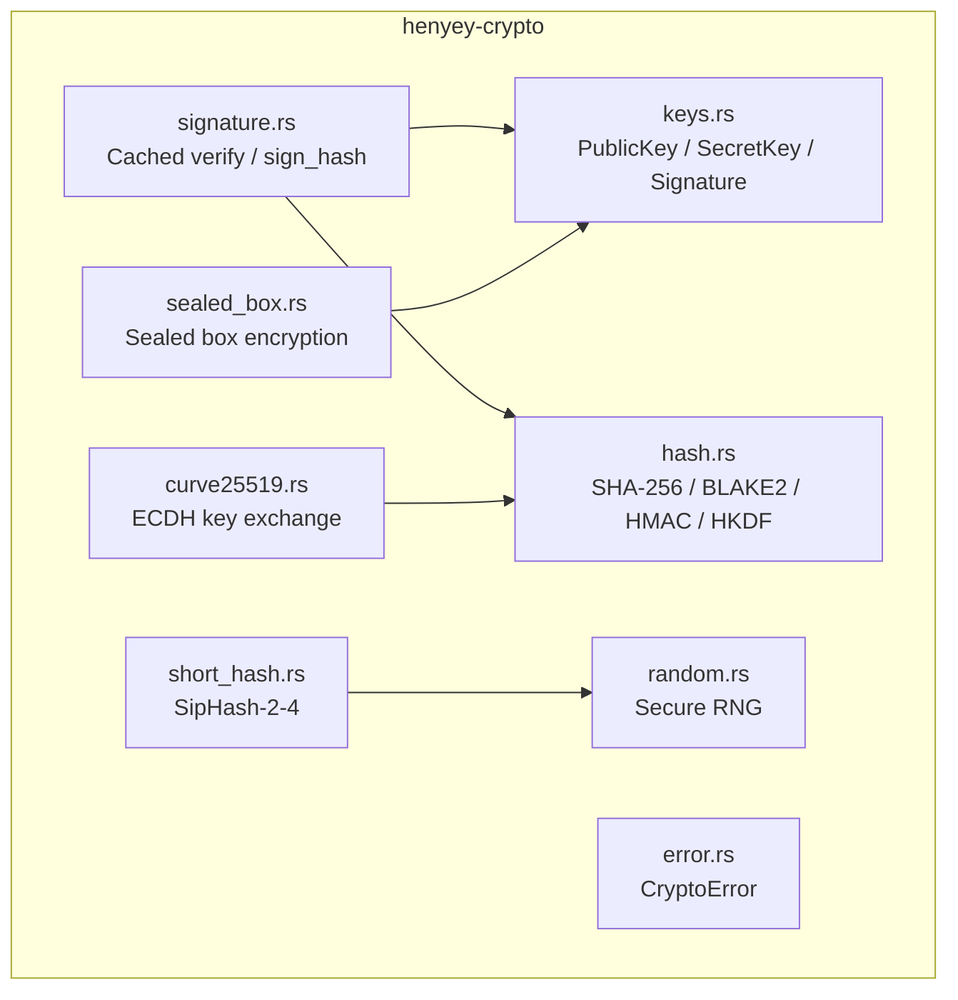

# henyey-crypto

Pure Rust cryptographic primitives for henyey (Stellar Core).

## Overview

This crate provides the cryptographic building blocks used across henyey,
including Ed25519 signing, SHA-256 and BLAKE2 hashing, StrKey handling,
Curve25519 key agreement, and sealed-box encryption. It corresponds to the
`src/crypto/` directory in upstream stellar-core and aims for deterministic,
bit-compatible behavior with the C++ implementation. Other crates rely on it
for transaction signatures, overlay session keys, signer-key construction, and
survey payload encryption.

## Architecture


```mermaid
graph TD
    subgraph "henyey-crypto"
        keys[keys.rs<br>PublicKey / SecretKey / Signature]
        hash[hash.rs<br>SHA-256 / BLAKE2 / HMAC / HKDF]
        signature[signature.rs<br>Cached verify / sign_hash]
        short_hash[short_hash.rs<br>SipHash-2-4]
        curve25519[curve25519.rs<br>ECDH key exchange]
        sealed_box[sealed_box.rs<br>Sealed box encryption]
        random[random.rs<br>Secure RNG]
        error[error.rs<br>CryptoError]
    end

    signature --> keys
    signature --> hash
    sealed_box --> keys
    curve25519 --> hash
    short_hash --> random
```

## Key Types

| Type | Description |
|------|-------------|
| `PublicKey` | Ed25519 public key (32 bytes); encodes to account ID (G...) |
| `SecretKey` | Ed25519 secret key (32 bytes); encodes to seed (S...); zeroized on drop |
| `Signature` | Ed25519 signature (64 bytes) |
| `Curve25519Secret` | X25519 secret scalar for ECDH key exchange; zeroized on drop |
| `Curve25519Public` | X25519 public point for ECDH key exchange |
| `KeyOrdering` | Selects public-key concatenation order for Stellar overlay shared-key derivation |
| `Hash256` | 32-byte hash value (re-exported from `henyey-common`) |
| `Sha256Hasher` | Streaming SHA-256 hasher |
| `CryptoError` | Error type for all cryptographic operations |

## Usage

### Key generation, signing, and verification

```rust
use henyey_crypto::{SecretKey, PublicKey};

// Generate a new keypair
let secret = SecretKey::generate();
let public = secret.public_key();

// Sign and verify
let signature = secret.sign(b"hello stellar");
assert!(public.verify(b"hello stellar", &signature).is_ok());

// StrKey round-trip
let account_id = public.to_strkey();  // G...
let restored = PublicKey::from_strkey(&account_id).unwrap();
assert_eq!(public, restored);
```

### Hashing

```rust
use henyey_crypto::{blake2, sha256, Sha256Hasher};

// Single-shot SHA-256
let sha = sha256(b"hello world");
let digest = blake2(b"hello world");

// Streaming
let mut hasher = Sha256Hasher::new();
hasher.update(b"hello ");
hasher.update(b"world");
assert_eq!(sha, hasher.finalize());
assert_ne!(sha, digest);
```

### Sealed box encryption with Curve25519 keys

```rust
use henyey_crypto::{
    Curve25519Secret, open_from_curve25519_secret_key, seal_to_curve25519_public_key,
};

let recipient = Curve25519Secret::random();
let public = recipient.derive_public();
let secret_bytes = recipient.to_bytes();

let ciphertext = seal_to_curve25519_public_key(public.as_bytes(), b"secret").unwrap();
let plaintext = open_from_curve25519_secret_key(&secret_bytes, &ciphertext).unwrap();
assert_eq!(plaintext, b"secret");
```

## Module Layout

| Module | Description |
|--------|-------------|
| `lib.rs` | Crate root; module declarations and public re-exports |
| `keys.rs` | `PublicKey`, `SecretKey`, `Signature` types with Ed25519 operations, XDR conversions, and `account_id_to_strkey` |
| `hash.rs` | SHA-256, BLAKE2b-256, internal HMAC-SHA256/HKDF helpers, and test-only XDR hashing |
| `signature.rs` | Process-global cached signature verification helpers, plus `sign_hash` and `verify_hash_from_raw_key` |
| `short_hash.rs` | Process-global SipHash-2-4 for deterministic bucket list ordering |
| `curve25519.rs` | Curve25519 ECDH key exchange for P2P overlay session key agreement |
| `sealed_box.rs` | Sealed box encryption/decryption for anonymous survey payloads (Ed25519 and Curve25519 key variants) |
| `random.rs` | Cryptographically secure random byte/integer generation via OS RNG |
| `error.rs` | `CryptoError` enum covering all failure modes |

## Design Notes

- **Key zeroization**: `SecretKey` relies on `ed25519-dalek`'s built-in
  `Zeroize` on drop. `Curve25519Secret` uses the `ZeroizeOnDrop` derive.
  Neither type exposes key material in `Debug` output.
- **Signature verification cache**: `verify_hash_from_raw_key` maintains a
  process-global 250K-entry cache keyed by BLAKE2(pubkey || sig || hash).
  Cache lookups use a `RwLock` for parallel read access; only inserts take
  an exclusive write lock. On cache hits the Ed25519 point decompression
  (~35 us) is skipped entirely. Eviction is FIFO via a `VecDeque`.
- **Short hash global state**: The SipHash key is stored in a `Mutex` behind
  `OnceLock`. Once any hash is computed, the key is locked and cannot be
  reseeded with a different value. This ensures deterministic ordering within
  a process.
- **XDR hashing allocates**: Unlike stellar-core's zero-allocation `XDRHasher`
  CRTP pattern, the Rust implementation serializes XDR to a `Vec<u8>` first.
  This is simpler and sufficient for current workloads.
- **Constant-time HMAC verification**: the internal test-only
  `hmac_sha256_verify` helper delegates to the `hmac` crate's `verify_slice`,
  which performs constant-time comparison.
- **StrKey encoding**: Delegated entirely to the `stellar-strkey` crate
  (re-exported as `henyey_crypto::stellar_strkey`), with convenience methods
  on `PublicKey` and `SecretKey` for the common encode/decode operations.

## stellar-core Mapping

| Rust | stellar-core |
|------|--------------|
| `keys.rs` | `src/crypto/SecretKey.h` / `SecretKey.cpp` |
| `hash.rs` | `src/crypto/SHA.h` / `SHA.cpp`, `src/crypto/BLAKE2.h` / `BLAKE2.cpp` |
| `signature.rs` | `src/crypto/SecretKey.h` (signing/verification helpers, `gVerifySigCache`) |
| `short_hash.rs` | `src/crypto/ShortHash.h` / `ShortHash.cpp` |
| `curve25519.rs` | `src/crypto/Curve25519.h` / `Curve25519.cpp` |
| `sealed_box.rs` | `src/crypto/Curve25519.h` (sealed box functions) |
| `random.rs` | `src/crypto/Random.h` / `Random.cpp` |
| `error.rs` | (no direct equivalent; C++ uses exceptions) |
| *(re-export)* `stellar_strkey` | `src/crypto/StrKey.h` / `StrKey.cpp`, `src/crypto/KeyUtils.h` / `KeyUtils.cpp` |
| *(not implemented)* | `src/crypto/SignerKey.h`, `src/crypto/SignerKeyUtils.h` |
| *(omitted)* | `src/crypto/Hex.h` / `Hex.cpp` (direct `hex` crate use) |

## Parity Status

See [PARITY_STATUS.md](PARITY_STATUS.md) for detailed stellar-core parity analysis.
