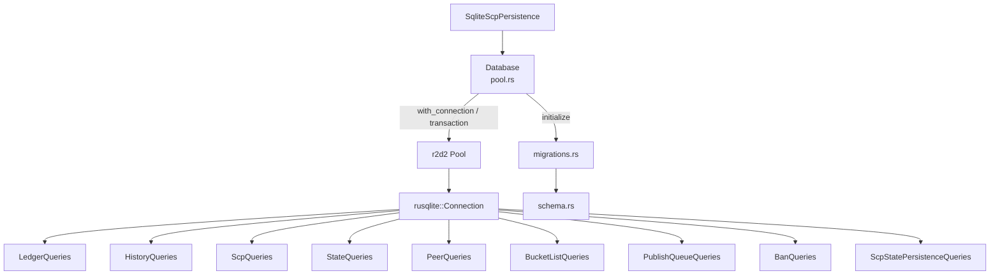

# henyey-db

SQLite persistence layer for the henyey Stellar blockchain node.

## Overview

This crate provides database abstraction for the henyey node, handling persistent storage and retrieval of ledger headers, transaction history, SCP consensus state, bucket list snapshots, peer records, and operational configuration. It corresponds to stellar-core's `src/database/` module and the SQL operations spread across its codebase. The Rust implementation uses `rusqlite` with `r2d2` connection pooling (SQLite only), whereas stellar-core uses SOCI with SQLite and PostgreSQL support.

## Architecture



## Key Types

| Type | Description |
|------|-------------|
| `Database` | Connection pool handle with high-level query methods |
| `DbError` | Unified error enum for all database operations |
| `PooledConnection` | A connection borrowed from the r2d2 pool |
| `PeerRecord` | Network peer connection metadata (next attempt, failures, type) |
| `TxRecord` | Stored transaction with body, result, and optional metadata |
| `SqliteScpPersistence` | SCP state persistence backed by SQLite |
| `LedgerQueries` | Trait for ledger header storage and retrieval |
| `HistoryQueries` | Trait for transaction history and results |
| `ScpQueries` | Trait for SCP envelopes and quorum sets |
| `ScpStatePersistenceQueries` | Trait for SCP slot state and tx set persistence |
| `StateQueries` | Trait for key-value state storage |
| `PeerQueries` | Trait for network peer tracking |
| `BucketListQueries` | Trait for bucket list snapshots |
| `PublishQueueQueries` | Trait for history archive publish queue |
| `BanQueries` | Trait for node ban list management |

## Usage

### Opening a database

```rust
use henyey_db::Database;

// Open a persistent database (creates file and parent dirs if needed)
let db = Database::open("path/to/stellar.db")?;

// Or use an in-memory database for testing
let test_db = Database::open_in_memory()?;
```

### Querying data

```rust
// High-level convenience methods on Database
if let Some(seq) = db.get_latest_ledger_seq()? {
    println!("Latest ledger: {}", seq);
}

if let Some(header) = db.get_ledger_header(100)? {
    println!("Ledger {} closed at {}", header.ledger_seq, header.scp_value.close_time.0);
}
```

### Using query traits directly

```rust
use henyey_db::{Database, queries::LedgerQueries};

let db = Database::open_in_memory()?;
db.with_connection(|conn| {
    let header = conn.load_ledger_header(100)?;
    Ok(header)
})?;

// Atomic multi-statement operations
db.transaction(|tx| {
    tx.execute("INSERT INTO storestate (statename, state) VALUES ('key', 'value')", [])?;
    tx.execute("UPDATE storestate SET state = 'new' WHERE statename = 'key'", [])?;
    Ok(())
})?;
```

## Module Layout

| Module | Description |
|--------|-------------|
| `lib.rs` | Crate root: re-exports, `Result` alias, `Database` convenience methods |
| `error.rs` | `DbError` enum with conversions from rusqlite, r2d2, XDR, and I/O errors |
| `pool.rs` | `Database` struct wrapping an r2d2 connection pool; `with_connection` and `transaction` helpers |
| `schema.rs` | `CREATE_SCHEMA` SQL constant and `state_keys` module with well-known storestate keys |
| `migrations.rs` | Versioned migration system: `CURRENT_VERSION`, `run_migrations`, `verify_schema` |
| `scp_persistence.rs` | `SqliteScpPersistence` bridging herder persistence to database queries |
| `queries/mod.rs` | Re-exports all query traits |
| `queries/ledger.rs` | `LedgerQueries` trait: store/load headers, load by hash, get latest seq, stream to XDR, delete old entries |
| `queries/history.rs` | `HistoryQueries` trait: individual txs, tx sets, tx results, stream to XDR |
| `queries/scp.rs` | `ScpQueries` and `ScpStatePersistenceQueries` traits: envelopes, quorum sets, stream to XDR, slot state |
| `queries/state.rs` | `StateQueries` trait: generic key-value get/set/delete on storestate table |
| `queries/peers.rs` | `PeerQueries` trait: store/load peers, random peer selection with filters |
| `queries/bucket_list.rs` | `BucketListQueries` trait: store/load bucket list levels at checkpoint ledgers |
| `queries/publish_queue.rs` | `PublishQueueQueries` trait: enqueue/dequeue/load pending history checkpoints |
| `queries/ban.rs` | `BanQueries` trait: ban/unban nodes, check ban status |

## Design Notes

- **Query traits on Connection**: All query methods are implemented as traits on `rusqlite::Connection`. This allows them to work with both raw connections and transactions (which deref to `Connection`), and lets `Database` provide thin wrappers via `with_connection`.

- **Schema migrations**: Fresh databases get the full schema from `CREATE_SCHEMA`; existing databases are migrated incrementally. Each migration runs in its own transaction for atomicity.

- **SQLite tuning**: WAL journal mode, NORMAL synchronous, 64 MB cache, 30 s busy timeout, foreign keys ON, temp store in memory. The connection pool allows up to 10 concurrent connections for file-based databases and 1 for in-memory.

- **XDR storage**: Unlike stellar-core which stores XDR as base64 TEXT, this crate stores XDR as raw BLOB for efficiency. The exception is SCP slot state and tx set data in the storestate table, which use base64 encoding since they share the TEXT-valued storestate table.

- **History archive streaming**: The `copy_ledger_headers_to_stream`, `copy_tx_history_to_streams`, and `copy_scp_history_to_stream` methods write XDR records to `XdrOutputStream` for history archive checkpoint file generation. These correspond to stellar-core's `copyToStream` and `populateCheckpointFilesFromDB` functions.

## stellar-core Mapping

| Rust | stellar-core |
|------|--------------|
| `pool.rs` | `src/database/Database.cpp` |
| `schema.rs` | Various `dropAll()` functions across the codebase |
| `migrations.rs` | `Database::upgradeToCurrentSchema()` |
| `queries/state.rs` | `src/main/PersistentState.cpp` |
| `queries/ledger.rs` | `src/ledger/LedgerHeaderUtils.cpp` |
| `queries/scp.rs` | `src/herder/HerderPersistenceImpl.cpp` |
| `queries/peers.rs` | `src/overlay/PeerManager.cpp` |
| `queries/ban.rs` | `src/overlay/BanManagerImpl.cpp` |
| `queries/history.rs` | `src/transactions/TransactionSQL.cpp` |
| `queries/publish_queue.rs` | `src/history/HistoryManagerImpl.cpp` |
| `queries/bucket_list.rs` | No direct stellar-core equivalent (Rust-specific) |
| `scp_persistence.rs` | `src/herder/HerderPersistenceImpl.cpp` |

## Parity Status

See [PARITY_STATUS.md](PARITY_STATUS.md) for detailed stellar-core parity analysis.
