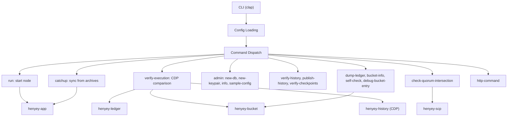

# henyey

Main binary crate -- a pure Rust implementation of Stellar Core's CLI and node entry point.

## Overview

This crate is the primary executable for henyey, providing a command-line interface that wraps
the `henyey-app` library crate. It handles argument parsing (via `clap`), configuration loading,
logging initialization, and command dispatch. The actual node implementation, catchup logic,
consensus, and subsystem coordination are handled by the underlying library crates (`henyey-app`,
`henyey-ledger`, `henyey-overlay`, `henyey-herder`, etc.).

The crate corresponds to stellar-core's `main.cpp` entry point and its collection of CLI
subcommands defined in `CommandLine.cpp`.

## Architecture



## Key Types

| Type | Description |
|------|-------------|
| `Cli` | Top-level clap argument struct with global options (config, verbose, network, metadata-output-stream) |
| `Commands` | Enum of all CLI subcommands (Run, Catchup, NewDb, VerifyExecution, DumpLedger, etc.) |
| `CliLogFormat` | Log format selection enum (Text, Json) |
| `VerifyExecutionOptions` | Options struct for the verify-execution command |
| `CommandArchiveTarget` | Configuration for publishing to remote archives via shell commands |

## Usage

### Running a node

```bash
# Run on testnet (default)
henyey --testnet run

# Run as validator
henyey --testnet run --validator

# Run as watcher (observe only)
henyey --testnet run --watcher
```

### Catching up from history archives

```bash
# Catch up to current ledger (minimal mode)
henyey --testnet catchup current

# Catch up with complete history, 16 parallel downloads
henyey --testnet catchup current --mode complete --parallelism 16
```

### Offline verification against CDP

```bash
# Compare transaction execution against CDP metadata
henyey --testnet verify-execution --from 310000 --to 311000 --stop-on-error

# This restores bucket list state from a checkpoint, then re-executes
# transactions via close_ledger and compares results against CDP metadata.
# Differences indicate execution divergence from stellar-core.
```

### Other commands

```bash
# Generate a new node keypair
henyey new-keypair

# Create a fresh database
henyey --testnet new-db --force

# Verify history archive integrity
henyey --testnet verify-history --from 1 --to 100000

# Publish history to archives (validators only)
henyey --config validator.toml publish-history

# Check quorum intersection from JSON
henyey check-quorum-intersection network.json

# Send command to running node
henyey http-command info
```

## Module Layout

| Module | Description |
|--------|-------------|
| `main.rs` | CLI entry point, argument parsing, configuration loading, and all command handlers |
| `quorum_intersection.rs` | Quorum intersection analysis -- loads a JSON network config and checks that all quorums overlap |
| `bin/header_compare.rs` | Separate binary for comparing ledger headers between a local database and a history archive |

## Design Notes

- **Single-file command handlers**: All command implementations live in `main.rs` rather than
  being split across modules. This keeps the crate simple since it is a thin CLI wrapper, though
  `cmd_verify_execution` and `cmd_publish_history` are notably large functions.

- **Archive helper functions**: Common patterns for creating `HistoryArchive` clients from config
  are factored into `first_archive()` and `all_archives()` helpers to reduce repetition across
  the many commands that need archive access.

- **Temporary directory lifetime management**: The `cmd_verify_execution` function uses
  `Option<tempfile::TempDir>` holders to keep temporary directories alive for the duration of
  execution when caching is disabled. The TempDir is dropped (and cleaned up) when the function
  returns.

- **Quorum intersection algorithm**: The `quorum_intersection` module uses a brute-force O(2^n)
  algorithm that enumerates all node subsets. It is capped at 20 nodes to prevent runaway
  computation. stellar-core also has a SAT-solver-based v2 algorithm which is not yet implemented.

- **CDP integration**: The `verify-execution` and `debug-bucket-entry` commands use CDP
  (Crypto Data Platform) as ground truth for comparing transaction execution results. This is
  unique to the Rust implementation and is the primary tool for parity testing.

## stellar-core Mapping

| Rust | stellar-core |
|------|--------------|
| `main.rs` (CLI + dispatch) | `src/main/main.cpp`, `src/main/CommandLine.cpp` |
| `main.rs` (`cmd_run`) | `src/main/ApplicationUtils.cpp` (`runWithConfig`) |
| `main.rs` (`cmd_catchup`) | `src/main/ApplicationUtils.cpp` (`catchup`) |
| `main.rs` (`cmd_publish_history`) | `src/main/ApplicationUtils.cpp` (`publish`) |
| `main.rs` (`cmd_verify_history`) | `src/main/ApplicationUtils.cpp` (`verifyHistory`) |
| `main.rs` (`cmd_self_check`) | `src/main/ApplicationUtils.cpp` (`selfCheck`) |
| `main.rs` (`cmd_dump_ledger`) | `src/main/ApplicationUtils.cpp` (`dumpLedger`) |
| `main.rs` (`cmd_http_command`) | `src/main/CommandLine.cpp` (`httpCommand`) |
| `main.rs` (`cmd_new_keypair`) | `src/main/CommandLine.cpp` (`genSeed`) |
| `main.rs` (`cmd_verify_checkpoints`) | `src/main/CommandLine.cpp` (`writeVerifiedCheckpointHashes`) |
| `quorum_intersection.rs` | `src/herder/QuorumIntersectionChecker*` (v1 brute-force only) |
| `bin/header_compare.rs` | No direct upstream equivalent (debugging tool) |

## Parity Status

See [PARITY_STATUS.md](PARITY_STATUS.md) for detailed stellar-core parity analysis.
