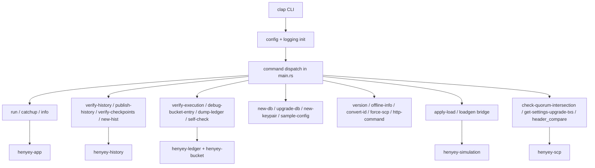

# henyey

Primary CLI and node entry point for the henyey Stellar Core implementation.

## Overview

`henyey` is the workspace's main binary crate. It parses command-line arguments, loads and translates configuration, initializes logging, and dispatches operational commands into the underlying library crates such as `henyey-app`, `henyey-history`, `henyey-ledger`, `henyey-simulation`, and `henyey-rpc`. For stellar-core parity work it mostly corresponds to `src/main/main.cpp`, `src/main/CommandLine.cpp`, `src/main/ApplicationUtils.cpp`, and the settings-upgrade helpers in `src/main/SettingsUpgradeUtils.cpp`.

## Architecture


```mermaid
flowchart TD
    CLI[clap CLI] --> Init[config + logging init]
    Init --> Dispatch[command dispatch in main.rs]
    Dispatch --> Run[run / catchup / info]
    Dispatch --> History[verify-history / publish-history / verify-checkpoints / new-hist]
    Dispatch --> Verify[verify-execution / debug-bucket-entry / dump-ledger / self-check]
    Dispatch --> Admin[new-db / upgrade-db / new-keypair / sample-config]
    Dispatch --> Compat[version / offline-info / convert-id / force-scp / http-command]
    Dispatch --> Bench[apply-load / loadgen bridge]
    Dispatch --> Tools[check-quorum-intersection / get-settings-upgrade-txs / header_compare]
    Run --> App[henyey-app]
    History --> HistLib[henyey-history]
    Verify --> Ledger[henyey-ledger + henyey-bucket]
    Bench --> Sim[henyey-simulation]
    Tools --> SCP[henyey-scp]
```

## Key Types

| Type | Description |
|------|-------------|
| `Cli` | Top-level clap parser containing global flags such as `--config`, `--testnet`, `--mainnet`, and `--metadata-output-stream`. |
| `Commands` | Enum of all supported subcommands, including node operation, history, diagnostics, compatibility utilities, and benchmarking. |
| `CliLogFormat` | CLI-facing log format selector that maps to `henyey_app::LogFormat`. |
| `SimulationLoadGenRunner` | `LoadGenRunner` implementation that wires the node's HTTP load-generation commands into `henyey-simulation`. |
| `VerifyExecutionOptions` | Parameter bundle for the offline CDP-based execution verifier. |
| `CommandArchiveTarget` | Shell-command-based publish target used for writable history archives configured with `put` and optional `mkdir` commands. |
| `QsetEntry` | JSON quorum-set representation consumed by the quorum intersection checker. |
| `Args` | Dedicated clap parser for the `header_compare` debugging binary. |
| `ConfigUpgradeSetKey` | Final identifier emitted by `get-settings-upgrade-txs` for the uploaded Soroban config-upgrade payload. |

## Usage

```rust
use std::process::Command;

# fn main() -> std::io::Result<()> {
let status = Command::new("henyey")
    .args(["--testnet", "run", "--watcher"])
    .status()?;
assert!(status.success());
# Ok(())
# }
```

```rust
use std::process::Command;

# fn main() -> std::io::Result<()> {
let status = Command::new("henyey")
    .args([
        "--testnet",
        "catchup",
        "current",
        "--mode",
        "complete",
        "--parallelism",
        "16",
    ])
    .status()?;
assert!(status.success());
# Ok(())
# }
```

```rust
use std::process::{Command, Stdio};

# fn main() -> std::io::Result<()> {
let mut child = Command::new("henyey")
    .args([
        "get-settings-upgrade-txs",
        "GBZXN7PIRZGNMHGA7MUUUF4GWPY5AYPV6LY4UV2GL6VJGIQRXFDNMADI",
        "42",
        "Test SDF Network ; September 2015",
        "--xdr",
        "AAAA...",
        "--signtxs",
    ])
    .stdin(Stdio::piped())
    .spawn()?;

// Write the secret seed to stdin when signing is requested.
let status = child.wait()?;
assert!(status.success());
# Ok(())
# }
```

## Module Layout

| Module | Description |
|--------|-------------|
| `build.rs` | Injects the git commit hash and UTC build timestamp into compile-time environment variables. |
| `src/main.rs` | Main CLI entry point plus command handlers for running the node, history tooling, diagnostics, compatibility commands, and benchmarks. |
| `src/main.rs` (`loadgen_runner`) | Bridges `henyey-app` load-generation hooks to `henyey-simulation::LoadGenerator`. |
| `src/publish_history.rs` | Implements the history publishing command and command-archive target support. |
| `src/quorum_intersection.rs` | Loads stellar-core-style JSON quorum descriptions and checks satisfiability plus quorum intersection. |
| `src/settings_upgrade.rs` | Builds and optionally signs the four Soroban settings-upgrade transactions that mirror stellar-core's upgrade utility. |
| `src/verify_execution.rs` | Offline execution verifier that restores bucket state and replays ledgers against CDP metadata. |
| `src/bin/header_compare.rs` | Separate debugging binary that compares local and archived ledger headers and optional transaction result sets. |

## Design Notes

- Most command handlers live in `src/main.rs`, keeping the crate thin but making it the central integration point for many workspace crates.
- `run --local` bootstraps a complete single-node standalone network: it creates the database, initializes genesis state, enables accelerated time, initializes a local history archive, and forces SCP bootstrap on the next run.
- History publishing supports both direct filesystem archives and shell-command archives, matching stellar-core's `put`/`mkdir` archive configuration style.
- `verify-execution` restores bucket state from a history archive state snapshot, restarts pending merges in the same structure-based mode used by online stellar-core, and then replays ledgers against CDP metadata as the parity oracle.

## stellar-core Mapping

| Rust | stellar-core |
|------|--------------|
| `src/main.rs` (`main`, `Cli`, `Commands`) | `src/main/main.cpp`, `src/main/CommandLine.cpp` |
| `src/main.rs` (`cmd_run`, `cmd_catchup`, `cmd_publish_history`, `cmd_self_check`, `cmd_dump_ledger`) | `src/main/ApplicationUtils.cpp` |
| `src/main.rs` (`cmd_version`, `cmd_convert_id`, `cmd_force_scp`, `cmd_new_hist`, `cmd_verify_checkpoints`, `cmd_http_command`) | `src/main/CommandLine.cpp` |
| `src/main.rs` (`cmd_apply_load`, `loadgen_runner`) | `src/main/CommandLine.cpp`, `src/simulation/LoadGenerator.cpp` |
| `src/main.rs` (`cmd_verify_execution`, `cmd_debug_bucket_entry`) | No direct upstream equivalent; parity/debug tooling specific to henyey |
| `src/quorum_intersection.rs` | `src/herder/QuorumIntersectionCheckerImpl.cpp`, `src/herder/QuorumIntersectionCheckerImpl.h` |
| `src/settings_upgrade.rs` | `src/main/SettingsUpgradeUtils.cpp`, parts of `src/main/CommandLine.cpp` and `src/main/dumpxdr.cpp` |
| `src/bin/header_compare.rs` | No direct upstream equivalent |

## Parity Status

See [PARITY_STATUS.md](PARITY_STATUS.md) for detailed stellar-core parity analysis.
