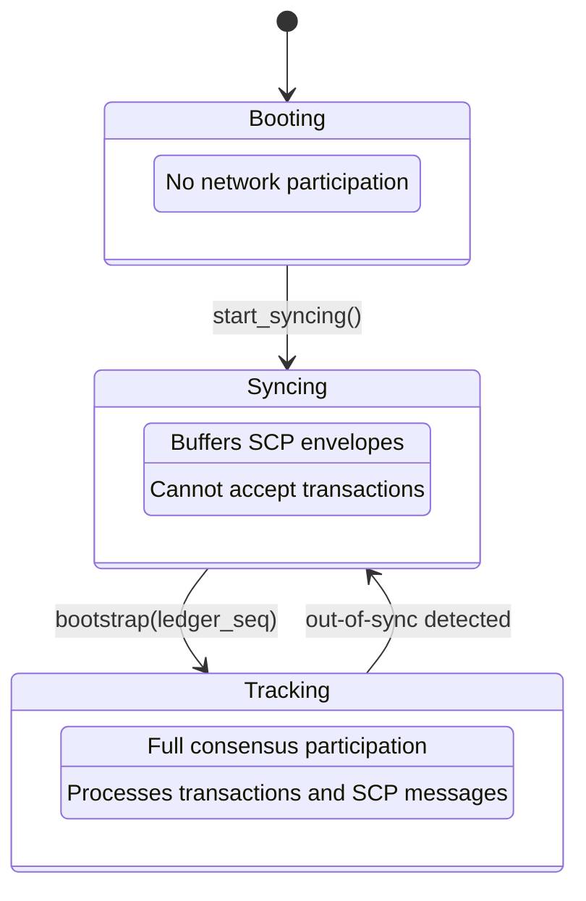
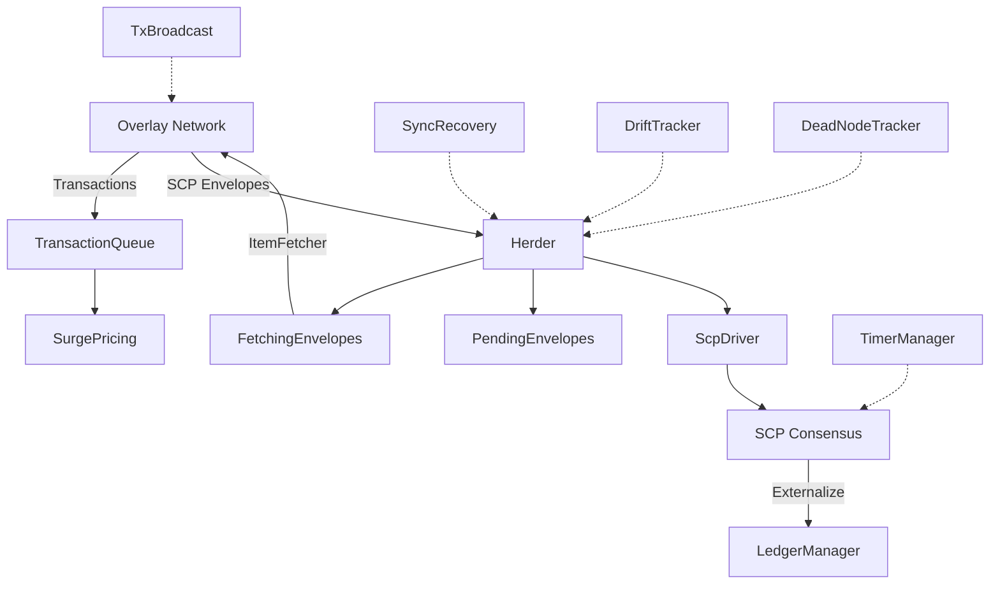

# henyey-herder

SCP coordination and ledger-close orchestration for henyey.

## Overview

The Herder is the central coordinator that bridges the overlay network and the ledger manager through SCP (Stellar Consensus Protocol). It orchestrates the entire flow from receiving transactions and SCP messages, through consensus, to triggering ledger close. This crate corresponds to stellar-core's `src/herder/` directory and implements `HerderImpl`, `HerderSCPDriver`, `TransactionQueue`, `PendingEnvelopes`, `Upgrades`, and related components.

The Herder operates in two modes: **Observer** (tracks consensus without voting) and **Validator** (proposes values and votes via SCP). It progresses through three states: Booting, Syncing, and Tracking.

## Architecture





## Key Types

| Type | Description |
|------|-------------|
| `Herder` | Central coordinator: consensus, tx queue, envelope processing |
| `HerderConfig` | Configuration: validator mode, queue limits, quorum set, timing |
| `HerderState` | State machine enum: Booting, Syncing, Tracking |
| `EnvelopeState` | Result of receiving an SCP envelope (Valid, Pending, Fetching, etc.) |
| `ScpDriver` | SCP callback bridge: value validation, signing, tx set caching |
| `HerderScpCallback` | Wrapper implementing `SCPDriver` trait for the SCP layer |
| `TransactionQueue` | Pending tx mempool with surge pricing and lane-based limits |
| `TransactionSet` | Built tx set ready for consensus (classic + Soroban phases) |
| `QueuedTransaction` | A transaction in the queue with metadata (hash, fee, account) |
| `TxQueueConfig` | Queue configuration: limits, fees, lane sizing, filtering |
| `PendingEnvelopes` | Buffer for SCP envelopes arriving for future slots |
| `FetchingEnvelopes` | Manages envelopes waiting for TxSet/QuorumSet fetches |
| `QuorumTracker` | Transitive quorum membership graph for security checks |
| `SlotQuorumTracker` | Per-slot quorum heard-from and v-blocking checks |
| `Upgrades` | Ledger upgrade scheduling and validation |
| `LedgerCloseData` | Complete data package from consensus for ledger close |
| `ScpPersistenceManager` | SCP state persistence for crash recovery |
| `TimerManager` | Async SCP nomination/ballot timeout scheduling |
| `SyncRecoveryManager` | Out-of-sync detection and recovery |
| `TxBroadcastManager` | Periodic transaction flooding to peers |
| `CloseTimeDriftTracker` | Close time drift monitoring |
| `DeadNodeTracker` | Missing/dead validator detection |
| `HerderCallback` | Trait for Herder event notifications |
| `PendingTransaction` | Transaction envelope with hash, used in callbacks |
| `ExternalizedValue` | Externalized slot data for callbacks |

## Usage

### Observer Setup

```rust
use henyey_herder::{Herder, HerderConfig, HerderState, EnvelopeState};

let config = HerderConfig::default();
let herder = Herder::new(config);

// Progress through state machine
herder.start_syncing();
herder.bootstrap(ledger_seq);

// Process incoming SCP envelopes
match herder.receive_scp_envelope(envelope) {
    EnvelopeState::Valid => { /* New valid envelope */ }
    EnvelopeState::Pending => { /* Buffered for future slot */ }
    EnvelopeState::Fetching => { /* Waiting for dependencies */ }
    EnvelopeState::TooOld => { /* Slot already passed */ }
    _ => {}
}

// Check for ledger close
if let Some(close_data) = herder.check_ledger_close(slot) {
    // Apply transaction set and close ledger
    herder.ledger_closed(slot, &applied_tx_hashes);
}
```

### Validator Setup

```rust
use henyey_herder::{Herder, HerderConfig};
use henyey_crypto::SecretKey;

let secret = SecretKey::from_seed(&seed);
let config = HerderConfig {
    is_validator: true,
    node_public_key: secret.public_key(),
    local_quorum_set: Some(quorum_set),
    ledger_close_time: 5,
    ..Default::default()
};
let herder = Herder::with_secret_key(config, secret);

// Set up envelope broadcasting
herder.set_envelope_sender(|envelope| {
    overlay.broadcast_scp(envelope);
});

// Trigger consensus for the next ledger
herder.trigger_next_ledger(ledger_seq).await;
```

### Transaction Queue

```rust
use henyey_herder::{TransactionQueue, TxQueueConfig, TxQueueResult};

let queue = TransactionQueue::new(TxQueueConfig {
    max_size: 5000,
    min_fee_per_op: 100,
    max_dex_ops: Some(500),
    ..Default::default()
});

match queue.try_add(tx_envelope) {
    TxQueueResult::Added => { /* Queued successfully */ }
    TxQueueResult::FeeTooLow => { /* Surge pricing rejected it */ }
    TxQueueResult::Banned => { /* Previously failed tx */ }
    _ => {}
}

// Build transaction set for consensus
let (tx_set, gen_tx_set) = queue.build_generalized_tx_set(
    previous_ledger_hash, max_ops,
);
```

## Module Layout

| Module | Description |
|--------|-------------|
| `lib.rs` | Crate root: re-exports, `PendingTransaction`, `ExternalizedValue`, `HerderCallback` trait |
| `herder.rs` | Main `Herder` struct, `HerderConfig`, envelope processing, state transitions |
| `scp_driver.rs` | `ScpDriver` and `HerderScpCallback`: SCP value validation, signing, tx set caching |
| `tx_queue.rs` | `TransactionQueue`, `TransactionSet`, `QueuedTransaction`, tx set building |
| `tx_queue_limiter.rs` | `TxQueueLimiter`: resource-aware queue admission and eviction |
| `surge_pricing.rs` | `SurgePricingLaneConfig`, `SurgePricingPriorityQueue`: lane-based fee thresholds |
| `parallel_tx_set_builder.rs` | Parallel Soroban tx set building: conflict detection, staging, bin packing |
| `pending.rs` | `PendingEnvelopes`: buffer for future-slot SCP envelopes |
| `fetching_envelopes.rs` | `FetchingEnvelopes`: dependency fetching for TxSets and QuorumSets |
| `quorum_tracker.rs` | `SlotQuorumTracker`, `QuorumTracker`: quorum membership and security checks |
| `persistence.rs` | `ScpPersistenceManager`, `SqliteScpPersistence`: SCP state crash recovery |
| `upgrades.rs` | `Upgrades`, `UpgradeParameters`: ledger upgrade scheduling and validation |
| `ledger_close_data.rs` | `LedgerCloseData`: complete consensus data for ledger close |
| `herder_utils.rs` | Utility functions: value extraction, node ID conversion, short strings |
| `timer_manager.rs` | `TimerManager`: async SCP nomination/ballot timeout scheduling |
| `sync_recovery.rs` | `SyncRecoveryManager`: out-of-sync detection and recovery |
| `tx_broadcast.rs` | `TxBroadcastManager`: periodic transaction flooding to peers |
| `drift_tracker.rs` | `CloseTimeDriftTracker`: close time drift monitoring |
| `dead_node_tracker.rs` | `DeadNodeTracker`: offline validator detection |
| `flow_control.rs` | Flow control constants: `FlowControlConfig`, tx size computation |
| `json_api.rs` | JSON-serializable structs for admin/diagnostic HTTP endpoints |
| `state.rs` | `HerderState` enum definition and helpers |
| `error.rs` | `HerderError` enum with `thiserror` |

## Design Notes

- **Observer EXTERNALIZE fast-forward**: Observers advance their tracking slot based on EXTERNALIZE messages from trusted validators. To prevent attacks, two checks are applied: (1) the sender must be in the transitive quorum set (`QuorumTracker::is_node_definitely_in_quorum`), and (2) the slot must be within `MAX_EXTERNALIZE_SLOT_DISTANCE` (1000 ledgers) of the current tracking slot.

- **Dual-mode SCP**: Validators create a full `SCP` instance and actively vote. Observers track consensus without an SCP instance by processing only EXTERNALIZE envelopes. Both modes share the same `Herder::build()` constructor, with mode selected by the presence of a secret key and `is_validator` config.

- **Surge pricing determinism**: Transaction set building must be deterministic across all validators. The `SurgePricingPriorityQueue` uses a seed derived from the previous ledger hash to break ties consistently. Lane limits ensure DEX operations cannot crowd out other transaction types.

- **Parallel Soroban execution**: Soroban transactions are partitioned into stages and clusters for parallel execution. The `ParallelTxSetBuilder` detects RW-RW and RO-RW footprint conflicts, groups conflicting transactions into clusters, and uses first-fit-decreasing bin packing to assign clusters to execution slots.

- **SCP state persistence**: The `ScpPersistenceManager` persists SCP state to SQLite on every externalization, enabling crash recovery. On restart, the node can restore its SCP state and resume consensus without re-syncing from scratch.

## stellar-core Mapping

| Rust | stellar-core |
|------|--------------|
| `herder.rs` | `src/herder/HerderImpl.cpp`, `src/herder/Herder.cpp` |
| `scp_driver.rs` | `src/herder/HerderSCPDriver.cpp` |
| `tx_queue.rs` | `src/herder/TransactionQueue.cpp`, `src/herder/TxSetFrame.cpp` |
| `tx_queue_limiter.rs` | `src/herder/TxQueueLimiter.cpp` |
| `surge_pricing.rs` | `src/herder/SurgePricingUtils.cpp` |
| `parallel_tx_set_builder.rs` | `src/herder/ParallelTxSetBuilder.cpp` |
| `pending.rs` | `src/herder/PendingEnvelopes.cpp` (buffering) |
| `fetching_envelopes.rs` | `src/herder/PendingEnvelopes.cpp` (fetching) |
| `quorum_tracker.rs` | `src/herder/QuorumTracker.cpp` |
| `persistence.rs` | `src/herder/HerderPersistence.cpp` |
| `upgrades.rs` | `src/herder/Upgrades.cpp` |
| `ledger_close_data.rs` | `src/herder/LedgerCloseData.cpp` |
| `herder_utils.rs` | `src/herder/HerderUtils.cpp` |
| `flow_control.rs` | `src/herder/Herder.h` (constants), `src/overlay/Peer.h` |
| `timer_manager.rs` | SCP timeout logic within `HerderImpl.cpp` |
| `sync_recovery.rs` | Out-of-sync logic within `HerderImpl.cpp` |
| `tx_broadcast.rs` | Flood logic within `HerderImpl.cpp` |
| `drift_tracker.rs` | No direct upstream equivalent (Rust-specific monitoring) |
| `dead_node_tracker.rs` | No direct upstream equivalent (Rust-specific monitoring) |
| `json_api.rs` | `src/herder/Herder.cpp` (JSON output methods) |

## Parity Status

See [PARITY_STATUS.md](PARITY_STATUS.md) for detailed stellar-core parity analysis.
