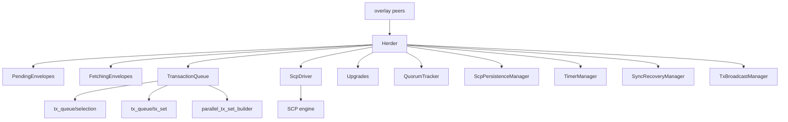

# henyey-herder

SCP coordination and ledger close orchestration for henyey.

## Overview

`henyey-herder` is the consensus-facing crate that sits between `henyey-overlay`, `henyey-scp`, `henyey-ledger`, and `henyey-tx`. It receives transactions and SCP envelopes from the network, tracks or participates in SCP, manages pending and dependency-blocked envelopes, builds candidate transaction sets, records externalized values, and drives ledger close. It corresponds primarily to `stellar-core/src/herder/`.

## Architecture


```mermaid
graph TD
    Overlay[overlay peers] --> Herder[Herder]
    Herder --> Pending[PendingEnvelopes]
    Herder --> Fetching[FetchingEnvelopes]
    Herder --> Queue[TransactionQueue]
    Herder --> Driver[ScpDriver]
    Herder --> Upgrades[Upgrades]
    Herder --> Quorum[QuorumTracker]
    Herder --> Persist[ScpPersistenceManager]
    Queue --> Selection[tx_queue/selection]
    Queue --> TxSet[tx_queue/tx_set]
    Queue --> Parallel[parallel_tx_set_builder]
    Driver --> SCP[SCP engine]
    Herder --> Timers[TimerManager]
    Herder --> Recovery[SyncRecoveryManager]
    Herder --> Broadcast[TxBroadcastManager]
```

## Key Types

| Type | Description |
|------|-------------|
| `Herder` | Main coordinator for SCP message intake, tracking state, tx queueing, and ledger close orchestration. |
| `HerderConfig` | Startup configuration for validator mode, quorum set, queue sizing, tx-set size, and upgrade limits. |
| `HerderState` | High-level lifecycle state: `Booting`, `Syncing`, or `Tracking`. |
| `EnvelopeState` | Outcome of `Herder::receive_scp_envelope`, including valid, pending, fetching, duplicate, and rejection states. |
| `ScpDriver` | Bridge between the generic SCP engine and Herder-specific value validation, signing, quorum-set storage, and tx-set caching. |
| `TransactionQueue` | Lane-aware pending transaction queue with per-account replacement, banning, and tx-set construction. |
| `TransactionSet` | Legacy or generalized transaction set wrapper used for nomination, externalization, persistence, and ledger application. |
| `FetchingEnvelopes` | Manages envelopes blocked on missing `TxSet` or `ScpQuorumSet` dependencies. |
| `PendingEnvelopes` | Buffers future-slot envelopes until the node reaches the relevant slot. |
| `QuorumTracker` | Tracks the transitive quorum graph used to validate trusted fast-forward and expose quorum diagnostics. |
| `ScpPersistenceManager` | Persists recent SCP envelopes and referenced tx sets for crash recovery, backed by memory or SQLite. |
| `Upgrades` / `UpgradeParameters` | Schedules and validates ledger upgrades proposed during nomination. |
| `LedgerCloseData` | Serializable wrapper for an externalized tx set, `StellarValue`, and optional expected ledger hash. |

## Usage

```rust
use henyey_herder::{Herder, HerderConfig, HerderState};

let herder = Herder::new(HerderConfig::default());

herder.start_syncing();
assert_eq!(herder.state(), HerderState::Syncing);

herder.bootstrap(1024);
assert_eq!(herder.state(), HerderState::Tracking);
assert_eq!(herder.tracking_slot(), 1025);
```

```rust
use henyey_crypto::SecretKey;
use henyey_herder::{Herder, HerderConfig, UpgradeParameters};

let config = HerderConfig {
    is_validator: true,
    ..HerderConfig::default()
};

let secret_key = SecretKey::from_binary([7; 32]);
let herder = Herder::with_secret_key(config, secret_key);

herder
    .set_upgrade_parameters(UpgradeParameters {
        protocol_version: Some(25),
        ..UpgradeParameters::default()
    })
    .expect("supported upgrade");
```

```rust
use henyey_common::Hash256;
use henyey_herder::{Herder, HerderConfig};

let herder = Herder::new(HerderConfig::default());

let needed: Hash256 = Hash256::ZERO;
if herder.needs_tx_set(&needed) {
    // fetch the tx set from peers, then deliver it with `receive_tx_set`
}
```

## Module Layout

| Module | Description |
|--------|-------------|
| `lib.rs` | Crate exports, top-level traits, and public type aliases. |
| `dead_node_tracker.rs` | Detects transitive quorum members that stop sending SCP traffic. |
| `drift_tracker.rs` | Tracks close-time drift against network externalization. |
| `error.rs` | `HerderError` definitions. |
| `externalize_lag.rs` | Tracks and summarizes lag between observed and local externalization. |
| `fetching_envelopes.rs` | Dependency-aware envelope staging while waiting on tx sets or quorum sets. |
| `flow_control.rs` | Transaction-size and flow-control constants derived from protocol/network limits. |
| `herder_utils.rs` | Helpers for extracting `StellarValue` and tx-set hashes from SCP statements. |
| `herder.rs` | Core Herder implementation, state transitions, envelope intake, tx intake, ledger close handling, and cache maintenance. |
| `scp_driver.rs` | SCP callback bridge, value validation, signing, tx-set cache, externalized-slot tracking, and quorum-set lookup. |
| `state.rs` | `HerderState` lifecycle enum and transition helpers. |
| `ledger_close_data.rs` | Serializable ledger-close wrapper and human-readable `StellarValue` formatting. |
| `json_api.rs` | JSON-serializable diagnostic structures for admin and monitoring endpoints. |
| `pending.rs` | Future-slot envelope buffer with deduplication, eviction, and release-by-slot. |
| `persistence.rs` | SCP state persistence traits, in-memory/SQLite backends, and restore helpers. |
| `parallel_tx_set_builder.rs` | Parallel Soroban phase construction via conflict clustering and stage packing. |
| `quorum_intersection_state.rs` | Tracks quorum-intersection background-check state. |
| `quorum_set_tracker.rs` | Tracks known quorum-set hashes and fetch requirements. |
| `quorum_tracker.rs` | Per-slot quorum-heard tracking plus transitive quorum graph maintenance. |
| `scp_verify.rs` | SCP envelope verification helpers and validation cache support. |
| `spawn.rs` | Small task-spawning helper module. |
| `surge_pricing.rs` | Lane configuration and fee-priority queue logic for classic, DEX, and Soroban selection. |
| `sync_recovery.rs` | Tracking heartbeat, stuck-consensus detection, and out-of-sync recovery loop. |
| `timer_manager.rs` | Async nomination and ballot timeout scheduling. |
| `tracked_lock.rs` | Lock tracking helpers used by concurrent Herder state. |
| `tx_broadcast.rs` | Periodic transaction flooding and rebroadcast management. |
| `tx_queue_limiter.rs` | Resource-aware queue admission and eviction built on top of surge-pricing primitives. |
| `upgrades.rs` | Upgrade parameter parsing, scheduling, validation, and proposal generation. |
| `tx_queue/mod.rs` | Main transaction queue, validation, bans, replacement rules, and public queue stats/types. |
| `tx_queue/selection.rs` | Candidate tx-set selection and generalized tx-set assembly. |
| `tx_queue/tx_set.rs` | `TransactionSet` wire-format parsing, hash computation, and apply-time validation. |
| `tx_set_tracker.rs` | Tracks recently seen transaction sets and missing dependencies. |
| `tx_set_utils.rs` | Helpers for trimming invalid transactions from candidate sets. |

## Design Notes

- `PendingEnvelopes` and `FetchingEnvelopes` split two different concerns that are combined in stellar-core's `PendingEnvelopes`: future-slot buffering versus dependency fetching.
- EXTERNALIZE-based fast-forward is intentionally conservative: the sender must be in the transitive quorum, the slot must remain within the validity bracket, and envelopes can stay blocked until referenced tx sets arrive.
- Transaction selection is not a flat mempool pop. The queue keeps one pending transaction per sequence-number source, applies fee-bump replacement rules, separates classic and Soroban phases, and can build a parallel Soroban phase when network limits allow it.
- Upgrade proposals come from both static config and runtime state. `Herder::set_upgrade_parameters` mutates a live `Upgrades` instance whose proposals are merged into nomination values.

## stellar-core Mapping

| Rust | stellar-core |
|------|--------------|
| `herder.rs`, `state.rs` | `src/herder/Herder.h`, `src/herder/Herder.cpp`, `src/herder/HerderImpl.h`, `src/herder/HerderImpl.cpp` |
| `scp_driver.rs` | `src/herder/HerderSCPDriver.h`, `src/herder/HerderSCPDriver.cpp` |
| `pending.rs`, `fetching_envelopes.rs` | `src/herder/PendingEnvelopes.h`, `src/herder/PendingEnvelopes.cpp` |
| `quorum_tracker.rs` | `src/herder/QuorumTracker.h`, `src/herder/QuorumTracker.cpp` |
| `persistence.rs` | `src/herder/HerderPersistence.h`, `src/herder/HerderPersistenceImpl.h`, `src/herder/HerderPersistenceImpl.cpp` |
| `tx_queue/mod.rs`, `tx_broadcast.rs` | `src/herder/TransactionQueue.h`, `src/herder/TransactionQueue.cpp` |
| `tx_queue/tx_set.rs` | `src/herder/TxSetFrame.h`, `src/herder/TxSetFrame.cpp` |
| `tx_set_utils.rs` | `src/herder/TxSetUtils.h`, `src/herder/TxSetUtils.cpp` |
| `tx_queue_limiter.rs` | `src/herder/TxQueueLimiter.h`, `src/herder/TxQueueLimiter.cpp` |
| `surge_pricing.rs` | `src/herder/SurgePricingUtils.h`, `src/herder/SurgePricingUtils.cpp` |
| `upgrades.rs` | `src/herder/Upgrades.h`, `src/herder/Upgrades.cpp` |
| `parallel_tx_set_builder.rs` | `src/herder/ParallelTxSetBuilder.h`, `src/herder/ParallelTxSetBuilder.cpp` |
| `ledger_close_data.rs` | `src/herder/LedgerCloseData.h`, `src/herder/LedgerCloseData.cpp` |
| `herder_utils.rs` | `src/herder/HerderUtils.h`, `src/herder/HerderUtils.cpp` |
| `json_api.rs` | `HerderImpl::getJsonInfo`, `getJsonQuorumInfo`, and related JSON helpers in `src/herder/HerderImpl.cpp` |

## Parity Status

See [PARITY_STATUS.md](PARITY_STATUS.md) for detailed stellar-core parity analysis.
