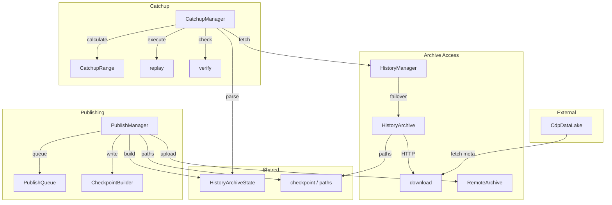

# henyey-history

History archive access, catchup, replay, and publish support for Stellar Core.

## Overview

This crate provides infrastructure for interacting with Stellar history archives,
enabling nodes to synchronize with the network by downloading and verifying
historical ledger data. It corresponds to stellar-core's `src/history/`,
`src/catchup/`, and `src/historywork/` components, handling archive access,
catchup orchestration, ledger replay, checkpoint publishing, and CDP
(Composable Data Platform) integration.

## Architecture



## Key Types

| Type | Description |
|------|-------------|
| `HistoryArchive` | HTTP client for accessing a single history archive |
| `HistoryManager` | Manages multiple archives with automatic failover |
| `HistoryArchiveManager` | Full archive manager with read/write capability tracking |
| `ArchiveEntry` | Single archive entry combining HTTP read and shell-command write |
| `HistoryArchiveState` | Parsed History Archive State (HAS) JSON file |
| `CatchupManager` | Orchestrates the complete catchup process |
| `CatchupMode` | Catchup strategy: `Minimal`, `Complete`, or `Recent(N)` |
| `CatchupRange` | Calculated range of ledgers to download and replay |
| `CatchupOutput` | Full catchup result including bucket list state and ledger header |
| `ReplayConfig` | Configuration for ledger replay verification flags |
| `CheckpointBuilder` | Crash-safe checkpoint file builder using dirty-then-rename |
| `PublishManager` | Publishes checkpoint data to local and remote archives |
| `PublishQueue` | SQLite-backed persistent queue for pending publications |
| `RemoteArchive` | Shell-command-based archive upload client (put, mkdir) |
| `CdpDataLake` | Fetches `LedgerCloseMeta` from CDP (SEP-0054) |
| `CachedCdpDataLake` | Disk-caching wrapper around `CdpDataLake` with prefetch |

## Usage

### Reading from an Archive

```rust
use henyey_history::archive::HistoryArchive;

async fn example() -> Result<(), henyey_history::HistoryError> {
    let archive = HistoryArchive::new(
        "https://history.stellar.org/prd/core-testnet/core_testnet_001"
    )?;

    // Get current archive state
    let has = archive.get_root_has().await?;
    println!("Current ledger: {}", has.current_ledger());

    // Download ledger headers for a checkpoint
    let headers = archive.get_ledger_headers(63).await?;
    println!("Got {} ledger headers", headers.len());
    Ok(())
}
```

### Catching Up to a Target Ledger

```rust
use henyey_history::{CatchupManager, archive::HistoryArchive};

async fn catchup_example() -> Result<(), henyey_history::HistoryError> {
    let archive = HistoryArchive::new(
        "https://history.stellar.org/prd/core-testnet/core_testnet_001"
    )?;

    // CatchupManager downloads buckets, headers, and replays ledgers
    // to reach the target ledger with a verified bucket list.
    let mut manager = CatchupManager::new(/* archives, bucket_manager, db */);
    let output = manager.catchup_to_ledger(1000000).await?;
    println!("Caught up to ledger {}", output.result.ledger_seq);
    Ok(())
}
```

### Fetching LedgerCloseMeta from CDP

```rust
use henyey_history::cdp::CdpDataLake;

async fn cdp_example() -> Result<(), henyey_history::HistoryError> {
    let cdp = CdpDataLake::new(
        "https://aws-public-blockchain.s3.us-east-2.amazonaws.com/v1.1/stellar/ledgers/testnet",
        "2025-01-07",
    );

    let meta = cdp.get_ledger_close_meta(310079).await?;
    let header = henyey_history::cdp::extract_ledger_header(&meta);
    println!("Ledger {} closed at {}", header.ledger_seq, header.scp_value.close_time.0);
    Ok(())
}
```

## Module Layout

| Module | Description |
|--------|-------------|
| `lib.rs` | Crate root: `HistoryManager`, `HistoryArchiveManager`, `ArchiveEntry`, `CatchupOutput` |
| `archive.rs` | `HistoryArchive` HTTP client with testnet/mainnet presets |
| `archive_state.rs` | `HistoryArchiveState` JSON parsing, bucket hash extraction helpers |
| `catchup.rs` | `CatchupManager` orchestration, status tracking, progress reporting |
| `catchup_range.rs` | `CatchupRange` calculation, `CatchupMode`, `LedgerRange` |
| `cdp.rs` | `CdpDataLake` / `CachedCdpDataLake`, `LedgerCloseMeta` extraction functions |
| `checkpoint.rs` | Checkpoint boundary utilities: `checkpoint_containing`, `checkpoint_range` |
| `checkpoint_builder.rs` | `CheckpointBuilder`, `XdrStreamWriter` for crash-safe file construction |
| `download.rs` | HTTP download with retries, gzip decompression, XDR stream parsing |
| `error.rs` | `HistoryError` enum with network, parsing, verification, and catchup variants |
| `paths.rs` | URL path generation: `checkpoint_path`, `bucket_path`, dirty file helpers |
| `publish.rs` | `PublishManager`, `build_history_archive_state`, gzipped XDR file writing |
| `publish_queue.rs` | `PublishQueue` SQLite-backed persistent publish queue with stats |
| `remote_archive.rs` | `RemoteArchive` shell-command-based archive operations (put, mkdir, get) |
| `replay.rs` | `replay_ledger_with_execution`, eviction scan, Soroban state size tracking |
| `verify.rs` | Cryptographic verification: header chains, bucket hashes, tx set hashes |

## Design Notes

- **Re-execution replay**: During catchup the crate re-executes transactions against
  the bucket list rather than applying `TransactionMeta`. This works with traditional
  archives that omit `TransactionMeta` but may produce slightly different intermediate
  results. The bucket list hash at each checkpoint is the authoritative correctness check.

- **Dual bucket lists (Protocol 23+)**: Replay manages both a live bucket list and a
  hot archive bucket list. Evicted entries move to the hot archive; restored entries
  move back. The combined ledger hash is `SHA256(live_hash || hot_archive_hash)`.

- **Crash-safe publishing**: `CheckpointBuilder` writes checkpoint files with a `.dirty`
  suffix first, then atomically renames them to final paths on commit. This ensures
  partially written checkpoints never appear as valid archive data.

- **Catchup range cases**: `CatchupRange::calculate` implements five distinct cases
  matching stellar-core's `CatchupConfiguration` logic, depending on whether the LCL
  is at genesis, the target is a checkpoint boundary, and how many ledgers to replay.

## stellar-core Mapping

| Rust | stellar-core |
|------|--------------|
| `lib.rs` (`HistoryManager`) | `src/history/HistoryManagerImpl.cpp` |
| `lib.rs` (`HistoryArchiveManager`) | `src/history/HistoryArchiveManager.cpp` |
| `archive.rs` | `src/history/HistoryArchive.cpp` |
| `archive_state.rs` | `src/history/HistoryArchive.cpp` (HAS serialization) |
| `catchup.rs` | `src/catchup/CatchupWork.cpp` |
| `catchup_range.rs` | `src/catchup/CatchupRange.cpp`, `CatchupConfiguration.cpp` |
| `checkpoint.rs` / `paths.rs` | `src/history/HistoryUtils.cpp`, `FileTransferInfo.cpp` |
| `checkpoint_builder.rs` | `src/history/CheckpointBuilder.cpp` |
| `download.rs` | `src/historywork/GetAndUnzipRemoteFileWork.cpp`, `BatchDownloadWork.cpp` |
| `publish.rs` | `src/history/StateSnapshot.cpp` |
| `publish_queue.rs` | `src/history/HistoryManagerImpl.cpp` (publish queue logic) |
| `remote_archive.rs` | `src/historywork/GetRemoteFileWork.cpp`, `PutRemoteFileWork.cpp` |
| `replay.rs` | `src/catchup/ApplyCheckpointWork.cpp`, `ApplyLedgerWork.cpp` |
| `verify.rs` | `src/historywork/VerifyBucketWork.cpp`, `CheckSingleLedgerHeaderWork.cpp` |
| `cdp.rs` | No upstream equivalent (SEP-0054 is Rust-native) |

## Parity Status

See [PARITY_STATUS.md](PARITY_STATUS.md) for detailed stellar-core parity analysis.
