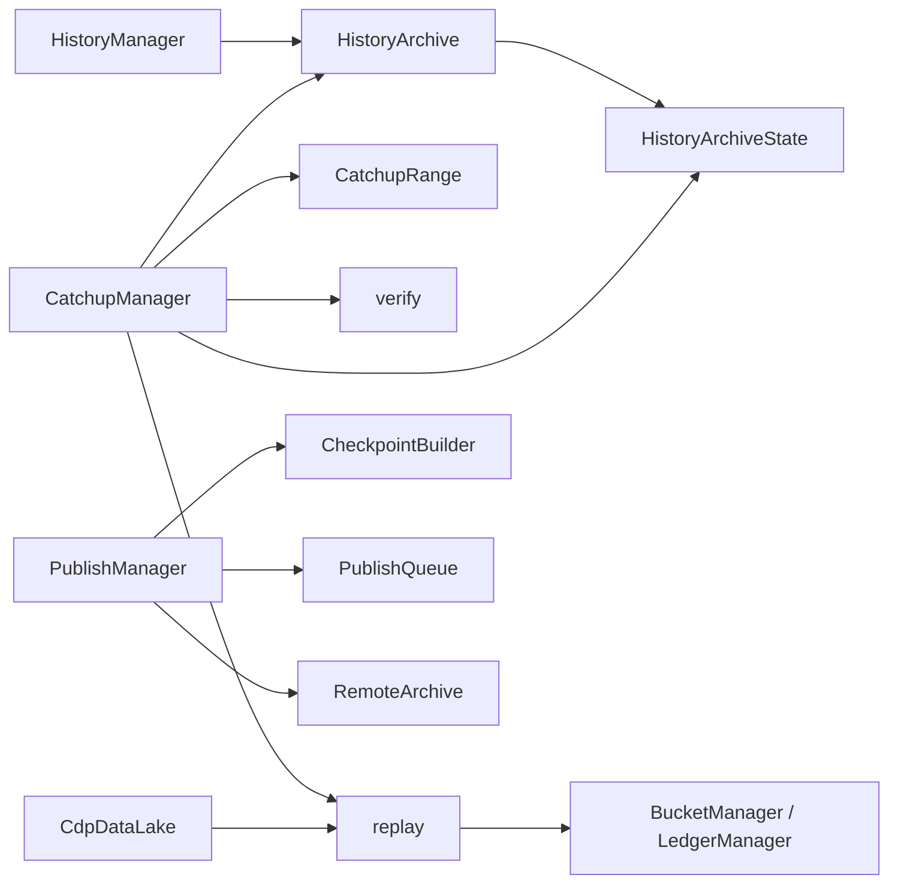

# henyey-history

History archive access, catchup, replay, and checkpoint publishing for Henyey.

## Overview

`henyey-history` is the workspace crate that speaks Stellar history archives: it downloads History Archive State (HAS) files, bucket files, ledger/header/result streams, replays ledgers to reconstruct state, and publishes new checkpoints for validator-style nodes. It sits between `henyey-ledger`/`henyey-bucket` and external archive infrastructure, and mostly corresponds to stellar-core's `src/history/`, `src/catchup/`, and `src/historywork/` subsystems, with additional Rust-native CDP support for `LedgerCloseMeta` ingestion.

## Architecture


```mermaid
flowchart LR
    A[HistoryArchive]
    B[HistoryManager]
    C[HistoryArchiveState]
    D[CatchupRange]
    E[CatchupManager]
    F[verify]
    G[replay]
    H[BucketManager / LedgerManager]
    I[CheckpointBuilder]
    J[PublishManager]
    K[PublishQueue]
    L[RemoteArchive]
    M[CdpDataLake]

    B --> A
    A --> C
    E --> D
    E --> A
    E --> C
    E --> F
    E --> G
    G --> H
    J --> I
    J --> K
    J --> L
    M --> G
```

## Key Types

| Type | Description |
|------|-------------|
| `HistoryArchive` | Reqwest-based client for one readable history archive. |
| `HistoryManager` | Read-side failover wrapper across multiple `HistoryArchive`s. |
| `HistoryArchiveManager` | Mixed read/write archive manager mirroring stellar-core archive configuration logic. |
| `HistoryArchiveState` | Parsed HAS document with bucket hash helpers and FutureBucket state. |
| `CatchupManager` | End-to-end catchup orchestrator: download, verify, apply buckets, replay. |
| `CatchupManagerBuilder` | Convenience builder for wiring archives, DB, bucket manager, and validation options. |
| `CatchupRange` | stellar-core-compatible decision about buckets-only vs replay-only vs mixed catchup. |
| `CatchupMode` | User-facing catchup policy: `Minimal`, `Complete`, or `Recent(n)`. |
| `ReplayConfig` | Controls replay verification, eviction behavior, event emission, and publish backpressure. |
| `ReplayedLedgerState` | Final replay summary derived from a ledger header and hash. |
| `ChainTrustAnchors` | External trust inputs for chain verification beyond internal header consistency. |
| `checkpoint_builder::CheckpointBuilder` | Crash-safe writer for checkpoint XDR streams using `.dirty` files and durable rename. |
| `publish::PublishManager` | Local checkpoint publisher that writes archive files and HAS snapshots. |
| `PublishQueue` | SQLite-backed persistent publish queue for pending checkpoints. |
| `CdpDataLake` / `CachedCdpDataLake` | SEP-0054 metadata readers for exact `LedgerCloseMeta` replay flows. |

## Usage

```rust
use henyey_history::HistoryArchive;

# async fn example() -> Result<(), henyey_history::HistoryError> {
let archive = HistoryArchive::new(
    "https://history.stellar.org/prd/core-testnet/core_testnet_001",
)?;

let has = archive.get_root_has().await?;
let checkpoint = has.current_ledger();
let headers = archive.get_ledger_headers(checkpoint).await?;

println!("archive at ledger {}", has.current_ledger());
println!("downloaded {} headers", headers.len());
# Ok(())
# }
```

```rust
use henyey_history::{CatchupMode, CatchupRange, GENESIS_LEDGER_SEQ};

let range = CatchupRange::calculate(
    GENESIS_LEDGER_SEQ,
    843_007,
    CatchupMode::Recent(128),
);

assert!(range.apply_buckets());
assert!(range.replay_ledgers());
println!(
    "apply at {}, replay {} ledgers from {}",
    range.bucket_apply_ledger(),
    range.replay_count(),
    range.replay_first(),
);
```

```rust
use henyey_history::cdp::{extract_ledger_header, CdpDataLake};

# async fn example() -> Result<(), henyey_history::HistoryError> {
let cdp = CdpDataLake::new(
    "https://aws-public-blockchain.s3.us-east-2.amazonaws.com/v1.1/stellar/ledgers/testnet",
    "2025-01-07",
);

let meta = cdp.get_ledger_close_meta(310_079).await?;
let header = extract_ledger_header(&meta);
println!("ledger {} closed at {}", header.ledger_seq, header.scp_value.close_time.0);
# Ok(())
# }
```

## Module Layout

| Module | Description |
|--------|-------------|
| `lib.rs` | Crate root, re-exports, archive-manager types, and shared result structs. |
| `archive.rs` | Read-side history archive client plus testnet/mainnet archive constants. |
| `archive_state.rs` | HAS parsing, validation helpers, bucket diffing, and FutureBucket state extraction. |
| `catchup/mod.rs` | Main catchup manager, options, retry loop, and checkpoint-data orchestration. |
| `catchup/buckets.rs` | Bucket restore and bucket-list adoption during catchup. |
| `catchup/download.rs` | Checkpoint/HAS/bucket download helpers used by catchup. |
| `catchup/persist.rs` | Persistence for ledger history, transaction data, SCP history, and bucket snapshots. |
| `catchup/replay.rs` | Catchup replay loop and application of downloaded ledgers. |
| `catchup_range.rs` | Catchup planning logic matching stellar-core's five-case range calculation. |
| `cdp.rs` | SEP-0054 data-lake readers, cache layer, and `LedgerCloseMeta` extraction helpers. |
| `checkpoint.rs` | Checkpoint arithmetic and ledger-range helpers. |
| `checkpoint_builder.rs` | Crash-safe checkpoint file construction and startup recovery of dirty files. |
| `compare.rs` | Checkpoint comparison utilities for local vs reference archive output. |
| `download.rs` | HTTP retry policy, gzip decompression, and record-marked XDR parsing. |
| `error.rs` | `HistoryError` plus fatal/transient catchup classification. |
| `paths.rs` | Archive path generation, checkpoint frequency control, and dirty-path helpers. |
| `publish.rs` | HAS construction and local archive publishing for checkpoint material. |
| `publish_queue.rs` | Persistent queue and backpressure constants for history publication. |
| `remote_archive.rs` | Shell-command archive adapter for put/get/mkdir style publishing. |
| `replay/mod.rs` | Replay module root and shared replay result/config types. |
| `replay/diff.rs` | Replay diff formatting for expected vs actual results. |
| `replay/execution.rs` | Execution-based ledger replay using transaction re-execution. |
| `replay/metadata.rs` | Metadata-based ledger replay from archived `TransactionMeta`. |
| `test_utils.rs` | Feature-gated in-process archive fixtures for integration tests. |
| `verify.rs` | Header-chain, bucket, tx-set, SCP-history, and HAS verification routines. |

## Design Notes

- Replay defaults to re-execution instead of applying `TransactionMeta`, so traditional archives remain usable; checkpoint bucket-list hashes are the main correctness boundary.
- Protocol 23+ replay maintains both the live bucket list and the hot-archive bucket list, and verification uses `SHA256(live_hash || hot_archive_hash)`.
- `HistoryArchiveState::differing_bucket_hashes()` mirrors stellar-core's inhibited bottom-up bucket diff algorithm so catchup can avoid re-downloading buckets already implied by local state.
- `CheckpointBuilder` uses `.dirty` files plus durable rename so partially written checkpoints never become visible as final archive outputs.
- Publish-queue backpressure mirrors stellar-core's hysteresis thresholds with `PUBLISH_QUEUE_MAX_SIZE` and `PUBLISH_QUEUE_UNBLOCK_APPLICATION`.

## stellar-core Mapping

| Rust | stellar-core |
|------|--------------|
| `lib.rs` (`HistoryManager`) | `src/history/HistoryManagerImpl.cpp` |
| `lib.rs` (`HistoryArchiveManager`, `ArchiveEntry`) | `src/history/HistoryArchiveManager.cpp` |
| `archive.rs` | `src/history/HistoryArchive.cpp` |
| `archive_state.rs` | `src/history/HistoryArchive.cpp` (HAS serialization and bucket-state logic) |
| `catchup/mod.rs`, `catchup/*.rs` | `src/catchup/CatchupWork.cpp`, `DownloadApplyTxsWork.cpp` |
| `catchup_range.rs` | `src/catchup/CatchupRange.cpp`, `CatchupConfiguration.cpp` |
| `checkpoint.rs` | `src/history/HistoryManager.h`, `src/history/HistoryUtils.cpp` |
| `checkpoint_builder.rs` | `src/history/CheckpointBuilder.cpp` |
| `download.rs` | `src/historywork/GetAndUnzipRemoteFileWork.cpp`, `BatchDownloadWork.cpp` |
| `paths.rs` | `src/history/FileTransferInfo.cpp`, `FileTransferInfo.h` |
| `publish.rs` | `src/history/StateSnapshot.cpp`, parts of `HistoryManagerImpl.cpp` |
| `publish_queue.rs` | `src/history/HistoryManagerImpl.cpp` publish-queue behavior |
| `remote_archive.rs` | `src/history/HistoryArchive.cpp`, `src/historywork/GetRemoteFileWork.cpp`, `PutRemoteFileWork.cpp` |
| `replay/mod.rs`, `replay/*.rs` | `src/catchup/ApplyCheckpointWork.cpp`, `ApplyLedgerWork.cpp` |
| `verify.rs` | `src/historywork/VerifyBucketWork.cpp`, `VerifyLedgerChainWork.cpp`, `CheckSingleLedgerHeaderWork.cpp` |
| `cdp.rs` | No direct upstream equivalent; Rust-native SEP-0054 integration |

## Parity Status

See [PARITY_STATUS.md](PARITY_STATUS.md) for detailed stellar-core parity analysis.
