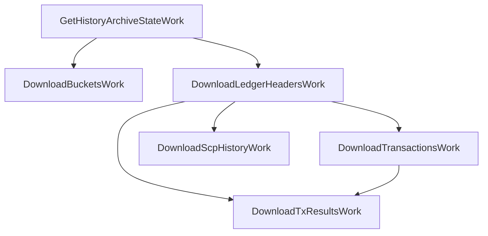
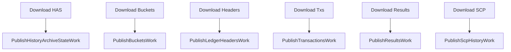

# henyey-historywork

Work items for Stellar history archive download and publish workflows.

## Overview

This crate provides the building blocks for downloading and publishing Stellar
history archive data. It implements a work-item based architecture that integrates
with the `henyey-work` scheduler to orchestrate complex multi-step operations
with proper dependency management and retry logic. It corresponds to the
stellar-core `src/historywork/` directory.

History archives store snapshots of the Stellar ledger at regular checkpoint
intervals (every 64 ledgers). This crate provides work items to:

- **Download** history data: HAS, buckets, headers, transactions, results, and SCP
- **Verify** downloaded data: hash verification and header chain validation
- **Publish** history data: write checkpoint data back to archives

## Architecture

Work items form a directed acyclic graph (DAG) of dependencies, managed by
the `henyey-work` scheduler:



For publish, each publish work item depends on its corresponding download:



All work items share state through `SharedHistoryState`, a thread-safe container
(`Arc<Mutex<HistoryWorkState>>`) that accumulates downloaded data as work progresses.

## Key Types

| Type | Description |
|------|-------------|
| `HistoryWorkState` | Shared container for downloaded history data |
| `SharedHistoryState` | Thread-safe handle (`Arc<Mutex<...>>`) to work state |
| `HistoryWorkBuilder` | Factory for registering single-checkpoint work items with dependencies |
| `HistoryWorkIds` | IDs returned by `HistoryWorkBuilder::register` for dependency tracking |
| `PublishWorkIds` | IDs returned by `HistoryWorkBuilder::register_publish` |
| `HistoryWorkStage` | Enum identifying the current work stage for progress |
| `HistoryWorkProgress` | Progress snapshot with stage and human-readable message |
| `ArchiveWriter` | Trait for publishing data to history archives |
| `LocalArchiveWriter` | Filesystem implementation of `ArchiveWriter` |
| `CheckpointRange` | Range of checkpoints for batch operations |
| `HistoryFileType` | Enum for archive file types (Ledger, Transactions, Results, Scp) |
| `BatchDownloadWork` | Work item for downloading files across a checkpoint range |
| `BatchDownloadWorkBuilder` | Factory for registering batch download work items |
| `BatchDownloadState` | Shared container for multi-checkpoint download data |
| `CheckSingleLedgerHeaderWork` | Self-contained work item to verify a ledger header against the archive |

### Download Work Items

| Work Item | Description | Dependencies |
|-----------|-------------|--------------|
| `GetHistoryArchiveStateWork` | Fetches the HAS JSON file | None |
| `DownloadBucketsWork` | Downloads and verifies bucket files | HAS |
| `DownloadLedgerHeadersWork` | Downloads and verifies headers | HAS |
| `DownloadTransactionsWork` | Downloads and verifies transactions | Headers |
| `DownloadTxResultsWork` | Downloads and verifies results | Headers, Transactions |
| `DownloadScpHistoryWork` | Downloads SCP consensus history | Headers |
| `CheckSingleLedgerHeaderWork` | Verifies a single ledger header against archive | None (self-contained) |
| `BatchDownloadWork` | Downloads a file type across a checkpoint range | Varies by file type |

### Publish Work Items

| Work Item | Description |
|-----------|-------------|
| `PublishHistoryArchiveStateWork` | Publishes HAS JSON to checkpoint path and `.well-known/` |
| `PublishBucketsWork` | Publishes compressed bucket files |
| `PublishLedgerHeadersWork` | Publishes compressed header XDR |
| `PublishTransactionsWork` | Publishes compressed transaction XDR |
| `PublishResultsWork` | Publishes compressed result XDR |
| `PublishScpHistoryWork` | Publishes compressed SCP history XDR |

## Usage

### Downloading Checkpoint Data

```rust
use henyey_historywork::{
    HistoryWorkBuilder, SharedHistoryState, build_checkpoint_data
};
use henyey_work::{WorkScheduler, WorkSchedulerConfig};
use std::sync::Arc;
use std::path::PathBuf;

// Create shared state for work items
let state: SharedHistoryState = Default::default();

// Build and register work items
let builder = HistoryWorkBuilder::new(
    archive, checkpoint, state.clone(), PathBuf::from("/tmp/buckets"),
);
let mut scheduler = WorkScheduler::new(WorkSchedulerConfig::default());
let work_ids = builder.register(&mut scheduler);

// Run the scheduler to completion
scheduler.run_until_done().await;

// Extract downloaded data for catchup
let checkpoint_data = build_checkpoint_data(&state).await?;
```

### Publishing Checkpoint Data

```rust
use henyey_historywork::{
    HistoryWorkBuilder, LocalArchiveWriter, SharedHistoryState
};
use std::sync::Arc;
use std::path::PathBuf;

// Create a writer for the target archive
let writer = Arc::new(LocalArchiveWriter::new(PathBuf::from("/var/stellar/history")));

// Register publish work after download work
let download_ids = builder.register(&mut scheduler);
let publish_ids = builder.register_publish(&mut scheduler, writer, download_ids);

// Run all work to completion
scheduler.run_until_done().await;
```

### Batch Downloads (Multi-Checkpoint)

```rust
use henyey_historywork::{BatchDownloadWorkBuilder, CheckpointRange};
use henyey_work::{WorkScheduler, WorkSchedulerConfig};

// Download headers, transactions, results, and SCP for checkpoints 64-512
let range = CheckpointRange::new(64, 512);
let builder = BatchDownloadWorkBuilder::new(archive, range);

let state = builder.state();
let mut scheduler = WorkScheduler::new(WorkSchedulerConfig::default());
let ids = builder.register(&mut scheduler);

scheduler.run_until_done().await;

// Access downloaded data from state
let guard = state.lock().await;
let headers_for_checkpoint_128 = &guard.headers[&128];
```

## Module Layout

| Module | Description |
|--------|-------------|
| `lib.rs` | All types, work items, builders, and helpers for history download/publish workflows |

## Design Notes

- **Parallel Downloads**: Bucket and batch downloads use up to 16 concurrent requests,
  matching the stellar-core `MAX_CONCURRENT_SUBPROCESSES` limit (see `MAX_CONCURRENT_DOWNLOADS`).

- **Retry Logic**: Download work items are configured with 3 retries; publish
  work items use 2 retries.

- **Verification**: All downloaded data is verified against known hashes before
  being stored in shared state. Verification is performed inline rather than in
  background threads as in stellar-core.

- **Bucket Disk Storage**: Bucket files are saved to disk during download to
  avoid holding multi-GB bucket data in memory simultaneously. Each bucket is
  verified, written to disk, and then dropped from memory.

## stellar-core Mapping

| Rust | stellar-core |
|------|--------------|
| `GetHistoryArchiveStateWork` | `src/historywork/GetHistoryArchiveStateWork.cpp` |
| `DownloadBucketsWork` | `src/historywork/DownloadBucketsWork.cpp` |
| `DownloadLedgerHeadersWork` | `src/historywork/BatchDownloadWork.cpp` (ledger category) |
| `DownloadTransactionsWork` | `src/historywork/BatchDownloadWork.cpp` (transactions category) |
| `DownloadTxResultsWork` | `src/historywork/DownloadVerifyTxResultsWork.cpp` |
| `DownloadScpHistoryWork` | `src/historywork/BatchDownloadWork.cpp` (SCP category) |
| `PublishHistoryArchiveStateWork` | `src/historywork/PutHistoryArchiveStateWork.cpp` |
| `PublishBucketsWork` | `src/historywork/PutSnapshotFilesWork.cpp` (buckets) |
| `PublishLedgerHeadersWork` | `src/historywork/PutSnapshotFilesWork.cpp` (ledger) |
| `PublishTransactionsWork` | `src/historywork/PutSnapshotFilesWork.cpp` (transactions) |
| `PublishResultsWork` | `src/historywork/PutSnapshotFilesWork.cpp` (results) |
| `PublishScpHistoryWork` | `src/historywork/PutSnapshotFilesWork.cpp` (SCP) |
| `CheckSingleLedgerHeaderWork` | `src/historywork/CheckSingleLedgerHeaderWork.cpp` |
| `BatchDownloadWork` | `src/historywork/BatchDownloadWork.cpp` |
| `HistoryWorkProgress` | `src/historywork/Progress.cpp` |
| `ArchiveWriter` / `LocalArchiveWriter` | `src/historywork/PutRemoteFileWork.cpp` |

## Parity Status

See [PARITY_STATUS.md](PARITY_STATUS.md) for detailed stellar-core parity analysis.
