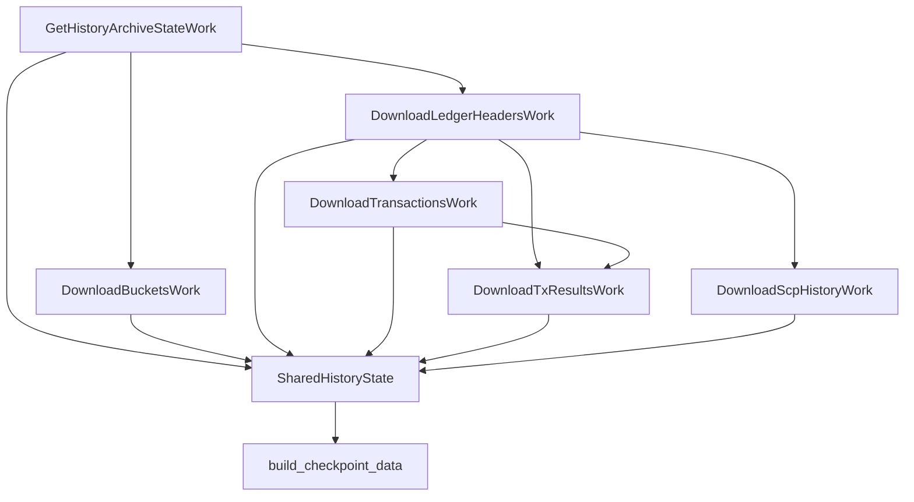

# henyey-historywork

Work items for downloading and verifying Stellar history archive checkpoint data.

## Overview

`henyey-historywork` packages single-checkpoint history archive downloads into
`henyey-work` DAG nodes. It fetches a checkpoint's History Archive State (HAS),
downloads bucket files, ledger headers, transactions, transaction results, and
SCP history, verifies hashes and header chains, and exposes the completed data
as `henyey_history::CheckpointData`. It corresponds to stellar-core's
`src/historywork/` download side, but uses native async Rust I/O instead of
subprocess-based `BasicWork` chains.

## Architecture


```mermaid
graph TD
    HAS[GetHistoryArchiveStateWork]
    BKT[DownloadBucketsWork]
    HDR[DownloadLedgerHeadersWork]
    TX[DownloadTransactionsWork]
    RES[DownloadTxResultsWork]
    SCP[DownloadScpHistoryWork]
    STATE[SharedHistoryState]
    DATA[build_checkpoint_data]

    HAS --> BKT
    HAS --> HDR
    HDR --> TX
    HDR --> RES
    TX --> RES
    HDR --> SCP
    HAS --> STATE
    BKT --> STATE
    HDR --> STATE
    TX --> STATE
    RES --> STATE
    SCP --> STATE
    STATE --> DATA
```

## Key Types

| Type | Description |
|------|-------------|
| `HistoryWorkState` | Shared single-checkpoint state holding HAS, bucket directory, downloaded XDR payloads, and progress. |
| `SharedHistoryState` | `Arc<Mutex<HistoryWorkState>>` handle shared across work items. |
| `HistoryWorkStage` | Progress enum covering HAS, bucket, header, transaction, result, and SCP download stages. |
| `HistoryWorkProgress` | Human-readable progress snapshot returned by `get_progress()`. |
| `HistoryWorkBuilder` | Registers the checkpoint download DAG with a `WorkScheduler`. |
| `HistoryWorkIds` | Scheduler IDs for the HAS, bucket, header, transaction, result, and SCP work items. |
| `CheckpointData` | Downstream catchup input assembled by `build_checkpoint_data()`. |

## Usage

### Register checkpoint download work

```rust
use std::path::PathBuf;
use std::sync::Arc;

use henyey_history::archive::HistoryArchive;
use henyey_historywork::{build_checkpoint_data, HistoryWorkBuilder, SharedHistoryState};
use henyey_work::{WorkScheduler, WorkSchedulerConfig};

# async fn example() -> anyhow::Result<()> {
let archive = Arc::new(HistoryArchive::new(
    "https://history.stellar.org/prd/core-testnet/core_testnet_001",
)?);
let state: SharedHistoryState = Default::default();
let builder = HistoryWorkBuilder::new(
    archive,
    63,
    state.clone(),
    PathBuf::from("data/history-buckets"),
);

let mut scheduler = WorkScheduler::new(WorkSchedulerConfig::default());
let _ids = builder.register(&mut scheduler);
scheduler.run_until_done().await;

let checkpoint = build_checkpoint_data(&state).await?;
assert_eq!(checkpoint.has.current_ledger, 63);
# Ok(())
# }
```

### Monitor progress

```rust
use henyey_historywork::{get_progress, HistoryWorkStage, SharedHistoryState};

# async fn example(state: SharedHistoryState) {
let progress = get_progress(&state).await;
if let Some(HistoryWorkStage::DownloadBuckets) = progress.stage {
    tracing::info!(message = %progress.message, "history download progress");
}
# }
```

### Consume assembled checkpoint data

```rust
use henyey_historywork::{build_checkpoint_data, SharedHistoryState};

# async fn example(state: SharedHistoryState) -> anyhow::Result<()> {
let checkpoint_data = build_checkpoint_data(&state).await?;

// Pass the verified checkpoint data to catchup code without cloning the XDR.
assert!(!checkpoint_data.headers.is_empty());
# Ok(())
# }
```

## Module Layout

| Module | Description |
|--------|-------------|
| `lib.rs` | Shared state, progress types, public re-exports, and checkpoint-data assembly. |
| `builder.rs` | `HistoryWorkBuilder` and `HistoryWorkIds` for registering the download DAG. |
| `download.rs` | HAS, bucket, ledger-header, transaction, result, and SCP download work items. |

## Design Notes

- Buckets are verified and written to disk during download so catchup does not
  keep multi-GB bucket payloads resident in memory.
- `build_checkpoint_data()` moves data out of `SharedHistoryState`; callers
  should invoke it once after all scheduled work has completed.
- Retry budgets come from `henyey_history::download` constants so the work DAG
  follows the same `RETRY_A_FEW` and `RETRY_A_LOT` policy as catchup.

## stellar-core Mapping

| Rust | stellar-core |
|------|--------------|
| `src/builder.rs` | Work-graph composition around `src/historywork/*Work.cpp` |
| `src/download.rs` (`GetHistoryArchiveStateWork`) | `src/historywork/GetHistoryArchiveStateWork.cpp` |
| `src/download.rs` (`DownloadBucketsWork`) | `src/historywork/DownloadBucketsWork.cpp`, `VerifyBucketWork.cpp` |
| `src/download.rs` (`DownloadLedgerHeadersWork`) | `src/historywork/BatchDownloadWork.cpp` |
| `src/download.rs` (`DownloadTransactionsWork`) | `src/historywork/BatchDownloadWork.cpp` |
| `src/download.rs` (`DownloadTxResultsWork`) | `src/historywork/VerifyTxResultsWork.cpp` |
| `src/download.rs` (`DownloadScpHistoryWork`) | `src/historywork/BatchDownloadWork.cpp` |
| `src/lib.rs` (`HistoryWorkProgress`) | `src/historywork/Progress.h` |

## Parity Status

See [PARITY_STATUS.md](PARITY_STATUS.md) for detailed stellar-core parity analysis.
