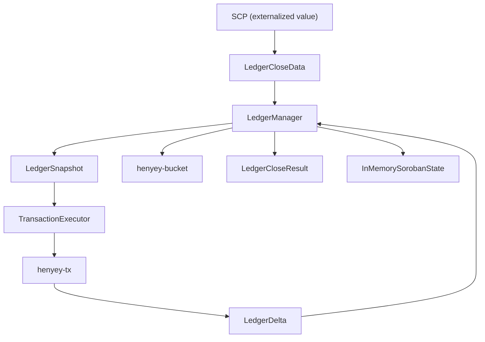

# henyey-ledger

Ledger state management and ledger close pipeline for henyey.

## Overview

This crate provides the core ledger state management for the Stellar network,
coordinating transaction execution, bucket list updates, state snapshots, and
metadata generation during ledger close. It corresponds to stellar-core's
`src/ledger/` directory and the `LedgerManager` / `LedgerTxn` subsystem.

The crate sits between the consensus layer (`henyey-scp`, which externalizes
transaction sets) and the persistence layer (`henyey-bucket`, which stores
entries). It also bridges to `henyey-tx` for per-transaction execution.

## Architecture



## Key Types

| Type | Description |
|------|-------------|
| `LedgerManager` | Central coordinator for ledger state and close operations |
| `LedgerManagerConfig` | Configuration for the ledger manager (invariant toggles, etc.) |
| `LedgerCloseData` | Input data from SCP (transaction set, close time, upgrades) |
| `LedgerCloseResult` | Output from a successful close (header, results, meta) |
| `LedgerDelta` | Accumulates state changes during a single ledger close |
| `EntryChange` | Single entry change with coalescing semantics (create/update/delete) |
| `LedgerSnapshot` | Immutable point-in-time view of ledger state |
| `SnapshotHandle` | Thread-safe wrapper with optional lazy-loading lookup functions |
| `SnapshotBuilder` | Fluent API for constructing snapshots |
| `LedgerInfo` | Simplified flattened view of ledger header fields |
| `TransactionSetVariant` | Classic or generalized (v1) transaction set |
| `LedgerCloseStats` | Statistics from ledger close processing |
| `ConfigUpgradeSetFrame` | Loads, validates, and applies Soroban config upgrades |
| `InMemorySorobanState` | In-memory cache for contract data/code with co-located TTLs |
| `SharedSorobanState` | Thread-safe `RwLock` wrapper around `InMemorySorobanState` |
| `SorobanNetworkInfo` | Network-level Soroban configuration (passphrase, limits) |

## Usage

### Basic Ledger Close

```rust,ignore
use henyey_ledger::{LedgerManager, LedgerManagerConfig, LedgerCloseData};

// Create and initialize the ledger manager
let manager = LedgerManager::new(network_passphrase, LedgerManagerConfig::default());
manager.initialize(bucket_list, hot_archive_bucket_list, header, header_hash)?;

// Close a ledger with externalized data
let close_data = LedgerCloseData::new(
    ledger_seq, tx_set, close_time, prev_ledger_hash,
);
let result = manager.close_ledger(close_data)?;
println!("Closed ledger {}", result.header.ledger_seq);
```

### Fee and Reserve Calculations

```rust,ignore
use henyey_ledger::{fees, reserves, trustlines};

// Transaction fees
let fee = fees::calculate_fee(&tx, base_fee);
assert!(fees::can_afford_fee(&account, fee));

// Account reserves
let min_balance = reserves::minimum_balance(&account, base_reserve);
let available = reserves::available_to_send(&account, base_reserve);

// Trustline liabilities
let can_send = trustlines::available_to_send(&trustline);
let can_receive = trustlines::available_to_receive(&trustline);
```

### Working with Snapshots

```rust,ignore
use henyey_ledger::{SnapshotBuilder, SnapshotHandle};

let snapshot = SnapshotBuilder::new(ledger_seq)
    .with_header(header, header_hash)
    .add_entry(key, entry)?
    .build()?;

// Wrap with lazy bucket-list fallback
let handle = SnapshotHandle::with_lookup(snapshot, lookup_fn);
let entry = handle.get_entry(&key)?;
```

## Module Layout

| Module | Description |
|--------|-------------|
| `lib.rs` | Public API, `LedgerInfo`, `LedgerChange`, `fees`, `reserves`, `trustlines` modules |
| `manager.rs` | `LedgerManager` coordinator -- initialization, close pipeline, bucket list integration |
| `close.rs` | `LedgerCloseData`, `LedgerCloseResult`, transaction set sorting, upgrade handling |
| `execution/mod.rs` | Transaction execution bridge to `henyey-tx`, Soroban config loading, fee charging |
| `execution/config.rs` | Soroban configuration loading from ledger state |
| `execution/meta.rs` | Transaction metadata and delta snapshot helpers |
| `execution/result_mapping.rs` | Mapping execution failures to XDR result codes |
| `execution/signatures.rs` | Operation result success checking and key utilities |
| `execution/tx_set.rs` | Transaction set execution orchestration and prefetch |
| `delta.rs` | `LedgerDelta` change tracking with coalescing, fee/coin deltas, entry categorization |
| `header.rs` | Header hash, skip list computation, chain verification, `create_next_header` |
| `snapshot.rs` | `LedgerSnapshot`, `SnapshotHandle`, `SnapshotBuilder` for point-in-time state |
| `soroban_state.rs` | `InMemorySorobanState` cache with TTL co-location for contract data/code |
| `config_upgrade.rs` | `ConfigUpgradeSetFrame` for Soroban network configuration upgrades |
| `offer.rs` | `OfferDescriptor`, `AssetPair`, offer sorting and comparison for DEX |
| `error.rs` | `LedgerError` enum with variants for all ledger failure modes |

## Design Notes

### Change Coalescing

When multiple operations modify the same entry within a single ledger close,
`LedgerDelta` coalesces the changes to produce one net effect per entry:

| First | Second | Result |
|-------|--------|--------|
| Create | Update | Create (with final value) |
| Create | Delete | No change (annihilation) |
| Update | Update | Update (original previous, final current) |
| Update | Delete | Delete |

This matches stellar-core's `LedgerTxn` merging semantics and ensures the
bucket list receives exactly one change per entry.

### Per-Operation Savepoints

The execution loop wraps each operation with `create_savepoint()` /
`rollback_to_savepoint()` to match stellar-core's nested `LedgerTxn` behavior.
A failed operation has all its state mutations reverted so subsequent operations
in the same transaction see clean state.

### Determinism

All operations are deterministic for consensus. Entry changes are tracked in
insertion order, transaction ordering follows the XOR-based sort from the
protocol, and hash computations use canonical XDR encoding.

### Thread Safety

`LedgerManager` uses internal `RwLock`s for state protection. `SnapshotHandle`
wraps snapshots in `Arc` for efficient cross-thread sharing. `SharedSorobanState`
provides an `RwLock`-guarded wrapper for concurrent access to the Soroban cache.

## stellar-core Mapping

| Rust | stellar-core |
|------|--------------|
| `manager.rs` | `src/ledger/LedgerManagerImpl.h/.cpp` |
| `close.rs` | `src/ledger/LedgerCloseMetaFrame.h/.cpp` |
| `execution/` | `src/ledger/LedgerManagerImpl.cpp` (transaction apply loop) |
| `delta.rs` | `src/ledger/LedgerTxn.h/.cpp` (change tracking subset) |
| `header.rs` | `src/ledger/LedgerHeaderUtils.h/.cpp` |
| `snapshot.rs` | `src/ledger/LedgerStateSnapshot.h/.cpp` |
| `soroban_state.rs` | `src/ledger/InMemorySorobanState.h/.cpp` |
| `config_upgrade.rs` | `src/ledger/NetworkConfig.h/.cpp` (upgrade validation) |
| `offer.rs` | `src/ledger/LedgerTxn.h` (offer ordering utilities) |
| `error.rs` | Various error returns across stellar-core ledger files |
| `lib.rs` (fees/reserves) | Inline calculations in `LedgerTxnImpl.cpp` |

## Parity Status

See [PARITY_STATUS.md](PARITY_STATUS.md) for detailed stellar-core parity analysis.
