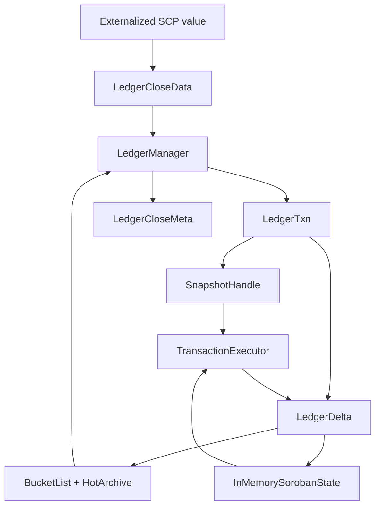

# henyey-ledger

Ledger state management and ledger-close orchestration for henyey.

## Overview

`henyey-ledger` owns the in-memory and bucket-backed view of ledger state, drives ledger close from SCP-externalized inputs, and produces the hashes, metadata, and cache updates that become the next canonical ledger. It sits between consensus-facing code that delivers transaction sets and upgrades, storage-facing code in `henyey-bucket`, and transaction execution in `henyey-tx`. For parity work it maps primarily to stellar-core's `src/ledger/` code, especially `LedgerManagerImpl`, `LedgerTxn`, `LedgerHeaderUtils`, and the Soroban in-memory ledger helpers.

## Architecture


```mermaid
graph TD
    SCP[Externalized SCP value]
    LCD[LedgerCloseData]
    LM[LedgerManager]
    LTX[LedgerTxn]
    SNAP[SnapshotHandle]
    EXEC[TransactionExecutor]
    DELTA[LedgerDelta]
    BL[BucketList + HotArchive]
    SORO[InMemorySorobanState]
    META[LedgerCloseMeta]

    SCP --> LCD
    LCD --> LM
    LM --> LTX
    LTX --> SNAP
    LTX --> DELTA
    SNAP --> EXEC
    EXEC --> DELTA
    DELTA --> BL
    DELTA --> SORO
    LM --> META
    BL --> LM
    SORO --> EXEC
```

## Key Types

| Type | Description |
|------|-------------|
| `LedgerManager` | Top-level coordinator for initialization, ledger close, cache maintenance, and bucket list updates. |
| `LedgerManagerConfig` | Runtime knobs for validation, event/meta emission, and startup scan parallelism. |
| `LedgerCloseData` | Input to a close: ledger sequence, transaction set, close time, upgrades, and optional SCP history. |
| `TransactionSetVariant` | Classic or generalized transaction set, including canonical sorting helpers. |
| `LedgerCloseResult` | Output of a successful close, including the new header, result pairs, optional meta, and perf stats. |
| `LedgerCloseStats` | Aggregate counters for transaction execution and state changes during close. |
| `LedgerTxn` | Transactional ledger wrapper that nests a `LedgerDelta` over a `SnapshotHandle`, supporting `child()`/`commit()`/`rollback()` for upgrade and liability phases. |
| `LedgerTxnRestore` | RAII guard for auto-rollback on drop; returned by `LedgerTxn::child()`. |
| `LedgerTxnFinal` | Final committed `LedgerTxn` state; provides `into_delta()` to extract the accumulated changes. |
| `EntryReader` | Trait for generic ledger entry reads; implemented by `SnapshotHandle` and `LedgerTxn`. |
| `LedgerDelta` | Per-ledger accumulator for creates, updates, deletes, fee-pool deltas, and coin deltas. |
| `EntryChange` | Net effect for a single ledger key after delta coalescing. |
| `LedgerSnapshot` | Immutable point-in-time ledger state used for validation and execution reads. |
| `SnapshotHandle` | Shared snapshot wrapper with lazy point lookups, batch prefetch, and indexed helpers. |
| `ConfigUpgradeSetFrame` | Loader, validator, and applier for Soroban config-upgrade sets stored in ledger state. |
| `InMemorySorobanState` | O(1) cache of contract data, code, TTLs, and config settings for Soroban execution. |
| `SorobanNetworkInfo` | `/sorobaninfo`-style view of ledger-configured Soroban limits and fee parameters. |
| `OfferDescriptor` | Lightweight DEX offer ordering key based on price and offer ID. |
| `LedgerError` | Unified error type for initialization, validation, snapshot, and close failures. |

## Usage

### Initialize and close a ledger

```rust
use henyey_common::Hash256;
use henyey_ledger::{LedgerCloseData, LedgerManager, LedgerManagerConfig, TransactionSetVariant};

let manager = LedgerManager::new("Test SDF Network ; September 2015".to_string(), LedgerManagerConfig::default());

let bucket_list = todo!();
let hot_archive = todo!();
let header = todo!();
let header_hash = Hash256::ZERO;
manager.initialize(bucket_list, hot_archive, header, header_hash)?;

let tx_set = TransactionSetVariant::Classic(todo!());
let close_data = LedgerCloseData::new(manager.current_ledger_seq() + 1, tx_set, 1_700_000_000, manager.current_header_hash());
let result = manager.close_ledger(close_data)?;
assert_eq!(result.ledger_seq(), manager.current_ledger_seq());
# Ok::<(), henyey_ledger::LedgerError>(())
```

### Work with snapshots and prefetched entries

```rust
use henyey_ledger::{LedgerSnapshot, SnapshotHandle};
use stellar_xdr::curr::LedgerKey;

let snapshot = LedgerSnapshot::empty(42);
let handle = SnapshotHandle::new(snapshot);

let key: LedgerKey = todo!();
let maybe_entry = handle.get_entry(&key)?;
assert!(maybe_entry.is_none());
# Ok::<(), henyey_ledger::LedgerError>(())
```

### Use ledger helpers for fees and reserves

```rust
use henyey_ledger::{fees, reserves};
use stellar_xdr::curr::{AccountEntry, Transaction};

let tx: Transaction = todo!();
let account: AccountEntry = todo!();

let charged_fee = fees::calculate_fee(&tx, 100);
let min_balance = reserves::minimum_balance(&account, 5_000_000);
let available = reserves::available_to_send(&account, 5_000_000);

assert!(charged_fee as i64 <= account.balance);
assert!(available <= account.balance - min_balance);
```

## Module Layout

| Module | Description |
|--------|-------------|
| `lib.rs` | Public exports plus lightweight fee, reserve, and trustline helpers. |
| `manager.rs` | `LedgerManager`, startup cache scans, bucket-list installation, and close/commit orchestration. |
| `close.rs` | Ledger-close inputs and outputs, transaction-set preparation, upgrade context, and perf/stat structs. |
| `delta.rs` | Change coalescing, fee deduction helpers, and bucket-update categorization. |
| `ltx.rs` | `LedgerTxn` transactional wrapper with nested child/commit/rollback and merged read path. |
| `snapshot.rs` | Immutable snapshots, lazy lookup handles, batch prefetch, and snapshot construction. |
| `header.rs` | Header hashing, skip-list maintenance, chain verification, and next-header construction. |
| `error.rs` | Crate-wide error enum. |
| `config_upgrade.rs` | Soroban config-upgrade loading, validation, and application. |
| `soroban_state.rs` | In-memory contract data/code/TTL cache with rent-size accounting. |
| `offer.rs` | Offer ordering primitives and asset-pair utilities. |
| `offer_store.rs` | Re-export of the shared offer store implementation from `henyey-tx`. |
| `prepare_liabilities.rs` | Liability migration and cleanup logic for protocol/base-reserve upgrades. |
| `memory_report.rs` | RSS/jemalloc/component memory reporting helpers. |
| `execution/mod.rs` | `TransactionExecutor`, transaction lifecycle, hot-archive lookup, and execution result types. |
| `execution/config.rs` | Loading Soroban config settings and fee parameters from ledger entries. |
| `execution/meta.rs` | Building `TransactionMeta` and tracking restored entries for CAP-0066-style metadata. |
| `execution/result_mapping.rs` | Mapping execution failures to XDR transaction result payloads. |
| `execution/signatures.rs` | Signature verification, threshold checks, and fee-bump inner-hash handling. |
| `execution/tx_set.rs` | Sequential and parallel transaction-set execution, fee pre-deduction, and cluster orchestration. |

## Design Notes

### Delta coalescing

`LedgerDelta` records the net effect per ledger key rather than every intermediate mutation. Create-then-delete annihilates to no change, delete-then-create becomes an update, and repeated updates preserve the original pre-state while replacing the final post-state. This mirrors stellar-core `LedgerTxn` merge semantics and keeps bucket-list output deterministic.

### Transactional ledger access (LedgerTxn)

`LedgerTxn` wraps a `LedgerDelta` over a `SnapshotHandle` and provides nested child/commit/rollback semantics. During ledger close, each upgrade and the liability-preparation step runs in a `child()` scope: reads walk current delta → committed parent chain → base snapshot, so every phase sees changes from prior committed phases. The `EntryReader` trait abstracts over `SnapshotHandle` and `LedgerTxn` so that config-loading functions work in both the close pipeline (via `LedgerTxn`) and the history replay path (via `SnapshotHandle`).

### Pre-deducted fees and staged execution

The close pipeline can deduct fees before transaction bodies run, including across classic and Soroban phases. Parallel Soroban clusters then execute with isolated executors and merge back into the main delta, while preserving the fee and sequence-number behavior expected by stellar-core.

### Restored entries are tracked explicitly

When Soroban restores entries from the live bucket list or hot archive, metadata emission distinguishes `RESTORED` from normal `CREATED` or `UPDATED` changes. That keeps transaction meta aligned with CAP-0066 and upstream `TransactionMeta` behavior.

## stellar-core Mapping

| Rust | stellar-core |
|------|--------------|
| `manager.rs` | `src/ledger/LedgerManagerImpl.cpp`, `src/ledger/LedgerManagerImpl.h` |
| `close.rs` | `src/ledger/LedgerCloseMetaFrame.cpp`, `src/ledger/LedgerCloseMetaFrame.h`, parts of `LedgerManagerImpl.cpp` |
| `delta.rs` | `src/ledger/LedgerTxn.cpp`, `src/ledger/LedgerTxn.h` |
| `ltx.rs` | `src/ledger/LedgerTxn.h`, `src/ledger/LedgerTxn.cpp` (nested transaction subset) |
| `snapshot.rs` | `src/ledger/LedgerStateSnapshot.cpp`, `src/ledger/LedgerStateSnapshot.h` |
| `header.rs` | `src/ledger/LedgerHeaderUtils.cpp`, `src/ledger/LedgerHeaderUtils.h`, bucket skip-list helpers |
| `execution/mod.rs` | Transaction-apply path in `src/ledger/LedgerManagerImpl.cpp` plus `src/transactions/*` integration points |
| `execution/config.rs` | `src/main/Config.cpp`-style Soroban fee/config bridging and `src/ledger/NetworkConfig.cpp` reads |
| `execution/meta.rs` | `src/ledger/TransactionMeta.cpp` and ledger-close meta assembly |
| `execution/result_mapping.rs` | Transaction-result construction in `src/transactions/TransactionFrame.cpp` |
| `execution/signatures.rs` | Signature and threshold checks in `src/transactions/TransactionFrame.cpp` and operation frames |
| `execution/tx_set.rs` | Generalized tx-set apply flow in `src/ledger/LedgerManagerImpl.cpp` and `src/herder/TxSetFrame.cpp` |
| `config_upgrade.rs` | `src/ledger/NetworkConfig.cpp`, `src/ledger/NetworkConfig.h`, `src/herder/Upgrades.cpp` |
| `soroban_state.rs` | `src/ledger/InMemorySorobanState.cpp`, `src/ledger/InMemorySorobanState.h` |
| `prepare_liabilities.rs` | `src/herder/Upgrades.cpp` |
| `offer.rs` | Offer ordering helpers in `src/ledger/LedgerTxn.cpp` and related DEX utilities |
| `memory_report.rs` | No direct upstream equivalent; henyey-specific observability |

## Parity Status

See [PARITY_STATUS.md](PARITY_STATUS.md) for detailed stellar-core parity analysis.
