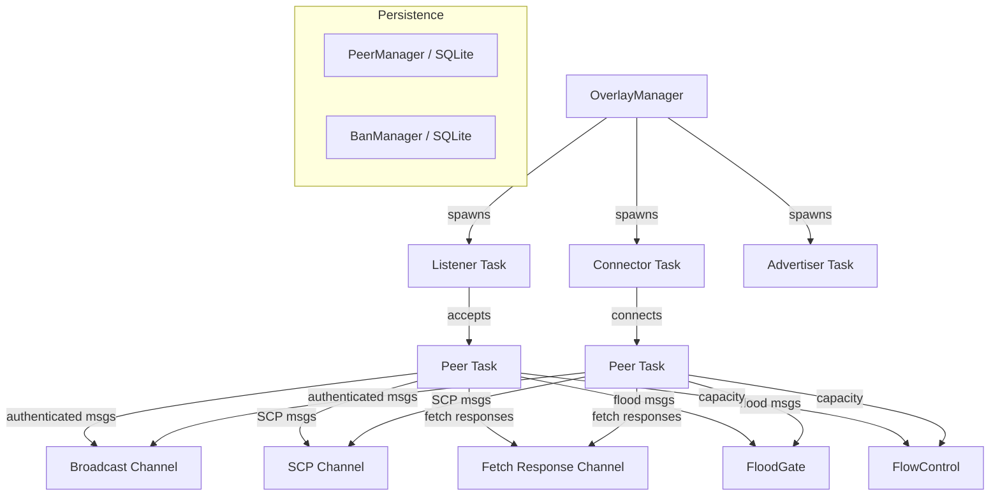

# henyey-overlay

P2P overlay networking layer for Stellar node communication.

## Overview

This crate implements the Stellar overlay network protocol, enabling nodes to
communicate for consensus, transaction propagation, and state synchronization.
It corresponds to stellar-core's `src/overlay/` subsystem and provides
authenticated peer connections (X25519 + HMAC-SHA256), message routing with
duplicate detection, flow control via SendMore/SendMoreExtended, pull-mode
transaction flooding, and SQLite-backed peer/ban persistence.

## Architecture



## Key Types

| Type | Description |
|------|-------------|
| `OverlayManager` | Central coordinator managing peer connections, message routing, and peer discovery |
| `OverlayConfig` | Configuration for connection limits, timeouts, network passphrase, and known peers |
| `LocalNode` | Local node identity (secret key, protocol versions, network ID) |
| `Peer` | Fully authenticated connection to a single remote peer |
| `PeerAddress` | Host:port endpoint address for a Stellar node |
| `PeerId` | Ed25519 public key identifier for a peer |
| `AuthContext` | Authentication handshake state machine with X25519 key exchange and HMAC keys |
| `Connection` | Low-level TCP connection with length-prefixed XDR message framing |
| `FloodGate` | Tracks seen message hashes to prevent duplicate flooding |
| `FlowControl` | Bandwidth management via SendMore/SendMoreExtended capacity tracking |
| `MessageDispatcher` | Routes fetch-protocol messages (GetTxSet, ScpQuorumset, DontHave) with caching |
| `ItemFetcher` | Fetches missing items (tx sets, quorum sets) from peers with retry and timeout |
| `BanManager` | Persistent peer ban list backed by SQLite |
| `PeerManager` | SQLite-backed peer address storage with failure tracking and backoff |
| `TxAdverts` | Manages outgoing/incoming transaction flood adverts with batching |
| `TxDemandsManager` | Tracks transaction demand lifecycle with retries and latency metrics |
| `SurveyManager` | Time-sliced network topology survey collection and reporting |
| `OverlayMetrics` | Thread-safe atomic counters and timers for overlay statistics |

## Usage

### Starting the overlay

```rust
use henyey_overlay::{OverlayConfig, OverlayManager, LocalNode, PeerAddress};
use henyey_crypto::SecretKey;

let secret_key = SecretKey::generate();
let local_node = LocalNode::new_testnet(secret_key);

let mut config = OverlayConfig::testnet();
config.known_peers.push(PeerAddress::new("validator.example.com", 11625));

let mut manager = OverlayManager::new(config, local_node)?;
manager.start().await?;

// Subscribe to incoming messages
let mut rx = manager.subscribe();
while let Ok(msg) = rx.recv().await {
    println!("Received {:?} from {}", msg.message, msg.from_peer);
}
```

### Broadcasting and sending

```rust
use stellar_xdr::curr::StellarMessage;

// Broadcast to all peers
let sent_count = manager.broadcast(tx_msg).await?;

// Send to a specific peer
manager.send_to(&peer_id, message).await?;

// Request SCP state from all peers
manager.request_scp_state(ledger_seq).await?;
```

### Watcher mode

```rust
let mut config = OverlayConfig::testnet();
config.is_validator = false;  // Drops flood messages (TX, FloodAdvert, FloodDemand, Survey)
config.listen_enabled = false; // Don't accept inbound connections
```

## Module Layout

| Module | Description |
|--------|-------------|
| `lib.rs` | Public API, re-exports, `OverlayConfig`, `LocalNode`, `PeerAddress`, `PeerId` |
| `manager.rs` | `OverlayManager` -- connection lifecycle, message routing, peer discovery |
| `peer.rs` | `Peer` -- authenticated connection handling, send/recv, statistics |
| `auth.rs` | `AuthContext` -- X25519 key exchange, HKDF key derivation, HMAC-SHA256 MACs |
| `codec.rs` | `MessageCodec` -- 4-byte length-prefixed XDR framing with auth bit |
| `connection.rs` | `Connection`, `Listener`, `ConnectionPool` -- TCP connection management |
| `flood.rs` | `FloodGate` -- BLAKE2b-256 message hash tracking with TTL expiry |
| `flow_control.rs` | `FlowControl` -- SendMore/SendMoreExtended capacity and priority queuing |
| `item_fetcher.rs` | `ItemFetcher`, `Tracker` -- fetch missing tx sets/quorum sets with retry |
| `message_handlers.rs` | `MessageDispatcher` -- routes GetTxSet, ScpQuorumset, DontHave; caches results |
| `ban_manager.rs` | `BanManager` -- in-memory + SQLite persistent ban list |
| `peer_manager.rs` | `PeerManager` -- SQLite peer storage, failure counts, backoff scheduling |
| `tx_adverts.rs` | `TxAdverts` -- outgoing/incoming advert queuing, history cache, batch flush |
| `tx_demands.rs` | `TxDemandsManager` -- demand status tracking, linear backoff retries, latency |
| `survey.rs` | `SurveyManager` -- time-sliced network survey lifecycle and data collection |
| `metrics.rs` | `OverlayMetrics` -- atomic counters/timers for messages, bytes, errors, latency |
| `error.rs` | `OverlayError` enum with thiserror |

## Design Notes

- **Channel separation**: SCP messages are routed through a dedicated unbounded
  `mpsc` channel, and fetch responses (TxSet, ScpQuorumset, DontHave) through a
  bounded `mpsc` channel, rather than the main `broadcast` channel. This prevents
  consensus-critical messages from being lost when the broadcast channel overflows
  during high transaction traffic.

- **Watcher filtering**: When `is_validator` is false, flood messages
  (Transaction, FloodAdvert, FloodDemand, Survey) are dropped at the peer loop
  before entering any channel, reducing channel pressure by ~90% on mainnet.

- **SharedPeerState**: Spawned background tasks (listener, connector, per-peer
  loops) share state through a `SharedPeerState` struct rather than cloning
  15+ individual `Arc` fields, keeping function signatures manageable.

- **Ping keepalive**: The peer loop sends `GetScpQuorumSet` with a synthetic
  hash every 5 seconds (matching stellar-core's `RECURRENT_TIMER_PERIOD`) to
  prevent the remote peer's 30-second idle timeout from triggering.

## stellar-core Mapping

| Rust | stellar-core |
|------|--------------|
| `manager.rs` | `src/overlay/OverlayManager.h`, `OverlayManagerImpl.cpp` |
| `peer.rs`, `connection.rs` | `src/overlay/Peer.h`, `TCPPeer.h` |
| `auth.rs` | `src/overlay/PeerAuth.h`, `Hmac.h` |
| `codec.rs` | XDR framing in `TCPPeer.cpp` |
| `flood.rs` | `src/overlay/Floodgate.h` |
| `flow_control.rs` | `src/overlay/FlowControl.h`, `FlowControlCapacity.h` |
| `item_fetcher.rs` | `src/overlay/ItemFetcher.h`, `Tracker.h` |
| `message_handlers.rs` | fetch handlers in `Peer.cpp` |
| `ban_manager.rs` | `src/overlay/BanManager.h`, `BanManagerImpl.h` |
| `peer_manager.rs` | `src/overlay/PeerManager.h`, `RandomPeerSource.h` |
| `tx_adverts.rs` | `src/overlay/TxAdverts.h` |
| `tx_demands.rs` | `src/overlay/TxDemandsManager.h` |
| `survey.rs` | `src/overlay/SurveyManager.h`, `SurveyDataManager.h` |
| `metrics.rs` | `src/overlay/OverlayMetrics.h` |

## Parity Status

See [PARITY_STATUS.md](PARITY_STATUS.md) for detailed stellar-core parity analysis.
