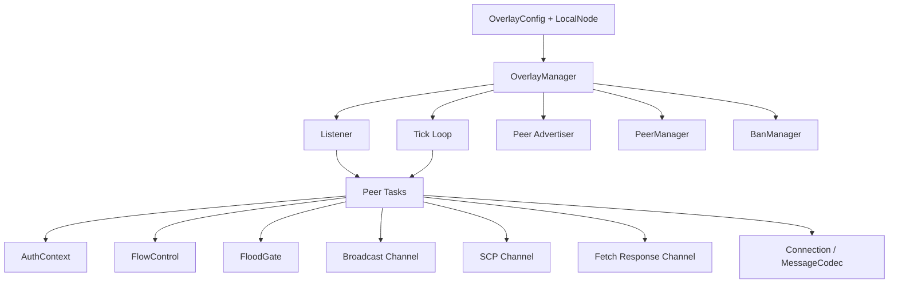

# henyey-overlay

P2P overlay networking for Stellar peer communication.

## Overview

`henyey-overlay` implements the node-to-node networking layer used by henyey for peer discovery, authenticated transport, flooding, fetches, and topology survey traffic. It sits between the application/herder layers and raw sockets, and maps closely to stellar-core's `src/overlay/` subsystem while using Tokio tasks, channels, and SQLite-backed peer/ban persistence.

## Architecture


```mermaid
flowchart TD
    C[OverlayConfig + LocalNode] --> OM[OverlayManager]
    OM --> L[Listener]
    OM --> T[Tick Loop]
    OM --> A[Peer Advertiser]
    L --> P[Peer Tasks]
    T --> P
    P --> AU[AuthContext]
    P --> FC[FlowControl]
    P --> FG[FloodGate]
    P --> BC[Broadcast Channel]
    P --> SCP[SCP Channel]
    P --> FETCH[Fetch Response Channel]
    OM --> PM[PeerManager]
    OM --> BM[BanManager]
    P --> CONN[Connection / MessageCodec]
```

## Key Types

| Type | Description |
|------|-------------|
| `OverlayManager` | Starts listener/tick tasks, owns peer handles, and exposes the main send/subscribe API. |
| `OverlayConfig` | Configures peer limits, network identity, known peers, persistence hooks, and validator/watcher behavior. |
| `LocalNode` | Local signing identity plus overlay and ledger protocol versions used in `HELLO`. |
| `Peer` | Owns a single authenticated connection and performs the HELLO/AUTH handshake plus message I/O. |
| `PeerInfo` | Immutable per-connection metadata such as peer ID, address, versions, and direction. |
| `PeerAddress` | Host/port address used for dialing, advertising, and peer database storage. |
| `PeerId` | Ed25519 public-key identity wrapper with XDR, hex, and strkey helpers. |
| `AuthContext` | Stateful overlay authentication engine for cert verification, HKDF key derivation, and MAC sequencing. |
| `Connection` | Framed transport over TCP or test IO, built on `MessageCodec`. |
| `ConnectionPool` | Tracks pending and authenticated inbound/outbound slots, including preferred-peer overflow for inbound peers. |
| `FloodGate` | Deduplicates flood traffic and tracks which peers have already seen a message. |
| `FlowControl` | Enforces per-peer message/byte credit, priority queues, and `SEND_MORE_EXTENDED` accounting. |
| `ItemFetcher` | Tracks missing tx sets or quorum sets and retries requests across peers. |
| `MessageDispatcher` | Handles `GetTxSet`, `ScpQuorumset`, `DontHave`, and related fetch protocol messages with caches. |
| `PeerManager` | SQLite-backed peer address store with type tracking and exponential backoff. |
| `BanManager` | In-memory plus optional SQLite ban list with permanent and timed bans. |
| `TxAdverts` | Queues and batches `FloodAdvert` transaction hashes for pull-mode flooding. |
| `TxDemandsManager` | Schedules `FloodDemand` retries and records transaction pull latency. |
| `SurveyManager` | Manages the collect/report lifecycle for time-sliced overlay surveys. |
| `OverlayMetrics` | Atomic counters and timers for overlay activity, throttling, flooding, and pull latency. |
| `ConnectionFactory` | Transport abstraction used by `OverlayManager` for real TCP or in-process loopback tests. |

## Usage

### Start the overlay and consume general traffic

```rust
use henyey_crypto::SecretKey;
use henyey_overlay::{LocalNode, OverlayConfig, OverlayManager, PeerAddress};

let secret = SecretKey::generate();
let local_node = LocalNode::new_testnet(secret);

let mut config = OverlayConfig::testnet();
config.known_peers.push(PeerAddress::new("validator.example.com", 11625));

let mut overlay = OverlayManager::new(config, local_node)?;
overlay.start().await?;

let mut rx = overlay.subscribe();
while let Ok(msg) = rx.recv().await {
    println!("{} -> {:?}", msg.from_peer, msg.message);
}

overlay.shutdown().await?;
# Ok::<(), henyey_overlay::OverlayError>(())
```

### Use the dedicated SCP and fetch-response subscriptions

```rust
let scp_rx = overlay.subscribe_scp().await.expect("SCP receiver already taken");
let fetch_rx = overlay
    .subscribe_fetch_responses()
    .await
    .expect("fetch receiver already taken");

let catchup_rx = overlay.subscribe_catchup();

overlay.request_scp_state(0).await?;
# let _ = (scp_rx, fetch_rx, catchup_rx);
# Ok::<(), henyey_overlay::OverlayError>(())
```

### Use watcher mode or an in-process transport

```rust
use std::sync::Arc;
use henyey_overlay::{LoopbackConnectionFactory, OverlayManager};

let mut config = OverlayConfig::testnet();
config.is_validator = false;
config.listen_enabled = false;

let factory = Arc::new(LoopbackConnectionFactory::default());
let overlay = OverlayManager::new_with_connection_factory(config, local_node, factory)?;

// Watchers still participate in transaction flooding; only survey traffic is dropped.
# let _ = overlay;
# Ok::<(), henyey_overlay::OverlayError>(())
```

## Module Layout

| Module | Description |
|--------|-------------|
| `lib.rs` | Public API surface, core config/types, and re-exports. |
| `auth.rs` | Overlay authentication certificates, HKDF key setup, MAC wrapping, and handshake state. |
| `ban_manager.rs` | Persistent and in-memory peer bans, including timed auto-bans. |
| `codec.rs` | Length-prefixed XDR framing with the overlay auth bit. |
| `connection.rs` | Raw connections, listeners, split send/recv halves, and connection-slot accounting. |
| `connection_factory.rs` | Transport abstraction trait plus the default TCP implementation. |
| `error.rs` | `OverlayError` and retry/fatal classification helpers. |
| `flood.rs` | Flood deduplication, peer exclusion, ledger-boundary cleanup, and message hashing. |
| `flow_control.rs` | Priority outbound queues, message/byte capacity tracking, and `CapacityGuard`. |
| `item_fetcher.rs` | `ItemFetcher` and `Tracker` state machines for missing tx/quorum set retrieval. |
| `loopback.rs` | In-process loopback transport for tests and simulations. |
| `manager/mod.rs` | `OverlayManager` public API, task orchestration, routing, and subscriptions. |
| `manager/connection.rs` | Dial/listener integration and connection task setup. |
| `manager/peer_loop.rs` | Per-peer message loop and dispatch into overlay channels. |
| `manager/tick.rs` | Periodic discovery, keepalive, cleanup, and peer-management ticks. |
| `message_handlers.rs` | Fetch-protocol dispatcher and local caches for tx sets and quorum sets. |
| `metrics.rs` | Atomic counters and timers for overlay observability. |
| `peer.rs` | Authenticated peer lifecycle, handshake ordering, and per-peer stats. |
| `peer_manager.rs` | SQLite peer database, type promotion, and exponential backoff scheduling. |
| `survey.rs` | Survey state machine, limiter, and collected/finalized topology data. |
| `tx_adverts.rs` | Pull-mode advertisement batching, retry queues, and history cache. |
| `tx_demands.rs` | Demand scheduling, retry/backoff policy, and pull latency tracking. |

## Design Notes

- Dedicated delivery paths matter: SCP messages use an unbounded channel and fetch responses use a separate bounded channel, so consensus and catchup traffic do not compete with generic broadcast traffic.
- PEERS exchange is asymmetric: only the acceptor sends `PEERS`, and duplicate or wrong-direction `PEERS` messages cause the connection to be dropped to match stellar-core.
- Flow control is enforced in the hot path with `CapacityGuard`; a peer that sends flood traffic after exhausting granted credit is dropped immediately.
- Watcher mode is intentionally narrow in this crate: non-validators still participate in transaction pull-mode flooding and only survey traffic is filtered at the overlay layer.

## stellar-core Mapping

| Rust | stellar-core |
|------|--------------|
| `manager.rs` | `src/overlay/OverlayManager.h`, `OverlayManagerImpl.cpp` |
| `peer.rs` | `src/overlay/Peer.h`, `Peer.cpp`, `TCPPeer.h`, `TCPPeer.cpp` |
| `auth.rs` | `src/overlay/PeerAuth.h`, `PeerAuth.cpp`, `Hmac.h`, `Hmac.cpp` |
| `codec.rs` | Framing logic in `src/overlay/TCPPeer.cpp` |
| `connection.rs` | `src/overlay/PeerDoor.h`, `PeerDoor.cpp`, parts of `TCPPeer.cpp` |
| `flood.rs` | `src/overlay/Floodgate.h`, `Floodgate.cpp` |
| `flow_control.rs` | `src/overlay/FlowControl.h`, `FlowControl.cpp`, `FlowControlCapacity.h`, `FlowControlCapacity.cpp` |
| `item_fetcher.rs` | `src/overlay/ItemFetcher.h`, `ItemFetcher.cpp`, `Tracker.h`, `Tracker.cpp` |
| `message_handlers.rs` | Fetch-related handlers in `src/overlay/Peer.cpp` |
| `ban_manager.rs` | `src/overlay/BanManager.h`, `BanManagerImpl.h`, `BanManagerImpl.cpp` |
| `peer_manager.rs` | `src/overlay/PeerManager.h`, `PeerManager.cpp`, `RandomPeerSource.h`, `RandomPeerSource.cpp` |
| `tx_adverts.rs` | `src/overlay/TxAdverts.h`, `TxAdverts.cpp` |
| `tx_demands.rs` | `src/overlay/TxDemandsManager.h`, `TxDemandsManager.cpp` |
| `survey.rs` | `src/overlay/SurveyManager.h`, `SurveyManager.cpp`, `SurveyDataManager.h`, `SurveyDataManager.cpp`, `SurveyMessageLimiter.*` |
| `metrics.rs` | `src/overlay/OverlayMetrics.h`, `OverlayMetrics.cpp` |
| `loopback.rs` | `src/overlay/LoopbackPeer.h` (test support) |
| `connection_factory.rs` | No direct equivalent; stellar-core wires transport directly into `TCPPeer`/`PeerDoor` |

## Parity Status

See [PARITY_STATUS.md](PARITY_STATUS.md) for detailed stellar-core parity analysis.
