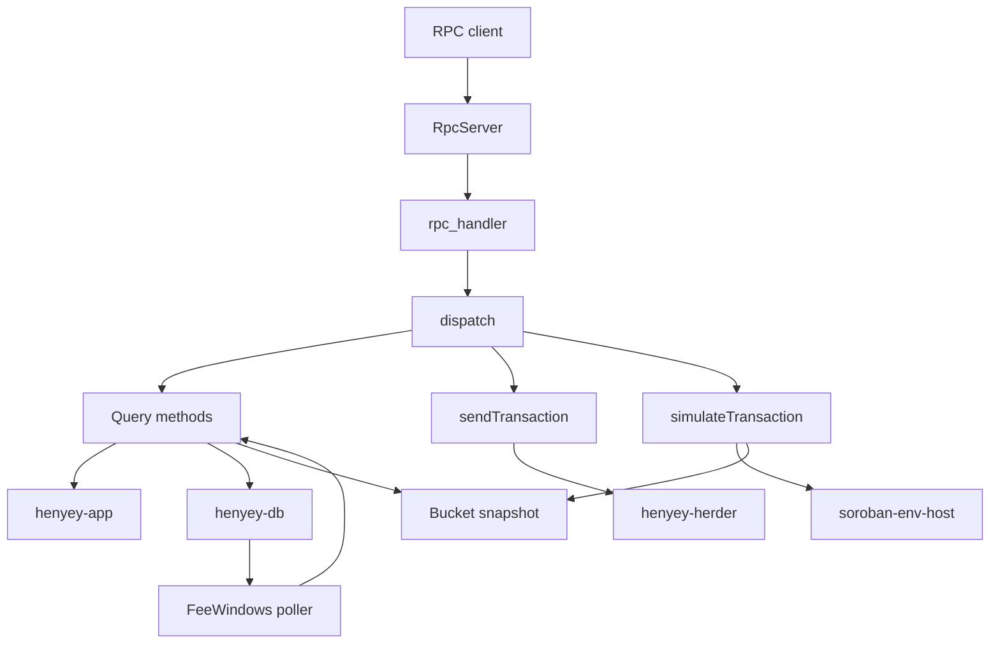

# henyey-rpc

Stellar JSON-RPC 2.0 server for henyey nodes.

## Overview

`henyey-rpc` exposes henyey state over the Stellar JSON-RPC surface used by wallets, SDKs, and other network clients. The crate is embedded in the `henyey` binary rather than running as a standalone service: it reads live state from `henyey-app`, historical data from `henyey-db`, bucket snapshots from `henyey-bucket`, and transaction submission results from `henyey-herder`. There is no direct stellar-core source equivalent; henyey implements this RPC surface natively instead of using captive-core.

## Architecture



## Key Types

| Type | Description |
|------|-------------|
| `RpcServer` | Public entry point that binds the HTTP listener and serves the JSON-RPC endpoint. |
| `RpcAppHandle` | Trait abstracting the subset of `App` used by RPC handlers; enables test fakes. |
| `RpcContext` | Shared state passed to handlers, holding an `Arc<dyn RpcAppHandle>` and fee-window cache. |
| `JsonRpcRequest` | Deserialized JSON-RPC 2.0 request envelope. |
| `JsonRpcResponse` | Serialized JSON-RPC success or error envelope. |
| `JsonRpcError` | JSON-RPC error payload with standard codes and optional data. |
| `FeeWindows` | Sliding-window cache for classic and Soroban fee distributions used by `getFeeStats`. |
| `FeeDistribution` | Percentile snapshot returned by the fee window logic. |
| `BucketListSnapshotSource` | Soroban host `SnapshotSource` adapter backed by a bucket-list snapshot. |
| `XdrFormat` | Response mode selector for base64 XDR vs JSON-serialized XDR fields. |
| `SorobanOp` | Internal enum that normalizes the three supported simulation operation kinds. |

## Usage

```rust
use std::sync::Arc;

use henyey_app::App;
use henyey_rpc::RpcServer;

async fn run_rpc(app: Arc<App>) -> anyhow::Result<()> {
    // Arc<App> coerces to Arc<dyn RpcAppHandle> automatically.
    let server = RpcServer::new(8000, app);
    server.start().await
}
```

```rust
use std::sync::Arc;

use henyey_app::App;
use henyey_rpc::RpcServer;

async fn run_embedded(app: Arc<App>) -> anyhow::Result<()> {
    let rpc = RpcServer::new(app.config().rpc.port, app.clone());
    tokio::spawn(async move {
        let _ = rpc.start().await;
    });

    // The server shares the node's shutdown signal through `App`.
    Ok(())
}
```

```rust
use serde_json::json;

fn build_simulation_request(tx_b64: &str) -> serde_json::Value {
    json!({
        "jsonrpc": "2.0",
        "id": 1,
        "method": "simulateTransaction",
        "params": {
            "transaction": tx_b64,
            "xdrFormat": "json",
            "resourceConfig": { "instructionLeeway": 75_000 }
        }
    })
}
```

## Module Layout

| Module | Description |
|--------|-------------|
| `lib.rs` | Crate root; declares modules and re-exports `RpcServer`, `RpcAppHandle`. |
| `context.rs` | `RpcAppHandle` trait and shared request context used by all handlers. |
| `dispatch.rs` | Routes JSON-RPC method names to handler functions. |
| `error.rs` | JSON-RPC error codes and error object helpers. |
| `fee_window.rs` | Sliding fee-window implementation and percentile calculation. |
| `server.rs` | Axum server setup, body validation, shutdown handling, and fee-window polling. |
| `util.rs` | Shared helpers for XDR formatting, pagination, timestamps, TOIDs, and TTL lookup. |
| `types/mod.rs` | Re-exports JSON-RPC request and response types. |
| `types/jsonrpc.rs` | JSON-RPC envelope structs. |
| `methods/mod.rs` | Declares the RPC method modules. |
| `methods/health.rs` | Implements `getHealth`. |
| `methods/network.rs` | Implements `getNetwork`. |
| `methods/latest_ledger.rs` | Implements `getLatestLedger`. |
| `methods/version_info.rs` | Implements `getVersionInfo`. |
| `methods/fee_stats.rs` | Implements `getFeeStats`. |
| `methods/get_ledger_entries.rs` | Implements `getLedgerEntries`. |
| `methods/get_transaction.rs` | Implements `getTransaction`. |
| `methods/get_transactions.rs` | Implements `getTransactions`. |
| `methods/get_ledgers.rs` | Implements `getLedgers`. |
| `methods/get_events.rs` | Implements `getEvents`. |
| `methods/send_transaction.rs` | Implements `sendTransaction`. |
| `simulate/mod.rs` | Implements `simulateTransaction`, including Soroban preflight and fee estimation. |
| `simulate/convert.rs` | Converts XDR values between workspace and P25 host types. |
| `simulate/preflight.rs` | Runs host preflight and extracts Soroban authorization/footprint data. |
| `simulate/resources.rs` | Estimates CPU, memory, I/O, and resource fees. |
| `simulate/response.rs` | Builds success and error JSON-RPC simulation responses. |
| `simulate/snapshot.rs` | Normalizes bucket-list entries and adapts snapshots for soroban-host reads. |

## Design Notes

- All RPC methods share a single `POST /` endpoint; request validation, version checks, and method dispatch happen before any method-specific logic runs.
- `simulateTransaction` runs Soroban host work inside `tokio::task::spawn_blocking` because the host uses `Rc`-based state and is not async-runtime friendly.
- Fee statistics are populated by a background poller that reads `LedgerCloseMeta` rows from SQLite, which keeps ledger-close code decoupled from RPC-only analytics.
- Simulation reads from a live bucket snapshot instead of the history database so preflight sees the same current-state shape as the validator path, including TTL handling.
- Account entries are normalized to V3 extensions before simulation so resource metering matches upstream Soroban expectations.

### Concurrency Control

The server uses per-resource-class semaphores to prevent any single category of work from monopolizing Tokio's shared `spawn_blocking` pool:

| Semaphore | Config Field | Default | Protects |
|-----------|-------------|---------|----------|
| `request_semaphore` | `max_concurrent_requests` | 64 | Global async admission gate |
| `simulation_semaphore` | `max_concurrent_simulations` | 10 | CPU-heavy `simulateTransaction` |
| `db_semaphore` | `rpc_db_concurrency` | 8 | SQLite database queries |
| `bucket_io_semaphore` | `bucket_io_concurrency` | 8 | Bucket-list disk reads |

The `request_semaphore` gates async admission (try-acquire, immediate reject). The three blocking semaphores (`simulation`, `db`, `bucket_io`) bound concurrent `spawn_blocking` work. They provide admission control on the shared pool — not isolated thread pools.

## stellar-core Mapping

This crate has no direct `stellar-core` counterpart. The implemented API surface is a native Stellar JSON-RPC surface for henyey nodes, while henyey-specific integrations replace captive-core and standalone ingestion components with direct access to `henyey-app`, `henyey-db`, and bucket snapshots.

## Parity Status

See [PARITY_STATUS.md](PARITY_STATUS.md) for detailed stellar-core parity analysis.
