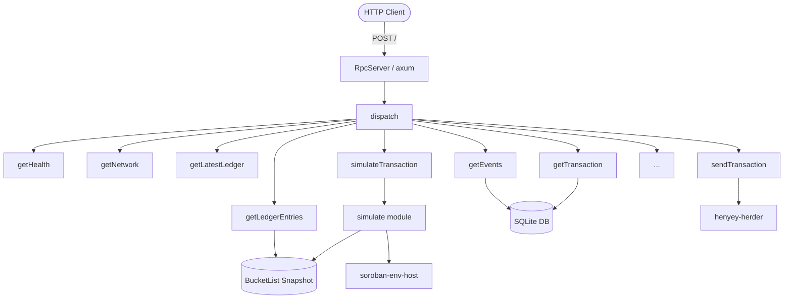

# henyey-rpc

Stellar JSON-RPC 2.0 server implementing the Soroban RPC API (SEP-35).

## Overview

`henyey-rpc` exposes henyey's ledger state and transaction submission over
a JSON-RPC 2.0 HTTP endpoint. It is the primary interface used by wallets,
SDKs, and dApps to interact with a henyey node, mirroring the API surface
of Stellar's standalone `soroban-rpc` service.

The crate is consumed by the `henyey` binary, which constructs an `RpcServer`
and starts it alongside the rest of the node. Internally it depends on
`henyey-app` for ledger state, `henyey-db` for historical queries,
`henyey-bucket` for bucket list snapshots, `henyey-herder` for transaction
submission, and `soroban-env-host-p25` for Soroban transaction simulation.

## Architecture



## Key Types

| Type | Description |
|------|-------------|
| `RpcServer` | Public entry point; binds an HTTP listener and serves JSON-RPC requests |
| `RpcContext` | Shared state (`Arc<App>`, `Arc<FeeWindows>`) passed to every handler via axum state |
| `JsonRpcRequest` | Deserialized JSON-RPC 2.0 request envelope |
| `JsonRpcResponse` | Serialized JSON-RPC 2.0 response envelope (result or error) |
| `JsonRpcError` | Standard JSON-RPC 2.0 error object with code, message, optional data |
| `BucketListSnapshotSource` | Adapter implementing soroban-host `SnapshotSource` over a bucket list snapshot |

## Usage

### Starting the server

```rust
use std::sync::Arc;
use henyey_rpc::RpcServer;

let server = RpcServer::new(8000, app.clone());
server.start().await?;
// Server listens on 0.0.0.0:8000 and shuts down via App's shutdown signal.
```

### Querying the endpoint

```bash
curl -X POST http://localhost:8000 \
  -H 'Content-Type: application/json' \
  -d '{"jsonrpc":"2.0","id":1,"method":"getHealth"}'
```

### Simulating a transaction

```bash
curl -X POST http://localhost:8000 \
  -H 'Content-Type: application/json' \
  -d '{
    "jsonrpc":"2.0",
    "id":1,
    "method":"simulateTransaction",
    "params":{"transaction":"<base64-encoded TransactionEnvelope>"}
  }'
```

## Module Layout

| Module | Description |
|--------|-------------|
| `lib.rs` | Crate root; re-exports `RpcServer` |
| `server.rs` | Axum HTTP server setup, request parsing, version validation |
| `context.rs` | `RpcContext` struct holding shared `Arc<App>` |
| `dispatch.rs` | Method name routing to handler functions |
| `error.rs` | `JsonRpcError` type and standard error code constructors |
| `types/jsonrpc.rs` | `JsonRpcRequest` / `JsonRpcResponse` serde types |
| `util.rs` | Shared helpers: TOID encoding, pagination validation, tx status, TTL key construction, xdrFormat support, timestamp formatting |
| `fee_window.rs` | Fee distribution computation, ring buffer, sliding window fee stats |
| `methods/health.rs` | `getHealth` — returns server status and ledger window |
| `methods/network.rs` | `getNetwork` — returns passphrase and protocol version |
| `methods/latest_ledger.rs` | `getLatestLedger` — returns latest ledger sequence, hash, close time, header/meta XDR |
| `methods/version_info.rs` | `getVersionInfo` — returns node version metadata |
| `methods/fee_stats.rs` | `getFeeStats` — returns fee percentile statistics from sliding window |
| `methods/get_ledger_entries.rs` | `getLedgerEntries` — reads entries from bucket list snapshot with TTL lookup |
| `methods/get_transaction.rs` | `getTransaction` — looks up a transaction by hash from the database |
| `methods/get_transactions.rs` | `getTransactions` — paginated range query over transactions with TOID cursor |
| `methods/get_ledgers.rs` | `getLedgers` — paginated range query over ledgers with header/meta XDR |
| `methods/get_events.rs` | `getEvents` — queries contract events with filters and pagination |
| `methods/send_transaction.rs` | `sendTransaction` — submits a transaction envelope to the herder |
| `methods/simulate_transaction.rs` | `simulateTransaction` — delegates to the simulate module |
| `simulate/mod.rs` | Soroban simulation: InvokeHostFunction, ExtendTTL, Restore; resource adjustment, fee computation |
| `simulate/snapshot.rs` | `BucketListSnapshotSource` — soroban-host `SnapshotSource` adapter with filtered/unfiltered access |

## Design Notes

- **Single endpoint**: All methods share a single `POST /` endpoint. Axum
  deserializes the body, `dispatch` routes by method name, and each handler
  returns `Result<Value, JsonRpcError>` which is wrapped into a JSON-RPC
  response envelope.

- **Simulation is blocking**: Soroban's `Host` uses `Rc` internally and is
  not `Send`. Simulation runs inside `tokio::task::spawn_blocking` to avoid
  holding the async runtime.

- **Resource adjustment**: `simulateTransaction` applies the same adjustment
  factors as `soroban-simulation` (1.04x + 50k for CPU instructions, 1.15x
  for refundable fees) to give transactions headroom against state drift.

- **ExtendTTL/Restore simulation**: `simulateTransaction` handles all three
  Soroban operation types. ExtendTTL and Restore simulations compute rent
  fees by looking up entries and TTLs from the bucket list snapshot, mirroring
  `soroban-simulation`'s `simulate_extend_ttl_op_resources` and
  `simulate_restore_op_resources`.

- **xdrFormat support**: All methods support `xdrFormat: "json"` parameter
  which returns XDR fields as native JSON objects (via `stellar-xdr` serde
  support) instead of base64-encoded strings. Field names change
  (`envelopeXdr` → `envelopeJson`, etc.) matching upstream behavior.

- **Fee window**: `FeeWindows` maintains two independent sliding windows
  (classic and Soroban) backed by ring buffers. A background poller reads
  new LCMs from the database every second, avoiding coupling with the
  ledger close path. Fee distributions use nearest-rank percentile
  computation matching the upstream Go implementation.

- **Visibility**: All internal modules and types are `pub(crate)`. Only
  `RpcServer` is exported from the crate.

## stellar-core Mapping

This crate has no direct stellar-core counterpart. It implements the
Stellar RPC API (SEP-35), which in the reference architecture is provided
by the standalone `soroban-rpc` service rather than `stellar-core` itself.
