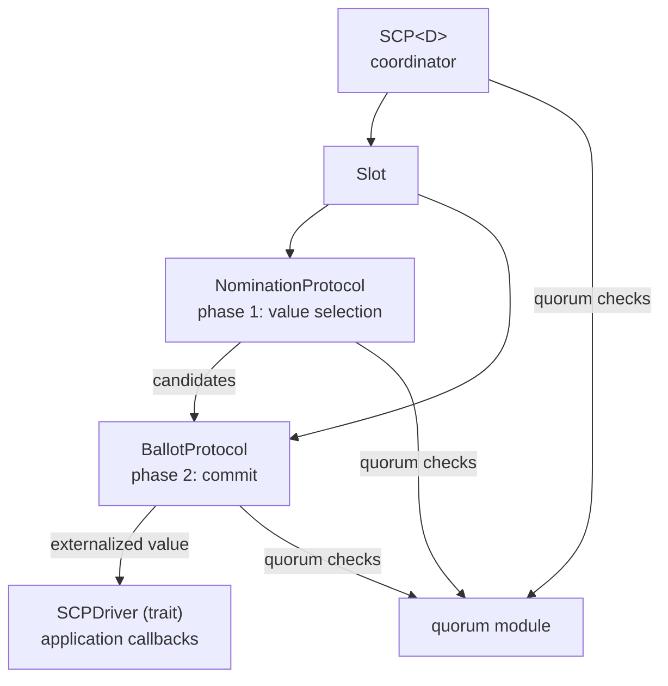

# henyey-scp

Rust implementation of the Stellar Consensus Protocol (SCP).

## Overview

SCP is a federated Byzantine agreement protocol that enables nodes to reach consensus without requiring a closed membership or central authority. This crate provides a complete, deterministic implementation of SCP suitable for use in Stellar network nodes. It corresponds to stellar-core's `src/scp/` (upstream reference at `.upstream-v25/src/scp/`) and is the consensus engine used by `henyey-herder` to agree on transaction sets each ledger.

SCP operates in two phases per slot: **nomination** (propose and vote on candidate values) followed by the **ballot protocol** (commit to a single value through prepare, confirm, and externalize stages).

## Architecture



## Key Types

| Type | Description |
|------|-------------|
| `SCP<D>` | Main coordinator managing multiple slots, parameterized by driver |
| `Slot` | Per-slot state combining nomination and ballot protocols |
| `SCPDriver` | Trait for application callbacks (validation, signing, timers) |
| `NominationProtocol` | Nomination phase: propose, vote, accept, confirm candidates |
| `BallotProtocol` | Ballot phase: prepare, confirm, externalize a value |
| `SlotContext` | Internal context struct grouping node ID, quorum set, driver, slot index |
| `EnvelopeState` | Result of processing an envelope (Valid, ValidNew, Invalid) |
| `ValidationLevel` | Value validation result (Invalid, MaybeValid, FullyValidated) |
| `BallotPhase` | Current ballot phase (Prepare, Confirm, Externalize) |
| `SCPTimerType` | Timer identifier (Nomination, Ballot) |
| `ScpError` | Error types for SCP operations |
| `QuorumSetJson` | JSON-serializable quorum set for persistence and debugging |
| `SlotInfo` / `BallotInfo` / `NominationInfo` | Diagnostic snapshot types |

## Usage

### Basic Setup

```rust
use henyey_scp::{SCP, SCPDriver, EnvelopeState};
use std::sync::Arc;

// Implement the driver trait for your application
struct MyDriver { /* ... */ }
impl SCPDriver for MyDriver { /* ... */ }

// Create SCP instance
let driver = Arc::new(MyDriver::new());
let scp = SCP::new(node_id, is_validator, quorum_set, driver);
```

### Participating in Consensus

```rust
// Nominate a value for a slot
scp.nominate(slot_index, value, &prev_value);

// Process incoming messages
let state = scp.receive_envelope(envelope);
match state {
    EnvelopeState::ValidNew => { /* State changed */ }
    EnvelopeState::Valid => { /* Valid but no change */ }
    EnvelopeState::Invalid => { /* Rejected */ }
}

// Check for externalized values
if let Some(value) = scp.get_externalized_value(slot_index) {
    // Consensus reached
}
```

### Catchup Mode

During catchup from historical data, slots can be force-externalized
without running the consensus protocol:

```rust
scp.force_externalize(ledger_seq, ledger_value);
```

## Module Layout

| Module | Description |
|--------|-------------|
| `lib.rs` | Re-exports, shared helpers (`SlotContext`, `process_envelopes_current_state`) |
| `scp.rs` | `SCP<D>` coordinator: slot management, envelope routing, purging |
| `slot.rs` | `Slot`: per-slot state combining nomination + ballot |
| `nomination.rs` | `NominationProtocol`: value proposal, leader election, round advancement |
| `ballot/` | `BallotProtocol`: prepare/confirm/externalize state machine (`mod.rs` struct + public API, `state_machine.rs` transitions, `envelope.rs` emission, `statements.rs` comparison helpers) |
| `quorum.rs` | Quorum set operations: `is_quorum`, `is_v_blocking`, normalization |
| `quorum_config.rs` | Configuration parsing: threshold percent, validator strkeys |
| `driver.rs` | `SCPDriver` trait definition and `SCPTimerType` |
| `compare.rs` | Statement ordering and comparison functions |
| `format.rs` | Display formatting for nodes, ballots, envelopes, values |
| `info.rs` | Diagnostic snapshot types (`SlotInfo`, `BallotInfo`, `QuorumInfo`) |
| `error.rs` | `ScpError` enum |

## Design Notes

### Determinism

All SCP operations must be deterministic across nodes: value validation, hash computations, value ordering, and timeout calculations. Non-determinism would cause consensus forks.

### Safety Guarantees

SCP provides agreement (no two honest nodes externalize different values), validity (externalized values were proposed by some node), and liveness (nodes eventually externalize if the network is well-behaved). These hold as long as quorum sets have sufficient intersection.

### SlotContext Pattern

Nearly every internal SCP function needs the same four parameters: local node ID, local quorum set, driver, and slot index. The `SlotContext` struct groups these to reduce parameter noise across ~40 call sites.

## stellar-core Mapping

| Rust | stellar-core |
|------|--------------|
| `scp.rs` | `src/scp/SCP.cpp` |
| `slot.rs` | `src/scp/Slot.cpp` |
| `nomination.rs` | `src/scp/NominationProtocol.cpp` |
| `ballot/` | `src/scp/BallotProtocol.cpp` |
| `quorum.rs` | `src/scp/QuorumSetUtils.cpp` |
| `driver.rs` | `src/scp/SCPDriver.h` |

## Parity Status

See [PARITY_STATUS.md](PARITY_STATUS.md) for detailed stellar-core parity analysis.
