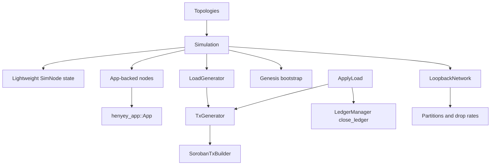

# henyey-simulation

Deterministic simulation and benchmarking harness for henyey nodes.

## Overview

`henyey-simulation` provides the test-only infrastructure used to model henyey networks, run app-backed multi-node scenarios, generate deterministic classic and Soroban transaction load, and benchmark raw ledger-apply throughput. It sits on top of `henyey-app`, `henyey-overlay`, `henyey-ledger`, and `henyey-tx`. The crate has no direct stellar-core source equivalent; it is henyey's native deterministic integration harness.

## Architecture



## Key Types

| Type | Description |
|------|-------------|
| `Simulation` | Main harness for node definitions, topology, transport, app lifecycle, and deterministic ledger progression |
| `SimulationMode` | Selects transport mode for app-backed nodes: `OverLoopback` or `OverTcp` |
| `SimNode` | Lightweight per-node state used by the non-`App` simulation path |
| `Topologies` | Factory for standard network graphs such as `core`, `cycle`, `separate`, and `hierarchical_quorum` |
| `LoopbackNetwork` | Deterministic connectivity model with partitions and per-link drop probabilities |
| `GeneratedLoadConfig` | Configuration for load generation, including account pool, rate, fees, spikes, and Soroban-specific knobs |
| `LoadGenMode` | Load mode selector for classic payments, Soroban setup/upload/invoke, and mixed traffic |
| `LoadGenerator` | Stateful rate-limited generator that manages account reuse, retries, and load submission |
| `TxGenerator` | Deterministic transaction builder for account creation, payments, SAC transfers, contract deploys, and invokes |
| `LoadResult` | Outcome of a load-generation run: completed, stopped, or failed |
| `SorobanTxBuilder` | Low-level builder for Soroban envelopes with footprints, resources, fees, and signatures |
| `ApplyLoad` | Direct-apply benchmark harness that bypasses consensus and closes ledgers through `LedgerManager` |
| `ApplyLoadConfig` | Resource-limit and benchmark configuration for `ApplyLoad` |
| `ApplyLoadMode` | Chooses between limit-based benchmarking and max-SAC-TPS search |
| `Histogram` | Minimal in-memory utilization histogram used by `ApplyLoad` |

## Usage

### Drive a lightweight topology to convergence

```rust
use henyey_simulation::{SimulationMode, Topologies};
use std::time::Duration;

let mut sim = Topologies::core3(SimulationMode::OverLoopback);

let converged = sim
    .crank_until(|s| s.have_all_externalized(5, 0), Duration::from_secs(5))
    .await;

assert!(converged);
```

### Start app-backed nodes and wait for peer connectivity

```rust
use henyey_simulation::{SimulationMode, Topologies};
use std::time::Duration;

let mut sim = Topologies::core3(SimulationMode::OverLoopback);
sim.populate_app_nodes_from_existing(67);
sim.start_all_nodes().await;

let connected = sim.wait_for_app_connectivity(2, Duration::from_secs(5)).await;
assert!(connected);

sim.stop_all_nodes().await?;
# Ok::<(), anyhow::Error>(())
```

### Inject faults or run a direct-apply benchmark

```rust
use henyey_simulation::{ApplyLoad, ApplyLoadConfig, ApplyLoadMode, SimulationMode, Topologies};

let mut sim = Topologies::core(4, SimulationMode::OverLoopback);
sim.partition("node3");
sim.set_drop_prob("node0", "node1", 0.5);

let mut harness = ApplyLoad::new(app, ApplyLoadConfig::default(), ApplyLoadMode::LimitBased)?;
harness.benchmark()?;

assert!(harness.success_rate() >= 0.0);
# Ok::<(), anyhow::Error>(())
```

## Module Layout

| Module | Description |
|--------|-------------|
| `lib.rs` | `Simulation`, topology builders, app-node lifecycle, transaction submission helpers, and genesis initialization |
| `loadgen.rs` | Deterministic load generation, account caching, payment generation, and Soroban workload orchestration |
| `loadgen_soroban.rs` | Soroban-specific envelope construction and shared signing/contract-key helpers |
| `applyload.rs` | Direct-apply benchmarking, config upgrades, synthetic bucket-list setup, and utilization tracking |
| `loopback.rs` | Lightweight topology state for links, partitions, and packet-drop behavior |

## Design Notes

- The crate has two simulation layers: a fast lightweight `SimNode` model for deterministic topology tests, and an app-backed mode that starts real `henyey_app::App` instances.
- App-backed nodes bootstrap their own standalone SQLite state with `initialize_genesis_ledger()`, so tests do not depend on external history archives.
- `LoadGenerator` mirrors stellar-core's account-pool behavior, including rate-based submission, `txBAD_SEQ` retries, and explicit checks that Soroban state remains present in ledger storage.
- `ApplyLoad` bypasses consensus entirely and closes ledgers directly, which isolates transaction-application cost from SCP and overlay effects.
- Soroban config upgrades in `ApplyLoad` are applied by injecting synthetic config-upgrade state and using `LedgerUpgrade::Config`, rather than deploying stellar-core's upgrade contract.

## stellar-core Mapping

This crate has no direct stellar-core source equivalent. It is a native henyey
integration and benchmarking harness, with APIs shaped around henyey's async
runtime, overlay factories, app lifecycle, and ledger managers.

## Parity Status

See [PARITY_STATUS.md](PARITY_STATUS.md) for detailed stellar-core parity analysis.
