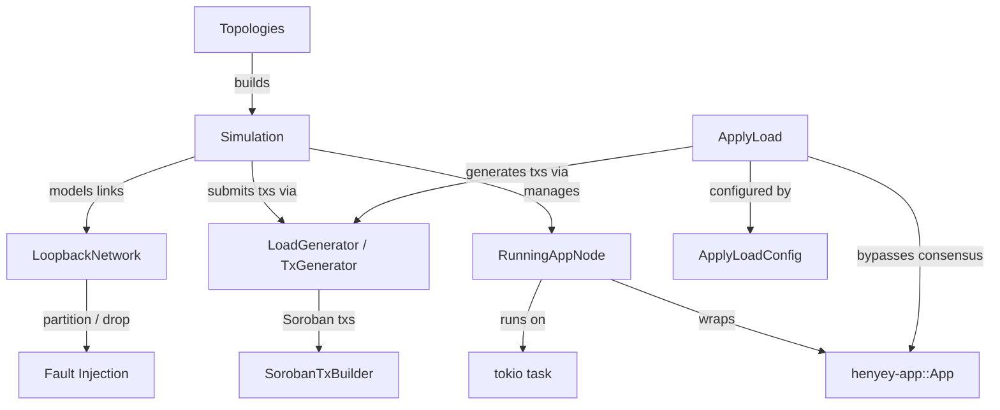

# henyey-simulation

Deterministic multi-node simulation harness for testing consensus, overlay,
and ledger-close behavior across configurable network topologies.

## Overview

`henyey-simulation` provides a lightweight simulation environment that can spin
up multiple henyey `App` nodes (over TCP or in-memory loopback transport) and
drive them through ledger close cycles, fault injection, and load generation.
It also includes a direct-apply benchmarking harness (`ApplyLoad`) for measuring
raw transaction application performance without consensus overhead. The crate
corresponds to stellar-core's `src/simulation/` directory and is used
exclusively for integration testing and benchmarking — it has no role in
production.

## Architecture



## Key Types

| Type | Description |
|------|-------------|
| `Simulation` | Main harness: manages nodes, topology, connections, and ledger progression |
| `SimulationMode` | Selects transport: `OverLoopback` (in-memory) or `OverTcp` |
| `SimNode` | Lightweight simulated node state (id, key, ledger sequence/hash) |
| `Topologies` | Factory methods for standard network topologies (core, pair, cycle, etc.) |
| `LoopbackNetwork` | Deterministic link model with partition and drop-probability controls |
| `LoadGenerator` | Stateful load generator with account pool, rate limiter, and retry logic |
| `TxGenerator` | Transaction generator with account cache, fee generation, and payment/Soroban tx builders |
| `LoadGenMode` | Load generation mode: `Pay`, `SorobanUpload`, `SorobanInvokeSetup`, `SorobanInvoke`, `MixedClassicSoroban` |
| `GeneratedLoadConfig` | Configuration for load generation (mode, accounts, rate, fee, Soroban params) |
| `TestAccount` | Cached account with deterministic keypair and mutable sequence number |
| `LoadResult` | Result of a load generation run (`Done`, `Stopped`, `Failed`) |
| `ContractInstance` | Deployed Soroban contract metadata (keys, contract ID, size) for load generation |
| `SorobanTxBuilder` | Fluent builder for Soroban `TransactionEnvelope`s (upload, create, invoke) |
| `ApplyLoad` | Direct-apply benchmarking harness — bypasses consensus for raw performance measurement |
| `ApplyLoadConfig` | Configuration for `ApplyLoad` (ledger limits, bucket list setup, TPS search params) |
| `ApplyLoadMode` | Benchmark mode: `LimitBased` (fill ledger limits) or `MaxSacTps` (binary-search max throughput) |
| `Histogram` | Simple histogram for recording utilization statistics during benchmarks |

## Usage

### Create a 3-node simulation and advance ledgers

```rust
use henyey_simulation::{SimulationMode, Topologies};
use std::time::Duration;

let mut sim = Topologies::core3(SimulationMode::OverLoopback);
sim.start_all_nodes().await;

let converged = sim
    .crank_until(|s| s.have_all_externalized(11, 2), Duration::from_secs(30))
    .await;
assert!(converged);
```

### Fault injection

```rust
let mut sim = Topologies::core(7, SimulationMode::OverLoopback);
sim.start_all_nodes().await;

// Partition a node
sim.partition("node6");

// Set probabilistic message drops
sim.set_drop_prob("node0", "node1", 0.5);

// Heal
sim.heal_partition("node6");
sim.set_drop_prob("node0", "node1", 0.0);
```

### Run a direct-apply benchmark

```rust
use henyey_simulation::{ApplyLoad, ApplyLoadConfig, ApplyLoadMode};

let config = ApplyLoadConfig {
    num_ledgers: 20,
    ..ApplyLoadConfig::default()
};
let mut harness = ApplyLoad::new(app, config);
harness.setup_accounts_and_deploy().await?;
harness.run(ApplyLoadMode::LimitBased).await?;
```

## Module Layout

| Module | Description |
|--------|-------------|
| `lib.rs` | `Simulation`, `SimNode`, `SimulationMode`, `Topologies`, genesis bootstrapping |
| `loopback.rs` | `LoopbackNetwork` — deterministic link graph with partition/drop controls |
| `loadgen.rs` | `LoadGenerator`, `TxGenerator`, `GeneratedLoadConfig`, `ContractInstance`, load plan types |
| `loadgen_soroban.rs` | `SorobanTxBuilder` — Soroban transaction building (upload WASM, create contract, invoke) |
| `applyload.rs` | `ApplyLoad`, `ApplyLoadConfig`, `ApplyLoadMode`, `Histogram` — direct-apply benchmark harness |

## Design Notes

- **Two simulation layers**: Lightweight `SimNode`-based simulation uses
  `crank_all_nodes()` for fast deterministic ledger-sequence progression
  without real App instances. App-backed simulation starts actual `App` nodes
  with full consensus and overlay, driven via `manual_close_all_app_nodes()`.
- **Determinism**: Repeated runs with the same topology and fault schedule
  produce identical ledger hashes — verified by dedicated replay tests.
- **Genesis bootstrapping**: `initialize_genesis_ledger()` sets up a self-
  contained genesis ledger with a root account in each node's SQLite database,
  enabling app-backed nodes to start without external history archives.
- **Load generation**: Two APIs are provided: (1) a simple stateless
  `step_plan()` for manual-close tests, and (2) a rich stateful
  `generate_load()` matching stellar-core's LoadGenerator with cumulative
  rate limiting, account pool management (available/in-use), `txBAD_SEQ`
  retry logic, and sequence number refresh from the bucket list.
- **ApplyLoad bypass**: The `ApplyLoad` harness closes ledgers directly
  through `LedgerManager`, bypassing consensus and overlay entirely. This
  isolates transaction-application performance from network and agreement
  overhead.

## stellar-core Mapping

| Rust | stellar-core |
|------|--------------|
| `lib.rs` (`Simulation`) | `src/simulation/Simulation.h` / `Simulation.cpp` |
| `lib.rs` (`Topologies`) | `src/simulation/Topologies.h` / `Topologies.cpp` |
| `loadgen.rs` (`LoadGenerator`) | `src/simulation/LoadGenerator.h` / `LoadGenerator.cpp` |
| `loadgen.rs` (`TxGenerator`) | `src/simulation/TxGenerator.h` / `TxGenerator.cpp` |
| `loadgen_soroban.rs` (`SorobanTxBuilder`) | Soroban helpers in `TxGenerator.cpp` |
| `applyload.rs` (`ApplyLoad`) | `src/simulation/ApplyLoad.h` / `ApplyLoad.cpp` |
| — | `src/simulation/CoreTests.cpp` (upstream test file, not ported) |

## Parity Status

See [PARITY_STATUS.md](PARITY_STATUS.md) for detailed stellar-core parity analysis.
