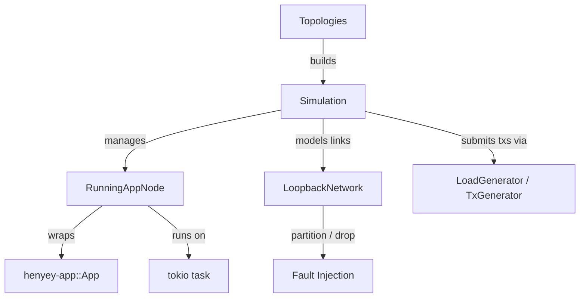

# henyey-simulation

Deterministic multi-node simulation harness for testing consensus, overlay,
and ledger-close behavior across configurable network topologies.

## Overview

`henyey-simulation` provides a lightweight simulation environment that can spin
up multiple henyey `App` nodes (over TCP or in-memory loopback transport) and
drive them through ledger close cycles, fault injection, and load generation.
It corresponds to stellar-core's `src/simulation/` directory and is used
exclusively for integration testing — it has no role in production.

## Architecture



## Key Types

| Type | Description |
|------|-------------|
| `Simulation` | Main harness: manages nodes, topology, connections, and ledger progression |
| `SimulationMode` | Selects transport: `OverLoopback` (in-memory) or `OverTcp` |
| `SimNode` | Lightweight simulated node state (id, key, ledger sequence/hash) |
| `Topologies` | Factory methods for standard network topologies (core, pair, cycle, etc.) |
| `LoopbackNetwork` | Deterministic link model with partition and drop-probability controls |
| `LoadGenerator` | Produces deterministic multi-step load plans from a `GeneratedLoadConfig` |
| `TxGenerator` | Generates individual payment transaction series |
| `GeneratedLoadConfig` | Configuration for load generation (accounts, rate, steps) |
| `GeneratedTransaction` | A single generated transaction descriptor |
| `LoadStep` | One step of a load plan containing a batch of transactions |
| `LoadReport` | Summary statistics for a load plan |

## Usage

### Create a 3-node simulation and advance ledgers

```rust
use henyey_simulation::{SimulationMode, Topologies};
use std::time::Duration;

let mut sim = Topologies::core3(SimulationMode::OverLoopback);
sim.start_all_nodes().await;

let converged = sim
    .crank_until(|s| s.have_all_externalized(11, 2), Duration::from_secs(30))
    .await;
assert!(converged);
```

### App-backed simulation with manual ledger close

```rust
use henyey_simulation::{Simulation, SimulationMode, Topologies};

let mut sim = Topologies::core3(SimulationMode::OverTcp);
sim.populate_app_nodes_from_existing(67);
sim.start_all_nodes().await;
sim.stabilize_app_tcp_connectivity(1, Duration::from_secs(20)).await?;

let _ = sim.manual_close_all_app_nodes().await?;
sim.stop_all_nodes().await?;
```

### Fault injection

```rust
let mut sim = Topologies::core(7, SimulationMode::OverLoopback);
sim.start_all_nodes().await;

// Partition a node
sim.partition("node6");

// Set probabilistic message drops
sim.set_drop_prob("node0", "node1", 0.5);

// Heal
sim.heal_partition("node6");
sim.set_drop_prob("node0", "node1", 0.0);
```

## Module Layout

| Module | Description |
|--------|-------------|
| `lib.rs` | `Simulation`, `SimNode`, `SimulationMode`, `Topologies`, genesis bootstrapping |
| `loopback.rs` | `LoopbackNetwork` — deterministic link graph with partition/drop controls |
| `loadgen.rs` | `LoadGenerator`, `TxGenerator`, `GeneratedLoadConfig`, load plan types |

## Design Notes

- **Two simulation layers**: Lightweight `SimNode`-based simulation uses
  `crank_all_nodes()` for fast deterministic ledger-sequence progression
  without real App instances. App-backed simulation starts actual `App` nodes
  with full consensus and overlay, driven via `manual_close_all_app_nodes()`.
- **Determinism**: Repeated runs with the same topology and fault schedule
  produce identical ledger hashes — verified by dedicated replay tests.
- **Genesis bootstrapping**: `initialize_genesis_ledger()` sets up a self-
  contained genesis ledger with a root account in each node's SQLite database,
  enabling app-backed nodes to start without external history archives.

## stellar-core Mapping

| Rust | stellar-core |
|------|--------------|
| `lib.rs` (`Simulation`) | `src/simulation/Simulation.h` / `Simulation.cpp` |
| `lib.rs` (`Topologies`) | `src/simulation/Topologies.h` / `Topologies.cpp` |
| `loadgen.rs` (`LoadGenerator`) | `src/simulation/LoadGenerator.h` / `LoadGenerator.cpp` |
| `loadgen.rs` (`TxGenerator`) | `src/simulation/TxGenerator.h` / `TxGenerator.cpp` |
| — | `src/simulation/ApplyLoad.h` / `ApplyLoad.cpp` (not implemented) |
| — | `src/simulation/CoreTests.cpp` (upstream test file) |

## Parity Status

See [PARITY_STATUS.md](PARITY_STATUS.md) for detailed stellar-core parity analysis.

## Run Tests

```bash
cargo test -p henyey-simulation --tests
```
