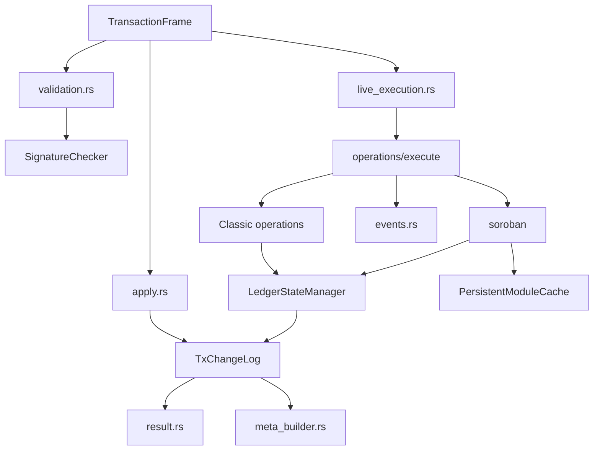

# henyey-tx

Transaction validation, execution, and replay for henyey.

## Overview

`henyey-tx` is the transaction-processing crate for the workspace. It turns XDR transaction envelopes into validation outcomes, live ledger mutations, replay deltas, transaction results, and Soroban execution side effects. It is the closest Rust counterpart to stellar-core's `src/transactions/` code, with additional support for archive-driven catchup in `apply.rs` and an in-memory state layer that mirrors nested `LedgerTxn` semantics.

The crate has two first-class execution paths. Live execution validates signatures, fees, sequence numbers, and operation rules against the current ledger state. Historical replay trusts archived `TransactionResult` and `TransactionMeta` data, then rebuilds the same ordered ledger changes without re-executing the original transaction.

## Architecture



## Key Types

| Type | Description |
|------|-------------|
| `TransactionFrame` | Unified wrapper for V0, V1, and fee-bump envelopes, with hash, fee, precondition, and resource helpers. |
| `TransactionValidator` | High-level convenience API for basic or account-aware validation. |
| `LedgerContext` | Ledger-level inputs used during validation and execution, including network ID and protocol version. |
| `LiveExecutionContext` | Mutable live-apply context containing ledger state and fee-pool accounting. |
| `LedgerStateManager` | In-memory execution state with per-operation savepoints and delta tracking. |
| `TxChangeLog` | Ordered create, update, and delete log used for replay, persistence, and meta reconstruction. |
| `FeeBumpFrame` | Fee-bump-specific helpers for inner transaction validation and result wrapping. |
| `MutableTransactionResult` | Mutable apply-phase transaction result with Soroban fee/refund tracking. |
| `TxApplyResult` | Finalized per-transaction outcome with success flag, fee charged, and wrapped XDR result. |
| `SignatureChecker` | Signer-weight checker that mirrors stellar-core signature rules. |
| `OfferStore` | Canonical in-memory offer store plus indexes and offer metadata. |
| `OfferIndex` | Deterministic best-offer index used by offer crossing and path payment logic. |
| `SorobanContext<'a>` | Optional Soroban execution bundle threaded through operation execution. |
| `PersistentModuleCache` | Protocol-versioned WASM module cache for Soroban host execution. |
| `SorobanExecutionResult` | Return value, storage changes, events, and resource usage from host execution. |

## Usage

Validate an envelope against ledger context:

```rust
use henyey_tx::{TransactionValidator, ValidationResult};
use stellar_xdr::curr::TransactionEnvelope;

let envelope: TransactionEnvelope = todo!();
let validator = TransactionValidator::testnet(10_000, 1_700_000_000);

match validator.validate(&envelope) {
    ValidationResult::Valid => {}
    ValidationResult::InsufficientFee => {}
    other => panic!("unexpected validation result: {other:?}"),
}
```

Set up live execution state for transaction application phases:

```rust
use henyey_common::NetworkId;
use henyey_tx::{LedgerContext, LedgerStateManager, LiveExecutionContext};

let ledger = LedgerContext::new(
    10_000,
    1_700_000_000,
    100,
    5_000_000,
    25,
    NetworkId::testnet(),
);
let state = LedgerStateManager::new(5_000_000, 10_000);
let mut ctx = LiveExecutionContext::new(ledger, state);

assert_eq!(ctx.protocol_version(), 25);
assert_eq!(ctx.fee_pool_delta(), 0);
```

Replay a historical transaction into a `TxChangeLog`:

```rust
use henyey_tx::{apply_from_history, TxChangeLog, TransactionFrame};
use stellar_xdr::curr::{TransactionEnvelope, TransactionMeta, TransactionResult};

let envelope: TransactionEnvelope = todo!();
let result: TransactionResult = todo!();
let meta: TransactionMeta = todo!();

let frame = TransactionFrame::from_owned(envelope);
let mut delta = TxChangeLog::new(10_000);
apply_from_history(&frame, &result, &meta, &mut delta)?;

assert_eq!(delta.ledger_seq(), 10_000);
assert!(delta.fee_charged() >= 0);
# Ok::<(), henyey_tx::TxError>(())
```

## Module Layout

| Module | Description |
|--------|-------------|
| `lib.rs` | Public API surface, convenience wrapper types, and re-exports. |
| `frame.rs` | `TransactionFrame` envelope wrapper and common transaction accessors. |
| `validation.rs` | `LedgerContext` plus structure, fee, sequence, bounds, and signature validation. |
| `live_execution.rs` | Fee/sequence processing, post-apply steps, refunds, and live-apply context. |
| `apply.rs` | Historical replay helpers and `TxChangeLog` change recording. |
| `result.rs` | Mutable/final transaction result wrappers and refundable Soroban fee tracking. |
| `error.rs` | Crate-level `TxError` definitions. |
| `fee_bump.rs` | Fee-bump helpers, validation, and result wrapping. |
| `signature_checker.rs` | Multi-signer verification and signer collection. |
| `events.rs` | Classic and SAC event construction helpers. |
| `lumen_reconciler.rs` | XLM event reconciliation for mint/burn/transfer edge cases. |
| `meta_builder.rs` | Transaction metadata builders and diagnostic event plumbing; current finalize path emits V4 metadata. |
| `scval_utils.rs` | `ScVal` conversion helpers used by event code. |
| `operations/mod.rs` | Operation-level validation helpers, thresholds, and prefetch key collection. |
| `operations/execute/mod.rs` | Execution dispatch and shared apply helpers. |
| `operations/execute/account_merge.rs` | Account merge execution. |
| `operations/execute/bump_sequence.rs` | Bump-sequence execution. |
| `operations/execute/change_trust.rs` | Change-trust execution. |
| `operations/execute/claimable_balance.rs` | Claimable-balance create/claim logic. |
| `operations/execute/clawback.rs` | Clawback and clawback-claimable-balance execution. |
| `operations/execute/create_account.rs` | Create-account execution. |
| `operations/execute/extend_footprint_ttl.rs` | Soroban TTL-extension execution. |
| `operations/execute/inflation.rs` | Deprecated inflation operation handling. |
| `operations/execute/invoke_host_function.rs` | Soroban host-function execution bridge. |
| `operations/execute/liquidity_pool.rs` | Liquidity-pool deposit and withdraw logic. |
| `operations/execute/manage_data.rs` | Manage-data execution. |
| `operations/execute/manage_offer.rs` | Manage-buy, manage-sell, and passive offer execution. |
| `operations/execute/offer_exchange.rs` | Offer-crossing and price-error-threshold math. |
| `operations/execute/offer_utils.rs` | Shared DEX helpers for offers and liabilities. |
| `operations/execute/path_payment.rs` | Strict-send/strict-receive path payment execution. |
| `operations/execute/prefetch.rs` | Soroban and operation prefetch key collection. |
| `operations/execute/restore_footprint.rs` | Soroban archive restore execution. |
| `operations/execute/set_options.rs` | Set-options execution and signer/sponsorship rules. |
| `operations/execute/sponsorship.rs` | Begin/end/revoke sponsorship execution. |
| `operations/execute/trust_flags.rs` | Allow-trust and trustline-flag execution. |
| `state/mod.rs` | `LedgerStateManager`, savepoints, sponsorship context, and state orchestration. |
| `state/entries.rs` | Per-entry-type CRUD helpers layered on the state manager. |
| `state/entry_store.rs` | Generic tracked store used for several ledger entry classes. |
| `state/offer_index.rs` | Deterministic offer ordering and best-offer lookups. |
| `state/offer_store.rs` | Canonical offer storage shared with indexes and metadata. |
| `state/sponsorship.rs` | Sponsorship bookkeeping helpers. |
| `state/ttl.rs` | TTL loading, update, and deferred bump handling. |
| `soroban/mod.rs` | Soroban public API, shared context types, and protocol dispatch exports. |
| `soroban/budget.rs` | Soroban resource limits, fee configuration, and budget tracking. |
| `soroban/error.rs` | Host error conversion and protocol-aware error mapping. |
| `soroban/host.rs` | Host invocation, module caching, storage changes, and execution results. |
| `soroban/storage.rs` | Contract storage snapshot and mutation adapter. |
| `soroban/protocol/mod.rs` | Protocol-version dispatch for Soroban host behavior. |
| `soroban/protocol/p24.rs` | Protocol 24 Soroban host integration. |
| `soroban/protocol/p25.rs` | Protocol 25+ Soroban host integration. |
| `soroban/protocol/types.rs` | Shared protocol-facing Soroban types. |
| `test_utils.rs` | Test-only helpers used by crate unit tests. |

## Design Notes

`LedgerStateManager` is intentionally savepoint-based instead of exposing direct mutable access to all entry maps. Each operation can snapshot the current state with `create_savepoint()` and roll back with `rollback_to_savepoint()` if the operation fails, matching stellar-core's nested `LedgerTxn` behavior.

`TxChangeLog` records changes in execution order, not just by entry class. That ordering is needed both for bucket-list persistence and for reconstructing transaction metadata with the same before/after semantics as upstream.

Soroban execution is protocol-versioned. `soroban-env-host-p24` is used for protocol 24, while `soroban-env-host-p25` is used for protocol 25 and later. `PersistentModuleCache` lets the crate reuse compiled WASM modules without charging compilation work to transaction CPU budgets.

`OfferStore` centralizes offer entries, indexes, and metadata so live execution and adjacent crates can share one canonical in-memory offer view instead of duplicating large offer structures.

## stellar-core Mapping

| Rust | stellar-core |
|------|--------------|
| `frame.rs` | `src/transactions/TransactionFrame.cpp` |
| `validation.rs` | `src/transactions/TransactionFrame.cpp`, `src/transactions/TransactionUtils.cpp` |
| `live_execution.rs` | `src/transactions/TransactionFrame.cpp` |
| `fee_bump.rs` | `src/transactions/FeeBumpTransactionFrame.cpp` |
| `signature_checker.rs` | `src/transactions/SignatureChecker.cpp` |
| `result.rs` | `src/transactions/MutableTransactionResult.cpp` |
| `meta_builder.rs` | `src/transactions/TransactionMeta.cpp`, `src/transactions/TransactionMeta.h` |
| `events.rs` | `src/transactions/EventManager.cpp` |
| `lumen_reconciler.rs` | `src/transactions/LumenEventReconciler.cpp` |
| `operations/mod.rs` | `src/transactions/OperationFrame.cpp` |
| `operations/execute/*.rs` | `src/transactions/*OpFrame.cpp`, `src/transactions/OfferExchange.cpp` |
| `state/mod.rs` | `src/ledger/LedgerTxn.cpp`, `src/ledger/LedgerTxn.h` |
| `state/offer_index.rs` | `src/ledger/LedgerTxn.cpp` order-book logic |
| `apply.rs` | `src/ledger/LedgerTxn.cpp` change application concepts plus archived-meta replay glue with no single direct upstream file |
| `soroban/host.rs` | `src/transactions/InvokeHostFunctionOpFrame.cpp` |
| `soroban/storage.rs` | `src/transactions/InvokeHostFunctionOpFrame.cpp`, `src/ledger/LedgerTxn.cpp` |

## Parity Status

See [PARITY_STATUS.md](PARITY_STATUS.md) for detailed stellar-core parity analysis. The current parity report marks `henyey-tx` at 97% overall parity.
