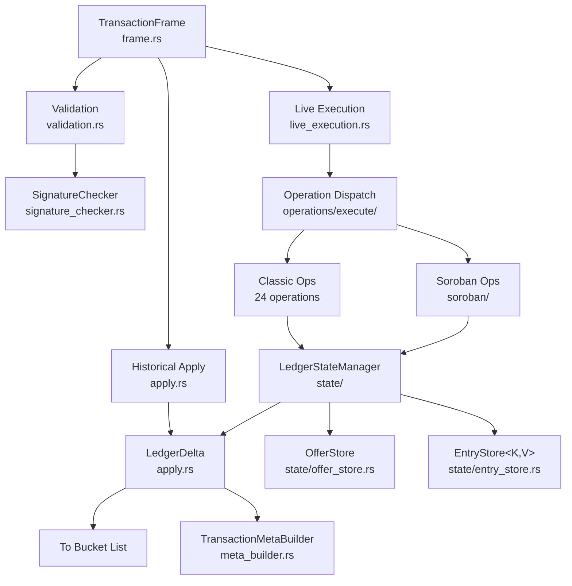

# henyey-tx

Transaction validation and execution for henyey.

## Overview

This crate provides the core transaction processing logic for the Stellar network, supporting both classic Stellar operations and Soroban smart contract execution. It is the heart of ledger state changes in henyey, corresponding to stellar-core's `src/transactions/` directory.

### Operating Modes

The crate supports two first-class modes of operation:

1. **Live Execution Mode**: Validates and executes transactions in real-time, producing deterministic results that match stellar-core. This is the mode used by validators to close ledgers and enables full participation in the Stellar network consensus.

2. **Catchup/Replay Mode**: Applies historical transactions from archives by trusting the recorded results and replaying state changes. This enables fast synchronization with the network without re-executing every transaction.

### Why Two Modes?

Re-executing historical transactions is problematic for several reasons:

- **Protocol Evolution**: Older transactions may have been validated under different rules. Re-execution with current code could reject valid historical transactions or produce different results.

- **State Dependencies**: Full execution requires the exact ledger state at the time of original execution, which may not be available during initial catchup.

- **Soroban Determinism**: Smart contract execution depends on PRNG seeds, network configuration, and host function semantics that must match exactly.

- **Performance**: Replaying metadata is significantly faster than re-executing complex operations like path payments or contract calls.

## Architecture



## Key Types

| Type | Description |
|------|-------------|
| `TransactionFrame` | Wrapper around XDR `TransactionEnvelope` with unified API for V0/V1/FeeBump |
| `TransactionValidator` | High-level validator for transaction envelopes |
| `LiveExecutionContext` | Context for live transaction execution (fee pool, state, protocol config) |
| `LedgerDelta` | Accumulates creates/updates/deletes during execution for persistence |
| `LedgerStateManager` | In-memory ledger state with savepoint-based rollback |
| `LedgerContext` | Ledger-level context (sequence, close time, base fee, network ID) |
| `OfferStore` | Unified offer store with canonical data, indexes, and metadata |
| `EntryStore<K,V>` | Generic store with snapshot/rollback for 5 entry types |
| `OfferIndex` | BTreeMap-based orderbook for O(log n) best-offer lookups |
| `FeeBumpFrame` | Fee bump transaction wrapper and validation |
| `SorobanContext` | Bundle of optional Soroban parameters threaded through execution |
| `SorobanConfig` | Network configuration for Soroban (cost params, TTL limits, fees) |
| `PersistentModuleCache` | Per-ledger compiled WASM cache (P24/P25 protocol-versioned) |
| `MutableTransactionResult` | Mutable result tracking during apply phase |
| `TxApplyResult` | Complete result of applying a transaction |
| `ValidationError` | Structured validation failure information |

## Usage

### Live Execution Mode

Live execution mode is used by validators to process transactions and close ledgers:

```rust
use henyey_tx::{
    TransactionFrame, LiveExecutionContext, LedgerContext, LedgerStateManager,
    process_fee_seq_num, process_post_apply, process_post_tx_set_apply,
};

// Set up execution context with ledger state
let ledger_ctx = LedgerContext::new(
    ledger_seq, close_time, base_fee, base_reserve, protocol_version, network_id,
);
let state = LedgerStateManager::new(base_reserve, ledger_seq);
let mut ctx = LiveExecutionContext::new(ledger_ctx, state);

// Phase 1: Process fees and sequence numbers for all transactions
let mut results = Vec::new();
for frame in &transaction_set {
    let fee_result = process_fee_seq_num(frame, &mut ctx, None)?;
    results.push((frame, fee_result));
}

// Phase 2: Apply operations for each transaction
for (frame, fee_result) in &mut results {
    if !fee_result.should_apply {
        continue;
    }
    // ... apply_operations(frame, &mut ctx, &mut fee_result.tx_result)?;

    // Phase 3: Post-apply processing (pre-P23 Soroban refunds)
    process_post_apply(frame, &mut ctx, &mut fee_result.tx_result, None)?;
}

// Phase 4: Transaction set post-apply (P23+ Soroban refunds)
for (frame, fee_result) in &mut results {
    process_post_tx_set_apply(frame, &mut ctx, &mut fee_result.tx_result, None)?;
}
```

### Catchup/Replay Mode

```rust
use henyey_tx::{TransactionFrame, apply_from_history, LedgerDelta};
use stellar_xdr::curr::{TransactionEnvelope, TransactionResult, TransactionMeta};

let frame = TransactionFrame::from_owned(envelope);

// Apply historical transaction to accumulate state changes
let mut delta = LedgerDelta::new(ledger_seq);
let apply_result = apply_from_history(&frame, &result, &meta, &mut delta)?;

// Delta now contains all state changes in execution order
for entry in delta.created_entries() { /* persist */ }
for entry in delta.updated_entries() { /* persist */ }
for key in delta.deleted_keys() { /* remove */ }
```

### Transaction Validation

```rust
use henyey_tx::{TransactionValidator, ValidationResult};

let validator = TransactionValidator::testnet(ledger_seq, close_time);

match validator.validate(&envelope) {
    ValidationResult::Valid => println!("Transaction is valid"),
    ValidationResult::InsufficientFee => println!("Fee too low"),
    ValidationResult::TooLate => println!("Transaction expired"),
    other => println!("Validation failed: {:?}", other),
}

// Full validation with account data
let result = validator.validate_with_account(&envelope, &source_account);
```

## Module Layout

| Module | Description |
|--------|-------------|
| `lib.rs` | Public API, re-exports, `TransactionValidator`, `ValidationResult` |
| `frame.rs` | `TransactionFrame` -- envelope wrapper with unified V0/V1/FeeBump API |
| `apply.rs` | `LedgerDelta`, `ChangeRef`, historical transaction application (catchup mode) |
| `live_execution.rs` | Live execution functions: `process_fee_seq_num`, `process_post_apply`, etc. |
| `validation.rs` | `LedgerContext`, `ValidationError`, structure/signature/bounds validation |
| `result.rs` | `MutableTransactionResult`, `TxApplyResult`, `RefundableFeeTracker` |
| `error.rs` | `TxError` and error types |
| `events.rs` | Classic SAC event emission (`TxEventManager`, `OpEventManager`) |
| `lumen_reconciler.rs` | XLM balance reconciliation for fee/transfer events |
| `meta_builder.rs` | `TransactionMetaBuilder` for V2/V3/V4 transaction metadata |
| `fee_bump.rs` | `FeeBumpFrame`, fee bump validation and result wrapping |
| `scval_utils.rs` | Soroban `ScVal` conversion utilities for event construction |
| `signature_checker.rs` | `SignatureChecker` with multi-sig threshold verification |
| `test_utils.rs` | Test helper functions (test-only) |
| `state/mod.rs` | `LedgerStateManager`, `Savepoint`, rollback logic |
| `state/entries.rs` | Per-type CRUD methods (load/create/update/delete) |
| `state/entry_store.rs` | Generic `EntryStore<K,V>` with snapshot/rollback lifecycle |
| `state/offer_index.rs` | `OfferIndex` -- BTreeMap-based orderbook for best-offer lookups |
| `state/offer_store.rs` | `OfferStore` -- unified offer data + indexes + metadata (shared via `Arc<Mutex>`) |
| `state/sponsorship.rs` | Sponsorship stack management |
| `state/ttl.rs` | TTL entry management and deferred read-only bumps |
| `operations/mod.rs` | Operation types, validation dispatch, threshold levels |
| `operations/execute/mod.rs` | Operation execution dispatch and shared helpers |
| `operations/execute/offer_exchange.rs` | Offer exchange math (`exchange_v10`, price error thresholds) |
| `operations/execute/offer_utils.rs` | Shared DEX offer helpers (cross offer, liabilities, deletion) |
| `operations/execute/prefetch.rs` | Prefetch key collection for per-ledger batch loading |
| `operations/execute/*.rs` | Per-operation implementations (24 classic + 3 Soroban) |
| `soroban/mod.rs` | `SorobanContext`, `HotArchiveLookup`, `TtlKeyCache`, key hashing |
| `soroban/host.rs` | `execute_host_function_with_cache`, `PersistentModuleCache` |
| `soroban/budget.rs` | `SorobanBudget`, `SorobanConfig`, `FeeConfiguration` |
| `soroban/storage.rs` | `SorobanStorage` -- contract storage interface |
| `soroban/error.rs` | Protocol-versioned error code conversion |
| `soroban/protocol/mod.rs` | Protocol version dispatch |
| `soroban/protocol/p24.rs` | P24 host implementation (soroban-env-host-p24) |
| `soroban/protocol/p25.rs` | P25 host implementation (soroban-env-host-p25) |
| `soroban/protocol/types.rs` | Shared types (`LiveBucketListRestore`) |

## Design Notes

### Savepoint Architecture

The crate provides a `Savepoint` mechanism for lightweight, granular rollback of
state changes. This is the Rust equivalent of stellar-core's nested `LedgerTxn`
commit/rollback pattern.

```
                     Savepoint / Rollback Flow

  +-----------------------+
  | LedgerStateManager    |
  |                       |       create_savepoint()
  |  accounts (manual)    | ────────────────────────────> +------------------+
  |  trustlines (manual)  |                               |    Savepoint     |
  |  offers (OfferStore)  |                               |                  |
  |  ttl_entries (manual) |       rollback_to_savepoint() | - snapshot maps  |
  |  data (EntryStore)    | <──────────────────────────── | - pre-values     |
  |  contract_data (ES)   |                               | - created sets   |
  |  contract_code (ES)   |         (on failure)          | - delta lengths  |
  |  claimable_bal (ES)   |                               | - modified lens  |
  |  liquidity_pool (ES)  |                               | - metadata state |
  |  ...                  |                               | - id_pool        |
  +-----------+-----------+                               +------------------+
              |                                    EntryStore types delegate to
              | flush_modified_entries()            EntryStoreSavepoint internally
              v
  +-----------------------+
  |     LedgerDelta       |  (output change log)
  |                       |
  |  - created entries    |  Savepoint rollback truncates
  |  - updated entries    |  delta vectors via O(1)
  |  - deleted entries    |  DeltaSnapshot (length-only).
  |  - restored entries   |
  +-----------------------+
              |
              v
       To Bucket List /
       Transaction Meta
```

Key concepts:

- **Savepoint**: Captures current values of all entry types. Four complex types
  (accounts, trustlines, offers, TTL) use manual snapshot maps; five types (data,
  contract_data, contract_code, claimable_balances, liquidity_pools) delegate to
  `EntryStoreSavepoint`. Also captures delta vector lengths via `DeltaSnapshot`,
  metadata tracking, created entry sets, and the id_pool.

- **Per-operation rollback**: Each operation gets a savepoint before execution.
  On failure, `rollback_to_savepoint()` undoes all state changes. This matches
  stellar-core's nested `LedgerTxn` where each operation runs in a child
  transaction.

- **Speculative orderbook exchange**: Path payment operations use savepoints when
  comparing orderbook vs. liquidity pool routes. The orderbook path executes
  speculatively; if the pool provides a better rate, the savepoint rolls back
  the speculative changes.

- **Three-phase rollback**: (1) Restore entries first touched after savepoint,
  (2) restore entries already in snapshot map to pre-savepoint values,
  (3) restore all tracking state. `EntryStore` types handle all three phases
  internally. The `deleted` set (Soroban cross-TX deletion tracking) is
  intentionally not rolled back.

### OfferStore

The `OfferStore` (`state/offer_store.rs`) is a unified offer store shared between
`LedgerManager` (in `henyey-ledger`) and `LedgerStateManager` via `Arc<Mutex<>>`.
Each offer is stored as an `OfferRecord` that bundles the entry, last-modified
ledger, and sponsorship metadata inline, eliminating the ~1 GB duplication that
previously existed between the ledger manager's offer data and the executor's
in-memory state.

### Protocol Versioning for Soroban

The crate uses two vendored copies of `soroban-env-host` (under `vendor/soroban-env-p24/`
and `vendor/soroban-env-p25/`) to ensure deterministic replay across protocol versions.
Both paths use the **typed invoke API** which passes `Rc<LedgerEntry>` directly. For P25,
this is zero-copy (same XDR crate as workspace). For P24, type bridge functions convert
between P25 workspace types and P24 host types.

## stellar-core Mapping

| Rust | stellar-core |
|------|--------------|
| `frame.rs` | `src/transactions/TransactionFrame.cpp` |
| `live_execution.rs` | `src/transactions/TransactionFrame.cpp` (processFeeSeqNum, etc.) |
| `validation.rs` | `src/transactions/TransactionUtils.cpp` |
| `apply.rs` | `src/ledger/LedgerTxn.cpp` |
| `state/mod.rs` | `src/ledger/LedgerStateSnapshot.cpp`, `src/ledger/LedgerTxn.cpp` |
| `state/entries.rs` | `src/ledger/LedgerTxn.cpp` (per-type load/create/update/delete) |
| `state/offer_index.rs` | `src/ledger/LedgerTxn.cpp` (offer ordering by price/id) |
| `state/offer_store.rs` | `src/ledger/LedgerTxn.cpp` (offer storage) |
| `state/sponsorship.rs` | `src/ledger/LedgerTxn.cpp` (sponsorship tracking) |
| `state/ttl.rs` | `src/ledger/LedgerTxn.cpp` (TTL entry management) |
| `meta_builder.rs` | `src/transactions/TransactionMetaBuilder.cpp` |
| `fee_bump.rs` | `src/transactions/FeeBumpTransactionFrame.cpp` |
| `signature_checker.rs` | `src/transactions/SignatureChecker.cpp` |
| `events.rs` | `src/transactions/EventManager.cpp` |
| `lumen_reconciler.rs` | `src/transactions/LumenEventReconciler.cpp` |
| `operations/execute/offer_exchange.rs` | `src/transactions/OfferExchange.cpp` |
| `operations/execute/offer_utils.rs` | `src/transactions/OfferExchange.cpp` (helpers) |
| `operations/execute/*.rs` | `src/transactions/*OpFrame.cpp` |
| `soroban/` | `src/transactions/InvokeHostFunctionOpFrame.cpp` |

## Parity Status

See [PARITY_STATUS.md](PARITY_STATUS.md) for detailed stellar-core parity analysis.
