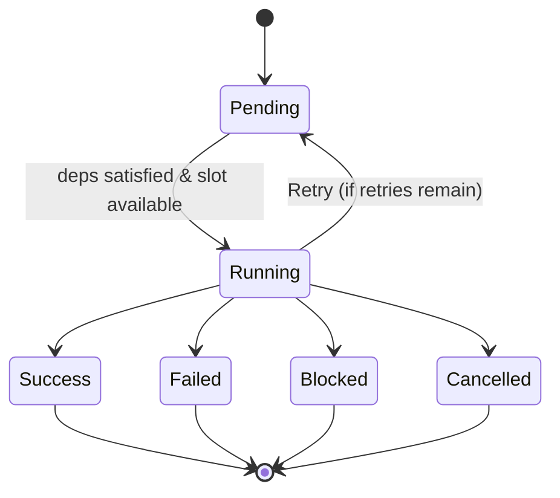

# henyey-work

Dependency-aware async work scheduler for henyey.

## Overview

This crate provides a DAG-based work scheduler modeled after the work scheduling
system in stellar-core (`src/work/`). It enables concurrent execution of async
tasks with explicit dependencies, automatic retry support, cooperative
cancellation, and event-based monitoring. The scheduler is used by higher-level
henyey crates (catchup, history) to orchestrate multi-step workflows like
download-verify-apply pipelines.

## Architecture



Each work item progresses through this state machine. The scheduler maintains
a ready queue of work items whose dependencies have all succeeded and spawns up
to `max_concurrency` Tokio tasks in parallel. When a task completes, its slot
becomes available for the next ready item.

## Key Types

| Type | Description |
|------|-------------|
| `Work` | Trait for schedulable async work items (`name()` + `run()`) |
| `WorkScheduler` | Core scheduler managing work execution with dependency ordering |
| `WorkSchedulerConfig` | Configuration: `max_concurrency`, `retry_delay`, `event_tx` |
| `WorkSequence` | Helper for building linear chains of dependent work |
| `WorkWithCallback` | Wrapper that invokes a callback after work completes |
| `WorkId` | Unique `u64` identifier for a work item within a scheduler |
| `WorkOutcome` | Result of a single execution attempt: `Success`, `Retry`, `Failed`, `Cancelled` |
| `WorkState` | Current lifecycle state: `Pending`, `Running`, `Success`, `Failed`, `Blocked`, `Cancelled` |
| `WorkContext` | Execution context with `id`, `attempt` number, and cancellation token |
| `WorkEvent` | State change notification emitted via the event channel |
| `WorkSchedulerMetrics` | Aggregate counts (total, pending, running, success, failed, blocked, cancelled) |
| `WorkSnapshot` | Point-in-time snapshot of a single work item's state and timing |

## Usage

### Basic scheduling with dependencies

```rust
use henyey_work::{WorkScheduler, WorkSchedulerConfig, WorkState};
use std::time::Duration;

let mut scheduler = WorkScheduler::new(WorkSchedulerConfig {
    max_concurrency: 4,
    retry_delay: Duration::from_secs(1),
    event_tx: None,
});

let id1 = scheduler.add_work(Box::new(download_work), vec![], 3);
let id2 = scheduler.add_work(Box::new(verify_work), vec![id1], 0);

scheduler.run_until_done().await;
assert_eq!(scheduler.state(id1), Some(WorkState::Success));
```

### Sequential pipeline with WorkSequence

```rust
use henyey_work::WorkSequence;

let mut pipeline = WorkSequence::new();
pipeline.push(&mut scheduler, Box::new(fetch_stage), 3);
pipeline.push(&mut scheduler, Box::new(parse_stage), 0);
pipeline.push(&mut scheduler, Box::new(apply_stage), 0);

scheduler.run_until_done().await;
```

### Cancellation with external token

```rust
use tokio_util::sync::CancellationToken;

let cancel = CancellationToken::new();
let cancel_clone = cancel.clone();

tokio::spawn(async move {
    tokio::time::sleep(Duration::from_secs(30)).await;
    cancel_clone.cancel();
});

scheduler.run_until_done_with_cancel(cancel).await;
```

## Module Layout

| Module | Description |
|--------|-------------|
| `lib.rs` | All public types, the `Work` trait, `WorkScheduler`, `WorkSequence`, `WorkWithCallback`, and internal helpers (`WorkEntry`, `EmptyWork`, `WorkCompletion`) |

## Design Notes

- **Ownership model**: Work items are moved into the scheduler. During execution
  they are temporarily swapped out with an `EmptyWork` placeholder to satisfy
  Rust's ownership rules, then restored after completion. This allows stateful
  work items to maintain state across retries without cloning.
- **Thread safety**: The scheduler is not thread-safe and should be driven from
  a single async task. Work items execute on Tokio's thread pool and must be
  `Send`.
- **Targeted enqueuing**: When a work item succeeds, only its direct dependents
  are checked for readiness rather than scanning all entries. This keeps the
  scheduler efficient as the number of work items grows.
- **No hierarchical work**: Unlike stellar-core's parent-child `Work` class
  hierarchy, henyey uses a flat DAG model with explicit dependency IDs. This is
  simpler and sufficient for the catchup/history workflows.

## stellar-core Mapping

| Rust | stellar-core |
|------|--------------|
| `lib.rs` (`Work` trait) | `src/work/BasicWork.h`, `src/work/BasicWork.cpp` |
| `lib.rs` (`WorkScheduler`) | `src/work/WorkScheduler.h`, `src/work/WorkScheduler.cpp` |
| `lib.rs` (`WorkSequence`) | `src/work/WorkSequence.h`, `src/work/WorkSequence.cpp` |
| `lib.rs` (`WorkWithCallback`) | `src/work/WorkWithCallback.h`, `src/work/WorkWithCallback.cpp` |
| Not implemented | `src/work/BatchWork.h` (parallel batch execution) |
| Not implemented | `src/work/ConditionalWork.h` (condition-gated execution) |
| Not implemented | `src/work/Work.h` (hierarchical parent-child work) |

## Parity Status

See [PARITY_STATUS.md](PARITY_STATUS.md) for detailed stellar-core parity analysis.
