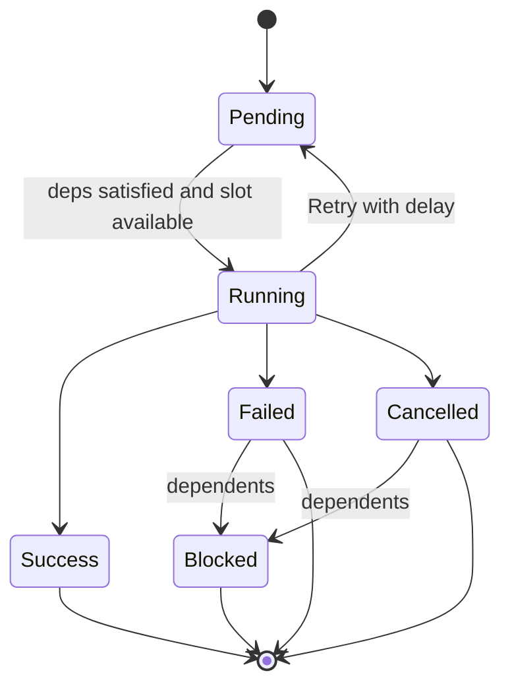

# henyey-work

Dependency-aware async work scheduler for orchestrating henyey workflows.

## Overview

`henyey-work` provides the shared scheduling primitives used by higher-level henyey crates to run multi-step async workflows with explicit dependency ordering. It is the Rust counterpart to stellar-core's `src/work/` subsystem, but it models orchestration as a flat DAG of Tokio tasks instead of a parent-child work tree.

## Architecture


```mermaid
stateDiagram-v2
    [*] --> Pending
    Pending --> Running : deps satisfied and slot available
    Running --> Success
    Running --> Failed
    Running --> Cancelled
    Running --> Pending : Retry with delay
    Failed --> Blocked : dependents
    Cancelled --> Blocked : dependents
    Blocked --> [*]
    Success --> [*]
    Failed --> [*]
    Cancelled --> [*]
```

Each work item starts in `Pending`, runs once all dependencies have succeeded, and reports a `WorkOutcome` back to the scheduler. The scheduler tracks retries, emits optional events, and only re-checks direct dependents when upstream work completes.

## Key Types

| Type | Description |
|------|-------------|
| `Work` | Trait implemented by every schedulable async task. |
| `WorkScheduler` | DAG scheduler that owns work items, executes ready items, and updates state. |
| `WorkSchedulerConfig` | Runtime settings for concurrency, default retry delay, and event emission. |
| `WorkSchedulerMetrics` | Aggregate counts for pending, running, terminal, and retry-related state. |
| `WorkSnapshot` | Per-item introspection data including dependencies, attempts, and errors. |
| `WorkSequence` | Helper for appending a linear chain of dependent work items. |
| `WorkWithCallback` | Wrapper that runs another work item and invokes a completion callback. |
| `WorkContext` | Execution context containing the work ID, attempt number, and cancellation token. |
| `WorkOutcome` | Result of one execution attempt: success, retry, failure, or cancellation. |
| `WorkState` | Scheduler-visible lifecycle state for a registered work item. |
| `WorkEvent` | Optional state transition notification sent over a Tokio channel. |
| `WorkId` | Scheduler-local `u64` identifier used for dependencies and inspection. |

## Usage

### Define and schedule dependent work

```rust
use std::time::Duration;

use async_trait::async_trait;
use henyey_work::{Work, WorkContext, WorkOutcome, WorkScheduler, WorkSchedulerConfig};

struct Download;

#[async_trait]
impl Work for Download {
    fn name(&self) -> &str {
        "download"
    }

    async fn run(&mut self, _ctx: &WorkContext) -> WorkOutcome {
        WorkOutcome::Success
    }
}

let mut scheduler = WorkScheduler::new(WorkSchedulerConfig {
    max_concurrency: 4,
    retry_delay: Duration::from_secs(1),
    event_tx: None,
});

let download = scheduler.add_work(Box::new(Download), vec![], 0);
let _verify = scheduler.add_work(Box::new(Download), vec![download], 0);

scheduler.run_until_done().await;
```

### Build a sequential pipeline with `WorkSequence`

```rust
use henyey_work::WorkSequence;

let mut sequence = WorkSequence::new();
sequence.push(&mut scheduler, Box::new(fetch_stage), 2);
sequence.push(&mut scheduler, Box::new(parse_stage), 0);
sequence.push(&mut scheduler, Box::new(apply_stage), 0);

scheduler.run_until_done().await;
```

### Attach completion callbacks

```rust
use std::sync::Arc;

use henyey_work::{WorkContext, WorkOutcome, WorkWithCallback};

let callback = Arc::new(|outcome: &WorkOutcome, ctx: &WorkContext| {
    tracing::info!(work_id = ctx.id, ?outcome, "work finished");
});

let wrapped = WorkWithCallback::new(Box::new(fetch_stage), callback);
scheduler.add_work(Box::new(wrapped), vec![], 0);
```

## Module Layout

| Module | Description |
|--------|-------------|
| `lib.rs` | Crate entry point that wires modules together and re-exports the public API. |
| `types.rs` | Core trait and shared state types such as `Work`, `WorkOutcome`, `WorkState`, and `WorkEvent`. |
| `scheduler.rs` | Scheduler engine, configuration, metrics, snapshots, retry handling, and cancellation logic. |
| `sequence.rs` | `WorkSequence` helper for creating ordered dependency chains. |
| `callback.rs` | `WorkWithCallback` wrapper for post-run hooks. |

## Design Notes

- Work items are owned by the scheduler and temporarily swapped out with an internal placeholder while Tokio executes them, which preserves mutable state across retries without cloning.
- Failure propagation is dependency-based: a failed or cancelled item blocks only its downstream dependents, not the entire scheduler.
- The crate intentionally uses a flat dependency graph rather than stellar-core's hierarchical `Work` tree, which keeps orchestration simpler for current catchup and history flows.

## stellar-core Mapping

| Rust | stellar-core |
|------|--------------|
| `src/types.rs` | `src/work/BasicWork.h`, `src/work/BasicWork.cpp` |
| `src/scheduler.rs` | `src/work/WorkScheduler.h`, `src/work/WorkScheduler.cpp` |
| `src/sequence.rs` | `src/work/WorkSequence.h`, `src/work/WorkSequence.cpp` |
| `src/callback.rs` | `src/work/WorkWithCallback.h`, `src/work/WorkWithCallback.cpp` |
| Not implemented | `src/work/Work.h` |
| Not implemented | `src/work/BatchWork.h`, `src/work/BatchWork.cpp` |
| Not implemented | `src/work/ConditionalWork.h`, `src/work/ConditionalWork.cpp` |

## Parity Status

See [PARITY_STATUS.md](PARITY_STATUS.md) for detailed stellar-core parity analysis.
