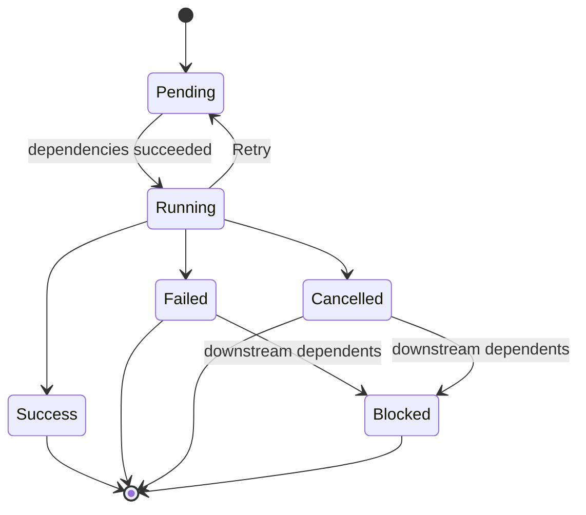

# henyey-work

Dependency-aware async work scheduler for orchestrating henyey workflows.

## Overview

`henyey-work` provides the shared scheduling primitives used by higher-level
henyey crates to run multi-step async workflows with explicit dependency
ordering. It maps to the core scheduling concerns in stellar-core's
`src/work/` subsystem, but models orchestration as a flat DAG of Tokio tasks
instead of a parent-child `BasicWork` tree.

## Architecture


```mermaid
stateDiagram-v2
    [*] --> Pending
    Pending --> Running : dependencies succeeded
    Running --> Success
    Running --> Failed
    Running --> Cancelled
    Running --> Pending : Retry
    Failed --> Blocked : downstream dependents
    Cancelled --> Blocked : downstream dependents
    Success --> [*]
    Failed --> [*]
    Cancelled --> [*]
    Blocked --> [*]
```

Each work item starts in `Pending`, runs once all dependencies have succeeded,
and reports a `WorkOutcome` back to the scheduler. The scheduler tracks retry
budget, cancellation tokens, optional events, and dependency blocking.

## Key Types

| Type | Description |
|------|-------------|
| `Work` | Trait implemented by every schedulable async task. |
| `WorkScheduler` | DAG scheduler that owns work items, executes ready items, and updates state. |
| `WorkSchedulerConfig` | Runtime settings for concurrency, default retry delay, and event emission. |
| `WorkSchedulerMetrics` | Aggregate counts for pending, running, terminal, and retry-related state. |
| `WorkContext` | Execution context containing the work ID, attempt number, and cancellation token. |
| `WorkOutcome` | Result of one execution attempt: success, retry, failure, or cancellation. |
| `WorkState` | Scheduler-visible lifecycle state for a registered work item. |
| `WorkEvent` | Optional state transition notification sent over a Tokio channel. |
| `WorkId` | Scheduler-local `u64` identifier used for dependencies and inspection. |

## Usage

### Define and schedule dependent work

```rust
use async_trait::async_trait;
use henyey_work::{Work, WorkContext, WorkOutcome, WorkScheduler, WorkSchedulerConfig};

struct Download;

#[async_trait]
impl Work for Download {
    fn name(&self) -> &str {
        "download"
    }

    async fn run(&mut self, _ctx: &WorkContext) -> WorkOutcome {
        WorkOutcome::Success
    }
}

# async fn example() {
let mut scheduler = WorkScheduler::new(WorkSchedulerConfig::default());

let download = scheduler.add_work(Box::new(Download), vec![], 0);
let _verify = scheduler.add_work(Box::new(Download), vec![download], 0);

scheduler.run_until_done().await;
# }
```

### Retry transient work

```rust
use std::time::Duration;

use async_trait::async_trait;
use henyey_work::{Work, WorkContext, WorkOutcome};

struct RetryOnce {
    attempts: u32,
}

#[async_trait]
impl Work for RetryOnce {
    fn name(&self) -> &str {
        "retry-once"
    }

    async fn run(&mut self, _ctx: &WorkContext) -> WorkOutcome {
        self.attempts += 1;
        if self.attempts == 1 {
            WorkOutcome::Retry { delay: Duration::ZERO }
        } else {
            WorkOutcome::Success
        }
    }
}
```

### Inspect state and metrics

```rust
use henyey_work::{WorkScheduler, WorkSchedulerConfig, WorkState};

# async fn example(mut scheduler: WorkScheduler, id: henyey_work::WorkId) {
scheduler.run_until_done().await;

let metrics = scheduler.metrics();
assert_eq!(scheduler.state(id), Some(WorkState::Success));
tracing::info!(success = metrics.success, total = metrics.total);
# }
```

## Module Layout

| Module | Description |
|--------|-------------|
| `lib.rs` | Crate entry point and public re-exports for the scheduler API. |
| `types.rs` | Core trait and shared state types such as `Work`, `WorkOutcome`, `WorkState`, and `WorkEvent`. |
| `scheduler.rs` | Scheduler engine, configuration, metrics, retry handling, cancellation, and event emission. |

## Design Notes

- Work items are owned by the scheduler and temporarily moved into spawned
  Tokio tasks, then restored after completion so mutable state survives retries.
- Failure propagation is dependency-based: a failed or cancelled item blocks
  only its downstream dependents.
- The crate intentionally uses a flat dependency graph rather than
  stellar-core's hierarchical `Work` tree, which keeps current catchup and
  history workflows simple.

## stellar-core Mapping

| Rust | stellar-core |
|------|--------------|
| `src/types.rs` | `src/work/BasicWork.h`, `src/work/BasicWork.cpp` |
| `src/scheduler.rs` | `src/work/WorkScheduler.h`, `src/work/WorkScheduler.cpp` |
| Not implemented | `src/work/Work.h`, `src/work/Work.cpp` |
| Not implemented | `src/work/WorkSequence.h`, `src/work/WorkSequence.cpp` |
| Not implemented | `src/work/BatchWork.h`, `src/work/BatchWork.cpp` |
| Not implemented | `src/work/ConditionalWork.h`, `src/work/ConditionalWork.cpp` |
| Not implemented | `src/work/WorkWithCallback.h`, `src/work/WorkWithCallback.cpp` |

## Parity Status

See [PARITY_STATUS.md](PARITY_STATUS.md) for detailed stellar-core parity analysis.
