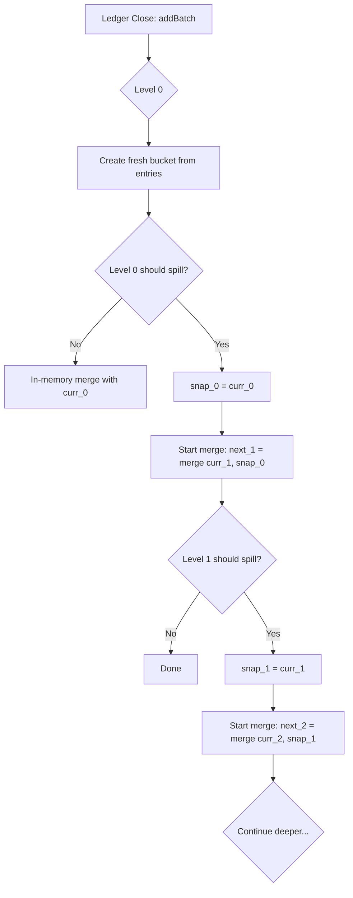
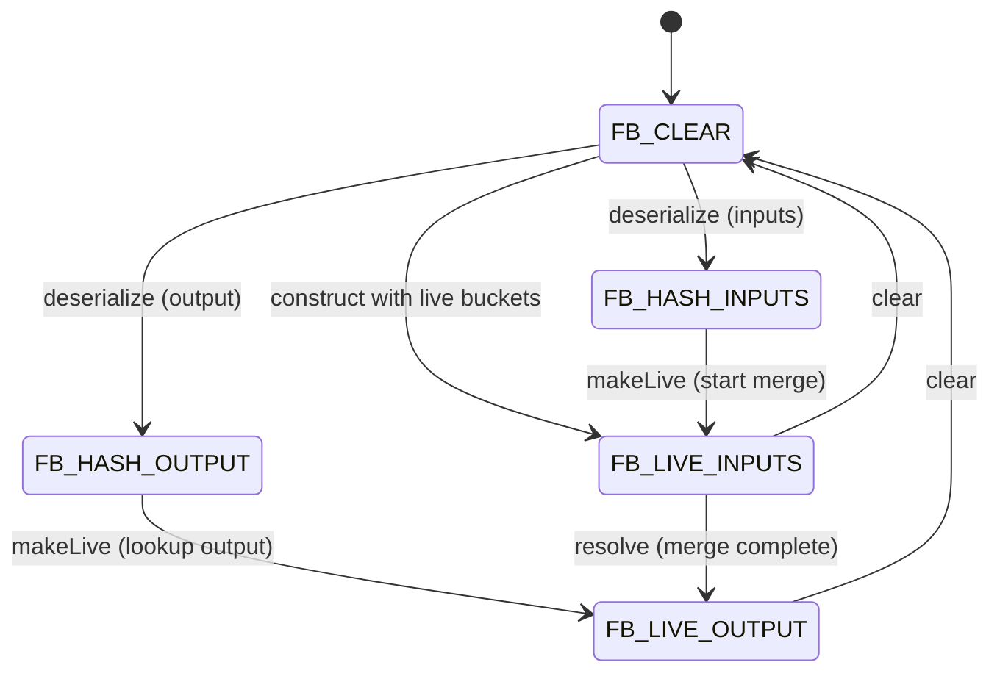
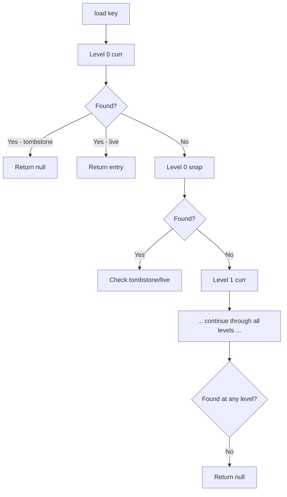
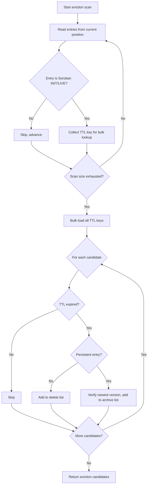

# Stellar BucketList and BucketListDB Specification

**Version:** 25 (stellar-core v25.x / Protocol 25)
**Status:** Informational
**Date:** 2026-02-20

---

## Table of Contents

1. [Introduction](#1-introduction)
2. [Architecture Overview](#2-architecture-overview)
3. [Data Types and Encoding](#3-data-types-and-encoding)
4. [BucketList Structure](#4-bucketlist-structure)
5. [Bucket Lifecycle](#5-bucket-lifecycle)
6. [Merge Algorithm](#6-merge-algorithm)
7. [Asynchronous Merge Management](#7-asynchronous-merge-management)
8. [BucketManager](#8-bucketmanager)
9. [Indexing](#9-indexing)
10. [Snapshot and Query Layer](#10-snapshot-and-query-layer)
11. [Hot Archive BucketList](#11-hot-archive-bucketlist)
12. [Eviction](#12-eviction)
13. [Catchup and State Reconstruction](#13-catchup-and-state-reconstruction)
14. [Serialization and Persistence](#14-serialization-and-persistence)
15. [Invariants and Safety Properties](#15-invariants-and-safety-properties)
16. [Constants](#16-constants)
17. [References](#17-references)
18. [Appendices](#18-appendices)

---

## 1. Introduction

### 1.1 Purpose and Scope

This document specifies the BucketList and BucketListDB subsystem as
implemented in stellar-core v25.x. The BucketList is a hierarchical,
append-structured data store that maintains a cumulative, hash-verified
snapshot of all ledger state. BucketListDB is the query layer built on
top of the BucketList that supports point lookups and bulk key loads
without requiring a separate relational database.

This specification covers:

- The BucketList data structure: levels, buckets, spill mechanics, and
  hash computation.
- Bucket file format: entry encoding, metadata records, and sort order.
- The merge algorithm: entry lifecycle (INIT/LIVE/DEAD), merge
  semantics across protocol versions, shadow elision, tombstone
  elimination, and in-memory merge optimization.
- Asynchronous merge management: the FutureBucket state machine, merge
  key deduplication, and merge-map tracking.
- BucketManager: bucket adoption, garbage collection, directory
  management, and eviction scheduling.
- Indexing: disk-based range indexes with bloom filters, in-memory
  indexes, and entry caching.
- The snapshot and query layer: thread-safe snapshots, point lookups,
  bulk loads, pool share queries, and eviction scanning.
- The Hot Archive BucketList: persistent Soroban entry archival
  (protocol 23+).
- Eviction: background scanning for expired Soroban entries.
- Catchup and state reconstruction: applying bucket files to restore
  ledger state.
- Serialization: HistoryArchiveState integration and bucket file
  persistence.

This specification is **implementation agnostic**. It is derived
exclusively from the vetted stellar-core C++ implementation (v25.x) and
its pseudocode companion (stellar-core-pc). Any conforming
implementation that produces identical bucket hashes, BucketList hashes,
and query results for all valid inputs is considered correct. Internal
details such as threading models, specific file system layouts, and
caching strategies are out of scope except where they affect
deterministic hash computation or observable query semantics.

### 1.2 Conventions and Terminology

The key words "MUST", "MUST NOT", "REQUIRED", "SHALL", "SHALL NOT",
"SHOULD", "SHOULD NOT", "RECOMMENDED", "MAY", and "OPTIONAL" in this
document are to be interpreted as described in [RFC 2119][rfc2119].

| Term | Definition |
|------|------------|
| **BucketList** | A hierarchical data structure of 11 levels, each containing two buckets (`curr` and `snap`), that stores cumulative ledger state with temporal ordering. |
| **Bucket** | An immutable, content-addressed file containing sorted, XDR-encoded ledger entries. Identified by the SHA-256 hash of its contents. |
| **Level** | One of the 11 tiers (numbered 0 through 10) in the BucketList hierarchy. Each level stores progressively older and larger sets of entries. |
| **curr bucket** | The bucket at a given level that accumulates recent entries. Updated every `bucketUpdatePeriod` ledgers for that level. |
| **snap bucket** | The bucket at a given level holding the previous contents of `curr` after a spill event. Merges asynchronously with the next level's `curr`. |
| **Spill** | The event where a level's `curr` is moved to `snap` and a new empty `curr` is started, triggering a merge of the old `snap` with the next level's `curr`. |
| **Merge** | The process of combining two sorted bucket files into a single bucket, applying entry lifecycle rules (Section 6). |
| **FutureBucket** | A state machine that tracks an in-progress or completed asynchronous merge (Section 7). |
| **INITENTRY** | A bucket entry type indicating the first appearance of a ledger entry in the BucketList since its creation or last deletion. Introduced in protocol 11. |
| **LIVEENTRY** | A bucket entry type containing a live ledger entry (creation or update). |
| **DEADENTRY** | A bucket entry type (tombstone) indicating deletion of a ledger entry. |
| **METAENTRY** | A bucket entry containing protocol version metadata. Always the first record in a bucket file (protocol 11+). |
| **Shadow** | A higher-level bucket used during merges (pre-protocol 12) to elide entries that have been superseded. |
| **Tombstone** | A DEADENTRY record. Tombstones are preserved at all levels except the deepest (level 10), where they are elided during merges. |
| **BucketListDB** | The indexed query layer over the BucketList that supports point lookups and bulk loads. |
| **Hot Archive** | A secondary BucketList (protocol 23+) that stores evicted persistent Soroban entries for later restoration. |
| **Eviction** | The process of scanning the BucketList for expired Soroban entries and removing them from the live state. |
| **BucketManager** | The central orchestrator responsible for bucket file lifecycle, merge scheduling, garbage collection, and snapshot management. |
| **HistoryArchiveState (HAS)** | A JSON structure describing the complete state of a BucketList at a given ledger, including all bucket hashes and in-progress merge state. |
| **MergeKey** | A unique identifier for a merge operation, composed of the `keepTombstones` flag, input bucket hashes, and shadow bucket hashes. |
| **Record-mark framing** | The XDR encoding scheme where each entry is preceded by a 4-byte big-endian length prefix. |
| **Stroop** | The smallest unit of XLM: 1 XLM = 10,000,000 stroops. |

### 1.3 Notation

This specification uses the following notation conventions:

- `levelSize(L)` denotes the number of ledgers in a complete cycle at
  level L.
- `levelHalf(L)` denotes half the cycle at level L.
- `oldestLedgerInCurr(L, seq)` denotes the oldest ledger whose entries
  may reside in the curr bucket of level L at ledger sequence `seq`.
- `SHA256(data)` denotes the SHA-256 hash function.
- Bit operations: `>>` (right shift), `<<` (left shift), `&`
  (bitwise AND).
- Protocol version comparisons use inclusive ranges unless stated
  otherwise.

### 1.4 Relationship to Other Specifications

This specification is a companion to:

- **Transaction Processing Specification** (`TX_SPEC.md`): defines how
  transactions produce the ledger entry changes that feed into
  `addBatch`.
- **Ledger Specification** (`LEDGER_SPEC.md`): defines the ledger close
  pipeline that drives BucketList updates and reads the BucketList hash.
- **Catchup Specification** (`CATCHUP_SPEC.md`): defines how bucket
  files are downloaded, verified, and applied during history catchup.
- **SCP Specification** (`SCP_SPEC.md`): consensus drives ledger close,
  which drives BucketList updates.

---

## 2. Architecture Overview

### 2.1 Design Goals

The BucketList is designed to serve three primary purposes:

1. **Cumulative state hashing**: produce a single hash that
   deterministically summarizes all live ledger state, for inclusion in
   each ledger header.
2. **Efficient state queries**: support O(log n) point lookups and
   efficient bulk loads without a separate relational database.
3. **Archival state transfer**: enable nodes joining the network to
   download a complete state snapshot and verify it cryptographically.

### 2.2 High-Level Architecture

```
Ledger Close
    |
    v
addBatch(initEntries, liveEntries, deadEntries)
    |
    v
+------------------------------------------+
|              BucketList                  |
|  Level 0: [curr_0] [snap_0]             |
|  Level 1: [curr_1] [snap_1]             |
|  ...                                     |
|  Level 10: [curr_10] [snap_10]           |
+------------------------------------------+
    |                    |
    v                    v
BucketList Hash     BucketListDB
(in LedgerHeader)   (point/bulk queries)
```

At each ledger close, changed entries are added to level 0 via
`addBatch`. Periodically, entries "spill" from level L to level L+1
through a merge process. Each bucket is an immutable, sorted,
content-addressed file. The BucketList hash is the XOR of all level
hashes, which are themselves derived from the hashes of each level's
`curr` and `snap` buckets.

### 2.3 Entry Flow

1. Transactions execute and produce three vectors of changes:
   - **initEntries**: newly created ledger entries (INITENTRY)
   - **liveEntries**: modified ledger entries (LIVEENTRY)
   - **deadEntries**: deleted ledger keys (DEADENTRY)

2. These are combined into a sorted vector of `BucketEntry` records
   (Section 5.2) and merged into level 0's `curr` bucket.

3. At specific ledger boundaries (determined by `levelShouldSpill`),
   entries cascade to deeper levels via merge operations.

4. The BucketList hash is recomputed and written to the ledger header.

---

## 3. Data Types and Encoding

### 3.1 BucketEntry (Live BucketList)

A `BucketEntry` is the fundamental record type in the Live BucketList.
It is an XDR union discriminated on `BucketEntryType`:

```
enum BucketEntryType {
    METAENTRY    = -1,
    LIVEENTRY    =  0,
    DEADENTRY    =  1,
    INITENTRY    =  2
};

union BucketEntry switch (BucketEntryType type) {
case LIVEENTRY:
case INITENTRY:
    LedgerEntry liveEntry;
case DEADENTRY:
    LedgerKey deadEntry;
case METAENTRY:
    BucketMetadata metaEntry;
};
```

**Invariants:**

- A bucket file MUST contain at most one METAENTRY.
- If a METAENTRY is present, it MUST be the first record in the file.
- INITENTRY records MUST NOT appear in buckets with protocol version
  before 11.
- The `ledgerVersion` in METAENTRY records the maximum protocol version
  of any entry that contributed to this bucket.

### 3.2 BucketMetadata

```
struct BucketMetadata {
    uint32 ledgerVersion;
    union switch (int v) {
    case 0:
        void;
    case 1:
        BucketListType bucketListType;
    } ext;
};

enum BucketListType {
    LIVE        = 0,
    HOT_ARCHIVE = 1
};
```

For the Live BucketList, `ext.v()` is 0. For the Hot Archive BucketList,
`ext.v()` MUST be 1 and `ext.bucketListType()` MUST be `HOT_ARCHIVE`.

### 3.3 HotArchiveBucketEntry

For the Hot Archive BucketList (protocol 23+):

```
enum HotArchiveBucketEntryType {
    HOT_ARCHIVE_METAENTRY = -1,
    HOT_ARCHIVE_ARCHIVED  =  0,
    HOT_ARCHIVE_LIVE      =  1,
    HOT_ARCHIVE_DELETED   =  2
};

union HotArchiveBucketEntry switch (HotArchiveBucketEntryType type) {
case HOT_ARCHIVE_ARCHIVED:
    LedgerEntry archivedEntry;
case HOT_ARCHIVE_LIVE:
case HOT_ARCHIVE_DELETED:
    LedgerKey key;
case HOT_ARCHIVE_METAENTRY:
    BucketMetadata metaEntry;
};
```

Only Soroban entries (CONTRACT_DATA, CONTRACT_CODE, TTL) MAY appear in
Hot Archive buckets. Attempting to store non-Soroban entries SHALL cause
an error.

### 3.4 Entry Sort Order

All entries within a bucket file MUST be sorted by their identity key
using the following lexicographic ordering:

1. **Primary**: `LedgerEntryType` (numeric value, ascending).
2. **Secondary**: type-specific fields in the following order:

| Entry Type | Sort Fields |
|-----------|-------------|
| ACCOUNT | `accountID` |
| TRUSTLINE | `accountID`, then `asset` |
| OFFER | `sellerID`, then `offerID` |
| DATA | `accountID`, then `dataName` |
| CLAIMABLE_BALANCE | `balanceID` |
| LIQUIDITY_POOL | `liquidityPoolID` |
| CONTRACT_DATA | `contract`, then `key`, then `durability` |
| CONTRACT_CODE | `hash` |
| CONFIG_SETTING | `configSettingID` |
| TTL | `keyHash` |

METAENTRY records sort before all other entry types (type value -1).

Within a merge, when two entries have the same identity key, the entry
from the **newer** (lower-numbered level or curr vs snap) bucket takes
precedence.

### 3.5 Bucket File Format

A bucket file is a sequence of record-mark framed XDR records:

```
[4-byte big-endian length][XDR-encoded BucketEntry]
[4-byte big-endian length][XDR-encoded BucketEntry]
...
```

The SHA-256 hash of a bucket is computed over the entire file contents
(all length-prefixed records concatenated). The empty bucket has a
well-known all-zero hash.

Each bucket file is named with a random UUID to avoid collisions during
concurrent operations. The file is written to a temporary path and then
adopted by the BucketManager with its content hash as the canonical
identifier.

---

## 4. BucketList Structure

### 4.1 Levels

The BucketList consists of exactly **11 levels**, numbered 0 through 10.
Each level L contains two buckets:

- `curr`: accumulates entries from higher (lower-numbered) levels.
- `snap`: holds the previous contents of `curr` after a spill, pending
  merge with the next level.

### 4.2 Level Sizing

Level sizes follow a geometric progression:

```
levelSize(L)  = 1 << (2 * (L + 1))    // in ledgers
levelHalf(L)  = levelSize(L) >> 1
```

| Level | levelSize | levelHalf | Approximate time (5s close) |
|-------|-----------|-----------|---------------------------|
| 0     | 4         | 2         | 20 seconds |
| 1     | 16        | 8         | 80 seconds |
| 2     | 64        | 32        | ~5 minutes |
| 3     | 256       | 128       | ~21 minutes |
| 4     | 1,024     | 512       | ~85 minutes |
| 5     | 4,096     | 2,048     | ~5.7 hours |
| 6     | 16,384    | 8,192     | ~22.8 hours |
| 7     | 65,536    | 32,768    | ~3.8 days |
| 8     | 262,144   | 131,072   | ~15.2 days |
| 9     | 1,048,576 | 524,288   | ~60.7 days |
| 10    | 4,194,304 | 2,097,152 | ~242.8 days |

### 4.3 Bucket Update Period

The `bucketUpdatePeriod` for level L determines how often (in ledger
closes) new entries are added to that level:

```
bucketUpdatePeriod(L):
    if L == 0: return 1           // every ledger
    return levelHalf(L - 1)      // every levelHalf(L-1) ledgers
```

Level 0 is updated every ledger. Level 1 is updated every 2 ledgers.
Level 2 every 8 ledgers, and so on.

### 4.4 Spill Condition

A level L spills (moves `curr` to `snap` and starts a fresh `curr`)
when:

```
levelShouldSpill(seq, L):
    return (seq & (levelHalf(L) - 1)) == 0
    // equivalently: seq mod levelHalf(L) == 0
```

When level L spills, the old `snap` at level L is merged with `curr`
at level L+1. This merge runs asynchronously and MUST complete before
the next spill of level L.

### 4.5 Oldest Ledger Tracking

The oldest ledger whose entries may reside in a given bucket is
computable from the current sequence number:

```
oldestLedgerInCurr(L, seq):
    if L == 0: return seq
    let step = levelHalf(L - 1)
    // How many steps since last spill of this level
    let stepsInCycle = ((seq - 1) / step) mod (levelSize(L) / step)
    if stepsInCycle == 0:
        // Just spilled, curr has exactly one batch
        return seq
    return seq - stepsInCycle * step

oldestLedgerInSnap(L, seq):
    if L == 0: return seq    // level 0 snap mirrors curr
    let step = levelHalf(L - 1)
    let stepsInCycle = ((seq - 1) / step) mod (levelSize(L) / step)
    if stepsInCycle == 0:
        // Just spilled; snap contains the old curr, which is half a cycle
        return seq - levelHalf(L) + step
    // Not just spilled; snap was set at last spill
    let lastSpill = seq - stepsInCycle * step
    return lastSpill - levelHalf(L) + step
```

### 4.6 BucketList Hash

The BucketList hash is computed as:

```
bucketListHash = SHA256(level_0_hash || level_1_hash || ... || level_10_hash)
```

where each level hash is:

```
level_hash(L) = SHA256(curr_hash(L) || snap_hash(L))
```

and `curr_hash(L)` and `snap_hash(L)` are the SHA-256 content hashes of
the respective bucket files. An empty bucket has hash `0x0000...0000`
(32 zero bytes).

This hash is included in the `LedgerHeader.bucketListHash` field and is
part of the consensus-critical state.

### 4.7 Tombstone Retention

Tombstones (DEADENTRY records) MUST be retained at all levels except
level 10 (the deepest). At level 10, tombstones SHALL be elided during
merges because there are no deeper levels where stale versions could be
revived.

```
keepTombstoneEntries(L):
    return L < kNumLevels - 1    // true for levels 0..9, false for level 10
```

---

## 5. Bucket Lifecycle

### 5.1 Bucket Creation

New buckets are created via the `BucketOutputIterator`, which:

1. Opens a temporary file with a random name in the bucket directory.
2. If the protocol version supports METAENTRY (>= 11), writes a
   METAENTRY as the first record containing the bucket's protocol
   version.
3. Accepts entries via `put()`, maintaining a single-entry buffer to
   deduplicate consecutive entries with the same identity key (only the
   last entry for a given key is written).
4. On finalization (`getBucket()`), flushes the buffer, closes the file,
   computes the SHA-256 hash, and hands the file to the BucketManager
   for adoption.

If the output contains zero non-meta entries, the temporary file is
deleted and the empty bucket (all-zero hash) is returned.

### 5.2 Entry Conversion (addBatch Input)

When `addBatch` is called with init, live, and dead entry vectors, the
entries are converted to `BucketEntry` records and sorted:

```
convertToBucketEntry(initEntries, liveEntries, deadEntries):
    result = []
    for entry in initEntries:
        result.append(BucketEntry{type=INITENTRY, liveEntry=entry})
    for entry in liveEntries:
        result.append(BucketEntry{type=LIVEENTRY, liveEntry=entry})
    for key in deadEntries:
        result.append(BucketEntry{type=DEADENTRY, deadEntry=key})
    sort result by BucketEntryIdCmp
    return result
```

### 5.3 Level 0 Update (addBatchInternal)

On every ledger close, `addBatch` is called with the changes from that
ledger. The process for each level is:

```
addBatchInternal(seq, initEntries, liveEntries, deadEntries):
    for L = 0 to kNumLevels - 1:
        if L == 0:
            // Level 0: create fresh bucket from sorted entries
            prepareFirstLevel(entries, seq)
        else:
            if bucketUpdatePeriod(L) does not divide seq:
                break    // this level and deeper are not updated this ledger

        if levelShouldSpill(seq, L):
            level[L].snap()       // move curr → snap
            level[L].prepare(...)  // start merge with next level
```

For level 0 specifically, an **in-memory merge** optimization MAY be
used: the new entries and the existing level 0 `curr` are merged in
memory without writing intermediate bucket files. The merged result is
then written to a single output bucket.

### 5.4 Level Prepare and Snap

When a level spills:

```
snap():
    // Move curr to snap position
    mSnap = mCurr
    mCurr = emptyBucket

prepare(app, nextLevel, shadows, maxProtocol, countEvents):
    // mSnap now holds the old curr, which needs to merge with
    // the next level's curr
    nextLevel.setNext(
        FutureBucket(app, nextLevel.curr, mSnap, shadows,
                     maxProtocol, countEvents, nextLevel.index))
```

After snapping, the old `snap` of this level has been passed to the
next level's merge via FutureBucket. The next level's `curr` is
replaced with the merge result when the FutureBucket resolves.

### 5.5 Level Commit

When a FutureBucket merge completes (the `next` field resolves), the
result replaces the level's `curr`:

```
commit():
    if mNext is resolved:
        mCurr = mNext.resolve()
        mNext.clear()
```

---

## 6. Merge Algorithm

### 6.1 Overview

A merge combines two input buckets (`old` and `new`, where `new` is
from a shallower level) into a single output bucket. The merge is a
sorted merge-join that respects entry lifecycle semantics.

### 6.2 Protocol Version Calculation

The output bucket's protocol version is the maximum of:
- The `new` bucket's protocol version
- The `old` bucket's protocol version
- The protocol versions of all shadow buckets (pre-protocol 12 only)

```
calculateMergeProtocolVersion(new, old, shadows):
    version = max(new.protocolVersion, old.protocolVersion)
    for s in shadows:
        version = max(version, s.protocolVersion)
    return version
```

### 6.3 Merge Loop

The core merge operates on two `BucketInputIterator` streams (`ni` for
new, `oi` for old) and one `BucketOutputIterator` output:

```
merge(old, new, shadows, keepTombstones):
    mergeProtocol = calculateMergeProtocolVersion(new, old, shadows)
    ni = BucketInputIterator(new)
    oi = BucketInputIterator(old)
    out = BucketOutputIterator(keepTombstones, metadata(mergeProtocol))

    while ni is valid AND oi is valid:
        cmp = compare(ni.entry, oi.entry)
        if cmp < 0:
            // New entry comes first (no equal key in old)
            maybePut(out, ni.entry, shadows)
            advance(ni)
        else if cmp > 0:
            // Old entry comes first (no equal key in new)
            maybePut(out, oi.entry, shadows)
            advance(oi)
        else:
            // Same key: apply lifecycle merge rules
            mergeCasesWithEqualKeys(out, ni.entry, oi.entry, shadows)
            advance(ni)
            advance(oi)

    // Drain remaining entries
    while ni is valid:
        maybePut(out, ni.entry, shadows)
        advance(ni)
    while oi is valid:
        maybePut(out, oi.entry, shadows)
        advance(oi)

    return out.getBucket()
```

### 6.4 Shadow Elision (Pre-Protocol 12)

Before protocol 12, shadow buckets are used to elide entries that have
been superseded by shallower levels. When outputting an entry, the merge
checks if the entry's key exists in any shadow bucket:

```
maybePut(out, entry, shadows):
    if protocol >= FIRST_PROTOCOL_SHADOWS_REMOVED (12):
        out.put(entry)
        return

    if entry is METAENTRY:
        out.put(entry)
        return

    for shadow in shadows:
        if shadow.contains(entry.key):
            // Entry is shadowed, skip it
            record shadow elision metric
            return

    out.put(entry)
```

From protocol 12 onward, shadows are removed entirely. Instead, the
INIT/DEAD lifecycle (Section 6.5) prevents stale entry revival.

### 6.5 Equal-Key Merge Rules (Live BucketList)

When two entries with the same identity key meet during a merge, the
result depends on their types. The `new` entry is always from the
shallower (more recent) bucket.

#### Pre-INITENTRY Protocol (before protocol 11)

Only LIVE and DEAD types exist. The new entry always wins:

| New \ Old | LIVE | DEAD |
|-----------|------|------|
| **LIVE**  | emit LIVE (new) | emit LIVE (new) |
| **DEAD**  | emit DEAD (new) | emit DEAD (new) |

#### Post-INITENTRY Protocol (protocol 11+)

The INIT type enables tracking whether an entry was freshly created
(INIT) or merely updated (LIVE). This allows safe tombstone elimination
at the deepest level without risking entry revival.

| New \ Old | INIT | LIVE | DEAD |
|-----------|------|------|------|
| **INIT**  | error (invalid) | error (invalid) | annihilate (emit nothing) |
| **LIVE**  | emit INIT (new data, INIT type) | emit LIVE (new) | emit LIVE (new) |
| **DEAD**  | annihilate (emit nothing) | emit DEAD (new) | emit DEAD (new) |

Key rules:

- **INIT + DEAD = nothing**: An entry that was created and then deleted
  within the same merge window annihilates — neither record is emitted.
  This is the critical optimization that enables tombstone elimination
  at the deepest level.

- **DEAD + INIT = nothing**: The reverse case also annihilates — a
  deletion followed by re-creation cancels out.

- **LIVE + INIT = INIT**: An update to an entry that was originally
  created preserves the INIT marker with the new data. This ensures
  future merges know the entry has no older version below.

- **INIT + INIT** and **INIT + LIVE**: These combinations are invalid
  and indicate a bug. An implementation MUST signal an error.

### 6.6 Tombstone Elision at Deepest Level

At level 10 (the deepest level), `keepTombstoneEntries` is false. The
`BucketOutputIterator` SHALL skip any entry for which
`isTombstoneEntry()` returns true:

- For the Live BucketList: DEADENTRY records are tombstones.
- For the Hot Archive BucketList: HOT_ARCHIVE_LIVE records are
  tombstones (they indicate an entry was restored from archive).

This is safe because there are no deeper levels where a stale version
could be accidentally revived.

### 6.7 In-Memory Merge (Level 0 Optimization)

For level 0, where buckets are typically small, an in-memory merge
optimization MAY be used:

1. The existing `curr` bucket's entries are loaded into memory (or
   retained from a previous in-memory creation).
2. The new entries from `addBatch` are merged with the in-memory entries
   using the same merge rules as the file-based merge.
3. The result is written to a new bucket file via `BucketOutputIterator`,
   and the in-memory state is preserved for the next merge.

This avoids the overhead of reading the existing `curr` from disk for
every ledger close. The in-memory state MUST be discarded when level 0
spills (the entries move to `snap`).

### 6.8 Output Deduplication

The `BucketOutputIterator` maintains a single-entry buffer. When `put()`
is called:

1. If the buffer is empty, the entry is buffered.
2. If the buffer contains an entry with a **different** key (less than
   the new entry), the buffered entry is flushed to disk and the new
   entry replaces it.
3. If the buffer contains an entry with the **same** key, the new entry
   replaces the buffer without flushing. This handles the case where
   merge rules produce a replacement rather than an additional entry.

Entries MUST be presented to `put()` in sorted order. If an entry
compares less than the buffered entry, it indicates out-of-order input,
which is a fatal error.

---

## 7. Asynchronous Merge Management

### 7.1 FutureBucket State Machine

The `FutureBucket` manages the lifecycle of an asynchronous merge. It
has five states:

```
FB_CLEAR        No inputs, no outputs, no hashes.
FB_HASH_INPUTS  Input hashes known (deserialized from HAS), no live values.
FB_HASH_OUTPUT  Output hash known (deserialized from HAS), no live values.
FB_LIVE_INPUTS  Live input buckets present, merge running (future valid).
FB_LIVE_OUTPUT  Merge complete, output bucket available.
```

State transitions:

```
                           +-----------+
         Construction      |           |
     +---(with inputs)---->| LIVE_     |---resolve()-->+
     |                     | INPUTS    |               |
     |                     +-----------+               v
     |                                           +-----------+
     |                                           | LIVE_     |
     |                                           | OUTPUT    |
     |                                           +-----------+
     |
+----+----+   deserialized   +-----------+   makeLive()
|  CLEAR  |----------------->| HASH_     |----------->+
+----+----+   (with inputs)  | INPUTS    |            |
     |                       +-----------+            v
     |                                          +-----------+
     |       deserialized    +-----------+      | LIVE_     |
     +---------------------> | HASH_     |      | INPUTS    |
          (with output)      | OUTPUT    |      +-----------+
                             +-----------+
                                  |
                          makeLive() (lookup)
                                  |
                                  v
                             +-----------+
                             | LIVE_     |
                             | OUTPUT    |
                             +-----------+
```

### 7.2 FutureBucket Construction

When a merge is needed (during `prepare`), a FutureBucket is constructed
with live input buckets:

```
FutureBucket(app, curr, snap, shadows, maxProtocol, countEvents, level):
    state = FB_LIVE_INPUTS
    inputCurrBucket = curr
    inputSnapBucket = snap
    inputShadowBuckets = shadows
    // Record hashes for serialization
    inputCurrBucketHash = hex(curr.hash)
    inputSnapBucketHash = hex(snap.hash)
    for s in shadows: inputShadowBucketHashes.append(hex(s.hash))
    // Start the merge immediately
    startMerge(app, maxProtocol, countEvents, level)
```

**Shadow validation**: If the snap bucket's protocol version is >= 12
(FIRST_PROTOCOL_SHADOWS_REMOVED), the shadows list MUST be empty.

### 7.3 Merge Start and Deduplication

When starting a merge, the FutureBucket first checks the BucketManager's
merge future cache for an existing merge with the same `MergeKey`:

```
startMerge(app, maxProtocol, countEvents, level):
    mk = MergeKey(keepTombstoneEntries(level), curr.hash, snap.hash,
                  shadowHashes)

    // Check for existing merge
    f = bucketManager.getMergeFuture(mk)
    if f is valid:
        outputBucketFuture = f    // re-attach to existing merge
        return

    // Start new merge on background thread
    task = async {
        BucketT.merge(bucketManager, maxProtocol, curr, snap, shadows,
                      keepTombstoneEntries(level), countEvents)
    }
    outputBucketFuture = task.future
    bucketManager.putMergeFuture(mk, outputBucketFuture)
    postToBackgroundThread(task)
```

### 7.4 Resolution

When a merge result is needed (during `commit`), the FutureBucket is
resolved:

```
resolve():
    assert state is LIVE_INPUTS or LIVE_OUTPUT
    if state == LIVE_OUTPUT: return outputBucket

    // Wait for merge to complete
    clearInputs()
    outputBucket = outputBucketFuture.get()
    outputBucketHash = hex(outputBucket.hash)
    outputBucketFuture = invalid    // release shared state
    state = FB_LIVE_OUTPUT
    return outputBucket
```

### 7.5 Serialization (HAS Integration)

FutureBuckets are serialized to the HistoryArchiveState to support
crash recovery and history publishing:

**Saving**: LIVE_INPUTS and HASH_INPUTS serialize as HASH_INPUTS (input
hashes only). LIVE_OUTPUT and HASH_OUTPUT serialize as HASH_OUTPUT
(output hash only). CLEAR serializes as CLEAR.

**Loading**: Deserializes into HASH_INPUTS or HASH_OUTPUT state.

**makeLive()**: Transitions from HASH_ states to LIVE_ states by looking
up bucket files by hash in the BucketManager and either setting the
output directly (HASH_OUTPUT) or starting the merge (HASH_INPUTS).

### 7.6 MergeKey

A MergeKey uniquely identifies a merge operation:

```
MergeKey:
    keepTombstoneEntries: bool
    inputCurrBucket: Hash (32 bytes)
    inputSnapBucket: Hash (32 bytes)
    inputShadowBuckets: [Hash] (0+ entries)
```

Two MergeKeys are equal if all fields match. The hash of a MergeKey
(for use in hash maps) is computed by concatenating the string
representations of all fields.

### 7.7 Merge-Map

The BucketManager maintains a merge-map that records which output bucket
was produced from which inputs:

```
MergeMap: Map<MergeKey, Hash>   // input key → output hash
```

When a merge completes with a non-empty result, the mapping is recorded.
When a merge produces an empty result, a special "empty merge" mapping
is recorded. This allows the BucketManager to avoid re-running merges
whose outputs are already known, even if the in-progress future has been
discarded.

---

## 8. BucketManager

### 8.1 Responsibilities

The BucketManager is the central orchestrator for bucket file lifecycle:

1. **Bucket directory management**: maintains a directory of bucket
   files, tracks which files are referenced by the current BucketList
   or in-progress merges.
2. **Bucket adoption**: accepts newly-created bucket files, renames
   them from temporary paths to canonical paths based on content hash,
   and deduplicates (if a bucket with the same hash already exists, the
   new file is deleted and the existing bucket is returned).
3. **Garbage collection**: periodically removes unreferenced bucket
   files from the bucket directory.
4. **Merge future management**: maintains a cache of in-progress and
   completed merge futures (keyed by `MergeKey`) to enable merge
   deduplication and re-attachment.
5. **Snapshot management**: coordinates with the
   `BucketSnapshotManager` to provide thread-safe read snapshots.
6. **Eviction scheduling**: initiates background eviction scans and
   manages the eviction iterator state.
7. **Bucket entry metrics**: tracks entry counts and sizes by type.

### 8.2 Bucket Adoption

When a merge or `fresh` operation produces a bucket file:

```
adoptFileAsBucket(filename, hash, mergeKey, index):
    canonicalPath = bucketDir / hexEncode(hash) / ".xdr"

    if bucket with hash already exists in memory:
        delete filename    // duplicate
        if bucket has no index and index is provided:
            bucket.setIndex(index)
        if mergeKey is provided:
            noteEmptyMergeOutput(mergeKey)   // if applicable
        return existing bucket

    rename filename to canonicalPath
    create new Bucket(canonicalPath, hash, index)
    register in live bucket map
    if mergeKey is provided:
        record in merge-map
    return new bucket
```

### 8.3 Garbage Collection

Bucket files that are no longer referenced by any level's `curr`,
`snap`, or in-progress FutureBucket are candidates for garbage
collection. The BucketManager:

1. Collects all hashes referenced by the current BucketList state
   (including FutureBucket inputs and outputs).
2. Removes any tracked bucket whose hash is not in the referenced set.
3. Optionally removes orphaned files from the bucket directory that
   are not tracked at all.

GC runs after each BucketList update (ledger close) unless disabled
by configuration.

### 8.4 Bucket Size and Level Statistics

The BucketManager tracks the total size of the BucketList:

```
getSize():
    total = 0
    for L = 0 to kNumLevels - 1:
        total += level[L].curr.size + level[L].snap.size
    return total
```

This is used for fee calculations (the BucketList size window in
Soroban fee computation) and eviction heuristics.

---

## 9. Indexing

### 9.1 Overview

Each non-empty bucket MAY have an associated index that enables O(log n)
point lookups and efficient key scanning. Two index types exist:

- **In-Memory Index**: a sorted set of all keys, used for small buckets.
- **Disk Index**: a range-based page index with a bloom filter, used for
  large buckets.

The choice is determined by a configurable size cutoff.

### 9.2 Index Selection

```
createIndex(bucket, config):
    if bucket.size <= config.BUCKETLIST_DB_INDEX_CUTOFF:
        return InMemoryIndex(bucket)
    else:
        return DiskIndex(bucket, config.pageSize)
```

The default cutoff is typically set so that level 0 and level 1 buckets
use in-memory indexes while deeper levels use disk indexes.

### 9.3 In-Memory Index

The in-memory index stores either:
- A sorted set of `LedgerKey` values (for non-cached mode), or
- A sorted map of `LedgerKey` to `BucketEntry` (for cached mode,
  when the bucket is small enough to fit entries in memory).

**Lookup**: Binary search for the key. Returns the entry directly (if
cached) or the file offset (computed from the sorted position) for disk
read.

**Bulk scan**: Supports iteration from a lower-bound position, enabling
efficient multi-key lookups with a single pass.

### 9.4 Disk Index

The disk index divides the bucket file into fixed-size **pages**
(configurable, typically 2^14 = 16,384 bytes) and stores:

1. **Page boundaries**: for each page, the first and last key, plus
   the file offset.
2. **Bloom filter**: a binary fuse filter (XOR+ filter) that provides
   probabilistic membership testing with very low false positive rates.
3. **Entry counters**: counts and sizes of entries by type.
4. **Pool ID index** (Live BucketList only): a mapping from Asset to
   the set of PoolIDs that reference that asset, built from
   LIQUIDITY_POOL entries encountered during indexing.
5. **Type boundaries**: file offset ranges for each `LedgerEntryType`,
   enabling efficient type-restricted scans.

**Lookup**:

```
lookup(key):
    1. Check bloom filter. If key is definitely absent, return NOT_FOUND.
    2. Binary search page boundaries to find the page containing the key.
    3. Return the page's file offset for disk read.
```

**Scan**:

```
scan(startIter, key):
    1. Advance from startIter to find the page containing key.
    2. Check bloom filter. If absent, return NOT_FOUND.
    3. Return page file offset.
```

### 9.5 Bloom Filter

The bloom filter is a **binary fuse filter** (also known as XOR+ filter)
that provides:
- Space efficiency: approximately 9 bits per element.
- Query time: O(1) with 3 hash lookups.
- False positive rate: < 0.4% (approximately 2^-8).

The filter is constructed during index creation by hashing all keys
in the bucket. It is checked before every disk read to avoid unnecessary
I/O for keys that are not present.

Bloom misses (false positives causing unnecessary disk reads) are tracked
via metrics.

### 9.6 Entry Cache (Live BucketList Only)

For disk-indexed live buckets, a **random-eviction cache** MAY be
maintained that stores frequently-accessed entries in memory:

- The cache stores shared references to immutable `BucketEntry` values,
  keyed by `LedgerKey`.
- When a point lookup or scan finds an entry via disk I/O, the entry
  is added to the cache.
- Cache size per bucket is proportional to the bucket's fraction of
  total ACCOUNT entries in the BucketList.
- The total cache memory budget is configurable
  (`BUCKETLIST_DB_MEMORY_FOR_CACHING`).

Cache lookups return `CACHE_HIT` with the entry directly, avoiding
disk I/O entirely.

### 9.7 Index Persistence

Bucket indexes MAY be persisted to disk to avoid reindexing on restart:

```
indexFilename = bucketHash + ".index"
```

The persisted index includes a version number. On load, if the version
does not match the current software version, the index is discarded and
rebuilt. Index persistence is controlled by the
`BUCKETLIST_DB_PERSIST_INDEX` configuration option.

---

## 10. Snapshot and Query Layer

### 10.1 Overview

The snapshot and query layer provides thread-safe, read-only access to
the BucketList state. It is organized as:

```
BucketSnapshotManager
    |
    +-- BucketListSnapshot<LiveBucket>       (one per ledger)
    |       +-- BucketLevelSnapshot[0..10]
    |               +-- LiveBucketSnapshot (curr)
    |               +-- LiveBucketSnapshot (snap)
    |
    +-- BucketListSnapshot<HotArchiveBucket> (one per ledger)
    |       +-- BucketLevelSnapshot[0..10]
    |               +-- HotArchiveBucketSnapshot (curr)
    |               +-- HotArchiveBucketSnapshot (snap)
    |
    +-- Historical snapshots (for ledger N-1, N-2, ...)
```

### 10.2 BucketSnapshotManager

The `BucketSnapshotManager` maintains the canonical snapshot of the
BucketList on the main thread and provides copy-on-read access for
query threads:

- **updateCurrentSnapshot**: called by the main thread after each
  BucketList update, replaces the canonical snapshot and pushes the
  previous snapshot into the historical list.
- **copySearchableLiveBucketListSnapshot**: creates a deep copy of the
  current live snapshot for use by a query thread.
- **copySearchableHotArchiveBucketListSnapshot**: same for the hot
  archive.
- **maybeCopy...**: refreshes a thread-local snapshot only if a newer
  canonical snapshot is available.

Historical snapshots are retained for a configurable number of ledgers,
enabling historical state queries (e.g., for the Soroban `getLedgerEntries`
RPC endpoint).

Access to the canonical snapshot is protected by a shared mutex:
writes (from the main thread) take an exclusive lock; reads (from query
threads) take a shared lock.

### 10.3 Point Lookup

A single-key lookup traverses all buckets from level 0 `curr` to
level 10 `snap`, stopping at the first bucket that contains the key:

```
load(key):
    for level in 0..10:
        for bucket in [curr, snap]:
            (entry, bloomMiss) = bucket.getBucketEntry(key)
            if entry is found:
                if entry is tombstone:
                    return null   // deleted
                return entry.liveEntry
    return null   // not found
```

The first match is authoritative because shallower levels contain
more recent data that shadows deeper entries.

### 10.4 Bulk Load

For loading multiple keys:

```
loadKeys(inKeys):
    keys = copy of inKeys (sorted by LedgerEntryIdCmp)
    result = []
    for level in 0..10:
        for bucket in [curr, snap]:
            bucket.loadKeys(keys, result)
            // found keys are removed from 'keys' set
            if keys is empty: break
    return result
```

Within each bucket, the `loadKeys` method performs a merge-scan between
the sorted key set and the bucket's index:

1. Start with the first key and the index iterator at the beginning.
2. For each key, advance the index iterator to find a lower-bound match.
3. If found, load the entry (from cache or disk), add to result, and
   remove the key from the search set.
4. Continue with the next key.

This provides O(k log n) performance for loading k keys from a bucket
of n entries.

### 10.5 Pool Share Trust Line Query

A specialized query for finding trust lines for liquidity pool shares:

```
loadPoolShareTrustLinesByAccountAndAsset(accountID, asset):
    poolIDs = set()
    // Step 1: collect all PoolIDs referencing the asset
    for each bucket snapshot:
        poolIDs.addAll(bucket.getPoolIDsByAsset(asset))

    // Step 2: construct trust line keys and bulk load
    trustlineKeys = set()
    for poolID in poolIDs:
        trustlineKeys.add(TrustlineKey(accountID, poolID))

    return loadKeys(trustlineKeys)
```

The `getPoolIDsByAsset` query uses the disk index's pool-asset mapping,
which is built during index construction by examining LIQUIDITY_POOL
entries.

### 10.6 Inflation Winners Query

A legacy query that iterates all ACCOUNT entries across all buckets to
compute inflation vote tallies:

```
loadInflationWinners(maxWinners, minBalance):
    voteCount = Map<AccountID, int64>
    seen = Set<AccountID>

    for each bucket (from shallowest to deepest):
        for entry in bucket:
            if entry is DEADENTRY for ACCOUNT type:
                seen.add(entry.accountID)
            if entry is LIVEENTRY/INITENTRY for ACCOUNT type:
                if entry.accountID not in seen:
                    seen.add(entry.accountID)
                    if entry has inflationDest and balance >= minBalance:
                        voteCount[inflationDest] += balance

    sort voteCount by balance descending
    return top maxWinners
```

This is a full-scan query and is only used during catchup for legacy
protocol support.

### 10.7 Entry Type Scan

A targeted scan that reads only entries of a specific `LedgerEntryType`:

```
scanForEntriesOfType(type, callback):
    for each bucket:
        range = bucket.getRangeForType(type)
        if no range: continue
        seek to range.start
        for each entry in range:
            if entry.type > type: break
            if callback(entry) == COMPLETE: return
```

This leverages the disk index's type boundary information to seek
directly to the relevant section of the bucket file, avoiding a full
scan. Used for the Soroban module cache compiler (CONTRACT_CODE entries).

---

## 11. Hot Archive BucketList

### 11.1 Purpose

The Hot Archive BucketList (introduced in protocol 23) stores evicted
persistent Soroban entries. When a persistent CONTRACT_DATA or
CONTRACT_CODE entry expires and is evicted from the Live BucketList,
it is archived in the Hot Archive BucketList. This enables future
restoration of the entry via the `RestoreFootprint` Soroban operation
without requiring access to full history archives.

### 11.2 Structure

The Hot Archive BucketList has the same 11-level hierarchical structure
as the Live BucketList, with the same spill and merge mechanics. It
differs in:

- Entry types: uses `HotArchiveBucketEntry` instead of `BucketEntry`.
- Merge semantics: different equal-key rules (Section 11.4).
- No shadow buckets: hot archive was introduced in protocol 23, which
  is well past the shadow removal in protocol 12.
- No in-memory merge optimization (always file-based).
- Metadata: `BucketMetadata.ext.v()` MUST be 1 with
  `bucketListType = HOT_ARCHIVE`.

### 11.3 Entry Types

| Type | Meaning |
|------|---------|
| `HOT_ARCHIVE_ARCHIVED` | A persistent Soroban entry that was evicted and archived. Contains the full `LedgerEntry`. |
| `HOT_ARCHIVE_LIVE` | A marker indicating an entry was restored from archive back to the live state. Contains only the `LedgerKey`. Acts as a tombstone. |
| `HOT_ARCHIVE_DELETED` | A marker indicating a temporary entry was deleted during eviction. Contains only the `LedgerKey`. |
| `HOT_ARCHIVE_METAENTRY` | Metadata record (same as Live BucketList METAENTRY). |

### 11.4 Merge Rules

The Hot Archive merge follows "newest wins" semantics:

| New \ Old | ARCHIVED | LIVE | DELETED |
|-----------|----------|------|---------|
| **ARCHIVED** | emit ARCHIVED (new) | emit ARCHIVED (new) | emit ARCHIVED (new) |
| **LIVE** | annihilate (emit nothing) | emit LIVE (new) | emit LIVE (new) |
| **DELETED** | emit DELETED (new) | emit DELETED (new) | emit DELETED (new) |

The key rule is **LIVE + ARCHIVED = nothing**: when a "restored" marker
(LIVE) meets an archived entry, they annihilate. This is analogous to
the INIT + DEAD annihilation in the Live BucketList — the restoration
cancels out the archival.

### 11.5 Tombstone Semantics

HOT_ARCHIVE_LIVE entries function as tombstones in the Hot Archive
BucketList. They are elided at level 10 (just like DEAD entries in the
Live BucketList).

### 11.6 Protocol Legality

Hot Archive bucket entries MUST NOT appear in buckets with protocol
version before `FIRST_PROTOCOL_SUPPORTING_PERSISTENT_EVICTION` (23).
Only Soroban entry types (CONTRACT_DATA, CONTRACT_CODE, TTL) are
permitted in Hot Archive buckets.

### 11.7 Indexing

Hot Archive buckets use `DiskIndex` exclusively (no in-memory index
option, no entry cache). The default page size for hot archive indexes
is 16,384 bytes (2^14).

---

## 12. Eviction

### 12.1 Overview

Eviction is the process of scanning the Live BucketList for expired
Soroban entries and removing them from live state. Evicted temporary
entries are deleted; evicted persistent entries are archived to the Hot
Archive BucketList.

Eviction runs as a background scan between ledger closes and produces
a set of **eviction candidates** that are validated and applied during
the next ledger close.

### 12.2 Eviction Iterator

The eviction scan position is tracked by an `EvictionIterator`:

```
struct EvictionIterator {
    uint32 bucketListLevel;
    uint64 bucketFileOffset;
    bool   isCurrBucket;
};
```

The iterator advances through the BucketList in order:
`level 0 curr → level 0 snap → level 1 curr → level 1 snap → ...`
and wraps around from level 10 snap back to the starting level.

### 12.3 Starting Position

The eviction iterator's starting position is reset when the BucketList
structure changes due to a spill at or above the starting level:

```
updateStartingEvictionIterator(iter, startingLevel, ledgerSeq):
    if levelShouldSpill(ledgerSeq, startingLevel):
        iter.bucketListLevel = startingLevel
        iter.isCurrBucket = true
        iter.bucketFileOffset = 0
```

The `startingEvictionScanLevel` is a network configuration parameter
that determines which level the eviction scan begins at.

### 12.4 Scan Process

Each eviction scan reads `evictionScanSize` bytes from the BucketList,
starting at the current iterator position:

```
scanForEviction(iter, scanSize, ledgerSeq):
    result = EvictionResultCandidates()
    keysToEvict = set()

    while scanSize > 0:
        bucket = getBucketAt(iter)
        remainingInBucket = scanBucket(bucket, iter, scanSize, ...)

        if reachedEndOfBucket:
            advanceToNextBucket(iter)
            if backToStartBucket: break
        else:
            break    // scan size exhausted

    return result
```

Within each bucket, the scan:

1. Reads entries sequentially from the current offset.
2. For each INIT or LIVE entry containing a Soroban type:
   - Looks up the TTL key to determine if the entry is expired.
   - If expired, adds it to the eviction candidate list.
3. Tracks bytes read and decrements from `scanSize`.

### 12.5 Eviction Entry Types

| Entry Durability | Protocol < 23 | Protocol >= 23 |
|-----------------|----------------|----------------|
| Temporary | Evicted (deleted) | Evicted (deleted) |
| Persistent | Not evicted | Evicted (archived to Hot Archive) |

For persistent entries at protocol >= 24, the scan ensures it evicts
the **newest version** of the entry (not a stale version from a deeper
bucket) by performing an additional point lookup.

### 12.6 Scan Validity

An eviction scan is invalidated if network configuration changes between
the scan and the ledger close (e.g., due to a protocol upgrade):

```
isValid(currLedgerSeq, currLedgerVers, currSas):
    return initialLedgerSeq == currLedgerSeq
       AND initialLedgerVers == currLedgerVers
       AND initialSas == currSas
```

If the scan is invalid, it MUST be restarted.

### 12.7 Eviction Cycle Metrics

The system tracks:
- **entriesEvicted**: count of entries evicted per ledger.
- **bytesScannedForEviction**: total bytes scanned.
- **incompleteBucketScan**: whether the scan wrapped around without
  completing a full cycle.
- **evictionCyclePeriod**: number of ledgers for a complete scan cycle.
- **averageEvictedEntryAge**: average difference between an entry's
  `liveUntilLedgerSeq` and the ledger at which it was evicted.

---

## 13. Catchup and State Reconstruction

### 13.1 Bucket Application

During catchup, bucket files downloaded from history archives are
applied to reconstruct ledger state. The `BucketApplicator` reads
through a bucket file and inserts entries into the ledger database:

```
applyBucket(bucket, database):
    iter = BucketInputIterator(bucket)
    while iter is valid:
        entry = *iter
        if entry is LIVEENTRY or INITENTRY:
            if entry is offer:
                upsert into database with offer-specific handling
            else:
                upsert into database
        else if entry is DEADENTRY:
            // Skip — dead entries indicate deletions, but during
            // catchup from a minimal state, we only insert live entries
        advance(iter)
```

Bucket application is **chunked**: the applicator processes a
configurable number of entries per batch, yielding between batches to
allow interleaving with other work (such as downloading more files).

### 13.2 Application Order

Buckets MUST be applied from the **shallowest level to the deepest**
(level 0 curr, level 0 snap, level 1 curr, ..., level 10 snap). Since
shallower buckets contain more recent data, and duplicate keys at deeper
levels should be ignored, this ordering ensures correct state by
skipping entries whose keys have already been seen.

The applicator maintains a set of already-applied keys to perform this
deduplication.

### 13.3 State Reconstruction from Buckets

A node can reconstruct complete ledger state from buckets:

```
rebuildLedgerFromBuckets():
    for each level from 0 to 10:
        for each bucket in [curr, snap]:
            applicator = BucketApplicator(bucket)
            while not applicator.done():
                applicator.advance(batchSize)
```

This produces a database equivalent to one maintained through
incremental ledger closes.

### 13.4 Merge Restart After Crash

After a crash or restart, in-progress merges recorded in the HAS are
restarted:

```
restartMerges(app, maxProtocolVersion):
    for L = 0 to kNumLevels - 1:
        level[L].next.makeLive(app, maxProtocolVersion, L)
```

Each FutureBucket transitions from HASH_INPUTS to LIVE_INPUTS (starting
the merge) or from HASH_OUTPUT to LIVE_OUTPUT (looking up the completed
output).

---

## 14. Serialization and Persistence

### 14.1 HistoryArchiveState

The complete BucketList state is serialized as a JSON object called the
HistoryArchiveState (HAS):

```json
{
    "version": 1,
    "server": "stellar-core v25.x",
    "currentLedger": 12345,
    "currentBuckets": [
        {
            "curr": "<hex hash of curr bucket>",
            "snap": "<hex hash of snap bucket>",
            "next": {
                "state": 2,
                "curr": "<hex hash of merge input curr>",
                "snap": "<hex hash of merge input snap>",
                "shadow": []
            }
        },
        // ... 11 levels total
    ],
    "networkPassphrase": "Public Global Stellar Network ; September 2015"
}
```

Each level entry contains:
- `curr`: hex-encoded SHA-256 hash of the curr bucket.
- `snap`: hex-encoded SHA-256 hash of the snap bucket.
- `next`: the serialized FutureBucket state (Section 7.5).

### 14.2 Bucket Directory Layout

Bucket files are stored in a configurable directory
(`BUCKET_DIR_PATH`). Each bucket file is named by its content hash:

```
<BUCKET_DIR_PATH>/bucket-<hex_hash>.xdr
```

Index files (when persistence is enabled):

```
<BUCKET_DIR_PATH>/bucket-<hex_hash>.index
```

Temporary files during merge:

```
<BUCKET_DIR_PATH>/tmp-bucket-<uuid>.xdr
```

### 14.3 Checkpoint Alignment

The BucketList state is published to history archives at **checkpoint
ledgers**. A checkpoint occurs every 64 ledgers (the checkpoint
frequency). At each checkpoint, the HAS is published along with any
new bucket files that are not already in the archive.

---

## 15. Invariants and Safety Properties

### 15.1 Hash Determinism

**Invariant 1**: For any given sequence of `addBatch` calls with
identical inputs in the same order, the resulting BucketList hash MUST
be identical across all conforming implementations.

This requires that:
- Entry sort order is deterministic (Section 3.4).
- Merge rules are deterministic (Section 6).
- The SHA-256 hash computation covers identical byte sequences.

### 15.2 Entry Ordering

**Invariant 2**: All entries within a bucket file MUST be in strictly
ascending order according to `BucketEntryIdCmp`, with the sole exception
of the METAENTRY which precedes all other entries.

### 15.3 Bucket Immutability

**Invariant 3**: Once a bucket file is created and its hash computed,
the file MUST NOT be modified. All bucket operations (merge, adoption)
produce new bucket files.

### 15.4 Level Size Bounds

**Invariant 4**: The entries in level L's `curr` bucket span at most
`levelHalf(L)` ledgers. The entries in level L's `snap` bucket span
at most `levelHalf(L)` ledgers. Together, a level spans at most
`levelSize(L)` ledgers.

### 15.5 Spill Completeness

**Invariant 5**: A FutureBucket merge at level L+1 MUST be resolved
before the next spill from level L occurs. If a merge is still pending
when a spill is needed, the merge MUST be synchronously resolved before
proceeding.

### 15.6 Tombstone Safety

**Invariant 6**: Tombstones (DEADENTRY for Live, HOT_ARCHIVE_LIVE for
Hot Archive) MUST be retained at all levels except the deepest
(level 10). Premature tombstone elimination could cause stale entries
at deeper levels to become visible.

### 15.7 INIT/DEAD Annihilation Correctness

**Invariant 7**: In the post-protocol-11 merge, INIT + DEAD annihilation
MUST produce no output entry. This is the critical property that makes
tombstone elimination at the deepest level safe: an entry that was
created (INIT) and then deleted (DEAD) leaves no trace, so there is
nothing for a deeper stale entry to shadow.

### 15.8 Shadow Consistency

**Invariant 8**: For protocol version >= 12, shadow bucket lists MUST
be empty. The INIT/DEAD lifecycle replaces shadow-based elision entirely.

### 15.9 Hot Archive Soroban-Only

**Invariant 9**: The Hot Archive BucketList MUST contain only Soroban
entry types (CONTRACT_DATA, CONTRACT_CODE, TTL). Non-Soroban entries
in the Hot Archive are a fatal error.

### 15.10 Eviction Version Safety

**Invariant 10**: For protocol >= 24, persistent entry eviction MUST
evict the newest version of the entry (as determined by a BucketListDB
point lookup), not a stale version that happened to be scanned. This
prevents archiving an outdated version of a persistent entry.

### 15.11 Query Consistency

**Invariant 11**: A point lookup for a key MUST return the entry from
the shallowest bucket that contains that key (or its tombstone).
Entries at deeper levels for the same key are shadowed and MUST NOT
be returned.

### 15.12 Snapshot Isolation

**Invariant 12**: Query snapshots MUST reflect a consistent BucketList
state at a specific ledger. A snapshot MUST NOT reflect a mix of
states from different ledgers.

---

## 16. Constants

| Constant | Value | Description |
|----------|-------|-------------|
| `kNumLevels` | 11 | Number of levels in the BucketList hierarchy. |
| `FIRST_PROTOCOL_SUPPORTING_INITENTRY_AND_METAENTRY` | 11 | Protocol version introducing INIT and META entries. |
| `FIRST_PROTOCOL_SHADOWS_REMOVED` | 12 | Protocol version removing shadow bucket support. |
| `FIRST_PROTOCOL_SUPPORTING_PERSISTENT_EVICTION` | 23 | Protocol version introducing Hot Archive and persistent entry eviction. |
| `CHECKPOINT_FREQUENCY` | 64 | Ledgers between history archive checkpoints. |
| Default page size exponent | 14 | Default `BUCKETLIST_DB_INDEX_PAGE_SIZE_EXPONENT` (page size = 2^14 = 16,384 bytes). |

---

## 17. References

- [rfc2119]: Bradner, S., "Key words for use in RFCs to Indicate Requirement Levels", BCP 14, RFC 2119, March 1997.
- [CAP-0020]: Stellar CAP-0020, "Bucket Merge Logic and INITENTRY", introduces INIT/DEAD annihilation semantics.
- [CAP-0035]: Stellar CAP-0035, "Asset Clawback", adds clawback-related entries.
- [CAP-0046]: Stellar CAP-0046, "Soroban Smart Contracts", introduces CONTRACT_DATA, CONTRACT_CODE, TTL entries.
- [CAP-0057]: Stellar CAP-0057, "Hot Archive BucketList", introduces the Hot Archive for persistent entry eviction.
- stellar-core v25.x source: `src/bucket/` directory.
- stellar-core-pc pseudocode: `src/bucket/` directory.

[rfc2119]: https://www.rfc-editor.org/rfc/rfc2119

---

## 18. Appendices

### Appendix A: BucketList Spill Sequence (First 16 Ledgers)

```
Ledger 1:  L0.curr = fresh([entries])
Ledger 2:  L0 spills → L0.snap = old_L0.curr
           L0.curr = fresh([entries])
           L1.next = merge(L1.curr, L0.snap)
Ledger 3:  L0.curr = merge(L0.curr, fresh([entries]))
Ledger 4:  L0 spills → L0.snap = old_L0.curr
           L0.curr = fresh([entries])
           L1.next = merge(L1.curr, L0.snap)
           L1 resolves next → L1.curr = resolved
Ledger 5:  L0.curr = merge(L0.curr, fresh([entries]))
Ledger 6:  L0 spills → L0.snap = old_L0.curr
           L0.curr = fresh([entries])
           L1.next = merge(L1.curr, L0.snap)
Ledger 7:  L0.curr = merge(L0.curr, fresh([entries]))
Ledger 8:  L0 spills → L0.snap = old_L0.curr
           L0.curr = fresh([entries])
           L1 spills → L1.snap = old_L1.curr
           L1.next = merge(L1.curr, L0.snap)
           L2.next = merge(L2.curr, L1.snap)
...
```

### Appendix B: Merge Decision Matrix (Live BucketList, Protocol 11+)

```
                        Old Entry
                 INIT    LIVE    DEAD
          +------+-------+-------+-------+
    New   | INIT | ERROR | ERROR | ANNHI |
    Entry | LIVE | INIT* | LIVE  | LIVE  |
          | DEAD | ANNHI | DEAD  | DEAD  |
          +------+-------+-------+-------+

    ANNHI = Annihilate (no output)
    INIT* = INIT with new entry's data
    ERROR = Invalid state, implementation MUST signal error
```

### Appendix C: Hot Archive Merge Decision Matrix

```
                        Old Entry
                 ARCHIVED  LIVE   DELETED
          +---------+---------+------+---------+
    New   | ARCHIVED| ARCHIVED| ARCH | ARCHIVED|
    Entry | LIVE    | ANNHI   | LIVE | LIVE    |
          | DELETED | DELETED | DEL  | DELETED |
          +---------+---------+------+---------+

    ANNHI = Annihilate (no output)
    ARCH  = Emit ARCHIVED (new)
    LIVE  = Emit LIVE (new)
    DEL   = Emit DELETED (new)
```

### Appendix D: BucketList Level Update Flow



### Appendix E: FutureBucket State Machine



### Appendix F: Point Lookup Flow



### Appendix G: Eviction Scan Flow


