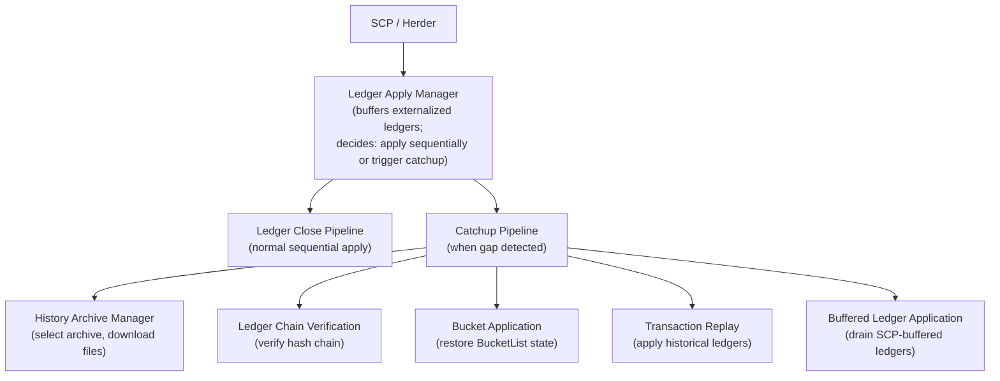
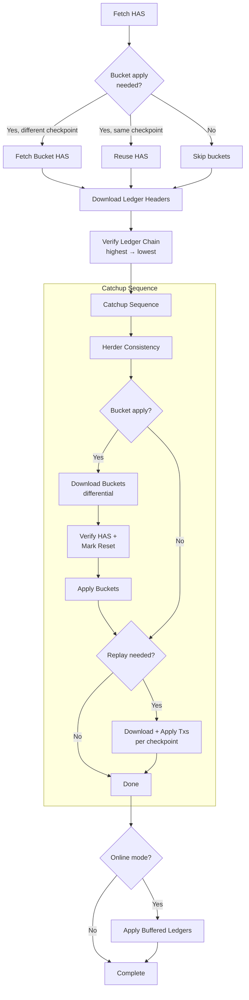
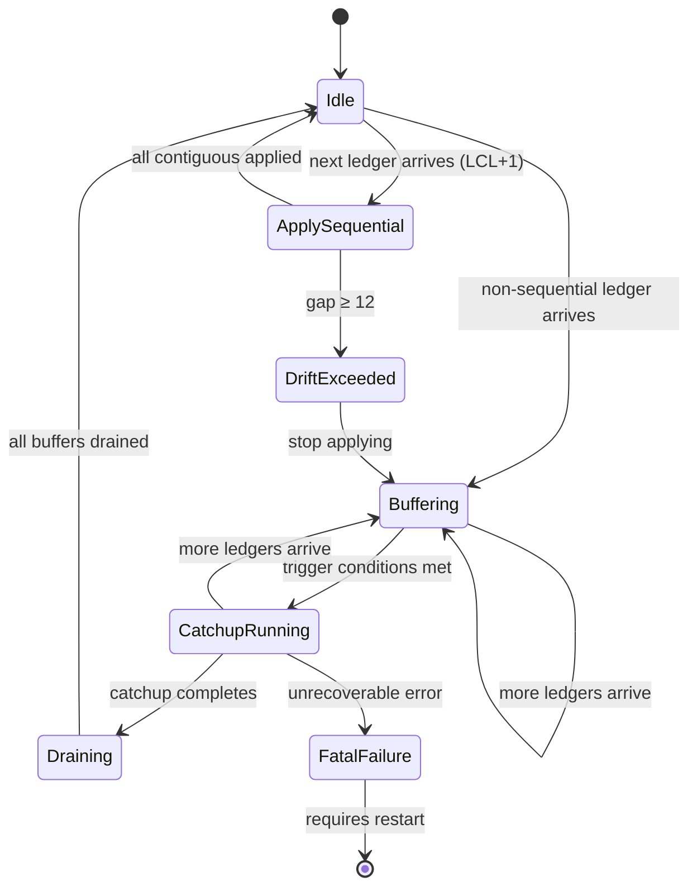
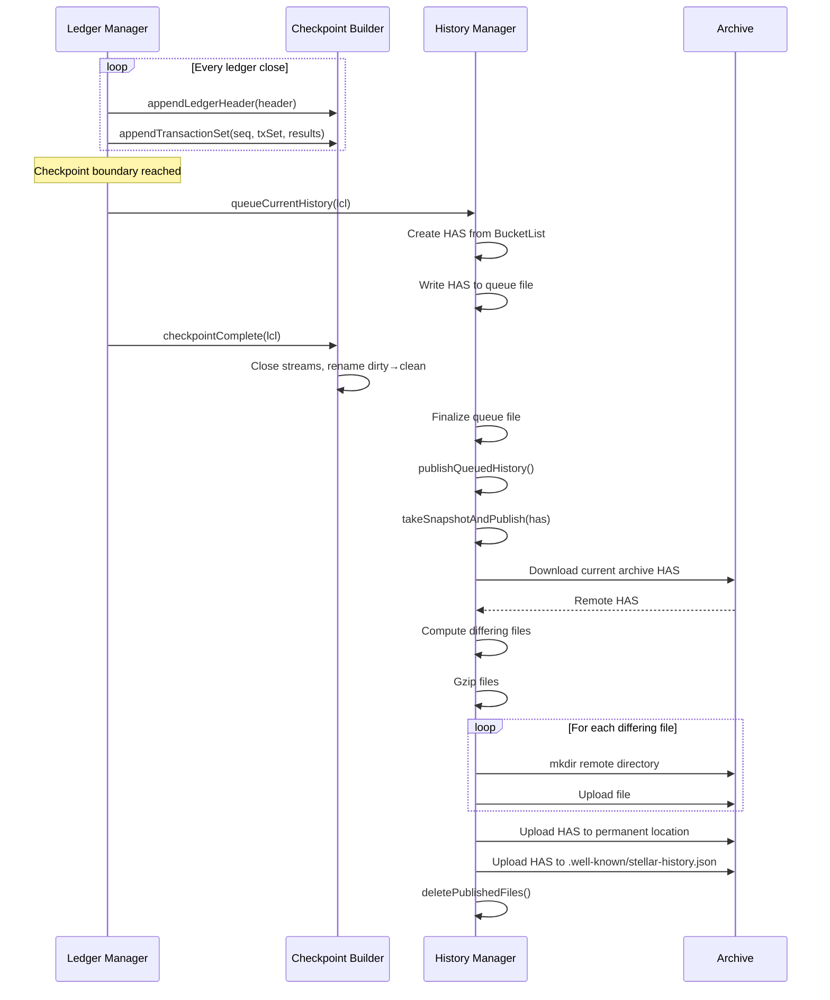
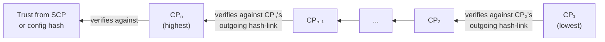

# Stellar Catchup, Replay, and History Publishing Specification

**Version:** 25 (stellar-core v25.1.1 / Protocol 25)
**Status:** Informational
**Date:** 2026-02-20

---

## Table of Contents

1. [Introduction](#1-introduction)
2. [Architecture Overview](#2-architecture-overview)
3. [Data Types and Encoding](#3-data-types-and-encoding)
4. [History Archive Structure](#4-history-archive-structure)
5. [Checkpoint Publishing Pipeline](#5-checkpoint-publishing-pipeline)
6. [Catchup Configuration and Range Computation](#6-catchup-configuration-and-range-computation)
7. [Ledger Apply Manager](#7-ledger-apply-manager)
8. [Catchup Pipeline](#8-catchup-pipeline)
9. [Ledger Chain Verification](#9-ledger-chain-verification)
10. [Bucket Application](#10-bucket-application)
11. [Transaction Replay](#11-transaction-replay)
12. [Buffered Ledger Application](#12-buffered-ledger-application)
13. [Error Handling and Recovery](#13-error-handling-and-recovery)
14. [Invariants and Safety Properties](#14-invariants-and-safety-properties)
15. [Constants](#15-constants)
16. [References](#16-references)
17. [Appendices](#17-appendices)

---

## 1. Introduction

### 1.1 Purpose and Scope

This document specifies the catchup, replay, and history publishing
subsystems as defined for stellar-core protocol 25. Together, these
subsystems enable:

- **Checkpoint publishing**: Periodically writing ledger state snapshots
  and transaction history to archival storage, so that any new or
  desynchronized node can recover.
- **Catchup**: The process by which a node that has fallen behind the
  network restores its state to a recent checkpoint and replays any
  missing ledgers to rejoin consensus.
- **Replay**: Applying historical transactions from checkpoint files
  to advance ledger state, either during catchup or for offline
  verification.
- **Ledger buffering**: Managing the queue of externalized-but-not-yet-
  applied ledgers during online operation, including the decision of
  when to trigger catchup versus direct sequential application.

This specification covers:

- History archive file structure, naming conventions, and checkpoint
  frequency.
- The HistoryArchiveState (HAS) data structure and its role in
  differential downloads.
- The checkpoint publishing workflow: incremental file building,
  checkpoint finalization, and archive upload.
- Catchup range computation: how the target ledger, replay count, and
  current state determine the catchup strategy.
- The catchup work graph: the dependency relationships between
  download, verify, and apply work items.
- Ledger chain verification: backward hash-chain verification of
  downloaded ledger headers.
- Bucket application: restoring ledger state from a BucketList
  snapshot.
- Transaction replay: downloading and applying checkpoint transaction
  files.
- Buffered ledger application: draining ledgers that arrived from
  SCP during catchup.
- Error handling, crash recovery, and retry semantics.

This specification is **implementation agnostic**. It is derived
exclusively from the vetted stellar-core C++ implementation (v25.1.1) and
its pseudocode companion (stellar-core-pc). Any conforming
implementation that produces identical ledger state for all valid inputs
is considered correct. Internal details such as work scheduling
frameworks, threading pools, and file system layouts are out of scope
except where they affect deterministic state transitions or archive
interoperability.

### 1.2 Conventions and Terminology

The key words "MUST", "MUST NOT", "REQUIRED", "SHALL", "SHALL NOT",
"SHOULD", "SHOULD NOT", "RECOMMENDED", "MAY", and "OPTIONAL" in this
document are to be interpreted as described in [RFC 2119][rfc2119].

| Term | Definition |
|------|------------|
| **Checkpoint** | A set of files published to a history archive at a regular ledger interval, containing ledger headers, transactions, results, and optionally SCP messages. |
| **Checkpoint frequency** | The number of ledgers between checkpoints. The default is 64. |
| **Checkpoint boundary** | A ledger sequence number at which a checkpoint is published. Checkpoint boundaries occur at `(N × freq) - 1` for `N ≥ 1`. |
| **HAS** | History Archive State — a JSON document describing the BucketList structure (current and snapshot bucket hashes for each level, plus any pending merges) at a given checkpoint. |
| **Catchup** | The process of restoring a node to a recent state by downloading and applying bucket snapshots and/or historical transactions from a history archive. |
| **Replay** | Applying a sequence of historical transactions from checkpoint files to advance ledger state. |
| **LCL** | Last Closed Ledger — the most recently committed ledger. |
| **Archive** | A read-only or read-write storage backend (e.g., S3, GCS, HTTP server, local filesystem) that stores history files. |
| **Bucket** | A sorted, immutable file of ledger entries belonging to a BucketList level (see BucketListDB Specification). |
| **Work** | A unit of asynchronous computation that may succeed, fail, or require retry. Work items form a dependency graph. |
| **WorkSequence** | An ordered list of work items executed sequentially — each item starts only after the previous succeeds. |
| **BatchWork** | A work item that yields sub-items incrementally (e.g., one per checkpoint). |
| **ConditionalWork** | A work wrapper that delays execution until a predicate is satisfied. |

### 1.3 Notation

This specification uses the following notation conventions:

- **XDR types**: Written in `monospace` and correspond to definitions
  in the Stellar XDR schema files.
- **Hash functions**: `SHA256(x)` denotes the SHA-256 digest of the
  XDR-serialized form of `x`.
- **Protocol versions**: `pN` denotes "protocol version N".
- **Checkpoint arithmetic**: `checkpoint(L)` denotes the checkpoint
  boundary containing ledger `L`; `firstInCheckpoint(L)` denotes the
  first ledger in the checkpoint containing `L`.
- **Hex strings**: Written as lowercase hexadecimal, zero-padded to
  the required width (8 characters for checkpoint numbers, 64
  characters for bucket hashes).

---

## 2. Architecture Overview

### 2.1 Two Parallel Workflows

The catchup and history subsystems implement two complementary
workflows:

1. **Publishing** (outbound): During normal operation, the node
   incrementally builds checkpoint files as ledgers close. At each
   checkpoint boundary, the accumulated files and a BucketList snapshot
   (HAS) are uploaded to all writable history archives.

2. **Catching up** (inbound): When a node starts fresh, restarts after
   a crash, or falls behind the network, it downloads state from a
   readable history archive and applies it to restore synchronization.

### 2.2 Catchup Strategies

There are two fundamental catchup strategies, selected based on the
gap between the node's current state and the target:

| Strategy | When Used | Operations |
|----------|-----------|------------|
| **Bucket apply + replay** | Node is at genesis or far behind | Download BucketList snapshot at a checkpoint, apply it to restore full state, then replay transactions from that checkpoint forward. |
| **Replay only** | Node is slightly behind | Replay transactions from the node's current LCL forward. No bucket download needed. |

A third degenerate case, **bucket apply only**, occurs when the target
is exactly at a checkpoint boundary and no replay is requested.

### 2.3 Component Relationships



---

## 3. Data Types and Encoding

### 3.1 History Archive State (HAS)

The `HistoryArchiveState` is the central data structure for checkpoint
coordination. It describes the complete BucketList structure at a given
ledger:

| Field | Type | Description |
|-------|------|-------------|
| `version` | `unsigned` | Format version. 1 = live buckets only; 2 = live + hot archive buckets. |
| `server` | `string` | Identifier of the software that produced this HAS. |
| `networkPassphrase` | `string` | Network passphrase (required for version ≥ 2). |
| `currentLedger` | `uint32` | The checkpoint ledger sequence number. |
| `currentBuckets` | `HistoryStateBucket[]` | One entry per BucketList level (11 levels), containing current and snapshot bucket hashes plus pending merge state. |
| `hotArchiveBuckets` | `HistoryStateBucket[]` | Hot archive BucketList levels (version ≥ 2 only). |

Each `HistoryStateBucket` contains:

| Field | Type | Description |
|-------|------|-------------|
| `curr` | `string` | Hex hash of the current bucket for this level. |
| `snap` | `string` | Hex hash of the snapshot bucket for this level. |
| `next` | `FutureBucket` | State of any pending merge for this level. |

**Invariants**:
- The number of levels MUST equal the BucketList level count (11).
- For protocol versions where shadows are removed: all `FutureBucket`
  entries MUST be in the clear state.
- Version 2 MUST include a `networkPassphrase` field.

### 3.2 BucketList Hash from HAS

The BucketList hash is computed from the HAS by hashing all level
bucket hashes:

```
For each level L in [0, numLevels):
    levelHash[L] = SHA256(currHash[L] || snapHash[L])
liveHash = SHA256(levelHash[0] || levelHash[1] || ... || levelHash[numLevels-1])

If version >= 2:
    hotHash = SHA256(hotLevelHash[0] || ... || hotLevelHash[numLevels-1])
    bucketListHash = SHA256(liveHash || hotHash)
Else:
    bucketListHash = liveHash
```

### 3.3 Differential Bucket Sets

The `differingBuckets(other)` operation computes the set of buckets
that must be downloaded to convert state `other` into state `self`:

1. Build an inhibit set containing the zero hash. Then walk all levels of `other` (in order from lowest to highest), resolving any live FutureBucket merges, and adding each level's `curr`, `snap`, and FutureBucket output hash to the inhibit set.
2. Walk levels from deepest to shallowest (highest index first).
3. For each level, collect three items in order: `snap`, `next`
   (FutureBucket output hash, or `snap` again if no output hash
   exists), and `curr`. Skip any hash that is already in the inhibit
   set.
4. Add collected hashes to the inhibit set (to avoid duplicates across
   levels).
5. Return separate lists for live and hot archive buckets.

### 3.4 Catchup Configuration

| Field | Type | Description |
|-------|------|-------------|
| `toLedger` | `uint32` | Target ledger. `0` = sentinel meaning "latest from archive". |
| `count` | `uint32` | Number of ledgers to replay. `UINT32_MAX` = complete history. `0` = minimal. |
| `mode` | `Mode` | One of `ONLINE`, `OFFLINE_BASIC`, `OFFLINE_COMPLETE`. |

Modes:

| Mode | Description |
|------|-------------|
| `ONLINE` | Node is connected to the network. Buffered ledgers from SCP are applied after catchup. |
| `OFFLINE_BASIC` | Validate only files needed for catchup. |
| `OFFLINE_COMPLETE` | Validate all history archive file types (including transaction results). |

### 3.5 Catchup Range

The result of range computation (Section 6):

| Field | Type | Description |
|-------|------|-------------|
| `applyBuckets` | `bool` | Whether to download and apply a bucket snapshot. |
| `applyBucketsAtLedger` | `uint32` | Ledger number for bucket application (0 if not applying buckets). |
| `replayRange` | `LedgerRange` | Half-open range `[first, first+count)` of ledgers to replay. |

### 3.6 Ledger Range

| Field | Type | Description |
|-------|------|-------------|
| `first` | `uint32` | First ledger in the range (inclusive). |
| `count` | `uint32` | Number of ledgers in the range. |

Derived: `limit() = first + count` (exclusive upper bound),
`last() = first + count - 1` (inclusive, only valid if `count > 0`).

### 3.7 Checkpoint Range

| Field | Type | Description |
|-------|------|-------------|
| `first` | `uint32` | First checkpoint boundary. |
| `count` | `uint32` | Number of checkpoints (not ledgers). |
| `frequency` | `uint32` | Checkpoint frequency (normally 64). |

### 3.8 File Transfer Info

Describes a single file for upload or download:

| Field | Type | Description |
|-------|------|-------------|
| `type` | `FileType` | One of `BUCKET`, `LEDGER`, `TRANSACTIONS`, `RESULTS`, `SCP`. |
| `hexDigits` | `string` | 8-character hex string (checkpoint number) or 64-character hex string (bucket hash). |

File type string mappings:

| FileType | String |
|----------|--------|
| `BUCKET` | `"bucket"` |
| `LEDGER` | `"ledger"` |
| `TRANSACTIONS` | `"transactions"` |
| `RESULTS` | `"results"` |
| `SCP` | `"scp"` |

### 3.9 Ledger Verification Status

| Status | Meaning |
|--------|---------|
| `OK` | Verification succeeded. |
| `ERR_BAD_HASH` | Hash chain mismatch. |
| `ERR_BAD_LEDGER_VERSION` | Ledger protocol version exceeds node's supported maximum. |
| `ERR_OVERSHOT` | Gap in ledger sequence (missing entries). |
| `ERR_UNDERSHOT` | Unexpected duplicate or backward sequence. |
| `ERR_MISSING_ENTRIES` | File ended before the expected ledger count. |

---

## 4. History Archive Structure

### 4.1 Archive File Layout

History archives use a hierarchical directory structure based on
hexadecimal checkpoint numbers:

```
.well-known/
    stellar-history.json                    # Latest HAS (RFC 5785)

history/
    XX/YY/ZZ/history-XXYYZZMM.json         # HAS per checkpoint

ledger/
    XX/YY/ZZ/ledger-XXYYZZMM.xdr.gz        # Ledger headers per checkpoint

transactions/
    XX/YY/ZZ/transactions-XXYYZZMM.xdr.gz  # Transactions per checkpoint

results/
    XX/YY/ZZ/results-XXYYZZMM.xdr.gz       # Transaction results per checkpoint

scp/
    XX/YY/ZZ/scp-XXYYZZMM.xdr.gz           # SCP messages per checkpoint (optional)

bucket/
    AA/BB/CC/bucket-{64-char-hex-hash}.xdr.gz  # Bucket files by content hash
```

Where `XXYYZZMM` is the 8-character hex encoding of the checkpoint
ledger number, and `XX/YY/ZZ` are the first three pairs of hex digits
used as directory components.

### 4.2 Path Construction

Given an 8-character hex string `AABBCCDD`:

```
hexDir("AABBCCDD")  = "AA/BB/CC"
remoteDir(type, hex) = "{type}/AA/BB/CC"
remoteName(type, hex) = "{type}/AA/BB/CC/{type}-AABBCCDD.xdr.gz"
```

For HAS files, the suffix is `.json` instead of `.xdr.gz`.

For bucket files, the hex string is the 64-character SHA-256 hash of
the bucket contents.

### 4.3 Checkpoint Frequency and Arithmetic

**Checkpoint frequency**: 64 ledgers (production).

Checkpoint boundaries occur at ledger numbers `(N × 64) - 1` for
`N ≥ 1`, giving the sequence: 63, 127, 191, 255, ...

The first checkpoint contains ledgers 1–63 (63 ledgers, since ledger 0
is not a real ledger). All subsequent checkpoints contain exactly 64
ledgers.

Key arithmetic functions:

| Function | Formula | Example (freq=64) |
|----------|---------|-------------------|
| `checkpointContaining(L)` | `(⌊L / freq⌋ + 1) × freq - 1` (where ⌊⌋ denotes integer division / floor) | L=100 → 127 |
| `isFirstInCheckpoint(L)` | `L == checkpointContaining(L) - freq + 1` or `L == 1` | L=64 → true |
| `isLastInCheckpoint(L)` | `L == checkpointContaining(L)` | L=127 → true |
| `firstInCheckpointContaining(L)` | `checkpointContaining(L) - sizeOf(L) + 1` | L=100 → 64 |
| `lastBeforeCheckpointContaining(L)` | `firstInCheckpointContaining(L) - 1` | L=100 → 63 |
| `sizeOfCheckpointContaining(L)` | `L < freq ? freq - 1 : freq` | L=50 → 63 |
| `firstLedgerAfterCheckpointContaining(L)` | `firstInCheckpointContaining(L) + sizeOfCheckpointContaining(L)` | L=100 → 128 |

### 4.4 Checkpoint File Contents

Each checkpoint file contains XDR-serialized entries for the ledgers
in that checkpoint:

| File Type | Entry Type | Entries Per Checkpoint |
|-----------|------------|----------------------|
| `ledger` | `LedgerHeaderHistoryEntry` | One per ledger (exactly `freq` or `freq-1` for the first checkpoint). |
| `transactions` | `TransactionHistoryEntry` | One per ledger that has transactions. MAY be absent for empty ledgers. |
| `results` | `TransactionHistoryResultEntry` | One per ledger that has transactions. MAY be absent for empty ledgers. |
| `scp` | `SCPHistoryEntry` | Optional. SCP messages for the checkpoint's ledgers. |

Transaction and result files MAY have gaps (empty ledgers produce no
entries). Ledger header files MUST NOT have gaps — every ledger in the
checkpoint MUST have a header entry.

### 4.5 HAS File Format

The HAS is serialized as JSON:

```json
{
    "version": 1,
    "server": "<implementation-defined version string>",
    "networkPassphrase": "Public Global Stellar Network ; September 2015",
    "currentLedger": 127,
    "currentBuckets": [
        {
            "curr": "abcdef0123456789...",
            "next": { "state": 0 },
            "snap": "fedcba9876543210..."
        }
    ],
    "hotArchiveBuckets": [...]
}
```

The `next` field encodes the `FutureBucket` state (see BucketListDB
Specification, Section 7).

### 4.6 The Well-Known Endpoint

Every archive MUST maintain a `.well-known/stellar-history.json` file
pointing to the latest published HAS. This file is overwritten at
every checkpoint publication and serves as the entry point for catchup.

---

## 5. Checkpoint Publishing Pipeline

### 5.1 Overview

Checkpoint publishing is an incremental, multi-phase process that runs
during normal ledger close operations:

1. **Incremental building**: As each ledger closes, its header,
   transactions, and results are appended to open checkpoint files.
2. **Checkpoint finalization**: When a checkpoint boundary is reached,
   the open files are finalized (closed and renamed).
3. **HAS construction**: A HAS is created from the current BucketList
   state and queued for publishing.
4. **Archive upload**: The queued HAS and any new or changed files are
   uploaded to all writable archives.

### 5.2 Incremental Checkpoint Building

During each ledger close, the checkpoint builder:

1. SHALL lazily open output streams for ledger headers, transactions,
   and results on the first write of a new checkpoint.
2. SHALL append a `LedgerHeaderHistoryEntry` (containing the header
   and its SHA-256 hash) for every ledger.
3. SHALL append `TransactionHistoryEntry` and
   `TransactionHistoryResultEntry` only for ledgers with non-empty
   transaction sets.
4. SHALL write to temporary ("dirty") files with fsync for durability.

File naming during building uses a `.dirty` suffix to distinguish
in-progress files from finalized ones.

### 5.3 Checkpoint Finalization

When a ledger at a checkpoint boundary closes:

1. The checkpoint builder SHALL close all open output streams.
2. Each dirty file SHALL be renamed to its canonical name (removing
   the `.dirty` suffix) via a durable rename operation.
3. If the canonical file already exists (e.g., from a previous
   interrupted run), the rename is skipped.

### 5.4 HAS Queue

At each checkpoint boundary:

1. A HAS SHALL be constructed from the current BucketList (live and,
   for protocol 24+, hot archive).
2. The HAS SHALL be serialized and written to a queue file
   (`{hex}.checkpoint.dirty`, then renamed to `{hex}.checkpoint`).
3. The queue file is created before the ledger commit and finalized
   after.

Note: The HAS queue files stored locally use binary (cereal) serialization for efficiency and durability, NOT the JSON format used for archive-uploaded HAS files. The queue files are written with fsync for crash safety.

### 5.5 Archive Upload

The upload process, triggered after checkpoint finalization:

1. **Resolve**: Ensure all BucketList merges referenced in the HAS are
   resolved. Wait for the configured `PUBLISH_TO_ARCHIVE_DELAY` duration (a time-based delay, not ledger-count-based) to avoid publishing data from a potentially diverged node.

2. **Write SCP messages**: If the node records SCP messages, write
   them to the SCP checkpoint file.

3. **Upload**: For each writable archive:
   a. Download the archive's current HAS to determine what files it
      already has.
   b. Compute the differential: files present locally but not on the
      archive (using `differingBuckets` for buckets, plus the new
      checkpoint's ledger/transaction/result/SCP files).
   c. Gzip all files to be uploaded.
   d. Create remote directories as needed.
   e. Upload each differing file.
   f. Upload the new HAS to both its permanent location
      (`history/{XX}/{YY}/{ZZ}/history-{hex}.json`) and the
      well-known location (`.well-known/stellar-history.json`).

4. **Cleanup**: On successful upload, delete local copies of published
   files (up to 100 checkpoints of historical files).

### 5.6 Publish Queue Backpressure

The system maintains a maximum publish queue size:

- `PUBLISH_QUEUE_MAX_SIZE = 16`: When the number of queued checkpoints
  exceeds this, transaction replay during catchup is paused.
- `PUBLISH_QUEUE_UNBLOCK_APPLICATION = 8`: Replay resumes when the
  queue drains to this level.

This backpressure applies only during offline catchup to prevent
unbounded queue growth when replaying faster than publishing.

### 5.7 Crash Recovery

On startup, the checkpoint builder recovers valid state:

1. For each file type, if the canonical file exists for the current
   checkpoint, any dirty files for the next checkpoint are deleted.
2. If only a dirty file exists, it is read entry-by-entry. Entries up
   to and including the LCL are preserved; entries beyond the LCL are
   truncated. Partial XDR entries (from crashes mid-write) are
   detected via deserialization errors and cause truncation at the
   last valid entry.
3. Ledger header files MUST end exactly at the LCL. Transaction and
   result files may have gaps (empty ledgers).
4. Stale HAS queue files above the LCL are removed.

---

## 6. Catchup Configuration and Range Computation

### 6.1 Configuration Resolution

If the catchup configuration specifies `toLedger = 0` (the `CURRENT`
sentinel), it MUST be resolved to the latest checkpoint available on
the archive before range computation proceeds. This is done by
downloading the `.well-known/stellar-history.json` from the archive.

### 6.2 Range Computation Algorithm

Given:
- `lcl`: the current Last Closed Ledger sequence number
- `cfg.toLedger`: the resolved target ledger
- `cfg.count`: the number of ledgers to replay

The catchup range is computed as follows:

**Preconditions** (all MUST hold):
- `lcl ≥ GENESIS_LEDGER_SEQ` (≥ 1)
- `cfg.toLedger > lcl`
- `cfg.toLedger > GENESIS_LEDGER_SEQ`
- `cfg.toLedger ≠ CURRENT` (must be resolved)

Let `fullReplayCount = cfg.toLedger - lcl`.

| Case | Condition | Result |
|------|-----------|--------|
| 1 | `lcl > GENESIS` | Replay only: range = `[lcl+1, cfg.toLedger]` |
| 2 | `lcl == GENESIS` AND `cfg.count ≥ fullReplayCount` | Full replay: range = `[GENESIS+1, cfg.toLedger]` |
| 3 | `lcl == GENESIS` AND `cfg.count == 0` AND `cfg.toLedger` is the last ledger of a checkpoint (`isLastLedgerInCheckpoint(toLedger)`) | Buckets only at `cfg.toLedger`, no replay |
| 4 | `lcl == GENESIS` AND `firstInCheckpoint(cfg.toLedger - cfg.count + 1) == GENESIS` | Full replay: range = `[GENESIS+1, cfg.toLedger]` |
| 5 | Otherwise | Apply buckets at `lastBeforeCheckpoint(cfg.toLedger - cfg.count + 1)`, then replay from `firstInCheckpoint(cfg.toLedger - cfg.count + 1)` to `cfg.toLedger` |

### 6.3 Range Invariants

The computed range MUST satisfy:

1. At least one operation (bucket apply or replay) MUST be requested.
2. If both bucket apply and replay: `applyBucketsAtLedger + 1 == replayRange.first`.
3. If bucket apply only: `replayRange.first == 0` and `replayRange.count == 0`.
4. If replay only: `applyBucketsAtLedger == 0` and `replayRange.first > 0`.

---

## 7. Ledger Apply Manager

### 7.1 Overview

The ledger apply manager sits between the herder (which delivers
externalized SCP values) and the ledger close pipeline. It decides
whether each incoming ledger can be applied immediately or must be
buffered pending catchup.

### 7.2 Ledger Buffering

Externalized ledgers are buffered in a map keyed by sequence number.
The buffer maintains these invariants:

1. Only ledgers with sequence numbers greater than `lastQueuedToApply`
   are buffered.
2. The buffer spans at most one checkpoint plus one boundary ledger
   (~65 ledgers: 64 + 1).
3. Old ledgers are trimmed when no longer needed.

### 7.3 Process Ledger Decision Tree

When a new externalized ledger arrives via `processLedger`:

```
1. If catchup work exists and has completed:
   - If catchup failed fatally → set permanent failure flag
   - Clear catchup work reference

2. If ledger.seq ≤ lastQueuedToApply → skip (already processed)

3. Buffer the ledger in syncingLedgers
4. Update largestLedgerSeqHeard

5. If no catchup running AND ledger is next sequential (LCL + 1):
   → tryApplySyncingLedgers() (fast path: apply contiguous ledgers)
   → return PROCESSED_ALL_LEDGERS_SEQUENTIALLY

6. If catchup is running:
   → If ledger.seq ≤ catchup's configured `toLedger` → skip trim, return WAIT_TO_APPLY_BUFFERED_OR_CATCHUP immediately
   → Otherwise: trim buffer, return WAIT_TO_APPLY_BUFFERED_OR_CATCHUP

7. No catchup running, gap detected:
   → trim buffer
   → If modeDoesCatchupWithBucketList()
     AND first buffered ledger is at a checkpoint boundary
     AND more than one ledger is buffered
     AND pipeline is not currently applying:
       → If !catchupFatalFailure:
           startOnlineCatchup()
         Else:
           log fatal error (incompatible core version or invalid state)
     When the first buffered ledger is NOT at a checkpoint boundary, the system computes a `ledgerToTriggerCatchup` as `firstLedgerInBufferedCheckpoint + 1` — meaning the node waits until it has one ledger past the first checkpoint boundary in its buffer before triggering catchup.
   → return WAIT_TO_APPLY_BUFFERED_OR_CATCHUP
```

### 7.4 Sequential Application

The `tryApplySyncingLedgers` procedure applies contiguous buffered
ledgers:

1. Iterate through the buffer starting from `lastQueuedToApply + 1`.
2. For each contiguous ledger: apply it via the normal ledger close
   pipeline.
3. Stop if a gap is encountered or if the apply drift reaches
   `MAX_EXTERNALIZE_LEDGER_APPLY_DRIFT` (12 ledgers; the check uses
   `>=`, so exactly 12 triggers it). The drift is measured as `nextToApply - actualLCL` (where actualLCL is the last closed ledger from LedgerManager, which may lag behind `lastQueuedToApply` in parallel close mode). Reaching this threshold means the apply pipeline is falling too far behind SCP
   and catchup should be triggered instead.
4. Remove applied ledgers from the buffer.

### 7.5 Online Catchup Trigger

When the ledger apply manager decides to start catchup:

1. The target ledger is `firstBufferedLedger.seq - 1`.
2. The target hash is obtained from the first buffered ledger's
   `previousLedgerHash` field.
3. The catchup count is determined by the node's configuration
   (complete history = `UINT32_MAX`, recent history = configured
   count).
4. Mode is `ONLINE`.
5. The catchup pipeline is started asynchronously.

### 7.6 Buffer Trimming

The buffer is trimmed to maintain its size invariant:

1. Remove all ledgers with sequence numbers below
   `lastQueuedToApply + 1`.
2. If the last buffered ledger is the **first ledger** in a checkpoint, keep that ledger plus the entire previous checkpoint (since the checkpoint containing the last buffered ledger may not have been published yet).
3. Otherwise, keep only ledgers from the first ledger of the checkpoint containing the last buffered ledger onward.

---

## 8. Catchup Pipeline

### 8.1 Overview

The catchup pipeline is the top-level orchestrator that coordinates
all catchup operations. It proceeds through multiple phases, each
composed of work items arranged in a dependency graph.

### 8.2 Phase 1: Fetch History Archive State

1. Download the HAS from a provided archive, or from a randomly
   selected readable archive if none is specified, for the target
   checkpoint.
2. Validate that the network passphrase matches.
3. Validate that the HAS checkpoint ledger is greater than the current
   LCL.
4. If bucket application is needed at a different checkpoint than the
   target, download a separate HAS for the bucket checkpoint.

### 8.3 Phase 2: Download and Verify Ledger Chain

1. Download ledger header files for the entire catchup range (as a
   batch, one file per checkpoint).
2. Verify the ledger hash chain (Section 9).
3. These two operations execute sequentially: download first, then
   verify.

### 8.4 Phase 3: Build Catchup Sequence

Once the ledger chain is verified, the main catchup sequence is
constructed:

1. **Herder consistency work**: Set the herder's tracking state to
   match the verified ledger chain.

2. **Transaction result verification** (offline-complete mode only):
   Download and verify transaction result files for the range.

3. **Bucket download-verify-apply** (if bucket application is needed):
   a. Download differing buckets (Section 10.1).
   b. Verify bucket hashes and the HAS structure.
   c. Apply buckets to restore ledger state (Section 10).

4. **Transaction download-apply** (if replay is needed):
   Download and apply transaction files checkpoint by checkpoint
   (Section 11).

### 8.5 Phase 4: Apply Buffered Ledgers

After the catchup sequence completes (online mode only):

1. Set the LCL from the verified ledger chain start (after bucket
   apply).
2. Drain the buffered ledger queue by applying each buffered ledger
   sequentially (Section 12).

### 8.6 Completion

After all phases complete:

1. Verify that the last applied ledger hash matches the expected hash
   from the ledger manager.
2. Clear the catchup work reference.
3. The ledger apply manager resumes normal sequential application.

---

## 9. Ledger Chain Verification

### 9.1 Overview

Ledger chain verification ensures the integrity of downloaded ledger
header files by checking the cryptographic hash chain. Verification
proceeds **backwards** from the highest checkpoint to the lowest,
using hash links to chain trust.

### 9.2 Trust Establishment

Trust is established from the highest checkpoint:

- For **online** catchup: the trusted hash comes from SCP consensus
  (the `previousLedgerHash` from the first buffered ledger).
- For **offline** catchup: the trusted hash may be provided
  explicitly in the catchup configuration.

### 9.3 Verification Algorithm

For each checkpoint (processed from highest to lowest):

1. Open the ledger header file for the checkpoint.
2. Read entries sequentially (low to high within the file):
   a. **First entry**: Verify it is the first ledger in the checkpoint.
      Verify `SHA256(header) == storedHash`.
   b. **Subsequent entries**: Verify `seq == prev.seq + 1` (no gaps).
      Verify `SHA256(header) == storedHash`. Verify
      `prev.storedHash == header.previousLedgerHash` (hash chain).
   c. If `entry.seq == LCL.seq`: verify `storedHash == LCL.hash`.
      If they disagree, mark `chainDisagreesWithLocalState`.
   d. If `entry.seq == LCL.seq + 1`: verify
      `header.previousLedgerHash == LCL.hash`.
   e. If `header.ledgerVersion > supportedMaxVersion`: mark
      `chainDisagreesWithLocalState`.
3. After scanning the file:
   a. Set the **outgoing hash link**: `(firstEntry.seq - 1, firstEntry.header.previousLedgerHash)`.
   b. Read the **incoming hash link** from the next-higher checkpoint
      (or from the trusted SCP hash for the highest checkpoint).
   c. Verify the last entry in the checkpoint matches the incoming
      hash link.

### 9.4 Lowest Checkpoint Finalization

At the lowest checkpoint:

1. Record the maximum verified ledger in that checkpoint (used as the
   bucket apply point for the subsequent bucket application phase).
2. Set the verified minimum ledger predecessor (the outgoing hash
   link from the lowest checkpoint).

### 9.5 Fatal Failure Detection

If the chain disagrees with local state AND the initial trust hash
came from SCP consensus (not user-provided), the verification sets a
**fatal failure** flag. This indicates the node has a locally corrupted
state that cannot be recovered by catchup, and the node MUST NOT
attempt further catchup until restarted.

---

## 10. Bucket Application

### 10.1 Bucket Download

Buckets are downloaded differentially:

1. Compute the set of buckets needed using
   `differingBuckets(localHAS)` (Section 3.3).
2. Download each bucket file from the archive, decompress (gunzip),
   and verify:
   a. Check file size does not exceed `MAX_HISTORY_ARCHIVE_BUCKET_SIZE`
      (100 GB).
   b. Compute SHA-256 while streaming through the file and building
      the index.
   c. Verify the computed hash matches the expected hash.
3. Adopt each verified bucket into the bucket manager.

### 10.2 Bucket Application Algorithm

After all buckets are downloaded and verified (see also
**BUCKETLISTDB_SPEC §13** for BucketApplicator implementation details):

**Step 1: Index buckets**

For each non-empty live bucket that does not already have an index,
create one (either by loading from disk or building from the bucket
file). Indexing MAY proceed in parallel across buckets.

**Step 2: Apply entries to persistent storage**

Iterate through buckets in priority order (highest priority first):
- Level 0 current, Level 0 snapshot, Level 1 current, Level 1
  snapshot, ..., Level 10 current, Level 10 snapshot.

For each bucket:
1. Create a bucket applicator that streams entries from the bucket.
2. For each entry, check if its key has been seen in a higher-priority
   bucket. If so, skip it.
3. If the key has not been seen, write it to persistent storage.
4. Add the key to the seen-keys set.

This process ensures that only the newest version of each entry
(from the highest-priority bucket) is written.

**Step 3: Assume state**

1. Index any remaining un-indexed buckets (live and hot archive).
2. Tell the bucket manager to assume the target HAS state, adopting
   all bucket files and restarting any necessary merges.
3. Run invariant checks to verify the assumed state is consistent.

### 10.3 Post-Bucket-Apply State Setup

After bucket application completes:

1. Set the LCL to the verified ledger at the bucket checkpoint.
2. Store the ledger header in persistent storage.
3. If the protocol version supports it (p23+): compile all contract
   modules and populate the in-memory Soroban state.
4. Transition the apply state from `SETTING_UP_STATE` to
   `READY_TO_APPLY`.

---

## 11. Transaction Replay

### 11.1 Overview

Transaction replay downloads checkpoint transaction files and applies
them one ledger at a time to advance the ledger state from the bucket
apply point (or current LCL) to the target ledger.

### 11.2 Per-Checkpoint Workflow

For each checkpoint in the replay range:

1. **Download**: Fetch and decompress the transaction file for the
   checkpoint.

2. **Apply**: For each ledger in the checkpoint's range:
   a. Read the next `LedgerHeaderHistoryEntry` from the downloaded
      ledger header file.
   b. Read the transaction set from the downloaded transaction file.
   c. Verify the transaction set hash matches the header's
      `scpValue.txSetHash`.
   d. Verify the header's `previousLedgerHash` matches the current
      LCL hash.
   e. Construct a `LedgerCloseData` and apply it via the normal
      ledger close pipeline (see Ledger Specification).
   f. Verify the resulting ledger hash matches the expected hash from
      the downloaded header.

3. **Cleanup**: Delete the temporary transaction file.

### 11.3 Ordering and Dependencies

Checkpoints are processed sequentially (each checkpoint's apply phase
depends on the previous checkpoint completing). However, downloads
MAY overlap with application — the next checkpoint's files can be
downloaded while the current checkpoint is being applied.

Each ledger within a checkpoint is applied sequentially. Before each
ledger application, the pipeline MUST wait for any pending BucketList
merges to resolve (using a conditional wait with polling).

### 11.4 Backpressure

During offline catchup, transaction replay is gated on the publish
queue:

- If the publish queue contains more than `PUBLISH_QUEUE_MAX_SIZE`
  (16) queued checkpoints, replay pauses.
- Replay resumes when the queue drains to `PUBLISH_QUEUE_UNBLOCK_APPLICATION` (8).

This prevents unbounded history accumulation when replay outpaces
archive publishing.

### 11.5 Transaction File Gaps

Transaction and result files may have gaps for empty ledgers (ledgers
with no transactions). The replay algorithm handles this by using a
"get entry for ledger" function that:

1. Reads entries from the stream, advancing past entries with sequence
   numbers below the target.
2. Returns the entry if an exact match is found.
3. Returns null if the stream reaches a sequence number beyond the
   target (indicating a gap — the target ledger had no transactions).

When a gap is detected, the ledger is applied with an empty
transaction set.

---

## 12. Buffered Ledger Application

### 12.1 Purpose

During online catchup, ledgers continue to arrive from SCP and are
buffered by the ledger apply manager. After the catchup pipeline
completes (bucket apply + transaction replay), the buffered ledgers
must be applied to bring the node fully up to date.

### 12.2 Algorithm

1. Query the ledger apply manager for the next buffered ledger
   (`LCL + 1` from the buffer).
2. If no buffered ledger is available, the catchup is complete.
3. If a buffered ledger is available:
   a. Wait for any pending BucketList merges to resolve.
   b. Apply the ledger via the normal ledger close pipeline.
   c. Repeat from step 1.

### 12.3 Transition to Normal Operation

Once all buffered ledgers are drained:

1. The catchup work signals success.
2. The ledger apply manager detects catchup completion on the next
   `processLedger` call.
3. The manager clears its catchup work reference and resumes normal
   sequential application.
4. Subsequent externalized ledgers are applied directly without
   buffering (as long as they are contiguous).

---

## 13. Error Handling and Recovery

### 13.1 Retry Semantics

| Component | Retry Policy |
|-----------|-------------|
| Catchup pipeline (top-level) | No retry — single attempt. |
| HAS download | Up to 10 retries with archive rotation (CatchupWork overrides the default RETRY_A_FEW for reliability). |
| Ledger header download | Up to `RETRY_A_LOT` (32) retries with archive rotation. |
| Bucket download | Up to `RETRY_A_LOT` (32) retries with archive rotation. |
| Transaction file download | Up to `RETRY_A_LOT` (32) retries with archive rotation. |
| Ledger chain verification | No retry. |
| Bucket application | No retry. |
| Transaction replay (per-checkpoint) | No retry. |
| Ledger application | No retry. |

### 13.2 Archive Rotation

When a download fails, the system MAY rotate to a different randomly
selected readable archive for the retry. Archives are classified as:

| Type | Has Get | Has Put | Usage |
|------|---------|---------|-------|
| Read-only | Yes | No | Preferred for catchup downloads. |
| Read-write | Yes | Yes | Used for both downloading and publishing. |
| Write-only | No | Yes | Invalid configuration. |
| Inert | No | No | Invalid configuration. |

Read-only archives are preferred for downloads to avoid load on
publishing archives.

### 13.3 Fatal Catchup Failure

A fatal catchup failure occurs when:

1. The verified ledger chain disagrees with the local LCL, AND
2. The trust hash was obtained from SCP consensus (indicating the
   local state is corrupt, not just stale).

When fatal failure is detected:

1. The `catchupFatalFailure` flag is set.
2. No further catchup attempts are made.
3. The node requires manual intervention (restart with fresh state).

### 13.4 Crash Recovery During Catchup

If the node crashes during catchup:

1. On restart, the checkpoint builder recovers valid checkpoint files
   (Section 5.7).
2. The LCL is restored from persistent storage.
3. If the crash occurred after bucket application but before
   completing transaction replay, the node will re-trigger catchup
   from the current LCL (which was advanced by the bucket apply).
4. If the crash occurred before bucket application, the node
   re-triggers catchup from scratch.

### 13.5 Hash Verification Failures

If a downloaded file fails hash verification:

- **Bucket files**: The download is retried (possibly from a different
  archive). If retries are exhausted, the catchup fails.
- **Ledger headers**: Chain verification reports the specific error
  type (bad hash, bad version, etc.) and the catchup fails.
- **Transaction sets**: The transaction set hash is verified against
  the ledger header's `scpValue.txSetHash` during replay. A mismatch
  causes a fatal error.

---

## 14. Invariants and Safety Properties

### 14.1 Hash Chain Integrity

**INV-C1**: Every applied ledger MUST have its `previousLedgerHash`
verified against the actual hash of the preceding ledger. This
invariant holds both during verification of downloaded headers and
during transaction replay.

### 14.2 Bucket Hash Integrity

**INV-C2**: Every downloaded bucket file MUST have its SHA-256 hash
verified against the hash stored in the HAS. Bucket files with
mismatched hashes MUST NOT be applied.

### 14.3 Transaction Set Integrity

**INV-C3**: During transaction replay, the transaction set hash MUST
match the `scpValue.txSetHash` in the corresponding ledger header.
A mismatch indicates a corrupt archive or a consensus divergence.

### 14.4 BucketList Hash After Bucket Apply

**INV-C4**: After bucket application, the `bucketListHash` derived
from the HAS MUST match the `bucketListHash` in the verified ledger
header at the bucket apply point.

### 14.5 Ledger Hash After Replay

**INV-C5**: After replaying each ledger, the resulting ledger hash
MUST match the hash recorded in the downloaded ledger header file.
A mismatch indicates a determinism violation.

### 14.6 Catchup Range Consistency

**INV-C6**: If the catchup range includes both bucket application and
replay, the bucket apply ledger MUST be exactly one less than the
first replay ledger (`applyBucketsAtLedger + 1 == replayRange.first`).

### 14.7 Buffer Monotonicity

**INV-C7**: The ledger apply manager's `lastQueuedToApply` MUST be
monotonically non-decreasing. Ledgers with sequence numbers at or
below this value are silently ignored.

### 14.8 Checkpoint Completeness

**INV-C8**: A checkpoint file MUST contain entries for all ledgers in
its range. For ledger header files, this means exactly one entry per
ledger. For transaction and result files, entries MAY be absent for
empty ledgers, but if present, MUST match the correct sequence number.

### 14.9 Merge Resolution Before Apply

**INV-C9**: Before any ledger is applied (whether during replay or
buffered ledger application), all pending BucketList merges MUST be
resolved. Applying a ledger while merges are pending would produce
incorrect BucketList hashes.

### 14.10 Archive File Immutability

**INV-C10**: Once published, archive files (except
`.well-known/stellar-history.json`) MUST NOT be modified. Bucket files
are immutable by content-hash naming. Checkpoint files are immutable
by checkpoint number. Only the well-known endpoint is overwritten at
each checkpoint.

---

## 15. Constants

| Constant | Value | Description |
|----------|-------|-------------|
| `CHECKPOINT_FREQUENCY` | 64 | Ledgers per checkpoint (production). |
| `GENESIS_LEDGER_SEQ` | 1 | Sequence number of the genesis ledger. |
| `PUBLISH_QUEUE_MAX_SIZE` | 16 | Maximum queued checkpoints before replay pauses. |
| `PUBLISH_QUEUE_UNBLOCK_APPLICATION` | 8 | Queue level at which replay resumes. |
| `MAX_EXTERNALIZE_LEDGER_APPLY_DRIFT` | 12 | Maximum gap between SCP and apply before catchup triggers. |
| `MAX_HISTORY_ARCHIVE_BUCKET_SIZE` | 100 GB | Maximum allowed bucket file size. |
| `HAS_VERSION_BEFORE_HOT_ARCHIVE` | 1 | HAS version without hot archive. |
| `HAS_VERSION_WITH_HOT_ARCHIVE` | 2 | HAS version with hot archive (protocol 24+). |

---

## 16. References

| Reference | Description |
|-----------|-------------|
| [rfc2119] | Bradner, S., "Key words for use in RFCs to Indicate Requirement Levels", BCP 14, RFC 2119, March 1997. |
| [rfc5785] | Nottingham, M., Hammer-Lahav, E., "Defining Well-Known Uniform Resource Identifiers (URIs)", RFC 5785, April 2010. |
| [stellar-core] | stellar-core v25.1.1 source code, `src/catchup/`, `src/history/`. |
| [stellar-core-pc] | stellar-core pseudocode companion, `src/catchup/`, `src/history/`. |
| [BucketListDB Spec] | Stellar BucketList and BucketListDB Specification (companion document). |
| [Ledger Spec] | Stellar Ledger Close Pipeline Specification (companion document). |
| [SCP Spec] | Stellar Consensus Protocol (SCP) Specification (companion document). |

---

## 17. Appendices

### Appendix A: Catchup Pipeline Work Graph



### Appendix B: Ledger Apply Manager State Machine



### Appendix C: Checkpoint Publishing Sequence



### Appendix D: Ledger Chain Verification Direction

Verification proceeds from the highest checkpoint down to the lowest,
with each checkpoint verified against the hash-link provided by its
successor:



### Appendix E: Catchup Range Examples

**Example 1: Minimal catchup (node at genesis, target = checkpoint 127)**
```
LCL = 1 (genesis), toLedger = 127, count = 0
→ Case 3: Buckets only at 127, no replay
→ applyBuckets = true, applyBucketsAtLedger = 127, replayRange = (0, 0)
```

**Example 2: Recent catchup (node at genesis, target = 200, count = 50)**
```
LCL = 1, toLedger = 200, count = 50
targetStart = 200 - 50 + 1 = 151
firstInCheckpoint(151) = 128
lastBeforeCheckpoint(151) = 127
→ Case 5: Buckets at 127, replay [128, 200]
→ applyBuckets = true, applyBucketsAtLedger = 127, replayRange = (128, 73)
```

**Example 3: Complete catchup (node at genesis, target = 200, count = max)**
```
LCL = 1, toLedger = 200, count = UINT32_MAX
fullReplayCount = 199, count ≥ fullReplayCount
→ Case 2: Full replay [2, 200]
→ applyBuckets = false, replayRange = (2, 199)
```

**Example 4: Online catchup (node fell behind)**
```
LCL = 500, toLedger = 700, count = 100
→ Case 1: Replay only [501, 700]
→ applyBuckets = false, replayRange = (501, 200)
```

[rfc2119]: https://www.rfc-editor.org/rfc/rfc2119
[rfc5785]: https://www.rfc-editor.org/rfc/rfc5785
