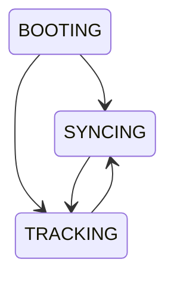
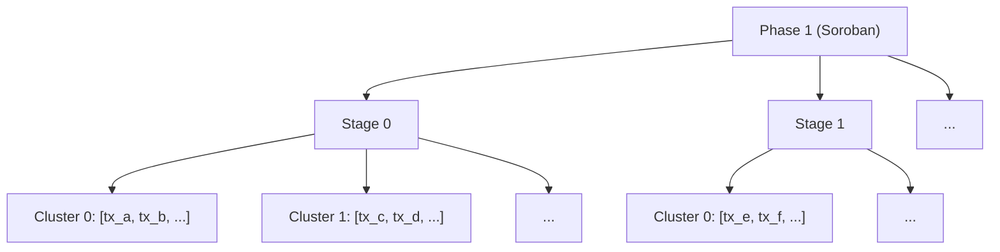
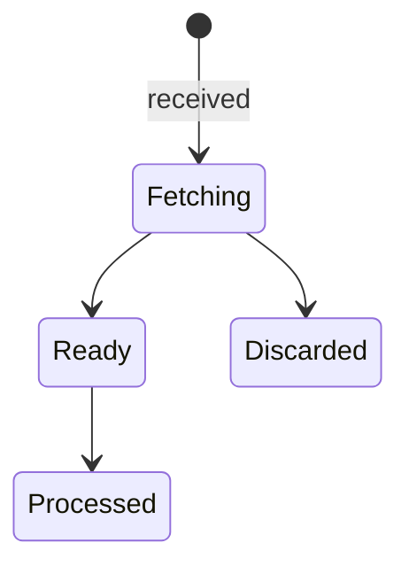
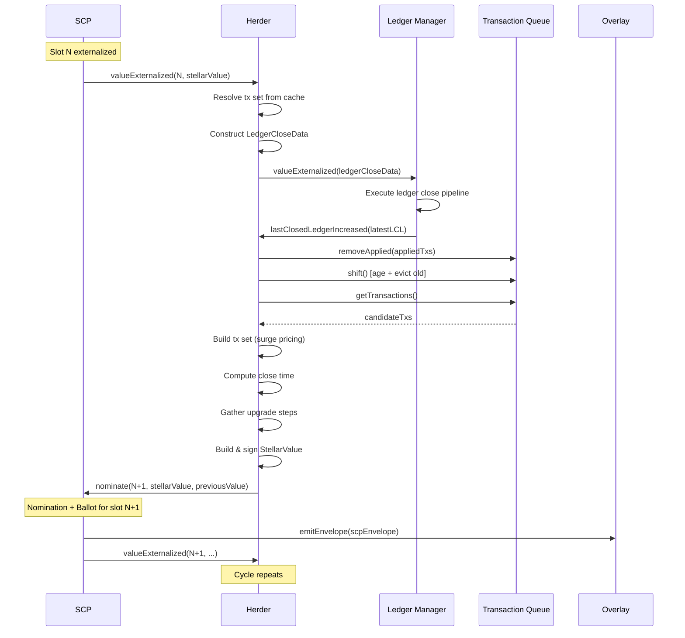
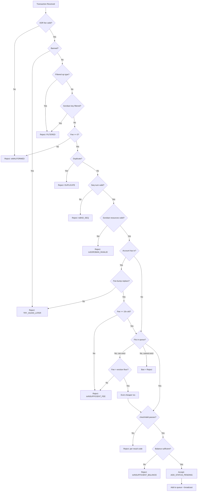
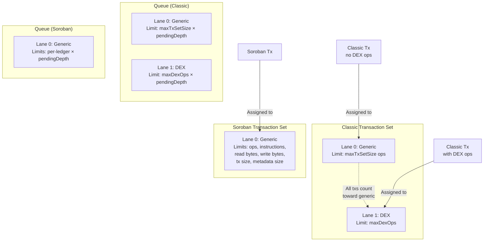

# Herder Specification

**Version:** 25 (stellar-core v25.1.1 / Protocol 25)
**Status:** Informational
**Date:** 2026-02-20

---

## Table of Contents

1. [Introduction](#1-introduction)
2. [Terminology](#2-terminology)
3. [Herder State Machine](#3-herder-state-machine)
4. [Consensus Round Lifecycle](#4-consensus-round-lifecycle)
5. [StellarValue Construction and Validation](#5-stellarvalue-construction-and-validation)
6. [Transaction Set Construction](#6-transaction-set-construction)
7. [Parallel Soroban Transaction Sets](#7-parallel-soroban-transaction-sets)
8. [Transaction Set Validation](#8-transaction-set-validation)
9. [Transaction Set Apply Ordering](#9-transaction-set-apply-ordering)
10. [Candidate Combination](#10-candidate-combination)
11. [Transaction Queue](#11-transaction-queue)
12. [Surge Pricing and Eviction](#12-surge-pricing-and-eviction)
13. [Transaction Broadcasting](#13-transaction-broadcasting)
14. [SCP Envelope Management](#14-scp-envelope-management)
15. [Protocol Upgrades](#15-protocol-upgrades)
16. [Persistence and Recovery](#16-persistence-and-recovery)
17. [Constants and Parameters](#17-constants-and-parameters)
18. [Appendices](#18-appendices)

---

## 1. Introduction

### 1.1 Purpose and Scope

This document specifies the Herder subsystem of the Stellar network as
derived from stellar-core v25.1.1. The herder is the **orchestration
layer** that drives consensus rounds by bridging the SCP consensus
library, the transaction pool, the overlay network, and the ledger
close pipeline.

The herder is responsible for:

- Managing the node's consensus state (booting, syncing, tracking).
- Constructing proposed values (transaction sets and close times) for
  SCP nomination.
- Validating values proposed by other validators.
- Combining candidate values into a single composite for ballot voting.
- Maintaining the pending transaction pool (reception, validation,
  eviction, broadcasting).
- Managing SCP envelope lifecycle (fetching dependencies, caching,
  queueing for processing).
- Coordinating protocol upgrade nomination and voting.
- Persisting and restoring SCP state across restarts.

### 1.2 Relationship to Other Specifications

This specification is designed to be read alongside and
cross-referenced with the following companion specifications:

| Specification | Relationship |
|---------------|-------------|
| **SCP_SPEC** | Defines the SCP consensus library and the abstract driver interface (SCPDriver) that the herder implements. The herder provides the application-specific callbacks: value validation (§6.3-6.4), candidate combination (§6.2), timeout computation (§6.2), timer management (§6.2), envelope signing (§6.2), and externalization handling (§6.5). |
| **LEDGER_SPEC** | Defines the ledger close pipeline that receives `LedgerCloseData` from the herder (LEDGER_SPEC §4.1). The herder constructs this data upon SCP externalization and receives a completion callback when the ledger close finishes (LEDGER_SPEC §4.2 Step 17.8). Upgrade application semantics are in LEDGER_SPEC §7.3. |
| **TX_SPEC** | Defines per-transaction validation and application semantics. The herder uses transaction validation (TX_SPEC §3) when receiving transactions into the pool and when trimming transaction sets. Transaction set XDR structure is in TX_SPEC §2.4; surge pricing at apply time is in TX_SPEC §5.2. |
| **OVERLAY_SPEC** | Defines the wire protocol for SCP message flooding (OVERLAY_SPEC §7.3.1), transaction flooding (OVERLAY_SPEC §7.5.1), and transaction set / quorum set fetching (OVERLAY_SPEC §7.4). The herder emits and receives these messages through the overlay. |
| **CATCHUP_SPEC** | Defines the ledger apply manager that sits between the herder and the ledger close pipeline (CATCHUP_SPEC §7.1). During catchup, externalized ledgers are buffered rather than applied immediately (CATCHUP_SPEC §7.2-7.4). |

### 1.3 Conventions

The key words "MUST", "MUST NOT", "REQUIRED", "SHALL", "SHALL NOT",
"SHOULD", "SHOULD NOT", "RECOMMENDED", "MAY", and "OPTIONAL" in this
document are to be interpreted as described in [RFC 2119][rfc2119].

---

## 2. Terminology

| Term | Definition |
|------|------------|
| **Herder** | The orchestration subsystem that drives SCP consensus rounds and manages the transaction pool. |
| **Slot** | An SCP consensus instance. In the Stellar network, each slot corresponds to a ledger sequence number. Slot index `N` produces ledger `N`. |
| **Tracking** | The herder state in which the node is actively participating in consensus and believes it is synchronized with the network. |
| **Syncing** | The herder state in which the node has lost synchronization and is attempting to recover, typically by triggering catchup. |
| **Booting** | The initial herder state before the node has established any consensus state. |
| **StellarValue** | The consensus value proposed and agreed upon via SCP. Contains a transaction set hash, a close time, protocol upgrade steps, and a cryptographic signature. |
| **LedgerCloseData** | The data structure delivered from the herder to the ledger close pipeline upon SCP externalization. Contains the ledger sequence number, the transaction set, and the externalized StellarValue. |
| **Transaction Set** | An ordered collection of transactions proposed for inclusion in a ledger. Organized into phases (classic and Soroban), with each phase containing one or more stages of transaction clusters. |
| **Phase** | A distinct partition of a transaction set. Phase 0 is classic transactions; Phase 1 is Soroban transactions. |
| **Stage** | Within a phase, a group of transaction clusters that MUST execute sequentially relative to other stages. |
| **Cluster** | Within a stage, a group of transactions with non-conflicting ledger footprints that MAY execute in parallel. |
| **Surge Pricing** | A mechanism that raises the effective base fee when transaction demand exceeds ledger capacity, selecting the highest-fee transactions for inclusion. |
| **Lane** | A resource-bounded partition within the surge pricing system. Lane 0 (generic) bounds total resources; lanes 1+ bound specific transaction categories. |
| **Inclusion Fee** | The portion of a transaction's fee that participates in surge pricing (total fee minus any resource fee for Soroban transactions). |
| **Base Fee** | The minimum per-operation fee for a transaction set component or lane after surge pricing. |
| **Eviction** | The removal of a lower-fee transaction from the transaction queue to make room for a higher-fee transaction. |
| **Ban** | A temporary prohibition on re-accepting a transaction hash, lasting a configurable number of ledger closes. |
| **Envelope** | A signed SCP message (SCPEnvelope) carrying a consensus statement. |
| **Pending Envelope** | An SCP envelope whose dependencies (transaction set and/or quorum set) have not yet been fetched. |
| **Nomination** | The first phase of SCP consensus in which validators propose candidate values. |
| **Externalization** | The event when SCP reaches agreement on a value for a slot. |
| **Close Time** | The UNIX timestamp assigned to a ledger, proposed as part of the StellarValue. |
| **Upgrade Step** | A proposed protocol parameter change included in a StellarValue. |
| **Replace-by-Fee** | The mechanism by which a queued transaction can be replaced by a new transaction from the same source account with a sufficiently higher fee. |

---

## 3. Herder State Machine

### 3.1 States

The herder operates as a three-state machine:

| State | Description |
|-------|-------------|
| **BOOTING** | Initial state. The node has started but has not yet established consensus tracking. No values are nominated. |
| **SYNCING** | The node has lost synchronization with the network. The herder is waiting for catchup to complete or for sufficient SCP messages to re-establish tracking. |
| **TRACKING** | The node believes it is synchronized with the network and is actively participating in consensus rounds. Values are nominated and ballots are voted on. |

### 3.2 Transitions

The following transitions are permitted:



The following transitions are **forbidden**:

- TRACKING → BOOTING: A node that has tracked consensus MUST NOT
  return to the booting state.
- SYNCING → BOOTING: A node that has begun syncing MUST NOT return to
  the booting state.

### 3.3 Transition Rules

**BOOTING → TRACKING:** Occurs at startup in `start()` when
`FORCE_SCP` is not set AND the last closed ledger is beyond
genesis (i.e., `lcl.ledgerSeq != GENESIS_LEDGER_SEQ`), or when
`FORCE_SCP` is set (regardless of the ledger sequence). In both
cases, the node calls `setTrackingSCPState` with
`isTrackingNetwork = true`, transitions to TRACKING, and restores
persisted SCP state. This is the normal restart path.

**BOOTING → SYNCING:** Occurs at startup in `start()` when
`FORCE_SCP` is not set AND the node is on the genesis ledger
(`lcl.ledgerSeq == GENESIS_LEDGER_SEQ`). In this case there is
no meaningful consensus state to track, so the node calls
`setTrackingSCPState` with `isTrackingNetwork = false`,
transitioning to SYNCING. It then waits for SCP messages from
the network.

> **Note:** The node is never in the BOOTING state when SCP messages
> are being processed, because `start()` unconditionally transitions
> out of BOOTING before SCP processing begins. The
> `trackingConsensusLedgerIndex()` method asserts that the state is
> not BOOTING.

**TRACKING → SYNCING:** Occurs when the **consensus stuck timer**
fires without a new ledger being closed. This indicates the node has
fallen behind the network. On this transition, the herder:

1. Logs the full SCP state for the current slot.
2. Transitions to SYNCING.
3. Starts the **out-of-sync recovery timer**.
4. Processes any queued SCP envelopes to attempt re-synchronization.

**SYNCING → TRACKING:** Occurs when SCP externalizes a value for
the latest slot (via the `valueExternalized` callback in
`HerderSCPDriver`). The transition happens **before** the ledger
is applied — `setTrackingSCPState` is called with
`isTrackingNetwork = true` before `mHerder.valueExternalized()`
delivers the `LedgerCloseData` to the ledger manager. This means
the node transitions to TRACKING based on SCP consensus, not
based on successful ledger application.

### 3.4 Tracking Timer

While in the TRACKING state, the herder maintains a **tracking timer**
that MUST be reset each time a new ledger close completes. If the
timer expires, the herder evaluates the situation:

- If the ledger manager is currently in the process of applying a
  ledger close, the timer is simply reset (slow application is
  tolerated).
- Otherwise, the `CONSENSUS_STUCK_TIMEOUT_SECONDS` (35 seconds) has
  elapsed without progress, and the node transitions to SYNCING.

### 3.5 Out-of-Sync Recovery

When the herder transitions to SYNCING, it starts an
**out-of-sync recovery timer** of `OUT_OF_SYNC_RECOVERY_TIMER`
(10 seconds). On each firing:

1. The herder requests SCP state from a small number of randomly
   selected authenticated peers (RECOMMENDED: 2 peers).
2. The herder processes any queued SCP envelopes.
3. If the node is still in SYNCING state, the timer is rescheduled.

This process continues until the node either re-establishes tracking
or catchup is triggered.

---

## 4. Consensus Round Lifecycle

### 4.1 Overview

Each consensus round produces one closed ledger. The herder drives
the round through the following sequence:

1. **Externalization notification**: SCP externalizes a value for
   slot `N`. The herder receives the `valueExternalized` callback.
2. **LedgerCloseData construction**: The herder constructs a
   `LedgerCloseData` from the externalized StellarValue and the
   corresponding transaction set.
3. **Delivery to ledger manager**: The LedgerCloseData is delivered
   to the ledger apply manager, which either applies it immediately
   (fast path) or buffers it for later application (see
   CATCHUP_SPEC §7.3).
4. **Ledger close execution**: The ledger close pipeline executes
   the full close sequence (see LEDGER_SPEC §4).
5. **Completion callback**: The ledger manager signals completion
   via `lastClosedLedgerIncreased`, returning the latest closed
   ledger header to the herder.
6. **Transaction queue update**: The herder removes applied
   transactions from the queue, ages remaining transactions,
   and re-broadcasts the queue.
7. **Trigger next ledger**: The herder gathers transactions from
   the pool, constructs a new transaction set, builds a
   StellarValue, and nominates it for slot `N+1`.
8. **SCP nomination and ballot**: SCP runs the nomination and
   ballot protocols for slot `N+1` (see SCP_SPEC §8-9).
9. **Repeat**: Upon externalization of slot `N+1`, the cycle
   repeats from step 1.

### 4.2 Triggering the Next Ledger

When `lastClosedLedgerIncreased` is called, the herder performs
the following steps to initiate the next consensus round:

1. **Update tracking state**: Record the latest closed ledger
   sequence number and close time. Reset the tracking timer.

2. **Update transaction queues**: For each transaction queue
   (classic and Soroban):
   a. Remove transactions that were applied in the just-closed
      ledger (`removeApplied`).
   b. Age remaining transactions and evict those that have
      exceeded the pending depth (`shift`).
   c. If any protocol upgrade was applied in the just-closed
      ledger (regardless of whether it changes resource limits),
      rebuild the Soroban queue with the current limits.
   d. Re-validate remaining transactions against the new ledger
      state; ban any that are now invalid.
   e. Re-broadcast the queue to peers.

3. **Gather candidate transactions**: Collect transactions from
   both queues, excluding any whose starting sequence number
   equals the source account's current sequence number (these
   cannot yet be applied).

4. **Construct transaction set**: Build a transaction set from
   the gathered transactions using the surge pricing mechanism
   (Section 6).

5. **Compute close time**: Determine the proposed close time for
   the next ledger (Section 5.2).

6. **Gather upgrade steps**: Collect any protocol upgrade
   proposals that are due (Section 15).

7. **Build StellarValue**: Assemble the transaction set hash,
   close time, upgrade steps, and cryptographic signature into
   a StellarValue (Section 5.1).

8. **Nominate**: Submit the StellarValue to SCP for nomination
   on slot `lastClosedLedger + 1`, along with the previous
   slot's externalized value.

### 4.3 Nomination Preconditions

The herder MUST NOT nominate a new value unless all of the following
hold:

- The node is in the **TRACKING** state.
- The node is configured as a **validator** (not a watcher).
- The ledger manager reports **synced** (`isSynced()` returns true).
- The ledger manager is not currently applying a ledger close
  (checked only when parallel ledger close is enabled).

> **Note:** There is no explicit check for "no nomination or ballot
> in progress" — the guard against double-nomination is handled
> implicitly by timer scheduling and slot management rather than by
> an explicit precondition check.

If any precondition is not met, nomination is deferred. The herder
SHOULD set a retry timer to re-evaluate nomination preconditions
after a short delay.

### 4.4 Processing Externalized Values

When SCP calls `valueExternalized(slotIndex, value)`:

1. **Decode**: Deserialize the externalized value as a StellarValue.

2. **Resolve transaction set**: Look up the transaction set by its
   hash from the pending envelope cache. If the transaction set is
   not available locally, it MUST be fetched before proceeding.

3. **Prepare for application**: Convert the wire-format transaction
   set into an applicable transaction set by validating it against
   the current last closed ledger header (Section 8).

4. **Construct LedgerCloseData**: Package the slot index, applicable
   transaction set, and StellarValue into a LedgerCloseData.

5. **Deliver**: Pass the LedgerCloseData to the ledger apply manager.

6. **Slot management**: Purge SCP state for old slots, retaining
   state for the current slot and a lookback window of
   `MAX_SLOTS_TO_REMEMBER` (12 by default, configurable) slots.
   Note: `SCP_EXTRA_LOOKBACK_LEDGERS` (3) is a separate constant
   used for requesting SCP state from peers, not for slot
   retention.

7. **Purge envelope state**: Remove cached envelopes, transaction
   sets, and quorum sets for slots older than the lookback window.

---

## 5. StellarValue Construction and Validation

### 5.1 StellarValue Structure

A StellarValue is the consensus value agreed upon by SCP for each
slot. It has the following structure:

| Field | Type | Description |
|-------|------|-------------|
| `txSetHash` | `Hash` (32 bytes) | SHA-256 hash of the proposed transaction set. |
| `closeTime` | `TimePoint` (`uint64`) | Proposed UNIX timestamp for the ledger close. |
| `upgrades` | `UpgradeType<128>[]` (max 6) | Protocol upgrade steps (Section 15). |
| `ext` | `StellarValueExt` | Extension field containing the close value signature. |

The extension field MUST be of type `STELLAR_VALUE_SIGNED` and
contain:

| Field | Type | Description |
|-------|------|-------------|
| `nodeID` | `NodeID` | The Ed25519 public key of the proposing validator. |
| `signature` | `Signature` | Ed25519 signature over `(networkID, ENVELOPE_TYPE_SCPVALUE, txSetHash, closeTime)`. Note: `txSetHash` precedes `closeTime` in the signed payload. |

### 5.2 Close Time Computation

The close time for a proposed StellarValue MUST satisfy the
following constraints:

1. **Monotonicity**: `closeTime > previousLedgerCloseTime`. The
   close time MUST strictly increase from ledger to ledger.

2. **Maximum time slip**: `closeTime <= currentWallClock +
   MAX_TIME_SLIP_SECONDS`. The close time MUST NOT exceed the
   node's current wall clock time by more than 60 seconds.

3. **Minimum bound**: `closeTime >= previousLedgerCloseTime + 1`.

When computing a proposed close time, the herder SHOULD use:

```
proposedCloseTime = max(previousLedgerCloseTime + 1, currentWallClock)
```

That is, the proposed close time is simply the current wall clock
time, clamped to be at least one second after the previous ledger's
close time. No drift offset is applied.

**Close time drift detection**: The herder SHOULD track the
difference between observed close times and its local wall clock
over a sliding window of `CLOSE_TIME_DRIFT_LEDGER_WINDOW_SIZE`
(120) ledgers. If the 75th-percentile drift exceeds
`CLOSE_TIME_DRIFT_SECONDS_THRESHOLD` (10 seconds), the herder
logs a warning indicating a possibly bad local clock. Note: the
herder does NOT apply a corrective offset to subsequent proposed
close times — drift detection is purely informational and does not
influence the close time computation.

**Implementation detail**: The 75th percentile is computed using
`medida::Histogram` with `kSliding` sampling. The herder collects
`externalizedCloseTime - localProposedCloseTime` samples for the
window and computes `get75thPercentile()`; if `abs(drift) > 10`, it
logs `POSSIBLY_BAD_LOCAL_CLOCK` and clears the window.

### 5.3 StellarValue Validation

When receiving a StellarValue proposed by another validator (via
SCP's `validateValue` callback), the herder MUST perform the
following checks:

1. **Extension type**: The `ext` field MUST be of type
   `STELLAR_VALUE_SIGNED`. Unsigned values MUST be rejected.

2. **Signature verification**: The signature in the extension
   MUST be a valid Ed25519 signature over
   `(networkID, ENVELOPE_TYPE_SCPVALUE, txSetHash, closeTime)`,
   verifiable with the `nodeID` public key. Invalid signatures
   MUST be rejected.

3. **Close time lower bound**: `closeTime > lastClosedLedgerCloseTime`.
   Values with close times at or before the last closed ledger
   MUST be rejected.

4. **Close time upper bound**: `closeTime <= currentWallClock +
   MAX_TIME_SLIP_SECONDS`.
   Values with close times too far in the future MUST be rejected.

5. **Slot validity**: The slot index MUST satisfy both a lower
   and upper bound relative to the node's current last closed
   ledger sequence number:
   - **Lower bound**: The slot index MUST be at least
     `getMinLedgerSeqToRemember()`, which is based on
     `MAX_SLOTS_TO_REMEMBER` (configurable, default 12).
     Values for slots older than this are rejected.
   - **Upper bound**: The slot index MUST be at most
     `lastClosedLedgerSeq + LEDGER_VALIDITY_BRACKET` (100).
     Values for slots too far ahead are rejected.

6. **Transaction set availability**: The transaction set
   referenced by `txSetHash` MUST be available (either cached
   locally or fetchable). If the transaction set is not yet
   available, the value MAY be returned as "maybe valid"
   (deferred validation). If the transaction set IS available,
   it MUST pass full validation (Section 8).

7. **Upgrade validation**: Each upgrade step in the `upgrades`
   array MUST be a valid XDR-encoded `LedgerUpgrade`. The
   upgrade types MUST be in strictly ascending order (no
   duplicates). Each upgrade MUST be a known, supported type.
   See Section 15.3 for upgrade-specific validation rules.

If all checks pass and the transaction set is fully validated,
the value is **fully validated**. If the transaction set is not
yet available but all other checks pass, the value is **maybe
valid** (SCP may proceed with nomination but MUST fully validate
before ballot voting).

### 5.4 Extracting a Valid Value

When SCP calls `extractValidValue`, the herder MUST return a
value that passes all validation checks. The herder validates
the input value against the local state; if validation returns
`kFullyValidatedValue`, the herder removes any invalid upgrade
steps (pruning upgrades that fail `isValid` checks) and returns
the resulting value. If validation returns any other result —
including `kMaybeValidValue` (e.g., the transaction set is not
yet available) — the herder MUST return no value. Only fully
validated values are eligible for extraction.

> **Note:** The herder does NOT adjust the close time during
> `extractValidValue`. If the close time is invalid (too old or
> too far in the future), the value is rejected entirely rather
> than adjusted. Only upgrade steps are filtered.

---

## 6. Transaction Set Construction

### 6.1 Overview

Transaction set construction is the process of selecting
transactions from the pending pool and organizing them into
a wire-format transaction set suitable for SCP nomination.
The herder performs this during the "trigger next ledger" step
(Section 4.2, step 4).

### 6.2 Phase Structure

A transaction set is organized into phases:

- **Phase 0 (Classic)**: Contains classic (non-Soroban)
  transactions. Present in all protocol versions that support
  generalized transaction sets.
- **Phase 1 (Soroban)**: Contains Soroban transactions. Present
  only when the protocol version supports Soroban.

A **legacy transaction set** (pre-generalized) contains only a
single flat list of transactions with no phase structure. Legacy
sets are used when the protocol version precedes the introduction
of generalized transaction sets. Implementations MUST produce
generalized transaction sets when the protocol version supports
them, and MUST produce legacy transaction sets otherwise.

### 6.3 Construction Flow

The construction of a transaction set proceeds as follows:

1. **Phase separation**: Partition the gathered candidate
   transactions by type. Soroban transactions go to Phase 1;
   all others go to Phase 0. An implementation MUST verify that
   each transaction is assigned to the correct phase and MUST
   reject any transaction that appears in the wrong phase.

2. **Trim invalid transactions**: For each phase, validate every
   transaction against a snapshot of the current ledger state
   (at `lastClosedLedgerSeq + 1`). Remove any transaction that
   fails validation. The removed transactions are recorded for
   diagnostic purposes but do not affect the construction.

3. **Apply surge pricing**: For each phase, apply the surge
   pricing mechanism (Section 12) to select the highest-fee
   transactions that fit within the phase's resource limits.
   This step produces:
   - The selected transactions for the phase.
   - The per-lane base fees (the inclusion fee of the marginal
     transaction that was excluded from each lane).
   - A flag per lane indicating whether any transaction was
     excluded (i.e., whether surge pricing is in effect).

4. **Build phase frames**: Organize the selected transactions
   into the phase structure:
   - For **sequential phases** (classic, or Soroban before
     parallel execution): A single stage containing a single
     cluster with all selected transactions.
   - For **parallel Soroban phases** (protocol versions
     supporting parallel execution): Multiple stages and
     clusters arranged by footprint conflict analysis
     (Section 7).

5. **Compute fee map**: Build a mapping from each selected
   transaction to its effective base fee (the base fee of the
   lane it belongs to). If a lane had no excluded transactions
   (no surge pricing), the base fee for that lane is the
   ledger's configured base fee.

6. **XDR roundtrip validation**: Serialize the preliminary
   transaction set to XDR wire format, then deserialize it
   back. This roundtrip MUST succeed and the deserialized set
   MUST pass full validation (Section 8) with the
   `txsAreValidated` flag set (skipping per-transaction
   re-validation, since step 2 already validated them). If
   the roundtrip fails or validation fails, the construction
   MUST be aborted.

7. **Output**: Return both the XDR-encoded transaction set
   (for nomination and broadcasting) and the validated
   applicable transaction set (for local use if externalized).

### 6.4 Legacy Transaction Set Construction

For protocol versions that do not support generalized transaction
sets, the construction is simplified:

1. Gather all candidate transactions (no phase separation).
2. Trim invalid transactions.
3. If the total operation count exceeds `maxTxSetSize -
   MAX_OPS_PER_TX`, apply surge pricing: set the base fee to
   the lowest per-operation fee among all transactions and
   remove transactions with lower fees.
4. Serialize as a legacy `TransactionSet` (flat list of
   transaction envelopes plus a previous ledger hash).

### 6.5 Duplicate Source Account Prohibition

In generalized transaction sets, at most one transaction per
source account is permitted **across all phases**. During
construction, the herder enforces this by queuing at most one
transaction per source account. During validation (Section 8),
receivers MUST reject any generalized transaction set that
contains two or more transactions sharing a source account,
regardless of which phases they appear in.

### 6.6 Per-Lane Base Fee Computation

After surge pricing selects the transactions for a phase, the
base fee for each lane is computed as follows:

1. If the **generic lane** is full (at least one transaction
   was excluded due to the generic lane's resource limit), the
   base fee for all lanes is at least the minimum per-operation
   inclusion fee among all **included** transactions across all
   lanes. This is the fee of the marginal included transaction
   — the lowest-fee transaction that made it into the set.

2. If a **limited lane** (e.g., DEX lane) is additionally full,
   the base fee for that lane is the minimum per-operation
   inclusion fee among **included** transactions in that specific
   lane. This may be higher than the generic lane's base fee.

3. If a lane had no excluded transactions (all submitted
   transactions fit), the base fee for that lane defaults to
   the ledger's configured base fee.

The per-lane base fee is recorded in the generalized transaction
set XDR as the `baseFee` field of each component.

---

## 7. Parallel Soroban Transaction Sets

### 7.1 Overview

Starting from the protocol version that introduces parallel Soroban
execution, the Soroban phase of a transaction set is organized into
**stages** and **clusters** that enable concurrent execution of
non-conflicting transactions.

### 7.2 Stage and Cluster Model

A parallel Soroban phase has the following structure:



**Execution model:**

- **Stages** execute **sequentially**: Stage 0 completes before
  Stage 1 begins.
- **Clusters within a stage** execute **in parallel**: All
  clusters in a stage may execute concurrently.
- **Transactions within a cluster** execute **sequentially**
  in a deterministic order (Section 9.2).

### 7.3 Footprint Conflict Rules

Within each stage, clusters MUST be independent with respect to
their ledger footprints. Specifically, for any two distinct
clusters `A` and `B` within the same stage:

1. A ledger key in cluster `A`'s **read-write** footprint MUST
   NOT appear in cluster `B`'s read-only footprint.
2. A ledger key in cluster `A`'s **read-write** footprint MUST
   NOT appear in cluster `B`'s read-write footprint.
3. A ledger key in cluster `A`'s **read-only** footprint MUST
   NOT appear in cluster `B`'s read-write footprint.

In summary: no ledger key that is written by any transaction in
one cluster may be read or written by any transaction in another
cluster within the same stage.

Read-only keys MAY overlap between clusters (concurrent reads
are safe).

### 7.4 Instruction Budget

The instruction budget for a parallel Soroban phase is computed
using a **sequential stage model**:

1. For each stage, compute the **stage cost** as the maximum
   total instruction count across all clusters in that stage.
   This models parallel execution where the stage completes
   when the slowest cluster finishes.

2. The **total instruction cost** is the sum of all stage costs.
   This models the sequential execution of stages.

3. The total instruction cost MUST NOT exceed
   `ledgerMaxInstructions` (from the Soroban network
   configuration).

Formally:

```
totalInstructionCost = SUM over all stages S of:
    MAX over all clusters C in S of:
        SUM of instructions for all transactions in C

totalInstructionCost <= ledgerMaxInstructions
```

### 7.5 Cluster Count Limit

Each stage MUST contain at most
`ledgerMaxDependentTxClusters` clusters (from the Soroban
network configuration). This limits the degree of parallelism
per stage.

### 7.6 Total Resource Limits

For resource dimensions other than instructions (read bytes,
write bytes, transaction byte size, etc.), the total across
all transactions in the parallel phase MUST NOT exceed the
corresponding ledger-level maximum from the Soroban network
configuration.

Instruction limits are handled separately via the stage-based
model (Section 7.4) rather than a simple sum.

### 7.7 Canonical Ordering

The transactions, clusters, and stages in a parallel Soroban
phase MUST be in a deterministic canonical order for XDR
serialization:

1. **Transactions within a cluster**: Sorted by full
   transaction hash (ascending).
2. **Clusters within a stage**: Sorted by the full hash of
   the first transaction in each cluster (ascending).
3. **Stages**: Sorted by the full hash of the first transaction
   in the first cluster of each stage (ascending).

---

## 8. Transaction Set Validation

### 8.1 Overview

When a node receives a transaction set (via the overlay network
or from its own construction pipeline), it MUST validate the set
before it can be used for SCP voting or ledger application.
Validation proceeds in layers: structural XDR validation, then
set-level semantic validation, then per-phase validation.

### 8.2 XDR Structure Validation

For generalized transaction sets, the following structural
checks MUST pass:

1. **Version**: The `v` discriminant of the
   `GeneralizedTransactionSet` union MUST be `1`.

2. **Phase count**: There MUST be exactly 2 phases.

3. **Phase version**: Each phase's `v` field MUST be `0`
   (sequential) or `1` (parallel). Only the Soroban phase
   (phase index 1) MAY be parallel (`v=1`). The classic
   phase (phase index 0) MUST be sequential (`v=0`).

4. **Sequential phase structure** (for phases with `v=0`):
   - Components MUST be sorted by `baseFee` in ascending
     order, with components having no `baseFee` (nullopt)
     sorted first.
   - No two components MAY share the same `baseFee` value.
   - No component MAY be empty (zero transactions).

5. **Parallel phase structure** (for phases with `v=1`):
   - The phase MAY contain zero or more stages.  A phase with
     zero stages represents a transaction set with no Soroban
     transactions (see CAP-0063).
   - No stage MAY be empty (zero clusters).
   - No cluster MAY be empty (zero transactions).

### 8.3 Set-Level Semantic Validation

1. **Previous ledger hash**: The transaction set's
   `previousLedgerHash` MUST match the hash of the current
   last closed ledger.

2. **Set type vs. protocol version**: If the protocol version
   supports generalized transaction sets, the set MUST be
   generalized. If the protocol version does not, the set
   MUST be legacy.

3. **Phase count**: Generalized sets MUST have exactly 2 phases.
   Legacy sets are treated as having 1 phase (classic only).

4. **Duplicate source accounts** (generalized sets only): No
   two transactions across ALL phases MAY share the same source
   account. Implementations MUST check this across the entire
   set, not just within individual phases.

### 8.4 Per-Phase Validation

#### 8.4.1 Fee Map Validation

For each phase, every transaction's inclusion fee MUST satisfy:

1. The inclusion fee MUST be greater than or equal to the
   ledger's configured `baseFee`.
2. The inclusion fee MUST be greater than or equal to the
   minimum inclusion fee specified by the transaction's
   fee-map component.

#### 8.4.2 Phase Type Correctness

All transactions in Phase 0 (Classic) MUST be non-Soroban
transactions. All transactions in Phase 1 (Soroban) MUST be
Soroban transactions.

#### 8.4.3 Classic Phase Validation

1. The phase MUST NOT be parallel.
2. For protocol versions 11 and later: the total **operation
   count** across all transactions MUST NOT exceed
   `maxTxSetSize` (from the ledger header).
3. For protocol versions before 11: the total **transaction
   count** MUST NOT exceed `maxTxSetSize`.

#### 8.4.4 Soroban Phase Validation

1. **Parallel flag**: For protocol versions that require
   parallel Soroban execution, the phase MUST be parallel
   (`v=1`). For earlier versions, it MUST be sequential
   (`v=0`).

2. **Total resource limits**: The sum of all transaction
   resources across the entire phase MUST NOT exceed the
   ledger-level maximum for each resource dimension (read
   bytes, write bytes, transaction size bytes, metadata
   size). For parallel phases, the instruction dimension
   is excluded from this total check (it uses the
   stage-based model instead).

3. **Stage instruction budget** (parallel only): The total
   instruction cost computed via the stage model (Section
   7.4) MUST NOT exceed `ledgerMaxInstructions`.

4. **Cluster count** (parallel only): Each stage MUST
   contain at most `ledgerMaxDependentTxClusters` clusters.

5. **Footprint independence** (parallel only): All clusters
   within each stage MUST satisfy the footprint conflict
   rules (Section 7.3).

#### 8.4.5 Per-Transaction Validation

Unless the transaction set was locally constructed (in which
case transactions were already validated during construction),
each transaction MUST be individually validated against the
ledger state at `lastClosedLedgerSeq + 1`. This includes
sequence number checks, time bound checks, fee sufficiency,
and all other per-transaction validation rules defined in
TX_SPEC §3.

### 8.5 Legacy Transaction Set Validation

Legacy transaction sets undergo simplified validation:

1. The `previousLedgerHash` MUST match the last closed ledger.
2. If `totalOps > maxTxSetSize - MAX_OPS_PER_TX` (for protocol
   versions 11+), the base fee is computed as the lowest
   per-operation fee in the set (surge pricing in effect).
   Otherwise, the base fee is the ledger's configured base fee.
3. Each transaction is validated individually.

---

## 9. Transaction Set Apply Ordering

### 9.1 Sequential Apply Ordering

For sequential phases (classic, or Soroban before parallel
execution), transactions are ordered for application using an
**account-batched shuffle**:

1. **Group by source account**: Partition all transactions in
   the phase by source account.

2. **Sort per-account**: Within each account's group, sort
   transactions by sequence number (ascending).

3. **Build batches**: Construct batches where batch `k` contains
   the `k`-th transaction from each account (0-indexed). Batch 0
   contains each account's first (lowest sequence number)
   transaction, batch 1 contains each account's second, and so
   on.

4. **Shuffle within batches**: Within each batch, sort
   transactions by a deterministic pseudorandom key computed as
   `XOR(transactionFullHash, txSetContentsHash)`. This produces
   an unpredictable but deterministic ordering that prevents
   front-running.

5. **Concatenate**: The final apply order is batch 0 followed
   by batch 1, and so on.

**Implementation detail**: `txSetContentsHash` is the transaction-set
contents hash computed as:

```
if legacy TransactionSet:
    contentsHash = SHA256(previousLedgerHash || XDR(tx1) || XDR(tx2) || ...)
else (GeneralizedTransactionSet v1):
    contentsHash = SHA256(XDR(generalizedTxSet))
```

`transactionFullHash` is the full transaction hash (including
signatures). The ordering comparator is:

```
lessThanXored(l, r, x):
    return (l XOR x) < (r XOR x)   // lexicographic byte order
```

### 9.2 Parallel Apply Ordering

For parallel Soroban phases:

1. **Within each cluster**: Sort transactions by
   `XOR(transactionFullHash, txSetContentsHash)` (same
   pseudorandom shuffle as sequential ordering).

2. **Stage ordering**: Stages are sorted by the pseudorandom
   key of the first transaction in the first cluster of each
   stage.

3. **Cluster ordering within a stage**: Clusters within a
   stage are NOT reordered (they execute in parallel, so
   relative order is irrelevant).

---

## 10. Candidate Combination

### 10.1 Overview

During SCP nomination, multiple validators may propose different
candidate values. Before entering the ballot protocol, SCP calls
the herder's `combineCandidates` callback to merge the nominated
candidates into a single composite value. This section specifies
the combination algorithm.

### 10.2 Transaction Set Selection

Given a set of candidate StellarValues, the herder selects the
"best" transaction set using the following ordered criteria.
Each criterion is a tiebreaker for the previous one:

1. **Most operations**: Prefer the set containing the most total
   operations (sum of `getNumOperations()` across all transactions
   in all phases). Before protocol 11, transaction count was
   used instead of operation count; from protocol 11+
   (CAP-0005), operation count is used.

2. **Highest total inclusion fees**: Among sets with equal
   operation count, prefer the set with the highest sum
   of inclusion fees. (Protocol 20+ / `SOROBAN_PROTOCOL_VERSION`.)

3. **Highest total full fees**: Among sets with equal total
   inclusion fees, prefer the set with the highest sum of
   full (pre-discount) fees. (Protocol 11+.)

4. **Smallest encoded size**: Among sets with equal total
   fees, prefer the set with the smallest XDR-encoded byte
   size. (Protocol 20+ / `SOROBAN_PROTOCOL_VERSION`.)

5. **Hash tiebreak**: If all above criteria are equal, prefer
   the set whose contents hash, XORed with the `candidatesHash`
   (the XOR of SHA-256 hashes of all candidate values), is
   lexicographically smallest.

### 10.3 Close Time Selection

The close time for the combined value is the close time of the
candidate whose transaction set was selected in Section 10.2.

### 10.4 Upgrade Merging

Upgrade steps from all candidates are merged by taking the
**maximum** value for each upgrade type:

1. Collect all upgrade steps from all candidate values.
2. Group by upgrade type.
3. For each upgrade type, select the upgrade with the highest
   value (e.g., the highest proposed protocol version, the
   highest proposed base fee, etc.).
4. The merged upgrades are sorted by upgrade type in ascending
   order and included in the combined StellarValue.

This "take the max" policy ensures that if any quorum member
proposes an upgrade, the highest proposed value wins, provided
it achieves consensus.

### 10.5 Signature

The combined StellarValue is signed by the local node with
the local node's secret key, replacing any candidate signatures.

---

## 11. Transaction Queue

### 11.1 Overview

The herder maintains a pending transaction pool for transactions
received from the overlay network or submitted locally. The pool
holds transactions that are candidates for inclusion in future
ledgers. There are two separate queues:

- **Classic transaction queue**: For non-Soroban transactions.
- **Soroban transaction queue**: For Soroban transactions.
  Created when the protocol version first supports Soroban.

Both queues enforce the same fundamental invariant: **at most one
transaction per source account** at any time.

### 11.2 Queue Capacity

Each queue holds up to `pendingDepth` ledgers worth of
transactions for aging purposes, where `pendingDepth` is
`TRANSACTION_QUEUE_TIMEOUT_LEDGERS` (RECOMMENDED: 4).
However, the queue's **resource capacity** uses a separate
multiplier, `TRANSACTION_QUEUE_SIZE_MULTIPLIER` (default: 2,
configurable):

```
maxQueueResources = maxLedgerResources * TRANSACTION_QUEUE_SIZE_MULTIPLIER
```

Where `maxLedgerResources` is the per-ledger resource limit for
the queue's transaction type. Note that `pendingDepth` (4) and
the capacity multiplier (2) are distinct parameters:
`pendingDepth` controls how many ledger closes before a queued
transaction is aged out, while the capacity multiplier controls
the total resource capacity of the queue.

### 11.3 Transaction Reception

When a transaction is received (from a peer or local submission),
the herder processes it through the following validation pipeline.
Each step either accepts the transaction or rejects it with a
specific result code.

#### 11.3.1 Structural Fee Validation

The transaction's XDR fee fields MUST be structurally valid.
If not, the transaction is rejected with `txMALFORMED`.

#### 11.3.2 Ban Check

If the transaction's hash is in the ban list (Section 11.7),
the transaction is rejected with `TRY_AGAIN_LATER`.

#### 11.3.3 Operation Type Filter

If the transaction contains any operation whose type is in
the configured exclusion set
(`EXCLUDE_TRANSACTIONS_CONTAINING_OPERATION_TYPE`), the
transaction is rejected with `FILTERED`.

#### 11.3.4 Soroban Key Filter

For Soroban transactions, if the transaction's footprint
includes any ledger key on the network-specific key filter
list, the transaction is rejected with `FILTERED`.

#### 11.3.5 Fee Sanity

If the transaction's full fee or inclusion fee is negative,
the transaction is rejected with `txMALFORMED`.

#### 11.3.6 Duplicate Check

If a transaction with the same hash is already queued, the
transaction is rejected as a duplicate. For fee-bump
transactions, the inner transaction hash is compared against
the inner hash of any existing fee-bump for the same account.

#### 11.3.7 Sequence Number Check

The new transaction's sequence number MUST be greater than or
equal to the currently queued transaction's sequence number
(if any) for the same source account. If it is lower, the
transaction is rejected with `txBAD_SEQ`.

#### 11.3.8 Soroban Resource Validation

For Soroban transactions, the declared resources (instructions,
read bytes, write bytes, etc.) MUST not exceed the network's
per-transaction resource limits. If they do, the transaction
is rejected with `txSOROBAN_INVALID`.

#### 11.3.9 Account Limit and Replace-by-Fee

If the source account already has a queued transaction:

- If the new transaction is a **fee-bump** (envelope type
  `ENVELOPE_TYPE_TX_FEE_BUMP`) with the same sequence number as
  the existing queued transaction, it MAY replace the existing
  transaction if its per-operation inclusion fee is at least
  `FEE_MULTIPLIER` (10) times the existing transaction's
  per-operation inclusion fee. If the fee is insufficient, the
  transaction is rejected with `txINSUFFICIENT_FEE` and the
  minimum required fee is reported.

  > **Note:** The replace-by-fee check does NOT verify that the
  > fee-bump wraps the same inner transaction as the existing
  > queued transaction. It only checks: (1) the new transaction
  > is a fee-bump envelope, (2) the sequence numbers match, and
  > (3) the fee meets the 10x threshold. A fee-bump wrapping a
  > completely different inner transaction with the same sequence
  > number will pass the replace-by-fee check.

- If the new transaction is not a qualifying fee-bump
  replacement, it is rejected with `TRY_AGAIN_LATER` (only
  one transaction per source account is allowed).

#### 11.3.10 Eviction Check

The transaction MUST fit within the queue's capacity, possibly
by evicting cheaper transactions (Section 12.5). If the
transaction cannot fit even with eviction, it is:

- **Banned** to prevent repeated submission attempts.
- Rejected with `txINSUFFICIENT_FEE` (reporting the minimum
  fee needed) or `TRY_AGAIN_LATER`.

#### 11.3.11 Full Validation

The transaction is validated against a snapshot of the current
ledger state at `lastClosedLedgerSeq + 1`. This includes all
validation rules from TX_SPEC §3 (sequence numbers, time bounds,
signatures, operation-specific preconditions, etc.).

#### 11.3.12 Balance Check

The fee source account MUST have sufficient balance to cover:
- The new transaction's full fee, PLUS
- The sum of full fees for all other queued transactions where
  this account is the fee source.

If a fee-bump is replacing an existing transaction from the same
fee source, the old transaction's fee is subtracted from the
required balance (net cost only).

#### 11.3.13 Acceptance

If all checks pass, the transaction is added to the queue:

1. Record the transaction in the account's state.
2. Evict any transactions identified in the eviction check
   (Section 11.3.10). Each evicted transaction is banned.
3. Add the transaction to the surge pricing structures
   (Section 12).
4. Record the transaction hash for O(1) lookup.
5. Trigger broadcasting (Section 13).

### 11.4 Aging

After each ledger close, the herder "shifts" each transaction
queue:

1. Rotate the ban list: remove the oldest ban cohort and add
   an empty new one.
2. For each account with a queued transaction, increment its
   **age** counter.
3. If an account's age reaches `pendingDepth` (RECOMMENDED: 4),
   the transaction has been in the queue for too many ledger
   closes without being applied. It is **evicted and banned**.
4. Reset eviction state in the surge pricing structures
   (Section 12.7).

### 11.5 Applied Transaction Removal

After a ledger close, the herder removes transactions that were
included in the closed ledger:

1. For each applied transaction, find its source account in the
   queue.
2. If the queued transaction's sequence number is less than or
   equal to the applied transaction's sequence number, the
   queued transaction is superseded. Remove it.
3. Reset the account's age to 0.
4. Ban the applied transaction's hash to prevent re-submission.

### 11.6 Queue Rebuild on Upgrade

When a protocol upgrade changes resource limits (particularly
Soroban limits), the Soroban transaction queue MUST be rebuilt:

1. Extract all queued transactions.
2. Clear all queue state.
3. Re-add each transaction with the new resource limits.

Transactions that no longer fit under the new limits are
dropped during re-addition.

### 11.7 Ban Mechanism

The ban list is a circular buffer of depth `banDepth`
(RECOMMENDED: `TRANSACTION_QUEUE_BAN_LEDGERS` = 10). Each
entry is a set of transaction hashes. On each ledger close,
the oldest entry is removed and a new empty entry is added.

A transaction hash is banned when:
- The transaction is evicted from the queue (by a higher-fee
  transaction or by aging out).
- The transaction is applied in a ledger close.
- The transaction fails the eviction check during reception
  (Section 11.3.10).

A banned transaction hash is rejected immediately on reception
(Section 11.3.2) for the duration of its presence in the ban
list.

---

## 12. Surge Pricing and Eviction

### 12.1 Overview

Surge pricing is the mechanism by which the herder selects
transactions for inclusion when demand exceeds the ledger's
capacity. It operates through a **multi-lane priority queue**
that orders transactions by fee rate and enforces per-lane
resource limits.

The same priority queue structure is used in two contexts:

1. **Transaction set construction** (Section 6.3, step 3):
   Selecting the best transactions for nomination.
2. **Transaction queue eviction** (Section 11.3.10): Deciding
   whether a new transaction can displace cheaper queued
   transactions.

### 12.2 Fee Rate Comparison

Fee rates are compared as ratios of inclusion fee to operation
count: `feeRate = inclusionFee / numOperations`. To avoid
floating-point arithmetic, comparisons use cross-multiplication
with 128-bit integer arithmetic:

```
feeRate(tx1) < feeRate(tx2)
⟺ tx1.inclusionFee * tx2.numOps < tx2.inclusionFee * tx1.numOps
```

Both products MUST be computed with sufficient precision (at
least 128 bits) to avoid overflow.

When fee rates are exactly equal, ties are broken by a
deterministic pseudorandom function seeded with a per-ledger
value, ensuring unpredictable but reproducible ordering.

### 12.3 Lane Model

The surge pricing system uses a multi-lane model:

- **Lane 0 (Generic Lane)**: Bounds the **total** resource
  usage across all transactions, regardless of which lane
  they belong to. Every transaction's resources count toward
  the generic lane.

- **Lane 1+ (Limited Lanes)**: Bound the resource usage of a
  specific category of transactions. A transaction's resources
  count toward at most one limited lane (in addition to always
  counting toward the generic lane).

Each transaction belongs to exactly one lane, determined by
the lane configuration:

| Queue Type | Lane 0 (Generic) | Lane 1 (Limited) |
|------------|-------------------|-------------------|
| **Classic** | Total operation limit (`maxTxSetSize`) | DEX operations limit (if configured via `MAX_DEX_TX_OPERATIONS_IN_TX_SET`) |
| **Soroban** | Multi-dimensional resource limit (ops, instructions, read bytes, write bytes, tx size) | None (single-lane) |

A classic transaction is assigned to the DEX lane if it contains
any DEX-related operations and the DEX lane is configured.
Otherwise, it is assigned to the generic lane.

An operation is classified as **DEX** based on its type, with
conditional exclusions:

| Operation Type | DEX? | Exclusion |
|---------------|------|-----------|
| `MANAGE_SELL_OFFER` | Yes | **Except** when `amount == 0` (delete offer) |
| `MANAGE_BUY_OFFER` | Yes | **Except** when `buyAmount == 0` (delete offer) |
| `CREATE_PASSIVE_SELL_OFFER` | Yes | None |
| `PATH_PAYMENT_STRICT_SEND` | Yes | **Except** when path is empty AND source asset == destination asset |
| `PATH_PAYMENT_STRICT_RECEIVE` | Yes | **Except** when path is empty AND source asset == destination asset |

### 12.4 Transaction Set Selection

During transaction set construction, the surge pricing queue
operates as a **max-priority queue** (highest fee on top) with
gap tolerance:

1. Add all candidate transactions to the queue.
2. Iterate from highest fee to lowest:
   a. For each transaction, check if it fits within both the
      generic lane limit and its specific lane limit.
   b. If it fits: include it, deduct its resources from the
      remaining limits.
   c. If it does NOT fit: skip it (gap tolerance allows
      continuing to lower-fee transactions that might fit in
      other lanes).
3. Record which lanes had transactions excluded (for base fee
   computation).

**Fast path**: Before building the priority queue, check if all
candidate transactions collectively fit within all lane limits.
If so, include all transactions without sorting.

### 12.5 Queue Eviction

For the transaction queue, the surge pricing queue operates as
a **min-priority queue** (lowest fee on top) without gap
tolerance:

When a new transaction arrives and the queue is at capacity,
the herder checks if cheaper transactions can be evicted:

1. Compute the new transaction's resource needs (subtracting
   any resource discount from a transaction it is replacing
   via fee-bump).

2. If the new transaction's resources alone exceed any lane's
   total capacity, reject immediately (the transaction is
   larger than the entire lane).

3. Compute the overflow: how much each lane is over-capacity
   with the new transaction added.

4. If no overflow, the transaction fits without eviction.

5. Otherwise, iterate from the cheapest queued transaction
   upward:
   a. The candidate for eviction MUST have a strictly lower
      fee rate than the new transaction. If not, eviction
      fails; report the minimum fee needed.
   b. The candidate MUST NOT be from the same source account
      as the new transaction. If it is, eviction fails.
   c. The candidate MUST be in a lane that can relieve the
      overflow (same lane as the bottleneck, or any lane
      if the generic lane is the bottleneck).
   d. Add the candidate to the eviction list. Deduct its
      resources from the overflow.
   e. If all overflows are resolved, eviction succeeds.

6. If iteration exhausts without resolving the overflow,
   eviction fails.

### 12.6 Soroban Multi-Dimensional Resources

For Soroban transactions, resources are multi-dimensional:
operations, instructions, read bytes, write bytes, transaction
size bytes, and metadata size. Each dimension has an independent
limit. A transaction fits within a lane only if it fits within
ALL dimensions simultaneously.

For parallel Soroban phases during transaction set construction,
the instruction dimension is excluded from the surge pricing
limits (set to the maximum representable value). Instruction
limiting is instead handled by the parallel stage model
(Section 7.4).

### 12.7 Eviction Fee Floor

To prevent a degenerate pattern where the queue repeatedly
evicts good transactions and replaces them with marginally
better ones, the herder maintains a per-lane **eviction fee
floor** for each ledger cycle:

- When a transaction is evicted from a specific lane due to
  that lane's limit being exceeded, the evicted transaction's
  inclusion fee becomes the floor for that lane.
- When a transaction is evicted due to the generic lane's limit
  being exceeded, the evicted transaction's inclusion fee
  becomes the floor for the generic lane.
- Any new transaction MUST have an inclusion fee strictly higher
  than the applicable floor(s) to be accepted.
- The floor is reset to zero on each ledger close (during the
  queue's `shift` operation).

---

## 13. Transaction Broadcasting

### 13.1 Overview

The herder is responsible for broadcasting queued transactions
to peers via the overlay network. Broadcasting is rate-limited
to prevent network flooding and is ordered by fee priority to
ensure the most valuable transactions propagate first.

### 13.2 Flood Rate Limiting

Broadcasting is organized into periodic flood intervals:

- **Classic transactions**: Flooded at a rate of
  `FLOOD_OP_RATE_PER_LEDGER` operations per ledger close
  interval, distributed across fixed-duration periods
  (`FLOOD_TX_PERIOD_MS`).
- **Soroban transactions**: Flooded at a rate of
  `FLOOD_SOROBAN_RATE_PER_LEDGER` resource units per ledger
  close interval, distributed across periods of
  `FLOOD_SOROBAN_TX_PERIOD_MS`.

Each period, a budget of operations (classic) or multi-dimensional
resources (Soroban) is computed:

```
periodsPerLedgerClose = expectedLedgerCloseTime / floodPeriodMs
periodBudget = (ratePerLedger * maxLedgerResources / periodsPerLedgerClose) + carryOver
```

Where:
- `expectedLedgerCloseTime` is the expected ledger close time:
  before protocol 23, this is hardcoded at 5000ms; from protocol
  23+, it is `ledgerTargetCloseTimeMilliseconds` from the on-chain
  `CONFIG_SETTING_SCP_TIMING` (see Section 17.3).
- `floodPeriodMs` is `FLOOD_TX_PERIOD_MS` (classic) or
  `FLOOD_SOROBAN_TX_PERIOD_MS` (Soroban).
- `maxLedgerResources` is `lastMaxTxSetSizeOps` (classic) or
  the multi-dimensional Soroban ledger limits (Soroban).
- `carryOver` is any unused budget from the previous period,
  capped at a maximum to prevent burst flooding.

Note: Changing `ledgerTargetCloseTimeMilliseconds` (e.g., from
5000ms to 4000ms) changes the number of flood periods per ledger
and the per-period budget, but the total per-ledger flood budget
(`ratePerLedger * maxLedgerResources`) remains constant.

### 13.3 Best-Fee-First Ordering

Within each flood period, the herder broadcasts transactions in
**descending fee rate order** using a max-priority queue. This
ensures that the highest-value transactions propagate through the
network first. The max-priority queue uses the same fee rate
comparison as the surge pricing system (Section 12.2).

The queue also respects per-lane limits during flooding: if a
limited lane's budget is exhausted, transactions from that lane
are skipped but transactions from other lanes continue to be
broadcast.

### 13.4 Carry-Over

Unused flood budget from one period carries over to the next:

- **Classic**: Carry-over is capped at `MAX_OPS_PER_TX + 1`
  operations.
- **Soroban**: Carry-over is capped at the maximum per-transaction
  Soroban resource limits.

### 13.5 Re-Broadcasting

After each ledger close and queue shift (Section 11.4), all
remaining queued transactions are marked for re-broadcasting.
A new broadcast cycle begins with a fresh seed for tie-breaking
and a reset flood priority queue.

### 13.6 Arbitrage Flood Damping (RECOMMENDED)

To reduce network load from arbitrage transaction flooding,
implementations SHOULD detect and dampen the broadcasting of
transactions that form payment loops.

**Detection**: Analyze the path payment operations within a
classic transaction. Construct a directed graph of asset
conversions (source asset → destination asset). Use a
strongly-connected-components algorithm to identify cycles.
Any transaction containing operations that participate in a
cycle is classified as an **arbitrage transaction**.

**Damping**: Track the number of arbitrage transactions
broadcast per asset pair per ledger. For each asset pair:

- If the count is below a configurable base allowance
  (`FLOOD_ARB_TX_BASE_ALLOWANCE`), broadcast unconditionally.
- If the count exceeds the base allowance, broadcast with
  probability determined by a geometric distribution:

  ```
  p = (1 - dampingFactor) * dampingFactor ^ (count - baseAllowance)
  ```

  Where `dampingFactor` is `FLOOD_ARB_TX_DAMPING_FACTOR`
  (a value between 0 and 1).

- Transactions not broadcast due to damping are **banned** to
  prevent re-submission.

The per-asset-pair counts are reset on each ledger close.

---

## 14. SCP Envelope Management

### 14.1 Overview

The herder manages the lifecycle of SCP envelopes received from
the overlay network. Each envelope may reference dependencies
(a transaction set and a quorum set) that must be fetched before
the envelope can be processed by SCP.

### 14.2 Envelope States

Each SCP envelope passes through the following states:

| State | Description |
|-------|-------------|
| **Fetching** | The envelope has been received but one or more dependencies (transaction set or quorum set) are not yet available locally. Fetch requests have been sent to peers. |
| **Ready** | All dependencies are available. The envelope is queued for processing by SCP. |
| **Processed** | The envelope has been handed to SCP for processing. |
| **Discarded** | The envelope has been permanently rejected (e.g., from an insane quorum set or an invalid signature). |

Transitions:



An envelope MUST NOT transition backward (e.g., from Ready to
Fetching).

### 14.3 Envelope Reception Flow

When an SCP envelope arrives, the herder processes it as follows:

> **Note:** In stellar-core, the actual ordering of checks differs
> from the logical ordering presented here. The `recvSCPEnvelope`
> method in `HerderImpl` performs close time range checks, slot
> range checks, and StellarValue signature verification BEFORE
> the envelope reaches `PendingEnvelopes`, where the quorum
> membership check occurs. The ordering below groups checks by
> concern for clarity, but implementors should be aware that the
> pre-filtering in HerderImpl runs first in practice.

1. **Quorum membership check**: The sender MUST be a member of
   the node's transitive quorum (the set of nodes reachable
   by following quorum set declarations from the local node).
   Envelopes from non-quorum nodes are silently dropped.

2. **Value signature check**: Every StellarValue referenced
   in the envelope MUST have its extension type set to
   `STELLAR_VALUE_SIGNED`. Envelopes referencing unsigned
   values are dropped.

3. **Discard check**: If the envelope was previously discarded,
   return immediately with status `DISCARDED`.

4. **Cache touch**: Refresh the LRU cache entries for all
   dependencies (transaction set hashes and quorum set hash)
   referenced by this envelope, preventing their eviction.

5. **State lookup**:
   - If the envelope is NOT in the fetching set and NOT in
     the processed set: it is **new**. Add it to the fetching
     set with a timestamp and initiate dependency fetching.
   - If the envelope is NOT in the fetching set but IS in the
     processed set: it has already been handled. Return
     `PROCESSED`.
   - If the envelope IS in the fetching set: check if all
     dependencies are now available.

6. **Dependency check**: An envelope is **fully fetched** if
   both its companion quorum set hash AND all transaction set
   hashes it references are present in the local caches.

7. **If fully fetched**: Move the envelope from fetching to
   processed. Broadcast the envelope to other peers via the
   overlay. Queue it as ready for SCP processing. Return
   `READY`.

8. **If not fully fetched**: Re-initiate fetch requests for
   any missing dependencies. Return `FETCHING`.

### 14.4 Dependency Fetching

For each missing dependency, the herder sends a fetch request
to peers:

- **Transaction sets**: Send `GET_TX_SET` (or
  `GET_GENERALIZED_TX_SET`) to peers that are likely to have
  the set (typically the peer that sent the referencing
  envelope).
- **Quorum sets**: Send `GET_SCP_QUORUMSET` to peers.

When a dependency arrives:

- **Transaction set received**: Validate that someone was
  actually fetching this hash (unsolicited sets are ignored).
  Cache the set and notify all waiting envelopes.
- **Quorum set received**: Validate that the quorum set is
  "sane" (well-formed, reasonable thresholds). If sane, cache
  it and notify waiting envelopes. If insane, **discard all
  envelopes** that were waiting for this quorum set.
- **DONT_HAVE received**: The peer does not have the requested
  item. The fetcher tries other peers.

### 14.5 Caching

The herder maintains two LRU caches for dependencies:

- **Quorum set cache**: RECOMMENDED capacity of 10,000 entries.
  Keyed by SHA-256 hash of the XDR-encoded quorum set.
- **Transaction set cache**: RECOMMENDED capacity of 10,000
  entries. Keyed by the transaction set contents hash. Each
  entry is tagged with the highest slot index that referenced
  it.

Additionally, weak references are maintained to all known
transaction sets and quorum sets, allowing cache entries to
be reclaimed when no strong references remain.

### 14.6 Slot-Based Cache Eviction

When the herder purges SCP state for old slots:

1. Stop all fetch requests for envelopes in purged slots.
2. Remove all envelope state (fetching, ready, processed,
   discarded) for purged slots.
3. Evict transaction set cache entries whose tagged slot is
   older than the retention window (but preserve entries
   tagged with slot 0, which represent data loaded from
   persistent storage with unknown slot association).
4. Clean up expired weak references.

### 14.7 Quorum Tracking

The herder maintains a **transitive quorum tracker** rooted
at the local node. This tracker determines which remote nodes
are members of the transitive quorum for the purpose of the
quorum membership check (Section 14.3, step 1).

The tracker is rebuilt lazily:

- When a processed envelope introduces a new node or quorum
  set, the tracker attempts to expand. If expansion fails
  (the new node's quorum set is unknown), a full rebuild is
  queued.
- A full rebuild resolves each node's quorum set using (in
  priority order): the local node's quorum set, the latest
  SCP message from that node, or persistent storage.

### 14.8 Envelope Processing Order

When SCP is ready to process envelopes, the herder pops
ready envelopes in **slot order** (lowest slot first). Within
a slot, envelopes are processed in **LIFO order** (last-in,
first-out): the most recently readied envelope is popped first
(using `v.back()` / `v.pop_back()` on the ready envelope
vector).

---

## 15. Protocol Upgrades

### 15.1 Overview

The herder coordinates protocol upgrade proposals through the
SCP consensus mechanism. Validators propose upgrades by
including upgrade steps in their nominated StellarValues. When
a StellarValue with upgrades is externalized, the ledger close
pipeline applies the upgrades (see LEDGER_SPEC §7.3).

### 15.2 Upgrade Types

The following upgrade types are supported:

| Upgrade Type | Field | Description |
|-------------|-------|-------------|
| `LEDGER_UPGRADE_VERSION` | `newLedgerVersion` | Protocol version number. |
| `LEDGER_UPGRADE_BASE_FEE` | `newBaseFee` | Minimum per-operation fee (in stroops). |
| `LEDGER_UPGRADE_MAX_TX_SET_SIZE` | `newMaxTxSetSize` | Maximum operations per ledger (classic). |
| `LEDGER_UPGRADE_BASE_RESERVE` | `newBaseReserve` | Minimum account balance (in stroops). |
| `LEDGER_UPGRADE_FLAGS` | `newFlags` | Ledger header flags. |
| `LEDGER_UPGRADE_CONFIG` | `ConfigUpgradeSetKey` | Soroban configuration settings (keyed by contract data entry). |
| `LEDGER_UPGRADE_MAX_SOROBAN_TX_SET_SIZE` | `newMaxSorobanTxSetSize` | Maximum Soroban operations per ledger. |

### 15.3 Upgrade Scheduling

A validator configures upgrade proposals through administrative
parameters:

- **Upgrade values**: The desired new values for each upgrade
  type.
- **Effective time**: The earliest UNIX timestamp at which the
  upgrade should be proposed.

When constructing a StellarValue for nomination, the herder
includes an upgrade step for each configured upgrade whose
effective time has passed and whose value differs from the
current ledger header value.

Upgrade proposals SHOULD have an expiration period
(RECOMMENDED: 12 hours). After the expiration period, the
herder SHOULD stop proposing the upgrade even if it has not
been adopted, to avoid stale proposals persisting indefinitely.

### 15.4 Upgrade Validation

When validating a StellarValue received from another validator,
each upgrade step MUST satisfy:

1. The upgrade MUST be a valid XDR-encoded `LedgerUpgrade`.

2. Upgrade types within a single StellarValue MUST be in
   strictly ascending order by type discriminant. Duplicate
   types are forbidden.

3. **Version upgrades**: The proposed version MUST NOT exceed
   the maximum version supported by this node
   (`config.LEDGER_PROTOCOL_VERSION`). This ensures nodes do
   not vote for versions they cannot execute. Additionally,
   the proposed version MUST be strictly greater than the
   current ledger protocol version (monotonicity).

4. **Config upgrades**: The referenced `ConfigUpgradeSet` MUST
   be available in the ledger state (as a contract data entry).
   The set MUST contain only known configuration fields with
   valid values within the supported ranges.

5. **Numeric upgrades** (base fee, max tx set size, base reserve,
   max Soroban tx set size): The proposed value MUST be a
   positive integer.

6. **Flag upgrades**: The proposed flags MUST only set known flag
   bits.

### 15.5 Upgrade Merging in Candidate Combination

When combining candidate values (Section 10.4), upgrades from
all candidates are merged by taking the maximum value for each
upgrade type. This means:

- If three validators propose protocol versions 25, 26, and 27,
  the combined value proposes version 27.
- If two validators propose base fees of 100 and 200, the
  combined value proposes 200.
- For config upgrades, if multiple candidates propose different
  `ConfigUpgradeSetKey` values, the one with the lexicographically
  largest key is selected.

---

## 16. Persistence and Recovery

### 16.1 SCP State Persistence

The herder MUST persist SCP state to durable storage so that
consensus can be recovered after a restart. The following data
is persisted for each slot:

- The SCP envelopes that the **local node has sent** (via
  `getSCP().getLatestMessagesSend(slot)`), not all processed
  envelopes.
- All quorum sets referenced by those envelopes.
- All transaction set hashes referenced by those envelopes.

Persistence occurs on **every SCP message emission** (in the
`emitEnvelope` callback), not only on externalization. This
means persistence is triggered whenever the local node sends
any SCP message (nominate, prepare, confirm, or externalize).
Only slots newer than the previously persisted slot are saved.

### 16.2 SCP State Restoration

On startup, the herder restores SCP state:

1. Load all persisted transaction sets and add them to the
   pending envelope cache.
2. Load all persisted SCP states, restore the quorum sets,
   and feed each envelope to SCP via `setStateFromEnvelope`
   to rebuild the SCP machine state.
3. Rebuild the quorum tracker from the restored envelopes.

This allows the node to resume participation in the current
consensus round without re-fetching all state from peers.

### 16.3 Upgrade Persistence

Configured upgrade parameters are persisted to durable storage
so they survive restarts. On startup, saved upgrade parameters
are restored and applied.

### 16.4 Transaction Set Garbage Collection

Persisted transaction sets that are no longer referenced by any
persisted SCP envelope SHOULD be periodically garbage-collected.
A RECOMMENDED interval is 1 minute (`TX_SET_GC_DELAY`).

---

## 17. Constants and Parameters

### 17.1 Protocol Constants

These values are fixed by the protocol and MUST NOT be changed
by implementations:

| Constant | Value | Description |
|----------|-------|-------------|
| `MAX_TIME_SLIP_SECONDS` | 60 | Maximum allowed clock drift for proposed close times (seconds). |
| `LEDGER_VALIDITY_BRACKET` | 100 | Maximum slot distance from current LCL for a value to be considered valid. |
| `FEE_MULTIPLIER` | 10 | Minimum fee multiplier for replace-by-fee (new per-op fee must be ≥ 10× old). |
| `MAX_UPGRADES_PER_VALUE` | 6 | Maximum number of upgrade steps in a single StellarValue. |

### 17.2 Recommended Parameters

These values are operational parameters. The values listed are
RECOMMENDED defaults derived from stellar-core v25.1.1:

| Parameter | Recommended Value | Description |
|-----------|-------------------|-------------|
| `CONSENSUS_STUCK_TIMEOUT_SECONDS` | 35 | Time without a new ledger close before the node transitions to SYNCING. |
| `OUT_OF_SYNC_RECOVERY_TIMER` | 10 seconds | Interval between out-of-sync recovery attempts. |
| `TRANSACTION_QUEUE_TIMEOUT_LEDGERS` | 4 | Number of ledger closes before a queued transaction is aged out (`pendingDepth`). |
| `TRANSACTION_QUEUE_BAN_LEDGERS` | 10 | Number of ledger closes a banned transaction hash remains banned (`banDepth`). |
| `CLOSE_TIME_DRIFT_LEDGER_WINDOW_SIZE` | 120 | Number of ledgers in the close time drift detection sliding window. |
| `CLOSE_TIME_DRIFT_SECONDS_THRESHOLD` | 10 | Drift threshold (seconds) that triggers a warning log. |
| `SCP_EXTRA_LOOKBACK_LEDGERS` | 3 | Number of additional old slots requested from peers for SCP state recovery. |
| `MAX_SLOTS_TO_REMEMBER` | 12 | Number of old SCP slots retained beyond the current slot (configurable). |
| `TRANSACTION_QUEUE_SIZE_MULTIPLIER` | 2 | Multiplier for classic queue resource capacity (configurable; `maxQueueResources = maxLedgerResources * multiplier`). |
| `SOROBAN_TRANSACTION_QUEUE_SIZE_MULTIPLIER` | 2 | Multiplier for Soroban queue resource capacity (configurable; separate from the classic multiplier). |
| `QSET_CACHE_SIZE` | 10,000 | LRU cache capacity for quorum sets. |
| `TXSET_CACHE_SIZE` | 10,000 | LRU cache capacity for transaction sets. |
| `TX_SET_GC_DELAY` | 60 seconds | Interval for garbage-collecting unreferenced persisted transaction sets. |
| `CHECK_FOR_DEAD_NODES_INTERVAL` | 15 minutes | Interval for checking for unresponsive quorum members. |
| `SEND_LATEST_CHECKPOINT_DELAY` | 2 seconds | Delay before sending the latest checkpoint to a newly connected peer. |

### 17.3 SCP Timeout Parameters

SCP timeout computation varies by protocol version (see CAP-0070):

**Before protocol 23:**
```
timeout(round) = 1000ms + (round - 1) * 1000ms
```
Both nomination and ballot timeouts use the same formula.  The
ledger target close time is hardcoded at 5000 ms.

**Protocol 23 and later:**

The following five parameters are stored on-chain via
`CONFIG_SETTING_SCP_TIMING` (setting ID 16) and are upgradeable
through the standard config-upgrade mechanism:

| Parameter | Initial | Min | Max | Purpose |
|-----------|---------|-----|-----|---------|
| `ledgerTargetCloseTimeMilliseconds` | 5000 | 4000 | 5000 | Delay before triggering nomination of the next ledger. |
| `nominationTimeoutInitialMilliseconds` | 1000 | 750 | 2500 | Initial timeout for SCP nomination rounds. |
| `nominationTimeoutIncrementMilliseconds` | 1000 | 750 | 2000 | Per-round increment for nomination timeouts. |
| `ballotTimeoutInitialMilliseconds` | 1000 | 750 | 2500 | Initial timeout for SCP ballot rounds. |
| `ballotTimeoutIncrementMilliseconds` | 1000 | 750 | 2000 | Per-round increment for ballot timeouts. |

The timeout formula for round `i`:
```
timeout(i) = initialTimeout + (i - 1) * incrementPerRound
```
where `initialTimeout` and `incrementPerRound` are chosen
based on whether the timeout is for nomination or ballot.

In all cases, the timeout is capped at `MAX_TIMEOUT_MS`
(30 minutes = 1,800,000 ms).

---

## 18. Appendices

### Appendix A: Consensus Round Sequence Diagram



### Appendix B: Transaction Reception Flow



### Appendix C: Surge Pricing Lane Model



---

## References

| Reference | Description |
|-----------|-------------|
| [rfc2119] | Bradner, S., "Key words for use in RFCs to Indicate Requirement Levels", BCP 14, RFC 2119, March 1997. |
| [SCP Spec] | Stellar Consensus Protocol (SCP) Specification (companion document). |
| [Ledger Spec] | Stellar Ledger Close Pipeline Specification (companion document). |
| [TX Spec] | Stellar Transaction Processing Specification (companion document). |
| [Overlay Spec] | Stellar Overlay Protocol Specification (companion document). |
| [Catchup Spec] | Stellar Catchup and History Archive Specification (companion document). |
