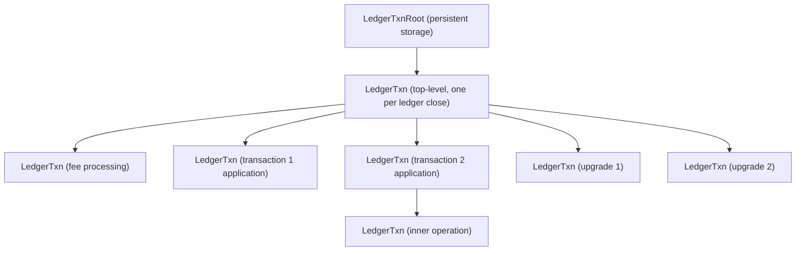
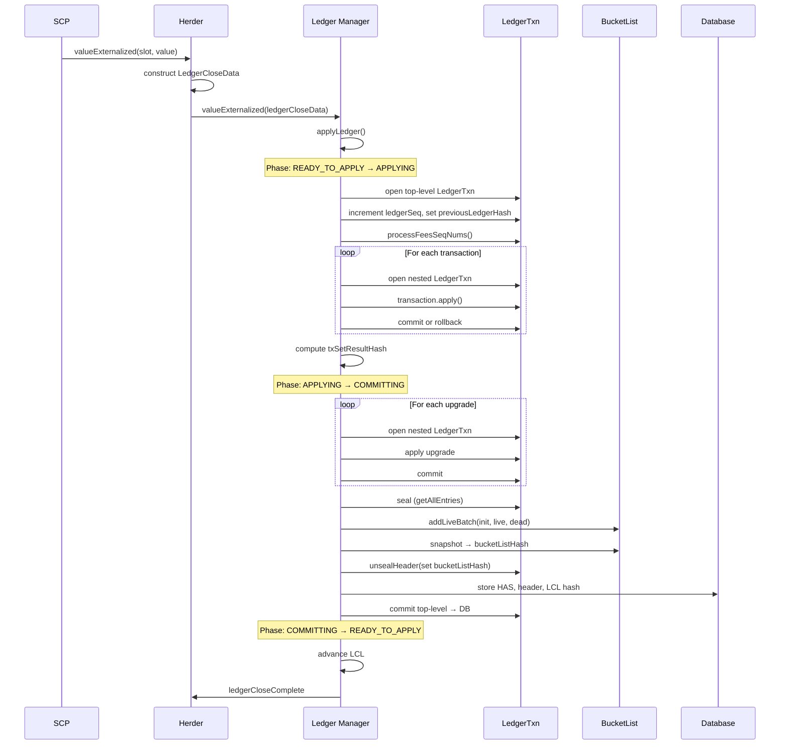
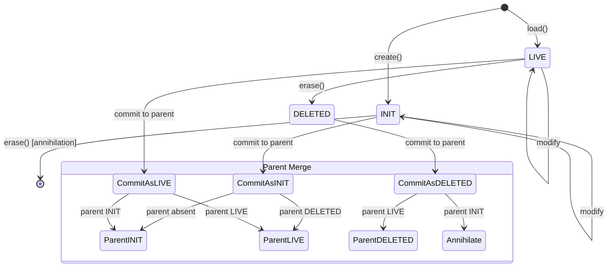
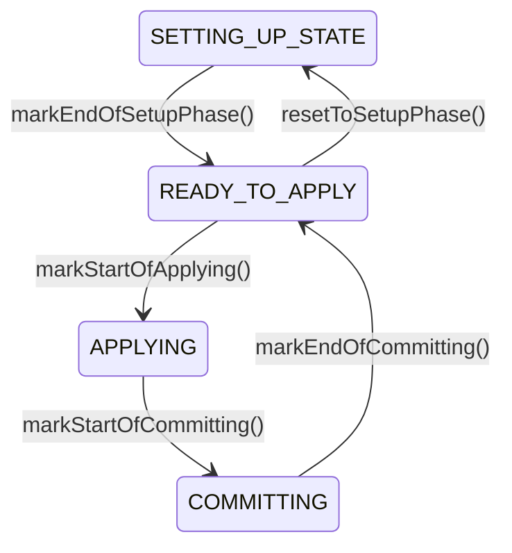
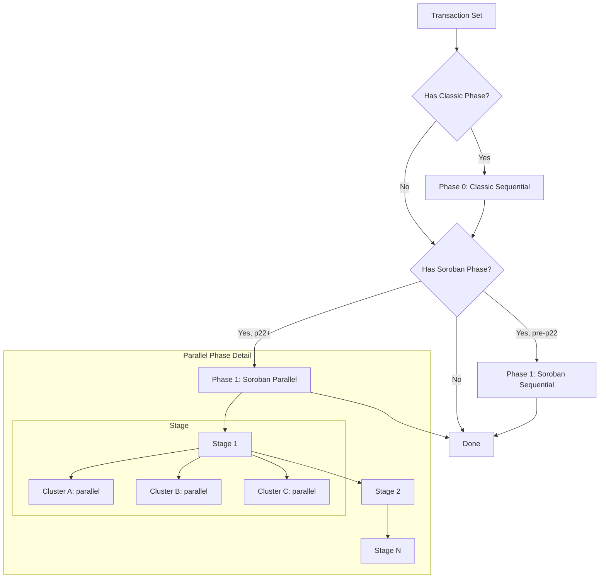

# Stellar Ledger Close Pipeline Specification

**Version:** 25 (stellar-core v25.x / Protocol 25)
**Status:** Informational
**Date:** 2026-02-20

---

## Table of Contents

1. [Introduction](#1-introduction)
2. [Architecture Overview](#2-architecture-overview)
3. [Data Types and Encoding](#3-data-types-and-encoding)
4. [Ledger Close Pipeline](#4-ledger-close-pipeline)
5. [Transaction Application](#5-transaction-application)
6. [LedgerTxn: Nested Transactional State](#6-ledgertxn-nested-transactional-state)
7. [Protocol Upgrades](#7-protocol-upgrades)
8. [Ledger Header Management](#8-ledger-header-management)
9. [Network Configuration](#9-network-configuration)
10. [Soroban State Management](#10-soroban-state-management)
11. [Commit and Persistence](#11-commit-and-persistence)
12. [Ledger Close Meta](#12-ledger-close-meta)
13. [Genesis Ledger](#13-genesis-ledger)
14. [Threading Model](#14-threading-model)
15. [Invariants and Safety Properties](#15-invariants-and-safety-properties)
16. [Constants](#16-constants)
17. [References](#17-references)
18. [Appendices](#18-appendices)

---

## 1. Introduction

### 1.1 Purpose and Scope

This document specifies the ledger close pipeline as implemented in
stellar-core v25.x. The ledger close pipeline is the deterministic
process by which the network transforms an agreed-upon transaction set
(from SCP consensus) and the current ledger state into a new committed
ledger state. It encompasses:

- The complete sequence of operations from SCP value externalization
  to committed ledger state.
- Fee processing, sequence number advancement, and transaction
  application (sequential and parallel phases).
- The nested transactional state management system (LedgerTxn) that
  provides atomic, composable state modifications with rollback
  capability.
- Protocol upgrade application during ledger close.
- Ledger header field computation and update rules.
- Network configuration management, including Soroban settings.
- State commitment to the BucketList and persistent database.
- Ledger close metadata construction for downstream consumers.
- The genesis ledger bootstrap procedure.

This specification is **implementation agnostic**. It is derived
exclusively from the vetted stellar-core C++ implementation (v25.x) and
its pseudocode companion (stellar-core-pc). Any conforming
implementation that produces identical ledger hashes, transaction result
hashes, BucketList hashes, and ledger close metadata for all valid
inputs is considered correct. Internal details such as memory management,
specific SQL schemas, and cache eviction strategies are out of scope
except where they affect deterministic state transitions or observable
outputs.

### 1.2 Conventions and Terminology

The key words "MUST", "MUST NOT", "REQUIRED", "SHALL", "SHALL NOT",
"SHOULD", "SHOULD NOT", "RECOMMENDED", "MAY", and "OPTIONAL" in this
document are to be interpreted as described in [RFC 2119][rfc2119].

| Term | Definition |
|------|------------|
| **Ledger** | A discrete state snapshot of the Stellar network, identified by a monotonically increasing sequence number. |
| **Ledger Close** | The deterministic process of applying a transaction set to the current ledger state to produce the next ledger. |
| **LCL** | Last Closed Ledger — the most recently committed ledger state. |
| **SCP Value** | The `StellarValue` agreed upon by consensus for a given slot, containing the transaction set hash, close time, and optional upgrades. |
| **Transaction Set** | An ordered collection of transactions, possibly organized into phases (classic and Soroban), to be applied in a single ledger close. |
| **LedgerTxn** | A nested, copy-on-write transactional abstraction for reading and modifying ledger entries during a ledger close. |
| **LedgerTxnRoot** | The root of the LedgerTxn hierarchy, connected to persistent storage. Commits at the root flush changes to persistent storage. |
| **Protocol Upgrade** | A network-wide change to a consensus parameter (protocol version, base fee, base reserve, max transaction set size, or Soroban configuration) embedded in the SCP value. |
| **Entry** | A single ledger state record: an account, trust line, offer, data entry, claimable balance, liquidity pool, contract data, contract code, TTL entry, or configuration setting. |
| **LedgerKey** | The unique identifier for a ledger entry, sufficient to locate it in the BucketList or database. |
| **BucketList** | The hierarchical, append-structured data store that maintains a cumulative snapshot of all ledger state (see BucketListDB Specification). |
| **HAS** | History Archive State — a serialized snapshot of the BucketList structure used for checkpointing and catchup. |
| **Meta** | Ledger close metadata recording all state changes for downstream consumers (archives, indexers, horizon). |
| **Soroban** | The smart contract execution environment introduced in protocol 20. |
| **TTL** | Time-to-live entry controlling the expiration of Soroban state entries. |
| **Phase** | A subdivision of a transaction set. Classic transactions form the sequential phase; Soroban transactions form the parallel phase (protocol 22+). |

### 1.3 Notation

This specification uses the following notation conventions:

- **XDR types**: Written in `monospace` and correspond to definitions
  in the Stellar XDR schema files (`Stellar-ledger.x`,
  `Stellar-types.x`, `Stellar-transaction.x`).
- **Hash functions**: `SHA256(x)` denotes the SHA-256 digest of the
  XDR-serialized form of `x`. `xdrSha256(x)` is the same operation.
- **Protocol versions**: `pN` denotes "protocol version N" (e.g., p20
  means protocol version 20).

### 1.4 Document Organization

Sections 2–3 provide an architectural overview and define key data
types. Section 4 specifies the full ledger close pipeline. Section 5
details transaction application. Section 6 specifies the LedgerTxn
nested transactional state system. Section 7 covers protocol upgrades.
Section 8 describes ledger header management. Section 9 covers network
configuration. Section 10 addresses Soroban state management. Section 11
specifies the commit and persistence sequence. Section 12 describes
ledger close metadata. Section 13 defines the genesis ledger. Section 14
describes the threading model. Sections 15–16 state invariants and
constants. Sections 17–18 contain references and appendices.

---

## 2. Architecture Overview

### 2.1 Pipeline Summary

The ledger close pipeline transforms the current ledger state and an
agreed-upon transaction set into the next ledger state through a
deterministic sequence of operations. The pipeline is triggered when SCP
externalizes a value for the next slot (ledger sequence number).

At a high level:

1. **Consensus delivers** a `LedgerCloseData` structure containing the
   agreed-upon `StellarValue`, the transaction set, and the expected
   ledger sequence number.

2. **The pipeline opens** a top-level `LedgerTxn` on the current ledger
   state, providing a transactional workspace for all modifications.

3. **Fees and sequence numbers** are processed for all transactions in
   the set.

4. **Transactions are applied** — either sequentially (classic) or in
   parallel stages (Soroban, protocol 22+).

5. **Protocol upgrades** embedded in the SCP value are applied.

6. **The ledger is sealed**: all state changes are committed to the
   BucketList and persistent database, the ledger header is finalized,
   and a new LCL is established.

7. **Post-commit activities**: history publishing, bucket garbage
   collection, and herder notification.

### 2.2 Component Relationships

The ledger close pipeline interacts with these subsystems:

- **Herder / SCP**: Delivers externalized values; receives notification
  when the ledger close completes so it can trigger the next round.
- **Transaction Framework**: Provides fee processing, sequence number
  validation, and transaction application logic.
- **BucketList**: Receives batches of created, modified, and deleted
  entries after each ledger close (see BucketListDB Specification).
- **Persistent Database**: Stores ledger headers, the HAS, offer
  entries, and persistent node state. Only offers are stored in the
  database; all other entry types are stored exclusively in the
  BucketList.
- **History Manager**: Receives checkpointed ledger headers and
  transaction metadata for publishing to history archives.
- **Soroban Host**: Executes smart contract invocations and provides
  WASM module compilation.

### 2.3 Apply State Phases

The ledger close pipeline maintains an internal phase state machine
that controls when state is writable and when application is in
progress:

```
SETTING_UP_STATE → READY_TO_APPLY → APPLYING → COMMITTING → READY_TO_APPLY
                         ↓
                   SETTING_UP_STATE  (on catchup / reset)
```

| Phase | Description | State Writable |
|-------|-------------|:--------------:|
| `SETTING_UP_STATE` | Loading state from bucket list snapshot, compiling contracts, populating caches. | Yes |
| `READY_TO_APPLY` | Pipeline is idle, ready to accept the next ledger close. | No |
| `APPLYING` | Transactions are being applied. State is read-only except through LedgerTxn. | No |
| `COMMITTING` | The pipeline is committing changes to the BucketList and database. | Yes |

Transitions:
- `SETTING_UP_STATE → READY_TO_APPLY`: When initial state loading completes.
- `READY_TO_APPLY → APPLYING`: When the pipeline begins processing a new ledger.
- `APPLYING → COMMITTING`: When all transactions and their post-processing are complete.
- `COMMITTING → READY_TO_APPLY`: When the commit sequence finishes.
- `READY_TO_APPLY → SETTING_UP_STATE`: On catchup or state reset.

---

## 3. Data Types and Encoding

### 3.1 Ledger Close Data

The `LedgerCloseData` structure carries the information needed to close
a ledger. It is constructed by the herder after SCP externalizes a value.

| Field | Type | Description |
|-------|------|-------------|
| `ledgerSeq` | `uint32` | The sequence number of the ledger to be closed. MUST equal `LCL.ledgerSeq + 1`. |
| `txSet` | `TxSetFrame` | The transaction set agreed upon by consensus. |
| `stellarValue` | `StellarValue` | The SCP value containing the close time, transaction set hash, and upgrade list. |

### 3.2 Stellar Value

The `StellarValue` structure is the value agreed upon by SCP for each
slot:

| Field | Type | Description |
|-------|------|-------------|
| `txSetHash` | `Hash` | SHA-256 hash of the transaction set contents. |
| `closeTime` | `TimePoint` | The close time for this ledger (Unix timestamp). |
| `upgrades` | `UpgradeType<6>` | Up to 6 protocol upgrade entries, each an XDR-encoded `LedgerUpgrade`. |
| `ext` | `StellarValueExt` | Extension containing the `LedgerCloseValueSignature` for signed values. |

### 3.3 Ledger Header

The `LedgerHeader` structure contains all metadata for a closed ledger:

| Field | Type | Description |
|-------|------|-------------|
| `ledgerVersion` | `uint32` | Protocol version of this ledger. |
| `previousLedgerHash` | `Hash` | Hash of the previous ledger header. |
| `scpValue` | `StellarValue` | The SCP value that produced this ledger. |
| `txSetResultHash` | `Hash` | SHA-256 hash of the serialized `TransactionResultSet`. |
| `bucketListHash` | `Hash` | Hash of the BucketList after applying this ledger's changes. |
| `ledgerSeq` | `uint32` | Sequence number of this ledger. |
| `totalCoins` | `int64` | Total lumens in existence. |
| `feePool` | `int64` | Total fees accumulated in the fee pool. |
| `inflationSeq` | `uint32` | Number of inflation operations run (deprecated). |
| `idPool` | `uint64` | Last-used identifier for sequential ID generation. |
| `baseFee` | `uint32` | Base fee per operation in stroops. |
| `baseReserve` | `uint32` | Base reserve per ledger entry in stroops. |
| `maxTxSetSize` | `uint32` | Maximum number of operations allowed in a transaction set. |
| `skipList` | `Hash[4]` | Skip list of previous ledger hashes for efficient historical lookups. |
| `ext` | `LedgerHeaderExt` | Extension field (currently unused). |

### 3.4 Ledger Header History Entry

A `LedgerHeaderHistoryEntry` pairs a `LedgerHeader` with its hash:

| Field | Type | Description |
|-------|------|-------------|
| `hash` | `Hash` | `SHA256(header)` — the ledger hash. |
| `header` | `LedgerHeader` | The ledger header. |

### 3.5 Transaction Result Set

The `TransactionResultSet` is the serialized collection of transaction
results for a single ledger close:

| Field | Type | Description |
|-------|------|-------------|
| `results` | `TransactionResultPair[]` | One result per transaction in the set, in application order. |

Each `TransactionResultPair` contains:

| Field | Type | Description |
|-------|------|-------------|
| `transactionHash` | `Hash` | SHA-256 hash of the transaction envelope. |
| `result` | `TransactionResult` | The result of applying the transaction. |

### 3.6 Ledger Entry Types

Ledger entries are keyed by `LedgerKey` and stored as `LedgerEntry`
values. The supported entry types are:

| Type | Protocol | Description |
|------|----------|-------------|
| `ACCOUNT` | All | Stellar account with balances, sequence numbers, signers. |
| `TRUSTLINE` | All | Trust line for non-native assets. |
| `OFFER` | All | Order book offer. |
| `DATA` | All | Named data attached to an account. |
| `CLAIMABLE_BALANCE` | 15+ | Claimable balance with claim conditions. |
| `LIQUIDITY_POOL` | 18+ | AMM liquidity pool. |
| `CONTRACT_DATA` | 20+ | Soroban smart contract data entry. |
| `CONTRACT_CODE` | 20+ | Soroban WASM bytecode. |
| `TTL` | 20+ | Time-to-live for a Soroban state entry. |
| `CONFIG_SETTING` | 20+ | Network configuration setting (not a ledger key in the traditional sense). |

### 3.7 Internal Entry Types

In addition to the standard XDR ledger entry types, the transactional
state system tracks internal entry types that are not persisted to the
BucketList:

| Type | Description |
|------|-------------|
| `SPONSORSHIP` | Tracks reserve sponsorship relationships. |
| `SPONSORSHIP_COUNTER` | Tracks the count of sponsored entries per account. |
| `MAX_SEQ_NUM_TO_APPLY` | Records the maximum sequence number to apply per account for a single ledger close (protocol 19+). |

These internal entries exist only within the LedgerTxn hierarchy during
a ledger close and are never serialized to buckets or the database.

### 3.8 Entry Lifecycle States

Within the LedgerTxn system, entries are tracked in one of three
lifecycle states:

| State | Meaning |
|-------|---------|
| `INIT` | The entry was created in this transaction and does not exist in any ancestor. |
| `LIVE` | The entry was loaded from an ancestor or database and may have been modified. |
| `DELETED` | The entry has been erased in this transaction. |

These states govern the merge semantics during commit (Section 6.6).

---

## 4. Ledger Close Pipeline

### 4.1 Entry Point: Value Externalized

When SCP externalizes a value for the next slot, the herder constructs
a `LedgerCloseData` and delivers it to the ledger manager. The ledger
manager:

1. SHALL validate that its current state is `BOOTING`, `CATCHING_UP`,
   or `SYNCED`.
2. SHALL pass the `LedgerCloseData` to the apply manager for
   processing.
3. If the apply manager indicates that the ledger must be buffered
   (e.g., because a catchup is in progress), the ledger manager SHALL
   transition to the `CATCHING_UP` state.

### 4.2 Apply Ledger: Complete Sequence

The `applyLedger` procedure is the core of the ledger close pipeline.
It MUST execute the following steps in exact order:

#### Step 1: Finish Pending Compilation

If a background contract module cache compilation from the previous
ledger is still in progress, the pipeline MUST block until it
completes and swap in the new module cache.

#### Step 2: Enter APPLYING Phase

The pipeline MUST transition from `READY_TO_APPLY` to `APPLYING`.

#### Step 3: Open LedgerTxn and Prepare Header

The pipeline MUST:

1. Open a top-level `LedgerTxn` on the current LCL state.
2. Load the current ledger header.
3. Record the `initialLedgerVers` — the protocol version BEFORE any
   upgrades in this ledger. This value is critical because it
   determines the meta format version.
4. Increment `ledgerSeq` by 1.
5. Set `previousLedgerHash` to the hash of the current LCL header.
6. Set `scpValue` to the `StellarValue` from the `LedgerCloseData`.

#### Step 4: Validate Transaction Set

The pipeline MUST verify:

- The `txSetHash` in the `StellarValue` matches the hash of the
  provided transaction set.
- The `previousLedgerHash` in the SCP value matches the current LCL
  hash.

If validation fails, the pipeline MUST abort.

#### Step 5: Prepare Transaction Set for Application

The transaction set MUST be converted from its wire format to an
applicable form. For generalized transaction sets (protocol 20+), this
involves resolving the per-phase structure and computing base fees for
each component.

#### Step 6: Construct Meta Frame

If meta streaming is enabled, the pipeline MUST create a
`LedgerCloseMetaFrame` of the appropriate version. The meta version is
determined by `initialLedgerVers` (not the post-upgrade version):

| initialLedgerVers | Meta Version |
|-------------------|-------------|
| < 20 | v0 |
| 20–21 | v1 |
| ≥ 22 | v2 |

#### Step 7: Process Fees and Sequence Numbers

The pipeline MUST call `processFeesSeqNums` (Section 5.1) to charge
fees and advance sequence numbers for all transactions in the set. This
step executes in a nested `LedgerTxn` that is committed upon success.

#### Step 8: Apply Transactions

The pipeline MUST call `applyTransactions` (Section 5.2) to execute
all transactions. Transaction results are accumulated into a
`TransactionResultSet`.

#### Step 9: Store Transaction History

If the node stores history, the pipeline SHALL persist the transaction
set and result set for the current ledger.

#### Step 10: Compute Transaction Result Hash

The pipeline MUST compute:
```
txSetResultHash = SHA256(TransactionResultSet)
```
and store it in the ledger header.

#### Step 11: Enter COMMITTING Phase

The pipeline MUST transition from `APPLYING` to `COMMITTING`.

#### Step 12: Apply Protocol Upgrades

The pipeline MUST iterate over the `upgrades` field of the
`StellarValue` and apply each valid upgrade (Section 7). Each upgrade
is applied in its own nested `LedgerTxn`. Invalid upgrades (those that
fail `isValidForApply` at the current ledger version) SHALL be skipped
with a warning.

#### Step 13: Seal and Store

The pipeline MUST call the seal-and-store procedure (Section 11) to:

1. Finalize all LedgerTxn changes (eviction, hot archive updates,
   BucketList batch additions).
2. Snapshot the BucketList and compute the `bucketListHash`.
3. Store the ledger header and HAS in the persistent database.
4. Create a new `CompleteConstLedgerState`.

#### Step 14: Populate Meta with Network Config

If `initialLedgerVers >= 20`, the pipeline MUST populate the meta
frame with the current Soroban network configuration.

#### Step 15: Verify Expected Hash

If the `LedgerCloseData` includes an expected ledger hash, the
pipeline MUST verify that the computed ledger hash matches. A mismatch
indicates a consensus divergence and MUST be treated as a fatal error.

#### Step 16: Emit Meta

If meta streaming is enabled, the pipeline MUST emit the completed
meta frame to the meta stream.

#### Step 17: Commit Sequence

The pipeline MUST execute the following 8-step commit sequence in
exact order:

1. **Queue history checkpoint**: If this ledger is at a checkpoint
   boundary, queue the checkpoint for publishing.
2. **Commit LedgerTxn**: Commit the top-level `LedgerTxn`, flushing
   all accumulated changes to persistent storage.
3. **Finalize checkpoint**: If a checkpoint was queued, finalize the
   checkpoint files.
4. **Start background eviction scan**: Begin the eviction scan for
   the next ledger (`ledgerSeq + 1`).
5. **Exit COMMITTING phase**: Transition from `COMMITTING` to
   `READY_TO_APPLY`.
6. **Snapshot for invariant**: Optionally capture a snapshot of
   Soroban state for invariant checking.
7. **Advance LCL and publish**: Swap in the new `CompleteConstLedgerState`
   as the current LCL, publish queued history, and run bucket garbage
   collection. This step MUST execute on the main thread.
8. **Notify herder**: Signal that the ledger close is complete so the
   herder can trigger the next consensus round.

---

## 5. Transaction Application

### 5.1 Fee and Sequence Number Processing

Before transactions are applied, their fees MUST be charged and their
sequence numbers MUST be advanced. This ensures that even if a
transaction fails during application, the fee is collected and the
sequence number is consumed.

The `processFeesSeqNums` procedure:

1. SHALL open a nested `LedgerTxn`.
2. SHALL iterate over all transactions in the set, in phase order
   (classic phase first if present, then Soroban phase).
3. For each transaction, SHALL call `processFeeSeqNum` which:
   a. Loads the source account.
   b. Deducts the fee from the source account balance.
   c. Adds the fee to the ledger header's `feePool`.
   d. Increments the source account's `seqNum`.
4. For protocol 19+: If the transaction set contains account merge
   operations, the procedure SHALL create `MAX_SEQ_NUM_TO_APPLY`
   internal entries for each source account, recording the highest
   sequence number seen for that account. This prevents sequence
   number reuse after an account merge and re-creation within the
   same ledger.
5. SHALL record fee processing changes in the meta frame (if
   streaming).
6. SHALL commit the nested `LedgerTxn`.

### 5.2 Transaction Application

The `applyTransactions` procedure applies all transactions in the set
to the current ledger state:

1. SHALL compute the `sorobanBasePrngSeed` as the transaction set
   contents hash (used for deterministic randomness in Soroban
   transactions).
2. SHALL load the Soroban network configuration if protocol ≥ 20.
3. SHALL iterate over phases in apply order.
4. For each phase, SHALL apply transactions according to the phase
   type:
   - **Sequential phase**: Apply transactions one at a time
     (Section 5.3).
   - **Parallel phase**: Apply transactions in parallel stages
     (Section 5.4, protocol 22+).

### 5.3 Sequential Phase Application

In the sequential phase (used for all classic transactions and for
Soroban transactions before protocol 22), each transaction is applied
individually:

1. For each transaction in the phase:
   a. Open a nested `LedgerTxn`.
   b. Create a `TransactionMetaBuilder` to track state changes.
   c. For Soroban transactions, compute a per-transaction sub-seed:
      `subSeed = SHA256(baseSeed || transactionIndex)`.
   d. Call `transaction.apply(...)` to execute the transaction.
   e. Call `transaction.processPostApply(...)` for post-application
      processing.
   f. Record refundable fee metadata.
   g. Process the result and metadata immediately.
   h. Commit or rollback the nested `LedgerTxn` based on the
      transaction result.

### 5.4 Parallel Phase Application

In the parallel phase (protocol 22+, used for Soroban transactions),
transactions are organized into stages, where each stage contains
clusters of non-conflicting transactions:

1. The transaction set provides a `TxStageFrameList` — an ordered
   list of stages, where each stage contains clusters.
2. A global parallel-apply ledger state is created as a read-only
   snapshot.
3. For each stage:
   a. All clusters in the stage are applied in parallel (each on a
      separate execution thread).
   b. Each cluster applies its transactions sequentially within the
      cluster.
   c. After all clusters in the stage complete, their results are
      checked for invariant violations.
   d. All cluster changes are committed to the main `LedgerTxn` in
      deterministic order.
4. After all stages complete, post-transaction-set processing runs
   for each transaction:
   a. `processPostTxSetApply` executes in a nested `LedgerTxn`.
   b. Post-apply fee processing changes are recorded in the meta
      frame.
   c. Results and metadata are processed (deferred from the parallel
      apply step).

### 5.5 Transaction Application Ordering

The order in which transactions are applied within a phase is
deterministic and MUST match the order specified by the transaction set
frame. Within a sequential phase, transactions are applied in the order
they appear in the phase. Within a parallel phase, stages are applied in
order, clusters within a stage are applied in parallel (but committed in
order), and transactions within a cluster are applied in order.

The overall phase ordering is:

1. **Phase 0**: Classic transactions (sequential).
2. **Phase 1**: Soroban transactions (parallel in protocol 22+,
   sequential before that).

---

## 6. LedgerTxn: Nested Transactional State

### 6.1 Overview

The LedgerTxn system provides a hierarchical, copy-on-write
transactional abstraction for ledger state. It enables nested
transactions where modifications at any level can be independently
committed or rolled back without affecting sibling or ancestor
transactions.

The system forms a tree:



### 6.2 LedgerTxnRoot

The `LedgerTxnRoot` is the root of the hierarchy and the interface to
persistent storage. It:

1. SHALL maintain the connection to persistent storage.
2. SHALL provide the initial entry data for lookups that miss all
   child caches — this data comes from the BucketList snapshot, not
   persistent storage.
3. SHALL maintain an in-memory representation of the order book (the
   "multi-order book") for efficient offer queries.
4. SHALL track the "best offer" for each asset pair, used to
   optimize path finding.
5. SHALL commit accumulated changes to persistent storage when the
   top-level `LedgerTxn` commits. Only offer entries are written to
   persistent storage; all other entry types are stored exclusively
   in the BucketList.

### 6.3 Nesting Rules

The following rules govern LedgerTxn nesting:

1. **Single child**: A `LedgerTxn` (or `LedgerTxnRoot`) SHALL have
   at most one active child at any time. Creating a second child
   while a first is active is a programming error.
2. **Deactivation**: When a child `LedgerTxn` is created, the parent
   SHALL deactivate all its live entry handles. This prevents
   simultaneous modification of the same entry at two levels.
   Accessing a deactivated handle is a programming error.
3. **Reactivation**: When a child commits or rolls back, the parent
   SHALL reactivate its entry handles.
4. **Depth**: There is no formal limit on nesting depth, though
   typical usage nests 2–4 levels deep.

### 6.4 Entry Operations

A `LedgerTxn` supports the following operations on entries:

#### 6.4.1 Load

`load(key) → LedgerTxnEntry | null`

1. If the key exists in this transaction's local cache, return the
   cached entry (creating an active handle).
2. Otherwise, recursively load from the parent.
3. If found, create a copy in this transaction's cache (copy-on-write)
   with lifecycle state `LIVE`.
4. If not found, return null.

A load SHALL NOT modify the entry in any ancestor.

#### 6.4.2 Load Without Record

`loadWithoutRecord(key) → ConstLedgerTxnEntry | null`

Similar to `load`, but returns a read-only handle and does NOT create
a copy in this transaction's cache. Used for read-only queries that
should not trigger copy-on-write overhead.

#### 6.4.3 Create

`create(entry) → LedgerTxnEntry`

1. The key derived from the entry MUST NOT already exist in this
   transaction or any ancestor.
2. The entry is added to this transaction's cache with lifecycle
   state `INIT`.
3. Returns an active handle.

#### 6.4.4 Erase

`erase(key)`

1. The key MUST exist in this transaction or an ancestor.
2. If the key has lifecycle state `INIT` (was created in this
   transaction and has never been committed to an ancestor), the
   entry is removed entirely — this is **annihilation** (the create
   and delete cancel out).
3. Otherwise, the entry is marked with lifecycle state `DELETED`.

#### 6.4.5 Load Header

`loadHeader() → LedgerTxnHeader`

Returns an active handle to the ledger header for this transaction.
Header modifications follow the same copy-on-write and commit semantics
as entry modifications.

### 6.5 Sealing

Before a `LedgerTxn` can provide its accumulated changes for external
consumption (e.g., for the BucketList batch add), it MUST be **sealed**.

Sealing:

1. Calls `getAllEntries(initEntries, liveEntries, deadEntries)` to
   extract all accumulated changes, partitioned by lifecycle state.
2. After sealing, the `LedgerTxn` SHALL NOT accept any further
   modifications.

The three output partitions are:

| Partition | Contents |
|-----------|----------|
| `initEntries` | Entries with lifecycle state `INIT` — newly created entries. |
| `liveEntries` | Entries with lifecycle state `LIVE` — modified existing entries. |
| `deadEntries` | Keys with lifecycle state `DELETED` — erased entries. |

### 6.6 Commit Semantics

When a child `LedgerTxn` commits, its changes are merged into the
parent according to these rules:

#### 6.6.1 Last Modified Update

Before merging, the committing transaction SHALL update the
`lastModifiedLedgerSeq` field of every modified or created entry to
the current ledger sequence number, unless the entry is an internal
type (sponsorship, sponsorship counter, max-seq-num-to-apply) which
does not carry this field.

#### 6.6.2 Entry Merge Rules

For each entry in the committing child, the merge into the parent
proceeds based on the child's lifecycle state and the parent's existing
state for the same key:

| Child State | Parent State | Result in Parent |
|-------------|-------------|-----------------|
| `INIT` | absent | `INIT` (new entry propagated up) |
| `INIT` | `DELETED` | `LIVE` (re-creation after deletion) |
| `LIVE` | `LIVE` | `LIVE` (modification propagated) |
| `LIVE` | `INIT` | `INIT` (still a new entry, now modified) |
| `DELETED` | `LIVE` | `DELETED` |
| `DELETED` | `INIT` | absent (annihilation — entry removed entirely) |

**Annihilation**: When a `DELETED` entry in the child meets an `INIT`
entry in the parent, both are removed. This is critical because the
entry was created and destroyed within the same transactional scope,
so no net change needs to propagate further.

#### 6.6.3 Header Merge

If the child modified the ledger header, the parent's header is
replaced with the child's version.

#### 6.6.4 Root Commit

When the top-level `LedgerTxn` commits to the `LedgerTxnRoot`:

1. All accumulated offer changes are flushed to persistent storage
   (inserts, updates, deletes).
2. The in-memory order book is updated.
3. The persistent storage transaction is committed.

Non-offer entry types are NOT written to persistent storage during
root commit — they are persisted exclusively through the BucketList
batch add that occurs during the seal-and-store step (Section 11).

### 6.7 Rollback Semantics

When a `LedgerTxn` is rolled back (either explicitly or by
destruction without commit):

1. All entry modifications in this transaction are discarded.
2. The parent is notified to reactivate its entry handles.
3. No changes propagate to the parent or any ancestor.

Rollback is the default behavior — if a `LedgerTxn` is destroyed
without calling `commit()`, it implicitly rolls back.

### 6.8 Unseal Header

The `unsealHeader` operation is a special mechanism used during the
seal-and-store step. After the `LedgerTxn` has been sealed (all entries
extracted), the header is still "sealed" and cannot be modified.
`unsealHeader` accepts a callback that receives a mutable reference to
the header, allowing the seal-and-store step to finalize header fields
(such as `bucketListHash`) that depend on the BucketList state computed
from the sealed entries.

---

## 7. Protocol Upgrades

### 7.1 Overview

Protocol upgrades are network-wide parameter changes that are embedded
in the SCP `StellarValue` and applied during ledger close, AFTER
transaction application but BEFORE the ledger is sealed. This ordering
ensures that transactions in a given ledger are applied under the
pre-upgrade rules, while the resulting ledger header reflects the
post-upgrade parameters.

### 7.2 Upgrade Types

The `LedgerUpgrade` XDR union supports the following upgrade types:

| Upgrade Type | Parameter Changed | Introduced |
|-------------|-------------------|-----------|
| `LEDGER_UPGRADE_VERSION` | `ledgerVersion` (protocol version) | Genesis |
| `LEDGER_UPGRADE_BASE_FEE` | `baseFee` | Genesis |
| `LEDGER_UPGRADE_MAX_TX_SET_SIZE` | `maxTxSetSize` | Genesis |
| `LEDGER_UPGRADE_BASE_RESERVE` | `baseReserve` | p9 |
| `LEDGER_UPGRADE_FLAGS` | Ledger header flags | p18 |
| `LEDGER_UPGRADE_CONFIG` | Soroban configuration settings | p20 |
| `LEDGER_UPGRADE_MAX_SOROBAN_TX_SET_SIZE` | Maximum Soroban transaction set size | p20 |

### 7.3 Upgrade Lifecycle

#### 7.3.1 Nomination

Validators may configure desired upgrades (target protocol version,
base fee, etc.) with an effective time. During SCP nomination, a
validator SHALL include upgrades in its proposed `StellarValue` only if:

1. The current time is at or past the configured effective time.
2. The proposed value differs from the current ledger header value.
3. For protocol version upgrades: the new version is exactly
   `currentVersion + 1` (single-step upgrades only).

#### 7.3.2 Validation

When receiving a proposed `StellarValue` from another validator, the
upgrade MUST be validated:

1. Each upgrade entry MUST deserialize to a valid `LedgerUpgrade`.
2. The upgrade MUST be valid for the current protocol version
   (via `isValidForApply`).
3. For `LEDGER_UPGRADE_VERSION`: the new version MUST be ≤
   `CURRENT_LEDGER_PROTOCOL_VERSION` and MUST be `currentVersion + 1`.
4. For `LEDGER_UPGRADE_CONFIG`: the `ConfigUpgradeSet` MUST exist in
   the ledger state, entries MUST be sorted by `configSettingID` with
   no duplicates, and each setting MUST pass its specific validation
   logic.

#### 7.3.3 Combination

When SCP combines values from multiple validators, upgrades are
combined by taking the highest proposed value for each parameter type.
For protocol version upgrades, the maximum of all proposed versions is
taken (clamped to `currentVersion + 1`). For config upgrades, if
multiple validators propose different config sets, the one with the
highest hash wins.

#### 7.3.4 Application

During ledger close, upgrades are applied in the order they appear in
`stellarValue.upgrades`. For each upgrade:

1. Open a nested `LedgerTxn`.
2. Validate the upgrade via `isValidForApply`. Skip with a warning if
   invalid.
3. Apply the upgrade:

   **Version upgrade** (`LEDGER_UPGRADE_VERSION`):
   - Set `header.ledgerVersion` to the new version.
   - If upgrading to p10: run `prepareLiabilities` to adjust all
     offers and trust lines for the new reserve calculation rules.
   - If upgrading to p20: create all initial Soroban `CONFIG_SETTING`
     entries with their default values.
   - If upgrading to p21, p22, p23, or p25: update cost model
     parameters for the new protocol.
   - If upgrading from p23 to p24: apply the P23 hot archive bug fix,
     adjusting corrupted entries. Also adjust the fee pool to reflect
     the actual coin distribution.
   - If upgrading to p25: promote the eviction state size to a window
     and enable stale entry purging.

   **Base fee upgrade** (`LEDGER_UPGRADE_BASE_FEE`):
   - Set `header.baseFee` to the new value.

   **Max tx set size upgrade** (`LEDGER_UPGRADE_MAX_TX_SET_SIZE`):
   - Set `header.maxTxSetSize` to the new value.

   **Base reserve upgrade** (`LEDGER_UPGRADE_BASE_RESERVE`):
   - Set `header.baseReserve` to the new value.

   **Flags upgrade** (`LEDGER_UPGRADE_FLAGS`):
   - Set the ledger header flags to the new value.

   **Config upgrade** (`LEDGER_UPGRADE_CONFIG`):
   - Load the `ConfigUpgradeSet` from ledger state.
   - For each entry in the set, update the corresponding
     `CONFIG_SETTING` entry.
   - Delete the `ConfigUpgradeSet` entry after application.

   **Max Soroban tx set size upgrade** (`LEDGER_UPGRADE_MAX_SOROBAN_TX_SET_SIZE`):
   - Update the corresponding Soroban config setting.

4. Record upgrade changes in the meta frame.
5. Commit the nested `LedgerTxn`.

---

## 8. Ledger Header Management

### 8.1 Header Update Sequence

During a ledger close, the ledger header fields are updated in the
following order:

1. **Before transaction application** (Step 3 of the pipeline):
   - `ledgerSeq` ← `previousLedgerSeq + 1`
   - `previousLedgerHash` ← `SHA256(previousLedgerHeader)`
   - `scpValue` ← the agreed-upon `StellarValue`

2. **After transaction application** (Step 10):
   - `txSetResultHash` ← `SHA256(TransactionResultSet)`

3. **During upgrades** (Step 12):
   - Any of `ledgerVersion`, `baseFee`, `baseReserve`, `maxTxSetSize`,
     or flags may be updated.

4. **During seal** (Step 13, via `unsealHeader`):
   - `bucketListHash` ← computed from the BucketList after adding
     all entries from this ledger.

5. **Fee pool and total coins**: Updated throughout transaction
   application as fees are charged and inflation (if applicable) is
   processed.

### 8.2 Skip List

The `skipList` array in the ledger header provides a geometric skip
structure for efficient historical lookups. The skip list is an array
of 4 `Hash` values, updated as follows:

For a ledger with sequence number `N`:

```
if (N mod 256) == 0:
    skipList[2] = skipList[3]  (copy old [2] to [3])
    skipList[1] = skipList[2]  (copy old [1] to [2])
    skipList[0] = skipList[1]  (copy old [0] to [1])
    skipList[3] = SHA256(previousLedgerHeader)
else if (N mod 64) == 0:
    skipList[1] = skipList[2]
    skipList[0] = skipList[1]
    skipList[2] = SHA256(previousLedgerHeader)
else if (N mod 16) == 0:
    skipList[0] = skipList[1]
    skipList[1] = SHA256(previousLedgerHeader)
else if (N mod 4) == 0:
    skipList[0] = SHA256(previousLedgerHeader)
```

Note: The skip list is updated during the `unsealHeader` callback,
not during the initial header setup. The exact update rule references
the LCL hash, not the current header hash (which is not yet known).

### 8.3 Ledger Hash Computation

The ledger hash is computed as:
```
ledgerHash = SHA256(XDR_serialize(ledgerHeader))
```

This hash uniquely identifies a ledger and is stored in the
`LedgerHeaderHistoryEntry` alongside the header. The
`previousLedgerHash` field in each ledger header creates a hash chain
linking all ledgers.

### 8.4 Persistence

Ledger headers are stored in the persistent database. The storage
operation records:

1. The `LedgerHeader` serialized as XDR.
2. The `ledgerHash`.
3. The `previousLedgerHash` (for indexed lookups).

The most recent ledger header hash is also stored in the persistent
state table as `kLastClosedLedger` for crash recovery.

---

## 9. Network Configuration

### 9.1 Overview

The network configuration subsystem manages consensus-agreed parameters
that govern network behavior. It is divided into two categories:

1. **Legacy header parameters**: `baseFee`, `baseReserve`,
   `maxTxSetSize`, `ledgerVersion` — stored directly in the ledger
   header.
2. **Soroban configuration** (protocol 20+): A set of typed
   `CONFIG_SETTING` entries stored in the ledger state, governing
   smart contract execution limits, fees, and resource constraints.

### 9.2 Soroban Configuration Settings

The following configuration setting types exist (introduced at the
indicated protocol version):

| Setting ID | Name | Protocol | Description |
|-----------|------|----------|-------------|
| 0 | `CONTRACT_MAX_SIZE_BYTES` | 20 | Maximum WASM bytecode size. |
| 1 | `CONTRACT_COMPUTE` | 20 | CPU instruction limits per transaction and ledger. |
| 2 | `CONTRACT_LEDGER_COST` | 20 | Ledger entry read/write limits and sizes. |
| 3 | `CONTRACT_HISTORICAL_DATA` | 20 | Historical storage fee parameters. |
| 4 | `CONTRACT_EVENTS` | 20 | Event size limits. |
| 5 | `CONTRACT_BANDWIDTH` | 20 | Transaction size and bandwidth limits. |
| 6 | `CONTRACT_COST_PARAMS_CPU` | 20 | CPU cost model parameters (per host function). |
| 7 | `CONTRACT_COST_PARAMS_MEMORY` | 20 | Memory cost model parameters (per host function). |
| 8 | `CONTRACT_DATA_KEY_SIZE_BYTES` | 20 | Maximum contract data key size. |
| 9 | `CONTRACT_DATA_ENTRY_SIZE_BYTES` | 20 | Maximum contract data entry size. |
| 10 | `STATE_ARCHIVAL` | 20 | Eviction and archival parameters (min TTLs, max entry size, scan limits). |
| 11 | `CONTRACT_EXECUTION_LANES` | 20 | Number of execution lanes for parallel processing. |
| 12 | `BUCKETLIST_SIZE_WINDOW` | 20 | Sliding window of BucketList sizes for rent fee computation. |
| 13 | `EVICTION_ITERATOR` | 20 | Current position of the eviction scan iterator. |

### 9.3 Configuration Loading

Soroban network configuration MUST be loaded from the ledger state at
specific points during the ledger close pipeline:

1. **Before transaction application**: The configuration is loaded to
   provide transaction resource limits and cost parameters.
2. **After upgrades**: The configuration is reloaded to reflect any
   config upgrades applied in this ledger. This reload provides the
   final configuration state for the `CompleteConstLedgerState`.

Configuration loading reads all `CONFIG_SETTING` entries from the
current `LedgerTxn` and assembles them into a cached configuration
object. This object is immutable for the duration of its use.

### 9.4 Non-Upgradeable Settings

The following settings are NOT upgradeable through the config upgrade
mechanism and are instead updated internally by the ledger close
pipeline:

- `BUCKETLIST_SIZE_WINDOW`: Updated during the finalize step based on
  the current BucketList size (Section 11).
- `EVICTION_ITERATOR`: Updated by the eviction scan subsystem (see
  BucketListDB Specification, Section 12).

### 9.5 Cost Model

The Soroban cost model defines per-host-function CPU and memory costs
as linear models:

```
cost(size) = constTerm + linearTerm × size
```

Each host function has its own `constTerm` and `linearTerm` for both
CPU and memory. The cost model parameters are stored in
`CONTRACT_COST_PARAMS_CPU` and `CONTRACT_COST_PARAMS_MEMORY` and are
updated during protocol version upgrades.

### 9.6 Rent Fee Computation

The rent fee for Soroban state entries is computed using the BucketList
size window:

1. The window is a sliding window of `LIVE_SOROBAN_STATE_SIZE_WINDOW`
   recent BucketList sizes.
2. The average BucketList size over the window is computed.
3. The rent fee is computed as a function of the average size, the
   entry size, the rental period, and the fee rate configuration.

The exact formula is:
```
rentFee = (entrySize × feeRatePerByte × rentPeriod) / (averageBucketListSize + 1)
```

with appropriate scaling and minimum fee logic.

### 9.7 Resource Limits

The network configuration defines resource limits at two levels:

1. **Per-ledger limits** (returned by `maxLedgerResources`):
   - For classic transactions: limits based on `maxTxSetSize`.
   - For Soroban transactions: limits from the Soroban configuration
     (CPU instructions, memory, read/write bytes, read/write entries,
     transaction size).

2. **Per-transaction limits** (returned by
   `maxSorobanTransactionResources`): Maximum resources a single
   Soroban transaction may consume.

---

## 10. Soroban State Management

### 10.1 In-Memory Soroban State

For protocol 20+, the ledger close pipeline maintains an in-memory
cache of all Soroban state entries (`CONTRACT_DATA`, `CONTRACT_CODE`,
and `TTL` entries). This cache enables efficient state lookups during
smart contract execution without requiring bucket list queries for
every access.

### 10.2 State Population

The in-memory Soroban state is populated:

1. **At startup**: All Soroban entries are loaded from the BucketList
   snapshot during the `SETTING_UP_STATE` phase.
2. **After each ledger close**: The state is incrementally updated
   with the entries created, modified, and deleted in that ledger.

### 10.3 TTL Co-location

TTL entries are co-located with their parent Soroban entries in the
in-memory state. When a `CONTRACT_DATA` or `CONTRACT_CODE` entry is
loaded, its associated `TTL` entry is fetched and stored alongside it.
This avoids separate lookups for TTL information during execution.

If a TTL entry arrives before its parent entry (a "pending TTL"), it
is stored temporarily and associated when the parent entry is loaded.

### 10.4 State Size Tracking

The in-memory state tracks the total size of Soroban state separately
for code and data:

- **Code size**: Total size of all `CONTRACT_CODE` entries. For
  protocol 23+, this includes an estimated memory cost based on the
  bytecode size.
- **Data size**: Total size of all `CONTRACT_DATA` entries.

These sizes feed into the BucketList size window for rent fee
computation.

### 10.5 Module Cache

For protocol 25+, a contract module cache is maintained to avoid
recompiling smart contract bytecode on every invocation:

1. **Compilation**: All `CONTRACT_CODE` entries are compiled for all
   supported protocol versions at startup and cached.
2. **Incremental updates**: After each ledger close, newly added
   contracts are compiled and added to the cache; evicted contracts
   are removed.
3. **Rebuild heuristic**: If the cache memory arena has grown beyond
   twice the last compiled size (adjusted by a memory cost model
   multiplier), the entire cache is rebuilt to reclaim fragmented
   memory.
4. **Background compilation**: Compilation MAY occur on a background
   thread. The pipeline MUST block at the start of the next ledger
   close to await completion.

---

## 11. Commit and Persistence

### 11.1 Seal and Store Procedure

The seal-and-store procedure finalizes the
ledger close by committing all accumulated state changes. It MUST
execute the following steps under a ledger state mutex:

#### Step 1: Finalize LedgerTxn Changes

The `finalizeLedgerTxnChanges` procedure:

1. **Resolve eviction** (protocol 20+):
   a. Load the Soroban configuration and collect all TTL keys.
   b. Resolve the background eviction scan started at the previous
      ledger. This produces a set of evicted entries.
   c. For protocol 24+ (persistent eviction):
      - Collect restored hot archive keys.
      - Run consistency invariant checks.
      - Handle the P23 hot archive bug fix if upgrading from p23 to p24.
      - Otherwise, add hot archive entries via `addHotArchiveBatch`.
   d. Populate evicted entries in the meta frame.
   e. Remove evicted `CONTRACT_CODE` entries from the module cache.
   f. Commit the eviction `LedgerTxn`.
   g. Snapshot the Soroban state size (recording the size as of the
      previous ledger, taken before flushing this ledger's entries).

2. **Load final configuration**: Load the Soroban configuration at
   the post-upgrade protocol version.

3. **Seal the LedgerTxn**: Call `getAllEntries` to extract all
   accumulated changes partitioned into init, live, and dead entries.
   After this call, the LedgerTxn is sealed and accepts no further
   modifications.

4. **Update module cache**: Add any new `CONTRACT_CODE` entries from
   the init/live partitions to the module cache.

5. **Add to BucketList**: Call `addLiveBatch` on the live BucketList,
   passing the init, live, and dead entries. This triggers the
   BucketList level-add and potential merge operations (see
   BucketListDB Specification).

6. **Update in-memory Soroban state**: Apply the init, live, and
   dead entries to the in-memory Soroban state cache.

#### Step 2: Unseal Header and Persist

Via the `unsealHeader` callback:

1. **Snapshot BucketList**: Tell the BucketManager to snapshot the
   current BucketList state. This computes the `bucketListHash`.

2. **Update header**: Set `header.bucketListHash` to the computed
   hash.

3. **Store persistent state**: Write to persistent storage:
   a. The LCL hash in `PersistentState::kLastClosedLedger`.
   b. The `HistoryArchiveState` (derived from the current BucketList
      structure) in `PersistentState::kHistoryArchiveState`.
   c. The ledger header in the headers table.
   d. If at a checkpoint boundary, append the header to the
      checkpoint file.

4. **Create new ledger state**: Construct a `CompleteConstLedgerState`
   containing:
   - The searchable live BucketList snapshot.
   - The searchable hot archive BucketList snapshot (protocol 24+).
   - The `LedgerHeaderHistoryEntry` (header + hash).
   - The `HistoryArchiveState`.
   - The Soroban network configuration (protocol 20+).

#### Step 3: Conditional Module Cache Rebuild

For protocol 25+, if the module cache arena has grown beyond the
rebuild threshold, rebuild the entire module cache from the new
BucketList snapshot.

### 11.2 History Archive State

The `HistoryArchiveState` (HAS) is a serialization of the BucketList
structure at a given ledger. It records:

- The ledger sequence number and network passphrase.
- For each BucketList level: the current and snap bucket hashes, and
  any pending future bucket merge state.
- For protocol 24+: the hot archive bucket list state.

The HAS is stored in the persistent database after every ledger close
and published to history archives at checkpoint boundaries.

### 11.3 Checkpoint Boundaries

Checkpoints occur at regular intervals defined by:
```
CHECKPOINT_FREQUENCY = 64
```

A ledger is at a checkpoint boundary if:
```
(ledgerSeq + 1) mod CHECKPOINT_FREQUENCY == 0
```

At checkpoint boundaries, the pipeline queues the current ledger for
history publishing, which includes the HAS, transaction sets, and
ledger close metadata.

---

## 12. Ledger Close Meta

### 12.1 Overview

Ledger close metadata records all observable state changes produced by
a ledger close, enabling downstream systems (indexers, explorers,
analytics) to reconstruct state transitions without re-executing
transactions.

### 12.2 Meta Versions

The meta frame version is determined by the `initialLedgerVers`
(the protocol version BEFORE any upgrades in this ledger):

| initialLedgerVers | Meta Version | Description |
|-------------------|-------------|-------------|
| < 20 | v0 | Pre-Soroban format. |
| 20–21 | v1 | Includes Soroban metadata, eviction info. |
| ≥ 22 | v2 | Adds parallel Soroban transaction metadata. |

### 12.3 Meta Contents

The meta frame contains:

| Component | Description |
|-----------|-------------|
| **Transaction set** | The applied transaction set. |
| **Fee processing changes** | State changes from fee and sequence number processing. |
| **Transaction metadata** | Per-transaction state changes, events, and return values. For v2, this includes per-stage, per-cluster metadata. |
| **Upgrade metadata** | State changes from each protocol upgrade applied. |
| **Evicted entries** | Soroban entries evicted in this ledger (protocol 20+). |
| **Network configuration** | Current Soroban network config (protocol 20+). |

### 12.4 Meta Streaming

Meta frames are emitted to a configured output stream after the
ledger is sealed but before the final commit sequence. The stream is
configured at startup and can target a file or a pipe. If the stream
is not configured, meta construction is skipped entirely.

---

## 13. Genesis Ledger

### 13.1 Genesis Constants

The genesis ledger (sequence number 1) is bootstrapped with the
following constants:

| Parameter | Value |
|-----------|-------|
| `ledgerSeq` | 1 |
| `ledgerVersion` | 0 |
| `baseFee` | 100 stroops |
| `baseReserve` | 100,000,000 stroops (10 XLM) |
| `maxTxSetSize` | 100 operations |
| `totalCoins` | 1,000,000,000,000,000,000 stroops (100 billion XLM) |
| `feePool` | 0 |
| `inflationSeq` | 0 |
| `idPool` | 0 |
| `previousLedgerHash` | all zeros |
| `scpValue` | empty |
| `txSetResultHash` | all zeros |
| `bucketListHash` | computed from the genesis entries |

### 13.2 Genesis Procedure

The `startNewLedger` procedure creates the genesis state:

1. Create a `LedgerHeader` with the genesis constants.
2. Open a `LedgerTxn` on an empty state.
3. Create the root account:
   - **Public key**: Derived from the network ID (the SHA-256 hash of
     the network passphrase, interpreted as a key seed, from which the
     Ed25519 public key is derived).
   - **Balance**: `totalCoins` (the entire supply).
   - **Sequence number**: 0.
   - **Thresholds**: `[1, 0, 0, 0]` (master weight 1, all thresholds
     0).
4. Commit the `LedgerTxn`, which adds the root account to the
   BucketList.
5. Seal and persist the genesis ledger, computing the genesis
   `bucketListHash`.
6. Advance the LCL to the genesis state.

---

## 14. Threading Model

### 14.1 Thread Roles

The ledger close pipeline uses two primary thread contexts:

| Thread | Responsibilities |
|--------|-----------------|
| **Main thread** | Handles all LCL state queries, LCL state publishing, herder notification, and state machine transitions that require main-thread context. |
| **Apply thread** | Executes the `applyLedger` pipeline (may be the main thread in single-threaded mode). |

Additionally, for parallel Soroban execution (protocol 22+):

| Thread | Responsibilities |
|--------|-----------------|
| **Execution threads** | Short-lived threads spawned per cluster for parallel Soroban transaction execution. Read-only access to the apply state. |

### 14.2 Thread Safety

1. The `CompleteConstLedgerState` (LCL) is immutable and can be read
   from any thread.
2. The apply state is writable only during the
   `SETTING_UP_STATE` and `COMMITTING` phases. During `APPLYING`, it
   is read-only (except through the `LedgerTxn` system).
3. The seal-and-store procedure executes under a ledger state mutex.
4. The LCL publish procedure MUST execute on the main thread. If the
   apply thread is separate, this is achieved by posting the work to
   the main thread's event loop.
5. Bucket garbage collection executes under the same ledger state
   mutex as the seal procedure.

### 14.3 Background Work

The following operations may execute on background threads:

- **Contract module cache compilation**: May run in the background
  during a ledger close, with the pipeline blocking at the start of
  the next ledger to await completion.
- **Eviction scanning**: Background scans for expired Soroban entries
  run between ledger closes and are resolved at the start of the next
  commit phase.

---

## 15. Invariants and Safety Properties

### 15.1 Determinism

**INV-L1**: The ledger close pipeline MUST be fully deterministic.
Given the same LCL state and `LedgerCloseData`, any conforming
implementation MUST produce:
- The same ledger hash.
- The same `txSetResultHash`.
- The same `bucketListHash`.
- The same ledger close metadata.

### 15.2 Ledger Sequence Monotonicity

**INV-L2**: Ledger sequence numbers MUST be strictly monotonically
increasing. Each closed ledger MUST have `ledgerSeq = previousLedger.ledgerSeq + 1`.

### 15.3 Hash Chain Integrity

**INV-L3**: Each ledger header MUST contain the correct
`previousLedgerHash = SHA256(previousLedgerHeader)`, forming an
unbroken hash chain from the genesis ledger.

### 15.4 Fee Conservation

**INV-L4**: The total coins in the system MUST be conserved.
`totalCoins = sum(all account balances) + feePool + sum(all claimable balance amounts) + sum(all liquidity pool reserves)`.
Any deviation indicates a consensus-breaking bug.

### 15.5 Transaction Result Integrity

**INV-L5**: The `txSetResultHash` MUST equal
`SHA256(TransactionResultSet)` where the result set contains one result
per transaction in application order.

### 15.6 BucketList Hash Integrity

**INV-L6**: The `bucketListHash` MUST be computed from the BucketList
state after all entries from this ledger (including evictions and hot
archive updates) have been added.

### 15.7 LedgerTxn Atomicity

**INV-L7**: A `LedgerTxn` commit MUST be all-or-nothing. Either all
changes are merged into the parent, or none are (rollback). Partial
commits are never observable.

### 15.8 Single Child

**INV-L8**: A `LedgerTxn` SHALL have at most one active child at any
time. Violation of this invariant is a programming error that MUST be
caught at runtime.

### 15.9 Annihilation

**INV-L9**: When a `DELETED` entry commits into a parent that holds
an `INIT` entry for the same key, both MUST be removed (annihilation).
The net effect is as if neither the creation nor the deletion occurred.

### 15.10 Upgrade Ordering

**INV-L10**: Protocol upgrades MUST be applied AFTER all transactions
and BEFORE the ledger is sealed. Transactions in a ledger always
execute under the pre-upgrade protocol version.

### 15.11 Initial Ledger Version for Meta

**INV-L11**: The meta frame version MUST be determined by
`initialLedgerVers` (the protocol version at the start of the ledger
close, before upgrades), not the post-upgrade version. This ensures
the meta format matches what downstream consumers expect based on the
ledger's transaction semantics.

### 15.12 Eviction Size Snapshot Ordering

**INV-L12**: The Soroban state size snapshot at ledger N records the
size as of ledger N-1 (taken BEFORE flushing ledger N's entries). This
ensures the rent fee computation uses a trailing indicator of state
size.

### 15.13 Commit Sequence Ordering

**INV-L13**: The 8-step commit sequence (Section 4.2, Step 17) MUST
execute in the specified order. Reordering any step may cause
incorrect history publishing, database inconsistency, or crash
recovery failures.

### 15.14 Offer-Only Persistent Storage

**INV-L14**: Only offer entries are persisted to the persistent
storage layer during `LedgerTxnRoot` commit. All other entry types
are persisted exclusively through the BucketList. This ensures the
order book store contains only the data needed for the in-memory
order book and path finding.

---

## 16. Constants

| Constant | Value | Description |
|----------|-------|-------------|
| `GENESIS_LEDGER_SEQ` | 1 | Sequence number of the genesis ledger. |
| `GENESIS_LEDGER_VERSION` | 0 | Protocol version of the genesis ledger. |
| `GENESIS_LEDGER_BASE_FEE` | 100 | Base fee in the genesis ledger (stroops). |
| `GENESIS_LEDGER_BASE_RESERVE` | 100,000,000 | Base reserve in the genesis ledger (stroops, 10 XLM). |
| `GENESIS_LEDGER_MAX_TX_SIZE` | 100 | Maximum transaction set size in the genesis ledger. |
| `GENESIS_LEDGER_TOTAL_COINS` | 1,000,000,000,000,000,000 | Total lumens at genesis (stroops, 100 billion XLM). |
| `CHECKPOINT_FREQUENCY` | 64 | Ledger interval between history checkpoints. |
| `CURRENT_LEDGER_PROTOCOL_VERSION` | 25 | Maximum supported protocol version. |
| `TARGET_LEDGER_CLOSE_TIME_BEFORE_P23_MS` | 5000 | Expected ledger close time before protocol 23 (5 seconds). |
| `REUSABLE_CONTRACT_MODULE_CACHE_PROTOCOL_VERSION` | 25 | Protocol version at which the reusable contract module cache is activated. |

---

## 17. References

| Reference | Description |
|-----------|-------------|
| [rfc2119] | Bradner, S., "Key words for use in RFCs to Indicate Requirement Levels", BCP 14, RFC 2119, March 1997. |
| [stellar-core] | stellar-core v25.x source code, `src/ledger/`, `src/herder/`. |
| [stellar-core-pc] | stellar-core pseudocode companion, `src/ledger/`, `src/herder/`. |
| [BucketListDB Spec] | Stellar BucketList and BucketListDB Specification (companion document). |
| [SCP Spec] | Stellar Consensus Protocol (SCP) Specification (companion document). |
| [TX Spec] | Stellar Transaction Processing Specification (companion document). |
| [Overlay Spec] | Stellar Overlay Protocol Specification (companion document). |
| [CAP-0046] | Soroban Smart Contracts proposal. |

---

## 18. Appendices

### Appendix A: Ledger Close Pipeline Sequence Diagram



### Appendix B: LedgerTxn Entry Lifecycle State Machine



### Appendix C: Apply State Phase Machine



### Appendix D: Transaction Application Phase Ordering



### Appendix E: Commit Sequence Detail

The 8-step commit sequence from Section 4.2, Step 17:

```
Step 1: Queue history checkpoint if this ledger closes a checkpoint interval
Step 2: Commit the LedgerTxn to persistent storage     ← offer flush + commit
Step 3: Finalize checkpoint if queued and now complete
Step 4: Begin background eviction scan for the next ledger
Step 5: Transition pipeline state: COMMITTING → READY_TO_APPLY
Step 6: Snapshot Soroban state for invariant verification (if enabled)
Step 7: Publish the new LCL and notify subscribers     ← MUST run on main thread
Step 8: Notify herder that ledger close is complete
```

[rfc2119]: https://www.rfc-editor.org/rfc/rfc2119
