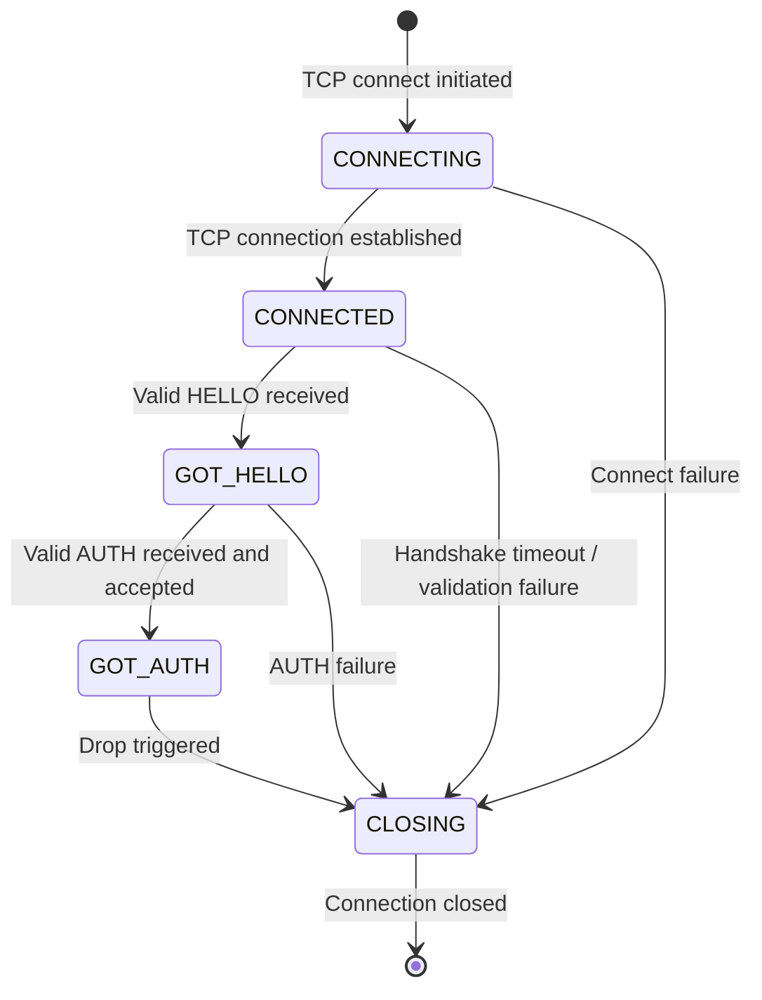
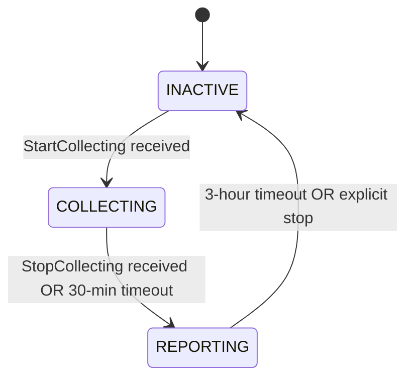

# Stellar Overlay Protocol Specification

**Version:** 25 (Overlay Protocol v35–v38)
**Status:** Informational
**Date:** 2026-02-20

---

## Table of Contents

1. [Introduction](#1-introduction)
2. [Protocol Overview](#2-protocol-overview)
3. [Data Encoding](#3-data-encoding)
4. [Connection Lifecycle](#4-connection-lifecycle)
5. [Message Framing and Authentication](#5-message-framing-and-authentication)
6. [Message Type Registry](#6-message-type-registry)
7. [Message Definitions](#7-message-definitions)
8. [Flow Control Protocol](#8-flow-control-protocol)
9. [Transaction Flooding Protocol](#9-transaction-flooding-protocol)
10. [Peer Management](#10-peer-management)
11. [Survey Protocol](#11-survey-protocol)
12. [Error Handling](#12-error-handling)
13. [Security Considerations](#13-security-considerations)
14. [Protocol Constants](#14-protocol-constants)
15. [References](#15-references)
16. [Appendices](#16-appendices)

---

## 1. Introduction

### 1.1 Purpose and Scope

This document specifies the Stellar Overlay Protocol as implemented in
stellar-core v25.x. The overlay protocol governs how Stellar network nodes
discover peers, establish authenticated connections, propagate transactions
and consensus messages, manage flow control, and conduct network topology
surveys.

This specification covers the complete wire protocol: message formats,
framing, authentication handshake, connection lifecycle, flooding,
flow control, peer management, and the survey subsystem. Implementation
details such as threading models and internal data structures are out of
scope except where they directly affect observable wire behavior.

### 1.2 Conventions and Terminology

The key words "MUST", "MUST NOT", "REQUIRED", "SHALL", "SHALL NOT",
"SHOULD", "SHOULD NOT", "RECOMMENDED", "MAY", and "OPTIONAL" in this
document are to be interpreted as described in [RFC 2119][rfc2119].

| Term | Definition |
|------|-----------|
| **Node** | A participant in the Stellar network running the overlay protocol. |
| **Peer** | A remote node with which a local node has an active TCP connection. |
| **Initiator** | The node that opens the TCP connection (`WE_CALLED_REMOTE`). |
| **Responder** | The node that accepts the TCP connection (`REMOTE_CALLED_US`). |
| **Authenticated peer** | A peer that has completed the full HELLO/AUTH handshake. |
| **Pending peer** | A peer whose TCP connection is established but handshake is incomplete. |
| **Preferred peer** | A peer explicitly configured in `PREFERRED_PEERS` or `PREFERRED_PEER_KEYS`. |
| **Flood message** | A message subject to flow control: `SCP_MESSAGE`, `TRANSACTION`, `FLOOD_DEMAND`, `FLOOD_ADVERT`. |
| **NodeID** | An Ed25519 public key identifying a node (`PublicKey` in XDR). |
| **Nonce** | A 32-byte random value generated per connection, used in key derivation. |
| **AuthCert** | An ephemeral Curve25519 public key signed by a node's Ed25519 key, with an expiration. |

### 1.3 Document Organization

Sections 2–3 provide an overview of the protocol architecture and data
encoding. Sections 4–5 specify the connection lifecycle and message
authentication. Sections 6–7 define the complete message catalog. Sections
8–9 specify flow control and transaction flooding. Section 10 covers peer
management. Section 11 specifies the survey subsystem. Sections 12–14
cover error handling, security, and protocol constants.

---

## 2. Protocol Overview

### 2.1 Network Architecture

The Stellar network is a peer-to-peer overlay where nodes communicate
directly over TCP. Nodes fall into two categories:

- **Validators**: Participate in the Stellar Consensus Protocol (SCP) and
  vote on transaction sets. Validators produce and sign SCP messages.
- **Watchers**: Observe the network and apply consensus results but do not
  vote. Watchers still participate fully in the overlay protocol.

Each connection has an asymmetric role:

- **Initiator** (`WE_CALLED_REMOTE`): The node that opens the TCP connection.
- **Responder** (`REMOTE_CALLED_US`): The node that accepts the connection.

These roles affect handshake sequencing (Section 4.4) and MAC key
derivation (Section 5.3).

### 2.2 Design Goals

1. **Determinism**: All protocol behavior MUST be deterministic across
   implementations to ensure network consistency.
2. **Authenticated communication**: All post-handshake messages are
   integrity-protected with per-connection HMAC keys.
3. **Flow control**: Peers MUST implement dual-axis (message count + byte
   count) flow control to prevent resource exhaustion.
4. **Pull-mode flooding**: Transactions are disseminated using an
   advertise-demand-deliver model to reduce bandwidth waste.
5. **Push-mode consensus**: SCP messages are flooded directly (push mode)
   to minimize consensus latency.

### 2.3 Protocol Stack

```
┌─────────────────────────────────────┐
│  Application (SCP, Transactions)    │
├─────────────────────────────────────┤
│  Overlay Protocol (this spec)       │
│  ┌───────────────────────────────┐  │
│  │ Flow Control & Flooding       │  │
│  ├───────────────────────────────┤  │
│  │ Authenticated Messages (HMAC) │  │
│  ├───────────────────────────────┤  │
│  │ XDR Serialization             │  │
│  └───────────────────────────────┘  │
├─────────────────────────────────────┤
│  Record Marking (RFC 5531)          │
├─────────────────────────────────────┤
│  TCP                                │
└─────────────────────────────────────┘
```

---

## 3. Data Encoding

### 3.1 XDR Serialization

All overlay messages are serialized using XDR (External Data
Representation) as specified in [RFC 4506][rfc4506]. XDR provides a
canonical, platform-independent binary encoding with the following
properties:

- Integers are big-endian.
- Strings and opaque data are length-prefixed with 4-byte counts, padded
  to 4-byte boundaries.
- Unions are discriminated by an enum or integer tag.

The complete XDR schema for the overlay protocol is defined in
`Stellar-overlay.x` (reproduced in [Appendix A](#appendix-a-xdr-schema)).

### 3.2 Record Marking Framing

Messages are framed using the Record Marking standard defined in
[RFC 5531][rfc5531], Section 11.

Each message is preceded by a 4-byte header:

```
 0                   1                   2                   3
 0 1 2 3 4 5 6 7 8 9 0 1 2 3 4 5 6 7 8 9 0 1 2 3 4 5 6 7 8 9 0 1
+-+-+-+-+-+-+-+-+-+-+-+-+-+-+-+-+-+-+-+-+-+-+-+-+-+-+-+-+-+-+-+-+
|L|                    Fragment Length (31 bits)                 |
+-+-+-+-+-+-+-+-+-+-+-+-+-+-+-+-+-+-+-+-+-+-+-+-+-+-+-+-+-+-+-+-+
```

- **L (1 bit)**: Last fragment flag. This bit is masked off by the
  receiver and MUST be ignored for length computation.
- **Fragment Length (31 bits)**: The length in bytes of the XDR-encoded
  message that follows, in network byte order.

The receiver MUST:
1. Read 4 bytes for the header.
2. Mask off bit 31 (the high bit of byte 0): `length = header & 0x7FFFFFFF`.
3. Validate the length (see Section 5.5).
4. Read exactly `length` bytes of XDR-encoded message body.

### 3.3 Cryptographic Primitives

The overlay protocol uses the following cryptographic primitives:

| Primitive | Algorithm | Key/Output Size | Usage |
|-----------|-----------|-----------------|-------|
| Node identity | Ed25519 | 256-bit | Long-lived node signing key |
| Ephemeral key agreement | X25519 (Curve25519) | 256-bit | Per-session ECDH |
| Key derivation | HKDF (HMAC-SHA-256) | 256-bit | Derive MAC keys from ECDH output |
| Message authentication | HMAC-SHA-256 | 256-bit | Per-message integrity |
| Hashing | SHA-256 | 256-bit | AuthCert signing, general hashing |
| Message deduplication | BLAKE2 | 256-bit | Flood message deduplication |

---

## 4. Connection Lifecycle

### 4.1 Transport

The overlay protocol operates over TCP. Implementations MUST set the
following socket options on all connections:

- `TCP_NODELAY = true` (disable Nagle's algorithm)
- `SO_LINGER = false, timeout = 0` (immediate close, no linger)

The default listening port is **11625**.

### 4.2 Peer Discovery and Address Resolution

Nodes discover peers through three mechanisms:

1. **Configuration**: `KNOWN_PEERS` and `PREFERRED_PEERS` lists in the
   node configuration, which may contain hostnames requiring DNS
   resolution.
2. **PEERS messages**: Authenticated outbound peers receive a `PEERS`
   message containing up to 50 peer addresses upon successful handshake
   (Section 7.2).
3. **Peer database**: Previously seen peers are persisted in a local
   database (Section 10.1).

DNS resolution for configured peers is performed periodically:

- **Normal interval**: Every 600 seconds (10 minutes).
- **Retry on failure**: Every `retryCount * 10` seconds, up to a maximum
  of 600 seconds (after 60 retries, retries are disabled and the normal
  interval is used).

### 4.3 Connection Establishment

Connections are initiated in two directions:

- **Outbound**: The local node connects to a remote peer's listening port.
- **Inbound**: A remote peer connects to the local node's listening port
  via the TCP acceptor (listen backlog of 100).

On accepting an inbound connection, the receiver MUST check that space is
available for the connection before allocating resources (Section 10.2).

### 4.4 Authentication Handshake

The authentication handshake establishes mutual identity verification and
derives per-connection MAC keys for message integrity.

#### 4.4.1 Handshake Sequence

```
  Initiator (A)                          Responder (B)
  ─────────────                          ─────────────
  State: CONNECTING                      State: CONNECTED

  ──── HELLO(CertA, NonceA) ────────>
                                         Verify CertA
                                         Derive keys
                                         State → GOT_HELLO
  <──── HELLO(CertB, NonceB) ────────
  Verify CertB
  Derive keys
  State → GOT_HELLO

  ──── AUTH(seq=0, MAC_AB) ──────────>
                                         Verify MAC
                                         State → GOT_AUTH
  <──── AUTH(seq=0, MAC_BA) ──────────
  <──── PEERS ────────────────────────
  Verify MAC
  State → GOT_AUTH

  (Authenticated: all messages MACed with increasing sequence numbers)
```

The initiator sends HELLO first, then AUTH. The responder sends HELLO in
response to receiving the initiator's HELLO, then AUTH in response to
receiving the initiator's AUTH.

#### 4.4.2 HELLO Exchange

The `HELLO` message carries the following fields:

| Field | Type | Description |
|-------|------|-------------|
| `ledgerVersion` | `uint32` | Current ledger protocol version |
| `overlayVersion` | `uint32` | Overlay protocol version supported |
| `overlayMinVersion` | `uint32` | Minimum overlay version accepted |
| `networkID` | `Hash` | SHA-256 of the network passphrase |
| `versionStr` | `string<100>` | Software version string |
| `listeningPort` | `int` | TCP port the sender is listening on |
| `peerID` | `NodeID` | Ed25519 public key of the sender |
| `cert` | `AuthCert` | Ephemeral authentication certificate |
| `nonce` | `uint256` | 32-byte random nonce for this connection |

Upon receiving a HELLO, the receiver MUST perform the following validation
checks in order:

1. **State check**: The receiver MUST NOT have already received a HELLO
   from this peer. If the receiver is already in state `GOT_HELLO` or
   later, it MUST drop the connection.
2. **AuthCert verification**: The receiver MUST verify the remote peer's
   AuthCert (Section 4.4.3). If verification fails, the connection MUST
   be dropped.
3. **Ban check**: If the remote `peerID` is banned, the connection MUST
   be dropped.
4. **Overlay version compatibility**: The receiver MUST check:
   - `remoteOverlayMinVersion <= remoteOverlayVersion` (coherent range)
   - `remoteOverlayVersion >= localOverlayMinVersion` (not too old)
   - `remoteOverlayMinVersion <= localOverlayVersion` (not too new)
   - If any check fails: send `ERROR_MSG(ERR_CONF, "wrong protocol version")`
     and drop.
5. **Self-connection detection**: If `remotePeerID == localNodeID`, send
   `ERROR_MSG(ERR_CONF, "connecting to self")` and drop.
6. **Network ID check**: If `remoteNetworkID != localNetworkID`, send
   `ERROR_MSG(ERR_CONF, "wrong network passphrase")` and drop.
7. **Port validation**: If `listeningPort <= 0` or `> 65535` or the
   remote IP cannot be determined, send
   `ERROR_MSG(ERR_CONF, "bad address")` and drop.
8. **Duplicate peer check**: If the remote `peerID` already appears among
   authenticated or pending peers (excluding this connection), send
   `ERROR_MSG(ERR_CONF, "already-connected peer")` and drop.

#### 4.4.3 AuthCert Verification

An `AuthCert` contains:

| Field | Type | Description |
|-------|------|-------------|
| `pubkey` | `Curve25519Public` | Ephemeral X25519 public key (32 bytes) |
| `expiration` | `uint64` | Unix timestamp when the cert expires |
| `sig` | `Signature` | Ed25519 signature |

**Cert creation**: The signature covers a SHA-256 hash of the XDR
serialization of:

```
sig = Ed25519_Sign(nodeSecret,
        SHA256(XDR(networkID || ENVELOPE_TYPE_AUTH || expiration || pubkey)))
```

Where `ENVELOPE_TYPE_AUTH` is the XDR enum value `3` (4 bytes,
big-endian).

**Cert verification**: The receiver MUST verify:

1. `cert.expiration >= currentTime` (the cert has not expired).
2. `Ed25519_Verify(remotePeerID, cert.sig, SHA256(XDR(networkID || ENVELOPE_TYPE_AUTH || cert.expiration || cert.pubkey)))` succeeds.

**Cert rotation**: Certificates expire after **3600 seconds** (1 hour)
from creation. A new certificate is generated when less than **1800
seconds** (30 minutes) of validity remain. The underlying Curve25519
keypair is generated once at node startup and reused across certificate
rotations; only the expiration and signature are refreshed.

#### 4.4.4 Key Derivation

After the HELLO exchange, both sides derive per-connection HMAC keys
using ECDH and HKDF.

**Step 1: ECDH shared secret**

```
sharedSecret = X25519(localCurve25519Secret, remoteCurve25519Public)
```

Both sides compute the same 32-byte shared secret.

**Step 2: Key ordering**

The initiator's public key is designated `publicA`; the responder's is
`publicB`:

```
if role == INITIATOR:
    publicA = localCurve25519Public
    publicB = remoteCurve25519Public
else:
    publicA = remoteCurve25519Public
    publicB = localCurve25519Public
```

**Step 3: HKDF-Extract**

```
sharedKey = HKDF-Extract(salt = <32 zero bytes>,
                         ikm  = sharedSecret || publicA || publicB)
         = HMAC-SHA256(key = <32 zero bytes>,
                       data = sharedSecret || publicA || publicB)
```

Input is 96 bytes (32 + 32 + 32). Output is a 32-byte shared key.

**Step 4: Direction-specific MAC keys via HKDF-Expand**

Two MAC keys are derived, distinguished by a direction byte and nonce
ordering:

| Key | Direction byte | Nonce order | Used by |
|-----|---------------|-------------|---------|
| K_AB (initiator→responder) | `0x00` | `nonceA \|\| nonceB` | Initiator sends, Responder receives |
| K_BA (responder→initiator) | `0x01` | `nonceB \|\| nonceA` | Responder sends, Initiator receives |

For the **initiator**:
```
sendKey = HKDF-Expand(sharedKey, 0x00 || localNonce || remoteNonce)
recvKey = HKDF-Expand(sharedKey, 0x01 || remoteNonce || localNonce)
```

For the **responder**:
```
sendKey = HKDF-Expand(sharedKey, 0x01 || localNonce || remoteNonce)
recvKey = HKDF-Expand(sharedKey, 0x00 || remoteNonce || localNonce)
```

Where `HKDF-Expand(key, info)` is a single-step expansion:
```
HKDF-Expand(key, info) = HMAC-SHA256(key, info || 0x01)
```

The trailing `0x01` is the HKDF counter byte for single-block expansion.

**Key immutability**: Once a MAC key is set, it MUST NOT be changed for
the lifetime of the connection.

#### 4.4.5 AUTH Exchange

After the HELLO exchange and key derivation, the initiator sends an
`AUTH` message. The `AUTH` message contains:

| Field | Type | Description |
|-------|------|-------------|
| `flags` | `int` | MUST be set to `AUTH_MSG_FLAG_FLOW_CONTROL_BYTES_REQUESTED` (200) |

The AUTH message is the first message protected by the connection's HMAC
keys (sequence number 0).

Upon receiving AUTH, the receiver MUST verify:

1. **State check**: The receiver MUST be in state `GOT_HELLO`. If not,
   send `ERROR_MSG(ERR_MISC, "out-of-order AUTH message")` and drop.
2. **Acceptance check**: The overlay manager MUST accept the peer
   (Section 10.2). If rejected, send
   `ERROR_MSG(ERR_LOAD, "peer rejected")` and drop.
3. **Flow control flag**: `auth.flags` MUST equal
   `AUTH_MSG_FLAG_FLOW_CONTROL_BYTES_REQUESTED` (200). If not, send
   `ERROR_MSG(ERR_CONF, "flow control bytes disabled")` and drop.

After successful AUTH:

- The receiver transitions to state `GOT_AUTH`.
- If the receiver is the responder, it sends its own AUTH message back,
  followed by a `PEERS` message.
- Both sides send an initial `SEND_MORE_EXTENDED` message to grant flow
  control capacity (Section 8.3).
- Both sides send `GET_SCP_STATE` to request the peer's current consensus
  state.

### 4.5 Peer State Machine

Each peer connection progresses through the following states:



| State | Code | Description |
|-------|------|-------------|
| `CONNECTING` | 0 | TCP connection is being established (outbound only). |
| `CONNECTED` | 1 | TCP connection established; awaiting HELLO. |
| `GOT_HELLO` | 2 | HELLO received and validated; awaiting AUTH. |
| `GOT_AUTH` | 3 | Fully authenticated; normal message exchange. |
| `CLOSING` | 4 | Connection is being torn down. |

### 4.6 Connection Maintenance

Authenticated connections are maintained through periodic checks
performed every **5 seconds** (the recurrent timer period).

The following checks are performed on each tick:

1. **Idle timeout**: If both `(now - lastRead) >= timeout` and
   `(now - lastWrite) >= timeout`, drop the peer with reason
   `"idle timeout"`.
   - `timeout` = 2 seconds for unauthenticated peers
     (`PEER_AUTHENTICATION_TIMEOUT`).
   - `timeout` = 30 seconds for authenticated peers (`PEER_TIMEOUT`).

2. **No outbound capacity timeout**: If the peer has not sent a
   `SEND_MORE_EXTENDED` message for 60 seconds
   (`PEER_SEND_MODE_IDLE_TIMEOUT`), and there are messages queued for
   sending, drop with reason
   `"idle timeout (no new flood requests)"` (Section 8.5).

3. **Straggler timeout**: If the time since the last write was enqueued
   exceeds 120 seconds (`PEER_STRAGGLER_TIMEOUT`), drop with reason
   `"straggling (cannot keep up)"`.

**Ping mechanism**: Every 5 seconds, if no ping is outstanding, the node
sends a `GET_SCP_QUORUMSET` with a synthetic hash derived from the
current time. The response (either `SCP_QUORUMSET` or `DONT_HAVE`) is
matched against the expected hash to measure round-trip latency.

### 4.7 Connection Termination

A connection is terminated by calling `drop()` on the peer, which:

1. Transitions the peer to state `CLOSING`.
2. If an error message is provided, sends an `ERROR_MSG` to the remote
   peer before closing.
3. Schedules a socket shutdown after a **5-second** delay to allow
   buffered writes to drain.

The remote peer receiving an `ERROR_MSG` MUST treat it as a connection
termination by the sender (direction: `REMOTE_DROPPED_US`).

---

## 5. Message Framing and Authentication

### 5.1 AuthenticatedMessage Structure

All post-handshake messages are wrapped in an `AuthenticatedMessage`
envelope:

```
union AuthenticatedMessage switch (uint32 v) {
case 0:
    struct {
        uint64         sequence;
        StellarMessage message;
        HmacSha256Mac  mac;
    } v0;
};
```

- **`sequence`**: Monotonically increasing 64-bit counter, starting at 0.
- **`message`**: The payload `StellarMessage` union (Section 7).
- **`mac`**: HMAC-SHA-256 over the XDR serialization of `(sequence || message)`.

### 5.2 HMAC Computation

**Sending**:

For each message where `type != HELLO` and `type != ERROR_MSG`:

```
authenticatedMsg.v0.sequence = sendSequence
authenticatedMsg.v0.message  = stellarMessage
authenticatedMsg.v0.mac      = HMAC-SHA256(sendMacKey,
                                 XDR(sendSequence || stellarMessage))
sendSequence++
```

For `HELLO` and `ERROR_MSG` messages, the sequence and MAC fields are
set to zero and the sequence counter is NOT incremented. These messages
are sent without integrity protection.

**Receiving**:

For each message where the peer state is `>= GOT_HELLO` and
`type != ERROR_MSG`:

1. The receiver MUST verify that `msg.v0.sequence == recvSequence`. If
   not, the receiver MUST drop the connection with `ERR_AUTH`
   ("unexpected auth sequence").
2. The receiver MUST verify that the receiving MAC key is non-zero. If
   the key is all zeros, drop with `ERR_AUTH`
   ("receive mac key is zero").
3. The receiver MUST verify:
   ```
   HMAC-SHA256-Verify(msg.v0.mac, recvMacKey,
                      XDR(msg.v0.sequence || msg.v0.message))
   ```
   Verification MUST use constant-time comparison. If it fails, drop
   with `ERR_AUTH` ("unexpected MAC").
4. Increment `recvSequence++`.

**Exemptions**: HELLO messages are never MAC-verified (the peer state is
`< GOT_HELLO` when they arrive). ERROR_MSG is explicitly exempted from
MAC verification even after authentication, allowing error messages to
be sent before keys are established.

### 5.3 Sequence Numbers and Replay Protection

Both the send and receive sequence counters start at 0. The first
authenticated message (the AUTH message) has sequence 0.

Messages MUST be received in the exact order they were sent. Any
out-of-order message (wrong sequence number) MUST be rejected. This
provides replay protection: replaying a message with a previously used
sequence number will fail the sequence check.

### 5.4 Message Size Limits

| Context | Maximum Size | Description |
|---------|-------------|-------------|
| Unauthenticated | 4,096 bytes (`0x1000`) | Before handshake completes |
| Authenticated | 16,777,216 bytes (16 MiB) | General message limit |
| Transaction set | 10,485,760 bytes (10 MiB) | `TX_SET` / `GENERALIZED_TX_SET` |
| Classic transaction | 102,400 bytes (100 KiB) | Single classic transaction |
| Soroban allowance | 5,242,880 bytes (5 MiB) | Half of tx set allowance |
| Classic allowance | 5,242,880 bytes (5 MiB) | Half of tx set allowance |

The receiver MUST validate the Record Marking header length:
- If `length <= 0`: drop the connection.
- If peer is unauthenticated and `length > 4,096`: drop the connection.
- If `length > 16,777,216`: drop the connection.

---

## 6. Message Type Registry

| Type Code | Name | Category | Direction | Reference |
|-----------|------|----------|-----------|-----------|
| 0 | `ERROR_MSG` | Core | Both | [7.1.3](#713-error_msg) |
| 2 | `AUTH` | Handshake | Both | [7.1.2](#712-auth) |
| 3 | `DONT_HAVE` | Core | Both | [7.7](#77-dont_have) |
| 5 | `PEERS` | Peer discovery | Responder→Initiator | [7.2](#72-peers) |
| 6 | `GET_TX_SET` | Transaction sets | Both | [7.4.1](#741-get_tx_set) |
| 7 | `TX_SET` | Transaction sets | Both | [7.4.2](#742-tx_set) |
| 8 | `TRANSACTION` | Flooding | Both | [7.5.1](#751-transaction) |
| 9 | `GET_SCP_QUORUMSET` | SCP | Both | [7.3.2](#732-get_scp_quorumset) |
| 10 | `SCP_QUORUMSET` | SCP | Both | [7.3.3](#733-scp_quorumset) |
| 11 | `SCP_MESSAGE` | SCP/Flooding | Both | [7.3.1](#731-scp_message) |
| 12 | `GET_SCP_STATE` | SCP | Both | [7.3.4](#734-get_scp_state) |
| 13 | `HELLO` | Handshake | Both | [7.1.1](#711-hello) |
| 16 | `SEND_MORE` | Flow control | Both | [7.6.1](#761-send_more-deprecated) |
| 17 | `GENERALIZED_TX_SET` | Transaction sets | Both | [7.4.3](#743-generalized_tx_set) |
| 18 | `FLOOD_ADVERT` | Flooding | Both | [7.5.2](#752-flood_advert) |
| 19 | `FLOOD_DEMAND` | Flooding | Both | [7.5.3](#753-flood_demand) |
| 20 | `SEND_MORE_EXTENDED` | Flow control | Both | [7.6.2](#762-send_more_extended) |
| 21 | `TIME_SLICED_SURVEY_REQUEST` | Survey | Both | [11.4](#114-survey-requestresponse-flow) |
| 22 | `TIME_SLICED_SURVEY_RESPONSE` | Survey | Both | [11.4](#114-survey-requestresponse-flow) |
| 23 | `TIME_SLICED_SURVEY_START_COLLECTING` | Survey | Both | [11.3](#113-survey-initiation-and-termination) |
| 24 | `TIME_SLICED_SURVEY_STOP_COLLECTING` | Survey | Both | [11.3](#113-survey-initiation-and-termination) |

Type codes 1, 4, 14, and 15 are reserved (deprecated or removed).

---

## 7. Message Definitions

### 7.1 Handshake Messages

#### 7.1.1 HELLO

Sent as the first message of the authentication handshake.

```
struct Hello {
    uint32    ledgerVersion;
    uint32    overlayVersion;
    uint32    overlayMinVersion;
    Hash      networkID;
    string    versionStr<100>;
    int       listeningPort;
    NodeID    peerID;
    AuthCert  cert;
    uint256   nonce;
};
```

**Behavioral requirements**:
- Each peer MUST send exactly one HELLO per connection.
- HELLO MUST be the first message sent on a new connection.
- HELLO messages are NOT MAC-protected (they are sent before key
  derivation).
- The receiver MUST validate the HELLO according to Section 4.4.2.

#### 7.1.2 AUTH

Sent after the HELLO exchange to complete authentication.

```
struct Auth {
    int flags;
};
```

**Behavioral requirements**:
- `flags` MUST be set to `AUTH_MSG_FLAG_FLOW_CONTROL_BYTES_REQUESTED`
  (200).
- AUTH is the first MAC-protected message (sequence number 0).
- The initiator sends AUTH first; the responder sends AUTH in response.

#### 7.1.3 ERROR_MSG

Sent to indicate an error condition before dropping the connection.

```
struct Error {
    ErrorCode code;
    string    msg<100>;
};
```

**Behavioral requirements**:
- ERROR_MSG is exempt from MAC verification, allowing it to be sent at
  any point in the connection lifecycle.
- Upon receiving an ERROR_MSG, the receiver MUST treat the connection as
  terminated by the remote peer.
- The error message string MUST be sanitized on receipt: non-alphanumeric,
  non-space characters SHOULD be replaced with `*`.

### 7.2 PEERS

Sent by the responder to the initiator after successful authentication.

```
case PEERS: PeerAddress peers<100>;
```

Where:
```
struct PeerAddress {
    union switch (IPAddrType type) {
        case IPv4: opaque ipv4[4];
        case IPv6: opaque ipv6[16];
    } ip;
    uint32 port;
    uint32 numFailures;
};
```

**Behavioral requirements**:
- Only the responder (`REMOTE_CALLED_US`) sends PEERS. If the initiator
  receives PEERS, it is an error; the responder receiving PEERS from an
  inbound peer MUST drop the connection.
- At most one PEERS message is allowed per connection. A second PEERS
  message MUST cause the connection to be dropped.
- At most **50** peer addresses are included.
- IPv6 addresses, private addresses, localhost addresses, the recipient's
  own address, and addresses with invalid ports (0 or > 65535) MUST be
  excluded.
- Only peers with fewer than **10** failures are included.

### 7.3 SCP Messages

#### 7.3.1 SCP_MESSAGE

Carries an SCP consensus envelope. This is a **flood message** (subject
to flow control) and is disseminated using **push mode** (sent directly
to peers, not via advert/demand).

```
case SCP_MESSAGE: SCPEnvelope envelope;
```

SCP messages have the **highest** flood priority (priority 0).

#### 7.3.2 GET_SCP_QUORUMSET

Requests a quorum set by hash. Also used for ping measurement.

```
case GET_SCP_QUORUMSET: uint256 qSetHash;
```

**Rate limiting**: Subject to per-peer windowed rate limiting
(Section 10.5).

#### 7.3.3 SCP_QUORUMSET

Returns a quorum set in response to `GET_SCP_QUORUMSET`.

```
case SCP_QUORUMSET: SCPQuorumSet qSet;
```

#### 7.3.4 GET_SCP_STATE

Requests the peer's SCP state for a given ledger.

```
case GET_SCP_STATE: uint32 getSCPLedgerSeq;
```

A value of 0 means "the latest ledger".

### 7.4 Transaction Set Messages

#### 7.4.1 GET_TX_SET

Requests a transaction set by hash.

```
case GET_TX_SET: uint256 txSetHash;
```

**Rate limiting**: Subject to per-peer windowed rate limiting
(Section 10.5).

#### 7.4.2 TX_SET

Returns a legacy (non-generalized) transaction set.

```
case TX_SET: TransactionSet txSet;
```

#### 7.4.3 GENERALIZED_TX_SET

Returns a generalized transaction set (protocol 20+).

```
case GENERALIZED_TX_SET: GeneralizedTransactionSet generalizedTxSet;
```

### 7.5 Flood Messages

#### 7.5.1 TRANSACTION

Carries a single transaction. This is a **flood message** with
priority 1.

```
case TRANSACTION: TransactionEnvelope transaction;
```

Transactions are disseminated using **pull mode**: nodes advertise
transaction hashes via `FLOOD_ADVERT`, peers demand specific
transactions via `FLOOD_DEMAND`, and the transaction is sent in
response to a demand (Section 9).

#### 7.5.2 FLOOD_ADVERT

Advertises known transaction hashes to a peer. This is a **flood
message** with priority 3 (lowest).

```
const TX_ADVERT_VECTOR_MAX_SIZE = 1000;
typedef Hash TxAdvertVector<TX_ADVERT_VECTOR_MAX_SIZE>;

struct FloodAdvert {
    TxAdvertVector txHashes;
};
```

**Behavioral requirements**:
- Each advert carries up to 1000 transaction hashes.
- Adverts are batched and sent periodically (Section 9.3).

#### 7.5.3 FLOOD_DEMAND

Requests specific transactions by hash. This is a **flood message**
with priority 2.

```
const TX_DEMAND_VECTOR_MAX_SIZE = 1000;
typedef Hash TxDemandVector<TX_DEMAND_VECTOR_MAX_SIZE>;

struct FloodDemand {
    TxDemandVector txHashes;
};
```

**Behavioral requirements**:
- Each demand carries up to 1000 transaction hashes.
- Upon receiving a demand, the node MUST respond with the corresponding
  `TRANSACTION` message for each hash it holds.

### 7.6 Flow Control Messages

#### 7.6.1 SEND_MORE (Deprecated)

```
struct SendMore {
    uint32 numMessages;
};
```

This message type is **deprecated**. Implementations MUST send
`SEND_MORE_EXTENDED` instead. Receiving a `SEND_MORE` (without extended
fields) MUST cause the connection to be dropped.

#### 7.6.2 SEND_MORE_EXTENDED

Grants outbound flood capacity to the remote peer.

```
struct SendMoreExtended {
    uint32 numMessages;
    uint32 numBytes;
};
```

**Behavioral requirements**:
- `numBytes` MUST be non-zero. A value of 0 MUST cause the connection
  to be dropped.
- `numMessages` MAY be zero (to support byte-only capacity grants during
  protocol upgrades).
- The granted capacity MUST NOT cause overflow of the receiver's 64-bit
  outbound capacity counters. If adding the granted values would exceed
  `UINT64_MAX`, the connection MUST be dropped with
  `"Peer capacity overflow"`.

### 7.7 DONT_HAVE

Negative acknowledgment indicating the peer does not hold the requested
data.

```
struct DontHave {
    MessageType type;
    uint256     reqHash;
};
```

Sent in response to `GET_TX_SET` or `GET_SCP_QUORUMSET` when the
requested item is unavailable.

---

## 8. Flow Control Protocol

### 8.1 Overview and Motivation

Flow control prevents fast senders from overwhelming slow receivers. The
Stellar overlay uses a **credit-based** flow control system where the
receiver explicitly grants capacity to the sender via
`SEND_MORE_EXTENDED` messages. Only **flood messages** (`SCP_MESSAGE`,
`TRANSACTION`, `FLOOD_DEMAND`, `FLOOD_ADVERT`) are subject to flow
control. All other message types bypass flow control and are sent
immediately.

### 8.2 Capacity Model

Flow control operates on two independent axes:

1. **Message count**: Capacity measured in number of flood messages.
2. **Byte count**: Capacity measured in bytes of XDR-serialized message
   bodies.

Both axes MUST be satisfied simultaneously before a flood message can be
sent. A message can only be sent if there is sufficient capacity on
**both** axes.

Each peer connection maintains four capacity counters:

| Counter | Axis | Direction | Description |
|---------|------|-----------|-------------|
| Inbound flood capacity (messages) | Messages | Local | Messages we can still accept from this peer |
| Inbound flood capacity (bytes) | Bytes | Local | Bytes we can still accept from this peer |
| Outbound capacity (messages) | Messages | Remote | Messages the peer has told us we can send |
| Outbound capacity (bytes) | Bytes | Remote | Bytes the peer has told us we can send |

Additionally, a **total reading capacity** counter (messages only) tracks
all incoming messages (flood and non-flood) for read throttling purposes.

### 8.3 Initial Capacity Grant

Immediately after successful AUTH, each side sends a `SEND_MORE_EXTENDED`
to the peer, granting initial flood capacity:

```
SEND_MORE_EXTENDED {
    numMessages = PEER_FLOOD_READING_CAPACITY    (default: 200)
    numBytes    = floodReadingCapacityBytes       (default: 300,000)
}
```

The byte capacity default is auto-calculated:
- If `300,000 - 100,000 >= maxTxSize`: use **300,000** bytes.
- Otherwise: use `maxTxSize + 100,000` bytes.

### 8.4 Inbound Flow Control and Capacity Release

When a flood message is received:

1. **Lock capacity**: Decrement both inbound flood capacity (messages and
   bytes) by the message's resource count (1 for messages, `xdr_size(msg)`
   for bytes). If flood capacity is insufficient, the message MUST be
   rejected and the connection dropped.
2. **Process the message**.
3. **Release capacity**: Increment inbound capacity back.
4. **Accumulate processed counts**: Track the number of flood messages
   and bytes processed since the last `SEND_MORE_EXTENDED` was sent.

When the accumulated count reaches either threshold, a
`SEND_MORE_EXTENDED` MUST be sent back to the peer:

- **Message threshold**: `FLOW_CONTROL_SEND_MORE_BATCH_SIZE` (default: 40)
  messages processed.
- **Byte threshold**: `FLOW_CONTROL_SEND_MORE_BATCH_SIZE_BYTES` (default:
  100,000) bytes processed.

The thresholds are evaluated with OR logic: reaching **either** threshold
triggers the `SEND_MORE_EXTENDED`. Both accumulated counters are then
included in the message and reset to zero.

### 8.5 Outbound Flow Control and SEND_MORE Signaling

Outbound capacity starts at 0 and is incremented when the remote peer
sends `SEND_MORE_EXTENDED`. The sender dequeues flood messages from its
priority queues (Section 8.6) and sends them only when sufficient
outbound capacity exists on both axes.

When the sender has queued messages but no outbound capacity, it records
a "no capacity" timestamp. If this condition persists for
**60 seconds** (`PEER_SEND_MODE_IDLE_TIMEOUT`) without receiving any
`SEND_MORE_EXTENDED`, the connection MUST be dropped.

Receipt of a `SEND_MORE_EXTENDED` clears the "no capacity" timestamp.

### 8.6 Priority Queues

Outbound flood messages are organized into four priority queues,
serviced in strict priority order (highest first):

| Priority | Index | Message Type | Rationale |
|----------|-------|-------------|-----------|
| Highest | 0 | `SCP_MESSAGE` | Consensus messages are critical for liveness |
| High | 1 | `TRANSACTION` | Transactions are the primary payload |
| Medium | 2 | `FLOOD_DEMAND` | Demands complete the pull-mode cycle |
| Low | 3 | `FLOOD_ADVERT` | Adverts initiate pull-mode; can be delayed |

When sending, the implementation iterates queues from priority 0 to 3.
For each queue, messages are dequeued front-to-back. If outbound capacity
is exhausted while processing a queue, the sender proceeds to the next
queue (lower-priority messages are still checked). This ensures SCP
messages are always sent first.

### 8.7 Load Shedding

When outbound queues grow beyond their limits, load shedding is applied:

**TRANSACTION queue** (priority 1):
- Limit: `OUTBOUND_TX_QUEUE_BYTE_LIMIT` (default: 3 MiB) bytes, or
  `lastMaxTxSetSizeOps` messages.
- Transactions larger than `getMaxTxSize()` are silently rejected (not
  enqueued).
- When either limit is exceeded, the **entire** transaction queue is
  cleared (all-or-nothing shedding).

**SCP_MESSAGE queue** (priority 0):
- SCP messages are never bulk-dropped. Instead, selective trimming is
  applied:
  1. Messages for ledger slots older than the minimum remembered slot
     are removed.
  2. If a newer nomination/ballot statement from the same validator
     exists, the older statement is replaced.

**FLOOD_ADVERT queue** (priority 3):
- Limit: `lastMaxTxSetSizeOps` total transaction hashes across all
  queued adverts.
- When exceeded, the entire advert queue is cleared.

**FLOOD_DEMAND queue** (priority 2):
- Limit: `lastMaxTxSetSizeOps` total transaction hashes across all
  queued demands.
- When exceeded, the entire demand queue is cleared.

### 8.8 Read Throttling

When the total reading capacity counter (messages) reaches zero, the
node MUST stop reading from the peer's TCP socket. This prevents memory
exhaustion from unbounded message queuing.

Reading resumes when a full batch of `PEER_READING_CAPACITY` (default:
201) messages has been processed, restoring the total capacity counter.

The relationship `PEER_READING_CAPACITY > PEER_FLOOD_READING_CAPACITY`
MUST hold (default: 201 > 200), ensuring at least 1 message of headroom
for non-flood messages even when flood capacity is exhausted.

### 8.9 Capacity Constraints

Implementations MUST enforce the following constraints on configuration:

- `FLOW_CONTROL_SEND_MORE_BATCH_SIZE <= PEER_FLOOD_READING_CAPACITY`
- `PEER_READING_CAPACITY > PEER_FLOOD_READING_CAPACITY`
- `PEER_FLOOD_READING_CAPACITY_BYTES - FLOW_CONTROL_SEND_MORE_BATCH_SIZE_BYTES >= MAX_CLASSIC_TX_SIZE_BYTES`

The last constraint ensures the sender can always send at least one
maximum-size transaction before needing an acknowledgment.

---

## 9. Transaction Flooding Protocol

### 9.1 Overview

Transactions are disseminated across the network using a **pull-mode**
protocol:

```
  Node A                    Node B
  ──────                    ──────
  Has new tx T

  ── FLOOD_ADVERT(hash(T)) ──>
                              Checks: do I need T?
  <── FLOOD_DEMAND(hash(T)) ──
                              (yes, demand it)
  ── TRANSACTION(T) ──────────>
```

This model reduces bandwidth by ensuring each node only receives
transactions it actually needs, rather than receiving duplicates from
multiple peers.

### 9.2 Broadcast Deduplication

When a node has a message to broadcast, it maintains a **flood record**
per message (keyed by the BLAKE2 hash of the serialized
`StellarMessage`). The flood record tracks which peers have been told
about this message, ensuring each peer is advertised or sent the
message at most once.

Flood records are garbage-collected when the consensus ledger advances
past their creation ledger.

### 9.3 Advertisement Batching

Outgoing transaction advertisements are batched for efficiency:

1. When a new transaction is ready to broadcast, its hash is queued in
   a per-peer outgoing advert buffer.
2. The buffer is flushed when either condition is met:
   - **Size trigger**: The buffer reaches `maxAdvertSize` hashes.
   - **Timer trigger**: The advert timer fires (default: every
     **100 ms**, `FLOOD_ADVERT_PERIOD_MS`).

The `maxAdvertSize` is dynamically computed:

```
opsToFlood = FLOOD_OP_RATE_PER_LEDGER * lastMaxTxSetSizeOps
           + FLOOD_SOROBAN_RATE_PER_LEDGER * ledgerMaxTxCount  (if protocol >= 20)

maxAdvertSize = clamp(
    ceil(opsToFlood * FLOOD_ADVERT_PERIOD_MS / expectedLedgerCloseTime),
    1,
    TX_ADVERT_VECTOR_MAX_SIZE    // 1000
)
```

**Per-peer deduplication**: Before queuing an advert hash, the node
checks a per-peer advert history cache (50,000 entries). If the hash
has already been advertised to or received from this peer, the advert
is suppressed.

### 9.4 Incoming Advert Processing

When a `FLOOD_ADVERT` is received:

1. All transaction hashes are recorded in the per-peer advert history
   cache with the current ledger sequence.
2. Hashes are pushed into an incoming advert queue (FIFO).
3. The queue is trimmed to `lastMaxTxSetSizeOps` entries by evicting
   the oldest entries from the front.

A **retry queue** also exists for hashes whose demand was deferred
(Section 9.5). The retry queue has priority over the incoming queue when
popping hashes for demand scheduling.

### 9.5 Demand Scheduling

The demand scheduler runs every **200 ms** (`FLOOD_DEMAND_PERIOD_MS`)
and constructs `FLOOD_DEMAND` messages for peers.

**Demand status decision** for each transaction hash:

1. If the transaction is already known (in the transaction pool or
   banned): **DISCARD**.
2. If no demand has been issued for this hash yet: **DEMAND** (first
   attempt).
3. If this specific peer has already been demanded: **DISCARD**.
4. If the number of peers demanded is less than `MAX_RETRY_COUNT` (15)
   and the backoff period has elapsed: **DEMAND** (retry from a
   different peer).
5. If the backoff period has not elapsed: **RETRY_LATER** (re-queue).
6. If all retry attempts are exhausted: **DISCARD**.

**Backoff formula** (linear):

```
delay = numAttemptsMade * FLOOD_DEMAND_BACKOFF_DELAY_MS
delay = min(delay, MAX_DELAY_DEMAND)
```

| Attempt | Delay |
|---------|-------|
| 0 | 0 ms (immediate) |
| 1 | 500 ms |
| 2 | 1,000 ms |
| 3 | 1,500 ms |
| 4+ | 2,000 ms (capped) |

Constants:
- `FLOOD_DEMAND_BACKOFF_DELAY_MS`: 500 ms (default)
- `MAX_DELAY_DEMAND`: 2,000 ms
- `MAX_RETRY_COUNT`: 15

**Fair distribution**: The scheduler iterates over a randomized list of
peers. For each peer, it pops one advert hash and issues a demand.
This round-robin approach repeats until no peer receives a new demand
in a complete round, ensuring demand pressure is distributed evenly.

**Garbage collection**: Demand records older than
`MAX_DELAY_DEMAND * MAX_RETRY_COUNT * 2` (60 seconds) are purged.

### 9.6 Transaction Delivery

Upon receiving a `FLOOD_DEMAND`, the node looks up each requested
transaction hash in its transaction pool:

- If found: respond with the corresponding `TRANSACTION` message.
- If not found: no response is sent (the demanding peer will retry
  with a different peer after the backoff period).

### 9.7 SCP Message Flooding (Push Mode)

Unlike transactions, SCP consensus messages (`SCP_MESSAGE`) are
disseminated using **push mode**: the message is sent directly to all
authenticated peers that have not already seen it, without the
advert/demand cycle. This minimizes latency for consensus-critical
messages.

The flood record (Section 9.2) still tracks which peers have been sent
each SCP message to prevent duplicates.

---

## 10. Peer Management

### 10.1 Peer Database and Persistence

Peer addresses are persisted in a local SQLite database with the
following schema:

```sql
CREATE TABLE peers (
    ip            VARCHAR(15) NOT NULL,
    port          INT DEFAULT 0 CHECK (port > 0 AND port <= 65535) NOT NULL,
    nextattempt   TIMESTAMP NOT NULL,
    numfailures   INT DEFAULT 0 CHECK (numfailures >= 0) NOT NULL,
    type          INT NOT NULL,
    PRIMARY KEY (ip, port)
);
```

| Field | Description |
|-------|-------------|
| `ip` | IPv4 address string |
| `port` | TCP port |
| `nextattempt` | Earliest time for the next connection attempt |
| `numfailures` | Consecutive connection failure count |
| `type` | 0 = INBOUND, 1 = OUTBOUND, 2 = PREFERRED |

Peers with **120 or more** consecutive failures are deleted from the
database (`REALLY_DEAD_NUM_FAILURES_CUTOFF`).

### 10.2 Peer Selection and Connection Limits

#### Connection Limits

| Limit | Default | Description |
|-------|---------|-------------|
| Max outbound authenticated | 8 (`TARGET_PEER_CONNECTIONS`) | Target outbound peer count |
| Max inbound authenticated | 64 (`TARGET * 8`) | Max additional inbound peers |
| Max pending connections | 500 | Total pending connection budget |
| Listen backlog | 100 | TCP accept queue depth |

The pending connection budget is split between inbound and outbound
based on the ratio of configured target connections.

**Adjusted outbound target**: If there are zero inbound authenticated
peers, the outbound target is temporarily reduced to **3**
(`MIN_INBOUND_FACTOR`) to avoid excessive connection attempts when the
node is unreachable.

#### Acceptance Logic

When a peer completes authentication:

1. If the peer is **preferred**: It is always accepted. If the
   authenticated peer list is full, a **non-preferred** peer is evicted
   to make room (sent `ERR_LOAD "preferred peer selected instead"`).
2. If the peer is **non-preferred**: It is accepted only if slots are
   available and `PREFERRED_PEERS_ONLY` is not set.

#### Inbound Connection Space Check

Before allocating resources for an inbound connection, the node checks
that pending inbound slots are available. An additional **2** pending
slots (`POSSIBLY_PREFERRED_EXTRA`) are reserved for connections from IP
addresses that match known preferred peers.

### 10.3 Connection Attempt Backoff

Failed connection attempts trigger randomized exponential backoff:

```
backoffCount = min(MAX_BACKOFF_EXPONENT, numFailures)
delay = random_uniform(1, (1 << backoffCount) * SECONDS_PER_BACKOFF)
nextAttempt = now + delay
```

| Failures | Max Delay (seconds) |
|----------|-------------------|
| 0 | 10 |
| 1 | 20 |
| 2 | 40 |
| 3 | 80 |
| 4 | 160 |
| 5 | 320 |
| 6 | 640 |
| 7 | 1,280 |
| 8 | 2,560 |
| 9 | 5,120 |
| 10+ | 10,240 (capped) |

Where `SECONDS_PER_BACKOFF = 10` and `MAX_BACKOFF_EXPONENT = 10`.

The failure counter is incremented before each connection attempt
(`INCREASE`) and reset on successful connection (`RESET`, which sets
a small random delay of 1–10 seconds) or at startup for configured
peers (`HARD_RESET`, which sets delay to zero).

### 10.4 Preferred Peers and Eviction

A peer is considered **preferred** if either:

- Its address appears in the `PREFERRED_PEERS` configuration list, OR
- Its authenticated `NodeID` appears in the `PREFERRED_PEER_KEYS`
  configuration list.

Preferred peers receive priority treatment:

1. **Connection priority**: In each tick loop iteration, preferred peers
   are connected to before outbound or promotional connections.
2. **Eviction immunity**: Preferred peers are never evicted to make room
   for non-preferred peers.
3. **Eviction power**: When a preferred peer authenticates and the peer
   list is full, a non-preferred peer is evicted.
4. **Extra pending slots**: Connections from known preferred IPs get
   access to 2 additional pending inbound slots.
5. **Out-of-sync protection**: Preferred peers are excluded from the
   random disconnect mechanism (Section 10.7).

### 10.5 Rate Limiting

Per-peer rate limiting is applied to `GET_TX_SET` and
`GET_SCP_QUORUMSET` requests using a sliding window:

```
QUERY_WINDOW = expectedLedgerCloseTime * MAX_SLOTS_TO_REMEMBER
QUERIES_PER_WINDOW = QUERY_WINDOW_SECONDS * QUERY_RESPONSE_MULTIPLIER
```

With defaults:
- `expectedLedgerCloseTime`: ~5 seconds
- `MAX_SLOTS_TO_REMEMBER`: 12
- `QUERY_RESPONSE_MULTIPLIER`: 5
- `QUERY_WINDOW`: 60 seconds
- `QUERIES_PER_WINDOW`: 300

If a peer exceeds the limit, subsequent requests within the window are
silently ignored (no error is sent, no drop occurs).

### 10.6 Peer Banning

Nodes maintain a ban list in a local SQLite table:

```sql
CREATE TABLE ban (
    nodeid CHARACTER(56) NOT NULL PRIMARY KEY
);
```

Banned nodes are identified by their `NodeID` (Ed25519 public key in
strkey encoding). Connections from banned nodes are rejected during the
HELLO validation step (Section 4.4.2).

### 10.7 Out-of-Sync Reconnection

When a node is out of sync with the network (not tracking consensus),
it periodically drops a random non-preferred outbound peer to try
connecting to a potentially better peer:

1. The node waits **60 seconds** (`OUT_OF_SYNC_RECONNECT_DELAY`) after
   going out of sync before the first drop.
2. At most one peer is dropped per 60-second interval.
3. A drop only occurs if all outbound authenticated slots are full
   and at least one pending slot is available.
4. Preferred peers are excluded from random disconnection.
5. When the node returns to sync, the mechanism is deactivated.

### 10.8 Tick Loop

The overlay manager runs a periodic tick loop every **3 seconds**
(`PEER_AUTHENTICATION_TIMEOUT + 1`), with an initial delay of 2 seconds
after startup. Each tick performs:

1. **Cleanup**: Release resources for dropped peers with no remaining
   references.
2. **DNS resolution**: Process completed DNS resolutions; schedule new
   ones if needed.
3. **Survey update**: Advance the survey state machine if active.
4. **Preferred peer connections**: Connect to preferred peers first,
   evicting non-preferred peers if necessary.
5. **Out-of-sync reconnection**: Drop a random peer if out of sync
   (Section 10.7).
6. **Outbound connections**: Fill available outbound slots with peers
   from the database. Up to 50 candidates are loaded per batch.
   One pending slot is reserved for inbound-to-outbound promotion.
7. **Inbound promotion**: Attempt to promote known inbound-type peers
   to outbound connections.

---

## 11. Survey Protocol

### 11.1 Purpose and Overview

The survey protocol enables authorized nodes to collect network topology
and performance data from all participating nodes. It operates as an
overlay-layer protocol using flooded messages for request routing and
encrypted responses for privacy.

A survey produces a snapshot of the network's connectivity graph and
per-peer performance metrics over a defined collection interval.

### 11.2 Survey Lifecycle

The survey protocol operates as a three-phase state machine:



| Phase | Duration | Description |
|-------|----------|-------------|
| `INACTIVE` | Indefinite | No survey active. Accepts StartCollecting. |
| `COLLECTING` | Up to 30 minutes | Passively accumulating per-peer metrics. No request/response traffic. |
| `REPORTING` | Up to 3 hours | Responding to survey requests with finalized data. |

**Phase transitions**:

- **INACTIVE → COLLECTING**: Triggered by a valid
  `TIME_SLICED_SURVEY_START_COLLECTING` message. The node snapshots
  current metrics as baselines and begins tracking deltas.
- **COLLECTING → REPORTING**: Triggered by a valid
  `TIME_SLICED_SURVEY_STOP_COLLECTING` message or by a **30-minute**
  automatic timeout (`COLLECTING_PHASE_MAX_DURATION`). The node
  finalizes all collected data (computes deltas) and clears raw
  collecting buffers.
- **REPORTING → INACTIVE**: Triggered by a **3-hour** automatic timeout
  (`REPORTING_PHASE_MAX_DURATION`). All survey data is cleared.

### 11.3 Survey Initiation and Termination

#### TIME_SLICED_SURVEY_START_COLLECTING

```
struct TimeSlicedSurveyStartCollectingMessage {
    NodeID surveyorID;
    uint32 nonce;
    uint32 ledgerNum;
};

struct SignedTimeSlicedSurveyStartCollectingMessage {
    Signature signature;
    TimeSlicedSurveyStartCollectingMessage startCollecting;
};
```

**Behavioral requirements**:
- The `signature` MUST be a valid Ed25519 signature by `surveyorID` over
  `XDR(startCollecting)`.
- The `surveyorID` MUST be authorized (Section 11.8).
- The `ledgerNum` MUST be within the validity window (Section 11.7).
- The message is flooded to all peers.
- Duplicate start messages while already collecting MUST be ignored.

#### TIME_SLICED_SURVEY_STOP_COLLECTING

```
struct TimeSlicedSurveyStopCollectingMessage {
    NodeID surveyorID;
    uint32 nonce;
    uint32 ledgerNum;
};

struct SignedTimeSlicedSurveyStopCollectingMessage {
    Signature signature;
    TimeSlicedSurveyStopCollectingMessage stopCollecting;
};
```

**Behavioral requirements**:
- The `nonce` and `surveyorID` MUST match the active survey. Mismatches
  MUST be ignored.
- The message is flooded to all peers.

### 11.4 Survey Request/Response Flow

#### TIME_SLICED_SURVEY_REQUEST

```
struct SurveyRequestMessage {
    NodeID                   surveyorPeerID;
    NodeID                   surveyedPeerID;
    uint32                   ledgerNum;
    Curve25519Public         encryptionKey;
    SurveyMessageCommandType commandType;
};

struct TimeSlicedSurveyRequestMessage {
    SurveyRequestMessage request;
    uint32               nonce;
    uint32               inboundPeersIndex;
    uint32               outboundPeersIndex;
};

struct SignedTimeSlicedSurveyRequestMessage {
    Signature                        requestSignature;
    TimeSlicedSurveyRequestMessage   request;
};
```

**Behavioral requirements**:
- The `requestSignature` MUST be a valid Ed25519 signature by
  `surveyorPeerID` over `XDR(TimeSlicedSurveyRequestMessage)`.
- The `commandType` MUST be `TIME_SLICED_SURVEY_TOPOLOGY` (1).
- The `nonce` MUST match the active survey's nonce.
- The node MUST be in the REPORTING phase to process requests.
- If `surveyedPeerID` matches the local node, it processes the request
  and sends a response. Otherwise, it relays (re-broadcasts) the
  request.
- `inboundPeersIndex` and `outboundPeersIndex` specify pagination
  offsets into the surveyed node's peer lists (Section 11.5).

#### TIME_SLICED_SURVEY_RESPONSE

```
typedef opaque EncryptedBody<64000>;

struct SurveyResponseMessage {
    NodeID                   surveyorPeerID;
    NodeID                   surveyedPeerID;
    uint32                   ledgerNum;
    SurveyMessageCommandType commandType;
    EncryptedBody            encryptedBody;
};

struct TimeSlicedSurveyResponseMessage {
    SurveyResponseMessage response;
    uint32                nonce;
};

struct SignedTimeSlicedSurveyResponseMessage {
    Signature                         responseSignature;
    TimeSlicedSurveyResponseMessage   response;
};
```

**Behavioral requirements**:
- The `responseSignature` MUST be a valid Ed25519 signature by
  `surveyedPeerID` over `XDR(TimeSlicedSurveyResponseMessage)`.
- A node MUST only relay a response if it has previously relayed the
  corresponding request for the same
  `(surveyorPeerID, surveyedPeerID, ledgerNum)` tuple.
- If `surveyorPeerID` matches the local node, it decrypts and processes
  the response. Otherwise, it relays the response.

### 11.5 Response Encryption

Survey responses are encrypted to protect network topology information
from relay nodes.

**Key generation**: When the surveyor starts the reporting phase, it
generates a fresh Curve25519 keypair. The public key is included in
every `SurveyRequestMessage.encryptionKey`.

**Encryption (by surveyed node)**:
```
body = XDR(SurveyResponseBody)
encryptedBody = Curve25519_Encrypt(request.encryptionKey, body)
```

**Decryption (by surveyor)**:
```
body = Curve25519_Decrypt(surveyorSecretKey, surveyorPublicKey, encryptedBody)
SurveyResponseBody = XDR_Deserialize(body)
```

The maximum encrypted body size is **64,000 bytes**.

The Curve25519 keys are wiped when the survey ends.

### 11.6 Topology Response Data

The response body contains per-node data and paginated per-peer data:

```
struct TopologyResponseBodyV2 {
    TimeSlicedPeerDataList inboundPeers;    // max 25
    TimeSlicedPeerDataList outboundPeers;   // max 25
    TimeSlicedNodeData     nodeData;
};
```

#### Pagination

Each response carries at most **25** peers per direction
(`TimeSlicedPeerDataList` max size). To retrieve all peers from a node
with more than 25 inbound or outbound peers, the surveyor sends multiple
requests with increasing `inboundPeersIndex` / `outboundPeersIndex`
values (0, 25, 50, ...).

The `totalInboundPeerCount` and `totalOutboundPeerCount` fields in
`TimeSlicedNodeData` indicate the total number of peers, allowing the
surveyor to determine how many pages to request.

#### Per-Peer Data (PeerStats)

All counters represent **deltas** over the collection interval unless
noted:

| Field | Type | Description |
|-------|------|-------------|
| `id` | `NodeID` | Peer's Ed25519 public key |
| `versionStr` | `string<100>` | Peer's software version string |
| `messagesRead` | `uint64` | Messages read from peer (delta) |
| `messagesWritten` | `uint64` | Messages written to peer (delta) |
| `bytesRead` | `uint64` | Bytes read from peer (delta) |
| `bytesWritten` | `uint64` | Bytes written to peer (delta) |
| `secondsConnected` | `uint64` | Total seconds connected (absolute) |
| `uniqueFloodBytesRecv` | `uint64` | Unique flood bytes received (delta) |
| `duplicateFloodBytesRecv` | `uint64` | Duplicate flood bytes received (delta) |
| `uniqueFetchBytesRecv` | `uint64` | Unique fetch bytes received (delta) |
| `duplicateFetchBytesRecv` | `uint64` | Duplicate fetch bytes received (delta) |
| `uniqueFloodMessageRecv` | `uint64` | Unique flood messages received (delta) |
| `duplicateFloodMessageRecv` | `uint64` | Duplicate flood messages received (delta) |
| `uniqueFetchMessageRecv` | `uint64` | Unique fetch messages received (delta) |
| `duplicateFetchMessageRecv` | `uint64` | Duplicate fetch messages received (delta) |

Additionally, each `TimeSlicedPeerData` includes:

| Field | Type | Description |
|-------|------|-------------|
| `averageLatencyMs` | `uint32` | Median latency to this peer (ms) |

#### Per-Node Data (TimeSlicedNodeData)

| Field | Type | Description |
|-------|------|-------------|
| `addedAuthenticatedPeers` | `uint32` | Peers added during collection |
| `droppedAuthenticatedPeers` | `uint32` | Peers dropped during collection |
| `totalInboundPeerCount` | `uint32` | Current inbound peer count |
| `totalOutboundPeerCount` | `uint32` | Current outbound peer count |
| `p75SCPFirstToSelfLatencyMs` | `uint32` | 75th percentile SCP first-to-self latency |
| `p75SCPSelfToOtherLatencyMs` | `uint32` | 75th percentile SCP self-to-other latency |
| `lostSyncCount` | `uint32` | Times node lost sync during collection |
| `isValidator` | `bool` | Whether the node is a validator |
| `maxInboundPeerCount` | `uint32` | Configured max inbound peers |
| `maxOutboundPeerCount` | `uint32` | Configured max outbound peers |

### 11.7 Rate Limiting and Deduplication

#### Ledger Validity Window

All survey messages include a `ledgerNum`. The receiver MUST verify:

```
ledgerNum + NUM_LEDGERS_BEFORE_IGNORE >= localLedgerNum
ledgerNum <= localLedgerNum + max(NUM_LEDGERS_BEFORE_IGNORE, 1)
```

Where `NUM_LEDGERS_BEFORE_IGNORE = 6` (~30 seconds at 5 sec/ledger).

#### Request Rate Limiting

Per ledger, per surveyor: at most `MAX_REQUEST_LIMIT_PER_LEDGER` (10)
unique surveyed nodes.

Per ledger: at most `MAX_REQUEST_LIMIT_PER_LEDGER` (10) unique
surveyors (self excluded from this limit).

Duplicate `(surveyorPeerID, surveyedPeerID)` pairs on the same ledger
are rejected.

#### Response Deduplication

A response is accepted only if a matching request was previously
recorded for the same `(ledgerNum, surveyorPeerID, surveyedPeerID)`
tuple. Duplicate responses for the same tuple are rejected.

#### Surveyor Throttling

The surveyor sends at most **10** requests per scheduling cycle. Cycles
repeat every `TARGET_LEDGER_CLOSE_TIME * 3` (~15 seconds).

#### Stale Record Cleanup

Rate limiting records for ledgers older than
`lastClosedLedgerSeq - NUM_LEDGERS_BEFORE_IGNORE` are purged on each
ledger close.

### 11.8 Authorization

A surveyor is authorized if either:

1. The `SURVEYOR_KEYS` configuration option is non-empty and the
   surveyor's `NodeID` is in the list, OR
2. The `SURVEYOR_KEYS` configuration is empty (default) and the
   surveyor's `NodeID` is a member of the currently tracked SCP
   quorum set.

A peer that relays a survey message with an invalid signature MUST be
dropped with `ERR_MISC "Survey has invalid signature"`.

---

## 12. Error Handling

### 12.1 Error Code Registry

| Code | Name | Value | Description |
|------|------|-------|-------------|
| `ERR_MISC` | Miscellaneous | 0 | Unspecified error |
| `ERR_DATA` | Data | 1 | Malformed data |
| `ERR_CONF` | Configuration | 2 | Misconfiguration (version, network, address) |
| `ERR_AUTH` | Authentication | 3 | Authentication or MAC failure |
| `ERR_LOAD` | Overloaded | 4 | System overloaded or peer rejected |

### 12.2 Connection-Level Errors

The following conditions cause the connection to be dropped. Where
specified, an `ERROR_MSG` is sent before dropping:

| Condition | Error Code | Message |
|-----------|-----------|---------|
| HMAC sequence mismatch | `ERR_AUTH` | "unexpected auth sequence" |
| HMAC key is zero | `ERR_AUTH` | "receive mac key is zero" |
| HMAC verification failure | `ERR_AUTH` | "unexpected MAC" |
| Wrong overlay version | `ERR_CONF` | "wrong protocol version" |
| Self-connection | `ERR_CONF` | "connecting to self" |
| Wrong network | `ERR_CONF` | "wrong network passphrase" |
| Bad address | `ERR_CONF` | "bad address" |
| Duplicate peer | `ERR_CONF` | "already-connected peer" |
| Flow control disabled | `ERR_CONF` | "flow control bytes disabled" |
| Peer rejected (no slots) | `ERR_LOAD` | "peer rejected" |
| Preferred peer eviction | `ERR_LOAD` | "preferred peer selected instead" |
| Out-of-order AUTH | `ERR_MISC` | "out-of-order AUTH message" |
| Out-of-sync random drop | `ERR_LOAD` | "random disconnect due to out of sync" |
| Invalid survey signature | `ERR_MISC` | "Survey has invalid signature" |

The following conditions cause a silent drop (no ERROR_MSG):

| Condition | Reason |
|-----------|--------|
| Idle timeout | "idle timeout" |
| No outbound capacity timeout | "idle timeout (no new flood requests)" |
| Straggler timeout | "straggling (cannot keep up)" |
| Failed AuthCert verification | "failed to verify auth cert" |
| Banned node | "node is banned" |
| Message before handshake | "received {type} before completed handshake" |
| PEERS from inbound peer | "received PEERS" |
| Duplicate PEERS message | "too many msgs PEERS" |
| Unexpected HELLO | "received unexpected HELLO" |
| Flood message at capacity | "unexpected flood message, peer at capacity" |
| Invalid SEND_MORE | varies |
| Crypto error | "Bad crypto request" |

### 12.3 Message-Level Errors

Some conditions result in the message being silently dropped without
affecting the connection:

- Flood messages (`TRANSACTION`, `FLOOD_ADVERT`, `FLOOD_DEMAND`)
  received while the node is out of sync are silently ignored.
- Rate-limited `GET_TX_SET` and `GET_SCP_QUORUMSET` requests that
  exceed the per-peer window are silently ignored.
- Duplicate flood messages (already seen per the BLAKE2 hash cache)
  are silently dropped.

### 12.4 Timeout Summary

| Timeout | Default | Trigger |
|---------|---------|---------|
| Handshake idle | 2 s | No read/write activity before auth |
| Authenticated idle | 30 s | No read/write activity after auth |
| Straggler | 120 s | Enqueued write not completed |
| No outbound capacity | 60 s | Peer not sending SEND_MORE_EXTENDED |
| Recurrent timer | 5 s | Periodic check interval |
| Overlay tick | 3 s | Peer management cycle |
| Socket close delay | 5 s | Delay before shutdown after drop |

---

## 13. Security Considerations

### 13.1 Threat Model

The overlay protocol operates in an open network where any node can
attempt to connect. The primary threats are:

- **Impersonation**: An attacker connecting with a forged identity.
- **Message tampering**: Modifying messages in transit.
- **Replay attacks**: Re-sending previously valid messages.
- **Denial of service**: Overwhelming a node with connections or messages.
- **Eclipse attacks**: Isolating a node from the honest network.
- **Traffic analysis**: Observing network topology and message patterns.

### 13.2 Authentication and Key Management

**Identity authentication**: Each node has a long-lived Ed25519 keypair.
The HELLO message contains the node's public key and an AuthCert signed
by that key. This binds the ephemeral ECDH key to the node's identity.

**Key rotation**: AuthCerts expire after 1 hour and are refreshed every
30 minutes. The underlying Curve25519 key is generated once at startup
and persists for the node's lifetime. This limits the window of
compromise if an ephemeral key is leaked, while avoiding the overhead of
frequent ECDH key generation.

**Forward secrecy**: The protocol provides partial forward secrecy. Each
connection uses a unique shared secret derived from the combination of
ECDH output and per-connection nonces. Compromising one connection's MAC
keys does not compromise other connections, even with the same ECDH key,
because the nonces differ. However, compromising the Curve25519 private
key compromises all connections using certs with that key.

### 13.3 Message Integrity

All post-handshake messages (except `ERROR_MSG`) are protected with
HMAC-SHA-256. The MAC covers both the sequence number and the message
body, preventing tampering and providing ordering guarantees.

**Replay protection**: Monotonically increasing sequence numbers ensure
that replayed messages are detected (the sequence number would not match
the expected value).

**Constant-time verification**: MAC verification MUST use constant-time
comparison to prevent timing side-channel attacks.

### 13.4 Denial of Service Mitigations

The protocol includes several DoS mitigation mechanisms:

1. **Message size limits**: Pre-authentication messages are limited to
   4,096 bytes. Post-authentication messages are limited to 16 MiB.
2. **Flow control**: The credit-based system prevents fast senders from
   overwhelming receivers.
3. **Per-peer rate limiting**: Query messages (`GET_TX_SET`,
   `GET_SCP_QUORUMSET`) are rate-limited per peer.
4. **Connection limits**: Both inbound and outbound connection counts
   are capped.
5. **Peer banning**: Misbehaving peers can be banned by NodeID.
6. **Load shedding**: Outbound queues are trimmed when they exceed
   configured limits.
7. **Straggler detection**: Slow-writing peers are disconnected after
   120 seconds.
8. **Survey rate limiting**: Survey messages are capped at 10 per
   surveyor per ledger.

### 13.5 Eclipse Attack Resistance

Eclipse attacks, where an attacker isolates a node by controlling all
its connections, are mitigated by:

1. **Preferred peers**: Nodes can configure trusted peers that are
   prioritized and immune to eviction.
2. **Out-of-sync reconnection**: Nodes that lose sync periodically
   drop random outbound connections and try new peers.
3. **Diverse peer selection**: Random peer selection from the database
   reduces the probability of connecting exclusively to attacker nodes.
4. **Inbound-to-outbound promotion**: The tick loop attempts to promote
   inbound peers to outbound connections, diversifying the peer set.

---

## 14. Protocol Constants

### 14.1 Wire Protocol Constants

| Constant | Value | Description | Section |
|----------|-------|-------------|---------|
| `AUTH_MSG_FLAG_FLOW_CONTROL_BYTES_REQUESTED` | 200 | Required AUTH flags value | [4.4.5](#445-auth-exchange) |
| `TX_ADVERT_VECTOR_MAX_SIZE` | 1,000 | Max hashes per FLOOD_ADVERT | [7.5.2](#752-flood_advert) |
| `TX_DEMAND_VECTOR_MAX_SIZE` | 1,000 | Max hashes per FLOOD_DEMAND | [7.5.3](#753-flood_demand) |
| `ENVELOPE_TYPE_AUTH` | 3 | XDR enum for AuthCert signing | [4.4.3](#443-authcert-verification) |
| `MAX_MESSAGE_SIZE` | 16,777,216 (16 MiB) | Max authenticated message size | [5.4](#54-message-size-limits) |
| `MAX_UNAUTH_MESSAGE_SIZE` | 4,096 (4 KiB) | Max unauthenticated message size | [5.4](#54-message-size-limits) |
| `MAX_TX_SET_ALLOWANCE` | 10,485,760 (10 MiB) | Max transaction set size | [5.4](#54-message-size-limits) |
| `MAX_CLASSIC_TX_SIZE_BYTES` | 102,400 (100 KiB) | Max single classic tx size | [5.4](#54-message-size-limits) |
| `EncryptedBody max_size` | 64,000 | Max encrypted survey response | [11.5](#115-response-encryption) |
| `TimeSlicedPeerDataList max_size` | 25 | Max peers per survey page | [11.6](#116-topology-response-data) |
| `PeerAddress max count` | 100 | Max peer addresses in PEERS | [7.2](#72-peers) |

### 14.2 Timing Constants

| Constant | Value | Description | Section |
|----------|-------|-------------|---------|
| `PEER_AUTHENTICATION_TIMEOUT` | 2 s | Handshake idle timeout | [4.6](#46-connection-maintenance) |
| `PEER_TIMEOUT` | 30 s | Authenticated idle timeout | [4.6](#46-connection-maintenance) |
| `PEER_STRAGGLER_TIMEOUT` | 120 s | Slow-writer timeout | [4.6](#46-connection-maintenance) |
| `PEER_SEND_MODE_IDLE_TIMEOUT` | 60 s | No SEND_MORE timeout | [8.5](#85-outbound-flow-control-and-send_more-signaling) |
| `RECURRENT_TIMER_PERIOD` | 5 s | Per-peer check interval | [4.6](#46-connection-maintenance) |
| Overlay tick interval | 3 s | Peer management cycle | [10.8](#108-tick-loop) |
| AuthCert expiration | 3,600 s (1 hr) | Certificate lifetime | [4.4.3](#443-authcert-verification) |
| AuthCert refresh | 1,800 s (30 min) | Certificate rotation threshold | [4.4.3](#443-authcert-verification) |
| Socket close delay | 5 s | Post-drop shutdown delay | [4.7](#47-connection-termination) |
| DNS resolve interval | 600 s (10 min) | Normal DNS re-resolution | [4.2](#42-peer-discovery-and-address-resolution) |
| DNS retry interval | `retryCount * 10` s | Retry backoff for DNS | [4.2](#42-peer-discovery-and-address-resolution) |
| Out-of-sync reconnect delay | 60 s | Delay before random drop | [10.7](#107-out-of-sync-reconnection) |
| `FLOOD_ADVERT_PERIOD_MS` | 100 ms | Advert batch interval | [9.3](#93-advertisement-batching) |
| `FLOOD_DEMAND_PERIOD_MS` | 200 ms | Demand scheduling interval | [9.5](#95-demand-scheduling) |
| `FLOOD_DEMAND_BACKOFF_DELAY_MS` | 500 ms | Demand retry backoff unit | [9.5](#95-demand-scheduling) |
| `MAX_DELAY_DEMAND` | 2,000 ms | Max demand retry delay | [9.5](#95-demand-scheduling) |
| `COLLECTING_PHASE_MAX_DURATION` | 30 min | Max survey collection time | [11.2](#112-survey-lifecycle) |
| `REPORTING_PHASE_MAX_DURATION` | 3 hr | Max survey reporting time | [11.2](#112-survey-lifecycle) |

### 14.3 Capacity Constants

| Constant | Default | Description | Section |
|----------|---------|-------------|---------|
| `PEER_FLOOD_READING_CAPACITY` | 200 | Initial flood message capacity | [8.3](#83-initial-capacity-grant) |
| `PEER_READING_CAPACITY` | 201 | Total reading capacity (messages) | [8.8](#88-read-throttling) |
| `PEER_FLOOD_READING_CAPACITY_BYTES` | 300,000 | Initial flood byte capacity | [8.3](#83-initial-capacity-grant) |
| `FLOW_CONTROL_SEND_MORE_BATCH_SIZE` | 40 | Message batch for SEND_MORE | [8.4](#84-inbound-flow-control-and-capacity-release) |
| `FLOW_CONTROL_SEND_MORE_BATCH_SIZE_BYTES` | 100,000 | Byte batch for SEND_MORE | [8.4](#84-inbound-flow-control-and-capacity-release) |
| `OUTBOUND_TX_QUEUE_BYTE_LIMIT` | 3,145,728 (3 MiB) | Max outbound tx queue | [8.7](#87-load-shedding) |

### 14.4 Peer Management Constants

| Constant | Default | Description | Section |
|----------|---------|-------------|---------|
| `DEFAULT_PEER_PORT` | 11,625 | Default listening port | [4.1](#41-transport) |
| `TARGET_PEER_CONNECTIONS` | 8 | Max outbound authenticated | [10.2](#102-peer-selection-and-connection-limits) |
| `MAX_ADDITIONAL_PEER_CONNECTIONS` | 64 (8 * 8) | Max inbound authenticated | [10.2](#102-peer-selection-and-connection-limits) |
| `MAX_PENDING_CONNECTIONS` | 500 | Total pending budget | [10.2](#102-peer-selection-and-connection-limits) |
| `LISTEN_QUEUE_LIMIT` | 100 | TCP listen backlog | [4.3](#43-connection-establishment) |
| `MIN_INBOUND_FACTOR` | 3 | Adjusted outbound when no inbound | [10.2](#102-peer-selection-and-connection-limits) |
| `POSSIBLY_PREFERRED_EXTRA` | 2 | Extra inbound slots for preferred | [10.4](#104-preferred-peers-and-eviction) |
| `REALLY_DEAD_NUM_FAILURES_CUTOFF` | 120 | Delete peers after N failures | [10.1](#101-peer-database-and-persistence) |
| `SECONDS_PER_BACKOFF` | 10 | Backoff time unit | [10.3](#103-connection-attempt-backoff) |
| `MAX_BACKOFF_EXPONENT` | 10 | Max backoff exponent (caps at 10,240 s) | [10.3](#103-connection-attempt-backoff) |
| `MAX_FAILURES` (peers-to-send) | 10 | Max failures for shared peers | [7.2](#72-peers) |
| Max peers sent | 50 | Max addresses in PEERS message | [7.2](#72-peers) |
| Max connect batch | 50 | Candidates loaded per tick | [10.8](#108-tick-loop) |
| `RESERVED_FOR_PROMOTION` | 1 | Pending slot reserved for promotion | [10.8](#108-tick-loop) |

### 14.5 Flooding Constants

| Constant | Default | Description | Section |
|----------|---------|-------------|---------|
| `FLOOD_OP_RATE_PER_LEDGER` | 1.0 | Classic ops flood rate multiplier | [9.3](#93-advertisement-batching) |
| `FLOOD_SOROBAN_RATE_PER_LEDGER` | 1.0 | Soroban ops flood rate multiplier | [9.3](#93-advertisement-batching) |
| `MAX_RETRY_COUNT` | 15 | Max demand retry attempts | [9.5](#95-demand-scheduling) |
| Advert history cache | 50,000 entries | Per-peer dedup cache | [9.3](#93-advertisement-batching) |
| Demand record retention | 60 s | Purge old demand records | [9.5](#95-demand-scheduling) |

### 14.6 Survey Constants

| Constant | Value | Description | Section |
|----------|-------|-------------|---------|
| `NUM_LEDGERS_BEFORE_IGNORE` | 6 | Ledger validity window | [11.7](#117-rate-limiting-and-deduplication) |
| `MAX_REQUEST_LIMIT_PER_LEDGER` | 10 | Max survey requests per ledger | [11.7](#117-rate-limiting-and-deduplication) |
| `SURVEY_THROTTLE_TIMEOUT_MULT` | 3 | Throttle interval multiplier | [11.7](#117-rate-limiting-and-deduplication) |
| Surveyor request batch | 10 | Requests per scheduling cycle | [11.7](#117-rate-limiting-and-deduplication) |

### 14.7 TCP/IO Constants

| Constant | Value | Description | Section |
|----------|-------|-------------|---------|
| Record Marking header | 4 bytes | Frame header size | [3.2](#32-record-marking-framing) |
| Read buffer | 262,144 (256 KiB) | Buffered read stream size | [3.2](#32-record-marking-framing) |
| `MAX_BATCH_WRITE_COUNT` | 1,024 | Max messages per scatter-gather write | [3.2](#32-record-marking-framing) |
| `MAX_BATCH_WRITE_BYTES` | 1,048,576 (1 MiB) | Max bytes per scatter-gather write | [3.2](#32-record-marking-framing) |
| Message dedup cache | 65,535 entries | BLAKE2 hash dedup cache | [9.2](#92-broadcast-deduplication) |

---

## 15. References

### 15.1 Normative References

| Reference | Title |
|-----------|-------|
| [RFC 2119][rfc2119] | Key words for use in RFCs to Indicate Requirement Levels |
| [RFC 4506][rfc4506] | XDR: External Data Representation Standard |
| [RFC 5531][rfc5531] | RPC: Remote Procedure Call Protocol Specification Version 2 (Record Marking) |
| [Stellar-overlay.x][xdr] | Stellar Overlay XDR Schema (v25) |
| [Stellar-types.x][xdr-types] | Stellar Types XDR Schema (cryptographic primitives) |

### 15.2 Informative References

| Reference | Title |
|-----------|-------|
| [stellar-core][stellar-core] | Stellar Core reference implementation (v25.0.1) |
| [RFC 7748][rfc7748] | Elliptic Curves for Security (X25519) |
| [RFC 8032][rfc8032] | Edwards-Curve Digital Signature Algorithm (Ed25519) |
| [RFC 5869][rfc5869] | HMAC-based Extract-and-Expand Key Derivation Function (HKDF) |

[rfc2119]: https://datatracker.ietf.org/doc/html/rfc2119
[rfc4506]: https://datatracker.ietf.org/doc/html/rfc4506
[rfc5531]: https://datatracker.ietf.org/doc/html/rfc5531
[rfc5869]: https://datatracker.ietf.org/doc/html/rfc5869
[rfc7748]: https://datatracker.ietf.org/doc/html/rfc7748
[rfc8032]: https://datatracker.ietf.org/doc/html/rfc8032
[xdr]: https://github.com/stellar/stellar-xdr
[xdr-types]: https://github.com/stellar/stellar-xdr
[stellar-core]: https://github.com/stellar/stellar-core

---

## 16. Appendices

### Appendix A: XDR Schema

The complete overlay protocol XDR schema (`Stellar-overlay.x`):

```xdr
// Stellar-overlay.x -- overlay protocol XDR definitions

%#include "xdr/Stellar-ledger.h"

namespace stellar
{

enum ErrorCode
{
    ERR_MISC = 0,
    ERR_DATA = 1,
    ERR_CONF = 2,
    ERR_AUTH = 3,
    ERR_LOAD = 4
};

struct Error
{
    ErrorCode code;
    string msg<100>;
};

struct SendMore
{
    uint32 numMessages;
};

struct SendMoreExtended
{
    uint32 numMessages;
    uint32 numBytes;
};

struct AuthCert
{
    Curve25519Public pubkey;
    uint64 expiration;
    Signature sig;
};

struct Hello
{
    uint32 ledgerVersion;
    uint32 overlayVersion;
    uint32 overlayMinVersion;
    Hash networkID;
    string versionStr<100>;
    int listeningPort;
    NodeID peerID;
    AuthCert cert;
    uint256 nonce;
};

const AUTH_MSG_FLAG_FLOW_CONTROL_BYTES_REQUESTED = 200;

struct Auth
{
    int flags;
};

enum IPAddrType
{
    IPv4 = 0,
    IPv6 = 1
};

struct PeerAddress
{
    union switch (IPAddrType type)
    {
    case IPv4:
        opaque ipv4[4];
    case IPv6:
        opaque ipv6[16];
    } ip;
    uint32 port;
    uint32 numFailures;
};

enum MessageType
{
    ERROR_MSG = 0,
    AUTH = 2,
    DONT_HAVE = 3,
    GET_PEERS = 4,    // deprecated
    PEERS = 5,
    GET_TX_SET = 6,
    TX_SET = 7,
    GENERALIZED_TX_SET = 17,
    TRANSACTION = 8,
    GET_SCP_QUORUMSET = 9,
    SCP_QUORUMSET = 10,
    SCP_MESSAGE = 11,
    GET_SCP_STATE = 12,
    HELLO = 13,
    SEND_MORE = 16,
    SEND_MORE_EXTENDED = 20,
    FLOOD_ADVERT = 18,
    FLOOD_DEMAND = 19,
    TIME_SLICED_SURVEY_REQUEST = 21,
    TIME_SLICED_SURVEY_RESPONSE = 22,
    TIME_SLICED_SURVEY_START_COLLECTING = 23,
    TIME_SLICED_SURVEY_STOP_COLLECTING = 24
};

struct DontHave
{
    MessageType type;
    uint256 reqHash;
};

enum SurveyMessageCommandType
{
    TIME_SLICED_SURVEY_TOPOLOGY = 1
};

enum SurveyMessageResponseType
{
    SURVEY_TOPOLOGY_RESPONSE_V2 = 2
};

struct TimeSlicedSurveyStartCollectingMessage
{
    NodeID surveyorID;
    uint32 nonce;
    uint32 ledgerNum;
};

struct SignedTimeSlicedSurveyStartCollectingMessage
{
    Signature signature;
    TimeSlicedSurveyStartCollectingMessage startCollecting;
};

struct TimeSlicedSurveyStopCollectingMessage
{
    NodeID surveyorID;
    uint32 nonce;
    uint32 ledgerNum;
};

struct SignedTimeSlicedSurveyStopCollectingMessage
{
    Signature signature;
    TimeSlicedSurveyStopCollectingMessage stopCollecting;
};

struct SurveyRequestMessage
{
    NodeID surveyorPeerID;
    NodeID surveyedPeerID;
    uint32 ledgerNum;
    Curve25519Public encryptionKey;
    SurveyMessageCommandType commandType;
};

struct TimeSlicedSurveyRequestMessage
{
    SurveyRequestMessage request;
    uint32 nonce;
    uint32 inboundPeersIndex;
    uint32 outboundPeersIndex;
};

struct SignedTimeSlicedSurveyRequestMessage
{
    Signature requestSignature;
    TimeSlicedSurveyRequestMessage request;
};

typedef opaque EncryptedBody<64000>;

struct SurveyResponseMessage
{
    NodeID surveyorPeerID;
    NodeID surveyedPeerID;
    uint32 ledgerNum;
    SurveyMessageCommandType commandType;
    EncryptedBody encryptedBody;
};

struct TimeSlicedSurveyResponseMessage
{
    SurveyResponseMessage response;
    uint32 nonce;
};

struct SignedTimeSlicedSurveyResponseMessage
{
    Signature responseSignature;
    TimeSlicedSurveyResponseMessage response;
};

struct PeerStats
{
    NodeID id;
    string versionStr<100>;
    uint64 messagesRead;
    uint64 messagesWritten;
    uint64 bytesRead;
    uint64 bytesWritten;
    uint64 secondsConnected;
    uint64 uniqueFloodBytesRecv;
    uint64 duplicateFloodBytesRecv;
    uint64 uniqueFetchBytesRecv;
    uint64 duplicateFetchBytesRecv;
    uint64 uniqueFloodMessageRecv;
    uint64 duplicateFloodMessageRecv;
    uint64 uniqueFetchMessageRecv;
    uint64 duplicateFetchMessageRecv;
};

struct TimeSlicedPeerData
{
    PeerStats peerStats;
    uint32 averageLatencyMs;
};

typedef TimeSlicedPeerData TimeSlicedPeerDataList<25>;

struct TimeSlicedNodeData
{
    uint32 addedAuthenticatedPeers;
    uint32 droppedAuthenticatedPeers;
    uint32 totalInboundPeerCount;
    uint32 totalOutboundPeerCount;
    uint32 p75SCPFirstToSelfLatencyMs;
    uint32 p75SCPSelfToOtherLatencyMs;
    uint32 lostSyncCount;
    bool isValidator;
    uint32 maxInboundPeerCount;
    uint32 maxOutboundPeerCount;
};

struct TopologyResponseBodyV2
{
    TimeSlicedPeerDataList inboundPeers;
    TimeSlicedPeerDataList outboundPeers;
    TimeSlicedNodeData nodeData;
};

union SurveyResponseBody switch (SurveyMessageResponseType type)
{
case SURVEY_TOPOLOGY_RESPONSE_V2:
    TopologyResponseBodyV2 topologyResponseBodyV2;
};

const TX_ADVERT_VECTOR_MAX_SIZE = 1000;
typedef Hash TxAdvertVector<TX_ADVERT_VECTOR_MAX_SIZE>;

struct FloodAdvert
{
    TxAdvertVector txHashes;
};

const TX_DEMAND_VECTOR_MAX_SIZE = 1000;
typedef Hash TxDemandVector<TX_DEMAND_VECTOR_MAX_SIZE>;

struct FloodDemand
{
    TxDemandVector txHashes;
};

union StellarMessage switch (MessageType type)
{
case ERROR_MSG:
    Error error;
case HELLO:
    Hello hello;
case AUTH:
    Auth auth;
case DONT_HAVE:
    DontHave dontHave;
case PEERS:
    PeerAddress peers<100>;
case GET_TX_SET:
    uint256 txSetHash;
case TX_SET:
    TransactionSet txSet;
case GENERALIZED_TX_SET:
    GeneralizedTransactionSet generalizedTxSet;
case TRANSACTION:
    TransactionEnvelope transaction;
case TIME_SLICED_SURVEY_REQUEST:
    SignedTimeSlicedSurveyRequestMessage signedTimeSlicedSurveyRequestMessage;
case TIME_SLICED_SURVEY_RESPONSE:
    SignedTimeSlicedSurveyResponseMessage signedTimeSlicedSurveyResponseMessage;
case TIME_SLICED_SURVEY_START_COLLECTING:
    SignedTimeSlicedSurveyStartCollectingMessage signedTimeSlicedSurveyStartCollectingMessage;
case TIME_SLICED_SURVEY_STOP_COLLECTING:
    SignedTimeSlicedSurveyStopCollectingMessage signedTimeSlicedSurveyStopCollectingMessage;
case GET_SCP_QUORUMSET:
    uint256 qSetHash;
case SCP_QUORUMSET:
    SCPQuorumSet qSet;
case SCP_MESSAGE:
    SCPEnvelope envelope;
case GET_SCP_STATE:
    uint32 getSCPLedgerSeq;
case SEND_MORE:
    SendMore sendMoreMessage;
case SEND_MORE_EXTENDED:
    SendMoreExtended sendMoreExtendedMessage;
case FLOOD_ADVERT:
    FloodAdvert floodAdvert;
case FLOOD_DEMAND:
    FloodDemand floodDemand;
};

union AuthenticatedMessage switch (uint32 v)
{
case 0:
    struct
    {
        uint64 sequence;
        StellarMessage message;
        HmacSha256Mac mac;
    } v0;
};

}
```

### Appendix B: Key Derivation Procedure

Step-by-step key derivation for a connection between Initiator (A) and
Responder (B):

```
Inputs:
  A.ed25519_secret    -- Initiator's long-lived Ed25519 secret key
  A.curve25519_secret -- Initiator's ephemeral Curve25519 secret key
  A.curve25519_public -- Initiator's ephemeral Curve25519 public key
  A.nonce             -- Initiator's random 32-byte nonce
  B.ed25519_secret    -- Responder's long-lived Ed25519 secret key
  B.curve25519_secret -- Responder's ephemeral Curve25519 secret key
  B.curve25519_public -- Responder's ephemeral Curve25519 public key
  B.nonce             -- Responder's random 32-byte nonce

Step 1: ECDH (both sides compute the same value)
  A computes: shared_secret = X25519(A.curve25519_secret, B.curve25519_public)
  B computes: shared_secret = X25519(B.curve25519_secret, A.curve25519_public)

Step 2: HKDF-Extract (both sides)
  buf = shared_secret || A.curve25519_public || B.curve25519_public
      (96 bytes: ECDH output || initiator's public || responder's public)
  shared_key = HMAC-SHA256(key = <32 zero bytes>, data = buf)

Step 3: HKDF-Expand for K_AB (initiator→responder key)
  info_AB = 0x00 || A.nonce || B.nonce || 0x01
           (1 + 32 + 32 + 1 = 66 bytes)
  K_AB = HMAC-SHA256(key = shared_key, data = info_AB)

Step 4: HKDF-Expand for K_BA (responder→initiator key)
  info_BA = 0x01 || B.nonce || A.nonce || 0x01
           (1 + 32 + 32 + 1 = 66 bytes)
  K_BA = HMAC-SHA256(key = shared_key, data = info_BA)

Key assignment:
  A.send_mac_key = K_AB    B.send_mac_key = K_BA
  A.recv_mac_key = K_BA    B.recv_mac_key = K_AB
```

### Appendix C: Wire Format Example

Example of a complete authenticated message on the wire:

```
Byte offset  Field                    Size       Description
──────────── ────────────────────────  ─────────  ──────────────────────
0            Record Marking Header     4 bytes    Length (31 bits) + last-fragment bit
4            AuthenticatedMessage.v    4 bytes    Version tag (0x00000000)
8            v0.sequence               8 bytes    Sequence number (big-endian uint64)
16           v0.message.type           4 bytes    MessageType tag (big-endian int32)
20           v0.message.<payload>      variable   XDR-encoded message payload
20+N         v0.mac                    36 bytes   HmacSha256Mac (4-byte length + 32-byte MAC)
```

The Record Marking header length field covers everything from byte 4
through the end of the MAC (inclusive).

### Appendix D: Handshake State Machine

```
                         TCP CONNECT
                             │
                             ▼
                      ┌─────────────┐
                      │ CONNECTING  │  (outbound only)
                      └──────┬──────┘
                             │ TCP established
                             ▼
                      ┌─────────────┐
                      │  CONNECTED  │  (both inbound and outbound)
                      └──────┬──────┘
                             │ Valid HELLO received
                             ▼
                      ┌─────────────┐
                      │  GOT_HELLO  │  MAC keys derived
                      └──────┬──────┘
                             │ Valid AUTH received & accepted
                             ▼
                      ┌─────────────┐
                      │  GOT_AUTH   │  Fully authenticated
                      └──────┬──────┘
                             │ Drop triggered (any reason)
                             ▼
                      ┌─────────────┐
                      │   CLOSING   │  Socket shutdown scheduled
                      └──────┬──────┘
                             │ 5-second delay
                             ▼
                        [Disconnected]

Any state can transition to CLOSING on error, timeout, or explicit drop.
```
