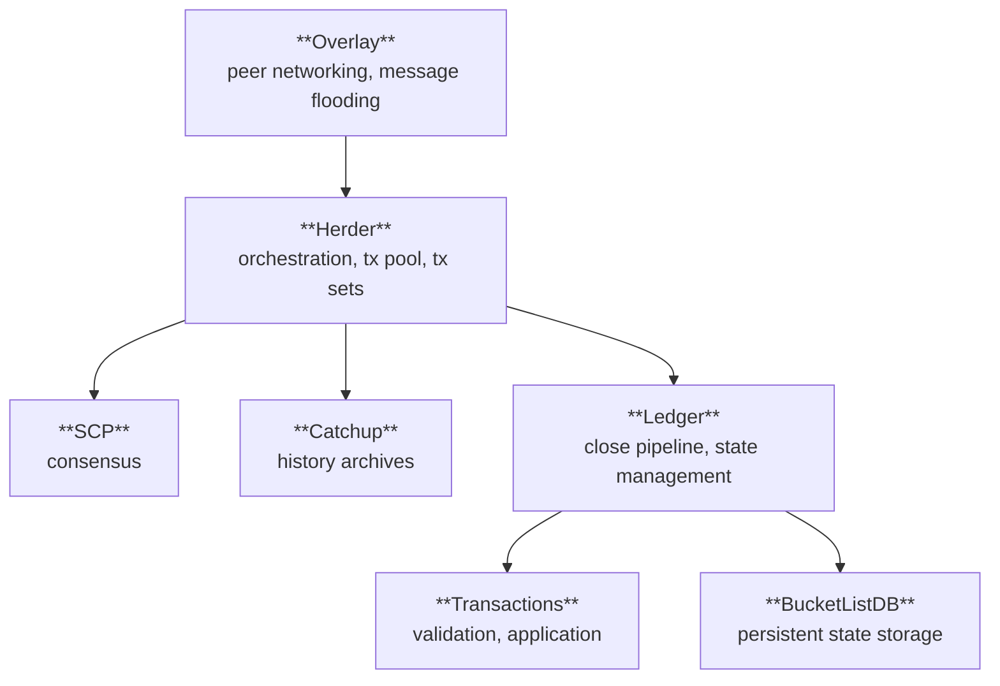

# Stellar Protocol Specification Suite

**Version:** 25 (stellar-core v25.1.1 / Protocol 25)
**Status:** Informational
**Date:** 2026-02-25

---

## Purpose

This directory contains a comprehensive, implementation-agnostic
specification of the Stellar network protocol, derived exclusively
from the vetted stellar-core (v25.1.1) reference implementation. The
specifications collectively define the observable behavior that any
conforming implementation MUST reproduce.

The key words "MUST", "MUST NOT", "REQUIRED", "SHALL", "SHALL NOT",
"SHOULD", "SHOULD NOT", "RECOMMENDED", "MAY", and "OPTIONAL" in
these documents are to be interpreted as described in
[RFC 2119][rfc2119].

---

## Architecture

The Stellar protocol is composed of seven subsystems. Each has a
dedicated specification document in this directory.

---

## Specifications

| Document | Subsystem | Description |
|----------|-----------|-------------|
| [SCP_SPEC.md](SCP_SPEC.md) | Consensus | Stellar Consensus Protocol: federated Byzantine agreement, nomination and ballot protocols, quorum sets, slot model, timer behavior. |
| [OVERLAY_SPEC.md](OVERLAY_SPEC.md) | Networking | Peer-to-peer overlay network: connection lifecycle, authentication (Curve25519 key exchange, HMAC-SHA256), message types, push/pull flooding, flow control, peer management. |
| [HERDER_SPEC.md](HERDER_SPEC.md) | Orchestration | Consensus round coordination: herder state machine, StellarValue construction/validation, transaction set construction (surge pricing, parallel Soroban), transaction queue management, SCP envelope lifecycle, protocol upgrade voting. |
| [LEDGER_SPEC.md](LEDGER_SPEC.md) | Ledger | Ledger close pipeline: state application, hierarchical copy-on-write state management, upgrade application, commit sequence, genesis initialization. |
| [TX_SPEC.md](TX_SPEC.md) | Transactions | Transaction processing: validation rules, application semantics for all 23+ operation types, fee computation, sequence number management, Soroban host function invocation. |
| [BUCKETLISTDB_SPEC.md](BUCKETLISTDB_SPEC.md) | Storage | Persistent state storage: BucketList structure (11-level geometric), merge semantics (INIT/LIVE/DEAD lifecycle), FutureBucket state machine, indexing, point lookups. |
| [CATCHUP_SPEC.md](CATCHUP_SPEC.md) | History | Catchup and history archives: archive structure, checkpoint publishing, catchup modes (minimal/recent/complete), ledger chain verification, bucket application, buffered ledger replay. |

---

## Data Flow

A transaction's journey through the protocol touches every
subsystem. The following traces the path from submission to
inclusion in a closed ledger, with cross-references to the
relevant specification sections.

### 1. Transaction Submission

A transaction enters the network via a peer connection
(OVERLAY_SPEC §7.5.1) or local submission. The overlay delivers
it to the herder.

### 2. Transaction Queue

The herder validates the transaction through a multi-step
pipeline (HERDER_SPEC §11.3): structural checks, ban list,
operation type filtering, sequence number validation,
replace-by-fee evaluation, surge pricing eviction, full
ledger-state validation (TX_SPEC §3), and balance verification.
Accepted transactions enter the pending pool.

### 3. Transaction Set Construction

When the herder triggers a new consensus round (HERDER_SPEC §4.2),
it gathers transactions from the pool, applies surge pricing to
select the highest-fee transactions within resource limits
(HERDER_SPEC §12), organizes them into phases — classic and
Soroban (HERDER_SPEC §6) — and for parallel-capable protocols,
arranges Soroban transactions into conflict-free stages and
clusters (HERDER_SPEC §7).

### 4. StellarValue Construction

The herder assembles a StellarValue containing the transaction set
hash, a proposed close time, any pending protocol upgrade steps,
and a cryptographic signature (HERDER_SPEC §5.1).

### 5. Consensus

The StellarValue is nominated via SCP (SCP_SPEC §8). Validators
propose candidates, which are combined by selecting the best
transaction set and merging upgrades (HERDER_SPEC §10). The ballot
protocol (SCP_SPEC §9) reaches agreement. Upon externalization
(SCP_SPEC §9.8), the agreed-upon value is delivered back to the
herder.

### 6. Ledger Close

The herder constructs a LedgerCloseData and delivers it to the
ledger manager (LEDGER_SPEC §4.1). The ledger close pipeline
executes: transaction application in deterministic order
(HERDER_SPEC §9, TX_SPEC §4-5), protocol upgrade application
(LEDGER_SPEC §7), ledger header construction, BucketList update
(BUCKETLISTDB_SPEC §5), and commit to durable storage
(LEDGER_SPEC §4.2).

### 7. State Persistence

Transaction effects are recorded in the BucketList as INIT, LIVE,
and DEAD entries (BUCKETLISTDB_SPEC §4). The BucketList merges
levels as they fill (BUCKETLISTDB_SPEC §5), maintaining the
geometric structure that enables efficient state lookups
(BUCKETLISTDB_SPEC §8).

### 8. History Publishing

Periodically (every 64 ledgers), the node publishes a checkpoint
to history archives (CATCHUP_SPEC §4): a history archive state
file, ledger headers, transaction sets, transaction results, and
any new or modified buckets. This enables other nodes to catch up
from published history.

### 9. Next Round

The ledger manager signals completion to the herder
(LEDGER_SPEC §4.2, HERDER_SPEC §4.1), which updates the
transaction queue and triggers the next consensus round. The
cycle repeats.

---

## Shared Conventions

### XDR Encoding

All wire formats and persistent data structures use XDR
(External Data Representation) as defined by the
[stellar-xdr][stellar-xdr] schema. The XDR schema is the
canonical definition of all protocol data types and is maintained
separately from these specifications. These specs reference XDR
types by name (e.g., `StellarValue`, `TransactionEnvelope`,
`LedgerHeader`) without reproducing their full definitions.

### Cryptographic Primitives

The protocol uses the following cryptographic primitives:

| Primitive | Standard | Usage |
|-----------|----------|-------|
| **Ed25519** | RFC 8032 | Transaction signing, SCP envelope signing, StellarValue signing, account identity. |
| **SHA-256** | FIPS 180-4 | Ledger header hashing, transaction hashing, transaction set hashing, BucketList hashing, quorum set hashing. |
| **Curve25519** | RFC 7748 | Overlay peer authentication key exchange. |
| **HMAC-SHA256** | RFC 2104 | Overlay message authentication after key exchange. |

### Network ID

All signatures include a **network ID** prefix — the SHA-256
hash of the network passphrase (e.g.,
`"Test SDF Network ; September 2015"` for testnet). This
prevents cross-network signature replay.

### Hash Chaining

Ledger headers form a hash chain: each header contains the
SHA-256 hash of the previous header. This chain is the
fundamental integrity structure of the ledger history and is
verified during catchup (CATCHUP_SPEC §6).

### Determinism

All protocol behavior specified in these documents MUST be
deterministic. Given the same inputs (previous ledger state,
transaction set, StellarValue), any conforming implementation
MUST produce identical outputs (new ledger state, ledger header
hash, transaction results, transaction metadata).

---

## Scope and Boundaries

### In Scope

These specifications cover all **observable protocol behavior**:
message formats, state transitions, validation rules, ordering
guarantees, resource limits, and correctness properties that
affect consensus or ledger state.

### Out of Scope

| Topic | Reason |
|-------|--------|
| XDR schema definitions | Maintained in the [stellar-xdr][stellar-xdr] repository. |
| Soroban VM internals | The smart contract virtual machine is defined by the soroban-env-host specification. These specs cover the host function invocation interface and resource metering, not VM execution semantics. |
| Database schema | How state is stored in SQL or other databases is an implementation choice. The protocol requires specific state to be available (defined by the BucketList and ledger specs) but not how it is indexed or queried. |
| Threading and concurrency | Internal parallelism strategies are implementation choices. The protocol requires deterministic outputs regardless of internal concurrency. |
| Configuration and deployment | Node configuration, operational tooling, and deployment patterns are implementation-specific. |
| Metrics and observability | Logging, metrics collection, and monitoring are implementation concerns. |

---

## References

| Reference | Description |
|-----------|-------------|
| [rfc2119] | Bradner, S., "Key words for use in RFCs to Indicate Requirement Levels", BCP 14, RFC 2119, March 1997. https://datatracker.ietf.org/doc/html/rfc2119 |
| [stellar-xdr] | Stellar XDR definitions. https://github.com/stellar/stellar-xdr |
