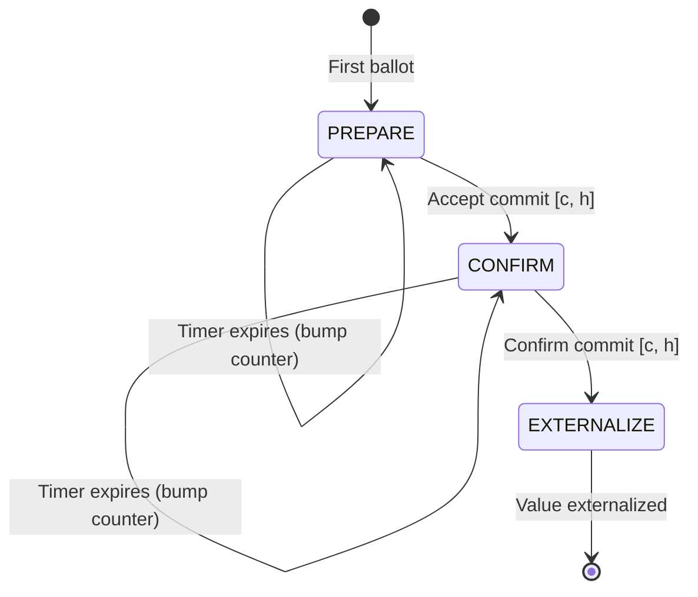
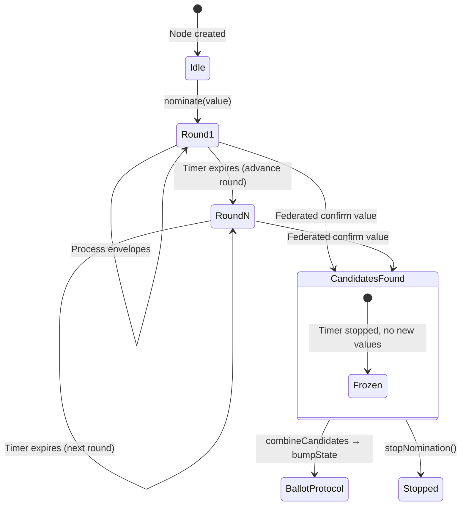
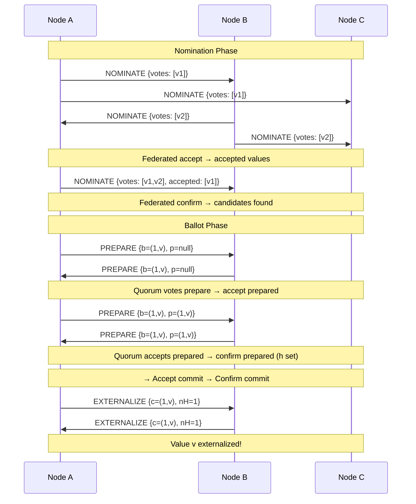

# Stellar Consensus Protocol (SCP) Specification

**Version:** 25 (stellar-core v25.1.1 / Protocol 25)
**Status:** Informational
**Date:** 2026-02-20

---

## Table of Contents

1. [Introduction](#1-introduction)
2. [Protocol Overview](#2-protocol-overview)
3. [Data Types and Encoding](#3-data-types-and-encoding)
4. [Quorum Structure](#4-quorum-structure)
5. [Federated Agreement Primitives](#5-federated-agreement-primitives)
6. [Driver Interface](#6-driver-interface)
7. [Slot Model](#7-slot-model)
8. [Nomination Protocol](#8-nomination-protocol)
9. [Ballot Protocol](#9-ballot-protocol)
10. [Message Processing](#10-message-processing)
11. [Statement Ordering and Superseding](#11-statement-ordering-and-superseding)
12. [Timer Model](#12-timer-model)
13. [Invariants and Safety Properties](#13-invariants-and-safety-properties)
14. [Constants](#14-constants)
15. [References](#15-references)
16. [Appendices](#16-appendices)

---

## 1. Introduction

### 1.1 Purpose and Scope

This document specifies the Stellar Consensus Protocol (SCP) as
implemented in stellar-core v25.x. SCP is a federated Byzantine
agreement protocol that enables the Stellar network to reach consensus
on transaction sets without requiring a closed membership list or a
central authority.

This specification covers the complete protocol: message formats,
state machines (nomination and ballot), federated agreement primitives,
quorum set structure, timer behavior, and all invariants that
implementations MUST maintain. The specification targets the wire
protocol and observable behavior; internal implementation details such
as memory management and threading are out of scope except where they
affect protocol semantics.

SCP is designed as a **standalone library** with no knowledge of
ledgers, transactions, or networking. All application-specific behavior
is injected through an abstract driver interface (Section 6). This
specification describes SCP at the library level; the integration with
the Stellar overlay network is covered in the companion Overlay Protocol
Specification.

### 1.2 Conventions and Terminology

The key words "MUST", "MUST NOT", "REQUIRED", "SHALL", "SHALL NOT",
"SHOULD", "SHOULD NOT", "RECOMMENDED", "MAY", and "OPTIONAL" in this
document are to be interpreted as described in [RFC 2119][rfc2119].

| Term | Definition |
|------|------------|
| **Node** | A participant in the consensus protocol, identified by an Ed25519 public key (`NodeID`). |
| **Validator** | A node that actively participates in consensus by nominating values and voting on ballots. |
| **Watcher** | A node that observes consensus without voting. |
| **Slot** | A single consensus instance identified by a `uint64` index. Each slot independently reaches agreement on one value. In the Stellar network, each slot corresponds to one ledger sequence number. |
| **Value** | An opaque byte string (`opaque<>`) representing the data being agreed upon. In the Stellar network, this is a serialized transaction set hash. |
| **Ballot** | A pair `(counter, value)` where `counter` is a `uint32` round number and `value` is the proposed consensus value. |
| **Quorum Set** | A declaration by a node of which sets of other nodes it trusts for agreement, expressed as a threshold structure. |
| **Quorum Slice** | A subset of nodes that satisfies a given quorum set's threshold requirement. |
| **Quorum** | A set of nodes `U` such that for every member `v` in `U`, `U` contains a quorum slice of `v`. |
| **V-blocking Set** | A set of nodes that intersects every quorum slice of a given node, preventing that node from reaching agreement without the set's participation. |
| **Federated Accept** | A statement is accepted by a node if either a v-blocking set has accepted it, or a quorum has voted for or accepted it. |
| **Federated Ratify** | A statement is ratified (confirmed) by a node if a quorum has voted for it. |
| **Envelope** | A signed container (`SCPEnvelope`) carrying an SCP statement and the sender's signature. |

### 1.3 Notation

This specification uses the following notation conventions:

- **Paper notation**: Variables from the SCP whitepaper are referenced
  in parentheses, e.g., `mCurrentBallot` (b), `mPrepared` (p).
- **XDR types**: Written in `monospace` and correspond to definitions
  in `Stellar-SCP.x`.
- **Phase names**: The ballot protocol phases are `PREPARE`, `CONFIRM`,
  and `EXTERNALIZE`. The display name "FINISH" is used in some
  implementations for the `CONFIRM` phase; this specification uses
  `CONFIRM` exclusively.
- **Ballot comparison**: `b1 < b2` denotes the total ordering defined
  in Section 3.3. `b1 ~ b2` denotes ballot compatibility (same value).

---

## 2. Protocol Overview

### 2.1 Two-Phase Consensus

SCP reaches consensus in two sequential phases per slot:

1. **Nomination** (Section 8): Nodes propose candidate values and use
   federated voting to converge on a common set of candidates. The
   nomination protocol produces a composite candidate value that feeds
   into the ballot protocol.

2. **Ballot** (Section 9): Nodes vote on ballots carrying candidate
   values, progressing through three sub-phases (`PREPARE` →
   `CONFIRM` → `EXTERNALIZE`) to achieve irrevocable agreement on a
   single value.

The two phases are designed to be loosely coupled: nomination produces
candidate values, and the ballot protocol consumes them. Once the
ballot protocol externalizes a value, nomination is halted.

### 2.2 Federated Byzantine Agreement

Unlike classical Byzantine agreement protocols, SCP does not require
a fixed, globally-known set of participants. Instead, each node
independently declares its **quorum set** — a threshold structure
specifying which combinations of other nodes it requires for agreement.

Safety is guaranteed as long as quorum sets overlap sufficiently (the
**quorum intersection** property). Liveness requires that a sufficient
number of well-behaved nodes are reachable.

The protocol achieves consensus through two primitives:

- **Federated accept**: A statement transitions from "voted" to
  "accepted" when either a v-blocking set accepts it or a quorum
  votes/accepts it.
- **Federated ratify**: A statement is confirmed by a node when a
  quorum has accepted the statement (i.e., all members of a quorum
  report having accepted it).

### 2.3 Library Isolation

SCP is implemented as a self-contained library with no dependencies on
networking, storage, or application logic. All external interactions
are mediated through the `SCPDriver` abstract interface:

- **Signing and verification** are delegated to the driver.
- **Timer management** is delegated to the driver.
- **Value validation** is delegated to the driver.
- **Message broadcasting** is delegated to the driver.
- **Hash computation** is delegated to the driver.

This design allows SCP to be tested in isolation and integrated into
different host applications.

### 2.4 Slot Independence

Each consensus slot operates independently. A node MAY participate in
multiple slots concurrently. Slots are identified by `uint64` indices
and are created on demand when the first message for a given index is
received. Old slots MAY be purged to reclaim resources.

---

## 3. Data Types and Encoding

### 3.1 XDR Serialization

All SCP messages are encoded using XDR (External Data Representation)
as defined in [RFC 4506][rfc4506]. The canonical type definitions are
in `Stellar-SCP.x`.

### 3.2 Base Types

The following base types from `Stellar-types.x` are used by SCP:

| Type | Definition | Description |
|------|------------|-------------|
| `Hash` | `opaque[32]` | SHA-256 hash digest |
| `NodeID` | `PublicKey` (Ed25519) | Node identity — an Ed25519 public key |
| `Signature` | `opaque<64>` | Ed25519 signature |
| `Value` | `opaque<>` | Variable-length opaque consensus value |

### 3.3 SCPBallot

```xdr
struct SCPBallot {
    uint32 counter;    // n — ballot round number
    Value  value;      // x — proposed value
};
```

A ballot is a pair of a round counter and a value. Ballots are
**totally ordered**: comparison is lexicographic on `(counter, value)`,
where `counter` is compared numerically and `value` is compared as a
byte string.

Two ballots are **compatible** (denoted `b1 ~ b2`) if and only if
`b1.value == b2.value`. Compatible ballots differ only in their
counter.

**Ballot comparison rules:**

| Expression | Meaning |
|------------|---------|
| `b1 < b2` | `b1.counter < b2.counter`, or `b1.counter == b2.counter` and `b1.value < b2.value` (lexicographic) |
| `b1 ~ b2` | `b1.value == b2.value` (compatible) |
| `b1 ≲ b2` | `b1 <= b2` and `b1 ~ b2` (less-and-compatible) |
| `b1 ≨ b2` | `b1 <= b2` and `b1 ≁ b2` (less-and-incompatible) |

A null ballot is less than any non-null ballot. Two null ballots are
equal.

### 3.4 SCPNomination

```xdr
struct SCPNomination {
    Hash   quorumSetHash;    // D — hash of sender's quorum set
    Value  votes<>;          // X — values voted to nominate
    Value  accepted<>;       // Y — values accepted as nominated
};
```

Both `votes` and `accepted` MUST be strictly sorted in ascending byte
order with no duplicates.

### 3.5 SCPStatement

```xdr
enum SCPStatementType {
    SCP_ST_PREPARE     = 0,
    SCP_ST_CONFIRM     = 1,
    SCP_ST_EXTERNALIZE = 2,
    SCP_ST_NOMINATE    = 3
};

struct SCPStatement {
    NodeID nodeID;       // v — sender identity
    uint64 slotIndex;    // i — consensus slot

    union switch (SCPStatementType type) {
    case SCP_ST_PREPARE:
        struct {
            Hash      quorumSetHash;       // D
            SCPBallot ballot;              // b — current ballot
            SCPBallot *prepared;           // p — highest accepted-prepared
            SCPBallot *preparedPrime;      // p' — highest accepted-prepared
                                           //      incompatible with p
            uint32    nC;                  // c.n — lowest commit counter
            uint32    nH;                  // h.n — highest confirmed-prepared
                                           //       counter
        } prepare;
    case SCP_ST_CONFIRM:
        struct {
            SCPBallot ballot;              // b — current ballot
            uint32    nPrepared;           // p.n — highest prepared counter
            uint32    nCommit;             // c.n — lowest commit counter
            uint32    nH;                  // h.n — highest confirmed-prepared
                                           //       counter
            Hash      quorumSetHash;       // D
        } confirm;
    case SCP_ST_EXTERNALIZE:
        struct {
            SCPBallot commit;              // c — committed ballot
            uint32    nH;                  // h.n — highest confirmed-prepared
                                           //       counter
            Hash      commitQuorumSetHash; // D used before EXTERNALIZE
        } externalize;
    case SCP_ST_NOMINATE:
        SCPNomination nominate;
    } pledges;
};
```

Each statement type carries a quorum set hash that identifies the
sender's quorum set at the time the statement was produced. For
`EXTERNALIZE`, the `commitQuorumSetHash` records the quorum set that
was active when the node committed (before transitioning to a singleton
quorum set).

### 3.6 SCPEnvelope

```xdr
struct SCPEnvelope {
    SCPStatement statement;
    Signature    signature;
};
```

An envelope wraps a statement with the sender's Ed25519 signature. The
signature MUST cover the entire `SCPStatement` structure.

### 3.7 SCPQuorumSet

```xdr
struct SCPQuorumSet {
    uint32       threshold;         // t — number of members required
    NodeID       validators<>;      // direct validator members
    SCPQuorumSet innerSets<>;       // nested quorum set members
};
```

A quorum set is a recursive threshold structure. It is satisfied by a
set of nodes `S` if at least `threshold` of its members (validators
and inner sets combined) are satisfied. A validator member is satisfied
if it is in `S`. An inner set member is satisfied recursively.

---

## 4. Quorum Structure

### 4.1 Quorum Set Semantics

A quorum set `Q = {threshold: t, validators: [v₁, ..., vₙ],
innerSets: [Q₁, ..., Qₘ]}` defines a family of **quorum slices**.
A set of nodes `S` is a quorum slice of `Q` if at least `t` of the
`n + m` members are satisfied:

- Validator `vᵢ` is satisfied if `vᵢ ∈ S`.
- Inner set `Qⱼ` is satisfied if `S` is a quorum slice of `Qⱼ`
  (recursive).

### 4.2 Quorum Set Validation

An implementation MUST validate quorum sets before use. A quorum set
is **sane** if all of the following hold:

| # | Rule | Condition |
|---|------|-----------|
| 1 | **Nesting depth** | Inner set nesting depth MUST NOT exceed 4 levels. The top-level quorum set is at depth 0. |
| 2 | **Minimum threshold** | `threshold >= 1` at every level. |
| 3 | **Maximum threshold** | `threshold <= validators.size() + innerSets.size()` at every level. |
| 4 | **No duplicate validators** | No `NodeID` MAY appear more than once across the entire quorum set tree. |
| 5 | **Total node count** | The total number of validators across all levels MUST be in the range `[1, 1000]`. |

When **extra checks** are enabled (RECOMMENDED for production use),
an additional constraint applies:

| # | Rule | Condition |
|---|------|-----------|
| 6 | **Majority threshold** | `threshold >= ceil((totalEntries + 1) / 2)` at every level, where `totalEntries = validators.size() + innerSets.size()`. This ensures the threshold exceeds the v-blocking size, requiring a strict majority (> 50%). |

The v-blocking size at any level is `totalEntries - threshold + 1`.
Rule 6 ensures `threshold >= vBlockingSize`, which prevents trivially
small coalitions from blocking progress.

### 4.3 Quorum Set Normalization

Before use, quorum sets SHOULD be normalized. Normalization consists
of two phases:

**Phase 1 — Simplification** (applied recursively, bottom-up):

1. **Node removal** (optional): If a specific `NodeID` is designated
   for removal, remove all occurrences from `validators` at every
   level, decreasing `threshold` by the number of removals at each
   level. This preserves proportional requirements.

2. **Singleton promotion**: If an inner set has become a trivial
   singleton (`threshold == 1`, exactly one validator, no inner sets),
   promote its single validator to the parent's validator list and
   remove the inner set.

3. **Wrapper collapse**: If a quorum set has `threshold == 1`, zero
   validators, and exactly one inner set, replace the quorum set with
   its single inner set.

**Phase 2 — Reordering** (applied recursively, bottom-up):

1. Sort validators in ascending byte order of their `NodeID`.
2. Sort inner sets using a deterministic total order: lexicographic
   comparison of validator lists first, then inner set lists, then
   threshold value.

### 4.4 Quorum Slice Test

`isQuorumSlice(Q, S)` returns `true` if the node set `S` satisfies
quorum set `Q`:

```
isQuorumSlice(Q, S):
    thresholdLeft = Q.threshold
    for each validator v in Q.validators:
        if v ∈ S:
            thresholdLeft--
            if thresholdLeft <= 0: return true
    for each innerSet q in Q.innerSets:
        if isQuorumSlice(q, S):
            thresholdLeft--
            if thresholdLeft <= 0: return true
    return false
```

### 4.5 V-Blocking Set Test

`isVBlocking(Q, S)` returns `true` if node set `S` is a v-blocking
set for quorum set `Q` — that is, every quorum slice of `Q` intersects
with `S`:

```
isVBlocking(Q, S):
    if Q.threshold == 0: return false
    leftTillBlock = |Q.validators| + |Q.innerSets| - Q.threshold + 1
    for each validator v in Q.validators:
        if v ∈ S:
            leftTillBlock--
            if leftTillBlock <= 0: return true
    for each innerSet q in Q.innerSets:
        if isVBlocking(q, S):
            leftTillBlock--
            if leftTillBlock <= 0: return true
    return false
```

The value `leftTillBlock` represents the number of members that must
be blocked to prevent any quorum slice from completing. If `S`
contains (or v-blocks, recursively) at least `totalEntries - threshold + 1`
members, no quorum slice can form without including a member of `S`.

### 4.6 Transitive Quorum Test

`isQuorum(Q, envelopes, qfun, filter)` determines whether the nodes
passing `filter` form a quorum. This is the most complex quorum
operation, as it must verify the **transitive** property: for every
node `v` in the quorum, `v`'s own quorum set must have a quorum slice
within the set.

```
isQuorum(Q, envelopes, qfun, filter):
    // Step 1: Initial filter
    pNodes = { nodeID | (nodeID, env) ∈ envelopes, filter(env.statement) }

    // Step 2: Fixed-point iteration (peel non-quorum nodes)
    do:
        count = |pNodes|
        pNodes = { v ∈ pNodes |
            qSet = qfun(envelopes[v].statement)
            qSet ≠ null AND isQuorumSlice(qSet, pNodes)
        }
    while count ≠ |pNodes|

    // Step 3: Check local node's quorum set
    return isQuorumSlice(Q, pNodes)
```

**Step 2** iteratively removes nodes whose quorum slices are not
satisfied by the current candidate set. This "peeling" process
converges because the set can only shrink. A node is removed if its
quorum set cannot be retrieved (`qfun` returns null) or if no quorum
slice of its quorum set exists within the remaining candidates.

**Step 3** verifies that the remaining stable set also satisfies the
local node's quorum set.

The `qfun` callback retrieves each node's quorum set from its
statement. During `EXTERNALIZE`, a node's quorum set is replaced with
a singleton `{threshold: 1, validators: [nodeID]}` (see Section 7.4),
ensuring that externalized nodes are never peeled away.

### 4.7 Finding V-Blocking Sets

`findClosestVBlocking(Q, nodes, excluded)` finds a minimal set of
nodes from `nodes` that would form a v-blocking set for `Q`, excluding
a specific node. The algorithm is greedy:

1. Compute `leftTillBlock = totalEntries - threshold + 1`.
2. For each validator: if NOT in `nodes`, it is already "dead"
   (decrement `leftTillBlock`). If in `nodes`, save as a candidate.
3. For each inner set: recursively find its closest v-blocking subset.
   If already blocked (empty result), decrement `leftTillBlock`.
   Otherwise, save the subset ordered by size.
4. If `leftTillBlock` is already zero, return empty (already blocked).
5. Greedily select from top-level validator candidates and
   smallest inner-set subsets until `leftTillBlock` reaches zero.

---

## 5. Federated Agreement Primitives

The SCP protocol is built on two fundamental agreement operations.
These operations bridge individual node votes to network-wide
consensus through the quorum structure.

### 5.1 Federated Accept

A node **federates acceptance** of a statement when either:

**(a) V-blocking acceptance**: A v-blocking set of nodes (relative to
the local node's quorum set) has accepted the statement; OR

**(b) Quorum vote-or-accept**: A quorum (satisfying the transitive
quorum test) has either voted for or accepted the statement.

Formally, given predicates `voted(st)` and `accepted(st)` that test
whether a statement claims to have voted for or accepted a proposition:

```
federatedAccept(voted, accepted, envelopes):
    // Check (a): v-blocking acceptance
    if isVBlocking(localQSet, envelopes, accepted):
        return true

    // Check (b): quorum vote-or-accept
    combinedFilter(st) = accepted(st) OR voted(st)
    if isQuorum(localQSet, envelopes, qfun, combinedFilter):
        return true

    return false
```

The v-blocking check is evaluated first because it is less expensive
than the transitive quorum check.

### 5.2 Federated Ratify

A node **federates ratification** (confirmation) of a statement when a
quorum has voted for it:

```
federatedRatify(voted, envelopes):
    return isQuorum(localQSet, envelopes, qfun, voted)
```

### 5.3 Agreement Progression

The progression of a proposition through the federated agreement
process follows three stages:

```
voted → accepted (via federatedAccept) → confirmed (via federatedRatify)
```

In the nomination protocol:
- A value is **voted** when a node includes it in `votes`.
- A value is **accepted** when `federatedAccept` succeeds (checking
  `votes` for voted, `accepted` for accepted).
- A value is **confirmed** (becomes a candidate) when `federatedRatify`
  succeeds on the `accepted` predicate.

In the ballot protocol, these primitives are applied to ballot-level
propositions such as "ballot b is prepared" and "ballot b is committed."

---

## 6. Driver Interface

### 6.1 Overview

The `SCPDriver` is an abstract interface that MUST be implemented by
any application using SCP. It provides all external dependencies:
signing, hashing, value validation, timer management, and message
broadcasting.

### 6.2 Pure Virtual Methods

The following methods MUST be implemented:

| Method | Description |
|--------|-------------|
| `signEnvelope(envelope)` | Sign the envelope using the local node's Ed25519 private key. |
| `getQSet(hash) → SCPQuorumSetPtr` | Retrieve a quorum set by its hash. Returns `null` if unknown, which causes the corresponding node's statements to be ignored in quorum calculations. |
| `emitEnvelope(envelope)` | Broadcast a signed envelope to the network. |
| `getHashOf(vals) → Hash` | Compute SHA-256 over the concatenation of the provided byte vectors. |
| `combineCandidates(slotIndex, candidates) → ValueWrapperPtr` | Combine a set of confirmed candidate values into a single composite value for the ballot protocol. |
| `setupTimer(slotIndex, timerID, timeout, callback)` | Schedule a callback after `timeout` milliseconds. A null callback cancels the timer. |
| `stopTimer(slotIndex, timerID)` | Cancel a previously scheduled timer. |
| `computeTimeout(roundNumber, isNomination) → milliseconds` | Compute the timeout duration for a given round. SHOULD grow with `roundNumber` and SHOULD allow at least 4 message exchanges. |
| `hasUpgrades(value) → bool` | Returns true if the value contains protocol upgrades. Used by the upgrade stripping timeout mechanism. |
| `stripAllUpgrades(value) → ValueWrapperPtr` | Returns a new value with all upgrades removed. Returns nullptr if no valid value exists without upgrades. |
| `getUpgradeNominationTimeoutLimit() → uint32` | Returns the maximum number of nomination timer expirations before upgrade stripping activates. |

### 6.3 Virtual Methods with Defaults

The following methods have default implementations that MAY be
overridden:

| Method | Default | Description |
|--------|---------|-------------|
| `validateValue(slotIndex, value, nomination)` | `kMaybeValidValue` | Validate a proposed value. Returns `kInvalidValue` (0), `kMaybeValidValue` (1), or `kFullyValidatedValue` (2). |
| `extractValidValue(slotIndex, value)` | `null` | Extract a valid variant from a potentially invalid value. |
| `wrapEnvelope(envelope)` | Default wrapper | Factory for envelope wrappers. |
| `wrapValue(value)` | Default wrapper | Factory for value wrappers. |

### 6.4 Validation Levels

```
enum ValidationLevel {
    kInvalidValue          = 0,  // Definitely invalid — reject
    kMaybeValidValue       = 1,  // Possibly valid — node abstains
    kFullyValidatedValue   = 2   // Definitely valid — full confidence
};
```

Validation levels are ordered: `kInvalidValue < kMaybeValidValue <
kFullyValidatedValue`. When multiple values are validated, the
**minimum** level across all values determines the overall result.

A slot is considered **fully validated** only when all values have been
validated at level `kFullyValidatedValue`. If any value is
`kMaybeValidValue`, the slot is marked as not fully validated, and
outgoing messages are suppressed (recorded locally but not broadcast).

### 6.5 Event Callbacks

The driver receives notifications of protocol events. All callbacks
have default no-op implementations:

| Callback | Trigger |
|----------|---------|
| `valueExternalized(slotIndex, value)` | A value has been irrevocably committed. Called exactly once per slot. |
| `nominatingValue(slotIndex, value)` | The local node is voting to nominate a new value. |
| `updatedCandidateValue(slotIndex, value)` | The composite candidate value has been updated. |
| `startedBallotProtocol(slotIndex, ballot)` | The ballot protocol has started with a first ballot. |
| `acceptedBallotPrepared(slotIndex, ballot)` | A ballot has been accepted as prepared. |
| `confirmedBallotPrepared(slotIndex, ballot)` | A ballot has been confirmed as prepared. |
| `acceptedCommit(slotIndex, ballot)` | A commit has been accepted. |
| `ballotDidHearFromQuorum(slotIndex, ballot)` | A transitive quorum has been heard from at the current ballot counter. |

### 6.6 Hash Functions

SCP uses three domain-separated hash functions for nomination leader
selection. All are computed as `SHA-256(slotIndex ‖ previousValue ‖
tag ‖ roundNumber ‖ input)`, where `‖` denotes XDR-serialized
concatenation, and the result is the first 8 bytes interpreted as a
big-endian `uint64`:

| Function | Tag | Input | Purpose |
|----------|-----|-------|---------|
| `hashNode(neighborhood)` | 1 (`hash_N`) | `NodeID` | Neighborhood check — determines if a node is "close enough" to be a leader candidate |
| `hashNode(priority)` | 2 (`hash_P`) | `NodeID` | Priority assignment — determines ranking among leader candidates |
| `hashValue` | 3 (`hash_K`) | `Value` | Value ranking — determines which candidate value to prefer from a leader |

> **Note**: Both `computeHashNode` and `computeValueHash` are virtual methods on `SCPDriver` with default implementations. Drivers MAY override them to customize the hash computation (e.g., for testing purposes).

### 6.7 Node Weight

The weight of a node within a quorum set determines its probability of
passing the neighborhood check during leader selection. Weight is
computed recursively:

> **Note**: `getNodeWeight` is a virtual method on `SCPDriver` with the default implementation described below. Drivers MAY override it.

```
getNodeWeight(nodeID, Q):
    if nodeID is the local node:
        return UINT64_MAX

    let n = Q.threshold
    let d = |Q.validators| + |Q.innerSets|

    for each validator v in Q.validators:
        if v == nodeID:
            return ceil(UINT64_MAX × n / d)

    for each innerSet q in Q.innerSets:
        leafW = getNodeWeight(nodeID, q)
        if leafW > 0:
            return ceil(leafW × n / d)

    return 0
```

The weight is normalized to the range `[0, UINT64_MAX]`. Only the
**first** occurrence of a node in a depth-first traversal contributes
weight; subsequent occurrences are ignored.

---

## 7. Slot Model

### 7.1 Slot Lifecycle

Slots are created on demand when the first message for a given slot
index is received via `receiveEnvelope`, or when the application
initiates nomination via `nominate`. Each slot contains:

- A **nomination protocol** instance (Section 8)
- A **ballot protocol** instance (Section 9)
- A **fully validated** flag
- A **got v-blocking** flag
- A **statement history** for auditing

Slots are stored in an ordered map keyed by `uint64` slot index,
ensuring deterministic iteration order.

### 7.2 Slot State Flags

**Fully validated** (`mFullyValidated`): Initialized to `true` for
validators and `false` for watchers. Set to `false` whenever a
`kMaybeValidValue` validation result is encountered. When `false`,
the slot suppresses outgoing envelope broadcasts — envelopes are
processed locally but not emitted to the network.

**Got v-blocking** (`mGotVBlocking`): Set once (never cleared) when
the set of nodes that have sent messages for this slot forms a
v-blocking set relative to the local node's quorum set. This flag is
checked whenever a new node's first message is received.

### 7.3 Envelope Routing

When an envelope is received by a slot, it is routed based on the
statement type:

- `SCP_ST_NOMINATE` → Nomination protocol
- `SCP_ST_PREPARE`, `SCP_ST_CONFIRM`, `SCP_ST_EXTERNALIZE` → Ballot
  protocol

The routing is one-directional: nomination and ballot protocols
maintain separate envelope maps and do not share state directly.
Communication between them occurs through:

1. Nomination produces candidates → fed to ballot protocol via
   `bumpState`.
2. Ballot protocol externalizes → nomination is stopped via
   `stopNomination`.

### 7.4 Singleton Quorum Set During EXTERNALIZE

When retrieving a node's quorum set from a statement for use in quorum
calculations, a critical substitution occurs for `EXTERNALIZE`
statements: the node's real quorum set is replaced with a **singleton
quorum set** `{threshold: 1, validators: [nodeID]}`.

This substitution has two effects:

1. An externalized node's quorum slice is trivially satisfied (it only
   requires itself), so externalized nodes are never removed during
   the fixed-point iteration of the transitive quorum test.

2. The `commitQuorumSetHash` field in the `EXTERNALIZE` statement
   records the quorum set that was active at the time of commitment,
   preserving auditability.

**Rationale**: Once a node has externalized a value, it has irrevocably
committed. Its "effective quorum" for further agreement is just itself,
and it MUST NOT be penalized for not having its original quorum set
satisfied.

### 7.5 Envelope Construction

When the local node creates an envelope:

1. An `SCPStatement` is constructed by the nomination or ballot
   protocol with the appropriate fields.
2. The slot stamps the statement with the local `NodeID` and
   `slotIndex`, overwriting any values in those fields.
3. The driver's `signEnvelope` method is called to add the signature.
4. The signed envelope is returned.

### 7.6 Crash Recovery

SCP supports state recovery from previously emitted envelopes via
`setStateFromEnvelope(slotIndex, envelope)`. This method:

1. Creates or retrieves the slot for the given index.
2. Validates that the envelope's `nodeID` matches the local node and
   the `slotIndex` matches.
3. Routes to the appropriate protocol's recovery method (nomination or
   ballot).
4. Updates the v-blocking tracking flag.

Recovery MUST be performed before normal protocol operation begins.
For nomination, `setStateFromEnvelope` MUST be called before
`nominate`.

### 7.7 Slot Purging

The `purgeSlots(maxSlotIndex, slotToKeep)` method removes all slots
with index `< maxSlotIndex`, except the slot at `slotToKeep`. Slots
at index `>= maxSlotIndex` are not affected. This allows the
application to reclaim memory while preserving state for the current
and any specially designated slot.

### 7.8 Message Retrieval

When retrieving the latest message from a node across slots, ballot
protocol messages take precedence over nomination messages within the
same slot, and higher slot indices take precedence over lower ones.

---

## 8. Nomination Protocol

### 8.1 Overview

The nomination protocol's goal is to produce a set of **candidate
values** that the ballot protocol can then vote on. It uses federated
voting on individual values: nodes vote to nominate values, federated-
accept them, and then federated-confirm them as candidates.

Once any candidate value exists, nomination freezes — no new values
are nominated. The candidates are combined via the driver's
`combineCandidates` method into a single composite value that feeds
the ballot protocol.

### 8.2 State Variables

| Variable | Paper | Type | Description |
|----------|-------|------|-------------|
| `mRoundNumber` | — | `int32` | Current nomination round (starts at 0, incremented before each round) |
| `mVotes` | X | Set of Values | Values this node has voted to nominate |
| `mAccepted` | Y | Set of Values | Values accepted as nominated |
| `mCandidates` | Z | Set of Values | Confirmed nominated values (candidates) |
| `mLatestNominations` | N | Map: NodeID → Envelope | Latest nomination envelope from each node |
| `mRoundLeaders` | — | Set of NodeIDs | Accumulated set of round leaders across all rounds |
| `mNominationStarted` | — | bool | Whether nomination has been initiated |
| `mLatestCompositeCandidate` | — | Value | Result of `combineCandidates(Z)` |
| `mPreviousValue` | — | Value | Value from the previous slot (used in hash functions) |
| `mTimerExpCount` | — | int32 | Number of timer expirations (diagnostics) |

All value sets use byte-level lexicographic ordering for deterministic
iteration.

### 8.3 Nomination Message Format

A nomination message is an `SCPStatement` with type `SCP_ST_NOMINATE`:

```
SCPNomination {
    quorumSetHash: Hash,      // sender's quorum set hash
    votes:    Value<>[],      // X — strictly sorted, no duplicates
    accepted: Value<>[]       // Y — strictly sorted, no duplicates
}
```

**Sanity requirements**: A nomination message is sane if and only if:
1. `votes.size() + accepted.size() > 0` (at least one value)
2. `votes` is strictly sorted (ascending, no duplicates)
3. `accepted` is strictly sorted (ascending, no duplicates)

### 8.4 Round Leaders

Each nomination round selects a set of **leaders** — nodes whose
proposed values the local node will adopt. Leader selection uses
hash-based priority computation to achieve distributed randomness.

**Leader computation** (`updateRoundLeaders`):

```
updateRoundLeaders():
    normalizedQSet = normalize(localQSet, removing localNodeID)
    maxLeaderCount = 1 + countAllNodes(normalizedQSet)

    while |mRoundLeaders| < maxLeaderCount:
        newRoundLeaders = { localNodeID }
        topPriority = getNodePriority(localNodeID, normalizedQSet)

        for each node cur in normalizedQSet:
            w = getNodePriority(cur, normalizedQSet)
            if w > topPriority:
                topPriority = w
                newRoundLeaders = { }     // clear — new winner
            if w == topPriority AND w > 0:
                newRoundLeaders.add(cur)

        if topPriority == 0:
            newRoundLeaders = { }         // no one qualified

        merged = mRoundLeaders ∪ newRoundLeaders
        if |merged| > |mRoundLeaders|:   // new leaders added
            mRoundLeaders = merged
            return
        else:                             // same leaders re-elected
            mRoundNumber++                // fast-timeout: advance round
            continue                      // retry with new hash
```

**Key properties:**

- `mRoundLeaders` is **cumulative** — leaders from all rounds are
  accumulated, never cleared.
- When the same leaders would be re-elected (no new leaders added),
  the algorithm silently advances `mRoundNumber` and retries. This
  "fast timeout" avoids waiting for a real timer when the hash
  function keeps selecting the same nodes.
- The local node is always included as a starting candidate with its
  own priority.

**Node priority** (`getNodePriority`):

```
getNodePriority(nodeID, qSet):
    w = getNodeWeight(nodeID, qSet)
    if w > 0 AND hashNode(neighborhood, nodeID) <= w:
        return hashNode(priority, nodeID)
    else:
        return 0
```

The neighborhood hash is compared against the node's weight. Higher
weight increases the probability of passing this check. If a node
passes, its priority is a separate hash value, creating a random
ranking among qualifying nodes. Both hashes include `mRoundNumber`, so
leaders change across rounds.

### 8.5 Nomination Flow

The `nominate(value, previousValue, timedout)` method drives each
nomination round:

```
nominate(value, previousValue, timedout):
    // 1. Early exit if candidates already found
    if |mCandidates| > 0: return false

    // 2. Timeout accounting
    if timedout: mTimerExpCount++
    if timedout AND NOT mNominationStarted: return false

    // 3. Initialize
    mNominationStarted = true
    mPreviousValue = previousValue
    mRoundNumber++

    // 4. Compute round leaders
    updateRoundLeaders()

    // 5. Compute timeout for this round
    timeout = computeTimeout(mRoundNumber, isNomination=true)

    // 6. Adopt values from leaders
    updated = false
    for each leader in mRoundLeaders:
        if mLatestNominations contains leader:
            newValue = getNewValueFromNomination(leader's nomination)
            if newValue ≠ null:
                mVotes.add(newValue)
                updated = true
                nominatingValue(slotIndex, newValue)

    // 7. Self-nomination (if leader)
    if localNodeID ∈ mRoundLeaders:
        shouldVoteForValue = false

        // 7a. Vote if no votes yet
        if mVotes is empty:
            shouldVoteForValue = true

        // 7b. Upgrade stripping after timeout (v25.1.1+)
        // If nomination has timed out enough times and all current votes
        // contain upgrades, strip upgrades from the value to improve liveness.
        if mTimerExpCount >= getUpgradeNominationTimeoutLimit():
            if ALL values in mVotes have upgrades (via hasUpgrades()):
                value = stripAllUpgrades(value)
                shouldVoteForValue = true

        if shouldVoteForValue:
            if mVotes.add(value):   // only if actually new
                updated = true
                nominatingValue(slotIndex, value)

    // 8. Schedule next round
    setupTimer(slotIndex, NOMINATION_TIMER, timeout,
               () => nominate(value, previousValue, timedout=true))

    // 9. Emit if updated
    if updated: emitNomination()
    return updated
```

**Value selection from leaders** (`getNewValueFromNomination`):

When adopting values from a leader's nomination, the node selects the
highest-hash-value that it does not already have in `mVotes`:

1. First, consider only `accepted` values from the leader. Validate
   each and compute `hashValue` for valid ones not in `mVotes`.
2. Only if NO valid accepted value was found (even if all valid ones
   were already in `mVotes`), fall through to `votes`.
3. Among qualifying values, select the one with the highest `hashValue`.
   On ties (`curHash == newHash`), the later value in iteration order
   wins (`>=` comparison).

Accepted values take absolute priority over voted values. The
`hashValue` function provides a deterministic, round-dependent ranking.

### 8.6 Incoming Nomination Processing

When a nomination envelope is received (`processEnvelope`):

```
processEnvelope(envelope):
    // 1. Validation
    if NOT isNewerStatement(nodeID, nomination): return INVALID
    if NOT isSane(nomination): return INVALID

    // 2. Record
    recordEnvelope(envelope)

    // 3. Skip processing if nomination not started
    if NOT mNominationStarted: return VALID

    // 4. Phase A — Promote votes to accepted (federated accept)
    for each value v in nomination.votes:
        if v ∈ mAccepted: continue
        if federatedAccept(
            voted = (v ∈ st.votes),
            accepted = (v ∈ st.accepted),
            mLatestNominations):
            validation = validateValue(v)
            if validation == kFullyValidatedValue:
                mAccepted.add(v)
                mVotes.add(v)
                modified = true
            else if validation ≠ kInvalidValue:
                extracted = extractValidValue(v)
                if extracted ≠ null:
                    mVotes.add(extracted)    // NOT added to accepted
                    modified = true

    // 5. Phase B — Promote accepted to candidates (federated ratify)
    for each value a in mAccepted:
        if a ∈ mCandidates: continue
        if federatedRatify(
            voted = (a ∈ st.accepted),
            mLatestNominations):
            mCandidates.add(a)
            newCandidates = true
            stopTimer(slotIndex, NOMINATION_TIMER)

    // 6. Phase C — Adopt leader votes (only without candidates)
    if |mCandidates| == 0 AND sender ∈ mRoundLeaders:
        newValue = getNewValueFromNomination(nomination)
        if newValue ≠ null:
            mVotes.add(newValue)
            modified = true
            nominatingValue(slotIndex, newValue)

    // 7. Emit and bump
    if modified: emitNomination()
    if newCandidates:
        mLatestCompositeCandidate = combineCandidates(slotIndex, mCandidates)
        updatedCandidateValue(slotIndex, mLatestCompositeCandidate)
        bumpState(mLatestCompositeCandidate, force=false)

    return VALID
```

**Key behaviors:**

- Envelopes are always recorded even if nomination has not started,
  allowing the node to build up state before actively participating.
- Values promoted to `mAccepted` are also added to `mVotes`
  (maintaining the invariant that accepted ⊆ votes).
- When `extractValidValue` produces a variant, it is added only to
  `mVotes` (not `mAccepted`), since the original value was not fully
  validated.
- The nomination timer is stopped when the first candidate is
  confirmed, preventing further nomination rounds.
- New candidates trigger `combineCandidates` and feed the result to
  the ballot protocol via `bumpState`.

### 8.7 Nomination Emission

When emitting a nomination:

1. Construct an `SCPStatement` of type `SCP_ST_NOMINATE`.
2. Set `quorumSetHash` from the local node.
3. Populate `votes` from `mVotes` and `accepted` from `mAccepted`.
4. Create and sign the envelope.
5. Self-process the envelope (re-enter `processEnvelope` with
   `self=true`). If this returns `INVALID`, the implementation has
   entered an inconsistent state.
6. Only broadcast (call `emitEnvelope`) if the slot is fully validated.
7. Only update `mLastEnvelope` if the new statement is newer than the
   previous one.

### 8.8 Stopping Nomination

`stopNomination()` sets `mNominationStarted = false`. This has the
following effects:

- Future `processEnvelope` calls record envelopes but skip all state
  transitions.
- If a pending timer fires and calls `nominate(..., timedout=true)`,
  the `timedout AND NOT mNominationStarted` guard causes an early
  return.
- Existing state (votes, accepted, candidates) is NOT cleared.

### 8.9 Nomination Statement Ordering

A nomination statement is **newer** than another from the same node if
and only if:

1. `old.votes ⊆ new.votes`, AND
2. `old.accepted ⊆ new.accepted`, AND
3. At least one set strictly grew (proper superset in at least one
   dimension).

This ensures nomination statements are **monotonically growing** — a
valid newer statement can only add values, never remove them. Both
vectors MUST be sorted for the subset check to work correctly.

### 8.10 State Recovery

`setStateFromEnvelope(envelope)` restores nomination state from a
previously emitted envelope:

1. **Precondition**: `mNominationStarted` MUST be `false`.
2. Records the envelope in `mLatestNominations`.
3. Adds all values from `accepted` to `mAccepted`.
4. Adds all values from `votes` to `mVotes`.
5. Sets `mLastEnvelope` to the provided envelope.

---

## 9. Ballot Protocol

### 9.1 Overview

The ballot protocol achieves irrevocable agreement on a single value
by voting on **ballots** — `(counter, value)` pairs. It progresses
through three phases:

```
PREPARE → CONFIRM → EXTERNALIZE
```

- **PREPARE**: Nodes vote to prepare ballots and attempt to lock a
  value by confirming preparation.
- **CONFIRM**: A value has been locked. Nodes work to accept and
  confirm commits.
- **EXTERNALIZE**: Agreement is reached. The value is irrevocably
  committed.

The protocol is driven by incoming messages and timer expirations.
Each incoming message triggers `advanceSlot`, which attempts all
possible state transitions in sequence.

### 9.2 State Variables

| Variable | Paper | Type | Description |
|----------|-------|------|-------------|
| `mCurrentBallot` | b | SCPBallot (nullable) | Current ballot being voted on |
| `mPrepared` | p | SCPBallot (nullable) | Highest accepted-prepared ballot |
| `mPreparedPrime` | p' | SCPBallot (nullable) | Highest accepted-prepared ballot incompatible with p |
| `mHighBallot` | h | SCPBallot (nullable) | Highest confirmed-prepared ballot |
| `mCommit` | c | SCPBallot (nullable) | Lowest ballot in commit range |
| `mPhase` | Φ | enum | Current phase: `PREPARE`, `CONFIRM`, or `EXTERNALIZE` |
| `mValueOverride` | z | Value (nullable) | Locked value — set when a value is confirmed-prepared or accepted-committed |
| `mLatestEnvelopes` | M | Map: NodeID → Envelope | Latest ballot statement from each node |
| `mHeardFromQuorum` | — | bool | Whether a quorum has been heard at the current counter |
| `mCurrentMessageLevel` | — | int | Recursion depth for `advanceSlot` |
| `mTimerExpCount` | — | int32 | Number of ballot timer expirations |

### 9.3 Ballot Statement Formats

**PREPARE** (phase: `SCP_PHASE_PREPARE`):

| Field | Source | Description |
|-------|--------|-------------|
| `quorumSetHash` | Local QSet | Hash of sender's quorum set |
| `ballot` | b | Current ballot (counter may be 0 for self-processing) |
| `prepared` | p | Highest accepted-prepared (optional) |
| `preparedPrime` | p' | Highest accepted-prepared incompatible with p (optional) |
| `nC` | c.counter | Lowest commit counter (0 if none) |
| `nH` | h.counter | Highest confirmed-prepared counter (0 if none) |

**CONFIRM** (phase: `SCP_PHASE_CONFIRM`):

| Field | Source | Description |
|-------|--------|-------------|
| `ballot` | b | Current ballot |
| `nPrepared` | p.counter | Highest prepared counter |
| `nCommit` | c.counter | Lowest commit counter |
| `nH` | h.counter | Highest confirmed-prepared counter |
| `quorumSetHash` | Local QSet | Hash of sender's quorum set |

**EXTERNALIZE** (phase: `SCP_PHASE_EXTERNALIZE`):

| Field | Source | Description |
|-------|--------|-------------|
| `commit` | c | Committed ballot (full ballot with counter and value) |
| `nH` | h.counter | Highest confirmed-prepared counter |
| `commitQuorumSetHash` | Local QSet | Quorum set hash used before EXTERNALIZE |

### 9.4 The `advanceSlot` State Machine Driver

The `advanceSlot` method is the core state machine driver, called
whenever new information arrives. It attempts all possible transitions
in strict order:

```
advanceSlot(hint):
    mCurrentMessageLevel++

    if mCurrentMessageLevel >= MAX_ADVANCE_SLOT_RECURSION (50):
        ABORT — fatal error

    didWork = false
    didWork = attemptAcceptPrepared(hint)  OR didWork
    didWork = attemptConfirmPrepared(hint) OR didWork
    didWork = attemptAcceptCommit(hint)    OR didWork
    didWork = attemptConfirmCommit(hint)   OR didWork

    // Bump only at outermost recursion level
    if mCurrentMessageLevel == 1:
        do:
            didBump = attemptBump()
            didWork = didBump OR didWork
        while didBump

        checkHeardFromQuorum()

    mCurrentMessageLevel--

    if didWork:
        sendLatestEnvelope()
```

**Critical properties:**

- The four attempt methods are called in **strict order** because each
  step may produce state that subsequent steps depend on.
- `attemptBump` is only called at recursion level 1 and loops until
  stable, preventing infinite ballot counter escalation within nested
  calls.
- `sendLatestEnvelope` only emits when `mCurrentMessageLevel == 0`
  (fully unwound), the slot is fully validated, and the envelope
  differs from the last emitted one.
- The recursion guard (`MAX_ADVANCE_SLOT_RECURSION = 50`) prevents
  runaway cascading transitions. Exceeding this limit is a fatal
  error.

### 9.5 Step 1: Accept Prepared (`attemptAcceptPrepared`)

**Gate**: Only runs in `PREPARE` or `CONFIRM` phase.

**Purpose**: Determine if a ballot can be **accepted as prepared** via
federated accept.

**Algorithm**:

1. Extract candidate ballots from the hint statement and from all
   peers' latest statements (see Section 9.5.1).
2. Iterate candidates from **highest to lowest**.
3. For each candidate ballot:
   - In `CONFIRM` phase: only consider if `mPrepared` is
      less-and-compatible with the ballot (i.e., `mPrepared < ballot`
      AND `mPrepared ~ ballot`). An assertion verifies that any
      candidate passing this filter is also compatible with `mCommit`
      (this is guaranteed by the invariant `p ~ c` in CONFIRM phase,
      not checked as a separate filter).
   - Skip if already covered: if `ballot <= mPreparedPrime`, or if
     `ballot` is less-and-compatible with `mPrepared`.
   - Call `federatedAccept(votedPrepared, acceptedPrepared)`:
     - **Voted to prepare**: A node votes to prepare `ballot` if:
       - PREPARE: `ballot` is less-and-compatible with their `b`
       - CONFIRM: `ballot` is compatible with their `b.value`
       - EXTERNALIZE: `ballot` is compatible with their commit value
     - **Accepted prepared** (`hasPreparedBallot`): See Section 9.5.2.
   - If accepted: call `setAcceptPrepared(ballot)` and return true.

#### 9.5.1 Prepare Candidates

Candidates are extracted from the hint and all peers:

**From hint:**
- PREPARE: `{ballot, prepared, preparedPrime}` (whichever exist)
- CONFIRM: `{(nPrepared, value), (UINT32_MAX, value)}`
- EXTERNALIZE: `{(UINT32_MAX, commit.value)}`

**From each peer**, for each hint ballot (highest first):
- PREPARE peer: if `peer.ballot` is less-and-compatible with hint,
  add it. Same for `peer.prepared` and `peer.preparedPrime`.
- CONFIRM peer: if compatible, add the hint ballot itself; if
  `nPrepared < hint.counter`, also add `(nPrepared, value)`.
- EXTERNALIZE peer: if compatible, add the hint ballot.

#### 9.5.2 Has Prepared Ballot

`hasPreparedBallot(ballot, statement)` returns true if the statement
claims `ballot` is prepared:

- PREPARE: `(p exists AND ballot ≲ p) OR (p' exists AND ballot ≲ p')`
- CONFIRM: Construct `prepared = (nPrepared, ballot.value)`. Return
  `ballot ≲ prepared`.
- EXTERNALIZE: `ballot ~ commit` (all ballots with the committed
  value are implicitly prepared to infinity).

#### 9.5.3 Set Accept Prepared

`setAcceptPrepared(ballot)`:

1. Update p and p' via `setPrepared(ballot)`:
   - If `ballot > p` and incompatible: move old `p` to `p'`, set
     `p = ballot`.
   - If `ballot > p` and compatible: set `p = ballot`.
   - If `ballot < p` and incompatible with `p`: set `p' = ballot`
     (if `p'` is null or `ballot > p'`).
   - **Invariant maintained**: `p' < p` and `p' ≁ p`.

2. **Clear commit if voided**: If both `c` and `h` exist, and either
   `p` or `p'` is higher-and-incompatible with `h`, reset `c` to
   null. This occurs only in PREPARE phase and aborts a commit
   attempt that was superseded by a higher incompatible prepared
   ballot.

3. Notify driver: `acceptedBallotPrepared(slotIndex, ballot)`.
4. Emit statement.

### 9.6 Step 2: Confirm Prepared (`attemptConfirmPrepared`)

**Gate**: Only runs in `PREPARE` phase. Requires `mPrepared` to exist.

**Purpose**: Find the highest **confirmed-prepared** ballot (h) and
optionally establish a commit range.

**Algorithm**:

1. Get candidates from prepare candidates (Section 9.5.1).
2. Iterate from highest to lowest. For each candidate:
   - Skip if `ballot <= mHighBallot` (can't raise h).
   - Call `federatedRatify(hasPreparedBallot(ballot, ...))`.
   - If ratified: `newH = ballot`, break.
3. If `newH` found, search for `newC` (lowest confirmed-prepared):
   - Only if `mCommit` is null.
   - Only if neither `p` nor `p'` is higher-and-incompatible with
     `newH`.
   - Continue iterating downward from `newH`:
     - If `ballot < mCurrentBallot`: break (stop searching).
     - If ballot is NOT less-and-compatible with `newH`: skip (continue
       to next candidate).
     - Call `federatedRatify(hasPreparedBallot(...))`.
     - If ratified: `newC = ballot`, continue searching lower.
     - If not ratified: break (contiguous range ended).
4. Call `setConfirmPrepared(newC, newH)`.

`setConfirmPrepared(newC, newH)`:

1. Set `mValueOverride = newH.value` — **lock the value**.
2. If compatible with `mCurrentBallot`:
   - If `newH > mHighBallot`: set `mHighBallot = newH`.
   - If `newC.counter != 0` and `mCommit` is null: set `mCommit = newC`.
3. Notify: `confirmedBallotPrepared(slotIndex, newH)`.
4. Execute **Step 8** (`updateCurrentIfNeeded`): bump `b` to at least `h`.
5. Emit statement.

### 9.7 Step 3: Accept Commit (`attemptAcceptCommit`)

**Gate**: Only runs in `PREPARE` or `CONFIRM` phase.

**Purpose**: Find an interval `[c, h]` of ballot counters that can be
**accepted as committed** via federated accept.

**Algorithm**:

1. Extract a reference ballot from the hint:
   - PREPARE: only if `nC != 0`, ballot = `(nH, b.value)`
   - CONFIRM: ballot = `(nH, b.value)`
   - EXTERNALIZE: ballot = `(nH, commit.value)`
2. In CONFIRM: abort if ballot is incompatible with `mHighBallot`.
3. Collect **commit boundaries** from all peers' statements:
   - PREPARE (if `nC != 0` and compatible): `{nC, nH}`
   - CONFIRM (if compatible): `{nCommit, nH}`
   - EXTERNALIZE (if compatible): `{commit.counter, nH, UINT32_MAX}`
4. Find the widest valid interval using `findExtendedInterval`
   (Section 9.7.1) with predicate:
   - `federatedAccept(votedCommit, acceptedCommit)`:
     - **Voted to commit interval [lo, hi]**:
       - PREPARE: compatible AND `nC <= lo` AND `hi <= nH`
       - CONFIRM: compatible AND `nCommit <= lo`
       - EXTERNALIZE: compatible AND `commit.counter <= lo`
     - **Accepted commit** (`commitPredicate`):
       - PREPARE: always false
       - CONFIRM: compatible AND `nCommit <= lo` AND `hi <= nH`
       - EXTERNALIZE: compatible AND `commit.counter <= lo`
5. If a valid interval `[c, h]` is found:
   - In CONFIRM: only proceed if `h > mHighBallot.counter`.
   - Call `setAcceptCommit(c, h)`.

`setAcceptCommit(c, h)`:

1. Set `mValueOverride = h.value`.
2. Update `mHighBallot` and `mCommit`.
3. **Phase transition** (if in PREPARE):
   - Set `mPhase = CONFIRM`.
   - If `mCurrentBallot` exists and `h` is NOT less-and-compatible
     with it: `bumpToBallot(h)` (unchecked bump).
   - Reset `mPreparedPrime` to null (no longer needed in CONFIRM).
4. Execute `updateCurrentIfNeeded(mHighBallot)`.
5. Notify: `acceptedCommit(slotIndex, h)`.
6. Emit statement.

#### 9.7.1 Extended Interval Search

`findExtendedInterval(candidate, boundaries, predicate)` finds the
widest contiguous interval satisfying the predicate:

```
findExtendedInterval(candidate, boundaries, pred):
    for b in boundaries (descending):
        if candidate.first == 0:
            // Haven't found upper bound yet
            cur = [b, b]
        else if b > candidate.second:
            continue
        else:
            cur = [b, candidate.second]   // extend lower bound down

        if pred(cur):
            candidate = cur
        else if candidate.first ≠ 0:
            break   // can't extend further
```

The algorithm first finds the highest boundary satisfying the
predicate (upper bound), then extends the lower bound downward until
the predicate fails.

### 9.8 Step 4: Confirm Commit (`attemptConfirmCommit`)

**Gate**: Only runs in `CONFIRM` phase. Requires `mHighBallot` and
`mCommit`.

**Purpose**: Confirm the commit — triggers `EXTERNALIZE`.

**Algorithm**:

1. Extract ballot from hint:
   - PREPARE: return false (can't confirm commit from PREPARE hint).
   - CONFIRM: ballot = `(nH, b.value)`
   - EXTERNALIZE: ballot = `(nH, commit.value)`
2. Abort if ballot is incompatible with `mCommit`.
3. Collect commit boundaries (same as Step 3).
4. Find the widest interval with predicate:
   - `federatedRatify(commitPredicate(ballot, interval, ...))`.
5. If found: call `setConfirmCommit(c, h)`.

`setConfirmCommit(c, h)`:

1. Set `mCommit = c`, `mHighBallot = h`.
2. Execute `updateCurrentIfNeeded(h)`.
3. **Phase transition**: Set `mPhase = EXTERNALIZE`.
4. Emit EXTERNALIZE statement.
5. Stop nomination: `slot.stopNomination()`.
6. Notify: `valueExternalized(slotIndex, commit.value)`.

### 9.9 Step 5: Bump (`attemptBump`)

**Gate**: Only in `PREPARE` or `CONFIRM` phase. Only called at
outermost recursion level.

**Purpose**: If a v-blocking set has ballot counters strictly ahead of
the local node, bump to the lowest counter that resolves the v-blocking
condition.

**Algorithm**:

```
attemptBump():
    localCounter = mCurrentBallot ? mCurrentBallot.counter : 0

    // Check if a v-blocking set is strictly ahead
    if NOT isVBlocking(localQSet, mLatestEnvelopes,
                       st => ballotCounter(st) > localCounter):
        return false

    // Collect all counters ahead of us
    counters = sorted { ballotCounter(st) | st ∈ mLatestEnvelopes,
                        ballotCounter(st) > localCounter }

    // Find lowest counter that resolves the v-blocking condition
    for n in counters (ascending):
        if NOT isVBlocking(localQSet, mLatestEnvelopes,
                           st => ballotCounter(st) > n):
            abandonBallot(n)
            return true
```

Where `ballotCounter(st)` returns:
- PREPARE: `ballot.counter`
- CONFIRM: `ballot.counter`
- EXTERNALIZE: `UINT32_MAX`

### 9.10 Ballot Bumping

**`abandonBallot(n)`**:

1. Get latest composite candidate value from nomination protocol.
2. If empty, fall back to `mCurrentBallot.value`.
3. If still empty, return false.
4. If `n == 0`: call `bumpState(value, force=true)`.
5. If `n > 0`: call `bumpState(value, n)` (direct counter overload).

**`bumpState(value, force)`** — boolean force overload:

1. If `!force AND mCurrentBallot` exists: return false (can't bump
   unless forced or no ballot yet).
2. Compute `n = mCurrentBallot ? mCurrentBallot.counter + 1 : 1`.
3. Call `bumpState(value, n)`.

**`bumpState(value, n)`** — explicit counter overload:

1. Gate: only `PREPARE` or `CONFIRM`.
2. Construct `newBallot = (n, value)`.
3. **Value override**: If `mValueOverride` is set, replace `value` with
   `mValueOverride`. Once a value is locked (confirmed-prepared or
   accepted-committed), all subsequent ballots MUST use that value.
4. Call `updateCurrentValue(newBallot)`.
5. If updated: call `emitCurrentStateStatement()` followed by `checkHeardFromQuorum()`.

**`updateCurrentValue(ballot)`**:

1. Gate: only `PREPARE` or `CONFIRM`.
2. If `mCurrentBallot` is null: `bumpToBallot(ballot)`, return true.
3. If `mCommit` exists and is incompatible with `ballot`: return false
   (can't switch values after committing).
4. If `ballot > mCurrentBallot`: `bumpToBallot(ballot)`, return true.
5. Otherwise: return false.

**`bumpToBallot(ballot)`** — the lowest-level ballot update:

1. Assert: never called in `EXTERNALIZE` phase.
2. If `mCurrentBallot` was null: notify
   `startedBallotProtocol(slotIndex, ballot)`.
3. Set `mCurrentBallot = ballot`.
4. **Invariant enforcement**: If `mHighBallot` exists and is
   incompatible with the new ballot, reset both `mHighBallot` and
   `mCommit` to null.
5. If the counter changed: set `mHeardFromQuorum = false`.

### 9.11 Update Current If Needed (Step 8)

`updateCurrentIfNeeded(h)` implements the SCP paper's "step 8" — if
`h` gets set, bump `b` to at least `h`:

```
updateCurrentIfNeeded(h):
    if mCurrentBallot is null OR mCurrentBallot < h:
        bumpToBallot(h)
        return true
    return false
```

### 9.12 Statement Emission

`emitCurrentStateStatement()`:

1. Map phase to statement type.
2. Construct the statement with current state variables.
3. Create and sign the envelope.
4. **Dedup check**: If identical to the last generated envelope, skip.
5. **Self-process**: Process the envelope through the slot (re-enters
   `processEnvelope` and potentially `advanceSlot` recursively).
6. Only update `mLastEnvelope` if the result is valid and newer.
7. `sendLatestEnvelope()` only emits when:
   - `mCurrentMessageLevel == 0` (outermost level)
   - Slot is fully validated
   - Envelope differs from last emitted one

### 9.13 State Recovery

`setStateFromEnvelope(envelope)` restores ballot protocol state:

**Precondition**: `mCurrentBallot` MUST be null.

- PREPARE: Restore b, p, p', h, c from fields. Phase = PREPARE.
- CONFIRM: Restore b, p=(nPrepared, value), h=(nH, value),
  c=(nCommit, value). Phase = CONFIRM.
- EXTERNALIZE: b=(UINT32_MAX, value), p=(UINT32_MAX, value),
  h=(nH, value), c=commit. Phase = EXTERNALIZE.

State recovery also sets `mLastEnvelopeEmit = mLastEnvelope`, preventing the recovered statement from being re-emitted to the network via `sendLatestEnvelope`.

---

## 10. Message Processing

### 10.1 Envelope Reception

The top-level `receiveEnvelope` method:

1. Extracts `slotIndex` from the envelope.
2. Creates or retrieves the slot (auto-vivification).
3. Delegates to `slot.processEnvelope(envelope, self=false)`.
4. Returns `VALID` or `INVALID`.

### 10.2 Ballot Envelope Processing

`BallotProtocol.processEnvelope(envelope, self)`:

1. **Slot index assertion**: The envelope's slot index MUST match.
2. **Sanity check**: `isStatementSane(statement, self)` — see
   Section 10.4. If not sane, return `INVALID`.
3. **Freshness check**: `isNewerStatement(nodeID, statement)` — see
   Section 11. If not newer, return `INVALID`.
4. **Value validation**: `validateValues(statement)` — validate all
   values in the statement via the driver:
   - Extract values: PREPARE uses `{ballot.value, prepared.value,
     preparedPrime.value}`; CONFIRM uses `{ballot.value}`; EXTERNALIZE
     uses `{commit.value}`.
   - Take the **minimum** validation level across all values.
   - If `kInvalidValue`: return `INVALID`.
5. **If NOT in EXTERNALIZE phase**:
   - If `kMaybeValidValue`: mark slot as not fully validated.
   - Record envelope, call `advanceSlot(statement)`, return `VALID`.
6. **If in EXTERNALIZE phase**:
   - If the statement's working ballot value equals `mCommit.value`:
     record and return `VALID`.
   - Otherwise: return `INVALID` (incompatible with committed value).

The "working ballot" extraction for compatibility checks:
- PREPARE: `ballot`
- CONFIRM: `(nCommit, ballot.value)`
- EXTERNALIZE: `commit`

### 10.3 Nomination Envelope Processing

See Section 8.6 for the complete nomination processing algorithm.

### 10.4 Statement Sanity Checks

**PREPARE**:

| # | Check |
|---|-------|
| 1 | `ballot.counter > 0` (unless self-processing, which allows 0) |
| 2 | If both p' and p exist: `p' < p` AND `p' ≁ p` |
| 3 | If `nH != 0`: p MUST exist AND `nH <= p.counter` |
| 4 | If `nC != 0`: `nH != 0` AND `ballot.counter >= nH` AND `nH >= nC` |

**CONFIRM**:

| # | Check |
|---|-------|
| 1 | `ballot.counter > 0` |
| 2 | `nH <= ballot.counter` |
| 3 | `nCommit <= nH` |

**EXTERNALIZE**:

| # | Check |
|---|-------|
| 1 | `commit.counter > 0` |
| 2 | `nH >= commit.counter` |

All statement types also require a valid (sane) quorum set hash.

The quorum set sanity check is performed **without** extra checks (Rule 6 from Section 4.2 is not enforced for incoming messages), using `isQuorumSetSane(qSet, extraChecks=false)`.

---

## 11. Statement Ordering and Superseding

### 11.1 Type Ordering

Statement types are ordered: `PREPARE < CONFIRM < EXTERNALIZE`. A
statement of a higher type always supersedes one of a lower type from
the same node.

### 11.2 Ballot Statement Ordering

Within the same statement type, ordering is lexicographic:

**PREPARE**: Compare `(ballot, prepared, preparedPrime, nH)`.

**CONFIRM**: Compare `(ballot, nPrepared, nH)`.

**EXTERNALIZE**: No duplicates — once a node externalizes, its
statement is final. `isNewerStatement` always returns false for two
EXTERNALIZE statements from the same node.

### 11.3 Nomination Statement Ordering

See Section 8.9.

### 11.4 Per-Node Latest Envelope Tracking

Both protocols maintain a `Map: NodeID → Envelope` (`mLatestEnvelopes`
for ballot, `mLatestNominations` for nomination). When a newer
statement is received from a node, it replaces the previous entry.
Only the latest statement from each node participates in quorum
calculations.

---

## 12. Timer Model

### 12.1 Timer IDs

| ID | Name | Protocol |
|----|------|----------|
| 0 | `NOMINATION_TIMER` | Nomination protocol |
| 1 | `BALLOT_PROTOCOL_TIMER` | Ballot protocol |

### 12.2 Nomination Timer

The nomination timer drives round progression:

- **Set**: At the end of each `nominate()` call, with timeout
  `computeTimeout(mRoundNumber, isNomination=true)`.
- **Callback**: Re-invokes `nominate(value, previousValue, timedout=true)`,
  where `value` and `previousValue` are captured from the original
  call.
- **Canceled**: When the first candidate is confirmed (in
  `processEnvelope`), or when `stopNomination()` is called indirectly
  (via the `timedout AND NOT mNominationStarted` guard).

### 12.3 Ballot Timer

The ballot timer triggers ballot counter bumps:

- **Set**: In `checkHeardFromQuorum()` when a quorum is first heard
  from at the current ballot counter, with timeout
  `computeTimeout(mCurrentBallot.counter, isNomination=false)`.
- **Callback**: `ballotProtocolTimerExpired()` — increments
  `mTimerExpCount` and calls `abandonBallot(0)` (bumps to next
  counter).
- **Canceled**: When `mHeardFromQuorum` becomes false (no quorum at
  current counter) or when `EXTERNALIZE` is reached.

### 12.4 Heard From Quorum

`checkHeardFromQuorum()` is called after `advanceSlot` at the
outermost recursion level:

```
checkHeardFromQuorum():
    if mCurrentBallot is null: return

    heardFromQuorum = isQuorum(localQSet, mLatestEnvelopes, qfun,
        st => ballotCounter(st) >= mCurrentBallot.counter
             (PREPARE: ballot.counter >= b.counter;
              CONFIRM/EXTERNALIZE: always true))

    if heardFromQuorum:
        if NOT mHeardFromQuorum (transitioning to heard):
            ballotDidHearFromQuorum(slotIndex, ballot)
            if NOT EXTERNALIZE: startBallotTimer()
        mHeardFromQuorum = true
        if EXTERNALIZE: stopBallotTimer()
    else:
        mHeardFromQuorum = false
        stopBallotTimer()
```

### 12.5 Timeout Computation

The `computeTimeout(roundNumber, isNomination)` method is provided by
the driver. It SHOULD:

- Return a value in milliseconds.
- Grow with `roundNumber` to allow convergence under network delays.
- Allow at least 4 message exchanges (2 round trips) within the
  timeout period.

---

## 13. Invariants and Safety Properties

### 13.1 Ballot State Invariants

The following invariants MUST hold at all times. They are checked by
`checkInvariants()`:

| # | Invariant | Applies |
|---|-----------|---------|
| 1 | `mCurrentBallot.counter != 0` | When `mCurrentBallot` is not null |
| 2 | `p' < p AND p' ≁ p` | When both p and p' exist |
| 3 | `h ≲ b` (h is less-and-compatible with b) | When h exists |
| 4 | `c ≲ h` (c is less-and-compatible with h) | When c exists |
| 5 | `h ≲ b` (implied by 3) | When c exists (since c requires h) |
| 6 | All of b, p, c, h exist | In `CONFIRM` and `EXTERNALIZE` phases |

### 13.2 Nomination Invariants

| # | Invariant |
|---|-----------|
| 1 | **Monotonic growth**: Nomination statements only grow — `votes` and `accepted` never shrink. |
| 2 | **Accepted ⊆ votes** (intended): All accepted values SHOULD also appear in votes. |
| 3 | **Candidates freeze nomination**: Once `|mCandidates| > 0`, no new values are nominated. |
| 4 | **Timer captures original value**: The timer closure captures the original `value` and `previousValue`, so all rounds nominate the same initial value. |

### 13.3 Phase Transition Rules

| From | To | Trigger |
|------|----|---------|
| `PREPARE` | `CONFIRM` | `setAcceptCommit(c, h)` — federated accept of a commit interval (Section 9.7) |
| `CONFIRM` | `EXTERNALIZE` | `setConfirmCommit(c, h)` — federated ratify of a commit interval (Section 9.8) |

Transitions are **irreversible** — a node MUST NOT move backward in
phase ordering.

### 13.4 Value Locking

Once `mValueOverride` is set (via `setConfirmPrepared` or
`setAcceptCommit`), all subsequent ballots MUST carry the locked value.
This is enforced in `bumpState` by replacing the proposed value with
`mValueOverride`.

### 13.5 Commit Voiding

In `PREPARE` phase, if a higher incompatible ballot is accepted as
prepared (i.e., `p` or `p'` is higher-and-incompatible with `h`), the
commit range `c` is reset to null. This prevents committing a value
that has been superseded by a prepared ballot with a different value.

### 13.6 EXTERNALIZE Finality

Once in `EXTERNALIZE`:

- No further state transitions occur (except recording compatible
  envelopes from other nodes).
- Only envelopes compatible with `mCommit.value` are accepted.
- The nomination timer is stopped.
- The ballot timer is stopped.
- The node's effective quorum set becomes a singleton.

---

## 14. Constants

| Constant | Value | Description |
|----------|-------|-------------|
| `MAX_ADVANCE_SLOT_RECURSION` | 50 | Maximum recursive depth for `advanceSlot`. Exceeding this is a fatal error. |
| `MAXIMUM_QUORUM_NESTING_LEVEL` | 4 | Maximum depth of inner set nesting in quorum sets (depth 0 = top-level). |
| `NUM_TIMEOUTS_THRESHOLD_FOR_REPORTING` | 2 | Timer expirations before a node is considered "missing" for diagnostic purposes. |
| `NUM_SLOTS_TO_CHECK_FOR_REPORTING` | 2 | Number of recent slots checked when reporting a node's state. |
| `NOMINATION_TIMER` | 0 | Timer ID for the nomination protocol. |
| `BALLOT_PROTOCOL_TIMER` | 1 | Timer ID for the ballot protocol. |
| `hash_N` | 1 | Hash domain separator for neighborhood check. |
| `hash_P` | 2 | Hash domain separator for priority check. |
| `hash_K` | 3 | Hash domain separator for value hash. |
| Max quorum set validators | 1000 | Maximum total number of validators across all levels of a quorum set. |

---

## 15. References

| Reference | Description |
|-----------|-------------|
| [SCP Whitepaper][scp-paper] | Mazières, D. "The Stellar Consensus Protocol: A Federated Model for Internet-level Consensus." 2015. |
| [RFC 2119][rfc2119] | Bradner, S. "Key words for use in RFCs to Indicate Requirement Levels." 1997. |
| [RFC 4506][rfc4506] | Eisler, M. "XDR: External Data Representation Standard." 2006. |
| [Stellar-SCP.x][scp-xdr] | XDR type definitions for SCP (`stellar-core/src/protocol-curr/xdr/Stellar-SCP.x`). |
| [Stellar-types.x][types-xdr] | XDR base type definitions (`stellar-core/src/protocol-curr/xdr/Stellar-types.x`). |

[scp-paper]: https://www.stellar.org/papers/stellar-consensus-protocol
[rfc2119]: https://www.rfc-editor.org/rfc/rfc2119
[rfc4506]: https://www.rfc-editor.org/rfc/rfc4506
[scp-xdr]: https://github.com/stellar/stellar-core/blob/master/src/protocol-curr/xdr/Stellar-SCP.x
[types-xdr]: https://github.com/stellar/stellar-core/blob/master/src/protocol-curr/xdr/Stellar-types.x

---

## 16. Appendices

### Appendix A: Ballot Protocol State Machine



### Appendix B: Nomination Protocol Flow



### Appendix C: Federated Agreement Flow



### Appendix D: Complete Message Type Summary

| Type | Enum | Phase | Direction | Key Fields |
|------|------|-------|-----------|------------|
| `SCP_ST_NOMINATE` | 3 | Nomination | Bidirectional | `quorumSetHash`, `votes[]`, `accepted[]` |
| `SCP_ST_PREPARE` | 0 | Ballot (PREPARE) | Bidirectional | `quorumSetHash`, `ballot`, `prepared*`, `preparedPrime*`, `nC`, `nH` |
| `SCP_ST_CONFIRM` | 1 | Ballot (CONFIRM) | Bidirectional | `ballot`, `nPrepared`, `nCommit`, `nH`, `quorumSetHash` |
| `SCP_ST_EXTERNALIZE` | 2 | Ballot (EXTERNALIZE) | Bidirectional | `commit`, `nH`, `commitQuorumSetHash` |

### Appendix E: Phase Transition Summary

| Step | Method | Federated Operation | State Change |
|------|--------|---------------------|--------------|
| 1 | `attemptAcceptPrepared` | `federatedAccept(votedPrepare, acceptedPrepare)` | Update p, p'; possibly clear c |
| 2 | `attemptConfirmPrepared` | `federatedRatify(hasPreparedBallot)` | Set h; possibly set c; lock value |
| 3 | `attemptAcceptCommit` | `federatedAccept(votedCommit, acceptedCommit)` | Set c, h; PREPARE → CONFIRM; lock value |
| 4 | `attemptConfirmCommit` | `federatedRatify(commitPredicate)` | Set c, h; CONFIRM → EXTERNALIZE; stop nomination |
| 5 | `attemptBump` | V-blocking check | Bump ballot counter |
