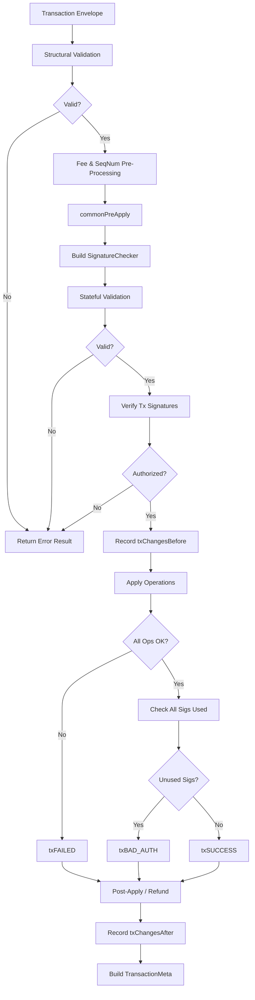
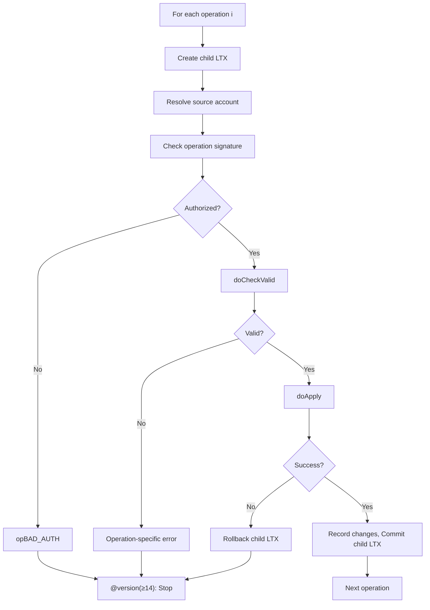
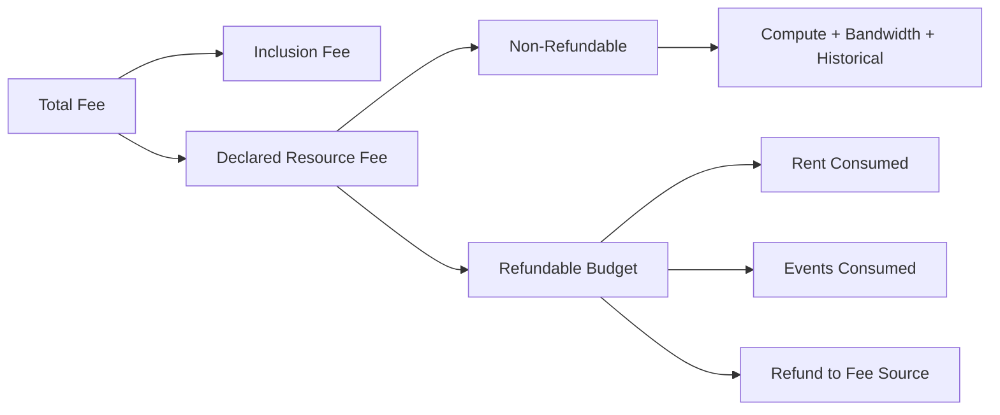

# Stellar Transaction Processing Specification

**Version:** 25 (stellar-core v25.x / Protocol 25)
**Status:** Informational
**Date:** 2026-02-20

---

## Table of Contents

1. [Introduction](#1-introduction)
2. [Processing Overview](#2-processing-overview)
3. [Data Types and Encoding](#3-data-types-and-encoding)
4. [Transaction Validation](#4-transaction-validation)
5. [Fee Framework](#5-fee-framework)
6. [Transaction Application Pipeline](#6-transaction-application-pipeline)
7. [Operation Execution](#7-operation-execution)
8. [Soroban Execution](#8-soroban-execution)
9. [State Management](#9-state-management)
10. [Metadata Construction](#10-metadata-construction)
11. [Event Emission](#11-event-emission)
12. [Error Handling](#12-error-handling)
13. [Invariants and Safety Properties](#13-invariants-and-safety-properties)
14. [Constants](#14-constants)
15. [References](#15-references)
16. [Appendices](#16-appendices)

---

## 1. Introduction

### 1.1 Purpose and Scope

This document specifies the Stellar transaction processing subsystem as
implemented in stellar-core v25.x. The transaction subsystem governs how
transactions are validated, how fees are computed and charged, how
operations mutate ledger state, how results and metadata are constructed,
and how Soroban smart contract transactions are executed.

This specification covers the complete processing pipeline: envelope
validation, fee deduction, sequence number advancement, signature
verification, operation dispatch, state management (nested ledger
transactions with savepoint semantics), metadata construction, event
emission, and error handling. The specification targets observable
behavior and deterministic outcomes; internal implementation details
such as threading models, caching strategies, and database schemas are
out of scope except where they directly affect determinism or
correctness.

This specification is **implementation agnostic**. It is derived
exclusively from the vetted stellar-core C++ implementation (v25.x)
and its pseudocode companion (stellar-core-pc). Any conforming
implementation that produces identical observable behavior (transaction
results, metadata, ledger state changes) for all valid inputs is
considered correct.

### 1.2 Conventions and Terminology

The key words "MUST", "MUST NOT", "REQUIRED", "SHALL", "SHALL NOT",
"SHOULD", "SHOULD NOT", "RECOMMENDED", "MAY", and "OPTIONAL" in this
document are to be interpreted as described in [RFC 2119][rfc2119].

| Term | Definition |
|------|------------|
| **Transaction** | A signed request to mutate ledger state, containing one or more operations. |
| **Operation** | A single atomic action within a transaction (e.g., payment, offer creation). |
| **Envelope** | A signed container (`TransactionEnvelope`) carrying a transaction and its signatures. |
| **Fee-bump transaction** | A wrapper transaction that replaces the fee source and increases the fee of an inner transaction. |
| **Classic transaction** | A transaction containing only classic (non-Soroban) operations. |
| **Soroban transaction** | A transaction containing exactly one Soroban operation (InvokeHostFunction, ExtendFootprintTTL, or RestoreFootprint). |
| **Source account** | The account that initiated the transaction or operation. Each operation MAY override the transaction-level source. |
| **Fee source** | The account charged the transaction fee. For regular transactions this is the source account; for fee-bump transactions it is the outer fee source. |
| **Ledger transaction** | A nested, scoped view of ledger state that supports commit and rollback semantics (Section 9). |
| **Inclusion fee** | The portion of the fee bid for transaction set inclusion (subject to surge pricing). |
| **Resource fee** | The Soroban-specific fee covering compute, storage, and bandwidth resources. |
| **Base fee** | The per-operation fee floor for the current ledger, determined by surge pricing or the ledger header minimum. |
| **Footprint** | A Soroban transaction's declared set of ledger keys it will read and/or write. |
| **TTL** | Time-to-live: the last ledger sequence at which a Soroban persistent or temporary entry remains live. |
| **Stroop** | The smallest unit of XLM: 1 XLM = 10,000,000 stroops. All amounts in this specification are in stroops unless stated otherwise. |
| **MuxedAccount** | An account identifier that may embed a 64-bit memo ID alongside the Ed25519 public key. |

### 1.3 Notation

This specification uses the following notation conventions:

- **XDR types**: Written in `monospace` and correspond to definitions
  in the Stellar XDR schema files (`Stellar-transaction.x`,
  `Stellar-ledger-entries.x`, `Stellar-ledger.x`, `Stellar-types.x`).
- **Protocol version guards**: Written as `@version(≥N)` to indicate
  behavior introduced at or after protocol version N. Behavior without
  a version guard applies to all supported protocol versions (24+).
- **Pseudocode**: Algorithm steps are written in language-agnostic
  pseudocode. Variable names use `camelCase`. Functions use
  `functionName()` notation.
- **Result codes**: Written in `SCREAMING_SNAKE_CASE` matching the XDR
  enum values (e.g., `txSUCCESS`, `opBAD_AUTH`).

---

## 2. Processing Overview

### 2.1 Transaction Lifecycle

A transaction progresses through the following stages:

1. **Construction**: A client constructs a `TransactionEnvelope`
   containing a transaction body and signatures.

2. **Validation** (Section 4): The transaction is checked for
   well-formedness and precondition satisfaction without mutating
   ledger state.

3. **Fee and Sequence Number Processing** (Section 5.4): Before any
   operations execute, the fee is deducted from the fee source account
   and the sequence number is advanced. These changes are committed
   regardless of whether the transaction's operations succeed.

4. **Application** (Section 6): Operations are executed sequentially.
   Each operation either succeeds (its state changes are committed) or
   fails (its state changes are rolled back). A transaction succeeds
   only if all operations succeed.

5. **Post-Application** (Section 5.5): For Soroban transactions,
   unused refundable fees are returned to the fee source account.

6. **Result and Metadata** (Sections 10, 12): A `TransactionResult`
   and `TransactionMeta` are produced recording the outcome and all
   state changes.

### 2.2 Two-Phase Ledger Model

Transactions are applied to a ledger in two phases:

1. **Classic Phase**: Contains classic (non-Soroban) transactions.
   Transactions are applied sequentially in the order determined by
   the transaction set.

2. **Soroban Phase**: Contains Soroban transactions. Prior to
   `@version(≥23)`, Soroban transactions are applied sequentially.
   From `@version(≥23)`, Soroban transactions MAY be applied in
   parallel using a staged execution model (Section 8.7).

Both phases share the same ledger state. The classic phase is always
applied before the Soroban phase.

### 2.3 Fee and Sequence Pre-Processing

Before any operations in either phase are executed, the implementation
MUST process fees and sequence numbers for **all** transactions in
**both** phases. This pre-processing pass:

1. Iterates all transactions in apply order (classic phase first, then
   Soroban phase).
2. For each transaction, deducts the computed fee from the fee source
   account and advances the source account's sequence number.
3. Commits these changes to ledger state.
4. Records the state changes as `txChangesBefore` metadata.

This ensures that fee deduction is irrevocable — even if a
transaction's operations all fail, the fee is still charged.

### 2.4 Transaction Set Structure

A transaction set is organized into phases. Each phase contains
transactions grouped for application:

- **Classic phase**: A flat list of transactions applied sequentially.
- **Soroban phase** `@version(<23)`: A flat list of transactions
  applied sequentially.
- **Soroban phase** `@version(≥23)`: A list of **stages**. Each stage
  contains one or more **clusters**. Stages are applied sequentially.
  Clusters within a stage MAY be applied in parallel because they are
  guaranteed to have non-overlapping read-write footprints. Each
  cluster contains one or more transactions applied sequentially
  within that cluster.

---

## 3. Data Types and Encoding

### 3.1 Transaction Envelope Types

All transactions are submitted as `TransactionEnvelope`, a union with
three variants:

| Envelope Type | XDR Discriminant | Description |
|---------------|-----------------|-------------|
| `ENVELOPE_TYPE_TX_V0` | 0 | Legacy format (pre-protocol 13). Source is raw `uint256` Ed25519 key. No preconditions beyond `TimeBounds`. |
| `ENVELOPE_TYPE_TX` | 2 | Current format. Source is `MuxedAccount`. Supports full `Preconditions` and Soroban extensions. |
| `ENVELOPE_TYPE_TX_FEE_BUMP` | 5 | Fee-bump wrapper. Contains an inner `TransactionV1Envelope` plus an outer fee source and fee. |

An implementation MUST support all three envelope types.

### 3.2 Transaction Body

A V1 transaction (`Transaction`) contains:

| Field | Type | Description |
|-------|------|-------------|
| `sourceAccount` | `MuxedAccount` | Transaction source account. |
| `fee` | `uint32` | Maximum total fee in stroops. |
| `seqNum` | `SequenceNumber` (`int64`) | Source account sequence number. |
| `cond` | `Preconditions` | Validity preconditions (Section 4.3). |
| `memo` | `Memo` | Attached memo (none, text, id, hash, or return). |
| `operations` | `Operation<MAX_OPS_PER_TX>` | One or more operations (max 100). |
| `ext` | union | Extension: `v=0` (none) or `v=1` (`SorobanTransactionData`). |

A V0 transaction is identical except: the source is a raw `uint256`
Ed25519 key (no muxed account support), preconditions are limited to
an optional `TimeBounds`, and no extension is supported.

### 3.3 Fee-Bump Transaction

A `FeeBumpTransaction` contains:

| Field | Type | Description |
|-------|------|-------------|
| `feeSource` | `MuxedAccount` | Account paying the fee (may differ from inner source). |
| `fee` | `int64` | Total fee for the fee-bump envelope. MUST be ≥ inner transaction fee. |
| `innerTx` | `TransactionV1Envelope` | The wrapped inner transaction (must be `ENVELOPE_TYPE_TX`). |

The inner transaction's operations, sequence number, and source account
are preserved. Only the fee source and fee amount are replaced.

### 3.4 Operations

Each `Operation` contains an optional `sourceAccount` override and a
`body` union discriminated by `OperationType`. The 27 operation types
are:

| Code | Name | Protocol | Description |
|------|------|----------|-------------|
| 0 | `CREATE_ACCOUNT` | All | Create a new account with a starting balance. |
| 1 | `PAYMENT` | All | Send a payment in a specific asset. |
| 2 | `PATH_PAYMENT_STRICT_RECEIVE` | All | Payment through DEX path; exact destination amount. |
| 3 | `MANAGE_SELL_OFFER` | All | Create, update, or delete a sell offer. |
| 4 | `CREATE_PASSIVE_SELL_OFFER` | All | Create a passive sell offer (does not cross equal-price offers). |
| 5 | `SET_OPTIONS` | All | Configure account settings, signers, thresholds. |
| 6 | `CHANGE_TRUST` | All | Create, update, or remove a trustline. |
| 7 | `ALLOW_TRUST` | All | Authorize or deauthorize a trustline (issuer only). |
| 8 | `ACCOUNT_MERGE` | All | Merge source account into destination. |
| 9 | `INFLATION` | <12 | Distribute inflation (disabled from protocol 12). |
| 10 | `MANAGE_DATA` | ≥2 | Create, update, or delete a data entry. |
| 11 | `BUMP_SEQUENCE` | ≥10 | Bump source account sequence number. |
| 12 | `MANAGE_BUY_OFFER` | ≥11 | Create, update, or delete a buy offer. |
| 13 | `PATH_PAYMENT_STRICT_SEND` | ≥12 | Payment through DEX path; exact source amount. |
| 14 | `CREATE_CLAIMABLE_BALANCE` | ≥14 | Create a claimable balance with claim predicates. |
| 15 | `CLAIM_CLAIMABLE_BALANCE` | ≥14 | Claim a claimable balance. |
| 16 | `BEGIN_SPONSORING_FUTURE_RESERVES` | ≥14 | Begin sponsoring reserves for another account. |
| 17 | `END_SPONSORING_FUTURE_RESERVES` | ≥14 | End a sponsoring relationship. |
| 18 | `REVOKE_SPONSORSHIP` | ≥14 | Transfer or remove entry/signer sponsorship. |
| 19 | `CLAWBACK` | ≥17 | Claw back an asset from a trustline (issuer only). |
| 20 | `CLAWBACK_CLAIMABLE_BALANCE` | ≥17 | Claw back a claimable balance (issuer only). |
| 21 | `SET_TRUST_LINE_FLAGS` | ≥17 | Set or clear trustline flags (issuer only). |
| 22 | `LIQUIDITY_POOL_DEPOSIT` | ≥18 | Deposit into a liquidity pool. |
| 23 | `LIQUIDITY_POOL_WITHDRAW` | ≥18 | Withdraw from a liquidity pool. |
| 24 | `INVOKE_HOST_FUNCTION` | ≥20 | Invoke a Soroban smart contract function. |
| 25 | `EXTEND_FOOTPRINT_TTL` | ≥20 | Extend the TTL of Soroban ledger entries. |
| 26 | `RESTORE_FOOTPRINT` | ≥20 | Restore archived Soroban ledger entries. |

An operation whose type is not supported at the current protocol version
MUST fail with `opNOT_SUPPORTED`.

### 3.5 Soroban Transaction Data

Soroban transactions carry additional resource declarations in
`SorobanTransactionData` (present when `Transaction.ext.v() == 1`):

| Field | Type | Description |
|-------|------|-------------|
| `resources.footprint.readOnly` | `LedgerKey<>` | Keys the transaction will read but not modify. |
| `resources.footprint.readWrite` | `LedgerKey<>` | Keys the transaction will read and may modify. |
| `resources.instructions` | `uint32` | CPU instruction budget. |
| `resources.diskReadBytes` | `uint32` | Disk read byte budget. |
| `resources.writeBytes` | `uint32` | Write byte budget. |
| `resourceFee` | `int64` | Declared resource fee in stroops. |
| `ext` | union | `@version(≥23)`: MAY contain `archivedSorobanEntries` (indexes into footprint identifying archived entries for auto-restore). |

### 3.6 Preconditions

The `Preconditions` union supports three forms:

- **`PRECOND_NONE`**: No preconditions.
- **`PRECOND_TIME`**: Only `TimeBounds` (min/max close time).
- **`PRECOND_V2`** `@version(≥19)`: Full preconditions:

| Field | Type | Description |
|-------|------|-------------|
| `timeBounds` | `TimeBounds*` | Optional min/max close time. |
| `ledgerBounds` | `LedgerBounds*` | Optional min/max ledger sequence. |
| `minSeqNum` | `SequenceNumber*` | Optional minimum sequence number (enables gap-filling). |
| `minSeqAge` | `Duration` | Minimum seconds since source account's last sequence change. |
| `minSeqLedgerGap` | `uint32` | Minimum ledgers since source account's last sequence change. |
| `extraSigners` | `SignerKey<2>` | Up to 2 additional required signers. |

### 3.7 Transaction Results

`TransactionResult` contains:

| Field | Type | Description |
|-------|------|-------------|
| `feeCharged` | `int64` | Actual fee charged (may be less than declared fee after refunds). |
| `result` | union | Success: `OperationResult` array. Failure: error code. Fee-bump: inner result pair. |

For fee-bump transactions, the outer result code is
`txFEE_BUMP_INNER_SUCCESS` or `txFEE_BUMP_INNER_FAILED`, and the
`result` contains an `InnerTransactionResultPair` with the inner
transaction's hash and result.

### 3.8 Signature Types

Each envelope carries up to 20 `DecoratedSignature` entries. A
`DecoratedSignature` contains a 4-byte `hint` (last 4 bytes of the
signer's public key) and a `Signature` (up to 64 bytes).

Signers are identified by `SignerKey`, a union with four types:

| Type | Description |
|------|-------------|
| `KEY_TYPE_ED25519` | Standard Ed25519 public key. |
| `KEY_TYPE_PRE_AUTH_TX` | SHA-256 hash of a transaction envelope; consumed on use. |
| `KEY_TYPE_HASH_X` | SHA-256 preimage; the signature is the preimage itself. |
| `KEY_TYPE_ED25519_SIGNED_PAYLOAD` | Ed25519 key plus a payload that must match the signed data. `@version(≥19)` |

**Signature hints**: Each `DecoratedSignature` includes a 4-byte hint
to speed up signer lookup:
- `ED25519`: last 4 bytes of the ed25519 public key.
- `PRE_AUTH_TX`: last 4 bytes of the pre-auth transaction hash.
- `HASH_X`: last 4 bytes of the hashX value.
- `ED25519_SIGNED_PAYLOAD`: `last4bytes(ed25519_key) XOR last4bytes(payload)`.
  If the payload is shorter than 4 bytes, it is right-padded with
  zero bytes to 4 bytes before XOR. See CAP-0040.

---

## 4. Transaction Validation

Validation determines whether a transaction is eligible for inclusion
in a transaction set and for application. Validation MUST NOT mutate
ledger state.

### 4.1 Validation Stages

Validation proceeds in two conceptual stages:

1. **Structural validation** (Section 4.2): Checks that can be
   performed without ledger state (envelope well-formedness,
   operation count, Soroban consistency).

2. **Stateful validation** (Section 4.3–4.8): Checks that require
   reading ledger state (source account existence, sequence numbers,
   preconditions, fee sufficiency, signatures).

### 4.2 Structural Validation

The following checks MUST be performed on every transaction envelope:

1. **Envelope type**: The envelope type MUST be `ENVELOPE_TYPE_TX_V0`,
   `ENVELOPE_TYPE_TX`, or `ENVELOPE_TYPE_TX_FEE_BUMP`.

2. **Operation count**: The transaction MUST contain at least one
   operation. Result: `txMISSING_OPERATION`.

3. **Fee-bump inner type** (fee-bump only): The inner transaction
   MUST be `ENVELOPE_TYPE_TX`. Result: `txMALFORMED`.

4. **Fee-bump fee floor** (fee-bump only): The outer fee MUST be
   ≥ the inner transaction's fee. Result: `txINSUFFICIENT_FEE`.

5. **Fee-bump fee overflow** (fee-bump only): The outer fee MUST
   be ≥ `innerBaseFee * (numInnerOps + 1)`, where the `+1` accounts
   for the fee-bump operation itself. This product MUST NOT overflow
   `int64`. Result: `txINSUFFICIENT_FEE`.

6. **Soroban consistency** (Section 4.9): If any operation in the
   transaction is a Soroban type (InvokeHostFunction,
   ExtendFootprintTTL, RestoreFootprint), then: (a) the transaction
   MUST contain exactly one operation, (b) that operation MUST be a
   Soroban type, and (c) the transaction MUST carry
   `SorobanTransactionData` (`ext.v() == 1`). A non-Soroban
   transaction MUST NOT carry `SorobanTransactionData`.
   Result: `txMALFORMED`.

7. **Soroban memo restriction** `@version(≥25)`: If the transaction is
   a Soroban InvokeHostFunction transaction, the memo MUST be
   `MEMO_NONE`. Result: `txMALFORMED`.

8. **Soroban muxed account restriction** `@version(≥25)`: If the
   transaction is a Soroban InvokeHostFunction transaction, the
   transaction source account MUST NOT be a muxed account
   (`KEY_TYPE_MUXED_ED25519`). The operation source (if present)
   MUST NOT be muxed either. Result: `txMALFORMED`.

### 4.3 Precondition Validation

Preconditions are checked against the current ledger header:

1. **Time bounds**: If `timeBounds` is present:
   - If `minTime > 0`: the ledger close time MUST be ≥ `minTime`.
     Result: `txTOO_EARLY`.
   - If `maxTime > 0`: the ledger close time MUST be ≤ `maxTime`.
     Result: `txTOO_LATE`.

2. **Ledger bounds** `@version(≥19)`: If `ledgerBounds` is present:
   - If `minLedger > 0`: the ledger sequence MUST be ≥ `minLedger`.
     Result: `txTOO_EARLY`.
   - If `maxLedger > 0`: the ledger sequence MUST be ≤ `maxLedger`.
     Result: `txTOO_LATE`.

3. **Minimum fee**: The declared fee MUST be ≥ `baseFee * numOps`,
   where `baseFee` is the ledger header's base fee.
   Result: `txINSUFFICIENT_FEE`.

### 4.4 Source Account Validation

1. **Source account existence**: The source account MUST exist in the
   ledger. Result: `txNO_ACCOUNT`.

2. **Sequence number**: The transaction's `seqNum` MUST satisfy:
   - If `minSeqNum` precondition is present `@version(≥19)`:
     `seqNum` MUST be > `minSeqNum` AND `seqNum` MUST be
     > the source account's current sequence number AND `seqNum`
     MUST be ≤ the source account's current sequence number +
     `MAX_SEQ_NUM_INCREASE` (2^31).
   - Otherwise: `seqNum` MUST equal the source account's current
     sequence number + 1.
   - Result: `txBAD_SEQ`.

3. **Minimum sequence age** `@version(≥19)`: If `minSeqAge > 0`, the
   time elapsed since the source account's sequence number was last
   changed MUST be ≥ `minSeqAge`. The elapsed time is computed as
   `closeTime - max(seqTime, EXPECTED_CLOSE_TIME_MULT *
   seqLedger)` where `seqTime` and `seqLedger` record when the
   sequence was last updated. Result: `txBAD_MIN_SEQ_AGE_OR_GAP`.

4. **Minimum sequence ledger gap** `@version(≥19)`: If
   `minSeqLedgerGap > 0`, the number of ledgers elapsed since the
   source account's sequence number was last changed MUST be ≥
   `minSeqLedgerGap`. Result: `txBAD_MIN_SEQ_AGE_OR_GAP`.

### 4.5 Signature Validation

Transaction-level signature validation checks that the transaction
envelope carries sufficient authorization from the source account:

1. The transaction-level signature check uses the **low** threshold
   of the source account (for the outer transaction in a fee-bump,
   this is the fee source).

2. The signature check algorithm is defined in Section 4.7.

3. Result: `txBAD_AUTH`.

### 4.6 Fee Source Balance Validation

The fee source account MUST have sufficient balance to pay the
computed fee:

- For a non-fee-bump transaction: the source account's available
  native balance MUST be ≥ the fee.
- For a fee-bump transaction: the fee source's available native
  balance MUST be ≥ the fee (where "available" means total balance
  minus selling liabilities minus `baseReserve * (2 + numSubEntries
  + numSponsoring - numSponsored)`).

Result: `txINSUFFICIENT_BALANCE`.

### 4.7 Signature Checking Algorithm

Given a set of `DecoratedSignature` entries and a target hash (the
transaction's content hash), signature verification proceeds as
follows:

```
function checkSignature(signers, neededWeight, contentHash, signatures):
    usedSignatures = empty set
    totalWeight = 0

    for each signer in signers:
        for each (index, sig) in signatures:
            if index in usedSignatures:
                continue

            match signer.type:
                case PRE_AUTH_TX:
                    if signer.preAuthTxHash == contentHash:
                        mark signer as used (consume from account)
                        usedSignatures.add(index)
                        totalWeight += signer.weight
                        break

                case HASH_X:
                    if sig.hint == last4bytes(signer.hashX):
                        if sha256(sig.signature) == signer.hashX:
                            usedSignatures.add(index)
                            totalWeight += signer.weight
                            break

                case ED25519:
                    if sig.hint == last4bytes(signer.ed25519):
                        if ed25519Verify(signer.ed25519, contentHash, sig.signature):
                            usedSignatures.add(index)
                            totalWeight += signer.weight
                            break

                case ED25519_SIGNED_PAYLOAD:
                    // Hint is XOR of last 4 bytes of ed25519 key
                    // and last 4 bytes of payload (zero-padded if
                    // payload < 4 bytes). See CAP-0040.
                    if sig.hint == xorHint(signer.ed25519SignedPayload):
                        // Verify signature against the signer's
                        // payload (NOT the transaction hash).
                        if ed25519Verify(signer.ed25519, signer.payload, sig.signature):
                            usedSignatures.add(index)
                            totalWeight += signer.weight
                            break

            // @version(≥10): cap accumulated weight
            totalWeight = min(totalWeight, UINT8_MAX)

            if totalWeight >= neededWeight:
                return true

    return totalWeight >= neededWeight
```

**PRE_AUTH_TX signer consumption**: When a PRE_AUTH_TX signer matches,
it MUST be removed from the source account's signer list regardless
of whether the overall signature check succeeds or the transaction
succeeds. This removal is committed even if the transaction fails.

**Extra signers** `@version(≥19)`: If `PreconditionsV2.extraSigners`
is non-empty, each extra signer MUST be satisfied by at least one
signature in the envelope. Each extra signer requires a weight of 1
(i.e., the total weight needed for extra signers equals the count of
extra signers). Result: `txBAD_AUTH_EXTRA`.

**Unused signature check**: After operation execution, if any signature
in the envelope was not consumed by either the transaction-level check
or any operation-level check, the transaction MUST fail with
`txBAD_AUTH`.

### 4.8 Operation-Level Validation

Each operation is individually validated during application (not during
the pre-application validation pass). The validation checks for each
operation type are specified in Section 7.

The common operation-level checks are:

1. **Operation support**: The operation type MUST be supported at the
   current protocol version (see Section 3.4).
   Result: `opNOT_SUPPORTED`.

2. **Source account existence**: If the operation specifies a source
   account override, that account MUST exist.
   Result: `opNO_ACCOUNT`.

3. **Operation-specific validation**: Each operation type defines its
   own `doCheckValid()` checks (Section 7).

### 4.9 Soroban Resource Validation

For Soroban transactions, the declared resources in
`SorobanTransactionData` MUST satisfy:

1. `instructions` MUST be ≤ `txMaxInstructions` (network config).
2. `diskReadBytes` MUST be ≤ `txMaxDiskReadBytes`.
3. `writeBytes` MUST be ≤ `txMaxWriteBytes`.
4. The number of disk-read entries MUST be ≤
   `txMaxReadLedgerEntries` (called `txMaxDiskReadEntries`
   from protocol 23+).
   - `@version(<23)`: disk-read entries = all footprint entries
     (readOnly + readWrite).
   - `@version(≥23)`: disk-read entries = classic (non-Soroban)
     footprint entries + archived Soroban entries (from
     `archivedSorobanEntries`). Soroban entries
     (`CONTRACT_DATA`, `CONTRACT_CODE`) that are live
     in-memory are excluded from the disk-read count
     (CAP-0066). For `RestoreFootprint` operations, all
     readWrite entries count as disk reads.
5. The total number of read-write footprint entries MUST be ≤
   `txMaxWriteLedgerEntries`.
6. `@version(<23)`: The total number of all footprint entries
   (read-only + read-write) MUST be ≤ `txMaxReadLedgerEntries`.
   `@version(≥23)`: The total number of all footprint entries
   MUST be ≤ `txMaxFootprintEntries` (from
   `CONFIG_SETTING_CONTRACT_LEDGER_COST_EXT`, see
   LEDGER_SPEC Section 9.2).
7. Each footprint key MUST have a serialized size ≤
   `maxContractDataKeySizeBytes`.
8. The serialized transaction size MUST be ≤ `txMaxSizeBytes`.
9. Footprint keys MUST be of type `ACCOUNT`, `TRUSTLINE`,
   `CONTRACT_DATA`, or `CONTRACT_CODE` only.
10. There MUST be no duplicate keys across the read-only and read-write
    footprints combined.
11. `@version(≥23)`: If `archivedSorobanEntries` is present, each
    index MUST be valid (within the footprint).
12. The `resourceFee` MUST be ≤ the total fee declared in the
    envelope.
13. The `resourceFee` MUST be ≤ `MAX_RESOURCE_FEE` (2^50).
14. The computed resource fee (from the fee computation function) MUST
    be ≤ the declared `resourceFee`.

Result: `txSOROBAN_INVALID`.

---

## 5. Fee Framework

### 5.1 Fee Structure

The total fee for a transaction serves two purposes:

1. **Inclusion fee**: Compensates the network for including the
   transaction in a ledger. Subject to surge pricing.
2. **Resource fee** (Soroban only): Covers the cost of computational
   resources consumed by smart contract execution.

For a **classic transaction**:
```
totalFee = inclusionFee
inclusionFee = envelope.fee
```

For a **Soroban transaction**:
```
totalFee = inclusionFee + declaredResourceFee
inclusionFee = envelope.fee - sorobanData.resourceFee
declaredResourceFee = sorobanData.resourceFee
```

For a **fee-bump transaction**:
```
totalFee = feeBumpEnvelope.fee
inclusionFee (classic) = totalFee / (numInnerOps + 1)  // per-op
inclusionFee (Soroban) = totalFee - declaredResourceFee
```

### 5.2 Surge Pricing

When the number of submitted transactions exceeds the ledger's
capacity, surge pricing increases the effective base fee. The full
algorithm — including fee rate comparison, the lane model, multi-
dimensional Soroban resource limits, transaction set selection, queue
eviction, and per-lane base fee computation — is defined in
**HERDER_SPEC §12** ("Surge Pricing and Eviction") and **§6.6**
("Per-Lane Base Fee Computation").

**Per-operation fee rounding**: `@version(≥20)`: per-op fee
computation uses floor division. Prior versions use ceiling
division.

### 5.3 Effective Fee Computation

When a transaction is applied, the actual fee charged is:

For a **classic transaction**:
```
feeCharged = min(inclusionFee, baseFee * numOps)
```

For a **Soroban transaction**:
```
feeCharged = resourceFee + min(inclusionFee, baseFee * numOps)
```

where `resourceFee` is the computed (not declared) resource fee, and
`baseFee` is the surge-priced base fee for this transaction's phase.

**During validation** (not application), the fee is computed as:
```
feeCharged = resourceFee + baseFee * numOps
```
without the `min()` cap on inclusion fee.

### 5.4 Fee and Sequence Number Pre-Processing

Before any operations execute, for each transaction in apply order:

```
function processFeeSeqNum(tx, ltx):
    feeSource = loadAccount(tx.feeSourceAccount, ltx)
    feeCharged = computeFee(tx, ledgerHeader, baseFee)

    // Deduct fee (never more than available balance)
    actualDeduction = min(feeSource.balance, feeCharged)
    feeSource.balance -= actualDeduction
    ledgerHeader.feePool += actualDeduction

    // @version(≥10): advance sequence number here
    if protocolVersion >= 10:
        sourceAccount = loadAccount(tx.sourceAccount, ltx)
        sourceAccount.seqNum = tx.seqNum

    // @version(≥19): create MAX_SEQ_NUM_TO_APPLY entry if needed
    if protocolVersion >= 19 and tx.hasAccountMergeOp():
        createMaxSeqNumToApplyEntry(tx.sourceAccount, tx.seqNum, ltx)

    commit(ltx)
```

The `MAX_SEQ_NUM_TO_APPLY` internal entry `@version(≥19)` prevents an
account merge from allowing a replayed transaction: if a transaction
contains an `ACCOUNT_MERGE` operation, the maximum sequence number is
recorded so that if the account is recreated, sequence-number-based
replay protection is preserved.

### 5.5 Soroban Fee Refunds

After a Soroban transaction's operations complete, unused refundable
fees are returned to the fee source:

```
function processRefund(tx, ltx):
    if not tx.isSoroban():
        return

    refundableFee = tx.declaredResourceFee - tx.nonRefundableFee
    consumedRefundable = tx.consumedRentFee + tx.consumedEventsFee
    refund = max(0, refundableFee - consumedRefundable)

    if refund > 0:
        feeSource = loadAccount(tx.feeSourceAccount, ltx)
        feeSource.balance += refund
        ledgerHeader.feePool -= refund
        tx.result.feeCharged -= refund

    commit(ltx)
```

The resource fee is split into **non-refundable** and **refundable**
components by the resource fee computation function:
- **Non-refundable**: Covers compute (instructions), bandwidth
  (transaction size), historical archival (read bytes).
- **Refundable**: Covers rent and contract event emission. The actual
  consumption depends on execution, so the unused portion is refunded.

`@version(≥23)`: Fee refunds for all Soroban transactions in a stage
are processed after the entire stage completes, not after each
individual transaction.

### 5.6 Fee-Bump Semantics

A fee-bump transaction wraps an inner transaction with a new fee
source and higher fee:

1. The inner transaction's operations, source account, and sequence
   number are preserved unchanged.

2. The fee-bump's `feeSource` pays the fee instead of the inner
   source.

3. The content hash used for signature verification of the outer
   envelope is computed over the `FeeBumpTransaction` body.

4. The inner transaction's signatures are verified against the inner
   transaction's content hash.

5. The result structure nests: the outer result code is
   `txFEE_BUMP_INNER_SUCCESS` or `txFEE_BUMP_INNER_FAILED`, containing
   the inner result.

6. `@version(≥21)`: The inner result's `feeCharged` is updated to
   reflect Soroban refunds. Prior versions did not propagate refunds
   to the inner result.

7. `@version(≥25)`: The inner result's `feeCharged` adjustment
   (subtracting from inner to add to outer) is removed. The inner
   `feeCharged` is simply the charged fee of the inner transaction.

---

## 6. Transaction Application Pipeline

### 6.1 Application Entry Point

After fee and sequence number pre-processing (Section 5.4), each
transaction is applied via the following pipeline:

```
function apply(tx, ltx, metaBuilder):
    // Phase 1: Pre-apply (signatures, final validation)
    sigChecker = commonPreApply(tx, ltx, metaBuilder)

    if sigChecker is null:
        // Validation failed; result already set
        return

    // Phase 2: Apply operations
    applyOperations(tx, sigChecker, ltx, metaBuilder)

    // Phase 3: Verify all signatures used
    if not sigChecker.allSignaturesUsed():
        tx.setError(txBAD_AUTH)

    // Phase 4: Post-apply (Soroban refunds)
    processPostApply(tx, ltx, metaBuilder)
```

### 6.2 Pre-Apply Phase (commonPreApply)

The pre-apply phase performs final validation with mutable state access
and records fee-related metadata:

```
function commonPreApply(tx, ltx, metaBuilder):
    // Create a child ledger transaction for pre-apply work
    ltxPreApply = createChild(ltx)

    // Build signature checker
    sigChecker = SignatureChecker(tx.contentHash, tx.signatures)

    // Run stateful validation (commonValid)
    validity = commonValid(tx, sigChecker, ltxPreApply, applying=true)

    if validity == kInvalid:
        rollback(ltxPreApply)
        return null

    // @version(<10): advance sequence number here (already done in
    // processFeeSeqNum for ≥10)
    if protocolVersion < 10:
        processSeqNum(tx, ltxPreApply)

    // Verify transaction-level signatures
    if not checkAccountSignatures(tx.sourceAccount, sigChecker, LOW):
        rollback(ltxPreApply)
        tx.setError(txBAD_AUTH)
        return null

    // Record pre-operation state changes in metadata
    metaBuilder.pushTxChangesBefore(ltxPreApply.getChanges())
    commit(ltxPreApply)

    return sigChecker
```

### 6.3 Stateful Validation (commonValid)

The `commonValid` function performs all stateful checks. It is called
both during validation (without mutation) and during application (with
mutation). The `applying` parameter controls whether the call is
during the apply path.

```
function commonValid(tx, sigChecker, ltx, applying):
    // 1. Pre-sequence-number checks
    result = commonValidPreSeqNum(tx, ltx, applying)
    if result != kMaybeValid:
        return result

    // 2. Sequence number check
    sourceAccount = loadAccount(tx.sourceAccount, ltx)
    if isBadSeq(tx, sourceAccount):
        tx.setError(txBAD_SEQ)
        return kInvalid

    // 3. Sequence age/gap checks (@version(≥19))
    if isTooEarlyForAccount(tx, sourceAccount, ledgerHeader):
        tx.setError(txBAD_MIN_SEQ_AGE_OR_GAP)
        return kInvalid

    // 4. Transaction-level signature check (during validation only)
    if not applying:
        if not checkAccountSignatures(tx.sourceAccount, sigChecker, LOW):
            tx.setError(txBAD_AUTH)
            return kInvalidPostAuth

    // 5. Balance sufficiency
    if not checkFeeBalance(tx, sourceAccount):
        tx.setError(txINSUFFICIENT_BALANCE)
        return kInvalid

    return kMaybeValid
```

The `commonValidPreSeqNum` function checks:
1. Envelope type validity
2. Operation count (≥1)
3. Soroban operations consistency (Section 4.2, item 6)
4. Soroban resource validation (Section 4.9)
5. Time bounds and ledger bounds
6. Minimum fee (`fee ≥ baseFee * numOps`)
7. Source account existence

### 6.4 Operation Application

Operations are applied sequentially within a nested ledger transaction
scope:

```
function applyOperations(tx, sigChecker, ltx, metaBuilder):
    success = true

    for i in 0..tx.numOperations:
        op = tx.operations[i]
        ltxOp = createChild(ltx)
        opMetaBuilder = metaBuilder.beginOperation()

        // Resolve operation source account
        opSource = op.sourceAccount ?? tx.sourceAccount

        // Check operation-level signature
        threshold = op.getThresholdLevel()
        if not checkAccountSignatures(opSource, sigChecker, threshold):
            op.setResult(opBAD_AUTH)
            success = false
            rollback(ltxOp)
            break  // @version(≥14): stop on first failure

        // Validate operation
        if not op.checkValid(ltxOp):
            success = false
            rollback(ltxOp)
            // @version(≥14): stop on first failure
            break

        // Execute operation
        if not op.doApply(ltxOp):
            success = false
            // @version(≥14): rollback this op and stop
            rollback(ltxOp)
            break
        else:
            opMetaBuilder.recordChanges(ltxOp.getChanges())
            commit(ltxOp)

    if not success:
        tx.setError(txFAILED)
```

**Failure semantics**: `@version(≥14)`: When an operation fails, its
state changes are rolled back and no subsequent operations are
executed. The transaction result is `txFAILED` and the results array
contains the failing operation's result at its index with all
subsequent slots empty.

`@version(<14)`: All operations are attempted regardless of earlier
failures. Each failing operation's changes are individually rolled back.
The transaction fails if any operation failed.

### 6.5 Operation Threshold Levels

Each operation type requires a specific authorization threshold:

| Threshold | Operations |
|-----------|-----------|
| **LOW** | AllowTrust, SetTrustLineFlags, Inflation, BumpSequence, ClaimClaimableBalance, ExtendFootprintTTL, RestoreFootprint |
| **MEDIUM** | All operations not listed under LOW or HIGH (default). |
| **HIGH** | SetOptions (when modifying master weight, thresholds, or signers), AccountMerge. |

### 6.6 Source Account Resolution

Each operation's effective source account is determined as:

1. If the operation's `sourceAccount` field is present, use that
   account.
2. Otherwise, use the transaction's `sourceAccount`.

For muxed accounts (`KEY_TYPE_MUXED_ED25519`), the embedded Ed25519
key is used as the account ID for ledger lookups. The muxed ID is
ignored for state access but preserved in metadata.

---

## 7. Operation Execution

This section specifies the execution semantics for each of the 27
operation types. For each operation, the specification defines:

- **Validation** (`doCheckValid`): Checks performed before execution.
- **Execution** (`doApply`): The state mutation algorithm.
- **Result codes**: All possible outcomes.

### 7.1 CreateAccount

Creates a new account with a starting XLM balance.

**Validation**:
- `@version(<14)`: `startingBalance` MUST be > 0. `@version(≥14)`:
  `startingBalance` MUST be ≥ 0. Result: `CREATE_ACCOUNT_MALFORMED`.
- `destination` MUST NOT equal the source account. Result:
  `CREATE_ACCOUNT_MALFORMED`.

**Execution**:
1. Load source account.
2. Verify source has sufficient native balance (startingBalance ≤
   available balance). Result: `CREATE_ACCOUNT_UNDERFUNDED`.
3. Verify destination account does not already exist.
   Result: `CREATE_ACCOUNT_ALREADY_EXIST`.
4. Debit `startingBalance` from source.
5. Create new `ACCOUNT` entry for destination with:
   - `balance = startingBalance`
   - `seqNum = ledgerSeq << 32` (current ledger shifted left by 32
     bits)
   - All thresholds set to 0 (master weight defaults to 1 implicitly).
6. Create with sponsorship support (Section 7.28).
   Result: `CREATE_ACCOUNT_LOW_RESERVE` if insufficient reserve.

### 7.2 Payment

Sends a specified amount of an asset to a destination.

**Validation**:
- `amount` MUST be > 0. Result: `PAYMENT_MALFORMED`.
- `asset` MUST be valid. Result: `PAYMENT_MALFORMED`.
- `destination` MUST NOT equal the source when asset is non-native
  `@version(<13)`. Result: `PAYMENT_MALFORMED`.

**Execution**: Internally constructs and delegates to a
PathPaymentStrictReceive with empty path, `sendMax = amount`,
`destAmount = amount`, `sendAsset = destAsset = asset`.

Result codes are mapped from the path payment result.

### 7.3 PathPaymentStrictReceive

Sends a payment through a conversion path, delivering an exact
destination amount.

**Validation**:
- `destAmount` MUST be > 0. Result: `PATH_PAYMENT_STRICT_RECEIVE_MALFORMED`.
- `sendMax` MUST be > 0. Result: `PATH_PAYMENT_STRICT_RECEIVE_MALFORMED`.
- All assets (source, path, destination) MUST be valid.
  Result: `PATH_PAYMENT_STRICT_RECEIVE_MALFORMED`.

**Execution**:
1. **Issuer bypass check**: If destination asset is non-native, path
   is empty, source asset equals destination asset, and the destination
   is the issuer of the asset, then skip the destination account
   existence check.
2. Otherwise, verify destination account exists.
   Result: `PATH_PAYMENT_STRICT_RECEIVE_NO_DESTINATION`.
3. Credit destination with `destAmount`.
4. Build conversion path (reversed): walk backwards from destination
   asset through each intermediate asset to source asset.
5. At each hop, call the DEX conversion engine with
   `ROUND_TYPE_STRICT_RECEIVE` to exchange the needed amount.
6. `@version(≥20)`: Enforce `MAX_OFFERS_TO_CROSS` (1000) limit across
   all hops. Result:
   `PATH_PAYMENT_STRICT_RECEIVE_EXCEEDED_WORK_LIMIT`.
7. If total source amount exceeds `sendMax`:
   Result: `PATH_PAYMENT_STRICT_RECEIVE_OVER_SENDMAX`.
8. Debit source account.

Additional result codes: `SRC_NO_TRUST`, `SRC_NOT_AUTHORIZED`,
`UNDERFUNDED`, `DEST_NO_TRUST`, `DEST_NOT_AUTHORIZED`, `LINE_FULL`,
`NO_ISSUER` `@version(<13)`, `OFFER_CROSS_SELF`, `TOO_FEW_OFFERS`.

### 7.4 PathPaymentStrictSend

Sends an exact source amount through a conversion path, requiring a
minimum destination amount. `@version(≥12)`.

**Validation**:
- `sendAmount` MUST be > 0. Result: `PATH_PAYMENT_STRICT_SEND_MALFORMED`.
- `destMin` MUST be > 0. Result: `PATH_PAYMENT_STRICT_SEND_MALFORMED`.
- All assets MUST be valid.

**Execution**:
1. Issuer bypass check (same as strict receive).
2. Verify destination exists (unless bypassed).
   Result: `PATH_PAYMENT_STRICT_SEND_NO_DESTINATION`.
3. Debit source with `sendAmount` (source is debited first, unlike
   strict receive).
4. Walk conversion path forward from source asset to destination asset
   using `ROUND_TYPE_STRICT_SEND`.
5. Enforce `MAX_OFFERS_TO_CROSS` limit `@version(≥20)`.
6. If destination amount received < `destMin`:
   Result: `PATH_PAYMENT_STRICT_SEND_UNDER_DESTMIN`.
7. Credit destination.

Same additional result codes as PathPaymentStrictReceive.

### 7.5 ManageSellOffer

Creates, updates, or deletes a sell offer on the DEX.

**Validation**:
- `amount` MUST be ≥ 0 (0 = delete). Result: `MANAGE_SELL_OFFER_MALFORMED`.
- `price.n` and `price.d` MUST be > 0. Result: `MANAGE_SELL_OFFER_MALFORMED`.
- `selling` and `buying` MUST be valid and different assets.
  Result: `MANAGE_SELL_OFFER_MALFORMED`.

**Execution** (shared with ManageBuyOffer and CreatePassiveSellOffer via
a common base):

1. If `amount == 0` (delete): load offer by `offerID`, verify
   ownership, remove offer and adjust liabilities.
   Result: `MANAGE_SELL_OFFER_NOT_FOUND` if missing.

2. If `offerID != 0` (update): load existing offer, verify ownership.
   Result: `MANAGE_SELL_OFFER_NOT_FOUND`.

3. Validate selling/buying trustlines exist and are authorized.
   Result: `SELL_NO_TRUST`, `BUY_NO_TRUST`, `SELL_NOT_AUTHORIZED`,
   `BUY_NOT_AUTHORIZED`.

4. `@version(<13)`: Verify selling/buying asset issuers exist.
   Result: `SELL_NO_ISSUER`, `BUY_NO_ISSUER`.

5. **Cross existing offers**: Walk the order book, crossing offers at
   favorable prices. For each crossed offer:
   - Exchange assets between the two parties.
   - `@version(≥10)`: Adjust buying/selling liabilities.
   - If the crossed offer is fully consumed, remove it.
   - Self-crossing check: MUST NOT cross own offers.
     Result: `MANAGE_SELL_OFFER_CROSS_SELF`.
   - Also crosses liquidity pools `@version(≥18)` when the pool
     offers a better price.
   - Enforce `MAX_OFFERS_TO_CROSS` limit `@version(≥20)`.

6. If residual amount remains and this is not a delete:
   - If this is a new offer (`offerID == 0`): create a new OFFER
     entry with sponsorship support.
   - If this is an update: modify the existing offer.
   - Validate the seller has sufficient selling liabilities capacity
     and the buyer has sufficient buying liabilities capacity
     `@version(≥10)`.
   - Result: `MANAGE_SELL_OFFER_LOW_RESERVE`, `MANAGE_SELL_OFFER_LINE_FULL`,
     `MANAGE_SELL_OFFER_UNDERFUNDED`.

7. Passive offers (CreatePassiveSellOffer): do not cross offers at the
   same price; only cross at strictly better prices.

### 7.6 ManageBuyOffer

Creates, updates, or deletes a buy offer on the DEX. `@version(≥11)`.

The algorithm is identical to ManageSellOffer with the following
differences:

- The price is **inverted** internally: `Price { n: op.price.d,
  d: op.price.n }`. This transforms the buy offer into a sell offer
  from the perspective of the exchange engine.
- The `buyAmount` caps the **wheat** (buying) side rather than the
  **sheep** (selling) side.
- Liabilities are computed using the original (non-inverted) price.

### 7.7 CreatePassiveSellOffer

Creates a passive sell offer. Equivalent to ManageSellOffer with
`offerID = 0` and `passive = true`. A passive offer does not cross
offers at the same price — it only crosses at strictly better prices.

### 7.7.1 Liabilities Model

`@version(≥10)` (CAP-0003): Accounts and trustlines track aggregate
**buying** and **selling liabilities** from outstanding offers.
Liabilities are stored in `AccountEntry.ext.v1().liabilities` and
`TrustLineEntry.ext.v1().liabilities`.

**Available balance** (how much can be sold/sent):
```
availableBalance(account, native) =
    account.balance - minBalance(account) - account.sellingLiabilities
availableBalance(trustline) =
    trustline.balance - trustline.sellingLiabilities
```

**Available limit** (how much can be received):
```
availableLimit(account, native) =
    INT64_MAX - account.balance - account.buyingLiabilities
availableLimit(trustline) =
    trustline.limit - trustline.balance - trustline.buyingLiabilities
```

**Offer liabilities**: When an offer with `(price, amount)` is
placed, the liabilities it reserves are computed via the exchange
function (Section 7.29.1):
- `offerSellingLiabilities` = amount of selling asset committed
- `offerBuyingLiabilities` = amount of buying asset expected

**Validation invariant** `@version(≥10)`:
- `availableBalance >= offerSellingLiabilities`, else
  `MANAGE_SELL_OFFER_UNDERFUNDED`.
- `availableLimit >= offerBuyingLiabilities`, else
  `MANAGE_SELL_OFFER_LINE_FULL`.

**Lifecycle**: Liabilities are incremented when offers are created or
updated, and decremented when offers are deleted, fully consumed, or
partially filled. On each crossing, both parties' liabilities are
adjusted to reflect the exchanged amounts.

### 7.8 SetOptions

Configures account settings. The fields are applied in the following
order:

**Threshold level**: HIGH if modifying master weight, thresholds, or
signers. MEDIUM otherwise.

**Validation**:
- `setFlags` and `clearFlags` MUST NOT contain unknown flag bits.
  Result: `SET_OPTIONS_UNKNOWN_FLAG`.
- `setFlags` and `clearFlags` MUST NOT overlap.
  Result: `SET_OPTIONS_BAD_FLAGS`.
- Threshold values MUST be ≤ 255.
  Result: `SET_OPTIONS_THRESHOLD_OUT_OF_RANGE`.
- Signer MUST NOT be the account itself.
  Result: `SET_OPTIONS_BAD_SIGNER`.
- `ED25519_SIGNED_PAYLOAD` signers require `@version(≥19)` and a
  non-empty payload. Result: `SET_OPTIONS_BAD_SIGNER`.

**Execution** (applied in this order):
1. **Inflation destination**: If set, verify the target account exists
   (unless it's self). Result: `SET_OPTIONS_INVALID_INFLATION`.
2. **Clear flags**: Clear the specified flags. If account has
   `AUTH_IMMUTABLE_FLAG`, MUST fail.
   Result: `SET_OPTIONS_CANT_CHANGE`.
3. **Set flags**: Set the specified flags. Same immutability check.
   `AUTH_CLAWBACK_ENABLED_FLAG` requires `AUTH_REVOCABLE_FLAG`.
   Result: `SET_OPTIONS_AUTH_REVOCABLE_REQUIRED`.
4. **Home domain**: Set the home domain string.
   Result: `SET_OPTIONS_INVALID_HOME_DOMAIN` if invalid.
5. **Thresholds**: Set master weight, low/medium/high thresholds.
6. **Signer**: Add, update, or remove a signer. Weight > 0 adds/updates;
   weight == 0 removes. Result: `SET_OPTIONS_TOO_MANY_SIGNERS` if
   adding beyond the limit (20). New signers use sponsorship support.

### 7.9 ChangeTrust

Creates, updates, or removes a trustline.

**Validation**:
- Asset/pool MUST be valid. Result: `CHANGE_TRUST_MALFORMED`.
- Source MUST NOT be the asset issuer. Result:
  `CHANGE_TRUST_SELF_NOT_ALLOWED`.
- `limit` MUST be ≥ 0. Result: `CHANGE_TRUST_MALFORMED`.

**Execution**:
1. If `limit == 0` (remove trustline):
   - Trustline MUST exist. Result: `CHANGE_TRUST_INVALID_LIMIT`
     (if the trustline was not found when attempting to remove).
   - Balance MUST be 0. Selling/buying liabilities MUST be 0.
   - For pool shares `@version(≥18)`: verify pool exists.
   - Remove with sponsorship cleanup.

2. If trustline does not exist (create):
   - `@version(<13)`: Issuer account MUST exist.
     Result: `CHANGE_TRUST_NO_ISSUER`.
   - `@version(≥13)`: If asset is `ASSET_TYPE_POOL_SHARE`, the pool
     MUST exist or will be created.
   - Verify issuer has `AUTH_REQUIRED_FLAG` implications.
   - Create TRUSTLINE entry with sponsorship support.
   - For pool shares: increment both asset trustline pool counts.
   - Result: `CHANGE_TRUST_LOW_RESERVE`.

3. If trustline exists (update limit):
   - `limit` MUST be ≥ current buying liabilities.
   - Update the limit field.

### 7.10 AllowTrust

Authorizes or deauthorizes a trustline (issuer only).

**Threshold level**: LOW.

**Validation**:
- Asset MUST NOT be native. Result: `ALLOW_TRUST_MALFORMED`.
- `authorize` value MUST be ≤ `AUTHORIZED_TO_MAINTAIN_LIABILITIES`.
  Result: `ALLOW_TRUST_MALFORMED`.
- Trustor MUST NOT be source `@version(≥16)`.
  Result: `ALLOW_TRUST_MALFORMED`.

**Execution**:
1. Source MUST have `AUTH_REQUIRED_FLAG` `@version(<16)`.
   Result: `ALLOW_TRUST_TRUST_NOT_REQUIRED`.
2. If deauthorizing: source MUST have `AUTH_REVOCABLE_FLAG`.
   Result: `ALLOW_TRUST_CANT_REVOKE`.
3. Load trustline. Result: `ALLOW_TRUST_NO_TRUST_LINE`.
4. Set authorization flags.
5. If deauthorizing from `AUTHORIZED_TO_MAINTAIN_LIABILITIES` to
   fully deauthorized `@version(≥10)`: remove all offers and pool
   share trustlines for the deauthorized asset.

### 7.11 AccountMerge

Merges the source account into a destination, transferring the
remaining native balance.

**Threshold level**: HIGH.

**Validation**:
- Source MUST NOT equal destination. Result: `ACCOUNT_MERGE_MALFORMED`.

**Execution** (two code paths exist — `doApplyBeforeV16` and
`doApplyFromV16` — but the observable check ordering from
`@version(≥16)` onward is described here; the pre-v16 path has minor
differences for stale-account handling in `@version(5..8)`):

1. Destination MUST exist. Result: `ACCOUNT_MERGE_NO_ACCOUNT`.
2. Source MUST NOT be `AUTH_IMMUTABLE`. Result:
   `ACCOUNT_MERGE_IMMUTABLE_SET`.
3. Source MUST NOT have non-signer sub-entries (i.e.,
   `numSubEntries != signers.size()`). Result:
   `ACCOUNT_MERGE_HAS_SUB_ENTRIES`.
4. `@version(≥10)`: Source sequence number MUST be less than the
   starting sequence number for the current ledger
   (`currentLedgerSeq << 32`). This prevents the account from
   "jumping backwards" if recreated. `@version(≥19)`: Additionally,
   if a `MAX_SEQ_NUM_TO_APPLY` entry exists and its value is ≥ the
   starting sequence number, the merge is also rejected.
   Result: `ACCOUNT_MERGE_SEQNUM_TOO_FAR`.
5. `@version(≥14)`: Source MUST NOT be an active sponsor — both the
   sponsorship counter (external sponsorships) and `numSponsoring`
   (on the account entry itself) must be zero.
   Result: `ACCOUNT_MERGE_IS_SPONSOR`.
6. `@version(≥14)`: Remove all signers from the source account
   (with sponsorship cleanup).
7. Transfer: `destination.balance += source.balance`. Check for
   overflow. Result: `ACCOUNT_MERGE_DEST_FULL`.
8. Remove source account (with sponsorship cleanup).
9. Return `source.balance` as the merge result value.

### 7.12 Inflation

Distributes newly minted XLM plus accumulated fees to top
vote-getting accounts. **Disabled from `@version(≥12)`**.

**Threshold level**: LOW.

**Execution**:
1. Check timing: ledger close time MUST be ≥ inflation time.
   Result: `INFLATION_NOT_TIME`.
2. Query top 2000 accounts by inflation destination votes, requiring
   ≥ 0.05% of total coins as vote weight.
3. Compute inflation amount: `totalCoins * 190721000 / 10^12`
   (~1%/year compound rate).
4. Distribute `inflationAmount + feePool` proportionally to winners.
5. `@version(≥10)`: Cap each winner's payout to prevent overflow.
6. Unallocated remainder returns to `feePool`.

### 7.13 ManageData

Creates, updates, or deletes a named data entry on the source account.
`@version(≥2)`.

**Validation**:
- `dataName` MUST have length ≥ 1 and be a valid string.
  Result: `MANAGE_DATA_INVALID_NAME`.

**Execution**:
1. If `dataValue` is present:
   - If data entry does not exist: create with sponsorship support.
     Result: `MANAGE_DATA_LOW_RESERVE`.
   - If data entry exists: update the value.
2. If `dataValue` is absent (delete):
   - Data entry MUST exist. Result: `MANAGE_DATA_NAME_NOT_FOUND`.
   - Remove with sponsorship cleanup.

### 7.14 BumpSequence

Bumps the source account's sequence number. `@version(≥10)`.

**Threshold level**: LOW.

**Validation**:
- `bumpTo` MUST be ≥ 0. Result: `BUMP_SEQUENCE_BAD_SEQ`.

**Execution**:
1. Load source account.
2. Update ledger-sequence-dependent account fields.
3. If `bumpTo > currentSeqNum`: set `seqNum = bumpTo`.
4. `@version(≥19)`: Commit even if `bumpTo ≤ currentSeqNum` (to
   persist ledger-seq-dependent account updates).

### 7.15 CreateClaimableBalance

Creates a claimable balance with specified claim predicates.
`@version(≥14)`.

**Validation**:
- Asset MUST be valid. Result: `CREATE_CLAIMABLE_BALANCE_MALFORMED`.
- `amount` MUST be > 0. Result: `CREATE_CLAIMABLE_BALANCE_MALFORMED`.
- Claimants MUST NOT be empty. Result:
  `CREATE_CLAIMABLE_BALANCE_MALFORMED`.
- Claimant destinations MUST be unique.
- Each predicate MUST be valid: maximum depth of 4, AND/OR have
  exactly 2 children, absolute/relative time values ≥ 0.

**Execution**:
1. Debit source (native or via trustline). Result: `UNDERFUNDED`,
   `NO_TRUST`, `NOT_AUTHORIZED`.
2. `@version(≥17)`: Determine clawback flag from issuer account or
   source trustline.
3. Generate `balanceID = sha256(ENVELOPE_TYPE_OP_ID || sourceID
   || seqNum || opIndex)`.
4. Convert relative time predicates to absolute:
   `absolute = closeTime + relative` (capped at `INT64_MAX`).
5. Create `CLAIMABLE_BALANCE` entry with sponsorship support.
   Reserve multiplier = number of claimants.
   Result: `LOW_RESERVE`.

### 7.16 ClaimClaimableBalance

Claims a claimable balance. `@version(≥14)`.

**Threshold level**: LOW.

**Execution**:
1. Load claimable balance. Result: `DOES_NOT_EXIST`.
2. Find a claimant entry whose `destination` matches the source
   account.
3. Evaluate the claimant's predicate against the current ledger
   close time. Result: `CANNOT_CLAIM`.
4. Credit the source (native or via trustline).
   Result: `NO_TRUST`, `NOT_AUTHORIZED`, `LINE_FULL`.
5. Remove claimable balance with sponsorship cleanup.

**Predicate evaluation**:
- `UNCONDITIONAL`: always true.
- `AND(a, b)`: both must be true.
- `OR(a, b)`: either must be true.
- `NOT(p)`: negation.
- `BEFORE_ABSOLUTE_TIME(t)`: `closeTime < t` (true when current
  time is before `t`).

### 7.17 BeginSponsoringFutureReserves

Begins a sponsorship relationship. `@version(≥14)`.

**Validation**:
- `sponsoredID` MUST NOT be the source account.
  Result: `BEGIN_SPONSORING_FUTURE_RESERVES_MALFORMED`.

**Execution**:
1. A sponsorship for `sponsoredID` MUST NOT already exist.
   Result: `ALREADY_SPONSORED`.
2. A sponsorship for the source account MUST NOT exist (no recursive
   sponsoring). Result: `RECURSIVE`.
3. Create `SPONSORSHIP` internal entry mapping `sponsoredID` to source.
4. Create or increment `SPONSORSHIP_COUNTER` for source.

### 7.18 EndSponsoringFutureReserves

Ends a sponsorship relationship. `@version(≥14)`.

**Execution**:
1. Load sponsorship for source account.
   Result: `NOT_SPONSORED`.
2. Get the sponsoring account from the entry.
3. Decrement the sponsor's `SPONSORSHIP_COUNTER`. If zero, remove it.
4. Remove the `SPONSORSHIP` entry.

### 7.19 RevokeSponsorship

Transfers, establishes, or removes sponsorship of a ledger entry or
signer. `@version(≥14)`.

**Validation**:
- For ledger entry revocations: key type MUST be ACCOUNT, TRUSTLINE,
  OFFER, DATA, or CLAIMABLE_BALANCE. LIQUIDITY_POOL, CONTRACT_DATA,
  CONTRACT_CODE, CONFIG_SETTING, and TTL are rejected.
  Result: `REVOKE_SPONSORSHIP_MALFORMED`.
- TRUSTLINE key: asset MUST be valid, non-native, and not self-issued.
- OFFER key: `offerID` MUST be > 0.
- DATA key: `dataName` MUST have length ≥ 1.

**Execution**:
1. Load the target entry. Result: `DOES_NOT_EXIST`.
2. Determine the current sponsor (if any) and verify the source is
   authorized to revoke. Result: `NOT_SPONSOR`.
3. Determine the new sponsor by checking if the source is currently
   being sponsored (`BeginSponsoringFutureReserves`).
4. Four cases:
   - **Sponsored → sponsored** (transfer): transfer from old to new
     sponsor.
   - **Sponsored → unsponsored** (remove): remove sponsorship, owner
     pays reserve.
   - **Unsponsored → sponsored** (establish): new sponsor pays reserve.
   - **Unsponsored → unsponsored**: no-op.
5. Claimable balances MUST NOT be unsponsored.
   Result: `ONLY_TRANSFERABLE`.
6. Result: `LOW_RESERVE` if the new payer lacks sufficient reserve.

### 7.20 Clawback

Claws back an asset amount from a trustline (issuer only).
`@version(≥17)`.

**Validation**:
- `from` MUST NOT be the source account. Result: `CLAWBACK_MALFORMED`.
- `amount` MUST be > 0. Result: `CLAWBACK_MALFORMED`.
- Asset MUST NOT be native. Result: `CLAWBACK_MALFORMED`.
- Source MUST be the asset issuer. Result: `CLAWBACK_MALFORMED`.

**Execution**:
1. Load trustline. Result: `CLAWBACK_NO_TRUST`.
2. Trustline MUST have `CLAWBACK_ENABLED` flag.
   Result: `CLAWBACK_NOT_CLAWBACK_ENABLED`.
3. Debit the trustline (bypasses authorization check).
   Result: `CLAWBACK_UNDERFUNDED`.

The clawed-back amount is destroyed (not credited to the issuer).

### 7.21 ClawbackClaimableBalance

Claws back a claimable balance (issuer only). `@version(≥17)`.

**Execution**:
1. Load claimable balance. Result: `DOES_NOT_EXIST`.
2. Asset MUST NOT be native. Result: `NOT_ISSUER`.
3. Source MUST be the asset issuer. Result: `NOT_ISSUER`.
4. Claimable balance MUST have `CLAWBACK_ENABLED` flag.
   Result: `NOT_CLAWBACK_ENABLED`.
5. Remove the claimable balance (amount is destroyed).

### 7.22 SetTrustLineFlags

Sets or clears authorization and clawback flags on a trustline (issuer
only). `@version(≥17)`.

**Threshold level**: LOW.

**Validation**:
- Asset MUST NOT be native and MUST be valid.
- Source MUST be the asset issuer.
- `trustor` MUST NOT be the source.
- `setFlags` and `clearFlags` MUST NOT overlap.
- `CLAWBACK_ENABLED` MUST NOT appear in `setFlags` (can only be
  cleared).
- Result: `SET_TRUST_LINE_FLAGS_MALFORMED`.

**Execution**:
1. Compute new flag value: `(currentFlags & ~clearFlags) | setFlags`.
2. Validate the resulting auth flag combination.
   Result: `SET_TRUST_LINE_FLAGS_INVALID_STATE`.
3. If deauthorizing without `AUTH_REVOCABLE_FLAG`:
   Result: `SET_TRUST_LINE_FLAGS_CANT_REVOKE`.
4. Load trustline. Result: `NO_TRUST_LINE`.
5. If transitioning from `AUTHORIZED_TO_MAINTAIN_LIABILITIES` to
   fully deauthorized: remove all offers and pool share trustlines
   for the affected asset.
6. Set the new flags.

### 7.23 LiquidityPoolDeposit

Deposits assets into a liquidity pool. `@version(≥18)`.

**Validation**:
- `maxAmountA` and `maxAmountB` MUST be > 0.
- `minPrice` and `maxPrice` components MUST be > 0.
- `minPrice` MUST be ≤ `maxPrice` (cross-multiplied comparison).
- Result: `LIQUIDITY_POOL_DEPOSIT_MALFORMED`.

**Execution**:
1. Load pool share trustline. Result: `NO_TRUST`.
2. Load liquidity pool.
3. Load trustlines for both assets. Verify authorized.
   Result: `NOT_AUTHORIZED`.
4. **Empty pool**: deposit `maxAmountA` and `maxAmountB`.
   Shares = `floor(sqrt(maxAmountA * maxAmountB))`.
   Check price bounds: `maxAmountB/maxAmountA` within
   `[minPrice, maxPrice]`. Result: `BAD_PRICE`.
5. **Non-empty pool**: compute proportional amounts. The deposit
   provides the maximum of one asset (up to `maxAmountA` or
   `maxAmountB`) and the proportional amount of the other (rounded
   up). Result: `UNDERFUNDED`, `BAD_PRICE`, `LINE_FULL`.
6. Check for reserve overflow. Result: `POOL_FULL`.
7. Debit source, credit pool reserves and pool shares.

### 7.24 LiquidityPoolWithdraw

Withdraws assets from a liquidity pool. `@version(≥18)`.

**Validation**:
- `amount` MUST be > 0.
- `minAmountA` and `minAmountB` MUST be ≥ 0.
- Result: `LIQUIDITY_POOL_WITHDRAW_MALFORMED`.

**Execution**:
1. Load pool share trustline. Result: `NO_TRUST`.
2. Verify sufficient pool shares. Result: `UNDERFUNDED`.
3. Load liquidity pool.
4. Compute withdrawal amounts:
   `amountA = floor(amount * reserveA / totalPoolShares)`.
   `amountB = floor(amount * reserveB / totalPoolShares)`.
5. Verify `amountA ≥ minAmountA` and `amountB ≥ minAmountB`.
   Result: `UNDER_MINIMUM`.
6. Credit source with both assets. Result: `LINE_FULL`.
7. Debit pool shares, decrement pool reserves.

### 7.25 InvokeHostFunction (Soroban)

Invokes a Soroban smart contract function. `@version(≥20)`.
See Section 8 for full Soroban execution semantics.

### 7.26 ExtendFootprintTTL (Soroban)

Extends the TTL of Soroban ledger entries. `@version(≥20)`.
See Section 8.5 for full semantics.

### 7.27 RestoreFootprint (Soroban)

Restores archived Soroban ledger entries. `@version(≥20)`.
See Section 8.6 for full semantics.

### 7.28 Sponsorship Framework

The sponsorship framework `@version(≥14)` allows one account (the
sponsor) to pay the base reserve for ledger entries owned by another
account (the sponsored).

**Creating an entry with sponsorship**:
1. Check if the owner has an active
   `BeginSponsoringFutureReserves` entry.
2. If sponsored: the sponsor pays the reserve. Increment
   `sponsor.numSponsoring` and `owner.numSponsored`.
   Set the entry's `sponsoringID` in its extension.
3. If not sponsored: the owner pays the reserve.
4. Verify sufficient reserve. Result: `opLOW_RESERVE` or
   `opTOO_MANY_SPONSORING`.

**Removing an entry with sponsorship**:
1. If the entry was sponsored: decrement `sponsor.numSponsoring`
   and `owner.numSponsored`. Release the reserve back to the
   sponsor.
2. If not sponsored: release the reserve back to the owner.

**Reserve multipliers by entry type**:

| Entry Type | Multiplier |
|-----------|-----------|
| `ACCOUNT` | 2 |
| `TRUSTLINE` | 1 (2 for pool share trustlines) |
| `OFFER` | 1 |
| `DATA` | 1 |
| `CLAIMABLE_BALANCE` | number of claimants |
| `SIGNER` | 1 |

### 7.29 DEX Conversion Engine

The DEX conversion engine is used by path payments and offer
management operations. It crosses offers from the order book and
liquidity pools `@version(≥18)`:

**`convertWithOffersAndPools()`**:
1. Compare the best offer from the order book with the best price
   from the liquidity pool (if any) for the given asset pair.
2. Cross the better-priced source first.
3. For order book offers:
   - Load the offer and the seller's account/trustlines.
   - Compute the exchange using the offer's price.
   - `@version(≥10)`: Adjust buying/selling liabilities.
   - If offer is fully consumed, remove it.
4. For liquidity pools `@version(≥18)`:
   - Compute the constant-product exchange:
     `amountOut = reserveOut * amountIn / (reserveIn + amountIn)`.
   - Apply the 30 bps fee (rounded up).
   - Update pool reserves.
5. Repeat until the requested amount is fulfilled or no more
   offers/pools are available.
6. Enforce `MAX_OFFERS_TO_CROSS` (1000) across all crossings.

**Self-crossing prevention**: An offer MUST NOT cross another offer
from the same account. If detected, the operation fails with
`OFFER_CROSS_SELF`.

#### 7.29.1 Exchange Algorithm (exchangeV10)

`@version(≥10)` (CAP-0004): The exchange function computes the
amounts exchanged when two offers cross. Terminology:
- **wheat**: the aggressor offer (from the operation).
- **sheep**: the passive offer (from the order book).
- `price = { n, d }`: the sheep offer's price (sheep per wheat).

**Sizing**:
```
wheatValue = min(maxWheatSend * price.n, maxSheepReceive * price.d)
sheepValue = min(maxWheatReceive * price.n, maxSheepSend * price.d)
wheatStays = (wheatValue > sheepValue)
```

**Rounding guarantees**:
1. The smaller offer is always fully consumed (removed from book).
2. Rounding error favors the offer that stays in the book.
3. In `NORMAL` mode: if the rounding would cause > 1% price error
   for either party, no trade occurs and the smaller offer is
   removed with zero exchange amounts.
4. In `PATH_PAYMENT_STRICT_RECEIVE` mode: the rounding may favor the
   wheat side (book) by an arbitrary amount (the path payment's
   `sendMax` provides protection).
5. In `PATH_PAYMENT_STRICT_SEND` mode: `sheepSend > 0` is always
   guaranteed when a trade occurs.

**Computation branches** (determined by `wheatStays` and `price.n`
vs `price.d`):
- When `wheatStays` and (`price.n > price.d` or `STRICT_RECEIVE`):
  `wheatReceive = floor(sheepValue / price.n)`,
  `sheepSend = ceil(wheatReceive * price.n / price.d)`.
- When `wheatStays` and `price.n <= price.d` (NORMAL):
  `sheepSend = floor(sheepValue / price.d)`,
  `wheatReceive = floor(sheepSend * price.d / price.n)`.
- When `!wheatStays` and `price.n > price.d`:
  `wheatReceive = floor(wheatValue / price.n)`,
  `sheepSend = floor(wheatReceive * price.n / price.d)`.
- When `!wheatStays` and `price.n <= price.d`:
  `sheepSend = floor(wheatValue / price.d)`,
  `wheatReceive = ceil(sheepSend * price.d / price.n)`.

After computation, a 1% price error threshold is applied in `NORMAL`
mode: if `sheepSend * price.d < wheatReceive * price.n` (sheep
seller underpaid) beyond the threshold, the exchange is zeroed out.

---

## 8. Soroban Execution

### 8.1 Soroban Transaction Structure

A Soroban transaction MUST:
1. Contain exactly one operation of type `INVOKE_HOST_FUNCTION`,
   `EXTEND_FOOTPRINT_TTL`, or `RESTORE_FOOTPRINT`.
2. Carry `SorobanTransactionData` in `Transaction.ext` (v=1).
3. Declare all ledger keys it will access in the footprint.

### 8.2 Soroban Fee Model

The Soroban fee has two components:

```
totalFee = inclusionFee + declaredResourceFee
```

The `declaredResourceFee` is split by the resource fee computation
function into:

```
FeePair {
    nonRefundableFee,   // compute + bandwidth + historical reads
    refundableFee       // rent + events
}
```

The refundable fee tracker is initialized with:
```
maxRefundable = declaredResourceFee - nonRefundableFee
```

During execution, rent fees and event emission fees are charged against
the refundable budget. After execution:
```
refund = max(0, maxRefundable - consumedRentFee - consumedEventsFee)
```

The refund is returned to the fee source and subtracted from
`feeCharged`.

**Resource fee computation**: The implementation MUST use the
network-configured fee rates to compute the resource fee:

| Resource | Fee Rate Parameter |
|----------|--------------------|
| Read ledger entry | `feeReadLedgerEntry` (per entry) |
| Write ledger entry | `feeWriteLedgerEntry` (per entry) |
| Read 1KB | `feeRead1KB` |
| Historical 1KB | `feeHistorical1KB` |
| Transaction size 1KB | `feeTransactionSize1KB` |
| Contract events 1KB | `feeContractEvents1KB` |
| CPU instructions (per 10000) | `feeRatePerInstructionsIncrement` |

### 8.3 Soroban Validation

Beyond the standard validation (Section 4), Soroban transactions
undergo additional resource validation (Section 4.9). The computed
resource fee MUST be ≤ the declared `resourceFee`.

### 8.4 InvokeHostFunction Execution

```
function doApply(op, ltx):
    // 1. Load footprint entries
    addFootprint(op.sorobanResources, ltx):
        for each key in footprint (readOnly + readWrite):
            entry = loadEntry(key, ltx)
            check TTL liveness
            @version(≥23): handle archived entries (auto-restore)
            meter disk read bytes:
                @version(<23): meter for all entries
                @version(≥23): meter only for disk-read entries
                    (classic entries + archived Soroban entries;
                     skip live in-memory Soroban entries, CAP-0066)
            validate entry size limits

    // 2. Invoke host function via Soroban runtime
    result = invokeHostFunction(
        hostFunction = op.hostFunction,
        auth = op.auth,
        resources = sorobanResources,
        ledgerEntries = loaded entries,
        ledgerInfo = current ledger info
    )

    if result.isError:
        return INVOKE_HOST_FUNCTION_TRAPPED

    // 3. Record storage changes
    for each modified entry in result:
        if entry was deleted:
            delete entry and its TTL entry from ltx
        else:
            upsert entry in ltx
            validate write byte limits

    // 4. Collect events
    events = result.contractEvents
    validate total events size ≤ txMaxContractEventsSizeBytes

    // 5. Consume refundable resources
    charge rent fee against refundable budget
    charge events fee against refundable budget
    if insufficient: INVOKE_HOST_FUNCTION_INSUFFICIENT_REFUNDABLE_FEE

    // 6. Finalize
    set return value in result
    hash success preimage for result
```

**Host function types**:
- `HOST_FUNCTION_TYPE_INVOKE_CONTRACT`: Invoke a contract function.
- `HOST_FUNCTION_TYPE_CREATE_CONTRACT`: Create a new contract instance.
- `HOST_FUNCTION_TYPE_UPLOAD_WASM`: Upload a Wasm module.
- `HOST_FUNCTION_TYPE_CREATE_CONTRACT_V2` `@version(≥22)`: Create a
  contract with constructor arguments. Uses `CreateContractArgsV2`
  which includes `contractIDPreimage`, `executable`, and
  `constructorArgs<>` (vector of `SCVal`).

  **Constructor semantics** (CAP-0058):
  - A Wasm exporting `__constructor` is considered to have a
    constructor, but only if the Wasm's Soroban environment version
    is ≥22.  Pre-v22 environment Wasms never have constructor
    semantics even if they export `__constructor`.
  - When creating a contract from constructor-enabled Wasm, the host
    calls `__constructor` with the provided `constructorArgs`
    immediately after creating the contract instance entry. If
    `__constructor` fails (trap, error, or returns a non-Void value),
    creation fails and all changes are rolled back.
  - If a contract without a constructor is given ≥1 constructor
    arguments, creation fails.
  - Contracts without a constructor may be treated as having a
    "default" 0-argument constructor. Passing 0 arguments succeeds.
  - The legacy `HOST_FUNCTION_TYPE_CREATE_CONTRACT` is preserved for
    backward compatibility: it works for contracts with no constructor
    or an explicitly defined 0-argument constructor.
  - Constructors are NOT called on Wasm updates, only on initial
    creation.
  - **Authorization**: `SOROBAN_AUTHORIZED_FUNCTION_TYPE_CREATE_CONTRACT_V2_HOST_FN`
    authorizes `CreateContractArgsV2` payloads. The legacy
    `SOROBAN_AUTHORIZED_FUNCTION_TYPE_CREATE_CONTRACT_HOST_FN` may
    still be used for contracts with 0 constructor arguments.

**Entry liveness**: An entry is **live** at ledger `L` if its TTL entry
has `liveUntilLedgerSeq ≥ L`. Archived entries (not live) MUST NOT be
accessed unless being restored.

**Auto-restore** `@version(≥23)`: If `SorobanTransactionData.ext`
contains `archivedSorobanEntries`, the listed entries are restored from
the hot archive before execution. The restoration cost (rent fee) is
charged against the refundable budget.

### 8.5 ExtendFootprintTTL Execution

Extends the time-to-live of Soroban ledger entries.

**Validation**:
- The read-write footprint MUST be empty.
- The read-only footprint MUST contain only Soroban entry types
  (`CONTRACT_DATA`, `CONTRACT_CODE`).
- `extendTo` MUST be ≤ `maxEntryTTL - 1`.
- Result: `EXTEND_FOOTPRINT_TTL_MALFORMED`.

**Execution**:
1. For each key in the read-only footprint:
   - Load the entry and its TTL entry.
   - Skip if entry is archived, missing, or already has sufficient TTL.
   - Compute `newTTL = currentLedgerSeq + extendTo`.
   - If `newTTL > currentTTL`: compute rent fee for the extension.
   - Charge rent fee against refundable budget.
   - Update TTL entry with the new `liveUntilLedgerSeq`.
2. Result: `RESOURCE_LIMIT_EXCEEDED` if disk read/write byte limits
   exceeded, `INSUFFICIENT_REFUNDABLE_FEE` if rent exceeds budget.

### 8.6 RestoreFootprint Execution

Restores archived Soroban ledger entries to live state.

**Validation**:
- The read-only footprint MUST be empty.
- The read-write footprint MUST contain only persistent Soroban entry
  types (`CONTRACT_DATA` with `PERSISTENT` durability, or
  `CONTRACT_CODE`). Temporary entries MUST NOT be restored.
- Result: `RESTORE_FOOTPRINT_MALFORMED`.

**Execution**:
1. For each key in the read-write footprint:
   - Load the TTL entry.
   - If TTL exists and entry is still live: skip.
   - `@version(≥23)`: If TTL is missing, check the hot archive for
     evicted entries.
   - Meter disk read/write bytes.
   - Compute rent fee for restoration (from current ledger to
     `minPersistentTTL`).
   - Charge rent fee against refundable budget.
   - Set TTL entry `liveUntilLedgerSeq = currentLedgerSeq +
     minPersistentTTL - 1`.
   - Mark entry as restored in metadata.
2. Result: `RESOURCE_LIMIT_EXCEEDED`, `INSUFFICIENT_REFUNDABLE_FEE`.

### 8.7 Parallel Soroban Execution

`@version(≥23)`: Soroban transactions MAY be grouped into a parallel
execution structure of stages and clusters. The stage/cluster model,
footprint conflict rules, instruction budget, cluster limits, and
canonical ordering are defined in **HERDER_SPEC §7** ("Parallel
Soroban Transaction Sets").

**Execution model**:
1. For each stage:
   a. Create a read-only snapshot of the current ledger state.
   b. For each cluster (potentially in parallel):
      - Create a thread-local writable state layer.
      - Apply each transaction in the cluster sequentially against
        the thread-local state.
      - Record results and metadata.
   c. After all clusters complete: merge thread-local state changes
      into the global ledger state. Read-only TTL extensions are
      merged using maximum values.
2. After all stages: commit all changes to the main ledger transaction.

**Pre-parallel apply**: For each Soroban transaction in the parallel
phase, the following steps are performed on the main thread before
parallel execution begins:
1. Fee deduction and sequence number advancement (already done in
   Section 5.4).
2. Signature verification.
3. Operation validation (`doCheckValid`).

---

## 9. State Management

The nested ledger transaction (ltx) model — including hierarchy,
entry states, commit/rollback semantics, merge rules, and entry
loading — is defined in **LEDGER_SPEC §6** ("LedgerTxn: Nested
Transactional State"). This section covers only the aspects specific
to transaction execution.

### 9.1 Root Commit Batch Size

When the root ltx's child is committed, entries are committed in
batches of 4095 (`0xFFF`).

### 9.2 Restored Entries

`@version(≥23)`: The ltx tracks entries restored during Soroban
execution in two categories:

- **Hot archive restores**: Entries restored from the evicted entry
  archive.
- **Live BucketList restores**: Entries restored from the live
  BucketList with TTL extensions.

These are propagated through commit and discarded on rollback.

---

## 10. Metadata Construction

### 10.1 Transaction Meta Versions

Transaction metadata version depends on the protocol:

| Protocol | Meta Version | Key Additions |
|----------|-------------|---------------|
| <20 | v2 | Classic operations only. |
| 20–22 | v3 | Adds `SorobanTransactionMeta` with events, return value, diagnostics. |
| ≥23 | v4 | Per-operation events, transaction-level events, `SorobanTransactionMetaV2`. See CAP-0067. |

### 10.2 Meta Structure

Each transaction's metadata contains:

1. **`txChangesBefore`**: Ledger entry changes from fee deduction and
   sequence number advancement (Section 5.4). These are recorded as
   STATE→UPDATED or STATE→CREATED change pairs.

2. **`operations`**: An array of `OperationMeta` (v2/v3) or
   `OperationMetaV2` (v4), one per operation. Each records:
   - The ledger entry changes made by that operation.
   - `@version(≥23)` (v4): Contract events emitted by that operation
     (`ContractEvent events<>`).

3. **`txChangesAfter`**: Ledger entry changes from post-apply
   processing (Soroban fee refunds). Empty for classic transactions.

4. **`sorobanMeta`** (v3/v4): Present for Soroban transactions:
   - Contract events (v3: all events here; v4: events moved to
     per-operation `OperationMetaV2.events`).
   - Return value from host function invocation.
   - Diagnostic events (v3 only; v4 uses `diagnosticEvents` at
     transaction level).
   - `@version(≥23)` (v4): `SorobanTransactionMetaV2` with extended
     fields: `nonRefundableResourceFeeCharged`,
     `rentFeeCharged`, `totalRefundableResourceFeeCharged`.

5. **`events`** (v4 only): Transaction-level `TransactionEvent`
   entries. Used for fee charge/refund events (Section 11.4).

6. **`diagnosticEvents`** (v4 only): Transaction-level diagnostic
   events (`DiagnosticEvent` entries).

### 10.3 XDR Structures (v4)

`@version(≥23)`:

```
TransactionMetaV4 {
    ext:              ExtensionPoint,
    txChangesBefore:  LedgerEntryChanges,
    operations:       OperationMetaV2[],
    txChangesAfter:   LedgerEntryChanges,
    sorobanMeta:      SorobanTransactionMetaV2*,  // optional
    events:           TransactionEvent[],
    diagnosticEvents: DiagnosticEvent[],
}

OperationMetaV2 {
    ext:     ExtensionPoint,
    changes: LedgerEntryChanges,
    events:  ContractEvent[],
}

TransactionEvent {
    stage: TransactionEventStage,  // BEFORE_ALL_TXS or AFTER_ALL_TXS
    event: ContractEvent,
}

SorobanTransactionMetaV2 {
    ext:         SorobanTransactionMetaExt,
    returnValue: SCVal*,  // optional
}
```

`SorobanTransactionMetaExt` may contain (v1 extension):
`nonRefundableResourceFeeCharged`, `rentFeeCharged`,
`totalRefundableResourceFeeCharged`.

### 10.4 Ledger Entry Change Types

| Change Type | Meaning |
|-------------|---------|
| `LEDGER_ENTRY_STATE` | Snapshot of entry before modification. |
| `LEDGER_ENTRY_CREATED` | New entry was created. |
| `LEDGER_ENTRY_UPDATED` | Existing entry was modified. |
| `LEDGER_ENTRY_REMOVED` | Entry was deleted. |
| `LEDGER_ENTRY_RESTORED` | Entry was restored from archive. `@version(≥23)`. |

Changes are recorded as pairs:
- **Created**: `CREATED` (no preceding STATE).
- **Updated**: `STATE` (before) → `UPDATED` (after).
- **Removed**: `STATE` (before) → `REMOVED`.
- **Restored**: `RESTORED` (replaces what would otherwise be CREATED
  for hot archive restores, or replaces STATE for live BucketList
  restores). `@version(≥23)`.

### 10.5 Change Recording

Changes are computed by comparing the entry map of the committed ltx
against the parent's state:

- If an entry is INIT in the committed ltx and does not exist in the
  parent: emit `CREATED`.
- If an entry is LIVE in the committed ltx and differs from the
  parent: emit `STATE` (parent version) then `UPDATED` (new version).
- If an entry is DELETED in the committed ltx and existed in the
  parent: emit `STATE` (parent version) then `REMOVED` (key only).

---

## 11. Event Emission

`@version(≥23)`: Classic operations emit **Stellar Asset Contract
(SAC) events** for all asset movements. These are placed in
per-operation `OperationMetaV2.events` for operation-level events
and `TransactionMetaV4.events` for transaction-level events (fees).
See CAP-0067.

Classic SAC events are NOT hashed into the ledger (unlike Soroban
contract events which are hashed via `InvokeHostFunctionResult`).

### 11.1 Event Structure

All SAC events use the following `ContractEvent` structure:

```
ContractEvent {
    type:       CONTRACT,
    contractID: getAssetContractID(networkID, asset),
    body: V0 {
        topics: [eventName, ...addresses..., sep0011AssetString],
        data:   <event-type-specific>,
    },
}
```

**Contract ID derivation**: The contract ID is the SHA-256 hash of
`HashIDPreimage::ENVELOPE_TYPE_CONTRACT_ID` with `networkID` and
`CONTRACT_ID_PREIMAGE_FROM_ASSET(asset)`. This is computed
deterministically — the SAC does not need to be deployed.

**SEP-0011 asset string**: The last topic is always an `SCV_STRING`:
- Native: `"native"`
- Credit alphanum4/12: `"<CODE>:<ISSUER_STRKEY>"`

**Address stripping**: All `SCAddress` values in topics have muxed
info dropped: `SC_ADDRESS_TYPE_MUXED_ACCOUNT` is converted to
`SC_ADDRESS_TYPE_ACCOUNT` using only the `ed25519` key.

### 11.2 Event Types

#### 11.2.1 `transfer`

```
topics: [Symbol("transfer"), Address(from), Address(to), String(sep0011Asset)]
data:   i128(amount)  OR  Map{Symbol("amount"): i128, Symbol("to_muxed_id"): <mux>}
```

#### 11.2.2 `mint`

```
topics: [Symbol("mint"), Address(to), String(sep0011Asset)]
data:   i128(amount)  OR  Map{Symbol("amount"): i128, Symbol("to_muxed_id"): <mux>}
```

#### 11.2.3 `burn`

```
topics: [Symbol("burn"), Address(from), String(sep0011Asset)]
data:   i128(amount)
```

#### 11.2.4 `clawback`

```
topics: [Symbol("clawback"), Address(from), String(sep0011Asset)]
data:   i128(amount)
```

#### 11.2.5 `set_authorized`

```
topics: [Symbol("set_authorized"), Address(id), String(sep0011Asset)]
data:   Bool(authorized)
```

#### 11.2.6 `fee` (transaction-level only)

```
topics: [Symbol("fee"), Address(feeSource)]
data:   i128(amount)
```

Fee events are wrapped in `TransactionEvent { stage, event }`.
The `fee` event has no `sep0011Asset` topic — it is always native
XLM, identified by the contract ID. Zero-amount fee events are
suppressed.

### 11.3 Muxed Data (`to_muxed_id`)

The `data` field for `transfer` and `mint` events may be either a
plain `i128(amount)` or an `SCV_MAP` containing both the amount and
a muxed identifier. The map format is used when **all** of the
following hold:

1. The event's `allowMuxedIdOrMemo` flag is `true` (see per-operation
   table below).
2. The `to` address is either:
   - `SC_ADDRESS_TYPE_MUXED_ACCOUNT` — `to_muxed_id` is
     `U64(muxedAccount.id)`, OR
   - `SC_ADDRESS_TYPE_ACCOUNT` with a non-`MEMO_NONE` transaction
     memo — `to_muxed_id` is the memo value:
     - `MEMO_TEXT` → `SCV_STRING`
     - `MEMO_ID` → `SCV_U64`
     - `MEMO_HASH` → `SCV_BYTES`
     - `MEMO_RETURN` → `SCV_BYTES`

`burn` and `clawback` events always use plain `i128(amount)`.

### 11.4 Issuer Detection

When an operation transfers assets using `transferWithIssuerCheck`,
the event type is determined by whether `from` or `to` is the asset
issuer:

| `from` is issuer | `to` is issuer | Event emitted |
|------------------|----------------|---------------|
| No | No | `transfer` |
| Yes | No | `mint` (issuer is source = minting) |
| No | Yes | `burn` (sending to issuer = burning) |
| Yes | Yes | `transfer` (issuer-to-issuer) |

An address is the issuer only for credit assets (alphanum4/12),
never for native or pool-share assets. For muxed accounts, only the
underlying `ed25519` key is compared.

### 11.5 Per-Operation Event Semantics

| Operation | Events | `allowMuxedIdOrMemo` | Notes |
|-----------|--------|---------------------|-------|
| Payment | `transferWithIssuerCheck` | Yes | Single event; may be mint/burn for issuer. |
| PathPaymentStrictReceive | claim-atom events + final `transferWithIssuerCheck` | No (claims), Yes (final) | One pair of events per claim atom; final event to destination. |
| PathPaymentStrictSend | claim-atom events + final `transferWithIssuerCheck` | No (claims), Yes (final) | Same as strict-receive. |
| CreateAccount | `transfer` (XLM) | Yes | Source → new account. |
| AccountMerge | `transfer` (XLM) | Yes | Source → destination. |
| Clawback | `clawback` | No | From the clawed-back account. |
| ClawbackClaimableBalance | `clawback` | No | From the claimable balance address. |
| AllowTrust | `set_authorized` | No | Sets authorization flag. May trigger pool withdrawal events (see below). |
| SetTrustLineFlags | `set_authorized` | No | Same as AllowTrust. |
| CreateClaimableBalance | `transferWithIssuerCheck` | No | Source → claimable-balance address (`SC_ADDRESS_TYPE_CLAIMABLE_BALANCE`). |
| ClaimClaimableBalance | `transferWithIssuerCheck` | No | Claimable-balance address → claimer. |
| LiquidityPoolDeposit | `transfer` × 2 | No | One per deposited asset (source → pool address). |
| LiquidityPoolWithdraw | `transfer` × 2 | No | One per withdrawn asset (pool address → source). |
| ManageSellOffer | claim-atom events | No | Two events per traded claim atom (one per side). |
| ManageBuyOffer | claim-atom events | No | Same as ManageSellOffer. |
| CreatePassiveSellOffer | claim-atom events | No | Same as ManageSellOffer. |
| Inflation | `mint` (XLM) | No | One per inflation winner. |

**Claim-atom events**: For each `ClaimAtom` in an offer trade, two
`transferWithIssuerCheck` events are emitted: one for the asset sold
by the offer owner, one for the asset bought. The `allowMuxedIdOrMemo`
flag is always `false` for claim-atom events.

**Deauthorization side effects**: When AllowTrust or SetTrustLineFlags
deauthorizes a trustline that participates in a liquidity pool, the
automatic pool withdrawal emits additional `transfer` and/or `burn`
events for the withdrawn assets and pool shares.

### 11.6 Extended Address Types

`@version(≥23)`: The following `SCAddressType` variants are used in
events to reference non-account/non-contract addresses:

- `SC_ADDRESS_TYPE_CLAIMABLE_BALANCE`: Used as `from`/`to` in
  CreateClaimableBalance and ClaimClaimableBalance events.
- `SC_ADDRESS_TYPE_LIQUIDITY_POOL`: Used as `from`/`to` in
  LiquidityPoolDeposit and LiquidityPoolWithdraw events.
- `SC_ADDRESS_TYPE_MUXED_ACCOUNT`: Used for muxed account
  destinations. Stripped from topics (converted to
  `SC_ADDRESS_TYPE_ACCOUNT`); the muxed ID is conveyed via
  `to_muxed_id` in the data field.

These address types MUST NOT be used in Soroban storage keys.

### 11.7 Fee Events

Fee charge and refund events are emitted at the transaction level
(in `TransactionMetaV4.events`) with a `TransactionEventStage`:

| Stage | Event | When |
|-------|-------|------|
| `BEFORE_ALL_TXS` | `fee` (positive amount) | Fee charged from fee source before any transactions execute. |
| `AFTER_ALL_TXS` | `fee` (negative amount) | Fee refund to fee source after all transactions complete. |

Zero-amount refund events are suppressed.

### 11.8 Soroban Contract Events

Soroban operations emit contract events during execution. These are
collected by the host runtime and included in the transaction metadata:

- `@version(20–22)` (meta v3): All events are placed in
  `sorobanMeta.events`.
- `@version(≥23)` (meta v4): Events are placed per-operation in
  `operations[i].events`.

### 11.9 XLM Balance Reconciliation

`@version(<8)` only: For pre-protocol-8 transactions that could
create or destroy XLM due to historical bugs, a reconciliation pass
emits corrective **mint** or **burn** events for the native asset.

The reconciler:
1. Computes the net XLM balance delta across all modified accounts
   in the operation's ledger changes.
2. If `delta > 0`: emits `mint(native, opSource, delta)`, inserted
   at the beginning of the operation's event list.
3. If `delta < 0`: emits `burn(native, opSource, |delta|)`.
4. If `delta == 0`: no event emitted.

The reconciler does NOT run for Inflation operations (which have
their own explicit mint events). It only emits `mint`/`burn`, never
`transfer`.

---

## 12. Error Handling

### 12.1 Transaction-Level Result Codes

| Code | Value | Meaning |
|------|-------|---------|
| `txFEE_BUMP_INNER_SUCCESS` | 1 | Fee-bump succeeded; inner tx succeeded. |
| `txSUCCESS` | 0 | All operations succeeded. |
| `txFAILED` | -1 | One or more operations failed. |
| `txTOO_EARLY` | -2 | Time/ledger bounds not yet satisfied. |
| `txTOO_LATE` | -3 | Time/ledger bounds have passed. |
| `txMISSING_OPERATION` | -4 | No operations in envelope. |
| `txBAD_SEQ` | -5 | Sequence number mismatch. |
| `txBAD_AUTH` | -6 | Insufficient or excess signatures. |
| `txINSUFFICIENT_BALANCE` | -7 | Fee source cannot pay fee. |
| `txNO_ACCOUNT` | -8 | Source account does not exist. |
| `txINSUFFICIENT_FEE` | -9 | Fee below minimum. |
| `txBAD_AUTH_EXTRA` | -10 | Extra signers not satisfied. |
| `txINTERNAL_ERROR` | -11 | Unexpected internal error. |
| `txNOT_SUPPORTED` | -12 | Transaction type not supported. |
| `txFEE_BUMP_INNER_FAILED` | -13 | Fee-bump succeeded; inner tx failed. |
| `txBAD_SPONSORSHIP` | -14 | Sponsorship invariant violated (unpaired Begin/End). |
| `txBAD_MIN_SEQ_AGE_OR_GAP` | -15 | Sequence age/gap precondition not met. |
| `txMALFORMED` | -16 | Envelope is structurally invalid. |
| `txSOROBAN_INVALID` | -17 | Soroban resource validation failed. |

### 12.2 Operation-Level Result Codes

| Code | Value | Meaning |
|------|-------|---------|
| `opINNER` | 0 | Operation-specific result (success or failure). |
| `opBAD_AUTH` | -1 | Insufficient signatures for this operation. |
| `opNO_ACCOUNT` | -2 | Operation source account does not exist. |
| `opNOT_SUPPORTED` | -3 | Operation type not supported at this protocol. |
| `opTOO_MANY_SUBENTRIES` | -4 | Account sub-entry limit (1000) reached. |
| `opEXCEEDED_WORK_LIMIT` | -5 | DEX crossing limit exceeded. |
| `opTOO_MANY_SPONSORING` | -6 | Sponsor limit exceeded. |

When `code == opINNER`, the operation-specific result union contains
the detailed result for that operation type.

### 12.3 Sponsorship Validation

After all operations in a transaction complete, the implementation
MUST verify that all `BeginSponsoringFutureReserves` operations have
been paired with corresponding `EndSponsoringFutureReserves`
operations. If any unpaired sponsorship entries remain, the
transaction MUST fail with `txBAD_SPONSORSHIP`.

### 12.4 Error Transitions

A transaction result MUST transition from success to error only (never
error to success). Once `setError()` is called, the result code MUST
NOT be changed back to a success code.

When a Soroban transaction errors, the refundable fee tracker is
reset (the full refundable fee is consumed — no refund on error).

### 12.5 Internal Errors

If an unexpected exception or invariant violation occurs during
transaction application, the result MUST be set to
`txINTERNAL_ERROR`. This indicates a bug in the implementation, not
a user error. The transaction's state changes are rolled back, but
the fee is still charged.

---

## 13. Invariants and Safety Properties

### 13.1 Determinism

All transaction processing MUST be fully deterministic. Given
identical inputs (transaction set, ledger state, ledger header), any
conforming implementation MUST produce:

1. Identical `TransactionResult` for every transaction.
2. Identical `TransactionMeta` for every transaction.
3. Identical resulting ledger state.
4. Identical ledger header (including `feePool`, `totalCoins`,
   `txSetResultHash`).

### 13.2 Fee Irrevocability

Fee deduction MUST be committed before any operations execute. The
fee is charged regardless of whether the transaction's operations
succeed or fail.

### 13.3 Balance Conservation

The total number of stroops in the network MUST be conserved across
each ledger close, with the following exception:
- Inflation `@version(<12)` mints new stroops (increasing
  `totalCoins`).

For all other operations: the sum of all account balances plus the
`feePool` plus all claimable balance amounts MUST remain constant.

### 13.4 Sequence Number Monotonicity

An account's sequence number MUST only increase. After a transaction
is applied, the source account's sequence number MUST be ≥ its
previous value.

### 13.5 Reserve Sufficiency

An account's native balance MUST always be ≥ its minimum reserve:
```
minReserve = baseReserve * (2 + numSubEntries + numSponsoring
             - numSponsored)
```

Operations that would cause the balance to drop below the minimum
reserve MUST fail, except for fee deduction which MAY reduce the
balance below the reserve.

### 13.6 Liability Consistency

`@version(≥10)`: For each trustline and the native balance:
```
availableBalance = balance - sellingLiabilities
availableLimit = limit - balance - buyingLiabilities
```

Both MUST be ≥ 0 at all times. Operations that would violate this
MUST fail.

### 13.7 Soroban Footprint Containment

A Soroban transaction MUST NOT access any ledger key not declared in
its footprint. Writes MUST only occur to keys in the read-write
footprint.

### 13.8 Soroban Resource Bounds

A Soroban transaction MUST NOT exceed its declared resource limits
(instructions, disk read bytes, write bytes). Exceeding any limit
results in transaction failure.

### 13.9 PRE_AUTH_TX Signer Consumption

A PRE_AUTH_TX signer, once matched during signature verification,
MUST be removed from the account's signer list. This removal persists
regardless of the transaction outcome.

### 13.10 Sponsorship Pairing

Every `BeginSponsoringFutureReserves` within a transaction MUST have
a corresponding `EndSponsoringFutureReserves`. Unmatched pairs cause
the transaction to fail with `txBAD_SPONSORSHIP`.

---

## 14. Constants

### 14.1 Protocol Constants

| Constant | Value | Description |
|----------|-------|-------------|
| `MAX_OPS_PER_TX` | 100 | Maximum operations per transaction. |
| `MAX_SIGNATURES_PER_ENVELOPE` | 20 | Maximum signatures per envelope. |
| `MAX_OFFERS_TO_CROSS` | 1000 | Maximum DEX offers crossed per operation. |
| `ACCOUNT_SUBENTRY_LIMIT` | 1000 | Maximum sub-entries per account. |
| `MAX_SIGNERS_PER_ACCOUNT` | 20 | Maximum signers per account. |
| `MAX_EXTRA_SIGNERS` | 2 | Maximum extra signers in PreconditionsV2. |
| `CLAIM_PREDICATE_MAX_DEPTH` | 4 | Maximum nesting depth for claim predicates. |
| `UINT8_MAX` | 255 | Maximum signer weight / threshold value. |
| `MAX_SEQ_NUM_INCREASE` | 2^31 | Maximum gap-fill range for minSeqNum. |
| `EXPECTED_CLOSE_TIME_MULT` | 2 | Multiplier for ledger-time estimation in sequence age checks. |

### 14.2 Fee Constants

| Constant | Value | Description |
|----------|-------|-------------|
| `GENESIS_LEDGER_BASE_FEE` | 100 | Initial base fee (stroops per operation). |
| `GENESIS_LEDGER_BASE_RESERVE` | 100,000,000 | Initial base reserve (10 XLM). |
| `MAX_RESOURCE_FEE` | 2^50 | Maximum declared Soroban resource fee (~112M XLM). |

### 14.3 Inflation Constants (Historical)

| Constant | Value | Description |
|----------|-------|-------------|
| `INFLATION_FREQUENCY` | 604,800 | Seconds between inflation rounds (7 days). |
| `INFLATION_RATE_TRILLIONTHS` | 190,721,000 | Annual inflation rate (~1%/year). |
| `INFLATION_WIN_MIN_PERCENT` | 500,000,000 | Minimum vote fraction (0.05% of total coins). |
| `INFLATION_NUM_WINNERS` | 2,000 | Maximum inflation payout recipients. |
| `INFLATION_START_TIME` | 1,404,172,800 | Inflation epoch (July 1, 2014 UTC). |

### 14.4 Soroban Network Configuration Parameters

These parameters are stored on-ledger in `CONFIG_SETTING` entries and
may be updated via network upgrades:

| Parameter | Description |
|-----------|-------------|
| `txMaxInstructions` | Max CPU instructions per transaction. |
| `ledgerMaxInstructions` | Max CPU instructions per ledger. |
| `txMaxDiskReadBytes` | Max disk read bytes per transaction. |
| `txMaxWriteBytes` | Max write bytes per transaction. |
| `txMaxReadLedgerEntries` | Max read entries per transaction. |
| `txMaxWriteLedgerEntries` | Max write entries per transaction. |
| `txMaxSizeBytes` | Max serialized transaction size. |
| `txMaxContractEventsSizeBytes` | Max total contract events size. |
| `maxContractDataKeySizeBytes` | Max contract data key size. |
| `maxContractSizeBytes` | Max contract code (Wasm) size. |
| `maxContractDataEntrySizeBytes` | Max contract data entry size. |
| `maxEntryTTL` | Max TTL for any entry. |
| `minPersistentTTL` | Min TTL for persistent entries on restore. |
| `minTemporaryTTL` | Min TTL for temporary entries on creation. |
| `ledgerMaxDependentTxClusters` | Max clusters per parallel stage. |
| `feeReadLedgerEntry` | Fee per read ledger entry (stroops). |
| `feeWriteLedgerEntry` | Fee per write ledger entry (stroops). |
| `feeRead1KB` | Fee per 1KB read (stroops). |
| `feeHistorical1KB` | Fee per 1KB historical read (stroops). |
| `feeTransactionSize1KB` | Fee per 1KB transaction size (stroops). |
| `feeContractEvents1KB` | Fee per 1KB contract events (stroops). |
| `feeRatePerInstructionsIncrement` | Fee per 10,000 CPU instructions. |

### 14.5 Liquidity Pool Constants

| Constant | Value | Description |
|----------|-------|-------------|
| `LIQUIDITY_POOL_FEE_V18` | 30 | Pool fee in basis points (0.30%). |

---

## 15. References

| Reference | Description |
|-----------|-------------|
| [rfc2119] | Bradner, S., "Key words for use in RFCs to Indicate Requirement Levels", BCP 14, RFC 2119, March 1997. |
| [stellar-xdr] | Stellar XDR definitions: `Stellar-transaction.x`, `Stellar-ledger-entries.x`, `Stellar-ledger.x`, `Stellar-types.x`. https://github.com/stellar/stellar-xdr/tree/curr/ |
| [stellar-core] | stellar-core v25.x source code (tag v25.0.1). https://github.com/stellar/stellar-core |
| [CAP-0021] | Stellar CAP-0021, "Preconditions V2". https://stellar.org/protocol/cap-21 |
| [CAP-0046] | Stellar CAP-0046, "Soroban Smart Contracts". https://stellar.org/protocol/cap-46 |
| [SCP whitepaper] | Stellar Consensus Protocol whitepaper. https://www.stellar.org/papers/stellar-consensus-protocol |
| [Overlay Spec] | Stellar Overlay Protocol Specification (companion document). |
| [SCP Spec] | Stellar Consensus Protocol (SCP) Specification (companion document). |

---

## 16. Appendices

### Appendix A: Transaction Application Pipeline Diagram



### Appendix B: Operation Application Flow



### Appendix C: Soroban Fee Flow



[rfc2119]: https://www.rfc-editor.org/rfc/rfc2119
